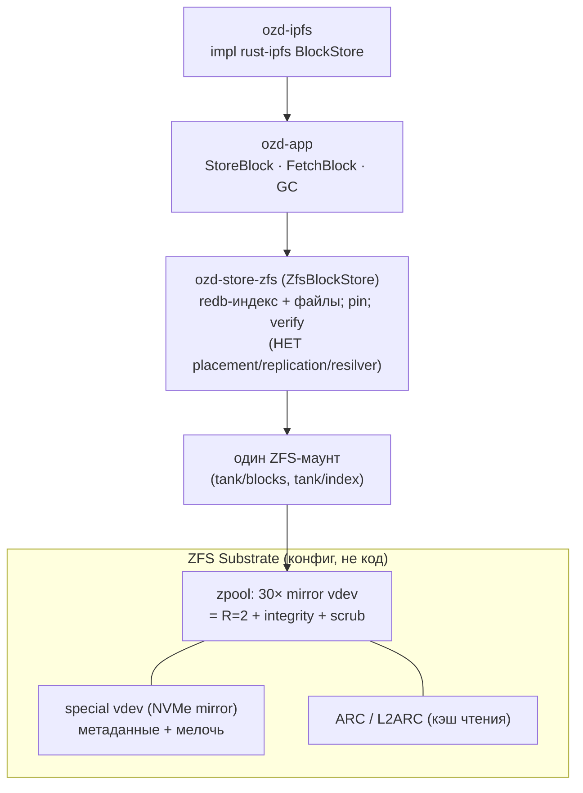
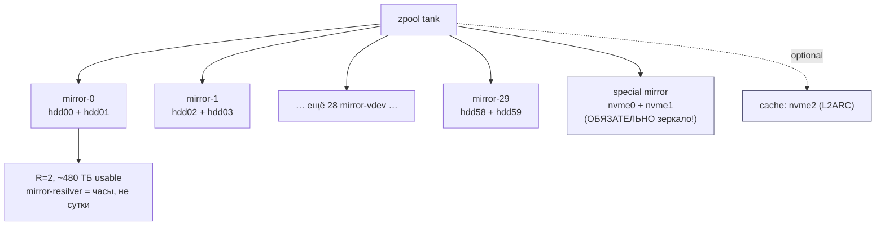
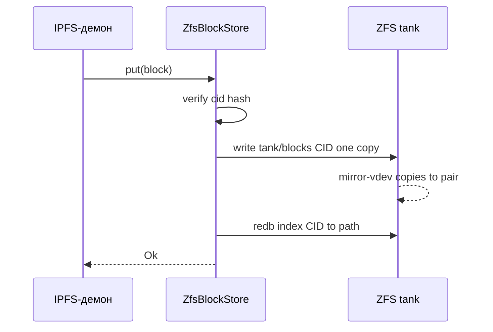
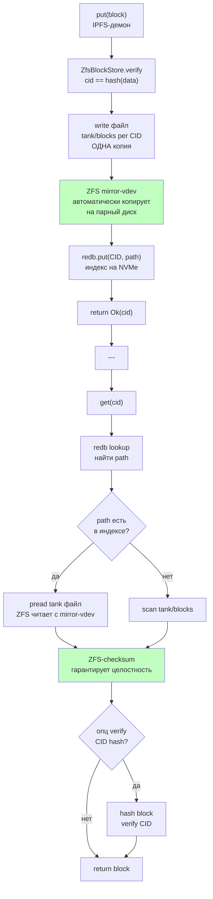
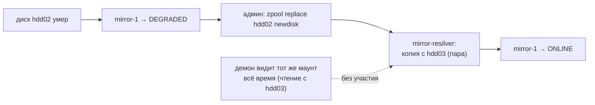

# Architecture (Variant B) — ZFS владеет субстратом, демон тонкий

> Альтернатива основной [ARCHITECTURE.md](ARCHITECTURE.md) (Variant A: XFS + app-репликация).
> Выбор между ними — [ADR 0001](adr/0001-storage-substrate.md). Здесь — **«философия ZFS»**:
> пулинг, избыточность, целостность, кэш и компрессию отдаём OpenZFS, а демон сводим к
> IPFS/S3-логике поверх одного ZFS-маунта. Движок индекса — **redb**.

Ирония по имени проекта: «OpenZFS Daemon» в этом варианте читается буквально — ZFS и есть
sharded blockstore.

---

## 0. В двух словах: что меняется относительно Variant A

| Ответственность | Variant A (XFS) | **Variant B (ZFS)** |
|---|---|---|
| Объединение 60 дисков в один стор | **наш код** (Pool, HRW) | **ZFS** (vdev striping) |
| Избыточность R=2 | **наш код** (репликация) | **ZFS** (mirror vdev) |
| Целостность / bit-rot | **наш код** (CID-verify + scrub) | **ZFS** (checksum + scrub + self-heal) |
| Восстановление после отказа | **наш код** (walk-resilver) | **ZFS** (mirror resilver) |
| Кэш мелочи на SSD | **наш код** (index на NVMe) | **ZFS** (special vdev + ARC/L2ARC) |
| Компрессия / снапшоты | нет | **ZFS** (lz4 / snapshots) |
| Что пишем мы | весь sharded-слой | **тонкий blockstore + IPFS/S3** |

**Главное следствие:** из core-домена исчезают `PlacementPolicy`, репликация и
`ResilverService` — их выполняет ZFS. Демон сильно худеет; сложность уходит в **конфигурацию
пула** и **ZFS-тюнинг**, а не в Rust-код.

---

## 1. Bounded Contexts (ужатые)

```
┌────────────────────────────────────────────────────────────────────┐
│                     OpenZFS Daemon (Variant B)                     │
│                                                                    │
│  ┌───────────────────┐  BlockStore port  ┌──────────────────────┐  │
│  │  IPFS Node CTX    │ ────────────────► │  Block Storage CTX   │  │
│  │  rust-ipfs        │                   │  (ТОНКИЙ):           │  │
│  │  libp2p/Bitswap/  │ ◄──────────────── │  redb-index + файлы  │  │
│  │  DHT/UnixFS/RPC   │   blocks          │  Pin · GC · verify   │  │
│  └───────────────────┘                   └──────────┬───────────┘  │
│                                                     │ файловые ops │
│                                          ┌──────────▼────────────┐ │
│                                          │   ZFS Substrate CTX   │ │
│                                          │  (GENERIC, конфиг!):  │ │
│                                          │  zpool · vdev · ARC · │ │
│                                          │  special · scrub      │ │
│                                          └───────────────────────┘ │
└────────────────────────────────────────────────────────────────────┘
```

| Контекст | Тип | В Variant B |
|---|---|---|
| **Block Storage** | Core | ужат: redb-индекс, запись/чтение файлов, pin, GC, опц. verify |
| **ZFS Substrate** | **Generic / Configured** | НЕ код — это `zpool`/`zfs set`. Даёт пул, R=2, integrity, кэш |
| **IPFS Node** | Generic / Upstream | `rust-ipfs`, как и в Variant A |
| **Admin / Observability** | Supporting | метрики ZFS (`zpool status`, `arcstat`) + app-метрики |

> Storage Pool / Topology как **наш** контекст исчезает: топологией управляет ZFS-админ
> (`zpool add/replace/attach`), а не наш `RebalanceService`.

---

## 1-bis. Архитектурные диаграммы (Mermaid)

### B1. Тонкий демон над ZFS (сложность ушла в субстрат)



### B2. Топология пула: 30 mirror-vdev + special NVMe



### B3. Запись/чтение — демон пишет ОДНУ копию, ZFS зеркалит

**Последовательность:**



**Детали:**



### B4. Отказ диска → ZFS resilver (демон не участвует)



---

## 2. Топология пула под 60 × HDD (ключевое решение этого варианта)

### 2.1 Выбор vdev-раскладки

| Раскладка | Usable (60×16ТБ) | Random IOPS | Resilver | Вердикт для IPFS-мелочи |
|---|---|---|---|---|
| **30× mirror (2-way)** | ~480 ТБ (R=2) | ✅ высокий (читает с обеих половин, 30 vdev) | ✅ быстрый (копия 1 диска) | **рекомендуется** |
| 6× raidz2 (8+2) | ~768 ТБ | ❌ ~1 диск/vdev | ❌ сутки, рискованно | только если IO в основном sequential |
| dRAID2 (distributed spare) | ~по конфигу | ⚠️ паритетные лимиты | ✅ быстрее raidz | компромисс для очень многих дисков |

Для content-addressed мелких блоков на HDD **random IOPS и скорость resilver важнее ёмкости** →
**mirror vdevs**. raidz/dRAID — если приоритет ёмкость и поток крупных S3-объектов.

> mirror resilver копирует данные **только умершего диска** с его пары (часы), а не пересчитывает
> весь vdev как raidz (сутки) — на 60 HDD это решающе для окна уязвимости.

### 2.2 Спец-устройства (SSD/NVMe)

- **special vdev (ОБЯЗАТЕЛЬНО зеркало NVMe):** метаданные + (опц.) мелкие блоки
  (`special_small_blocks`). Это **постоянное хранилище, не кэш** — его потеря рушит пул, поэтому
  только mirror. Снимает HDD-seek на метаданных. ⚠️ если заполнится — спил на HDD.
- **ARC (RAM):** адаптивный read-кэш. На 60 HDD/~480 ТБ закладываем **128–256 ГБ+ RAM**.
- **L2ARC (опц. NVMe):** расширение read-кэша для горячего набора блоков.
- **SLOG (опц.):** только если будет sync-heavy запись (IPFS-блоки в основном async).
- **Direct I/O (OpenZFS 2.3):** для NVMe-устройств — bypass ARC, меньше двойного кэширования.

---

## 3. Datasets и redb-on-ZFS (тонкое место!)

**Проблема:** redb — сам copy-on-write B-tree (постранично, ~4 КБ). Поверх ZFS (тоже CoW)
получается **двойной CoW**: правка одной 4 КБ-страницы в dataset с `recordsize=128K` =
read-modify-write целой записи → write amplification + фрагментация. Игнорировать нельзя.

**Решение — разделить datasets с разным `recordsize`:**

| Dataset | Содержимое | recordsize | Носитель | Почему |
|---|---|---|---|---|
| `tank/index` | redb-файлы (индекс CID) | **8–16K** (≈ redb page) | special/NVMe | убирает RMW-амплификацию на in-place |
| `tank/blocks` | тела блоков, файлами | **1M** | HDD mirror | крупный seq-доступ, лучшая компрессия |
| `tank/pins` | pin-set, метаданные | 16–32K | special/NVMe | мелкие частые правки |

Альтернатива (проще и надёжнее): **redb-индекс держать на отдельном NVMe вне ZFS** (или на
NVMe-only zpool), а на ZFS-HDD пуле — только тела блоков. Тогда двойной CoW не возникает вовсе,
а ZFS отвечает за durable+redundant bulk-данные. Это «two-tier», как в Variant A, но избыточность
блоков даёт ZFS, а не app.

**Свойства datasets (общие):**
```
compression=lz4        # дёшево; zstd-3 если данные сжимаемы
dedup=off              # CID уже дедуплицирует; ZFS-dedup только ест RAM
atime=off
xattr=sa
ashift=12              # 4K-сектора HDD
redundant_metadata=most
# blocks: logbias=throughput; index: primarycache=all (хотим индекс в ARC)
```

---

## 4. Core-домен (ужатый)

```
        ┌───────────────────────────────────────┐
        │           BlockStore (порт)           │  тот же, что у IPFS-узла
        └───────────────────┬───────────────────┘
                            │
        ┌───────────────────▼────────────────────┐
        │   ZfsBlockStore (единственная реализ.) │
        │   - index: redb (CID → путь, size)     │
        │   - data : файлы на ZFS-маунте         │
        │   put/get/has/delete/list · pin · gc   │
        │   (НЕТ placement/replication/resilver) │
        └────────────────────────────────────────┘
```

- **Нет агрегата `Pool` и `Shard`** в прежнем смысле — диск не виден приложению, есть один
  ZFS-маунт. «Шардинг» = striping ZFS по mirror-vdev'ам, прозрачно.
- **VO/Entity:** `Cid`, `Block`, `BlockData`, `Pin`. Без `ShardId`, `PlacementKey`.
- **Доменные сервисы:** `GarbageCollector` (mark-sweep по pin), `IntegrityPolicy`
  (что верифицируем сами, что доверяем ZFS — см. §5). **Удалены:** `PlacementPolicy`,
  `ResilverService`, `CapacityBalancer`.

### Порт (упрощён)
```rust
pub trait BlockStore: Send + Sync {
    async fn put(&self, block: Block) -> Result<Cid>;
    async fn get(&self, cid: &Cid) -> Result<Option<Block>>;
    async fn has(&self, cid: &Cid) -> Result<bool>;     // redb-индекс
    async fn delete(&self, cid: &Cid) -> Result<()>;
    async fn list(&self) -> BlockStream;                 // обход redb
}
// ShardEngine/PlacementPolicy/Catalog НЕ нужны — это делает ZFS + один redb-индекс.
```

---

## 5. Потоки, отказы, целостность (что теперь делает ZFS)

| Сценарий | Variant B (ZFS) |
|---|---|
| `StoreBlock` | verify(cid==hash) → записать файл блока на `tank/blocks` → запись в redb-индекс. **Одна копия** (ZFS-mirror сделает вторую сам). Без HRW/quorum |
| `FetchBlock` | redb → путь → read файла. CID-verify **опционален**: ZFS-checksum уже гарантирует, что прочитан ровно записанный байт-в-байт блок |
| Отказ диска | **ZFS**: vdev degraded → `zpool replace` → mirror-resilver. Демон не замечает (видит тот же маунт) |
| Bit-rot | **ZFS checksum** ловит при чтении и **self-heal** с зеркала автоматически. App-scrub не обязателен |
| Scrub | **`zpool scrub`** (cron, раз в месяц) — заменяет наш `ScrubService` |
| GC | **наш** mark-sweep по pin (ZFS этого не знает — это семантика IPFS) |
| Бэкап/версии | **ZFS snapshots** + `zfs send` (incremental) |

> Целостность: ZFS гарантирует «вернётся то, что записали, или ошибка». Но он **не** проверяет,
> что `data == hash(CID)` (это семантика IPFS). Поэтому verify-on-write оставляем; verify-on-read
> можно выключить (доверяем ZFS-checksum) ради перфа.

---

## 6. Воркспейс (тоньше, чем Variant A)

```
openzfs-daemon/
├── crates/
│   ├── ozd-domain/      # Cid, Block, Pin, BlockStore trait, GC. БЕЗ placement/shard.
│   ├── ozd-app/         # use cases: StoreBlock, FetchBlock, RunGc (без resilver/addshard)
│   ├── ozd-store-zfs/   # ZfsBlockStore: redb-индекс + файлы на ZFS-маунте
│   ├── ozd-ipfs/        # inbound: impl rust-ipfs BlockStore + ACL
│   ├── ozd-admin/       # RPC/CLI: store status, gc; проксирование `zpool status`/`arcstat`
│   └── ozd-daemon/      # bin: config (zfs mountpoint, index path), wiring
└── docs/
```

Нет `ozd-engine` (multi-tier), нет placement/resilver-кода. **Меньше кода — больше ops-конфига.**

---

## 7. Sub-variant B2 — ZFS под диском + app-репликация (гибрид)

Если хочется **и** ZFS-целостность/компрессию **на каждом диске**, **и** наш контроль размещения:

- 60 одиночных zpool'ов (по 1 диску), `copies=1`.
- App возвращает HRW top-R и репликацию из Variant A (R=2 по дискам).
- ZFS на каждом диске = детектор bit-rot: при порче отдаёт EIO → app лечит с другой реплики.

**Минусы:** общий special vdev невозможен (60 пулов); ZFS-overhead остаётся; по сути это
Variant A, где XFS заменён на ZFS-per-disk — выигрыш только в per-disk checksum/compression,
ценой RAM/перфа. Берут редко; основной ZFS-путь — это B1 (§1–6).

---

## 8. Плюсы / минусы и когда выбирать (vs Variant A)

**За Variant B (ZFS):**
- Радикально меньше нашего кода: нет placement/replication/resilver — это самые сложные и
  баг-опасные части. ZFS их делает зрело и проверенно.
- Встроенные integrity + self-heal + компрессия + снапшоты + ARC «из коробки».
- Быстрый mirror-resilver; прозрачное `zpool replace`.

**Против (платим):**
- ZFS-overhead на запись (~10–30%) и RAM-голод (128–256 ГБ+). Смягчается тем, что
  IPFS-блоки **immutable, запись редкая** — главный ZFS-штраф (random in-place) почти не наш кейс.
- Двойной CoW для redb → обязательный per-dataset тюнинг или вынос индекса на NVMe (§3).
- Идёт **против консенсуса** S3-эко (RustFS/MinIO рекомендуют XFS) — но тот консенсус про
  app-redundancy на NVMe; для одного HDD-сервера с упором на надёжность ZFS оправдан.
- Один большой пул = одна область отказа на уровне пула (метаданные/special); дисциплина бэкапов.
- **Не масштабируется на multi-host** само по себе (ZFS — один сервер). Для кластера нужен
  Variant A с сетевой app-репликацией.

**Выбирай Variant B, если:** один сервер надолго; целостность/компрессия/снапшоты ценнее
максимального перфа; команда уверена в эксплуатации ZFS; запись умеренная (immutable-блоки).
**Иначе** — Variant A (XFS + app), особенно при планах на multi-host.

---

## 9. Конфиг-шпаргалка (OpenZFS 2.3, 60 HDD + NVMe)

```bash
# Пул: 30 mirror-vdev'ов + зеркальный special NVMe (+ опц. L2ARC)
zpool create -o ashift=12 tank \
  mirror /dev/hdd00 /dev/hdd01 \
  mirror /dev/hdd02 /dev/hdd03 \
  ... (всего 30 пар) ... \
  special mirror /dev/nvme0 /dev/nvme1            # ОБЯЗАТЕЛЬНО зеркало!
# zpool add tank cache /dev/nvme2                 # опц. L2ARC

# Глобальные свойства
zfs set compression=lz4 dedup=off atime=off xattr=sa redundant_metadata=most tank

# Тела блоков: крупный recordsize, на HDD
zfs create -o recordsize=1M -o logbias=throughput tank/blocks

# redb-индекс: мелкий recordsize, на special/NVMe, держим в ARC
zfs create -o recordsize=16K -o primarycache=all \
           -o special_small_blocks=16K tank/index
# (или: redb-индекс на отдельном NVMe-пуле вне tank — без двойного CoW)

# Эксплуатация
zpool scrub tank          # cron: раз в месяц
zfs snapshot tank/blocks@$(date)   # бэкап-точки; zfs send для репликации офсайт
```

> `special_small_blocks` подбирать осторожно и мониторить заполнение special vdev: при переполнении
> новые мелкие блоки уйдут на HDD (потеря ускорения), данные не теряются.
