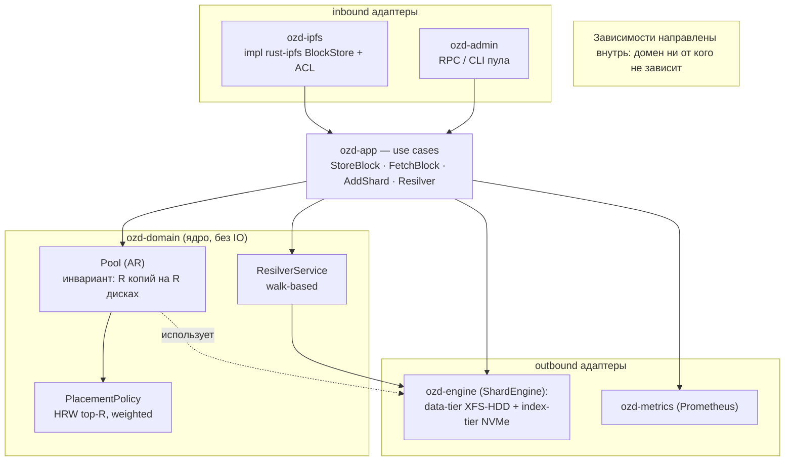
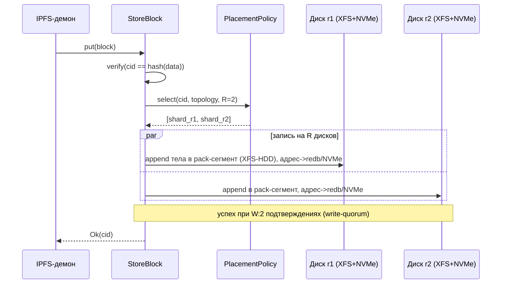
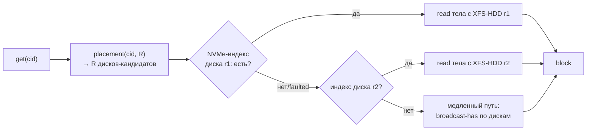
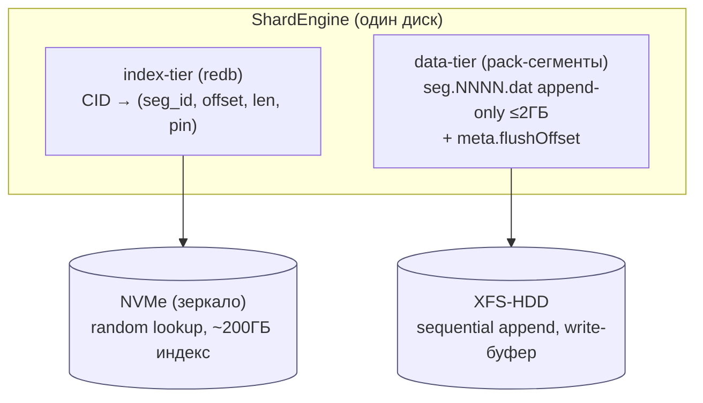
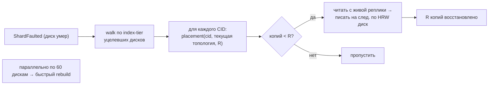
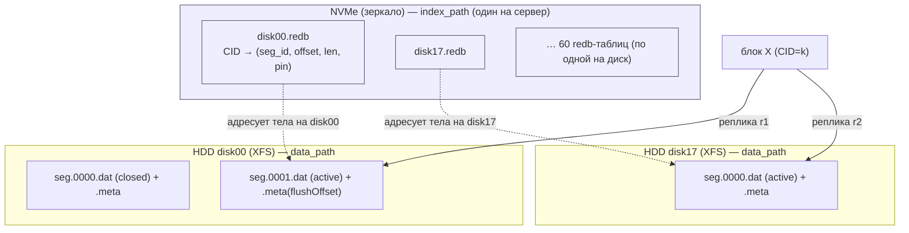
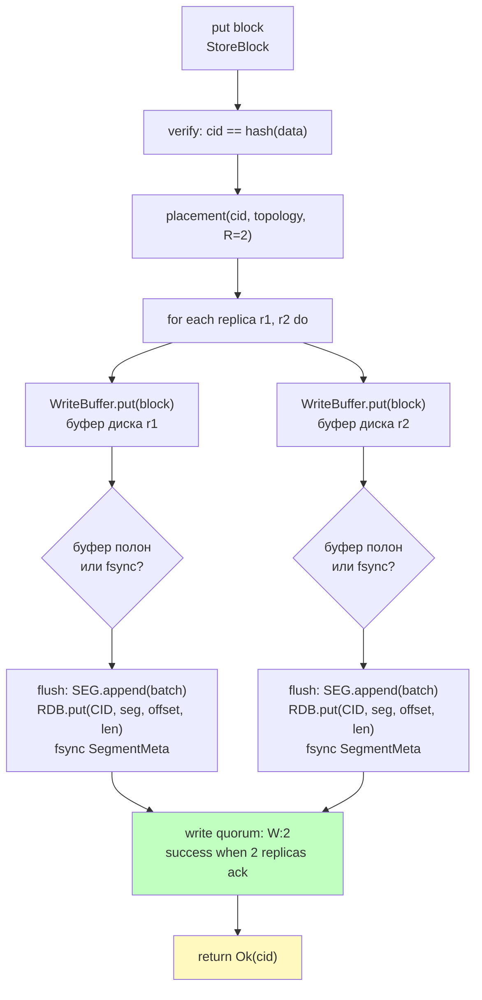
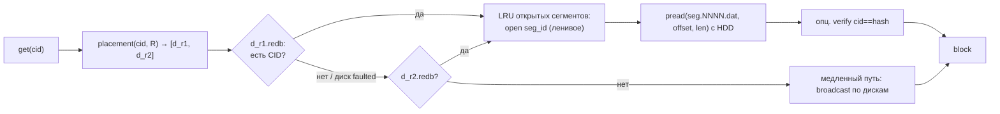
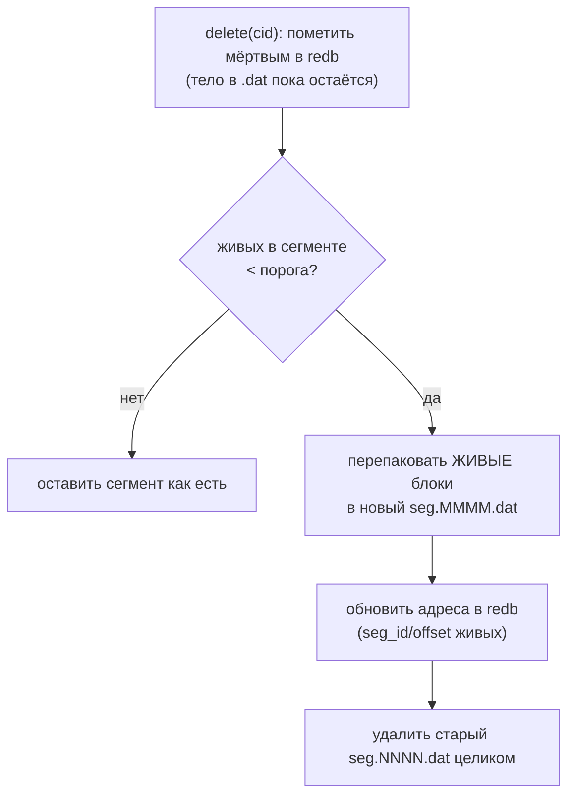

# Architecture — OpenZFS Daemon (Часть 1) · Variant A (XFS)

```
╔══════════════════════════════════════════════════════════════════════════════════════════╗
║          ozd — HELICOPTER VIEW  ·  Domain-Driven Design  ·  Hexagonal Architecture       ║
╚══════════════════════════════════════════════════════════════════════════════════════════╝

  ФИЛОСОФИЯ: домен не знает о дисках. Диски не знают о IPFS. Адаптеры склеивают.
  ЦЕЛЬ: один IPFS-демон → единый BlockStore → физически 60 HDD + NVMe (JBOD, ADR-0001).

╔══════════════════════════════════════════════════════════════════════════════════════════╗
║  UPSTREAM (Generic)            DRIVING PORTS           CORE DOMAIN                       ║
║                                                                                          ║
║  ┌──────────────────────┐      ┌─────────────┐   ┌─────────────────────────────────┐     ║
║  │   Kubo (IPFS daemon) │      │  BlockStore │   │       Block Storage CTX         │     ║
║  │   go-ds-s3 plugin    │─────►│    port     │──►│  *** CORE DOMAIN ***            │     ║
║  │   S3 API calls       │      │  (trait)    │   │                                 │     ║
║  └──────────────────────┘      └─────────────┘   │  put(key, bytes)                │     ║
║                                                  │  get(key) -> bytes              │     ║
║  ┌──────────────────────┐      ┌─────────────┐   │  delete(key)                    │     ║
║  │   Admin / Ops        │      │  AdminPort  │   │                                 │     ║
║  │   curl /admin/*      │─────►│  (REST)     │──►│  Invariants:                    │     ║
║  │   Prometheus scrape  │      └─────────────┘   │  · CID == hash(data) всегда     │     ║
║  └──────────────────────┘                        │  · R копий на R разных дисках   │     ║
║                                                  │  · без центрального каталога    │     ║
╠══════════════════════════════════════════════════│  · placement детерминирован     ║     ║
║  DRIVEN PORTS (secondary)                        └─────────────┬───────────────────┘     ║
║                                                                │                         ║
║  ┌───────────────────────────────────────────────┐             │  domain services        ║
║  │           ShardEngine port (trait)            │◄────────────┘                         ║
║  │  put / get / delete / capacity / gc / scrub   │  Pool implements:                     ║
║  │  resilver / scan_segment / stat_obj           │  · HRW placement (free-weight)        ║
║  └───────────┬───────────────────┬───────────────┘  · R=2 mirror / erasure 4+2           ║
║              │                   │                   · write-quorum W:2                  ║
║              │                   │                   · hedged read + handoff             ║
║  ┌───────────▼──────┐  ┌─────────▼──────────┐        · GC · Scrub · Resilver             ║
║  │  DiskEngine      │  │  ZfsRunner         │        · HealQueue · BgThrottle            ║
║  │  (ozd-engine)    │  │  (ozd-zfs)         │        · DiskSlowMonitor · RollingP99      ║
║  │                  │  │                    │                                            ║
║  │ pack-segs ≤2GB   │  │ zpool status       │                                            ║
║  │ redb CID-index   │  │ HealthFsm 4-state  │                                            ║
║  │ CRC32 / zstd     │  │ Properties+Source  │                                            ║
║  │ addr v3 (36B)    │  │ drift-audit        │   ┌──────────────────────────────────────┐ ║
║  │ ballast / WAL-fo │  │ user-props ozd:*   │   │  CacheTier — SuperDisk (E25)         │ ║
║  │ fadvise DONTNEED │  │ freeing→eff_free   │   │  NVMe read-leg (Discord-style)       │ ║
║  └───────────┬──────┘  └─────────┬──────────┘   │  write-through · FIFO eviction       │ ║
║              │                   │              │  single-flight coalescing            │ ║
╠══════════════│═══════════════════│══════════════│══════════════════════════════════════╣ ║
║  PHYSICAL    │                   │              └──────────────────┬───────────────────┘ ║
║  STORAGE     ▼                   ▼                                 ▼                     ║
║                                                                                          ║
║  ┌───────────────────────────────────────┐   ┌────────────────────────────────────────┐  ║
║  │  60 × HDD  (JBOD, XFS per disk)       │   │  NVMe SSD                              │  ║
║  │  append-only pack-segments ≤ 2 GB     │   │  redb: CID → (seg, offset, len)        │  ║
║  │  per-disk ZFS pool (ozd-zfs health)   │   │  CacheTier segments (SuperDisk)        │  ║
║  │  ~480 TB usable при R=2               │   │  T_CURSOR · ballast.bin                │  ║
║  └───────────────────────────────────────┘   └────────────────────────────────────────┘  ║
║                                                                                          ║
║  DDD-слои:  [Domain] ozd-domain  ·  [Application] ozd-app  ·  [Infra] ozd-engine         ║
║             [Ports]  BlockStore · ShardEngine · PlacementPolicy  (traits, no I/O)        ║
║             [Adapters] DiskEngine · ZfsRunner · CacheTier · S3Gateway · AdminRest        ║
╚══════════════════════════════════════════════════════════════════════════════════════════╝
```


DDD + гексагональная архитектура (ports & adapters). Цель Части 1: **один IPFS-демон,
blockstore которого физически распределён (sharded) по нескольким дискам**, но логически —
единый. Документ проектирует это от домена к инфраструктуре.

> Это **Variant A** (выбран в [ADR 0001](adr/0001-storage-substrate.md)): XFS + JBOD, демон
> владеет пулингом/репликацией/целостностью. Альтернатива, где всё это отдано ZFS, —
> [ARCHITECTURE-ZFS.md](ARCHITECTURE-ZFS.md) (Variant B).

---

## 1. Bounded Contexts

```
┌──────────────────────────────────────────────────────────────────┐
│                      OpenZFS Daemon                              │
│                                                                  │
│  ┌──────────────────┐   BlockStore port   ┌────────────────────┐ │
│  │ IPFS Node CTX    │ ──────────────────► │  Block Storage CTX │ │
│  │ (upstream/given) │                     │   *** CORE ***     │ │
│  │ libp2p, Bitswap, │ ◄────────────────── │   Pool · Placement │ │
│  │ DHT, UnixFS, RPC │   blocks/events     │   Shard · Resilver │ │
│  └──────────────────┘                     └──────────┬─────────┘ │
│                                                      │           │
│                         ┌────────────────────────────┼──────────┐│
│                         │     Storage Pool CTX       │ Admin CTX││
│                         │  (топология дисков,        │ (метрики,││
│                         │   health, add/remove,      │  RPC,    ││
│                         │   rebalance/scrub)         │  CLI)    ││
│                         └────────────────────────────┴──────────┘│
└──────────────────────────────────────────────────────────────────┘
```

| Контекст | Тип | Ответственность | В Части 1 |
|---|---|---|---|
| **Block Storage** | **Core Domain** | sharded blockstore: placement, put/get/has/delete, целостность | проектируем глубоко |
| **Storage Pool / Topology** | Supporting | набор дисков (vdev), capacity, health, online/faulted, rebalance | базово |
| **IPFS Node** | Generic / Upstream | сеть, Bitswap, DHT, UnixFS, RPC. Берём `rust-ipfs` | реиспользуем |
| **Admin / Observability** | Supporting | метрики, health-check, админ-команды над пулом | минимально |

> **Context mapping:** IPFS Node ⇄ Block Storage — отношение **Conformist + ACL**.
> Мы реализуем trait `BlockStore` из `rust-ipfs` (conformist к его сигнатуре), а внутри
> через Anti-Corruption Layer переводим его типы (`Cid`, `Block`) в наши доменные VO.

---

## 1-bis. Архитектурные диаграммы (Mermaid)

### A1. Гексагон: порты и адаптеры (зависимости внутрь)



### A2. Запись блока — StoreBlock (HRW top-R + два tier'а + quorum W)



### A3. Чтение блока — FetchBlock (без каталога, по placement)



### A4. Два tier'а движка (где что лежит)



### A5. Потеря диска → walk-based resilver (восстановление R копий)



---

## 2. Core Domain — Block Storage Context

### 2.1 Доменная модель

```
                       ┌──────────────────────────────┐
                       │          Pool  (AR)           │  Aggregate Root
                       │  - placement: PlacementPolicy │
                       │  - shards: Map<ShardId, Shard>│
                       │  + put(Block) / get(Cid)      │
                       │  + locate(Cid) -> ShardId     │
                       │  inv: топология консистентна  │
                       └───────┬───────────────┬───────┘
                               │ 1..*          │ uses
                       ┌───────▼──────┐  ┌──────▼─────────────┐
                       │  Shard (E)   │  │ PlacementPolicy(DS)│ Domain Service
                       │ id,path,caps │  │  HRW / Modulo      │
                       │ status,used  │  │  weighted          │
                       └──────────────┘  └────────────────────┘

   Value Objects: Cid · BlockData · Block · ShardId · Capacity · ShardStatus
   Domain Events: BlockStored · BlockEvicted · ShardOnline · ShardFaulted ·
                  RebalanceStarted · RebalanceCompleted · IntegrityViolation
```

#### Aggregate Root — `Pool`
Гарантирует инварианты единого логического стора:
- каждый `Cid` при текущей топологии разрешается в **R различных** `Shard` (replication
  factor R; при R=1 — одна копия). R дисков выбираются детерминированно (top-R по HRW);
- запись идёт только на `Online`/`ReadWrite` шарды; успех при наборе **write-quorum W ≤ R**;
- топология (множество шардов + веса) — единственный источник правды для placement;
- цель самоисцеления: для каждого блока поддерживать R здоровых копий (resilver).

> `replication_factor` (R) и `write_quorum` (W) — параметры пула в конфиге. По умолчанию
> R=2, W:2 (как mirror). Реплики обязаны лежать на разных физических дисках (а в идеале —
> в разных failure domains; в Части 1 достаточно «разные диски»).

#### Entity — `Shard` (= один диск, vdev)
`{ id, mount_path, capacity, used, status, engine }`.
Статусы (ZFS-подобно): `Online · Degraded · Faulted · ReadOnly · Removed`.

#### Value Objects
- `Cid` — обёртка над `cid::Cid` (multihash + codec), иммутабельна.
- `BlockData` — байты блока (`Bytes`), иммутабельны.
- `Block = { cid, data }` — целостность: `data` хэшируется в `cid`.
- `ShardId` — стабильный идентификатор диска (UUID в метке диска, **не** индекс!).
- `Capacity { total, free }`, `ShardStatus`.

> **Почему `ShardId` — UUID, а не индекс 0..N:** индекс ломается при добавлении/удалении
> диска и при разном порядке монтирования. Стабильный ID диска делает placement
> воспроизводимым между перезапусками.

### 2.2 Ключевое решение: функция placement

Наивный путь из ТЗ — `hash(CID) % N`. Проблема: при изменении числа дисков `N → N±1`
**почти все** блоки меняют целевой диск.

| Стратегия | Доля блоков, которые «переезжают» при +1 диске |
|---|---|
| `hash(CID) % N` (modulo) | ≈ `N/(N+1)` — почти 100% |
| **Rendezvous (HRW) hashing** | ≈ `1/(N+1)` — минимум |
| Consistent hashing (ring) | ≈ `1/(N+1)`, но хуже балансируется без vnodes |

**Решение:** `PlacementPolicy` — доменный сервис (порт) с реализациями.
По умолчанию — **Rendezvous (Highest Random Weight), взвешенный по свободному месту**.
HRW идеален для репликации: он даёт **ранжированный список** шардов, и top-R — это и есть
R реплик. Добавление/удаление диска меняет ранжирование локально (≈`1/(N+1)` блоков).

```rust
// crates/ozd-domain/src/placement.rs
pub trait PlacementPolicy: Send + Sync {
    /// Детерминированно выбрать R различных шардов для CID (R реплик), по убыванию score.
    /// rf = 1 → одна копия. Возвращает min(rf, online_shards) шардов.
    fn select(&self, cid: &Cid, topology: &[ShardWeight], rf: usize) -> Vec<ShardId>;
}

pub struct ShardWeight { pub id: ShardId, pub weight: f64 } // weight ~ free space

pub struct RendezvousHrw;
impl PlacementPolicy for RendezvousHrw {
    fn select(&self, cid: &Cid, topology: &[ShardWeight], rf: usize) -> Vec<ShardId> {
        let mut scored: Vec<_> = topology.iter()
            // score = weighted HRW: -weight / ln(h01(cid, shard))
            .map(|s| (s.id, weighted_score(cid, s)))
            .collect();
        scored.sort_by(|a, b| b.1.total_cmp(&a.1));   // по убыванию
        scored.into_iter().take(rf).map(|(id, _)| id).collect()
    }
}
```

> При выпадении диска из топологии «съезжает» вниз только его позиция в ранжировании —
> остальные реплики стабильны. Это и делает resilver дешёвым (восстанавливаем только
> недостающую R-ю копию, а не пересчитываем всё).

> Для MVP допустимо начать с `Modulo`, но интерфейс сразу делаем под HRW, чтобы
> переход не ломал API. См. PLAN, Фаза 2.

> `PlacementPolicy` — **подключаемая стратегия** (паттерн Druid `StorageLocationSelector`): дефолт —
> HRW взвешенный по свободному месту (≈ least-bytes-used), альтернативы — modulo/round-robin/random.
> Druid независимо подтверждает «спред по дискам по свободному месту» как правильный выбор.

### 2.3 Размещение без центрального каталога (решено)

На масштабе ~3,8 млрд блоков (см. §8) центральный per-CID каталог = 150–250 ГБ горячего
индекса и единая точка отказа. **Решение: центрального каталога нет.**

- **Источник правды о расположении — детерминированный `placement(cid, topology, R)`.**
  Где должен лежать блок, всегда вычисляется, а не хранится.
- **У каждого диска свой локальный индекс** (index-tier на NVMe, см. §4.2): диск знает CID,
  которые на нём лежат. Это `has`/`get`/`iter` по одному диску, random-lookup без HDD-seek.
- Глобальный индекс `CID → диски` **не нужен** — он выводится: `placement` даёт R дисков-
  кандидатов, опрашиваем их локальные индексы.
- **★ Self-describing per-disk метаданные + quorum-pick-latest (паттерн RustFS `xl.meta`):** локальный
  индекс/мета каждого диска **самодостаточны** (CID → адрес + checksum [+ erasure-конфиг/distribution в
  Части 2]) → состояние пула **полностью восстановимо обходом дисков** (это и есть «каталога нет»). При
  расхождении R копий (версия/mod-time после краша/handoff) актуальная версия выбирается **кворумом**
  (`read_all` метаданных реплик → consensus по mod_time/etag → pick-latest), а не «первой живой».

**Запись:** `shards = placement(cid, topology, R)` → `put` на R дисков (quorum W); каждый диск
сам фиксирует CID в своём локальном индексе.
**Чтение/has:** `placement(cid, R)` → опросить эти R дисков, читать с **первой живой** реплики.
**Резервный путь** (рассинхрон/деградация): broadcast-`has` по всем дискам.

**Изменение топологии → walk-based resilver** (без каталога): пройти локальные индексы
уцелевших дисков, для каждого CID пересчитать `placement` в текущей топологии и докопировать
недостающие реплики. Так восстанавливается R после потери диска и выполняется rebalance при
добавлении. Дорого по IO, но размазывается по 60 дискам и идёт в фоне (см. §8.3).

> Trade-off, который мы принимаем: за отсутствие гигантского индекса платим тем, что смена
> топологии требует прохода по данным (resilver), а не правки одной таблицы. На 60 HDD это
> выгодный обмен. Компактный учёт недо-реплицированности (битмапы) — опц. оптимизация Части 2.

### 2.4 Доменные сервисы

- `PlacementPolicy` — выбор top-R шардов (см. выше).
- `ResilverService` (объединяет rebalance + heal) — **walk-based**: при изменении топологии или
  отказе диска проходит локальные индексы уцелевших дисков, пересчитывает `placement` и
  докопировает недостающие реплики до R. ZFS-аналог: *resilver* mirror-vdev.
- `ScrubService` — фоновый проход: читает блок, пере-хэширует, сверяет с `Cid`; при
  расхождении → событие `IntegrityViolation`. ZFS-аналог: *scrub*.
- `GarbageCollector` — mark-and-sweep по множеству `Pin`; по-шардовая зачистка.
- `CapacityBalancer` — пересчёт весов шардов по свободному месту (вход для placement).

### 2.5 Порты домена (traits)

```rust
// Главный порт, который потребляет IPFS Node CTX:
pub trait BlockStore: Send + Sync {
    async fn put(&self, block: Block) -> Result<Cid>;
    async fn get(&self, cid: &Cid) -> Result<Option<Block>>;
    async fn has(&self, cid: &Cid) -> Result<bool>;
    async fn delete(&self, cid: &Cid) -> Result<()>;
    async fn list(&self) -> BlockStream;          // обход всех шардов
}

// Порт per-disk движка (один диск). Содержит ЛОКАЛЬНЫЙ индекс CID этого диска —
// отдельного центрального каталога нет (см. §2.3):
pub trait ShardEngine: Send + Sync {
    async fn put(&self, cid: &Cid, data: &BlockData) -> Result<()>;
    async fn get(&self, cid: &Cid) -> Result<Option<BlockData>>;
    async fn has(&self, cid: &Cid) -> Result<bool>;   // локальный индекс диска
    async fn delete(&self, cid: &Cid) -> Result<()>;
    async fn iter(&self) -> CidStream;                 // вход для walk-based resilver
    async fn usage(&self) -> Result<Capacity>;         // для весов placement
}
// Caталога как порта НЕТ: «где блок» = placement(cid, R) → опрос локальных индексов R дисков.
```

---

## 3. Application Layer (use cases)

Тонкие сервисы, оркестрируют домен + порты. Без бизнес-логики хранения.

| Use case | Поток |
|---|---|
| `StoreBlock` | verify(cid==hash(data)) → `placement(R)` → `put` на R дисков параллельно → успех при ≥W → emit `BlockStored`; недостающие реплики при деградации добьёт `ResilverService` |
| `FetchBlock` | `placement(cid, R)` → `ShardEngine.get` с **первой живой** реплики (по HRW) → (опц.) verify → return |
| `HasBlock` | `placement(cid, R)` → `has` на любой из R дисков |
| `DeleteBlock` | `placement(cid, R)` → `delete` на **всех** R дисках (локальные индексы сами обновятся) |
| `AddShard` | валидация диска → `Pool.attach(shard)` → пересчёт весов → запуск `Resilver` (фон, walk) |
| `RemoveShard` | пометить `Removed/ReadOnly` → walk-resilver: восстановить R копий на других дисках → detach |
| `RunScrub` / `RunGc` / `RunResilver` | фоновые доменные сервисы по расписанию/событию |

---

## 4. Infrastructure / Adapters (гексагон)

```
        INBOUND adapters                         OUTBOUND adapters
  ┌──────────────────────────┐             ┌────────────────────────────────┐
  │ ozd-ipfs:                │  ports      │ ozd-engine (ShardEngine):      │
  │ impl rust-ipfs BlockStore│◄──────────► │  data-tier XFS-HDD + idx NVMe  │
  │ ozd-admin: RPC/HTTP/CLI  │  Application│ ozd-metrics (Prometheus)       │
  └──────────────────────────┘   layer     │ fs/mount probing, fsync        │
                                           │ (центрального каталога НЕТ)    │
                                           └────────────────────────────────┘
```

### 4.1 Inbound
- **`ozd-ipfs`** — реализует `BlockStore` из `rust-ipfs` (через ACL мапит его `Cid`/`Block`
  на доменные VO) и подкладывается как `Repo` демона. IPFS-демон при этом «не знает» о шардинге.
- **`ozd-admin`** — RPC/HTTP/CLI: `pool status`, `pool add-disk`, `pool remove-disk`,
  `pool rebalance`, `pool scrub`, `pool gc`.

### 4.2 Outbound — per-disk движок: два tier'а (XFS-HDD + NVMe)
Решение по носителю — см. [ADR 0001](adr/0001-storage-substrate.md): **XFS на каждом диске
(JBOD), а горячий индекс — на отдельном NVMe.** Поэтому `ShardEngine` физически разделён:

- **Data-tier — XFS-HDD, append-only pack-сегменты.** Тела блоков пишутся подряд в сегменты
  `seg.NNNN.dat` (ротация по `segment_max_size`, деф. **2 ГБ** — как freezer go-ethereum).
  Запись идёт **через write-буфер**: блоки копятся в RAM и сбрасываются **одним батчем**
  (порог по размеру буфера или fsync-политике `N элементов / T секунд`). **Никаких in-place
  правок и не «файл-на-блок»** — это снимает inode-давление на 3,8 млрд блоков и режет
  write-amplification на HDD. Формат ФС: `mkfs.xfs -i size=512 -n ftype=1`;
  mount `inode64,logbsize=256k,noatime`. У каждого сегмента — `meta.flushOffset` (последний
  durable байт) для **crash-recovery хвоста**. Компрессия по политике: тела опц. zstd, **CID и
  хэши — никогда** (32-байтная энтропия не сжимается). Обоснование формата —
  [STORAGE-IDEAS-SYNTHESIS](Arch_DDD/HDD_SDD/STORAGE-IDEAS-SYNTHESIS.md) (TON `.pack` + geth freezer).
- **Index-tier — NVMe (redb).** Локальный индекс диска `CID → (segment_id, offset, len[, pin])`.
  ~3,8 млрд записей ≈ 150–250 ГБ на NVMe — random-lookup без HDD-seek. Это наш app-level
  «special vdev»: метаданные на SSD, bulk на HDD. Счётчик pin — через **merge-дельты** (как
  refcount в TON), без read-modify-write.
- **WAL + checkpoint для index-tier (из Ignite).** Индекс-операции пишутся в sequential WAL +
  периодический checkpoint-маркер. После краха индекс восстанавливается **replay'ем WAL с
  последнего checkpoint** (быстро), а не полным обходом 3,8 млрд блоков (это лишь фолбэк, если
  потеряны и WAL, и индекс). Durability↔throughput выбирается **WAL-режимом** `index_wal_mode`:
  `fsync` (power-loss safe) / `log_only` (переживает краш процесса) / `background` (пачками) / `none`.

> Один диск = один `ShardEngine` = (pack-сегменты на XFS-HDD) + (его таблица в redb на NVMe).
> Центрального каталога нет: «где блок» = `placement(cid, R)` → опрос index-tier этих дисков.
> NVMe-индекс — **производная** (в худшем случае пересобираема обходом сегментов), но держим его
> на **зеркале NVMe** + **WAL/checkpoint** (Ignite), чтобы после краха делать быстрый replay-дельты,
> а не полную пересборку.
> **GC — сегментами** (не точечным удалением): мёртвые блоки метятся в индексе; когда живых в
> сегменте < порога — живые **перепаковываются в новый сегмент, старый удаляется целиком**
> (компакция). Чертёж GC — **Pebble blob-rewrite**: per-block **liveness-битмап** + **refcount**
> сегмента + **age-gated rewrite**; адреса стабильны (индекс правится пачкой). Открытые сегменты
> ограничены **LRU** (контроль FD).

Дополнительно вплетено из прототипов (см. [SYNTHESIS](Arch_DDD/HDD_SDD/STORAGE-IDEAS-SYNTHESIS.md)):

- **Macro/Micro split** (OceanBase): сегмент = последовательность **микроблоков ~16КБ** — единиц
  **IO, сжатия и checksum**; адрес `(seg, micro_off, len)` указывает внутрь микро. Даёт частичное
  чтение одного микро без расжатия всего сегмента и **per-micro проверку целостности**.
- **Inline мелких тел** (порог `inline_min`, из Pebble): крошечные блоки — прямо в redb-значении,
  не в сегменте → минус seek. **Неймспейсинг index-tier** префиксами (`b|`/`p|`/`s|`, из Quorum).
- **★ Inline-split (iroh-blobs):** inline-тела хранятся **не в строке адреса** `b|cid`, а в отдельной
  таблице `i|cid` → основная таблица адресов остаётся **узкой** (фикс. `(seg,off,len)`), её `iter`/скан
  не тащит тела → быстрый обход 3,8 млрд записей. Опц. **external-reference** (`DataLocation::External`):
  индекс ссылается на готовый файл без копирования (zero-copy импорт/дедуп).
- **★ Per-CID сериализация (entity-актор, iroh-blobs):** операции на одном CID сериализуются через
  **один логический handle на хэш** (без глобальных локов) → дедуп одновременных `put` + согласование
  с read-coalescing; пул акторов **idle-recycle** (не плодить состояние на 3,8 млрд ключей).
  **Дополнение (Discord, #144):** коалесинг работает, только если дубли ключа **встречаются в одном
  воркере** — внутри демона это даёт актор; при нескольких gateway (Часть 3) обязателен
  **consistent-hash routing запросов по CID на инстанс** (иначе дубли размазаны, коалесинг мёртв).
- **★ SmallBins packing (Dragonfly):** тела между `inline_min` и ~½ страницы пакуются **по нескольку
  в одну выровненную страницу** (`N | (cid,len)×N | value×N`); страница освобождается при refcount
  живых → 0; при заполнении **<50%** — дефраг (перечитать живые + пересобрать). Закрывает зазор между
  inline (крошки) и micro/сегментом (крупное), убирая трату страниц/seek на мелочь.
- **★ O_DIRECT + io_uring для тел (Dragonfly):** опц. body-I/O через **O_DIRECT** + **io_uring** с
  пулом **pre-registered буферов** (без пере-pinning), строго **page-aligned (4КБ)** —
  «голый» body-tier без двойной буферизации. Выбор `io_backend: std|uring|direct` по `device_type`.
- **Direct-I/O политика** (RocksDB): NVMe-индекс — direct; HDD-сегменты — через page-cache.
  Опц. **dict-компрессия** похожих мелких тел; опц. **Ribbon/Bloom CID-фильтр** per-disk и
  **per-segment bloom** (OceanBase).
- **★ Гигиена page-cache (Redis):** тела пишутся через page-cache, но после flush+fsync участок
  сегмента сбрасывается `POSIX_FADV_DONTNEED` — write-once холодные тела **не вытесняют** горячий
  индекс/Summary из RAM. **Неблокирующий инкрементальный writeback** `sync_file_range` чанками ~4МБ
  (+`WAIT_BEFORE` на 2× окне) ограничивает грязные страницы (~8МБ) → **нет fsync-столла** в конце
  записи сегмента.
- **Манифест сегментов per-disk (Redis):** опись набора `seg.NNNN` (`active|sealed|pending-delete`) —
  источник правды о сегментах диска; смена набора = **атомарная перезапись манифеста**, не
  rename-на-файл. Финализация — **durable swap** `temp→fsync→rename→fsync(dir)`. `fsync`/`close`
  и удаление `pending-delete` — в **фоновом per-disk пуле** (паттерн Redis bio), горячий путь не ждёт.
- **★ Checkpoint-rollup манифеста (InfluxDB):** манифест ведём как **дельты + периодический
  checkpoint** (свёртка). Старт/recovery = **последний checkpoint + свежие дельты**, а не обход всех
  сегментов/всей истории → O(checkpoint + recent) на 3,8 млрд (как table-index merge у InfluxDB).
  Поверх WAL+checkpoint индекса.
- **★ Манифест = append-only лог + 2-фазные жизненные циклы (Tarantool vylog):** не переписывать
  манифест, а **дописывать события**; **`prepare`→`create`** (краш между → `prepare` без `create` =
  осиротевший сегмент → удалить при recovery) и **`drop`→удалить файл→`forget`** (крах-безопасное
  удаление). Единая модель «каталог-как-лог» (наш «нет central catalog»), объединяет манифест +
  двухфазный delete.
- **★ Read-coalescing (Dragonfly):** одновременные чтения одной страницы/CID на промахе кэша делят
  **один** HDD-seek (in-flight map по адресу, все читатели ждут одного I/O) → меньше дисковой нагрузки
  на горячих блоках; согласуется с delete-after-read (страница освобождается после чтений).
- **★ Zero-copy sendfile отдачи (Kafka):** непрозрачный, уже верифицированный диапазон сегмента
  отдаётся по сети через `transferTo`/`sendfile` — **page-cache → сокет без копии в user-space** (DMA);
  verified-streaming-поток (выше) — когда нужна потоковая проверка. Меньше CPU/копий на отдаче.
- **★ LazyIndex (отложенный mmap) + warm-tail (Kafka):** per-segment индекс/Summary **не mmap'ить до
  первого доступа** (быстрый старт при тысячах сегментов на 3,8 млрд блоков); бинарный поиск держит
  горячий хвост индекса резидентно (cache-friendly, меньше page-fault); LRU открытых индексов.
- **★ madvise-дисциплина + low-memory режимы (Qdrant):** `MADV_RANDOM` для индекса/Summary (lookup
  случаен); **`MADV_POPULATE_READ`** prefault'ит горячий индекс на load (тёплый старт без серии
  page-fault); **`MADV_WILLNEED`** префетчит значение, **пересекающее границы страниц**, одним syscall
  (на HDD = один seek вместо серии); парно к `MADV_DONTNEED` для write-once тел (выше). Под нехватку RAM
  — **low-memory режимы**: `no-resident` (компоненты как mmap-варианты) и `no-populate` (+skip prefault);
  байтовый формат тот же → возврат без rebuild. Дополняет LazyIndex и тиринг RAM↔mmap.
- **Температурный тиринг сегментов → `cold_path`** (RocksDB): тег сегмента (hot/cold по
  pin/частоте); холодные мигрируют на дешёвый/remote носитель. **NVMe как L2 read-кэш ТЕЛ**
  (RocksDB SecondaryCache); **multi-cache** раздельно index/тела/bloom (OceanBase). **★ idle-evict
  block-cache + weak-ref (NATS):** кэш тел/страниц грузится по доступу, выселяется по **таймеру
  простоя** (не явный LRU), GC-friendly weak-ref; **метаданные сегмента** — отдельным, более длинным
  таймером (тела ушли, Summary/bloom живут).
- **★ Declarative storage policies (ClickHouse):** тиринг как **единый конфиг** — упорядоченные тиры
  (volumes) `[hot NVMe, warm SSD, cold HDD/cold_path]`, авто-перенос сегмента в следующий тир по
  **заполнению** (`move_factor`), **размеру** (`max_segment_size_per_tier`) и **возрасту** (`move_ttl`);
  перенос clone→swap→async-delete. Объединяет температурный тиринг, disk-balancer и Druid-правила.
- **Device-type профили** (YDB) + **iotune-калибровка** (ScyllaDB): авто-определение ROT/SSD/NVMe
  И **измерение** реальных IOPS/bandwidth каждого диска при старте → drive-model по измерениям, не
  по типу. Профиль: in-flight HDD 4 / NVMe 128, reorder 50мс/1мс, `inline_min` HDD 512КБ / SSD 64КБ.
  Опц. **общий per-disk write-лог** (YDB) с **O_DSYNC + recycle** (ScyllaDB).
- **Фон — `cost-based IO-scheduler «Forseti»`** (YDB) с **drive-model из iotune** (ScyllaDB) и
  **scheduling-groups** (таксономия классов из ScyllaDB: client/commit > flush > compaction/resilver):
  `cost = seek + bytes/speed` + гейты + fair-share. Отказ диска — **disk-slow детекцией** (~5с →
  `ShardFaulted`). См. §5. **GC сегментами**: чертёж Pebble blob-rewrite + **ICS-фрагменты ~1ГБ**
  (ограничить temp-space) + **backlog-controller** (адаптивный темп) — из ScyllaDB. **Sparse in-RAM
  Summary** (ScyllaDB) — разрежённый индекс в RAM поверх redb с downsampling. **Periodic major-merge**
  и **fixed-block аллокатор** (OceanBase) — опции. Третья альт. аллокатора — **segmented size-class**
  (Dragonfly `external_alloc`, mimalloc-стиль: 256МБ-сегменты → страницы по size-class → битмап
  блоков) → точечный re-use без полной компакции. Четвёртая — **★ bitmask + per-region gap-summary**
  (Qdrant `gridstore`, Rust-референс): free-space = **битмаска 1 бит/блок**, поверх — сводка на регион
  `RegionGaps{max, leading, trailing}` (длиннейший свободный прогон + края) → **best-fit без скана всей
  битмаски** (найти регион с `max ≥ N`, скан только его), точечный re-use дырок без компакции
  (`segment_alloc: append-only|fixed-block|segmented|bitmask`).
- **Async pre-grow сегментов (Dragonfly):** следующий сегмент преаллоцируется **заранее в фоне** (при
  <15% свободного в активном) + backoff при ошибке → запись не упирается в рост файла.
- **PolarVFS-style backend-абстракция** (PolarDB): за `ShardEngine` — подключаемые бэкенды носителя
  `xfs-file` / `raw-O_DIRECT` / `remote`, выбор **по пути** (`data_path`/`index_path`/`cold_path`).
  В Части 1 — `xfs-file`; raw/remote — за тем же портом (Часть 2/3).
- **Лимиты диска (StorageLocation, Druid):** per-диск `max_size` + резерв `free_space_percent` +
  авто-вытеснение (reclaim) не-pinned при переполнении. **Декларативные load/drop-rules** (Druid):
  политику тиринга/репликации/срока задаём **правилами по классам** (тир + число копий + срок),
  а не жёстким R=2 — единый механизм поверх температуры (§8), переменной R и FIFO=TTL. См. §5.
- **★ Ballast-файл: graceful full-disk recovery (паттерн CockroachDB):** на каждом из 60 дисков —
  **резервный файл** `ballast_size` (деф. `min(1ГБ, 1% ёмкости)`). Диск считаем **«полон»**, когда
  `avail < ballast/2` → **ранний стоп приёма ДО реального нуля** (на нуле HDD «вешает», GC не запустить).
  Оператор/демон **удаляет ballast** → освобождает место расклинить диск и прогнать GC/reclaim. Растим
  ballast **grow-only-if-safe** (только если останется ≥10ГБ или есть 4×-запас) — резерв не должен сам
  добить диск. Дополняет лимиты Druid.

### 4.3 Каталога нет
Центральный `CID → диски` отсутствует (см. §2.3). «Где блок» = `placement(cid, R)` +
опрос NVMe-индексов R дисков. Отдельного крейта-каталога нет — это убирает его боттлнек.

### 4.4 Файловая система: раскладка и потоки сегментов (Mermaid)

Аналогично разбору [geth §2-bis](Arch_DDD/HDD_SDD/go-ethereum-storage-hdd-ssd.md) — но для нашей
two-tier модели: тела блоков в pack-сегментах на XFS-HDD, адреса в redb на NVMe.

#### FS1. Физическая раскладка по 60 HDD + NVMe (R=2)



> Один диск = `data_path` (XFS-HDD с сегментами `seg.NNNN.dat`+`.meta`) + своя `diskNN.redb`
> на общем зеркальном NVMe. R=2 → тело блока физически в сегментах **двух разных дисков**,
> и записано в **двух** redb-таблицах (по одной на каждый из этих дисков).

#### FS2. Запись блока (StoreBlock) на уровне файлов




#### FS3. Чтение блока (FetchBlock) по файлам



#### FS4. GC/компакция сегмента (без фрагментации)



---

## 5. Конкурентность, отказы, целостность

- **Async, per-shard параллелизм.** Запись на разные диски идёт параллельно; на один диск —
  ограничивается семафором (контроль IO-давления).
- **★ Lock-free чтение горячего состояния + TTL-кэш ёмкости (Qdrant):** snapshot топологии/весов
  free-space, счётчики кэша, горячий хвост индекса читаются на горячем пути многими воркерами →
  **SeqLock** (читатели не блокируются: читают, сверяют seq, ретрай при редкой записи) убирает
  contention на 60-wide параллелизме. Опрос `free`/`avail` для HRW-by-free кэшируется с **TTL ~5с**
  (`free_space_cache_ttl`) → нет шторма `statvfs` на 60 дисках, веса HRW стабильны в окне.
- **Атомарность записи блока:** data-tier — append в сегмент + `meta.flushOffset` (fsync по
  политике); index-tier — транзакция redb. Порядок: сначала data (батч в сегмент), потом index →
  краш между ними лечит recovery: на старте хвост сегмента за `flushOffset` отбрасывается, а
  индекс при необходимости восстанавливается **WAL-replay'ем с checkpoint** (Ignite); полная
  пересборка обходом сегментов — фолбэк (индекс производный). WAL-режим — `index_wal_mode`.
- **★ Crash-safety «течь, но не портить» — порядок записи (Qdrant gridstore):** дизайн-принцип —
  упорядочить фазы так, чтобы **любой крах давал безопасную утечку места, а не порчу/потерю**:
  *разметить занятость (allocator/манифест) → записать тело → обновить индекс → освободить старые
  блоки*. Крах в середине → блоки помечены «занято», но индекс на них не ссылается → **осиротевшее
  место** (фон-GC/scrub вернёт), данные целых блоков не повреждены. Без отдельного recovery-лога;
  усиливает `flushOffset`, манифест и two-phase-delete.
- **★ Durability через репликацию, не fsync-на-запись (Kafka):** не fsync'ить каждый блок (дорого на
  HDD) — durability обеспечивают **R=2 (W:2) реплики + recovery-point + per-micro CRC + torn-tail**
  (`flushOffset`/eof). fsync — **на seal сегмента / периодически** (`fsync_policy: per-write|on-seal|
  periodic`); **clean-shutdown marker** → при чистом стопе recovery почти не нужен, иначе re-validate
  **только грязный хвост** после recovery-point (не все 3,8 млрд). Выигрыш — throughput записи на 60 HDD.
- **Faulted-диск:** `get` идёт на **другую живую реплику** (деградация без отказа сервиса);
  `put`, чей top-R содержит faulted-диск, использует следующий по HRW шард. `ResilverService`
  в фоне восстанавливает недостающие копии до R. **Handoff** (паттерн YDB): при недоступном
  целевом диске реплика пишется на **запасной** транзиентно и возвращается при восстановлении.
- **Historical (WAL-delta) rebalance** (паттерн Ignite): диск, вернувшийся после **короткого**
  отсутствия, догоняется **дельтой из change-log** (что записалось в его HRW-зону, пока он
  отсутствовал), а полный walk-resilver — только при долгом отсутствии/замене или если change-log
  дельту не покрывает. Резко меньше трафика восстановления в типичном transient-случае.
- **Diskless stream-копирование при resilver/handoff** (паттерн Redis `repl-diskless-sync`): копии
  блоков стримятся источник→цель **потоком, минуя temp-файл на диске** (тот же sink движка, цель =
  соединение/fd, а не файл) → меньше disk-I/O и места при восстановлении R.
- **★ Resumable resilver: bitfield + spillover (iroh-blobs):** массовый rebuild держит карту «какие
  чанки/блоки уже скопированы» (`bitfield`, производная — реконструируема) → при обрыве возобновляется
  **с места**, не сначала; незавершённые in-flight передачи держатся в RAM до порога, дальше **persist
  sparse на диск** → rebuild не съедает RAM при массовом восстановлении.
- **★ Transfer-протокол resilver/fetch (iroh-blobs, transfer-слой):** недостающее тянуть
  **chunk-range запросом** (только `missing()` по bitfield, delta-кодировка границ — не блок целиком),
  **проверять по ходу приёма** (verified-streaming decode, corrupt-источник обрывать fail-fast) и
  **из нескольких источников параллельно** (discovery держателей → пул соединений → fallback → split
  по блокам). Отдача (serve) — **поток off-disk** (`export_bao`: Size|Parent|Leaf), где **flow-control
  транспорта = естественный backpressure**. **Observer** даёт реактивную доступность блока (diff-only:
  только новые диапазоны) для progress и координации с GC (не удалять то, что кто-то тянет).
- **★ Merkle-tree anti-entropy: ловим РАСХОЖДЕНИЯ копий (Cassandra):** walk-resilver чинит
  **отсутствующие** копии, но не заметит **тихо разошедшиеся** (битрот, недозаписанный mirror). Поверх
  CID-диапазона шарда строим **хэш-дерево** на обеих репликах, сверяем корни вниз по веткам и
  синхронизируем **только разошедшийся лист** (через chunk-range #86 + multi-source #89) — трафик ≪
  полного сравнения; идентичные реплики дают 0 трафика. Запуск в scrub/периодике (не на горячем пути).
- **★ Speculative retry: дубль-read медленной реплики (Cassandra):** при R≥2 чтение идёт к одной
  реплике; если не ответила за **порог** (`fixed` / `p99`-перцентиль латентности / `hybrid`) — параллельно
  шлём **дубль-read второй реплике** и берём первый ответ → хвост латентности (disk-slow, busy-HDD) не
  тянет p99. Без R≥2 деградирует в no-op.
- **★ Асимметричные реплики: read-нога + write-mostly (паттерн Discord super-disk):** порядок HRW
  детерминирован → **реплика №1 = стабильная READ-нога** (все чтения ей — её page-cache греется),
  **№2+ = write-mostly** («исключена из read-балансировки», читается только при отказе/таймауте
  read-ноги — это и есть триггер speculative retry выше). Битая read-нога (CRC) → чтение с
  write-mostly + heal. ⚠️ Урок Discord: block-кэш-прослойки dm-cache/lvm-cache/bcache отвергнуты
  (битый сектор кэша валит чтение целиком); на ZFS-деплое безопасный аналог яруса — **L2ARC/
  special-vdev NVMe** (промах кэша → чтение с пула). ✅ *Реализовано в ozd v0.1: `Pool::get`
  reps[0]-first + hedged read (`speculative_retry_ms`).*
- **★ Двухфазное удаление: delete-set + protect (iroh-blobs) + reader-watermark Cleaner (Hive):**
  физическое удаление сегмента/файла — **только после commit'а транзакции индекса** (удаления копятся,
  применяются по commit) → нет осиротевших данных при краше между unlink и обновлением индекса;
  **protect** исключает из delete-set сегменты, что сейчас пишет/компактит фон. **Reader-watermark**:
  ставший obsolete после компакции сегмент удаляется лишь когда **все читатели ниже min-open-read
  закончили** (watermark = MVCC-снимок redb) → scrub/backup/long-read не «выдернут» сегмент. Усиливает
  манифест сегментов и Pebble-GC.
- **★ Tombstone + gc_grace для распределённого удаления (Cassandra):** локально delete безопасен
  (delete-set), но при **down-реплике** простое физическое удаление воскреснет, когда реплика вернётся и
  её «живая» копия перельётся обратно через resilver/merkle. Решение: delete пишет **надгробие**
  (tombstone), которое живёт **≥ `delete_grace`**; за это окно anti-entropy распространяет надгробие на
  все копии, и лишь затем физический purge. `delete_grace` ≈ макс. ожидаемое время восстановления
  down-реплики (при R=2). Чинит «zombie-блок» без центрального координатора.
- **★ Splice-merge + minor/major компакция (Hive):** живые блоки при rewrite **копируются байт-в-байт
  без перечтения/перехэша** (иммутабельны → уже валидны) — дешёвый **minor**-режим (splice мелких/
  дельта-сегментов) против полного **major**-rewrite базового сегмента; выбор режима по порогам
  `garbage-ratio` и числу дельта-сегментов (дополняет age-gated триггер).
- **★ Persistent discard-счётчик + `discardRatio` (паттерн Badger value-log GC):** mmap-таблица
  «мёртвых байт на сегмент» (инкремент при удалении/перезаписи/компакции) → выбор жертвы GC = **O(1)
  `MaxDiscard()`** (самый мусорный сегмент, без скана). Rewrite — **только если** `discard ≥
  discardRatio × size` (`≈0.5` → пожизненный **write-amp ≈ 2×**). «Живое» при rewrite ⟺ указатель
  индекса всё ещё `(этот seg, этот offset)`. Дешёвый выбор + жёсткая граница write-amplification поверх
  liveness-битмапа. (Badger = прямой прототип: его `valuePointer{Fid,Off,Len}` ≡ наш индекс `(seg,off,len)`.)
- **Disk-slow детекция** (паттерн Pebble): per-disk таймер на write/sync, порог ~5с → событие →
  шард `Degraded/Faulted` → resilver. Авто-деградация без ручного вмешательства. Дополнительно —
  дешёвая метрика **`delayed_fsync`** (паттерн Redis): рост числа отложенных фоновых fsync = ранний
  сигнал «диск не успевает» → backpressure/`Degraded` до жёсткого 5с-порога.
- **★ Per-disk монитор `/proc/diskstats` + stall-trace + градация (паттерн CockroachDB):** фоновый
  сборщик `/proc/diskstats` каждые **~100мс** на все 60 дисков → **ring-buffer истории** latency/IOPS
  (независимый от движка сигнал). При превышении `max_sync_duration` (~20с) — **сначала
  `make-process-unavailable`** (стоп приёма) + **дамп истории latency** для диагностики, **затем fatal**
  (`disk_stall_fatal`); не-fatal-режим даёт окно для **WAL-failover**. Градуированная реакция вместо
  одного жёсткого порога; усиливает disk-slow и iotune-телеметрию.
- **★ WAL failover на запасной носитель (паттерн CockroachDB):** при стопе primary-носителя index-tier
  WAL — **прозрачно переключать запись на запасной путь** (другой NVMe/диск, `wal_failover: off|
  among-disks|explicit-path`) → latency коммита **изолирована от одного тормозящего устройства** из 60.
  При восстановлении primary — возврат; `max_sync_duration` поднят, чтобы дать окно до fatal.
- **★ Tolerated-failed-volumes + live hot-swap (паттерн HDFS):** конфиг `failed_disks_tolerated` —
  держать **N одновременно мёртвых дисков**, продолжая обслуживать (read с реплик, приём на живые);
  свыше порога — алерт/стоп приёма, не падение. Диск **добавить/убрать вживую** без рестарта демона →
  горячая замена на 60-HDD как штатная операция; возврат/замена → resilver/disk-balancer заполняет.
- **★ Disk-health 4-state FSM с гистерезисом (паттерн RustFS):** статус диска — автомат `Online →
  Suspect → Offline → Returning` (не бинарный): **`Suspect`** после **N сбоев подряд** (transient не
  валит диск сразу), `Offline` при timeout, **`Returning`** на возврате — **probe**, и лишь после **N
  успехов** → `Online`. **Recovery-class по длительности offline**: `Short` (<grace) — догнать **дельтой**
  (historical-WAL); `Long` (>порога) — **full rebuild**. Политика **`ignore-scanner-timeouts`** (тайм-ауты
  фона не считать). Гистерезис убирает «дёрганье» Faulted↔Online; дополняет disk-slow/tolerated-volumes.
- **★ Scrub-приёмы (паттерн HDFS Volume/BlockScanner):** `ScrubService` с **throttle байт/с на диск**
  (под Forseti, класс scrub < клиент), **периодом** (полный обход за ~21д), **suspect-приоритизацией**
  (подозрительные блоки — первыми, TTL «недавно проверенных»), **cursor-checkpoint** (возобновляемый
  scrub на 3,8 млрд — не сначала после рестарта), **skip-recently-read**.
- **★ Scanner cycle-budget + jitter + normal/deep-каденс (паттерн RustFS):** у scrub-цикла **бюджет**
  (`scan_max_duration` async-timeout / `scan_max_objects` / `scan_max_directories` — превышение **обрывает
  цикл**, причина логируется), межцикловая пауза с **джиттером ±10%** (анти-thundering-herd). Два режима:
  **Normal** (дёшево: обход + сверка адресов/usage) и **Deep/bitrot** (`hash==cid` + heal на выборке) —
  Deep **раз в N циклов/T**, низкой конкуренцией. Холодный usage-кэш → старт без начальной задержки.
- **★ Heal priority-queue: dedup + per-set bulkhead + MRF (паттерн RustFS):** заявки heal/resilver — в
  **приоритетную очередь**: **dedup** (слить повторы по CID/диску), **приоритеты** (срочный reconstruct
  при нехватке кворума > metadata-repair > обычный > фон, FIFO внутри), **per-set/per-disk bulkhead**
  (`heal_max_concurrent_per_set` — не забивать IO целевого). **MRF** (most-recent-failures): лог недавно-
  сбойных записей → **быстрый точечный heal** без полного scrub-обхода. Питает `ResilverService`.
- **★ Intra-node disk-balancer (паттерн HDFS):** выровнять **заполнение дисков внутри узла**
  (mixed-size / после add-disk), **отдельно** от topology-resilver: offline-план + перенос под лимитом
  bandwidth (фон-класс Forseti); между дисками — copy+verify+delete (двухфазно).
- **★ 2-уровневый порог заполнения с гистерезисом (паттерн CockroachDB allocator):** два порога —
  `fill_block≈0.95` (диск не цель размещения + активно сбрасывать не-pinned) и `fill_rebalance_to≈0.925`
  (не цель ребаланса, строже). Буфер 0.925–0.95 = **гистерезис против пинг-понга** блоков между дисками.
  **Compare-cascade** выбора цели: `valid > disk-health(не full/Faulted) > diversity(домен) > io-overload
  > ровность(free) > число блоков` — **здоровье диска важнее ровности**. Применяется в HRW-by-free и
  disk-balancer выше.
- **★ MoveTs read-fence при миграции (паттерн Dgraph predicate-move):** перенос зоны блоков между
  дисками (disk-balancer / смена HRW-владельца) завершается штампом **`MoveTs`** на целевом; чтение/
  locate этой зоны с **`ts < MoveTs` отклоняется** (данных тут ещё не было на тот epoch) → нет чтения
  устаревшей раскладки и «дыр» под конкурентной миграцией (**epoch-fencing**, родственно манифест-
  fencing). Перенос = copy → verify → fence(MoveTs) → удаление исходного (двухфазно, delete-set).
- **★ Atomic ingest-and-excise + range-tombstone (паттерн CockroachDB):** перенос зоны применять
  **одной атомарной операцией** — «**влить новый набор сегментов + вырезать старый диапазон**» — без окна
  «удалили/не влили» (конкурентное чтение всегда видит полный набор); сочетается с MoveTs-fence и
  bulk-StreamWriter. Массовое удаление **диапазона/префикса** индекса (namespace/зона) — **одним
  range-tombstone** (логически O(1), реклейм на компакции); порог `clear_range_threshold` (~512КБ):
  мелочь → поштучно, крупное → range-tombstone.
- **★ Bulk-loader / StreamWriter для restore/первичной заливки (паттерн Dgraph):** путь массового
  импорта / восстановления из бэкапа / offline-rebuild — **внешняя сортировка** входа на диске →
  запись **сразу в готовые pack-сегменты + индекс**, минуя write-буфер/WAL/компакцию (нет write-amp
  обычного пути), параллельно по диску на поток. Быстрый restore 480ТБ; дополняет инкрементальный
  бэкап (Flink) и DFS-бэкап (Dragonfly).
- **Фон — `cost-based IO-scheduler «Forseti»`** (паттерн YDB): `cost = seek + bytes/speed` +
  приоритет-гейты (**клиентский IO > фон** resilver/GC/scrub) + fair-share по weight + reorder-окно.
  **drive-model измеряется iotune** (ScyllaDB), а не угадывается; классы-гейты = **scheduling-groups**
  (ScyllaDB). Темп GC регулирует **backlog-controller** (ScyllaDB) по «долгу». rate-limiter — частный случай.
- **★ Глобальный disk-I/O семафор `dios` (NATS):** поверх per-disk пулов и Forseti — **процесс-wide
  лимит суммарного числа одновременных blocking disk-операций**; дешёвый backstop против исчерпания
  OS-потоков/горутин при I/O-шторме (массовый resilver/scrub/GC на 60 дисках); нет слота → ждать.
- **Ops-планировщик** (прообраз scylla-manager): scrub / периодический resilver-проверка / бэкап в
  `cold_path`/S3 вынесены в отдельный cron-планировщик, вне горячего пути.
- **★ Hardlink instant FREEZE (ClickHouse):** снимок = снять список active-сегментов (точка снимка) +
  **`createHardLink` всех в `snapshot/<id>/`** — O(числа файлов), **0 копий байт** (hardlink = указатель
  ФС), исходники → read-only. Запись блокируется лишь на снятие списка; затем бэкап **лениво** копирует
  hardlink'и фоном. Мгновенный консистентный снимок перед DFS/инкрементальным бэкапом.
- **★ Параллельный DFS-бэкап (Dragonfly):** бэкап — **по файлу на диск** (60 потоков, shared-nothing)
  + **summary-манифест последним** (фиксирует набор файлов и топологию); backend pluggable
  `cold_path`/S3/GCS/Azure (копирует hardlink'и из `snapshot/<id>/` от FREEZE). Обход для scrub/backup —
  **поверх MVCC-снапшота redb** (аналог fork-less версионирования бакетов Dragonfly): каждый элемент
  фиксируется ровно раз, конкурентная запись не рвёт обход, **без fork и удвоения RAM**.
- **★ Инкрементальный backup + shared-segment refcount (Flink):** бэкап грузит в `cold_path`/S3
  **только новые/изменённые сегменты** с прошлой точки (сегменты иммутабельны → дедуп по CID); registry
  рефкаунтит общие сегменты между бэкап-точками → удалять из cold-store, когда **ни одна точка не
  держит** (reader-watermark на уровне бэкапов). Полный DFS-бэкап = база/первая точка.
- **★ Changelog/DSTL: durable-remote дельта-лог (Flink):** index/manifest-WAL **непрерывно стримить в
  `cold_path`/S3** (батч по size/time, backpressure по in-flight; опц. dual-write local+remote) →
  точка восстановления = указатель на дельта-лог → **RPO до секунд независимо от объёма** (грузим
  дельту, не 480ТБ); периодически **материализовать** в checkpoint-rollup, старый лог удалить.
  Расширяет WAL+checkpoint (Ignite) до durable-remote (переживает потерю узла).
- **★ Backpressure по in-flight байтам (Dragonfly):** троттлинг записи по **объёму байт в полёте на
  диск** (`pending_write_bytes ≥ max` → клиенту Future), точнее, чем по числу ops; фон-walk (GC/
  resilver/offload) — **time-sliced** (~100µs/тик), обход **в порядке сегментов**, пропуск
  недавно-тронутого. Дополняет write-throttling (Ignite) и Forseti конкретной метрикой.
- **★ Regulator: write-throttle по ИЗМЕРЕННОЙ bandwidth (Tarantool):** раз в ~1с мерить реальную
  bandwidth фона (компакция/GC/resilver) — **гистограмма, 10-й перцентиль** (консервативно); лимит
  писателя = **0.75 × измеренной** (25% headroom, чтобы фон не отстал). iotune даёт **стартовую**
  drive-model, regulator — **рантайм-обратную связь**: кормит Forseti/backpressure реальным числом,
  а не статичным порогом. Group-commit WAL (Tarantool): много `put` → один `fsync`; eof-маркер ловит
  torn tail (рядом с `flushOffset`).
- **★ Admission: elastic disk-bandwidth токены (паттерн CockroachDB):** трафик делим на **foreground**
  (клиентские put/get) и **elastic** (фон: GC/компакция/resilver/scrub/бэкап). Каждый интервал (~15с)
  мерить bandwidth диска, **резервировать чтения наперёд** (сглаживание α=0.5, пессимистично max) и
  выдавать elastic write-токенов = `elastic_max_util(≈0.8) × provisioned − reads`; **foreground никогда
  не душить** (может превысить util). Конкретная формула токенов фона: Forseti даёт приоритеты/честность,
  regulator — рантайм-bandwidth, **этот слой — явный elastic/foreground-сплит с резервом под чтения**.
- **★ Pre-zeroed фикс-слоты в WAL/манифесте (паттерн Dgraph raftwal):** лог-файл = **регион фикс-
  размерных слотов** (`term|index|dataOffset|type`, занулён при создании) + переменные данные после
  смещения. Даёт (1) **O(1)-адресацию** записи арифметикой `idx·slot_size` (не парсинг), (2)
  **зануление = третий детектор хвоста** при рестарте (идём по слотам, пока поле ≠ 0 — рядом с
  `flushOffset` и eof-маркером). Полагаемся на **mmap (переживает крах процесса)**, `msync` выборочно
  для hard-reboot (как Badger `SyncWrites=false`). Усиливает recovery index-tier.
- **Декларативные load/drop-rules** (паттерн Druid): число реплик, тир и срок жизни блоков/классов
  задаются **правилами** (тир + копий + interval/period/drop), а не жёстким R=2 — единый механизм
  репликации, тиринга и TTL. Per-диск **лимиты** (`max_size` + free-резерв) с авто-вытеснением (Druid).
- **★ Time-bucketed retention эфемерных (InfluxDB gen1):** для блоков с истечением тела кладём в
  сегменты, нарезанные по **окну ingest-времени** (активное окно не запечатываем); retention/TTL = 
  **drop сегмента-окна целиком** по возрасту (один unlink, без компакции живых). Долгоживущие/pinned —
  в обычные сегменты. Резко дешевле age-gated GC на потоках с TTL. **TTL через compaction-filter
  (Flink):** для перемешанных TTL (нельзя сгруппировать в окно) — выкидывать истёкшие блоки **инлайн
  на проходе splice-GC** (по embedded-ts), без отдельного скана.
- **★ Cold-store гигиена (InfluxDB):** работа с `cold_path`/S3 — под **лимитом одновременных
  запросов** (не залить бэкенд) + **retry** транзиентных + **adaptive-multipart** для крупных
  сегментов; отдельный фон-класс Forseti «миграция в cold».
- **Целостность гранулярна**: checksum на **микроблок** (OceanBase), а не на весь сегмент —
  точечная проверка и восстановление повреждённого микро с реплики.
- **Backpressure по самому медленному потребителю** (паттерн PolarDB): троттлить ingest/репликацию
  по отстающему потребителю (реплика/будущий gateway), поверх Forseti.
- **Write-throttling по прогрессу flush** (паттерн Ignite): если клиент пишет быстрее, чем
  pack-сегменты сбрасываются на HDD, **писатель притормаживается** (speed-based), чтобы не
  переполнить write-буфер/память; **checkpoint-buffer** (CoW буфера на время flush) позволяет
  писателям не ждать завершения сброса. Поверх Forseti/backpressure.
- **★ Упрощение от immutability** (контр-урок PolarDB): блоки content-addressed и неизменяемы →
  **не нужны** consistent-LSN, flush-in-LSN-order ради версий, copy-buffer, LogIndex/lazy-redo,
  mini-transaction (они существуют у мутабельных СУБД ради версионирования страниц). Наш
  shared-storage/multi-host путь (Часть 3) от этого радикально проще: gateway просто читает
  неизменный блок по CID, инвалидация кэша тривиальна (блок не меняется). **Druid это
  подтверждает** на иммутабельных сегментах: durable **deep-storage** (источник правды) + локальный
  кэш-спред по дискам; потеря локального диска → перекачать из deep-storage (Часть 3).
- **Read-кэш в RAM + опц. NVMe L2-кэш тел** (паттерн RocksDB SecondaryCache) + ретраи при
  удалённом fetch (паттерн Quorum) — снижают повторные обращения к HDD/сети.
- **Репликация (mirror):** R копий на R разных дисках; write-quorum W. По умолчанию R=2, W:2.
  Это даёт устойчивость к потере (R−W+1) дисков на запись и к потере (R−1) дисков на чтение
  блока. **Erasure coding — Часть 2**, главный кандидат **YDB block-4-2** (4+2: переживает 2
  отказа при **1.5×** overhead vs 3× у R=3); raw-block-device бэкенд (как PDisk YDB) — тоже Часть 2.
  **★ Конкретный чертёж erasure — RustFS/MinIO:** диски в **erasure-наборы** (≈16/набор); объект→набор
  по `sipHash(cid, set_count, pool_id)` (≈ HRW на набор); шарды по дискам набора через **per-object
  distribution-array** (перестановка шард↔диск в метаданных → нет «горячего» диска); `default_parity`
  по размеру набора (8+ → EC:4 = K=12+M=4); **read-кворум = K** (`reconstruct_data` из любых K из K+M),
  **write-кворум = data (+1 если data==parity)**; Reed-Solomon GF(2^8) (Rust-крейты есть).
  **★ Переезд mirror→erasure — по процедуре Discord (#145):** dual-write нового в оба формата +
  **свой быстрый мигратор** (диапазоны, checkpoint в локальной БД, возобновляемость; у Discord — 3.2М
  строк/с, 9 дней вместо 3 месяцев generic) + **canary-сравнение** малого % чтений в оба формата →
  cutover при нуле расхождений; следить за «хвостом» (урок tombstone-стопора на 99.9999%).
- **Целостность:** опциональная проверка `cid == hash(data)` на чтении; фоновый `Scrub`,
  при повреждении одной реплики — восстановление с здоровой (self-heal).

---

## 6. Структура воркспейса (Cargo workspace)

```
openzfs-daemon/
├── Cargo.toml                  # [workspace]
├── crates/
│   ├── ozd-domain/             # ПУРЕ-домен: Cid, Block, Pool, Shard, PlacementPolicy,
│   │                           #   ShardEngine/BlockStore traits, события. Без IO.
│   ├── ozd-app/                # use cases: StoreBlock, FetchBlock, AddShard, Resilver...
│   ├── ozd-engine/             # adapter: ShardEngine = data-tier (XFS-HDD, pack-сегменты)
│   │                           #   + index-tier (redb на NVMe). См. ADR 0001 + SYNTHESIS.
│   ├── ozd-ipfs/               # inbound adapter: impl rust-ipfs BlockStore + ACL
│   ├── ozd-admin/              # inbound adapter: RPC/HTTP + CLI пула
│   └── ozd-daemon/             # bin: config, wiring (composition root), supervision
└── docs/
```

Правило зависимостей (гексагон): **`ozd-domain` ни от кого не зависит**; адаптеры зависят от
домена; `ozd-daemon` — composition root, собирает всё вместе. Зависимости направлены внутрь.

---

## 7. Зафиксированные решения

1. **IPFS-хост:** `rust-ipfs` (форк `dariusc93`) — классические CID, Bitswap, DHT, UnixFS.
2. **Каталог:** **центрального каталога нет.** Источник правды — детерминированный HRW
   `placement(cid, R)`; у каждого диска свой локальный индекс. См. §2.3.
3. **Носитель/ФС:** **XFS на каждом диске (JBOD)**, app владеет избыточностью; **индекс CID —
   на отдельном NVMe** (app-level «special vdev»), тела блоков — **append-only pack-сегменты**
   на XFS-HDD. Не ZFS-пул. Обоснование и факты — [ADR 0001](adr/0001-storage-substrate.md).
   Движок `ShardEngine` = data-tier (pack-сегменты, XFS-HDD) + index-tier (redb на NVMe);
   формат сегментов — [SYNTHESIS](Arch_DDD/HDD_SDD/STORAGE-IDEAS-SYNTHESIS.md).
4. **Репликация:** **в Часть 1** — R копий (mirror), write-quorum W, walk-based `ResilverService`.
   **R=2, W:2** (диски одинаковой ёмкости). Erasure coding/RAIDZ — Часть 2.
5. **Топология:** один сервер, 60 одинаковых HDD (§8).

### Остаётся решить позже (не блокирует старт)
- **Failure domains:** карта подключения дисков (HBA/JBOD) пока не известна → проектируем как
  **опцию конфига**, причём **2-уровневую** (паттерн YDB): `realm` (полка/DC) + `domain`
  (контроллер/хост); по умолчанию «диск = домен». Уточнить через `lsblk`/`lsscsi`, затем включить
  domain-aware размещение реплик/частей по разным realm/domain.
- При R=2 критично окно rebuild → мониторинг + быстрый параллельный resilver (§8.3).

---

## 8. Целевой масштаб: 60 × HDD на одном сервере

Конкретный деплой: **один сервер, 60 HDD, один IPFS-демон**. Это меняет несколько решений —
не сам домен, а инфраструктуру и дефолты. Грубые прикидки (HDD 7200rpm, IPFS-блок 256 KiB):

| Параметр | Оценка |
|---|---|
| Random IOPS на диск | ~100–150 → seek ≈ 7–10 мс на блок |
| Aggregate IOPS (60 дисков) | ~6 000–9 000 блоков/с при хорошем разбросе |
| Sequential throughput | ~150–250 МБ/с × 60 ≈ 9–15 ГБ/с (агрегат) |
| Ёмкость (диск 16 ТБ) | сырых ~960 ТБ; при R=2 полезных ~480 ТБ |
| Кол-во блоков | ~64 млн/диск → **~3,8 млрд блоков** в пуле |

### 8.1 HDD не любит random IO → дизайн под диск
- **Враг — мелкий случайный read/write.** Каждый блок = seek. Спасает не «быстрый диск», а
  **60-кратный параллелизм по дискам** + вынос горячей мелочи (индекс) на NVMe.
- **Per-disk worker (очередь) с малой глубиной inflight (1–4).** Большая глубина на HDD = seek-
  thrashing и рост латентности. Параллелизм берём шириной (60 очередей), а не глубиной на диск.
- **iotune-калибровка (ScyllaDB):** на старте **измерить** реальные IOPS/bandwidth каждого из 60 HDD
  (короткий бенчмарк) → кормить cost-модель Forseti **измеренной** drive-model, а не профилем по типу.
- **ФС: XFS + JBOD, app владеет избыточностью** ([ADR 0001](adr/0001-storage-substrate.md)) —
  консенсус RustFS/MinIO. Не ZFS-пул: второй слой избыточности поверх app-репликации не нужен,
  а ZFS-overhead на запись и RAM-голод нежелательны.
- **Два tier'а (см. §4.2):** block data — **append-only pack-сегменты** на XFS-HDD; **индекс CID —
  на NVMe** (наш app-level «special vdev»). Это снимает главную HDD-боль: random-lookup метаданных
  уходит на SSD, а поток мелких записей превращается в sequential append к сегментам.
- **Pack-сегменты вместо «файл-на-блок»** (принято из TON `.pack` + geth freezer, см.
  [SYNTHESIS](Arch_DDD/HDD_SDD/STORAGE-IDEAS-SYNTHESIS.md)): на 3,8 млрд блоков это убирает inode-давление
  и seek-и; write-буфер + батч-flush режут write-amplification; `flushOffset` даёт crash-recovery.

### 8.2 Каталог при ~3,8 млрд блоков — пересмотр
Центральный каталог `Cid → [ShardId; R]` на 3,8 млрд записей — это **150–250+ ГБ индекса** и
горячее узкое место. На таком масштабе предпочтительнее:
- **Источник правды — детерминированный placement** (HRW top-R), **без центрального каталога**.
- **У каждого диска свой локальный индекс** (index-tier на NVMe, §4.2 — знает CID диска).
  «Где блок X» = `placement(X, R)` → опросить эти R дисков (их NVMe-индексы). Глобальный
  индекс не нужен на горячем пути; ~200 ГБ индекса на NVMe — дёшево и без HDD-seek.
- Центральный каталог сводится к **компактному учёту недо-реплицированности** (счётчики/битмапы
  per-disk), а не к полному `CID → диски`.

> **Решено:** центрального per-CID каталога нет (см. §2.3, §7). Источник правды — placement,
> плюс локальные индексы дисков.

### 8.3 Отказы — это норма, не исключение
- При 60 HDD (AFR ~2–5 %/год) отказы — **1–3 диска в год штатно**. Репликация и self-heal
  обязательны (уже заложены).
- **Окно rebuild опасно при R=2:** пока `ResilverService` восстанавливает копии умершего диска,
  второй отказ → потеря блоков. Варианты: R=3 для важных данных; быстрый heal (читать дельту
  параллельно со всех уцелевших дисков, писать на много целевых — нагрузка размазана).
- **Размещение реплик по failure domains.** 60 дисков физически висят на нескольких HBA/SAS-
  экспандерах/полках JBOD. Если обе реплики за одним экспандером и он умрёт — потеря. HRW
  делаем **domain-aware**: 1-я реплика по HRW, 2-я — из другого домена. Карта топологии пока
  неизвестна → `shard.domain` в конфиге (по умолчанию «диск = домен»); уточнить `lsblk`/`lsscsi`.

### 8.4 Деградированный старт и эксплуатация
- **Не блокировать запуск на всех 60 дисках.** Если диск медленный/не смонтирован — стартуем в
  degraded, помечаем его `Faulted`, обслуживаем с живых реплик, лечим по возвращении.
- **Mixed-size диски** (разные партии закупки) — взвешенный по ёмкости HRW это уже покрывает.
- **CPU-бюджет одного демона:** хэширование (IPFS по умолчанию sha2-256, ~1–2 ГБ/с на ядро).
  Чтобы прокачать сетевой/дисковый поток в несколько ГБ/с, нужно многоядерное параллельное
  хэширование — закладываем пул хэш-воркеров, не одно ядро.

### 8.5 Что из этого — новые задачи плана
`per-disk worker pool`, `degraded start`, `domain-aware placement`, `параллельный heal`,
`пул хэш-воркеров`, отказ от центрального per-CID каталога в пользу локальных индексов.
См. PLAN — добавлено в соответствующие фазы.
