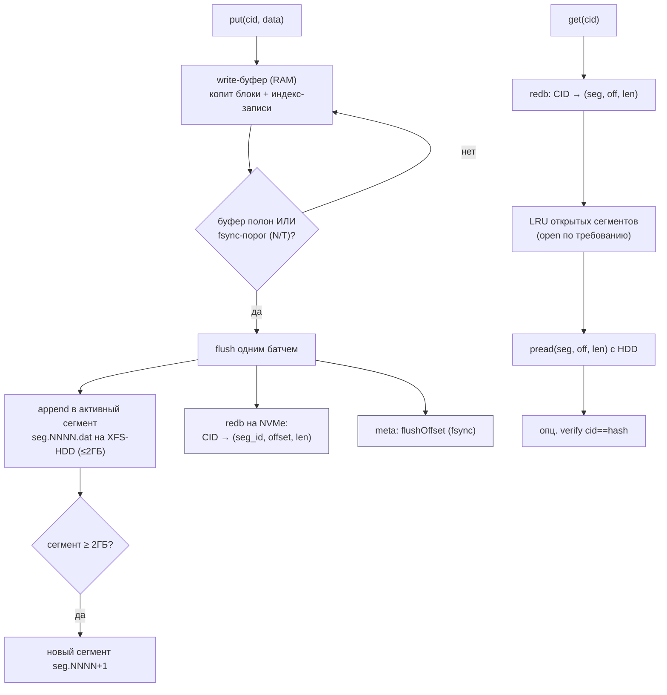

# Storage Ideas — синтез 11 прототипов (TON…Druid, Ignite) → дизайн и фазы

> Сводит выводы из [TON-storage-hdd-ssd.md](TON-storage-hdd-ssd.md),
> [go-ethereum-storage-hdd-ssd.md](go-ethereum-storage-hdd-ssd.md),
> [quorum-storage-hdd-ssd.md](quorum-storage-hdd-ssd.md),
> [pebble-storage-hdd-ssd.md](pebble-storage-hdd-ssd.md),
> [rocksdb-storage-hdd-ssd.md](rocksdb-storage-hdd-ssd.md),
> [oceanbase-storage-hdd-ssd.md](oceanbase-storage-hdd-ssd.md),
> [ydb-storage-hdd-ssd.md](ydb-storage-hdd-ssd.md),
> [polardb-pg-storage-hdd-ssd.md](polardb-pg-storage-hdd-ssd.md),
> [scylladb-storage-hdd-ssd.md](scylladb-storage-hdd-ssd.md),
> [druid-storage-hdd-ssd.md](druid-storage-hdd-ssd.md) и
> [ignite-storage-hdd-ssd.md](ignite-storage-hdd-ssd.md) в одно: **что именно берём,
> в какую фазу [PLAN.md](../../PLAN.md), и как это меняет [ARCHITECTURE.md](../../ARCHITECTURE.md)**.
> Привязка к решению [ADR 0001](../../adr/0001-storage-substrate.md): data-tier (XFS-HDD) +
> index-tier (NVMe), без центрального каталога.

---

## 1. Конвергенция: где TON и geth согласны (высокая уверенность)

Две независимые прод-системы пришли к одним и тем же приёмам — это сильнейший сигнал «брать».

| Приём | TON | go-ethereum | Наш вывод |
|---|---|---|---|
| **Append-only сегменты + offset-индекс** | `.pack` + `hash→offset` в RocksDB | freezer: data ≤2ГБ + `filenum/offset`-индекс | **базовый формат data-tier** |
| **Запись батчами + отложенный fsync** | write-batch + merge-дельты | freezer 30k/fsync-30с; pathdb буфер 64МБ | **write-буфер перед flush** |
| **Горячий индекс/мета на быстром носителе, тело — на медленном** | CellDB(SSD) vs archive(HDD) | KV(SSD) vs freezer(HDD) | **index→NVMe, data→HDD** (как в ADR) |
| **Нарезка на сегменты/слайсы** | слайсы по 20000 | data-файлы по 2ГБ | **сегменты фикс. размера** |
| **Ленивое открытие + LRU хэндлов** | `ArchiveLru` закрывает лишние | freezer открывает файлы по требованию | **LRU открытых сегментов** |
| **GC крупными кусками, не точечно** | refcount→erase; TTL слайса | `TruncateTail` целыми файлами | **компакция/прунинг сегментами** |
| **Локальность связанных мелких объектов** | `compress-depth` (поддерево в 1 значение) | path-keying (соседи рядом) | **батчить связанные блоки** |

### Что добавил GoQuorum (третий прототип)

Quorum — форк geth 1.10.3, по формату хранения он **подтверждает** geth (LevelDB+freezer+hashdb,
без Pebble/pathdb). Но даёт **новые** идеи, которых не было у TON/geth:

- **★ Off-chain content-addressed store + hash-pointer** (Tessera): на цепи только 64-байтный хэш,
  тяжёлый payload — во внешнем сторе по хэшу. **Это валидация всей нашей архитектуры целиком**
  (CID-указатель + наш стор как backing).
- **LRU fetch-кэш + retry** на read-path (декодированные payload'ы, TTL, ретраи при сетевом fetch).
- **Неймспейсинг логических данных префиксами ключей** на одном физическом сторе (`P/PSTP/Pb/…`).
- **Урок «замороженного субстрата»**: не взяв Pebble/pathdb, Quorum несёт более высокий
  write-amplification → держим движок подключаемым.

### Что добавил Pebble (LSM-движок, на нём geth)

Pebble — самый прямо применимый источник: его **value separation (WiscKey)** = наш two-tier
1:1 (blob ≈ сегмент, blobHandle ≈ `(seg,offset,len)`). И он закрывает два наших слабых места:

- **★ GC сегментов** — готовый чертёж: per-block **liveness-битмап** + **age-gated rewrite** +
  **refcount** + **virtual-block remap** (перепаковка живых не трогает индекс на каждый блок).
- **Inline мелких значений** (порог `MinimumSize`): крошечные блоки держать в индексе, не на HDD.
- **Самоадаптация к носителю**: disk-slow детекция (5с) → событие; **WAL failover** на запасной
  диск (>100мс); **readahead** на последовательном; **deletion pacing**.

### Что добавил RocksDB (каноничный LSM, на нём TON; Pebble — его порт)

Надмножество Pebble. Подтверждает value separation (BlobDB — 3-е подтверждение pack-сегментов),
но главное — даёт **многоносительную модель**, которой не было у других:

- **★ Tiered по «температуре» + time/access-миграция**: сегменты получают температуру
  (hot/cold), холодные мигрируют на дешёвый/remote носитель; маршрутизация через FileSystem.
  Формализует наш `cold_path`.
- **NVMe как L2 read-кэш ТЕЛ блоков** (SecondaryCache/PersistentCache) — перед HDD.
- **Rate limiter (auto-tuned)** — троттлинг фонового I/O (resilver/GC/компакция).
- **FIFO=TTL** (ephemeral блоки), **Ribbon-фильтр** (−40% места vs Bloom), **dict-компрессия**.

### Что добавил OceanBase (распределённая SQL-БД, LSM)

Подтверждает упаковку мелочи и тиринг, но даёт **новое строение блока и управление IO**:

- **★ Macro/Micro split**: сегмент = микроблоки (~16КБ) — единицы **IO, сжатия и checksum** →
  частичное чтение и точечная целостность (а не «сжатие/checksum на весь блок»).
- **Fixed-block аллокатор** (диск = файл 2МБ-слотов + bitmap + mark-sweep GC + pending-free) —
  альтернатива append-only компакции (нет фрагментации «дырами»).
- **Per-segment bloom**, **IO-QoS классы** (foreground/background), **multi-cache** раздельно
  (index/block/bloom), **macro_cache** холодного из object-тира, **periodic major-merge**.
- *Не берём:* columnar-encoding (dict/RLE/delta) — для структурированных данных, наши блоки опаковые.

### Что добавил YDB (ближайший прототип: распределённый erasure blob-store)

YDB BlobStorage решает по сути **наши Часть 1 + Часть 2** — самые сильные идеи именно от него:

- **★ Forseti — cost-based IO-scheduler**: `cost = seek + bytes/speed` + приоритет-гейты +
  fair-share → точнее простого rate-limiter/QoS-классов; основа честного IO на 60 HDD.
- **★ Device-type профили** (ROT/SSD/NVMe): конкретные in-flight (4 vs 128), reorder (50мс vs 1мс),
  и **inline-порог по носителю** (HDD 512КБ / SSD 64КБ).
- **★ Erasure block-4-2** (4+2, переживает 2 отказа, **1.5×** vs 3× у R=3) — для Части 2.
- **2-уровневые fail-домены** (realm/domain), **handoff** (транзиентная реплика),
  **общий per-disk write-лог** с коалесингом, **raw block device** (мимо ФС) — опция Части 2.

### Что добавил PolarDB-PG (compute/storage separation — иная парадигма)

PolarDB-PG разделяет вычисления и хранение: одна копия данных на shared-storage, много читателей.
Даёт два сильных вклада + важный контр-урок:

- **★ PolarVFS** — pluggable `vfs_mgr` с **3 бэкендами** (buffered / **O_DIRECT** / **PolarFS**
  remote) и **маршрутом по пути** → прямой чертёж нашего `ShardEngine`-порта (xfs / raw / remote).
- **★ Compute/storage separation** — направление **Части 3** (stateless gateway'и над общим blockstore).
- **★ Контр-урок immutability:** copy-buffer / LogIndex / consistent-LSN PolarDB строит ради
  **изменяемых** страниц СУБД; наши блоки **immutable** → всё это нам **НЕ нужно** (упрощение).

### Что добавил ScyllaDB (Seastar, shared-nothing per-core)

Три сильные доработки IO/компакции + ops-слой:

- **★ iotune — мерить диск, не угадывать**: бенчмарк реальных IOPS/bandwidth при установке →
  кормить IO-планировщик измеренной моделью (уточняет hardcoded device-type профили YDB).
- **★ ICS-фрагменты (~1000МБ)**: компакция большого тира не требует 2× места (в полёте ~1 фрагмент).
- **★ Backlog-controller**: пропорциональный адаптивный темп компакции по «долгу».
- **Scheduling-groups** (таксономия классов приоритета), **sparse in-RAM Summary** + downsampling,
  **O_DSYNC**+recycle WAL, **scylla-manager** (вынесенный планировщик repair/backup/restore).

### Что добавил Apache Druid (аналитическая БД на иммутабельных сегментах)

По философии ближе всего к нам (иммутабельные сегменты + кэш по дискам). Три вклада:

- **★ Декларативные load/drop-rules + тиры**: `tieredReplicants {tier→copies}` + Interval/Period/
  Forever Load/Drop/Broadcast — политика тиринга/репликации/срока **правилами**, а не «жёстко R=2».
- **★ Pluggable StorageLocationSelectorStrategy** (least-bytes-used / RR / random) — спред сегментов
  по нескольким дискам, выбор по свободному месту (подтверждает наш weighted-HRW, как стратегию).
- **Deep storage (источник правды) + локальный кэш**: потеря диска → перекачать; mmap+page-cache.

### Что добавил Apache Ignite (page-memory + WAL + checkpoint)

Native Persistence = page-memory (off-heap) + WAL + checkpoint; recovery = checkpoint + WAL-replay.
Для нас (иммутабельные блоки) page-level WAL данных не нужен, но три приёма прямо применимы:

- **★ WAL + checkpoint recovery для index-tier**: журнал индекс-операций + checkpoint-маркер →
  recovery = **replay WAL с checkpoint** вместо полного обхода 3,8 млрд сегментов.
- **★ Historical (WAL-delta) rebalance**: кратко-отсутствовавший диск **докатывает дельту** из
  change-log, а не полный walk-resilver.
- **WAL-режимы** (FSYNC/LOG_ONLY/BACKGROUND/NONE) + **write-throttling по прогрессу flush** +
  **checkpoint-buffer** (CoW — писатели не ждут сброса).

---

## 2. Каталог идей: берём / фаза / влияние

Источник: **T**=TON, **G**=geth, **Q**=GoQuorum, **P**=Pebble, **R**=RocksDB, **O**=OceanBase, **Y**=YDB, **PG**=PolarDB-PG, **S**=ScyllaDB, **D**=Druid, **I**=Ignite, **Rd**=Redis, **Dr**=Dragonfly, **Ir**=iroh-blobs, **If**=InfluxDB, **Tt**=Tarantool, **H**=Hadoop/HDFS, **Hv**=Hive, **Fl**=Flink, **K**=Kafka, **N**=NATS, **Ch**=ClickHouse, **Ca**=Cassandra, **Dg**=Dgraph/Badger, **Cr**=CockroachDB, **Qd**=Qdrant, **Rf**=RustFS, **Dc**=Discord (блог, не код), **Gz**=go-zfs (krystal, ZFS-обвязка).

| # | Идея | Ист. | Берём? | Фаза | Влияние на дизайн |
|---|---|---|---|---|---|
| 1 | **Pack-сегменты**: data-файлы ≤ N ГБ, append-only, тела блоков подряд | T+G | ✅ да | **1** | заменяет «файл-на-блок»: на 3,8 млрд блоков убирает inode-давление |
| 2 | **Offset-индекс**: `CID → (segment_id, offset, len)` в redb на NVMe | T+G | ✅ да | **1** | index-tier хранит адрес внутри сегмента, не путь к inode |
| 3 | **flushOffset в meta сегмента** → crash-recovery хвоста | G | ✅ да | **1** + 6 | durable append: на старте обрезаем недописанный хвост |
| 4 | **Write-буфер перед flush** (копить → один батч на диск) | T+G | ✅ да | **1** | режет write-amplification на HDD; fsync реже |
| 5 | **fsync-политика по порогам** (N элементов / T секунд) | G | ✅ да | **1** | настраиваемый throughput↔durability |
| 6 | **Компрессия: сжимаемое — да, хэши/CID — нет** | G | ✅ да | **1** | не тратить CPU на 32-байтную энтропию; опц. zstd тел |
| 7 | **Раздельные пути под носители** (`data_path`/`index_path`/`cold_path`) | G | ✅ да | **0** | конфиг диска: тело→HDD, индекс→NVMe |
| 8 | **LRU открытых сегментов** (ленивое open, лимит FD) | T+G | ✅ да | **5** | контроль FD/RAM на 60 дисках × много сегментов |
| 9 | **GC сегментами**: чистить/компактить целыми сегментами | T+G | ✅ да | **5** | без дырявой фрагментации; перепаковка «живых» блоков |
| 10 | **refcount/pin как merge-дельты** в индексе | T | ✅ да | **5** | inc/dec пина без read-modify-write |
| 11 | **index-in-RAM / preload** (опц. весь индекс в память/прогрев) | T | ◑ опц. | **5** | срез латентности hot-пути; флаг движка |
| 12 | **Батчинг связанных мелких блоков в один сегмент-запись** | T+G | ◑ позже | **2/6** | меньше seek; перекликается с UnixFS-чанками |
| 13 | **Bloom + async-WAL + локальность ключей** (для LSM-индекса) | G | ✖ нет* | — | redb — B-tree, не LSM; неприменимо напрямую |
| 14 | **Hot/cold/temp по TTL** (ephemeral vs pinned) | T | ◑ позже | **5** | tiering по pin-статусу/частоте, не по возрасту |
| 15 | **LRU fetch-кэш горячих блоков + retry** на read-path | Q | ✅ да | **4** | меньше повторных сетевых/дисковых fetch; устойчивость к сбоям |
| 16 | **Неймспейсинг index-tier префиксами** (`b\|cid`, `p\|cid`, `s\|seg`) | Q | ✅ да | **1** | один redb на диск без отдельных БД и миграций |
| 17 | **Pluggable substrate** (движок за `ShardEngine`-портом) | Q | ✅ (заложено) | **0** | апгрейд формата/движка без переписывания (урок Quorum) |
| 18 | **Off-chain CAS + hash-pointer** (валидация всей модели) | Q | ✅ архит. | — | подтверждает CID-указатель + наш стор как backing |
| 19 | **★ GC сегментов: liveness-битмап + age-gated rewrite + refcount + virtual-remap** | P | ✅ да | **5** | чертёж компакции сегментов; перепаковка не трогает индекс поблочно (уточняет #9/#10) |
| 20 | **Inline мелких значений** (порог `MinimumSize`) | P | ✅ да | **1** | крошечные блоки в redb-значении → минус seek на HDD |
| 21 | **Disk-slow детекция** (per-op таймер, порог ~5с) → событие | P | ✅ да | **5/6** | авто-перевод шарда в `Faulted` → resilver |
| 22 | **WAL failover index-tier на запасной NVMe** (>100мс) | P | ◑ опц. | **1/5** | durability индекса при стопе NVMe |
| 23 | **Readahead** (64КБ→max на последовательном) | P | ✅ да | **3/5** | быстрее проходы сегментов (resilver/scrub) на HDD |
| 24 | **Deletion pacing** сегментов при GC | P | ✅ да | **5** | без I/O-storm на HDD |
| 25 | **objstorage/remote тиринг** (холодное в shared store) | P | ◑ позже | **5** | дешёвый `cold_path`/remote-тир |
| 26 | **★ Температура сегментов + time/access-миграция в cold_path** | R | ✅ да | **5** | формализует тиринг (#14/#25): hot→быстрый, cold→дешёвый/remote |
| 27 | **NVMe как L2 read-кэш ТЕЛ блоков** (SecondaryCache) | R | ✅ да | **4/5** | меньше HDD-seek на горячем наборе (дополняет #15) |
| 28 | **Rate limiter (auto-tuned)** на фон (resilver/GC/компакция) | R | ✅ да | **5** | без write-stall на HDD под фоном (лучше pacing #24) |
| 29 | **FIFO=TTL** для ephemeral (не-pinned) блоков | R | ◑ позже | **5** | дешёвая модель временных данных (уточняет #14) |
| 30 | **Ribbon/Bloom CID-фильтр per-disk** | R | ◑ опц. | **2** | компактный фильтр «есть ли CID» перед redb-lookup |
| 31 | **Dictionary-компрессия тел** (zstd dict) | R | ◑ опц. | **1** | +ратио на похожих мелких телах |
| 32 | **Direct-I/O политика по носителю** (NVMe: on; HDD: off) | R | ✅ да | **1** | под каждый тир оптимально (HDD нужен page-cache) |
| 33 | **★ Macro/Micro split**: сегмент = микроблоки ~16КБ; checksum+compress на **micro** | O | ✅ да | **1** | частичное чтение без расжатия всего сегмента + точечная целостность |
| 34 | **Fixed-block аллокатор** (2МБ-слоты + bitmap + mark-sweep GC + pending-free 30с) | O | ◑ альт. | **5** | альтернатива append-only компакции; нет фрагментации «дырами» |
| 35 | **Per-segment bloom** (фильтр на сегмент) | O | ◑ опц. | **2** | гранулярнее per-disk (#30): пропуск чтения сегмента |
| 36 | **IO-QoS классы** (foreground vs background, token-bucket) | O | ✅ да | **5** | клиентский IO приоритетнее фона — строже #28 |
| 37 | **Multi-cache раздельно** (index/block/bloom-пулы) | O | ✅ да | **4/5** | индекс не вытесняется телами (дополняет #27) |
| 38 | **Periodic major-merge** (полная компакция сегментов ~раз/период) | O | ✅ да | **5** | амортизация write-amp + чистый read-набор (дополняет #19) |
| 39 | **★ Cost-based IO-scheduler (Forseti)**: cost=seek+bytes/speed + гейты + fair-share | Y | ✅ да | **5** | точнее rate-limiter (#28) и QoS (#36); честное IO на 60 HDD |
| 40 | **★ Device-type профили** (in-flight/reorder/bulk + inline-порог по носителю) | Y | ✅ да | **0/2** | авто-тюнинг per-disk (HDD 4 / NVMe 128; inline 512КБ/64КБ) |
| 41 | **★ Erasure block-4-2** (4+2, 2 отказа, 1.5×) | Y | ◑ Часть 2 | — | −50% места vs R=3 при той же стойкости |
| 42 | **2-уровневые fail-домены** (realm/domain) | Y | ✅ да | **5** | расширяет `shard.domain`: стойка/DC корреляция |
| 43 | **Handoff** (транзиентная реплика на запасной диск) | Y | ✅ да | **3** | запись не блокируется отказом; дополняет resilver/W |
| 44 | **Общий per-disk write-лог с коалесингом** | Y | ◑ опц. | **1** | один WAL/диск, один seek/батч (дополняет #4) |
| 45 | **★ PolarVFS: pluggable `vfs_mgr` + path-routing + bio/dio/PFS** | PG | ✅ да | **0** | чертёж `ShardEngine`-порта: backends xfs/raw-O_DIRECT/remote, выбор по пути (усиливает #17/#32) |
| 46 | **★ Compute/storage separation** (stateless gateway'и) | PG | ◑ Часть 3 | — | горизонтальное масштабирование чтения над общим blockstore |
| 47 | **★ Контр-урок immutability**: НЕ нужны copy-buffer/LogIndex/consistent-LSN | PG | ✅ (упрощение) | — | наш shared-storage путь радикально проще СУБД |
| 48 | **Backpressure по самому медленному потребителю** | PG | ✅ да | **5** | троттлить ingest/репликацию по отстающему gateway/реплике |
| 49 | **★ iotune — мерить диск (IOPS/bandwidth), не угадывать** | S | ✅ да | **0/5** | измеренная модель в cost-Forseti (точнее device-type #40) |
| 50 | **★ ICS-фрагменты** — компакция фрагментами ~1000МБ | S | ✅ да | **5** | temp-space GC ограничен фрагментом, не тиром (уточняет #19) |
| 51 | **★ Backlog-controller** (пропорц. темп компакции по «долгу») | S | ✅ да | **5** | адаптивный темп GC: не отстать и не задушить чтение |
| 52 | **Scheduling-groups** (классы: commit/query>flush>compaction) | S | ✅ да | **5** | таксономия гейтов Forseti (#39) |
| 53 | **Sparse in-RAM Summary + downsampling** | S | ◑ опц. | **1/4** | sparse-индекс в RAM поверх redb; адаптация к памяти |
| 54 | **Ops-планировщик (scylla-manager): scheduled repair/backup/restore** | S | ✅ да | **5** | вынести scrub/resilver/бэкап в отдельный cron-планировщик |
| 55 | **★ Декларативные load/drop-rules + тиры** (`tier→copies`, interval/period/drop) | D | ✅ да | **5** | политика тиринга/репликации/срока правилами вместо жёсткого R=2 |
| 56 | **★ Pluggable StorageLocationSelector** (least-bytes-used / RR / random) | D | ✅ да | **2** | спред по дискам по свободному месту, сменная стратегия (подтверждает HRW) |
| 57 | **Deep storage (источник правды) + локальный кэш** | D | ◑ Часть 3 | — | потеря диска → перекачать; масштаб чтения (дополняет #46/#25) |
| 58 | **StorageLocation: maxSize + freeSpace-резерв + reclaim** | D | ✅ да | **1/5** | лимиты per-диск + авто-вытеснение, не переполнять диск |
| 59 | **★ WAL + checkpoint recovery для index-tier** (replay дельты) | I | ✅ да | **1** | быстрый recovery индекса вместо полного обхода 3,8 млрд сегментов |
| 60 | **★ Historical (WAL-delta) rebalance** (докатка дельты) | I | ✅ да | **3** | кратко-отсутствовавший диск догоняет change-log'ом, не полным resilver |
| 61 | **WAL-режимы** (FSYNC/LOG_ONLY/BACKGROUND/NONE) | I | ✅ да | **1** | именованные уровни durability↔throughput (уточняет #5) |
| 62 | **Write-throttling по прогрессу flush + checkpoint-buffer (CoW)** | I | ✅ да | **5** | тормозить писателя, обгоняющего сброс; писатели не ждут flush |
| 63 | **★ Сброс page-cache для write-once данных** (`POSIX_FADV_DONTNEED` после fsync) | Rd | ✅ да | **1** | холодные тела сегментов не вытесняют горячий индекс/Summary из RAM |
| 64 | **★ Неблокирующий инкрементальный writeback** (`sync_file_range` 4МБ + WAIT на 2×) | Rd | ✅ да | **1** | грязные ≤8МБ → нет fsync-столла в конце записи сегмента |
| 65 | **★ Offload fsync/close (+lazy-free) в фоновые потоки** (FIFO-порядок) | Rd | ✅ да | **1/5** | главный путь не блокируется на медленном диске; порядок fsync сохранён |
| 66 | **★ Per-disk манифест сегментов** (base/active/history) + атом. свап + фон-удаление | Rd | ✅ да | **1/5** | атомарная опись набора вместо rename-на-файл; GC старых — фоном |
| 67 | **Durable atomic swap**: temp → fsync → rename → **fsync(dir)** | Rd | ✅ да | **1** | финализация сегмента/манифеста переживает краш |
| 68 | **Счётчик delayed-fsync + write-deferral** как сигнал disk-slow | Rd | ✅ да | **5** | дешёвая метрика «диск не успевает» (уточняет #25/#49) |
| 69 | **Diskless stream-репликация** (поток по сокету мимо temp-файла) | Rd | ✅ да | **3** | resilver/handoff стримит копии реплика→реплика без staging |
| 70 | **★ Свой аллокатор места на диске** (256МБ-сегменты → size-class страницы → битмап блоков) | Dr | ✅ да | **5** | зрелая альт. append-only/fixed-block: точечный re-use без полной компакции |
| 71 | **★ SmallBins packing** (мелочь <½стр → одна 4КБ-страница; free при refcount=0; дефраг <50%) | Dr | ✅ да | **1** | минус seek/страниц на мелких телах; точнее inline_min |
| 72 | **★ O_DIRECT + io_uring registered buffers**, 4КБ-выровненный I/O тел | Dr | ✅ да | **1** | direct без page-cache + пул буферов; основа raw-body-tier |
| 73 | **★ Read-coalescing / pending-read дедуп** (один диск-I/O на страницу для N читателей) | Dr | ✅ да | **1/4** | меньше HDD-seek при горячих страницах; дедуп параллельных get |
| 74 | **★ Cooling-слой** (hot→cool-в-RAM-LRU→cold) + promotion при доступе | Dr | ⚠️ частично | **1/4** | write-back staging + read-promotion; у нас тела иммутабельны |
| 75 | **★ Fork-less консистентный snapshot** через версии бакетов (serialize-before-modify) | Dr | ✅ да | **5** | scrub/backup под конкурентной записью без fork (≈ redb-MVCC) |
| 76 | **★ DFS-бэкап**: по файлу на диск/шард параллельно + summary | Dr | ✅ да | **5** | бэкап в cold_path/S3 параллелит 60 дисков; summary = манифест |
| 77 | **Async pre-grow** backing-файла (<15%/<256МБ → fallocate в фоне) + backoff | Dr | ✅ да | **1** | расширение сегментов заранее → запись не упирается в рост |
| 78 | **Backpressure по in-flight байтам** + offload-цикл (100µs, segment-order, skip-touched) | Dr | ✅ да | **5** | троттлинг точнее, чем по ops; честный фон-walk |
| 79 | **★ BLAKE3-style verified streaming (outboard)** — merkle-сайдкар → проверяемый range + докачка | Ir | ⚠️ Ч2/3 | **—** | verified/resumable fetch крупных блоков без полного перехэша |
| 80 | **★ Inline-payload в отдельной redb-таблице** (строка индекса узкая) | Ir | ✅ да | **1** | скан/итерация index-tier не тащит тела → быстрый обход 3,8 млрд |
| 81 | **★ Sparse bitfield + sizes-сайдкар** для частичных (реконструкция из outboard) | Ir | ✅ да | **3** | карта докачки реплики; resumable resilver/Bitswap |
| 82 | **★ Memory→disk spillover частичных передач** (в RAM до порога → persist sparse) | Ir | ✅ да | **3/4** | незавершённые fetch не держим в RAM сверх порога |
| 83 | **★ Per-key (per-hash) entity-актор + idle-recycle пул** | Ir | ✅ да | **1** | сериализация/дедуп операций на одном CID без глобальных локов |
| 84 | **★ Двухфазный delete-set + protect-handle** (удаление только после commit метаданных) | Ir | ✅ да | **5** | надёжный GC сегментов: не осиротить/не удалить во время записи |
| 85 | **External-reference mode** (индекс ссылается на файл без копирования) | Ir | ⚠️ опц. | **1** | zero-copy импорт/дедуп уже лежащих на диске данных |
| 86 | **★ Chunk-range request-протокол** (тянуть только `[a..b]`; delta-encoded RangeSpec; `missing()`) | Ir | ✅ да | **3/4** | partial-fetch для resilver/Bitswap: «дай чанки X», не весь блок |
| 87 | **★ Incremental verified-streaming decode** (проверять чанк на приёме, fail-fast на мусоре) | Ir | ✅ да | **3/4** | верификация по ходу; corrupt-источник обрывается сразу |
| 88 | **★ Observer: diff-only обновления доступности** (подписка, шлём только новые диапазоны) | Ir | ✅ да | **4/5** | реактивный progress + координация GC/resilver; дёшево |
| 89 | **★ Multi-source download: missing-only + split + pool + fallback** | Ir | ✅ да | **3/4** | тянуть недостающее из нескольких дисков/пиров параллельно, дедуп по bitfield |
| 90 | **★ Serve verified-range off-disk** (export_bao: Size\|Parent\|Leaf поток + flow-control) | Ir | ✅ да | **4** | стрим запрошенного диапазона с диска + естественный backpressure |
| 91 | **min/max-статистика по сегменту → skip по предикату** (вторичный/временной атрибут) | If | ⚠️ огранич. | **5** | scrub/GC/листинг по времени пропускают сегменты; для CID-lookup бесполезно |
| 92 | **★ Time-bucketed сегменты + cool-off + drop-whole-file retention** (gen1) | If | ✅ да | **5** | TTL/retention эфемерных = удалить сегмент-окно целиком, без компакции |
| 93 | **★ Checkpoint-rollup манифеста/каталога** (старт = checkpoint + свежее, не обход всего) | If | ✅ да | **1** | recovery/старт O(checkpoint+recent) на 3,8 млрд; уточняет #59/#66 |
| 94 | **Fencing через atomic-create** (`PutMode::Create`→AlreadyExists = чужой владелец) | If | ⚠️ Ч3 | **—** | анти-split-brain при нескольких gateway над общим стором |
| 95 | **Object-store tier-гигиена** (лимит конкурентных запросов + retry + adaptive-multipart) | If | ✅ да | **5** | аккуратная работа с cold_path/S3: не залить бэкенд, дослать крупное |
| 96 | **★ Метадата-лог-как-каталог + 2-фазные циклы** (`PREPARE/CREATE` orphan-detect; `DROP/FORGET`) | Tt | ✅ да | **1/5** | валидирует/уточняет манифест (#66) + two-phase delete (#84): детект осиротевших + 3-шаг удаления |
| 97 | **★ Regulator: write-throttle по ИЗМЕРЕННОЙ bandwidth** (гистограмма p10 + 0.75 headroom + memory-watermark) | Tt | ✅ да | **5** | точнее статичных порогов; писатель ≤ 0.75× реальной bandwidth фона; усиливает Forseti/#52/#78 |
| 98 | **Slices: ref-counted окно в иммутабельном файле** (реорганизация без переписи байтов) | Tt | ⚠️ опц. | **5** | range/slice не наши (CID случайны); «ссылка на живой регион вместо rewrite» — кандидат для GC |
| 99 | **Group-commit WAL** (отдельный поток + батч txn в один fsync) + eof-маркер torn-tail | Tt | ✅ да | **1** | амортизация fsync на множестве put'ов; eof-маркер = ещё один torn-tail детект (рядом с flushOffset) |
| 100 | **★ Tolerated-failed-volumes + live hot-swap диска** | H | ✅ да | **3/5** | держать N мёртвых дисков и работать; горячая add/remove без рестарта (частая опер. на 60 HDD) |
| 101 | **★ Intra-node disk-balancer** (offline-план + bandwidth cap; hardlink в пределах диска) | H | ✅ да | **5** | выровнять заполнение дисков (mixed-size / после add-disk), отдельно от topology-resilver |
| 102 | **★ Scrub-приёмы: throttle байт/с + suspect-приоритет + cursor-checkpoint + skip-recent** | H | ✅ да | **5** | возобновляемый scrub на 3,8 млрд, приоритет подозрительных |
| 103 | **Short-circuit local read** (fd/mmap, skip re-checksum для mlocked-anchorable) | H | ⚠️ опц. | **4** | локальное zero-copy чтение без лишней перепроверки верифицированного |
| 104 | **★ Splice-merge компакция** (копировать живые регионы/блоки байт-в-байт, БЕЗ ре-кодирования/перехэша) | Hv | ✅ да | **5** | дешёвый minor-GC: splice живых регионов (иммутабельны → не перехэшировать) |
| 105 | **★ Minor-vs-major компакция по порогам** (delta-count + delta/base-ratio) | Hv | ✅ да | **5** | два режима GC + явные пороги запуска (уточняет age-gated) |
| 106 | **★ Reader-watermark Cleaner** (удалять obsolete только после читателей ниже min-open-read) | Hv | ✅ да | **5** | MVCC-safe реклейм: scrub/long-read не выдернет сегмент; усиливает two-phase delete (#84) |
| 107 | **★ Инкрементальный backup: delta-upload + shared-segment refcount** | Fl | ✅ да | **5** | бэкап в cold_path/S3 грузит только новые сегменты; удалять, когда ни один бэкап не держит (усиливает #76/#106) |
| 108 | **★ Changelog/DSTL: durable change-log decouple cadence от размера** | Fl | ✅ да | **1/5** | RPO до секунд независимо от 480ТБ: стримить дельту манифеста/индекса в cold_path + материализация (расширяет #59/#93) |
| 109 | **TTL через compaction-filter** (drop истёкших инлайн на проходе компакции, без скана) | Fl | ✅ да | **5** | ephemeral-блоки с TTL выкидываются при splice-GC по embedded-ts (уточняет #92/FIFO=TTL) |
| 110 | **★ Zero-copy sendfile/transferTo** (отдать диапазон сегмента page-cache→сокет без user-space копии) | K | ✅ да | **4** | меньше CPU/копий при отдаче блоков по сети; острее serve-off-disk #90 для непрозрачного диапазона |
| 111 | **★ Durability через репликацию + recovery-point, НЕ fsync-на-запись** (flush на seal/периодически) | K | ✅ да | **1/5** | ослабить дорогой per-write fsync на HDD: durability = R=2 + recovery-point + CRC; рост throughput |
| 112 | **★ LazyIndex (отложенный mmap) + warm-tail binary search** | K | ✅ да | **1** | быстрый старт при тысячах сегментов; cache-friendly поиск по горячему хвосту индекса |
| 113 | **★ Глобальный disk-I/O семафор (`dios`)** — процесс-wide лимит одновременных disk-операций | N | ✅ да | **5** | backstop поверх per-disk пулов: не исчерпать OS-потоки/горутины при I/O-шторме на 60 дисках |
| 114 | **★ Block-cache: load-on-access + idle-timer eviction + weak-ref** (метаданные отдельным таймером) | N | ✅ да | **1/4** | RAM-управление без явного LRU; GC-friendly; метаданные держим дольше тел |
| 115 | **★ Вторичный индекс по атрибуту (psim)** — `attr→(блоки,счётчик)` для таргетного GC/scrub | N | ⚠️ опц. | **5** | по pin-owner/namespace/времени без обхода 3,8 млрд; ⚠️ не для CID-lookup |
| 116 | **★ Declarative storage policies: volumes + move_factor + size-gate + TTL-move** | Ch | ✅ да | **5** | единый каркас тиринга hot→warm→cold: авто-move по заполнению/размеру/возрасту (объединяет #55/#101/temperature) |
| 117 | **★ Hardlink instant FREEZE** — снимок = hardlink всех сегментов (O(файлов), 0 копий) → ленивый бэкап | Ch | ✅ да | **5** | мгновенный консистентный снимок, не блокирует запись; копирование фоном (усиливает #76/#107) |
| 118 | **★ Zero-copy shared-object refcount + last-replica-deletes** | Ch | ⚠️ Ч3 | **—** | несколько gateway делят cold-сегмент, авто-GC по refcount, без tombstone/lease (расширяет #107) |
| 119 | **★ Merkle-tree anti-entropy repair** — сверка реплик хэш-деревом → стрим только diff-диапазонов | Ca | ✅ да | **3/5** | дешёвое обнаружение РАСХОЖДЕНИЙ R копий (тихая порча/пропуск записи); дополняет walk-resilver |
| 120 | **★ Tombstone + gc_grace_seconds** — надгробие держать ≥ grace, чтобы delete дошёл до всех реплик | Ca | ✅ да | **3/5** | distributed-delete safety: отставшая реплика не «воскресит» удалённое; усиливает two-phase delete (#84) |
| 121 | **★ Speculative retry** — медленная реплика → дубль-read второй (порог fixed/percentile/hybrid) | Ca | ✅ да | **4** | срезает хвостовую латентность при disk-slow реплике |
| 122 | **★ Value-log GC по discard-счётчику + discardRatio** — mmap-счётчик мёртвых байт на сегмент (O(1)-выбор жертвы), rewrite лишь если мусора ≥ ratio | Dg | ✅ да | **5** | дешёвый выбор «самого мусорного» сегмента + жёсткая граница write-amp (≈2× при 0.5); параметризует сегмент-GC |
| 123 | **★ StreamWriter / bulk-loader** — внешняя сортировка входа → запись СРАЗУ в финальные сегменты+индекс, минуя нормальный LSM-путь | Dg | ✅ да | **2/3** | массовый импорт / restore / offline-rebuild без write-amplification обычного пути |
| 124 | **★ raftwal recovery-layout** — фикс-размерные pre-zeroed слоты + переменные данные в одном файле; зануление = детектор хвоста; mmap переживает крах процесса | Dg | ✅ да | **0/6** | O(1)-replay, компактная адресация записей, msync только для hard-reboot; усиливает recovery-point (#111) |
| 125 | **MoveTs read-fence** — epoch-стамп на миграции шарда; чтение с ts<MoveTs отклоняется | Dg | ✅ да | **3** | корректность чтений во время ребаланса/resilver (epoch-fencing, родственно #94) |
| 126 | ⚠️ **group-varint delta-pack** — упаковка ОТСОРТИРОВАННЫХ uint64 дельтами по 4 | Dg | ⚠️ огранич | **2** | CID случайны → только offset-таблицы/манифесты (как #98/#115) |
| 127 | **★ Ballast-файл: graceful full-disk recovery** — резерв ~1ГБ; диск «полон» если avail < ballast/2; оператор удаляет → расклинить; grow-only-if-safe (4× или >10ГБ останется) | Cr | ✅ да | **1/5** | забитый диск из 60 не вешает узел; место под GC/recovery; ранний сигнал «полон» до реального нуля |
| 128 | **★ WAL failover на запасной диск** — при стопе primary-WAL прозрачно писать WAL на другой стор/путь | Cr | ✅ да | **1/5** | latency коммита index-tier изолирована от одного тормозящего носителя (критично на 60 дисках) |
| 129 | **★ Per-disk /proc/diskstats монитор (100мс) + stall-trace + градация unavailable→fatal** | Cr | ✅ да | **5/6** | живая per-disk телеметрия latency/IOPS + дамп истории при stall; аккуратная деградация (окно под failover) |
| 130 | **★ 2-уровневый порог заполнения с гистерезисом (0.95 shed/block, 0.925 rebalance-target) + compare-cascade** | Cr | ✅ да | **2/5** | анти-пинг-понг блоков/реплик между дисками; disk-health важнее ровности при выборе цели |
| 131 | **★ Admission: elastic disk-bandwidth токены** — фон = `goal_util(0.8)×provisioned − reads` (reads резервируются), foreground НЕ душить | Cr | ✅ да | **5** | конкретная формула токенов фона из измеренной bandwidth; клиент всегда приоритетен (уточняет regulator #97/Forseti) |
| 132 | **★ IngestAndExcise (atomic влить+вырезать) + range-tombstone с порогом** point/range-delete | Cr | ✅ да | **3/5** | атомарная замена диапазона при migration (нет окна «удалили/не влили»); дёшево снести целый префикс/зону |
| 133 | **★ Bitmask-аллокатор + per-region gap-summary** (max/leading/trailing свободный прогон) — best-fit без скана | Qd | ✅ да | **1/5** | точечный re-use дырок от удалённых блоков БЕЗ полной компакции; альтернатива append-only (как Dragonfly segmented #..) с быстрым free-индексом |
| 134 | **★ Crash-safety «течь, но не портить»** — порядок flush bitmask→pages→tracker→free; крах = утечка места (чинится фоном), не порча | Qd | ✅ да | **1/6** | дизайн-принцип записи без recovery-лога: упорядочить так, чтобы крах давал безопасную утечку, не потерю; усиливает two-phase-delete (#84) |
| 135 | **★ madvise-дисциплина: POPULATE_READ (prefault горячего) + WILLNEED (многостраничное значение) + low-memory тиры** (NoResident/NoPopulate) | Qd | ✅ да | **1/5** | тёплый старт горячего индекса, префетч значения через границы страниц одним syscall, деградация под нехватку RAM; парно к DONTNEED (#63) |
| 136 | **★ SeqLock: lock-free чтение горячего состояния** (читатели не блокируются, ретрай при записи) | Qd | ✅ да | **2/5** | дёшево читать free-space/ёмкость/статы-кэша/хвост индекса при широком параллелизме на 60 дисках |
| 137 | **★ TTL-кэш ёмкости/free-space** (~5с) | Qd | ✅ да | **2/5** | HRW-by-free часто опрашивает free → гасим шторм `statvfs` на 60 дисках |
| 138 | **★ Erasure-set + per-object distribution-array** — object→набор (sipHash), шарды-перестановка по дискам набора (в xl.meta) | Rf | ✅ да (Ч2) | **2** | чертёж Части-2 erasure: нет горячего диска, детерминированная раскладка (расширяет YDB block-4-2) |
| 139 | **★ Self-describing per-disk метаданные (xl.meta) + quorum-pick-latest** | Rf | ✅ да | **1/2** | конкретная реализация **no-central-catalog**: версия объекта восстанавливается кворумом метаданных с дисков (mod_time/etag) |
| 140 | **★ Heal priority-queue: dedup + per-set bulkhead + MRF + типы-приоритеты** (ECDecode=Urgent) | Rf | ✅ да | **3** | управляемый heal: не дублировать, не перегружать набор, быстро чинить недавно-сбойное (MRF) |
| 141 | **★ Scanner cycle-budget (duration/objects/dirs обрыв) + jitter + normal/deep-bitrot каденс** | Rf | ✅ да | **5/6** | ограниченная стоимость scrub-цикла, анти-thundering-herd, дёшево-нормально + периодически-глубоко (усиливает scrub #102) |
| 142 | **★ Disk-health 4-state FSM (Online/Suspect/Offline/Returning) + recovery-class по offline-длительности** | Rf | ✅ да | **3/5** | гистерезис здоровья (не Faulted на transient), короткий-offline=ждать-дельту / долгий=full rebuild |
| 143 | **★ Асимметричное зеркало write-mostly** — read-нога (NVMe/быстрая) обслуживает ВСЕ чтения, durable-нога вне read-балансировки; self-heal битого сектора кэш-ноги с durable; ⚠️ урок: dm-cache/bcache отвергнуты (битый сектор кэша валит чтение) | Dc | ✅ да | **2/5** | (a) ZFS L2ARC/special-vdev на пулы; (b) read-preferred реплика в Pool (стабильная read-нога греет page-cache, №2 = write-mostly); (c) NVMe-фронт Ч2+ |
| 144 | **★ Request coalescing + consistent-hash ROUTING по ключу** — без роутинга на один воркер/инстанс дубли не встречаются и коалесинг не срабатывает | Dc | ✅ да | **1/4** | дополняет #73/#83: hot-CID дубли → один воркер; критично для Части 3 (несколько gateway над пулом) |
| 145 | **★ Миграция стора: dual-write + свой быстрый мигратор (диапазоны+checkpoint) + canary-сравнение чтений** — 3.2М строк/с, 9 дней vs 3 мес generic; урок tombstone-стопора | Dc | ✅ да | **Ч2** | процедура переезда mirror→erasure и любой смены формата сегментов без даунтайма |
| 146 | **★ Подключаемый command-runner** (порт exec для zfs/zpool, Sudo-вариант, фейк в тестах) | Gz | ✅ да | **0/6** | юнит-тесты ozd-zfs без zfs-бинаря (у go-zfs тестов 6× от кода); CI без ZFS |
| 147 | **★ CLI-дисциплина + таксономия ошибок**: `-H -p` всюду + cleanUpStderr (срез usage:) + маппинг stderr-паттернов → sentinel-ошибки (ErrNotFound) | Gz | ✅ да | **5** | `errors.Is` вместо парсинга строк выше по стеку; чистые логи ozd-zfs |
| 148 | **★ Типизированный Property-слой + Source-трекинг** (Bytes/Percent/Ratio/Bool/Time, IEC-нормализация; source=local/default/inherited) | Gz | ✅ да | **5** | дрифт-аудит конфигурации 60 пулов одним проходом (recordsize/compression заданы ли локально) |
| 149 | **★ ZFS user-properties `ozd:*` как метаданные диска** (shard_id/format/move_ts НА датасете, переживают remount/import) | Gz | ✅ да | **1/3** | самоописанный диск на ярусе ФС (углубляет #139); инвентаризация = один `zfs get -r ozd:*`; диск не перепутать |
| 150 | **★ Метрики freeing/fragmentation/leaked + compressratio**: эффективный free = **free + freeing** (асинхронное освобождение после GC-волны) | Gz | ✅ да | **2/5** | вес HRW не прыгает после unlink 2ГБ-сегментов; fragmentation → balancer/major-GC; compressratio → выгода lz4 |

\* кроме принципа «не делать лишних random-чтений» — он и так заложен (индекс на NVMe).
† Идеи #86–90 — на стыке storage↔networking (как тела движутся к/от диска); см. также [NETWORKING-SYNTHESIS](../Network/NETWORKING-SYNTHESIS.md).

---

## 3. Целевой дизайн data-tier (синтез)

**Сегмент (`seg.NNNN.dat`) на XFS-HDD:** append-only тела блоков подряд (опц. сжатые).
**Индекс (redb на NVMe):** `CID → (segment_id, offset, len, [refcnt/pin])`.
**Meta сегмента:** `flushOffset` (последний durable байт) для recovery.
Это объединяет freezer-формат geth (G#1–3) с «index hot / data cold» (ADR) и
refcount-учётом TON (T#10).

---

## 4. Дельта по фазам плана (что добавить)

### Фаза 0 — Каркас
- Конфиг диска: `{ data_path (XFS-HDD), index_path (NVMe), cold_path?, segment_max_size=2ГБ,
  fsync_items, fsync_interval, compress: none|zstd }` (идеи #7, #5, #6).
- В trait `ShardEngine` заложить адрес `(segment_id, offset, len)`, а не «путь к файлу».
- **`ShardEngine` — подключаемый порт** (#17): движок/формат можно сменить без переписывания
  домена (урок Quorum «замороженного субстрата»).
- **Device-type профили** (#40, из YDB): авто-определить ROT/SSD/NVMe и применить профиль
  (in-flight, reorder, bulk, **inline-порог по носителю**: HDD 512КБ / SSD 64КБ).
- **PolarVFS-style pluggable backend `ShardEngine`** (#45, из PolarDB): бэкенды
  `xfs-file` / `raw-O_DIRECT` / `remote`, выбор по пути (`data_path`/`index_path`/`cold_path`).
- **iotune-калибровка** (#49, из ScyllaDB): на старте **бенчмаркить каждый из 60 HDD** (IOPS/
  bandwidth) → измеренная drive-model в cost-Forseti (точнее, чем профиль по типу).
- **Pluggable StorageLocationSelector** (#56, из Druid): стратегия выбора диска (по умолчанию
  **least-bytes-used** ≈ weighted-HRW по свободному месту), сменная (RR/random) — за тем же портом.
- **StorageLocation-лимиты** (#58, из Druid): per-диск `maxSize` + резерв свободного места +
  авто-вытеснение (reclaim) — не переполнять диск.

### Фаза 1 — Один диск, два tier'а  ← основной фокус идей
- **data-tier = pack-сегменты** (#1): append-only `seg.NNNN.dat`, ротация по `segment_max_size`.
- **offset-индекс** в redb на NVMe (#2): `CID → (seg_id, offset, len)`.
- **write-буфер + батч-flush** (#4) и **fsync-политика** (#5).
- **flushOffset recovery** (#3): при старте обрезать недописанный хвост активного сегмента.
- **WAL + checkpoint для index-tier** (#59, из Ignite): журнал индекс-операций + checkpoint-маркер
  → быстрый recovery (replay WAL с checkpoint), а не полный обход сегментов на 3,8 млрд.
  **WAL-режимы** (#61): FSYNC / LOG_ONLY / BACKGROUND — именованные durability↔throughput.
- **компрессия по политике** (#6): тела опц. zstd, ключи/CID — никогда.
- **неймспейсинг index-tier** (#16): в одном redb-на-диск ключи с префиксами `b|cid` (блоки→адрес),
  `p|cid` (пины), `s|seg` (мета сегментов) — без отдельных БД.
- **inline мелких блоков** (#20, из Pebble): блоки меньше порога `inline_min` хранить прямо в
  redb-значении (а не в сегменте) → минус seek на HDD для мелочи (порог по носителю, #40).
- (опц., #44) **общий per-disk write-лог с коалесингом** (из YDB): один WAL на диск, коалесить
  записи в один батч → один seek/батч на HDD (поверх write-буфера #4). **O_DSYNC** (data-sync без
  metadata) + **recycle сегментов** после flush (из ScyllaDB).
- (опц., #53) **sparse in-RAM Summary** (из ScyllaDB): разрежённый индекс в RAM поверх redb
  («в какую область сегмента»), прореживаемый под давление памяти.
- (опц., #22) **WAL/durability index-tier на запасной NVMe** при стопе primary (Pebble WAL-failover).
- **direct-I/O политика по носителю** (#32, из RocksDB): NVMe-индекс — direct; HDD-сегменты —
  через page-cache (`use_direct_reads=false` на HDD).
- (опц., #31) **dictionary-компрессия тел** (zstd dict) для похожих мелких блоков.
- **★ Macro/Micro split** (#33, из OceanBase): сегмент = последовательность **микроблоков (~16КБ)** —
  единиц **IO, сжатия и checksum**; чтение одного микро без расжатия всего сегмента, точечная
  проверка целостности. `(seg_id, offset, len)` указывает на блок внутри микро.
- Тесты: `put;get`, краш между data и index → recovery; краш в середине батча → flushOffset.

### Фаза 2 — Pool + Placement (+ опц. локальность)
- (опц., #12) при записи связанных блоков (один UnixFS-объект) — пытаться класть в один сегмент
  одного шарда для локальности чтения. Не ломает HRW (реплики всё равно top-R).
- (опц., #30) **Ribbon/Bloom CID-фильтр per-disk**: компактный фильтр «есть ли CID на диске»
  перед опросом redb R дисков-кандидатов → меньше лишних lookup'ов.
- (опц., #35) **Per-segment bloom** (из OceanBase): фильтр на сегмент — пропустить чтение
  сегмента, если CID точно не в нём (гранулярнее per-disk).

### Фаза 3 — Walk-based resilver
- **Readahead на проходах сегментов** (#23, из Pebble): при последовательном обходе сегментов
  (resilver/scrub) включать readahead 64КБ→max → быстрее на HDD.
- **Historical (WAL-delta) rebalance** (#60, из Ignite): диск вернулся после **короткого** отсутствия →
  догнать **дельтой** (change-log того, что записалось в его HRW-зону, пока отсутствовал), а **полный
  walk-resilver** — только при долгом отсутствии/замене. Резко меньше трафика восстановления.
- **Handoff** (#43, из YDB): если целевой диск (по HRW) недоступен — писать реплику на **запасной**
  диск (транзиентно), позже вернуть на основной при возвращении → запись не блокируется отказом.

### Фаза 4 — Интеграция с IPFS-демоном
- **LRU fetch-кэш горячих блоков + retry** (#15, из Quorum/Tessera): кэшировать недавно
  прочитанные блоки (TTL/размер), а при удалённом fetch (Bitswap) — ретраи с backoff. Снижает
  повторные обращения к дискам и сети.
- **NVMe как L2 read-кэш ТЕЛ блоков** (#27, из RocksDB SecondaryCache): промах RAM-кэша тел →
  NVMe-кэш → HDD-сегмент. Индекс у нас уже на NVMe; здесь — кэш самих тел горячего набора.
- **Multi-cache раздельно** (#37, из OceanBase): отдельные пулы под индекс / тела блоков / bloom —
  чтобы тела не вытесняли горячий индекс.

### Фаза 5 — Эксплуатация
- **LRU открытых сегментов** (#8): лимит одновременно открытых `seg.*.dat` per-disk.
- **GC сегментами по чертежу Pebble blob-rewrite** (#9/#19): per-block **liveness-битмап** живых
  блоков + **refcount** сегмента; rewrite запускать **age-gated** (старше порога) и при
  garbage-ratio выше порога — копировать только живые в новый сегмент, старый удалить; старые
  адреса стабильны (перепаковка обновляет индекс пачкой, не поблочно на горячем пути).
- **pin/refcount как merge-дельты** (#10) в redb.
- **disk-slow детекция** (#21, из Pebble): per-disk таймер на write/sync, порог ~5с → событие →
  пометить шард `Degraded/Faulted` → `ResilverService`.
- **★ Cost-based IO-scheduler «Forseti»** (#39, из YDB) — вершина эволюции deletion-pacing (#24) →
  rate-limiter (#28) → IO-QoS (#36): `cost = seek_ns + bytes·1e9/speed_bps` + **приоритет-гейты**
  (клиент > фон) + fair-share + reorder-окно. **drive-model — измеренная iotune** (#49), не
  угаданная; **классы-гейты — таксономия scheduling-groups** (#52: commit/query > flush > compaction).
- **ICS-фрагменты для GC** (#50, из ScyllaDB): компакция сегментов **фрагментами фикс. размера**
  (~1ГБ) → temp-space ограничен фрагментом, а не всем тиром.
- **Backlog-controller** (#51, из ScyllaDB): пропорциональный темп GC/компакции по «долгу»
  (`bytes_uncompacted × log4(total)`); растёт долг → больше IO компакции, падает → меньше.
- **Ops-планировщик** (#54, из scylla-manager): вынести `scrub`/`resilver`/бэкап в `cold_path`/S3
  в отдельный cron-планировщик (вне горячего пути).
- **Periodic major-merge** (#38, из OceanBase): по расписанию — полная компакция сегментов шарда в
  чистый read-оптимизированный набор (амортизирует write-amp), совместить со scrub.
- (опц., #34) **Fixed-block аллокатор** как альтернатива append-only: 2МБ-слоты + bitmap +
  mark-sweep GC + pending-free — оценить vs компакция (нет фрагментации «дырами»).
- **★ температура сегментов + миграция в `cold_path`** (#26, из RocksDB, уточняет #14/#25): тег
  сегмента (hot/cold по pin/частоте/возрасту); холодные мигрируют на дешёвый/remote носитель,
  горячие — на быстрый. Маршрут выбирается per-сегмент (`data_path` vs `cold_path`).
- **★ Декларативные load/drop-rules** (#55, из Druid): политику тиринга/репликации/срока описывать
  **правилами по классам** («класс A → 2 копии hot; B → 1 cold; X → cold_path/drop») вместо
  жёсткого R=2 — более гибко, чем разрозненные флаги.
- (опц., #29) **FIFO=TTL** для ephemeral (не-pinned) блоков: удалять старейшие по TTL/лимиту.
- (опц., #11) флаги `index-in-ram` / `index-preload`.
- **2-уровневые fail-домены** (#42, из YDB): расширить `shard.domain` до `realm` (DC/полка) +
  `domain` (контроллер/хост) — реплики/части в разные домены, защита от корреляц. отказов.
- **Write-throttling по прогрессу flush + checkpoint-buffer** (#62, из Ignite): если клиент пишет
  быстрее, чем сбрасываем сегменты на HDD — **тормозить писателя** (speed-based); copy-on-write
  страниц/буфера на время сброса, чтобы писатели не ждали flush. (поверх Forseti #39).
- **Backpressure по самому медленному потребителю** (#48, из PolarDB): троттлить
  ingest/репликацию по отстающему gateway/реплике (поверх Forseti #39).

### Фаза 6 — Закалка
- Краш-тесты recovery по `flushOffset`; нагрузочное на компакцию сегментов.
- **Тест disk-slow** (#21): искусственно замедлить диск → шард переходит в `Faulted`, чтение
  уходит на реплику, resilver восстанавливает (как Pebble disk-health + failover).
- **Тест rate-limiter** (#28): фон (resilver/GC) под нагрузкой не вызывает write-stall клиентских
  записей; проверить миграцию сегмента hot↔cold (#26) и NVMe-кэш тел (#27) под нагрузкой.
- **Тест iotune+backlog** (#49/#51): измеренная drive-model корректна; backlog-controller
  ускоряет/замедляет компакцию по «долгу»; ICS-фрагменты держат temp-space в пределах фрагмента.

---

## 5. Что НЕ берём (и почему)

- **LSM-тюнинг Pebble/RocksDB целиком (#13)** — наш index-tier на `redb` (B-tree), у него своя
  модель; берём только принципы (горячий индекс на NVMe, не делать лишних random-чтений).
- **Чисто возрастной hot/cold как в blockchain** — у content-addressed блоков нет естественного
  порядка по времени; наш тиринг (#26) — по **pin-статусу/частоте доступа** в первую очередь,
  возраст — лишь вспомогательный сигнал (в отличие от `preclude_last_level_data_seconds`).
- **Полный central catalog** — остаётся отвергнутым (ADR): индекс per-disk, источник правды —
  HRW placement.

### ★ Контр-урок immutability (PolarDB) — что нам НЕ нужно
PolarDB строит **consistent-LSN / flush-in-LSN-order / copy-buffer / LogIndex / mini-transaction**
ради **изменяемых** страниц СУБД (in-place update + MVCC + много читателей одной мутабельной
страницы). Наши блоки **immutable content-addressed** → «новой версии блока» нет, материализация
не нужна — **всё это не реализуем** (#47). Это упрощает наш дизайн и особенно будущий
shared-storage путь.

### Отложено в Часть 2/3 (не Часть 1)
- **Erasure block-4-2** (#41, YDB): 1.5× overhead, переживает 2 отказа — заменит/дополнит mirror
  R=2/R=3, когда ёмкость станет критичнее простоты. В Часть 1 — mirror R=2. (**Часть 2**)
- **Raw block device бэкенд** `ShardEngine` (YDB/PolarDB O_DIRECT) — опция; в Части 1 — XFS. (**Часть 2**)
- **Compute/storage separation** (#46, PolarDB): stateless IPFS/S3-gateway'и над общим
  content-addressed blockstore — горизонтальное масштабирование. (**Часть 3**)
- **Deep storage (источник правды) + локальный кэш** (#57, Druid): durable backing (S3/cold_path) +
  локальные обслуживающие копии; потеря диска → перекачать. Для **иммутабельных** блоков это путь
  Части 3 в чистом виде (как у Druid; проще СУБД). (**Часть 3**)

---

## 6. Итог: главные заимствования

1. **data-tier = append-only pack-сегменты (≤2ГБ) + offset-индекс на NVMe + flushOffset-recovery.**
   Формат подтверждён TON (`.pack`) и geth (freezer) независимо → берём как основу (Фаза 1).
2. **write-буфер с батч-flush и настраиваемым fsync** — против write-amplification на HDD (Фаза 1).
3. **GC и компакция сегментами + pin как merge-дельты** — дёшево, без фрагментации (Фаза 5);
   **чертёж — Pebble blob-rewrite**: liveness-битмап + age-gated rewrite + refcount + virtual-remap.
4. **LRU fetch-кэш горячих блоков + retry** на read-path (из Quorum/Tessera) — Фаза 4.
5. **Неймспейсинг index-tier префиксами** (один redb на диск) + **подключаемый `ShardEngine`**
   (урок Quorum о «замороженном субстрате») — Фазы 1/0.
6. **Inline мелких блоков** (порог, из Pebble) — Фаза 1; минус seek на мелочи.
7. **Самоадаптация к носителю** (из Pebble): disk-slow → `Faulted`, WAL-failover, readahead,
   deletion pacing — Фазы 3/5/6.
8. **★ Многоносительный тиринг** (из RocksDB): температура сегментов + миграция в `cold_path`,
   **NVMe как L2-кэш тел**, **rate limiter (auto-tuned)** на весь фон — Фазы 4/5.
9. **Прочее из RocksDB**: FIFO=TTL для ephemeral, Ribbon CID-фильтр, dict-компрессия,
   direct-I/O по носителю — Фазы 1/2/5.
10. **★ Macro/Micro split** (из OceanBase): сегмент = микроблоки ~16КБ — единицы IO, сжатия и
    **checksum** → частичное чтение + точечная целостность — Фаза 1.
11. **Прочее из OceanBase**: fixed-block аллокатор (альтернатива), per-segment bloom, **IO-QoS
    классы** (клиент > фон), multi-cache раздельно, periodic major-merge — Фазы 2/4/5.
12. **★ Cost-based IO-scheduler «Forseti»** (из YDB): `cost = seek + bytes/speed` + приоритет-гейты
    + fair-share — вершина IO-управления (точнее #28/#36) — Фаза 5.
13. **★ Device-type профили** (из YDB): авто-тюнинг per-disk (in-flight, reorder, inline-порог по
    носителю) — Фазы 0/1. **2-уровневые fail-домены** + **handoff** + общий per-disk лог — Фазы 5/3/1.
14. **Erasure block-4-2** (из YDB) — для **Части 2**: 1.5× overhead, переживает 2 отказа (vs 3× у R=3).
15. **★ PolarVFS pluggable backend (path-routed bio/dio/remote)** (из PolarDB) — чертёж
    `ShardEngine`-порта — Фаза 0. **Compute/storage separation** → **Часть 3**; **immutability
    убирает copy-buffer/LogIndex/consistent-LSN** — упрощение нашего дизайна.
16. **★ iotune (мерить диск), ICS-фрагменты (ограничить temp-space GC), backlog-controller**
    (из ScyllaDB) — Фазы 0/5; + scheduling-groups (таксономия Forseti-гейтов), sparse-Summary,
    O_DSYNC, ops-планировщик (scylla-manager) — Фазы 1/4/5.
17. **★ Декларативные load/drop-rules + pluggable disk-selector** (из Druid) — Фазы 5/2: политика
    тиринга/репликации **правилами по классам** (вместо жёсткого R=2); спред по дискам стратегией
    (least-bytes-used); **deep-storage + локальный кэш** для иммутабельного → Часть 3.
18. **★ WAL + checkpoint recovery индекса + historical (WAL-delta) rebalance** (из Ignite) — Фазы 1/3:
    быстрый recovery index-tier (replay дельты, не полный обход); кратко-отсутствовавший диск
    догоняет change-log'ом; + WAL-режимы и write-throttling по прогрессу flush — Фазы 1/5.

> **Архитектурная валидация (Quorum + Pebble + RocksDB + OceanBase + YDB + PolarDB + ScyllaDB +
> Druid + Ignite):** off-chain content-addressed store + hash-pointer (Quorum), value separation =
> blob + handle (Pebble/RocksDB BlobDB), nested-packing `(macro_id, offset, size)` (OceanBase),
> **PDisk-чанки + VDisk-группы с erasure** (YDB), **pluggable VFS + compute/storage separation**
> (PolarDB), **cost-IO калиброванный iotune + ICS-фрагменты** (ScyllaDB), **иммутабельные сегменты +
> deep-storage/кэш + декларативные правила** (Druid) и **WAL+checkpoint recovery + delta-rebalance**
> (Ignite) — это **ровно** наша модель. **Одиннадцать** независимых прод-систем сошлись на сегментах,
> буферизации, контент-адресуемости, сегментном GC, многоносительном тиринге, cost-based IO
> (измеренном), pluggable-носителе, спреде по дискам и **восстановлении дельтой** (а не полной
> пересборкой). **YDB — главный референс Части 1+2**; **PolarDB/Druid — референс Части 3**
> (deep-storage + кэш), причём наша **неизменяемость делает этот путь кардинально проще** СУБД.

> Эти заимствования меняют [PLAN.md](../../PLAN.md) Фазы 0/1/2/3/4/5/6 и уточняют движок в
> [ARCHITECTURE.md §4.2](../../ARCHITECTURE.md). Применить к PLAN — отдельным шагом по запросу.
