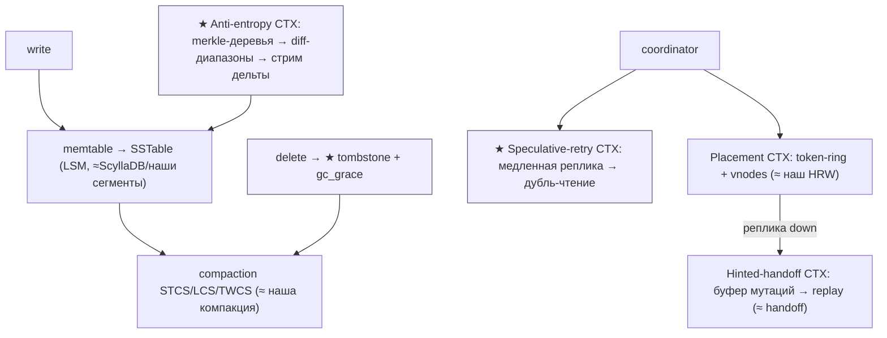
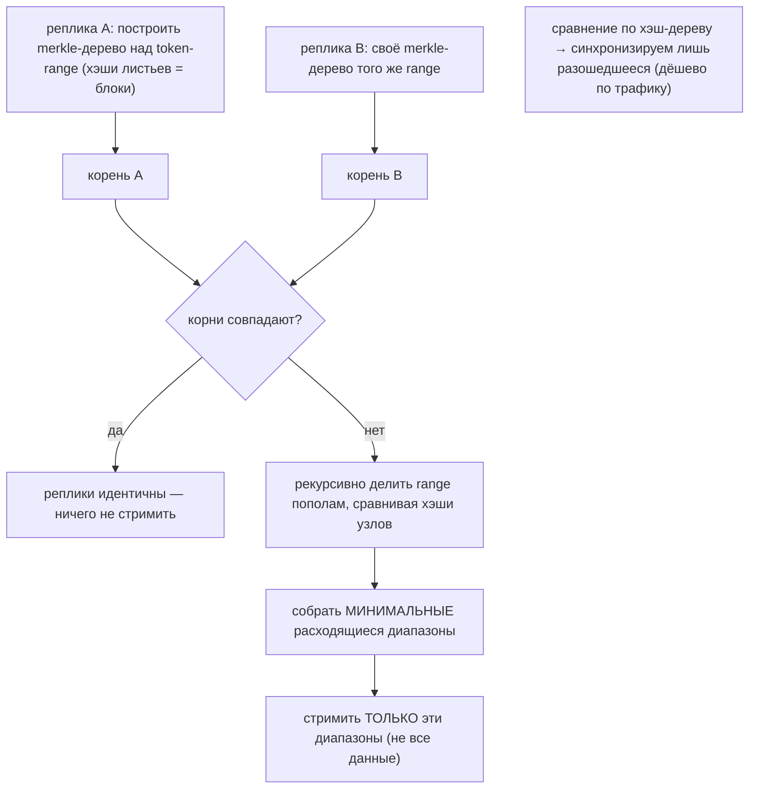
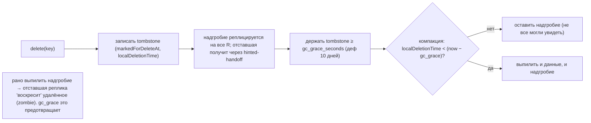
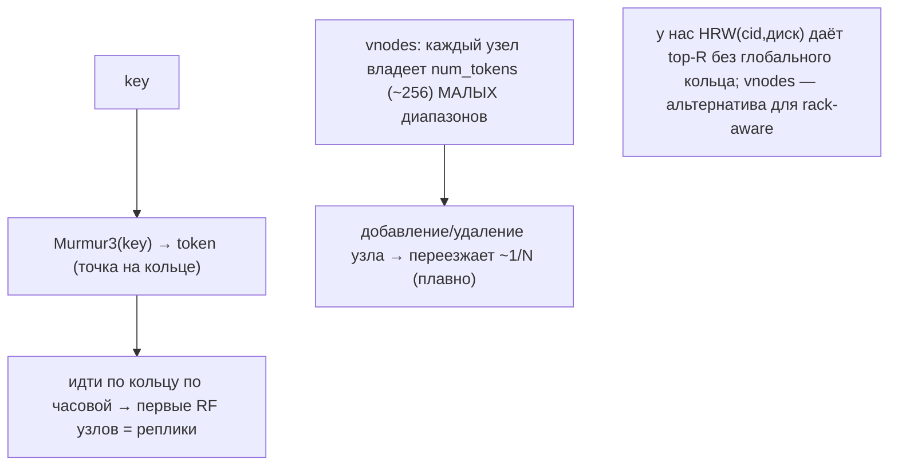
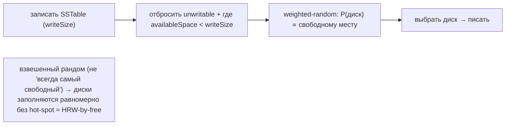
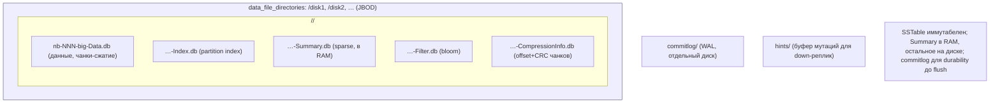
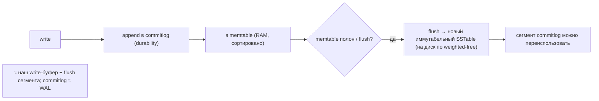
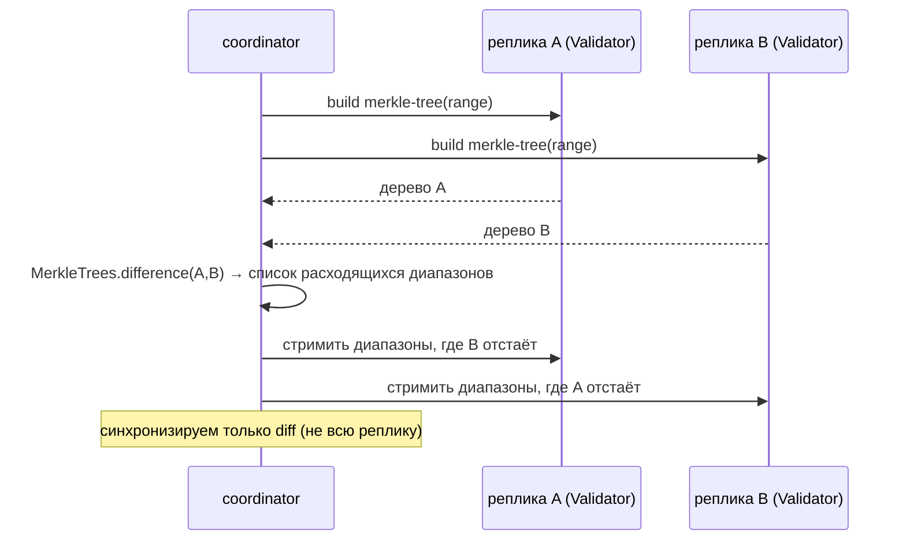
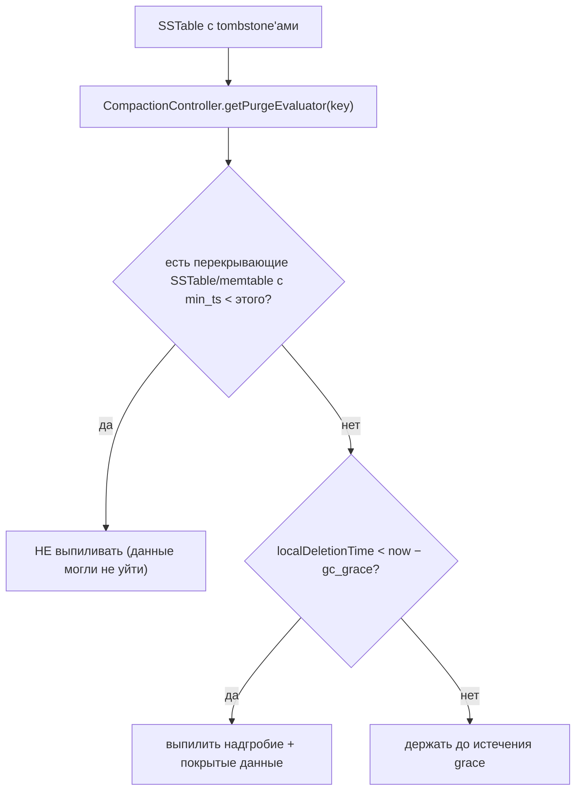
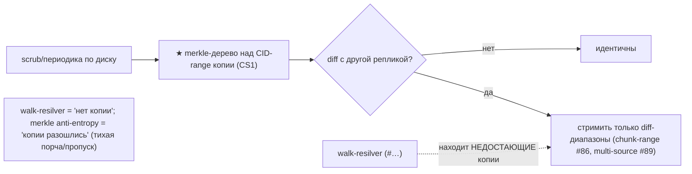

# Apache Cassandra Storage — как Cassandra работает с HDD/SSD (DDD-разбор исходников)

> Исследование исходников **apache/cassandra** (`Vendor/cassandra`, свежий слой, commit `a434c91` от
> 2026-06-09). Все факты — с ссылками `файл:строка`, проверены в коде; ключевые места — **с реальными
> снипетами** (см. §9-bis).

Cassandra — распределённый LSM-store (Java): memtable → SSTable, компакция (STCS/LCS/TWCS/UCS), sparse
index-summary + bloom, commitlog, multi-disk JBOD, **token-ring placement**, **hinted handoff**,
**anti-entropy repair**, tombstones. ⚠️ **Очень сильная конвергенция со [ScyllaDB](scylladb-storage-hdd-ssd.md)**
(C++-rewrite Cassandra — та же архитектура; уже разобран, #49–54). Поэтому **storage-движок = повторная
валидация**; копаем там, где **по-настоящему ново для нас**:

1. **★ Merkle-tree anti-entropy repair** — реплики строят **хэш-деревья** над диапазонами, сравнивают
   корни, рекурсивно находят **минимальные расходящиеся диапазоны** и стримят **только дельту**.
2. **★ Tombstone + gc_grace_seconds** — удаление пишет **надгробие**, которое держится ≥ grace, чтобы
   удаление дошло до **всех** реплик до физического выпиливания (анти-«воскрешение» при отставшей реплике).
3. **★ Speculative retry** — если первая реплика медлит, после порога послать **дублирующее чтение**
   второй реплике; берём ответ быстрейшего (снижение хвостовой латентности).

> Контекст: token-ring/vnodes ⟷ наш HRW (мы выбрали HRW); hinted handoff ⟷ наш handoff; index-summary
> ⟷ sparse-Summary (#50); multi-disk free-space-weighted ⟷ HRW-by-free (#2); STCS/LCS/TWCS ⟷ наша
> компакция + time-bucketed (#92) — всё **конвергенция**. Берём 3 приёма выше.

---

## 1. Bounded Contexts



| Контекст | Ответственность | Файлы |
|---|---|---|
| **SSTable/memtable** | LSM: memtable→SSTable, index-summary, bloom | `io/sstable/format/SortedTableWriter.java`, `indexsummary/*` |
| **Compaction** | STCS/LCS/TWCS/UCS | `db/compaction/*Strategy.java` |
| **Placement** | token-ring + vnodes, выбор реплик | `dht/Murmur3Partitioner.java`, `locator/SimpleStrategy.java` |
| **★ Anti-entropy repair** | merkle-деревья, diff-диапазоны | `repair/Validator.java`, `utils/MerkleTree.java` |
| **★ Tombstone / gc_grace** | надгробия + grace перед purge | `db/DeletionTime.java`, `db/compaction/CompactionController.java` |
| **★ Speculative retry** | дубль-чтение медленной реплики | `service/reads/*SpeculativeRetryPolicy.java`, `AbstractReadExecutor.java` |
| **Hinted handoff / multi-disk** | буфер мутаций; выбор диска по free | `hints/HintsService.java`, `db/Directories.java` |

---

## 2. Архитектурные диаграммы (Mermaid)

### Ca1. Merkle-tree anti-entropy repair (★)



### Ca2. Tombstone + gc_grace (distributed-delete safety) (★)



### Ca3. Speculative retry (хвостовая латентность) (★)

```mermaid
flowchart LR
    R["read(key)"] --> R1["послать реплике 1"]
    R1 --> T{"ответ за порог (fixed/percentile/hybrid)?"}
    T -->|да| DONE["отдать ответ"]
    T -->|нет (медленно)| R2["★ послать ДУБЛЬ-чтение реплике 2"]
    R2 --> FAST["взять ответ быстрейшего из {1,2}"]
    note["торгуем лишний сетевой/диск-запрос ради срезания tail-latency на медленной реплике/диске"]
```

### Ca4. Token-ring + vnodes (placement) — контраст с HRW



### Ca5. Multi-disk: выбор директории по свободному месту



---

## 2-bis. Файловая система: раскладка и потоки (Mermaid)

> Cassandra: keyspace/table → SSTable-файлы на нескольких `data_file_directories` (дисках) + commitlog
> (отдельный диск) + hints/. SSTable = Data + Index + Summary + Filter + Statistics + CompressionInfo.

### FS1. Раскладка на диске



### FS2. Запись: commitlog → memtable → flush SSTable



### FS3. Repair-поток (merkle → стрим дельты)



### FS4. Tombstone в компакции (gc_grace)



---

## 3. Ubiquitous Language (термины Cassandra)

| Термин Cassandra | Значение | Наш аналог |
|---|---|---|
| **SSTable** | иммутабельный отсортированный файл | pack-сегмент |
| **memtable / commitlog** | буфер в RAM / WAL | write-буфер / WAL |
| **index summary** | разрежённый sample индекса в RAM | sparse Summary (#50) |
| **merkle tree** | хэш-дерево над диапазоном | хэш-дерево над CID-range (новое) |
| **anti-entropy repair** | сверка реплик деревьями + стрим diff | resilver по merkle-diff |
| **tombstone** | надгробие удаления | delete-marker |
| **gc_grace_seconds** | grace перед purge надгробия | distributed-delete grace |
| **token / vnodes** | позиция на кольце / мелкие диапазоны | HRW (наша альтернатива) |
| **hinted handoff** | буфер мутаций для down-реплики | handoff (#…) |
| **speculative retry** | дубль-чтение медленной реплики | tail-latency дубль-read |
| **TWCS** | time-window compaction | time-bucketed (#92) |

---

## 4. Что берём (★) и почему — кратко

- **Anti-entropy (#119):** наш [walk-resilver](walk-resilver.md) находит недостающие реплики обходом;
  merkle-дерево добавляет **дешёвое обнаружение РАСХОЖДЕНИЙ** двух копий (тихая порча, пропущенная
  запись): построить хэш-дерево над CID-диапазоном на обеих репликах, сравнить, синхронизировать
  **только разошедшиеся** диапазоны. Дополняет bitfield-resumable (#81, одна передача) для **сверки R копий**.
- **Tombstone + gc_grace (#120):** наши two-phase-delete (#84) + reader-watermark (#106) — **локальная**
  безопасность (краш/читатель). gc_grace — **распределённая**: отставшая реплика, не увидевшая delete,
  **не воскресит** блок, пока надгробие живо ≥ grace. При R=2 grace ≈ макс. время восстановления реплики.
- **Speculative retry (#121):** при R=2 чтение блока с «медленной» реплики (disk-slow/seek-storm) —
  после порога послать **дубль-read второй реплике**, взять быстрейший. Срезает хвостовую латентность.

(Конвергенция — §5; снипеты — §9-bis.)

## 5. Конвергенция (Cassandra ≈ ScyllaDB ≈ наш дизайн)

- **SSTable + memtable + compaction (STCS/LCS/TWCS/UCS)** ⟷ сегменты + компакция + time-bucketed (#92);
  ScyllaDB уже это валидировал (#49–54).
- **index summary downsampling** ⟷ sparse Summary (#50) — разрежённый sample в RAM, полный индекс на диске.
- **multi-disk `data_file_directories` (weighted-random по free)** ⟷ HRW-by-free (#2) / HDFS volume-choosing.
- **token-ring + vnodes** ⟷ **наш HRW** (выбрали HRW: без глобального кольца; vnodes — для rack-aware, у нас domain-aware #43).
- **hinted handoff** ⟷ наш handoff; **commitlog** ⟷ WAL; **chunk compression + CRC** ⟷ micro-checksum (#34).
- **bloom per SSTable** ⟷ Bloom/Ribbon (#19).

---

## 9-bis. Снипеты кода (реальные выдержки + объяснение)

> Реальные выдержки из исходников Cassandra (`файл:строка`). Слева — механизм, справа — наш аналог.

### CS1. Merkle-tree: сравнение реплик → расходящиеся диапазоны (#119)

```java
// utils/MerkleTree.java:205 — difference()
public static List<TreeRange> difference(MerkleTree ltree, MerkleTree rtree) {
    ltree.fillInnerHashes(); rtree.fillInnerHashes();
    List<TreeRange> diff = new ArrayList<>();
    TreeRange active = new TreeRange(ltree.fullRange.left, ltree.fullRange.right, 0);
    if (ltree.root.hashesDiffer(rtree.root)) {                 // корни разные?
        if (ltree.root instanceof Leaf || rtree.root instanceof Leaf) diff.add(active);
        else if (FULLY_INCONSISTENT == differenceHelper(ltree, rtree, diff, active)) diff.add(active);
    }
    return diff;                                               // только разошедшиеся диапазоны
}
```

**Объяснение:** хэши корней совпали → реплики идентичны (0 трафика); иначе — **рекурсивно делить
диапазон** (`differenceHelper`, `:250`), сравнивая хэши узлов, и собрать **минимальные расходящиеся**
поддиапазоны. → **Нам:** строить хэш-дерево над CID-диапазоном на обеих репликах диска, стримить только diff.

### CS2. Tombstone purge только после gc_grace (#120)

```java
// db/compaction/CompactionController.java:254 — getPurgeEvaluator()
// (если есть перекрывающие SSTable/memtable с меньшим min_ts → НЕ выпиливать)
for (SSTableReader sstable : filteredSSTables)
    if (sstable.mayContainAssumingKeyIsInRange(key))
        minTimestampSeen = Math.min(minTimestampSeen, sstable.getMinTimestamp());
// ...
return time -> time < gcBefore;        // надгробие purgeable, только если localDeletionTime < now − gc_grace
```

**Объяснение:** надгробие **не выпиливается сразу** — лишь когда его `localDeletionTime` старше
`gcBefore = now − gc_grace_seconds` И нет перекрывающих данных новее. Так удаление успевает дойти до
всех реплик. → **Нам:** delete-marker блока держать ≥ grace перед purge из индекса/сегмента.

### CS3. Speculative retry: порог дубль-чтения (#121)

```java
// service/reads/FixedSpeculativeRetryPolicy.java:30
public long calculateThreshold(SnapshottingTimer latency, long existingValue) {
    return TimeUnit.MILLISECONDS.toMicros(speculateAtMilliseconds);   // напр. 99мс → дубль-read
}
// service/reads/AbstractReadExecutor.java:200 — выбор исполнителя по политике
if (retry.equals(AlwaysSpeculativeRetryPolicy.INSTANCE))
    return new AlwaysSpeculatingReadExecutor(...);   // сразу слать второй реплике
else                                                  // PERCENTILE/HYBRID — по порогу латентности
    return new SpeculatingReadExecutor(...);
```

**Объяснение:** политика даёт порог (фиксированный / 99-й перцентиль / гибрид); не ответил за порог —
шлём **дубль-read второй реплике**, берём быстрейший. → **Нам:** при медленном диске-реплике (disk-slow)
читать вторую копию спекулятивно.

### CS4. Token-ring: выбор реплик обходом по часовой (контраст HRW)

```java
// locator/SimpleStrategy.java:92 — calculateNaturalReplicas()
Iterator<Token> iter = TokenRingUtils.ringIterator(ring, token, false);   // по часовой от token
while (replicas.size() < rf.allReplicas && iter.hasNext()) {
    Token tk = iter.next();
    InetAddressAndPort ep = endpoints.endpoint(tokens.owner(tk));
    if (!replicas.endpoints().contains(ep)) replicas.add(new Replica(ep, replicaRange, ...));
}
```

**Объяснение:** реплики = первые RF **уникальных** узлов по кольцу от токена ключа. Требует
**глобального кольца** (все знают топологию). → **Нам:** HRW(cid, диск)→top-R **без** кольца/консенсуса
(проще для 60 одинаковых дисков); ring/vnodes берём лишь как идею для rack-aware.

### CS5. Multi-disk: weighted-random по свободному месту (≈ HRW-by-free)

```java
// db/Directories.java:439 — getWriteableLocation()
for (DataDirectory dataDir : paths) {
    if (DisallowedDirectories.isUnwritable(getLocationForDisk(dataDir))) continue;  // битые — мимо
    DataDirectoryCandidate candidate = new DataDirectoryCandidate(dataDir);
    if (candidate.availableSpace < writeSize) { tooBig = true; continue; }          // не влезет — мимо
    candidates.add(candidate); totalAvailable += candidate.availableSpace;
}
// дальше: pickWriteableDirectory — P(диск) ∝ availableSpace / totalAvailable (weighted-random)
```

**Объяснение:** выбор диска под SSTable — **взвешенный рандом по свободному месту** (а не «всегда самый
пустой» → нет hot-spot). → **Нам:** ровно HRW-by-free (#2) / volume-choosing (HDFS): диски заполняются равномерно.

### CS6 (диаграмма). Как складываются наши приёмы repair



---

## 10. Извлечённые идеи для OpenZFS Daemon

| # | Идея | Где у Cassandra | Берём? | Фаза | Влияние |
|---|---|---|---|---|---|
| 119 | **★ Merkle-tree anti-entropy repair** — сверка реплик хэш-деревом → стрим только diff-диапазонов | `utils/MerkleTree.java:205-330`, `repair/Validator.java` | ✅ да | **3/5** | дешёвое обнаружение РАСХОЖДЕНИЙ R копий (тихая порча/пропуск записи); дополняет walk-resilver |
| 120 | **★ Tombstone + gc_grace_seconds** — надгробие держать ≥ grace, чтобы delete дошёл до всех реплик | `db/DeletionTime.java`, `CompactionController.java:254` | ✅ да | **3/5** | distributed-delete safety: отставшая реплика не «воскресит» удалённое; усиливает two-phase delete (#84) |
| 121 | **★ Speculative retry** — медленная реплика → дубль-read второй (порог fixed/percentile/hybrid) | `service/reads/*SpeculativeRetryPolicy.java`, `AbstractReadExecutor.java:200` | ✅ да | **4** | срезает хвостовую латентность при disk-slow реплике; trade сетевой/диск-запрос на latency |

### Конвергенция (Cassandra ≈ ScyllaDB — повторная валидация, не новые строки)
- **SSTable+memtable+commitlog+compaction (STCS/LCS/TWCS/UCS)** ⟷ сегменты+WAL+компакция+time-bucketed (#92).
- **index summary downsampling** ⟷ sparse Summary (#50); **bloom per SSTable** ⟷ #19; **chunk compression+CRC** ⟷ #34.
- **token-ring + vnodes** ⟷ **наш HRW** (#2) — контраст: мы без глобального кольца; vnodes-идея для rack-aware (domain #43).
- **hinted handoff** ⟷ наш handoff; **multi-disk weighted-random по free** ⟷ HRW-by-free (#2) / HDFS volume-choosing.

### Главные новые заимствования
**#119 merkle anti-entropy** (обнаружение расхождений копий — то, чего walk-resilver сам не делает),
**#120 tombstone+gc_grace** (безопасное распределённое удаление), **#121 speculative retry** (tail-latency).
Storage-движок целиком — конвергенция со ScyllaDB.

---

## 11. Источники в коде (для перепроверки)

| Область | Файл | Ключевые места |
|---|---|---|
| Merkle anti-entropy | `utils/MerkleTree.java`, `utils/MerkleTrees.java`, `repair/Validator.java` | MT 205-330, 569-579 |
| Tombstone / gc_grace | `db/DeletionTime.java`, `db/compaction/CompactionController.java` | DT 39-71; CC 254-283 |
| Speculative retry | `service/reads/{SpeculativeRetryPolicy,FixedSpeculativeRetryPolicy}.java`, `AbstractReadExecutor.java` | SRP 24-61; ARE 200-232 |
| Placement (token/vnodes) | `dht/Murmur3Partitioner.java`, `locator/SimpleStrategy.java` | Mur 315-326; SS 92-116 |
| Hinted handoff | `hints/HintsService.java`, `hints/Hint.java` | HS 187-209; Hint 46-94 |
| Multi-disk выбор | `db/Directories.java` | 439-500 |
| SSTable / summary | `io/sstable/format/SortedTableWriter.java`, `indexsummary/IndexSummaryBuilder.java` | ISB 357-389 |
| Compaction (TWCS) | `db/compaction/TimeWindowCompactionStrategy.java` | 120-195, 257-276 |

---

> **Резюме для проекта.** Cassandra — 23-й прототип; распределённый LSM, **очень сильная конвергенция
> со ScyllaDB** (storage-движок = повторная валидация: SSTable+memtable+compaction+summary+bloom+multi-disk).
> Берём 3 новых: **#119 merkle-tree anti-entropy** (обнаружить расхождение R копий, стримить только diff),
> **#120 tombstone+gc_grace** (распределённое удаление без «воскрешения»), **#121 speculative retry**
> (tail-latency). token-ring/vnodes — контраст с нашим HRW. См.
> [STORAGE-IDEAS-SYNTHESIS.md](STORAGE-IDEAS-SYNTHESIS.md), [[scylladb-storage-hdd-ssd.md]] (тот же движок, C++),
> [[ydb-storage-hdd-ssd.md]] (handoff/fail-домены), [Feynman](../../Feynman/README.md).
