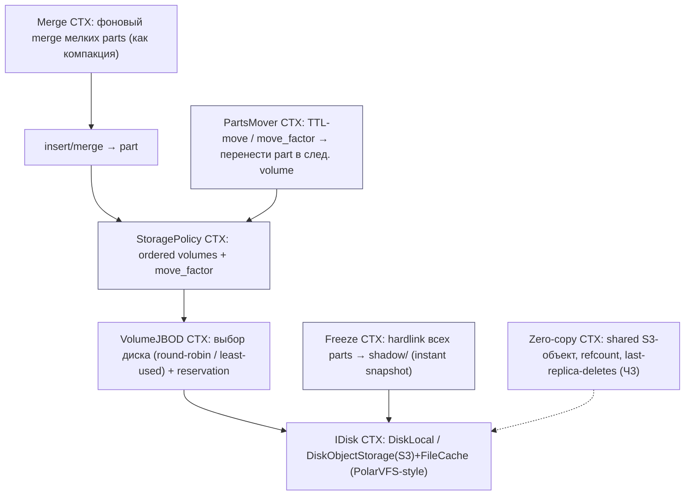
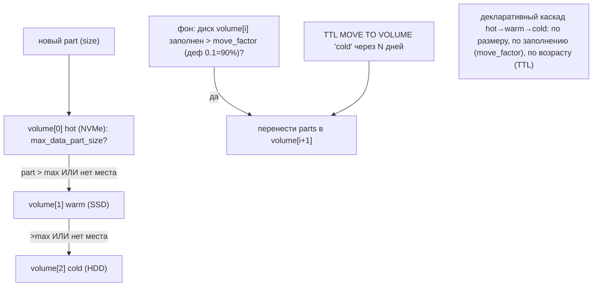
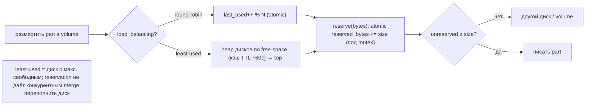
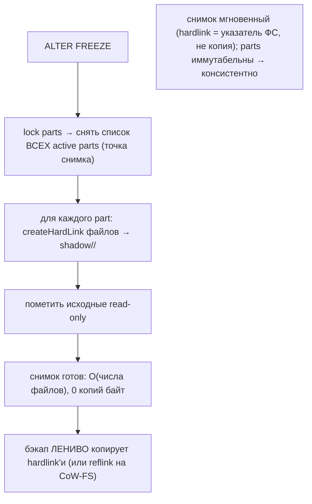
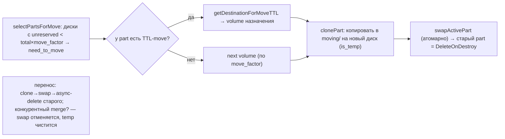
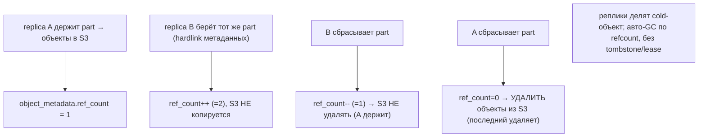
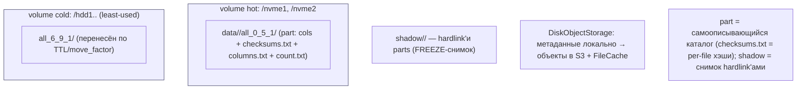
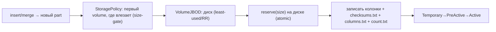
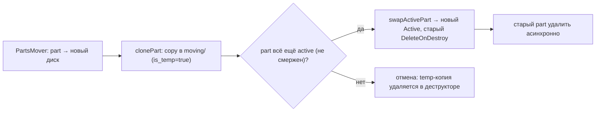
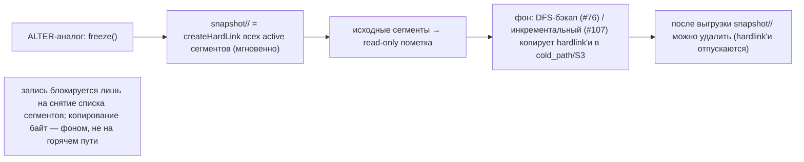

# ClickHouse Storage — как ClickHouse работает с HDD/SSD (DDD-разбор исходников)

> Исследование исходников **ClickHouse/ClickHouse** (`Vendor/ClickHouse`, свежий слой, commit
> `c271b20d` от 2026-06-09). Все факты — с ссылками `файл:строка`, проверены в коде.

ClickHouse — колоночная OLAP-БД (C++), движок **MergeTree**: иммутабельные **parts** (как сегменты),
фоновый **merge** (как компакция), sparse primary index + marks, skip-индексы, **multi-disk volumes +
storage policies** (наш сценарий на 60 дисках!), TTL-moves между тирами, IDisk-абстракция, S3+кэш,
hardlink-freeze. Колоночность/кодеки/проекции к **непрозрачным блокам неприменимы** → **тяжёлая
конвергенция** (parts≈pack-сегменты, merge≈компакция, sparse index≈Summary, skip-index≈min/max #91 +
bloom #19, IDisk≈PolarVFS #45, disk-cache≈deep-storage+кэш, reservation≈reserved-space, zero-copy
refcount≈#107). Genuinely **новое/острее** (берём):

1. **★ Declarative storage policies** — упорядоченные **volumes** (каждый = набор дисков) + **move_factor**
   (авто-перенос в следующий volume, когда диск заполнен > порога) + **max_data_part_size per volume**
   (крупное сразу в холодный тир) + **TTL MOVE TO VOLUME** (перенос по возрасту). Декларативное авто-тиринг.
2. **★ Hardlink instant FREEZE** — снимок = **hardlink всех текущих parts** в `shadow/` (O(файлов),
   zero-copy), затем бэкап лениво копирует. Мгновенный консистентный снапшот.
3. **★ Zero-copy shared-object refcount + last-replica-deletes** — реплики делят один объект в
   cold/object-store, refcount, **последняя удаляет** (без tombstone/lease) — для Части 3.

> Контекст: MergeTree — ещё один parts+merge engine (валидация наших сегментов). Берём 3 приёма выше;
> остальное — конвергенция. Колоночность/codecs/projections — мимо (блоки непрозрачны).

---

## 1. Bounded Contexts



| Контекст | Ответственность | Файлы |
|---|---|---|
| **StoragePolicy** | ordered volumes + move_factor | `src/Disks/StoragePolicy.cpp`, `IStoragePolicy.h` |
| **VolumeJBOD** | выбор диска в volume (RR/least-used) + size-gate | `src/Disks/VolumeJBOD.cpp`, `IVolume.h` |
| **IDisk / ObjectStorage** | pluggable backend (local/S3/cached) | `src/Disks/IDisk.h`, `DiskObjectStorage/*` |
| **PartsMover** | TTL-move / move_factor перенос parts | `src/Storages/MergeTree/MergeTreePartsMover.cpp` |
| **Freeze** | hardlink-снимок parts → shadow/ | `MergeTreeData.cpp:9590-9694`, `Backup.cpp` |
| **Merge / part** | иммутабельные parts + фон-merge | `MergeTreeData.cpp`, `IMergeTreeDataPart.*` |
| **Zero-copy** | shared-object refcount, last-deletes | `DiskObjectStorageMetadata.h`, `MetadataStorage*Operations.cpp` |

---

## 2. Архитектурные диаграммы (Mermaid)

### Ch1. Storage policy: volumes + move-factor (авто-тиринг)



### Ch2. VolumeJBOD: выбор диска + reservation



### Ch3. Hardlink instant FREEZE (zero-copy снимок)



### Ch4. PartsMover: TTL-move / move_factor



### Ch5. Zero-copy: shared-object refcount (Ч3)



---

## 2-bis. Файловая система: раскладка и потоки (Mermaid)

> ClickHouse: таблица = parts на дисках (по storage policy); part = каталог с колонками + sidecar
> (checksums.txt/columns.txt/count.txt). Снимки — в `shadow/`. S3-диск: метаданные локально, данные в S3.

### FS1. Раскладка: volumes + parts + shadow



### FS2. Запись part: policy → volume → диск → reserve



### FS3. FREEZE: hardlink в shadow/

```mermaid
sequenceDiagram
    participant U as ALTER FREEZE
    participant M as MergeTreeData
    participant D as IDisk
    U->>M: freezePartitionsByMatcher
    M->>M: lock parts → список active parts (снимок)
    loop по каждому part
        M->>D: createHardLink(part/* → shadow/<id>/.../part/*)
        D-->>M: hardlink (0 копий байт)
    end
    M->>D: setReadOnly(исходные)
    Note over M,D: снимок мгновенный; бэкап лениво копирует hardlink'и позже
```

### FS4. TTL-move part между дисками (clone→swap→delete)



---

## 3. Ubiquitous Language (термины ClickHouse)

| Термин ClickHouse | Значение | Наш аналог |
|---|---|---|
| **part** | иммутабельный кусок данных | pack-сегмент |
| **merge** | слить мелкие parts в крупный | компакция сегментов |
| **storage policy** | ordered volumes + move_factor | декларативный тиринг |
| **volume** | набор дисков + стратегия | тир (группа дисков) |
| **move_factor** | порог заполнения → авто-перенос | авто-триггер тиринга |
| **max_data_part_size** | крупное → в след. volume | size-gate тира |
| **TTL MOVE TO VOLUME** | перенос part по возрасту | тиринг по TTL |
| **reservation** | резерв места перед записью | reserved-space (#56) |
| **FREEZE / shadow/** | hardlink-снимок parts | instant snapshot |
| **IDisk** | pluggable backend | PolarVFS-порт (#45) |
| **zero-copy refcount** | shared S3-объект, last-deletes | shared-segment refcount (#107) |
| **skip index / marks** | min/max/bloom granule-skip; sparse index | min/max-skip #91 + bloom #19 + Summary #50 |
| **codecs/projections** | колоночное сжатие/проекции | ⚠️ не наше (блоки непрозрачны) |

---

## 4. Storage policies + volumes + move-factor (★ берём)

`StoragePolicy` (`StoragePolicy.cpp:44-140`) = **упорядоченный список volumes** + `move_factor`
(деф 0.1 при >1 volume → переносить, когда диск заполнен >90%; `IStoragePolicy.h:49`). `VolumeJBOD`
(`VolumeJBOD.cpp:94-188`): диск в volume по `round-robin` (`last_used++ % N`) или `least-used`
(heap по free-space, кэш `least_used_ttl_ms` ~60с); `max_data_part_size` (`IVolume.h:105`) — part
больше → reject → следующий volume. **Reservation** (`DiskLocal.cpp:67-128`): `reserve(bytes)` атомарно
`reserved_bytes += size` под mutex → конкурентные merge не переполнят диск. **PartsMover**
(`MergeTreePartsMover.cpp:103-375`): `selectPartsForMove` (диски с `unreserved < total×move_factor` +
TTL-move) → `clonePart` (copy в `moving/`) → `swapActivePart` (атом) → старый `DeleteOnDestroy`.

> Для нас: **самый ценный** приём. Декларативные **тиры (volumes) + авто-move-factor + size-gate +
> TTL MOVE** — единый каркас тиринга вместо разрозненных RocksDB-temperature (#...) / Druid drop-rules
> (#55) / disk-balancer (#101). Конфиг: `volumes: [hot(NVMe), warm(SSD), cold(HDD/cold_path)]`,
> `move_factor`, `max_segment_size_per_tier`, `move_ttl`. least-used + reservation ⟷ HDFS volume-choosing
> (#...) + reserved-space (#56) (конвергенция).

## 5. Hardlink instant FREEZE (★ берём)

`freezePartitionsByMatcher` (`MergeTreeData.cpp:9590-9694`): lock parts → снять список **всех active
parts** (точка снимка) → для каждого `createHardLink` файлов в `shadow/<id>/` (`Backup.cpp:22-93`,
`copy_instead_of_hardlink=false`) → пометить исходные read-only. **Снимок = O(числа файлов), 0 копий
байт** (hardlink — указатель ФС). Бэкап потом **лениво** копирует hardlink'и (или `reflink` на CoW-FS).
Краш-безопасно: parts иммутабельны, завершённые hardlink'и консистентны, freeze идемпотентен.

> Для нас: мгновенный **консистентный снимок набора сегментов** = hardlink всех текущих сегментов в
> `snapshot/<id>/` → потом DFS-бэкап (#76) / инкрементальный (#107) копирует лениво. Снимок не блокирует
> запись надолго (только на снятие списка), копирование — фоном. Усиливает наш backup: **сначала
> мгновенный hardlink-freeze, потом ленивая выгрузка**.

## 6. Zero-copy shared-object refcount (★ берём, Ч3)

`DiskObjectStorageMetadata` (`.h:12-46`): `ref_count` + `objects` (StoredObjects). Hardlink метаданных
→ `ref_count++` (`MetadataStorage*Operations.cpp:370`); unlink → `ref_count--`; **`ref_count==0` →
удалить объекты из S3** (`:158-170`). Несколько реплик делят **один** S3-объект (не копируют), GC —
по refcount, **последняя реплика удаляет**. Координация перемещений — lock в Keeper
(`lockSharedData`, `MergeTreePartsMover.cpp:362`).

> Для нас: **Часть 3** (несколько gateway над общим cold_path/S3): сегмент в cold-store **один**,
> gateway'и ссылаются + refcount; последний дропнувший — удаляет. Без tombstone/lease. Расширяет
> shared-segment refcount (#107, там — между бэкап-точками) на **живые реплики/gateway**. ⚠️ Ч3.

## 7. Конвергенция (parts+merge+index+disk = валидация)

- **parts (иммутабельные) + state-machine** (`MergeTreeDataPartState.h`: Temporary→PreActive→Active→
  Outdated→DeleteOnDestroy) ⟷ наши сегменты active→sealed + two-phase delete (#84).
- **фоновый merge** (мелкие parts→крупный, не merge'ить огромные при нехватке места) ⟷ компакция +
  backlog-controller (#52) + minor/major (Hive #105).
- **sparse primary index + marks (.mrk)** (`index_granularity` 8192 / адаптивный по байтам) ⟷ sparse
  Summary (#50); адаптивная гранулярность по байтам ⟷ наши micro ~16КБ.
- **skip-индексы (minmax/set/bloom/ngram)** (`MergeTreeIndexMinMax/BloomFilter.h`) ⟷ min/max-skip (#91)
  + Bloom (#19) + вторичный индекс (#115); ClickHouse даёт **фреймворк pluggable skip-index** (можно
  обобщить наши в декларируемые индексы по атрибуту).
- **IDisk (DiskLocal/DiskObjectStorage/Cached)** ⟷ PolarVFS-порт (#45); **FileCache над S3** ⟷
  deep-storage+кэш (Druid #57) + object-store-гигиена (InfluxDB #95).
- **reservation** ⟷ reserved-space (#56); **JBOD least-used** ⟷ HDFS volume-choosing (#...) / HRW-by-free (#2).
- **part self-description** (checksums.txt per-file + columns/count) ⟷ манифест сегмента + per-micro
  checksum (#34/#66).
- **колоночные codecs / projections** ⟷ **НЕ берём** (блоки непрозрачны, нет колонок/агрегаций).

---

## 8. Философия и вывод XFS/ZFS

ClickHouse — снова «иммутабельные parts + фон-merge + multi-disk JBOD + tiering» на голом FS (DiskLocal
поверх XFS/ext4), durability — репликацией (ReplicatedMergeTree через Keeper), не CoW-ФС. **ADR 0001**
(JBOD+app-репликация). Уникальное — **декларативные storage policies** (move_factor/TTL) и
**hardlink-freeze**: тонкое тиринг/снапшот без «умной» ФС. ZFS под этим — лишний слой (parts уже
иммутабельны).

## 9-bis. Снипеты кода (реальные выдержки + объяснение)

> Короткие выдержки из исходников ClickHouse (проверены, `файл:строка`) — что именно делает каждый
> ключевой механизм. Справа — как ложится на наш дизайн.

### CS1. Выбор диска в volume: round-robin / least-used (#116)

```cpp
// src/Disks/VolumeJBOD.cpp:94 — getDisk()
case VolumeLoadBalancing::ROUND_ROBIN: {
    size_t start_from = last_used.fetch_add(1u, std::memory_order_acq_rel);
    return disks[start_from % disks.size()];          // атомарный счётчик, без локов
}
case VolumeLoadBalancing::LEAST_USED: {
    std::lock_guard lock(mutex);
    if (!least_used_ttl_ms || watch.elapsedMilliseconds() >= least_used_ttl_ms) {
        disks_by_size = LeastUsedDisksQueue(disks.begin(), disks.end()); // пересобрать heap по free
        watch.restart();                              // кэш свежести ~60с (не дёргать df каждый раз)
    }
    return disks_by_size.top().disk;                  // диск с макс. свободным местом
}
```

**Объяснение:** внутри тира (volume) диск выбирается либо **round-robin** (дёшево, атомарный счётчик),
либо **least-used** (heap по свободному месту с TTL-кэшем ~60с, чтобы не звать `df` на каждую запись).
→ **Нам:** ровно наш выбор диска в тире — `selector: hrw | least-bytes-used | round-robin` (#2). Урок:
**кэшировать «свободное место» на ~60с**, а не мерить на каждый put.

### CS2. Size-gate volume'а: крупное → следующий тир (#116)

```cpp
// src/Disks/VolumeJBOD.cpp:127 — reserveImpl()
// "parts of size greater than max_data_part_size go to another volume(s)"
if (max_data_part_size != 0 && bytes > max_data_part_size)
    return {};                                        // reject → policy пойдёт в следующий volume
```

**Объяснение:** если part больше лимита тира — резерв **отклоняется**, и storage-policy кладёт его в
следующий (более ёмкий/холодный) volume. → **Нам:** `max_segment_size_per_tier` — крупные сегменты
сразу в cold-тир, мелкие/горячие — на NVMe/SSD.

### CS3. move_factor: что переносить, когда диск заполняется (#116)

```cpp
// src/Storages/MergeTree/MergeTreePartsMover.cpp:123 — selectPartsForMove()
for (size_t i = 0; i != volumes.size() - 1; ++i)         // последний volume не трогаем
  for (const auto & disk : volumes[i]->getDisks()) {
    UInt64 required = total_space * policy->getMoveFactor();           // напр. 0.1 → нужно 10% свободно
    if (unreserved_space < required && !disk->isBroken())
        need_to_move.emplace(disk, required - unreserved_space);       // освободить столько байт
  }
// дальше: parts с TTL-move → в целевой volume; иначе — в следующий volume по каскаду
```

**Объяснение:** фон каждые N сек смотрит: на дисках всех тиров (кроме последнего) свободно ли ≥
`move_factor`? Если нет — выбирает parts и **переносит в следующий тир**, пока не освободит порог.
Плюс **TTL-move** (по возрасту в конкретный volume). → **Нам:** авто-тиринг по **заполнению**
(`move_factor`) и **возрасту** (`move_ttl`) — единый каркас вместо ручных решений.

### CS4. Hardlink instant FREEZE: снимок без копий (#117)

```cpp
// src/Storages/MergeTree/Backup.cpp:52 — рекурсивный обход part'а
if (!src_disk->existsDirectory(source)) {
    if (make_source_readonly) src_disk->setReadOnly(source);          // исходник → read-only
    if (copy_instead_of_hardlinks || files_to_copy_instead_of_hardlinks.contains(it->name()))
        src_disk->copyFile(source, *dst_disk, destination, ...);      // редкое исключение — копия
    else
        src_disk->createHardLink(source, destination);               // ОБЫЧНО: hardlink (0 копий байт)
}
```

**Объяснение:** `FREEZE` снимает список active-parts (точка снимка) и **hardlink'ит** все их файлы в
`shadow/<id>/` — это указатели ФС, **не копирование** (O(числа файлов), мгновенно); исходники
помечаются read-only. Бэкап потом лениво копирует hardlink'и. → **Нам:** мгновенный консистентный
снимок набора сегментов = `createHardLink` всех в `snapshot/<id>/` → потом DFS/инкрементальный
бэкап (#76/#107) копирует фоном, не блокируя запись.

### CS5. Zero-copy refcount: последняя реплика удаляет объект (#118)

```cpp
// src/Disks/.../Local/MetadataStorageFromDiskTransactionOperations.cpp:158 — tryUnlinkMetadataFile()
uint32_t ref_count = object_metadata->ref_count;
if (ref_count > 0) {
    object_metadata->ref_count -= 1;                  // эта реплика отпустила ссылку
    write_operation = ...; write_operation->execute();// сохранить новый refcount
}
if (ref_count == 0 && should_remove_objects)
    removed_objects.append_range(object_metadata->objects);  // refcount=0 → удалить из object-store
// ...а createHardLink метаданных делает: object_metadata->ref_count += 1;  (строка 370)
```

**Объяснение:** несколько реплик ссылаются на **один** объект в object-store; hardlink метаданных →
`ref_count++`, unlink → `ref_count--`; когда счётчик дошёл до **0** — объект реально удаляется. GC по
refcount, **без tombstone/lease**. → **Нам (Ч3):** gateway'и над общим cold_path/S3 делят сегмент по
refcount; последний дропнувший — удаляет.

### CS6 (диаграмма). Поток FREEZE → ленивый бэкап (как складываются #117 + #76/#107)



---

## 9. Извлечённые идеи для OpenZFS Daemon

| # | Идея | Где у ClickHouse | Берём? | Фаза | Влияние |
|---|---|---|---|---|---|
| 116 | **★ Declarative storage policies: volumes + move_factor + size-gate + TTL-move** | `StoragePolicy.cpp`, `VolumeJBOD.cpp`, `MergeTreePartsMover.cpp` | ✅ да | **5** | единый каркас тиринга hot→warm→cold: авто-move по заполнению/размеру/возрасту (объединяет #55/#101/temperature) |
| 117 | **★ Hardlink instant FREEZE** — снимок = hardlink всех сегментов (O(файлов), 0 копий) → ленивый бэкап | `MergeTreeData.cpp:9590-9694`, `Backup.cpp` | ✅ да | **5** | мгновенный консистентный снимок, не блокирует запись; копирование фоном (усиливает #76/#107) |
| 118 | **★ Zero-copy shared-object refcount + last-replica-deletes** | `DiskObjectStorageMetadata.h`, `MetadataStorage*Operations.cpp:158-370` | ⚠️ Ч3 | **—** | несколько gateway делят cold-сегмент, авто-GC по refcount, без tombstone/lease (расширяет #107) |

### Конвергенция (ClickHouse = валидация, не новые строки)
- **иммутабельные parts + state-machine + фон-merge** ⟷ сегменты + two-phase delete (#84) + компакция.
- **sparse index + marks (адаптивная гранулярность)** ⟷ Summary (#50) + micro ~16КБ.
- **skip-индексы minmax/bloom** ⟷ min/max-skip (#91) + Bloom (#19) + вторичный индекс (#115).
- **IDisk + DiskObjectStorage + FileCache** ⟷ PolarVFS (#45) + deep-storage+кэш (#57) + object-store-гигиена (#95).
- **reservation + JBOD least-used** ⟷ reserved-space (#56) + volume-choosing/HRW (#2).
- **part self-description (checksums.txt)** ⟷ манифест + per-micro checksum (#34/#66).
- **колоночные codecs/projections** ⟷ **НЕ берём** (непрозрачные блоки).

### Главные новые заимствования
**#116 declarative storage policies** (volumes + move_factor + TTL-move) — единый декларативный каркас
тиринга на 60 дисках (заменяет россыпь ручных тиринг-идей). **#117 hardlink-freeze** — мгновенный
снимок перед ленивым бэкапом. **#118 shared-object refcount** — задел Части 3 (multi-gateway над
shared cold). Остальное — конвергенция (parts+merge+index+disk).

---

## 10. Источники в коде (для перепроверки)

| Область | Файл | Ключевые места |
|---|---|---|
| Storage policy / volumes | `src/Disks/StoragePolicy.cpp`, `IStoragePolicy.h`, `IVolume.h` | SP 44-140; ISP 49-90; IV 105 |
| VolumeJBOD (выбор диска) | `src/Disks/VolumeJBOD.cpp/.h` | 94-188 (getDisk/reserveImpl), least-used |
| Reservation | `src/Disks/DiskLocal.cpp` | 67-128 |
| PartsMover (TTL/move-factor) | `src/Storages/MergeTree/MergeTreePartsMover.cpp` | 103-375 |
| Freeze (hardlink) | `src/Storages/MergeTree/MergeTreeData.cpp`, `Backup.cpp` | MTData 9590-9694; Backup 22-223 |
| IDisk / ObjectStorage | `src/Disks/IDisk.h`, `DiskObjectStorage/*` | IDisk 142-399; DOS 24-151 |
| Zero-copy refcount | `…/DiskObjectStorageMetadata.h`, `MetadataStorageFromDiskTransactionOperations.cpp` | meta 12-46; ops 158-370 |
| Skip-индексы | `…/MergeTree/MergeTreeIndex{MinMax,BloomFilter}.h` | MinMax 11-91; Bloom 20-159 |
| Part state / checksums | `…/MergeTree/MergeTreeDataPartState.h`, `MergeTreeDataPartChecksum.h` | state 18-26; ck 19-93 |
| Гранулярность | `…/MergeTree/MergeTreeIndexGranularityInfo.h` | 40-60 |

---

> **Резюме для проекта.** ClickHouse — 22-й прототип; колоночная OLAP (MergeTree) → **тяжёлая
> конвергенция** (parts≈сегменты, merge≈компакция, sparse+skip-индекс≈Summary+min/max+bloom,
> IDisk≈PolarVFS, reservation≈reserved-space, zero-copy refcount≈#107). Колоночность/codecs/projections —
> мимо (блоки непрозрачны). Новое: **#116 declarative storage policies** (volumes + move_factor +
> size-gate + TTL-move — единый каркас тиринга), **#117 hardlink instant FREEZE** (мгновенный снимок →
> ленивый бэкап), **#118 shared-object refcount + last-deletes** (Ч3, multi-gateway над shared cold). См.
> [STORAGE-IDEAS-SYNTHESIS.md](STORAGE-IDEAS-SYNTHESIS.md), [[druid-storage-hdd-ssd.md]] (drop-rules/тиринг),
> [[hadoop-storage-hdd-ssd.md]] (volume-choosing/disk-balancer), [[flink-storage-hdd-ssd.md]] (incremental backup), [Feynman](../../Feynman/README.md).
