# CockroachDB Storage — как CockroachDB работает с HDD/SSD (DDD-разбор исходников)

> Исследование исходников **cockroachdb/cockroach** (`Vendor/cockroach`, свежий слой, commit `5f5932a`
> от 2026-06-06). Движок — **Pebble** (`v0.0.0-20260601…`, уже разобран отдельно). Все факты — с
> ссылками `файл:строка`, проверены в коде; ключевые места — **с реальными снипетами** (см. §9-bis).

CockroachDB — распределённая SQL-БД (Go) на LSM-движке **Pebble**. Данные нарезаны на **ranges**
(~512 МБ), каждый реплицируется через **Raft** (R=3), размещение — **allocator** по ёмкости/нагрузке/
диверсити. ⚠️ **Сильная конвергенция с [Pebble](pebble-storage-hdd-ssd.md)** (#... — LSM, value-sep,
компакция, WAL, bloom, disk-slow). Поэтому движок = **повторная валидация**; копаем **cockroach-уровень**,
где по-настоящему ново для 60-HDD-узла:

1. **★ Ballast-файл: graceful-recovery из full-disk** — резерв ~1ГБ; диск «полон», если `avail <
   ballast/2`; оператор **удаляет ballast** → освобождает место, чтобы расклинить забитый диск.
2. **★ WAL failover на запасной диск** — при стопе primary-диска движок **прозрачно переносит WAL**
   на другой стор/путь → latency коммита **изолирована от одного тормозящего диска**.
3. **★ Per-disk монитор `/proc/diskstats` (100мс) + trace-on-stall + градуированная реакция** —
   `MaxSyncDuration` (20с) → сначала **make-process-unavailable**, потом fatal; дамп истории latency.
4. **★ Двухуровневый порог заполнения с гистерезисом** — `0.95` (сбрасывать/не класть) vs `0.925`
   (не делать целью ребаланса) → нет «пинг-понга» реплик между дисками.
5. **★ Admission-control: disk-bandwidth токены для elastic-работы** — фон (компакция/снапшот/бэкап)
   получает `goal_util×provisioned − reads` токенов; **foreground никогда не душится**.
6. **★ IngestAndExcise + range-tombstone** — атомарно «влить новые SSTable + вырезать старый диапазон»;
   дешёвое удаление целого диапазона одним tombstone (порог point-delete vs range-delete).

> Контекст-конвергенция (НЕ новые строки): Pebble LSM/value-sep/компакция/WAL/bloom/disk-slow = уже у
> нас; range-split по 512МБ — **контраст** (мы content-addressed, фикс-блоки, HRW, не range-split);
> MVCC-таймстемпы = reader-watermark (#106); AddSSTable bulk = #123 (Dgraph StreamWriter); snapshot-
> streaming = наш resilver + multi-source (#89); allocator diversity = failure-domains (#... YDB);
> encryption-at-rest (AES-GCM, 64КБ-чанки) = опц. для нас.

---

## 1. Bounded Contexts

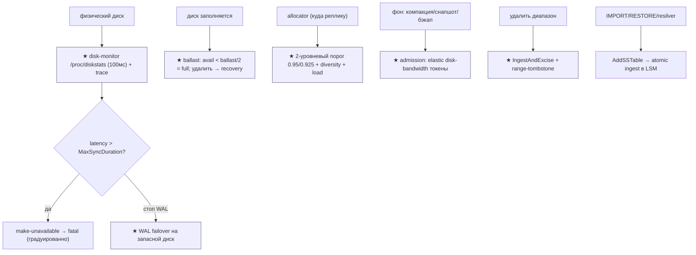

| Контекст | Ответственность | Файлы |
|---|---|---|
| **★ Disk health** | /proc/diskstats монитор, stall→trace→fatal | `storage/disk/monitor.go`, `linux_parse.go`, `storage/pebble.go` |
| **★ Ballast** | резерв места, full-disk recovery | `storage/ballast.go` |
| **★ WAL failover** | перенос WAL на запасной диск | `storage/storageconfig/wal_failover.go` |
| **★ Allocator** | размещение: ёмкость/diversity/load + гистерезис | `kvserver/allocator/allocatorimpl/allocator_scorer.go`, `storepool/store_pool.go` |
| **★ Admission (IO)** | elastic disk-bandwidth токены | `util/admission/disk_bandwidth.go`, `io_load_listener.go` |
| **Bulk / SSTable** | AddSSTable, IngestAndExcise, SSTWriter | `kvserver/batcheval/cmd_add_sstable.go`, `storage/sst_writer.go`, `storage/pebble.go` |
| **Snapshot streaming** | replica-move через SSTable + rate-limit | `kvserver/kv_snapshot_strategy.go`, `store_snapshot.go` |
| **Range delete** | excise / range-tombstone + порог | `kvserver/batcheval/cmd_excise.go`, `cmd_clear_range.go` |
| **Capacity** | отчёт total/avail/used/logical + load | `storage/pebble.go` (Capacity), `kvserver/store.go` |

---

## 2. Архитектурные диаграммы (Mermaid)

### Cr1. Ballast: graceful full-disk recovery (★)

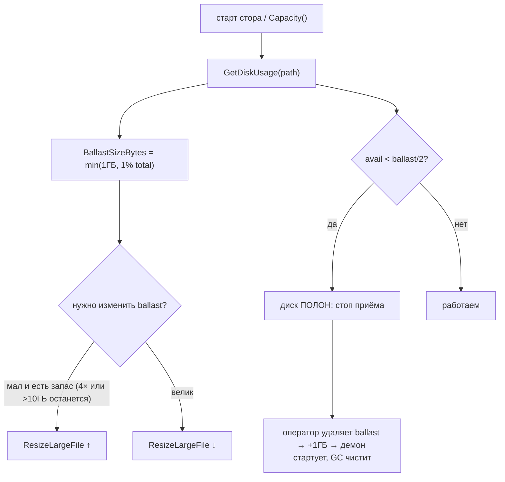

### Cr2. Disk-stall: монитор → trace → градуированная реакция (★)

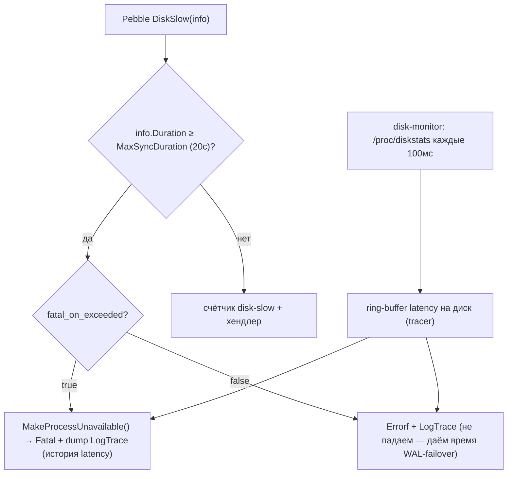

### Cr3. WAL failover на запасной диск (★)

```mermaid
sequenceDiagram
    participant W as writer (commit)
    participant P as primary WAL диск
    participant S as secondary диск/путь
    W->>P: append WAL
    Note over P: высокая latency (стоп)
    P-->>W: медленно...
    W->>S: ★ failover: писать WAL сюда
    S-->>W: commit подтверждён (latency изолирована)
    Note over P,S: при восстановлении primary — вернуться;\nMaxSyncDuration поднят, чтобы дать время на failover
```

### Cr4. Allocator: 2-уровневый порог + гистерезис (★)

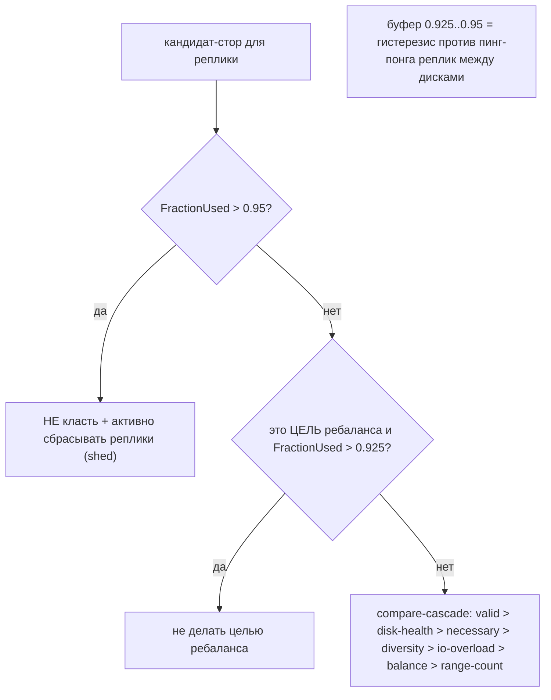

### Cr5. Admission: elastic disk-bandwidth токены (★)

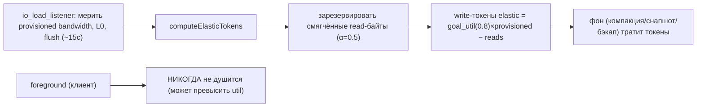

### Cr6. Range-split (контраст с нашим content-addressed)

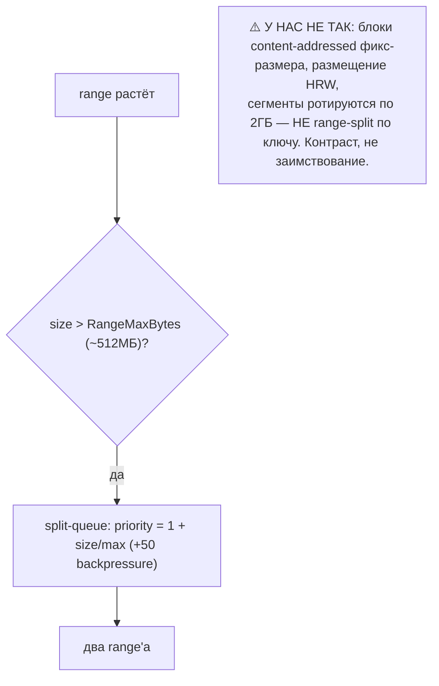

---

## 2-bis. Файловая система: раскладка и потоки (Mermaid)

### FS1. Раскладка стора на диске

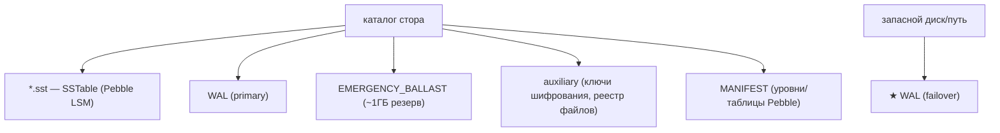

### FS2. Capacity: что считаем «занято/свободно»

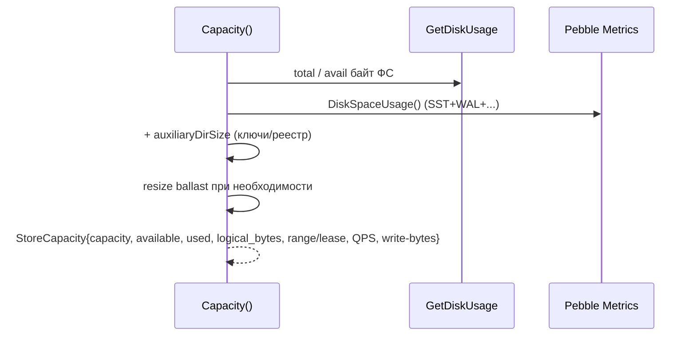

### FS3. AddSSTable → атомарный ingest в LSM

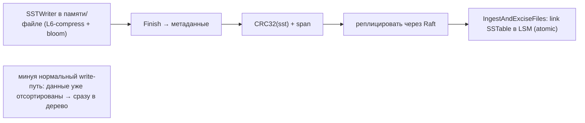

### FS4. Snapshot replica-move через SSTable + rate-limit

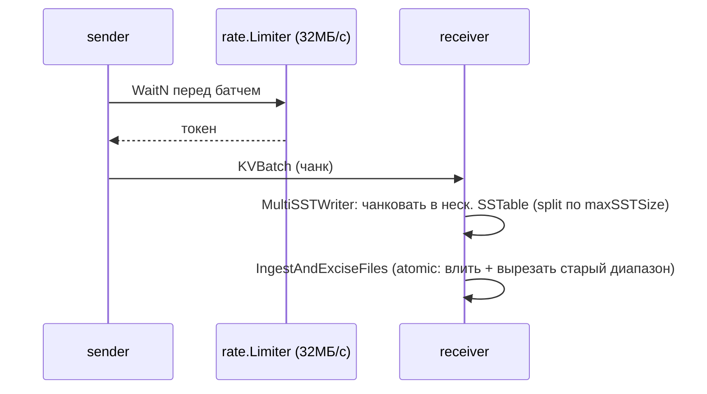

### FS5. IngestAndExcise + range-tombstone (дешёвое удаление диапазона)

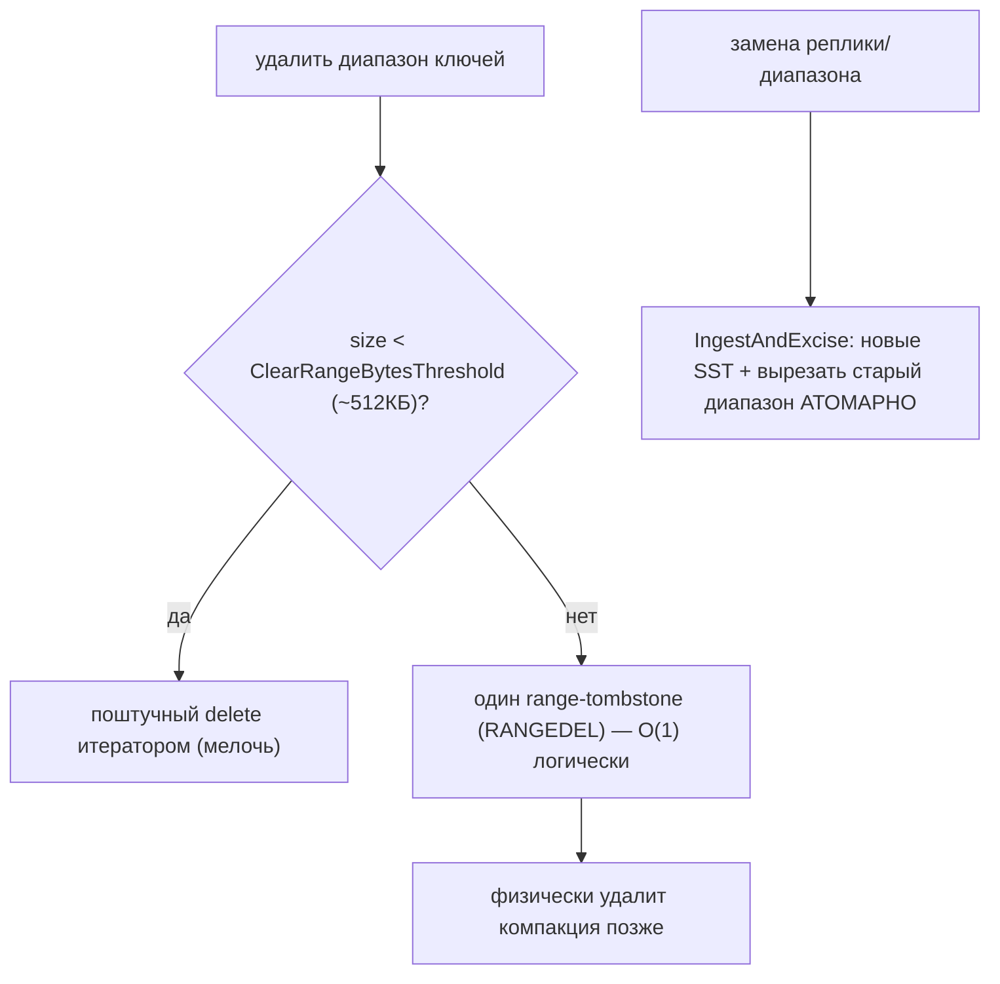

### FS6. Ballast: жизненный цикл и full-disk recovery

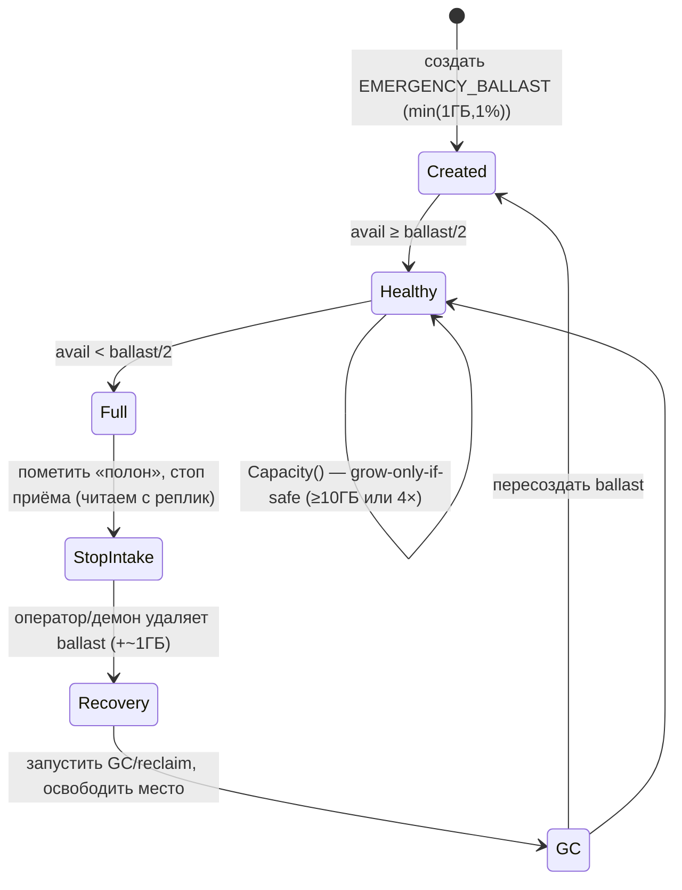

### FS7. Admission: elastic/foreground разделение полосы

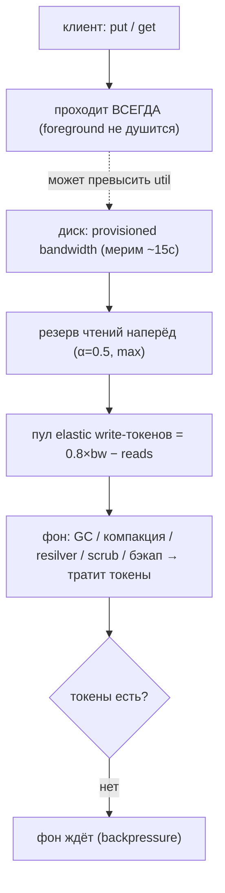

---

## 3. Ubiquitous Language (термины CockroachDB → наши)

| Термин | Значение | Наш аналог |
|---|---|---|
| **store** | один диск/движок Pebble на узле | шард = диск |
| **range** | диапазон ключей ~512МБ, единица репликации | ⚠️ контраст: у нас фикс-блоки + HRW |
| **ballast** | резервный файл для recovery из full-disk | **★ новое** (#127) |
| **WAL failover** | перенос WAL на запасной диск при стопе | **★ новое** (#128) |
| **MaxSyncDuration** | порог stall (20с) → unavailable→fatal | disk-slow (#... Pebble) + градация |
| **FractionUsed / 0.95 / 0.925** | заполнение + 2 порога с гистерезисом | HRW-by-free + disk-balancer + **★ гистерезис** (#130) |
| **diversity score** | спред реплик по failure-доменам | realm/domain (#... YDB) |
| **elastic vs foreground** | фон vs клиент в admission | Forseti scheduling-groups + regulator |
| **AddSSTable / IngestAndExcise** | bulk-ingest + атомарная вырезка | bulk-loader (#123) + **★ excise** (#132) |
| **range-tombstone (RANGEDEL)** | удалить диапазон одним маркером | time-bucketed drop (#92) + **★ порог** (#132) |
| **snapshot (replica-move)** | стрим range'а в SSTable + ingest | resilver + multi-source (#89) |

---

## 4. Что берём (★) и почему — кратко

| # | Идея | Откуда | Зачем нам |
|---|---|---|---|
| **127** | Ballast-файл: full-disk graceful-recovery | `storage/ballast.go` | расклинить забитый диск (удалить резерв); full = avail < ballast/2; grow-only-if-safe |
| **128** | WAL failover на запасной диск при стопе | `storageconfig/wal_failover.go` | latency коммита изолирована от одного тормозящего из 60 дисков |
| **129** | /proc/diskstats монитор (100мс) + trace-on-stall + градация unavailable→fatal | `storage/disk/monitor.go`, `pebble.go` | ранняя диагностика + аккуратная деградация (дать время failover) |
| **130** | 2-уровневый порог заполнения с гистерезисом (0.95/0.925) + compare-cascade | `allocator_scorer.go` | нет «пинг-понга» реплик/блоков между дисками при балансировке |
| **131** | Admission: elastic disk-bandwidth токены (foreground не душить) | `disk_bandwidth.go`, `io_load_listener.go` | фон берёт `goal_util×bw − reads`; клиент всегда приоритетен |
| **132** | IngestAndExcise (atomic влить+вырезать) + range-tombstone с порогом | `pebble.go`, `cmd_excise.go`, `cmd_clear_range.go` | атомарная замена диапазона при migration; дёшево удалить целый префикс/зону |

---

## 5. Конвергенция (CockroachDB ≈ Pebble ≈ наш дизайн — повторная валидация)

- Движок **Pebble**: LSM, value-sep, компакция, WAL, bloom, **disk-slow** — всё уже у нас (Pebble — наш
  прямой прототип). CockroachDB = валидация выбора + cockroach-уровневые надстройки.
- **range-split по 512МБ** — **контраст**: мы content-addressed (фикс-блоки, HRW, ротация сегментов 2ГБ),
  ключи случайные → не делим по диапазону ключа. Counter-lesson (как directory-hashing HDFS).
- **MVCC-таймстемпы** = reader-watermark (#106) / MVCC-снимок redb.
- **AddSSTable bulk** = #123 (Dgraph StreamWriter); **snapshot-streaming** = resilver + chunk-range
  (#86) + multi-source (#89) + rate-limit (Forseti).
- **allocator diversity** = failure-domains realm/domain (#... YDB); **capacity-by-free** = HRW-by-free (#2).
- **admission elastic/foreground** = Forseti scheduling-groups + regulator (#97) + backlog-controller —
  cockroach добавляет конкретную формулу disk-bandwidth-токенов.
- **encryption-at-rest** (AES-GCM, 64КБ-чанки, PBKDF2) — опц. за `ShardEngine`-портом.

---

## 9-bis. Снипеты кода (реальные выдержки + объяснение)

### CR1. Ballast: диск «полон», если avail < ballast/2 (#127)

`storage/ballast.go:25-98` (сокращённо):

```go
// A disk is considered to be full if available capacity is less than half of
// the store's ballast size.
func IsDiskFull(fs vfs.FS, spec base.StoreSpec) (bool, error) {
    diskUsage, err := fs.GetDiskUsage(path)
    ...
    desiredSizeBytes := BallastSizeBytes(spec, diskUsage)   // min(1ГБ, 1% total)
    ballastPath := base.EmergencyBallastFile(fs.PathJoin, spec.Path)
    maybeEstablishBallast(fs, ballastPath, desiredSizeBytes, diskUsage)
    return diskUsage.AvailBytes < uint64(desiredSizeBytes/2), nil
}
```

**Зачем нам:** держать на каждом из 60 HDD маленький резерв; когда диск забивается — пометить «полон»
ДО реального нуля (avail < резерв/2), оператор удаляет резерв → есть место расклинить и запустить GC.

### CR2. Ballast: растить только если безопасно (#127)

`storage/ballast.go:115-170`:

```go
extendBytes := ballastSizeBytes - currentSizeBytes
// Only extend ballast if available disk space is >= 4x required amount
if extendBytes <= int64(diskUsage.AvailBytes)/4 {
    return true, sysutil.ResizeLargeFile(ballastPath, ballastSizeBytes)
}
// Or if we'll have >= 10GB available after extension
if int64(diskUsage.AvailBytes)-extendBytes > (10 << 30) {
    return true, sysutil.ResizeLargeFile(ballastPath, ballastSizeBytes)
}
return false, nil    // иначе НЕ растим — не съедаем место для recovery
```

**Зачем:** резерв не должен сам добить диск. Растим, только если останется ≥10ГБ или есть 4×-запас.

### CR3. Disk-stall: градуированная реакция unavailable→fatal (#129)

`storage/pebble.go:1462-1499`:

```go
DiskSlow: func(info pebble.DiskSlowInfo) {
    maxSyncDuration := fs.MaxSyncDuration.Get(&p.cfg.settings.SV)        // 20с
    fatalOnExceeded := fs.MaxSyncDurationFatalOnExceeded.Get(...)
    if info.Duration.Seconds() >= maxSyncDuration.Seconds() {
        if fatalOnExceeded {
            log.MakeProcessUnavailable()                                  // стоп приёма
            log.Dev.Fatalf(ctx, "disk stall detected: %s\n%s", info, p.cfg.diskMonitor.LogTrace())
        } else {
            log.Dev.Errorf(ctx, "disk stall detected: %s\n%s", info, p.cfg.diskMonitor.LogTrace())
        }
        return
    }
    atomic.AddInt64(&p.diskSlowCount, 1)   // ниже порога — просто счётчик
},
```

**Зачем нам:** на стопе — сначала `MakeProcessUnavailable` (перестать принимать), затем дамп истории
latency (`LogTrace`) для диагностики, потом fatal. Не-fatal-режим даёт окно для WAL-failover.

### CR4. Per-disk монитор /proc/diskstats каждые 100мс (#129)

`storage/disk/monitor.go:22` + `linux_parse.go`:

```go
var DefaultDiskStatsPollingInterval = envutil.EnvOrDefaultDuration(
    "COCKROACH_DISK_STATS_POLLING_INTERVAL", 100*time.Millisecond)
// monitorDisks: тикер 100мс → collector.collect(disks) → tracer.RecordEvent (ring-buffer)
// linux_parse.go: парсит reads/writes/sectors/времена из /proc/diskstats на устройство
```

**Зачем:** независимый от движка per-disk сигнал (latency/IOPS) + кольцевой буфер истории, который
дампится при stall. Дополняет наш iotune (#49) и disk-slow живой телеметрией на 60 дисков.

### CR5. WAL failover: режимы (#128)

`storage/storageconfig/wal_failover.go:15-66`:

```go
const (
    WALFailoverDisabled       WALFailoverMode = 1
    WALFailoverAmongStores    WALFailoverMode = 2  // на другой стор того же узла
    WALFailoverToExplicitPath WALFailoverMode = 3  // на явный запасной путь
)
// "When a storage engine observes high latency writing to its WAL, it may
//  transparently failover to ... other store's data directory. Batch commit
//  latency is insulated from momentary disk stalls."
```

**Зачем нам:** index-tier WAL (на NVMe) при стопе одного носителя **переносить на запасной** (другой
NVMe/диск) → коммиты не висят из-за одного тормозящего устройства. Для 60-HDD это критично.

### CR6. Allocator: 2 порога заполнения с гистерезисом (#130)

`allocator_scorer.go:50-59` + `:774-784`:

```go
defaultMaxDiskUtilizationThreshold            = 0.95   // block + shed
defaultRebalanceToMaxDiskUtilizationThreshold = 0.925  // не делать целью ребаланса

func (do DiskCapacityOptions) maxCapacityCheck(store ...) bool {
    return store.Capacity.FractionUsed() < do.ShedAndBlockAllThreshold       // 0.95
}
func (do DiskCapacityOptions) rebalanceToMaxCapacityCheck(store ...) bool {
    return store.Capacity.FractionUsed() < do.RebalanceToThreshold           // 0.925
}
```

**Зачем нам:** буфер 0.925–0.95 = **гистерезис** — диск, чуть ниже 0.95, не станет целью нового
ребаланса (порог 0.925), иначе блоки «пинг-понгуют» туда-обратно. Прямо для нашего disk-balancer/HRW-by-free.

### CR7. Allocator: порядок предпочтения кандидатов (#130)

`allocator_scorer.go:893-950` (compare-cascade):

```go
if !c.valid { return -600 }          // нарушает constraints
if o.fullDisk { return 500 }         // диск-здоровье ВАЖНЕЕ балансировки
if c.necessary != o.necessary {...}  // нужен для constraints
if !scoresAlmostEqual(c.diversityScore, o.diversityScore) {...}  // спред по доменам
// ... затем io-overload, convergence, balance, range-count
```

**Зачем:** строгий приоритет — сначала валидность и **здоровье диска**, потом диверсити (failure-домены),
и лишь в конце «выровнять число». У нас аналогично: не класть на больной/полный диск важнее ровности.

### CR8. Admission: elastic write-токены из измеренной bandwidth (#131)

`util/admission/disk_bandwidth.go:148-200` + `io_load_listener.go:86`:

```go
const alpha = 0.5
smoothedReadBytes := alpha*float64(id.intReadBytes) + alpha*float64(d.state.prevDiskLoad.intReadBytes)
intReadBytes := int64(math.Max(smoothedReadBytes, float64(id.intReadBytes)))   // пессимистично
// write-токены elastic = goal_util × provisioned − зарезервированные reads
diskWriteTokens := int64(float64(id.intProvisionedDiskBytes)*id.elasticBandwidthMaxUtil) - intReadBytes
// ElasticBandwidthMaxUtil = 0.8 ; foreground НЕ throttle (может превысить util)
```

**Зачем нам:** дать фону (компакция/resilver/бэкап) ровно «провизия×0.8 − чтения» байт/с, **резервируя
чтения наперёд**; клиентский IO никогда не душить. Конкретизирует regulator (#97) и Forseti.

### CR9. Snapshot rate-limit + atomic ingest (#132, контекст)

`store_snapshot.go:861` + `snapshot_apply_prepare.go:201`:

```go
targetRate := rate.Limit(rebalanceSnapshotRate.Get(&st.SV))   // kv.snapshot_rebalance.max_rate = 32МБ/с
limiter := rate.NewLimiter(targetRate/rate.Limit(batchSize), 1)
...
stats, err := ingestTo.IngestAndExciseFiles(ctx, ing.paths, shared, external, ing.exciseSpan)
// влить SSTable получателя + ВЫРЕЗАТЬ старый диапазон — одной атомарной операцией
```

**Зачем нам:** replica-move = наш resilver: стрим под лимитом (как Forseti) + **атомарная замена**
(влить новое, вырезать старое) — без окна «уже удалили, ещё не влили». Сочетается с MoveTs-fence (#125).

### CR10 (диаграмма). Где cockroach даёт новое vs валидирует Pebble

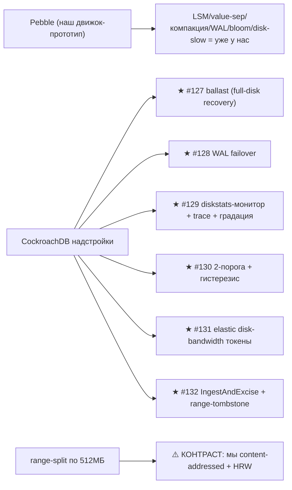

---

## 10. Извлечённые идеи для OpenZFS Daemon

### Конвергенция (CockroachDB на Pebble — повторная валидация)
- Pebble LSM/value-sep/компакция/WAL/bloom/disk-slow = уже у нас; MVCC = reader-watermark; AddSSTable
  bulk = #123; snapshot-streaming = resilver+multi-source; capacity-by-free = HRW-by-free; diversity =
  failure-domains. **Контраст**: range-split по ключу — мы content-addressed (HRW, фикс-блоки).

### Главные новые заимствования
- **#127 ★** Ballast: graceful full-disk recovery (резерв; full = avail < ballast/2; grow-only-if-safe).
- **#128 ★** WAL failover на запасной диск — изоляция latency коммита от одного тормозящего носителя.
- **#129 ★** Per-disk /proc/diskstats монитор (100мс) + stall-trace + градация unavailable→fatal.
- **#130 ★** 2-уровневый порог заполнения с гистерезисом (0.95/0.925) + compare-cascade (disk-health
  важнее ровности) — анти-пинг-понг для disk-balancer/HRW.
- **#131 ★** Admission: elastic disk-bandwidth токены (`goal_util×bw − reads`), foreground не душить.
- **#132 ★** IngestAndExcise (atomic влить+вырезать) + range-tombstone с порогом point/range-delete.

---

## 11. Источники в коде (для перепроверки)

- `storage/ballast.go:25-170` ballast (IsDiskFull, BallastSizeBytes, maybeEstablishBallast)
- `storage/disk/monitor.go:22,158-195`, `disk/linux_parse.go:49-105`, `disk/stats.go:16-78` диск-монитор
- `storage/pebble.go:1462-1499` DiskSlow→stall; `:1985-2078` Capacity; `:2390-2401` IngestAndExciseFiles
- `storage/fs/fs.go` MaxSyncDuration / MaxSyncDurationFatalOnExceeded
- `storage/storageconfig/wal_failover.go:15-66` WAL failover режимы
- `storage/sst_writer.go:51-187` SSTWriter (ingestion opts, Finish)
- `kvserver/batcheval/cmd_add_sstable.go:455-465` AddSSTable; `cmd_excise.go:24-68`, `cmd_clear_range.go:83-160`
- `kvserver/kv_snapshot_strategy.go:31-51,572-596`, `store_snapshot.go:861-871`, `snapshot_apply_prepare.go:201-211`
- `kvserver/snapshot_settings.go:29-37` kv.snapshot_rebalance.max_rate
- `kvserver/allocator/allocatorimpl/allocator_scorer.go:50-59,252-282,774-784,893-950,2368-2390` пороги/diversity/compare
- `kvserver/allocator/storepool/store_pool.go:607-629` capacity-dimensions
- `kvserver/store_rebalancer.go:114-128` load-based rebalance
- `util/admission/disk_bandwidth.go:113-200`, `io_load_listener.go:86-243` admission disk-bandwidth
- `kvserver/split_queue.go:145-188` range-split по размеру (контраст)
- `storage/encryption.go:1-98` encryption-at-rest (AES-GCM/PBKDF2)

---

*Связано: [pebble (движок-прототип)](pebble-storage-hdd-ssd.md), [STORAGE-IDEAS-SYNTHESIS.md](STORAGE-IDEAS-SYNTHESIS.md), [dgraph (bulk #123)](dgraph-storage-hdd-ssd.md), [ydb (failure-domains)](ydb-storage-hdd-ssd.md), [scylladb (iotune)](scylladb-storage-hdd-ssd.md).*
