# Dgraph / Badger Storage — как Dgraph работает с HDD/SSD (DDD-разбор исходников)

> Исследование исходников **dgraph-io/dgraph** (`Vendor/dgraph`, свежий слой, commit `9c361ac` от
> 2026-06-09) и его storage-движка **dgraph-io/badger** v4 (`Vendor/badger`). Все факты — с ссылками
> `файл:строка`, проверены в коде; ключевые места — **с реальными снипетами** (см. §9-bis).

Dgraph — распределённый граф-store (Go). Графовые рёбра хранятся как **posting-lists** в **BadgerDB** —
встраиваемом LSM key-value движке по схеме **WiscKey** (value-log separation). Это **архитектурный
двойник нашего дизайна**:

> **Badger LSM-ключ → `valuePointer{Fid, Offset, Len}` → тело в `.vlog`-файле.**
> Это БУКВАЛЬНО наш стек: **индекс `CID → (seg, off, len)` на NVMe → тело в pack-сегменте на XFS-HDD.**
> Badger = самая прямая валидация ADR-0001 (тонкий FS + разделение «мелкий индекс / большие тела»).

Поэтому value-log separation = **повторная валидация ядра**; копаем там, где **по-настоящему ново**:

1. **★ Value-log GC по persistent discard-счётчику + `discardRatio`** (Badger): mmap-файл считает
   «сколько байт в каждом vlog-файле уже мёртвы» (инкремент при компакции), GC берёт файл с
   **максимумом мусора** и переписывает его **только если** мусора ≥ `discardRatio` (≈0.5 → пожизненный
   write-amp ≈ 2×). Дешёвый выбор жертвы + жёсткая граница write-amplification.
2. **★ StreamWriter / bulk-loader** (Dgraph): массовый импорт/восстановление **внешней сортировкой на
   диске → запись СРАЗУ в готовые SSTable**, минуя нормальный LSM-путь (без write-amp памяти/WAL).
3. **★ raftwal recovery-layout** (Dgraph): один файл = **фикс-размерные слоты записей** (32 байта) в
   pre-zeroed 1MB-регионе + переменные данные после; **зануление = детектор хвоста** при рестарте;
   mmap переживает крах процесса, `msync` только для hard-reboot.
4. **MoveTs read-fence** (Dgraph): при переезде шарда (predicate move) ставится `MoveTs`; чтение с
   `ts < MoveTs` **отклоняется** → корректность во время ребаланса (epoch-fencing).
5. **⚠️ group-varint delta-pack** (Dgraph codec): упаковка **отсортированных** uint64 (uids) дельтами по
   4 за раз. Для нас **ограниченно** — CID случайны; годится только для offset-таблиц/манифестов.

> Контекст-конвергенция (НЕ новые строки): WiscKey value-log = наши pack-сегменты; `valuePointer` =
> наш индекс-ключ; value-threshold (мелочь инлайн в LSM) = inline-порог (#80, #44); posting-rollup =
> компакция; incremental-backup-chain = #107/#117; predicate-sharding = наш HRW; mmap+msync = #57/#72;
> per-block CRC32C + bloom + compression в SSTable = #50/#48/#... — всё уже валидировано.

---

## 1. Bounded Contexts

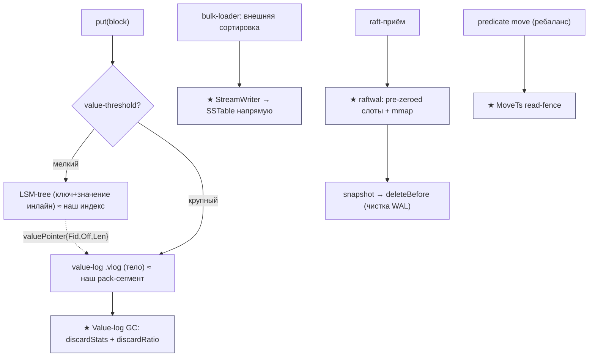

| Контекст | Ответственность | Файлы |
|---|---|---|
| **Value-log separation** | мелочь инлайн в LSM, тела в `.vlog`; `valuePointer` | `badger/value.go`, `badger/structs.go` |
| **★ Value-log GC** | discard-счётчик (mmap), выбор max-мусор, rewrite по ratio | `badger/value.go`, `badger/discard.go` |
| **SSTable/table** | блоки + offset-array + CRC32C + bloom + compress | `badger/table/builder.go`, `table/table.go` |
| **Memtable/WAL** | skiplist + mmap-WAL, flush в L0 | `badger/memtable.go`, `badger/db.go` |
| **★ raftwal** | фикс-слоты + pre-zero + mmap + rotation | `dgraph/raftwal/log.go`, `wal.go`, `storage.go` |
| **Posting-list / codec** | rollup деталей, split, group-varint pack | `dgraph/posting/list.go`, `codec/codec.go` |
| **★ Bulk-loader/StreamWriter** | внешняя сортировка → SSTable напрямую | `dgraph/dgraph/cmd/bulk/reduce.go` |
| **Predicate-sharding / move** | predicate→group, MoveTs-fence, стрим переезда | `dgraph/worker/groups.go`, `predicate_move.go` |
| **Backup** | full/incremental-цепочка, manifest, since-ts | `dgraph/worker/backup.go`, `backup_manifest.go` |

---

## 2. Архитектурные диаграммы (Mermaid)

### Dg1. WiscKey value-log separation = наш стек (★ валидация)

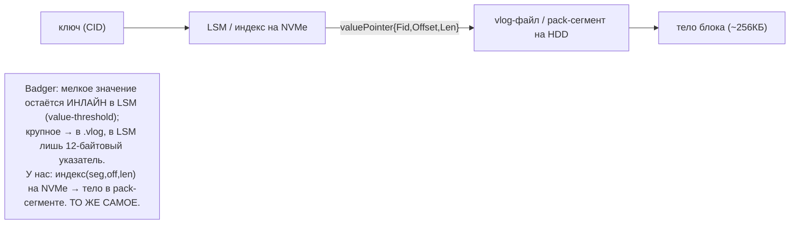

### Dg2. Value-log GC: discard-счётчик + discardRatio (★)

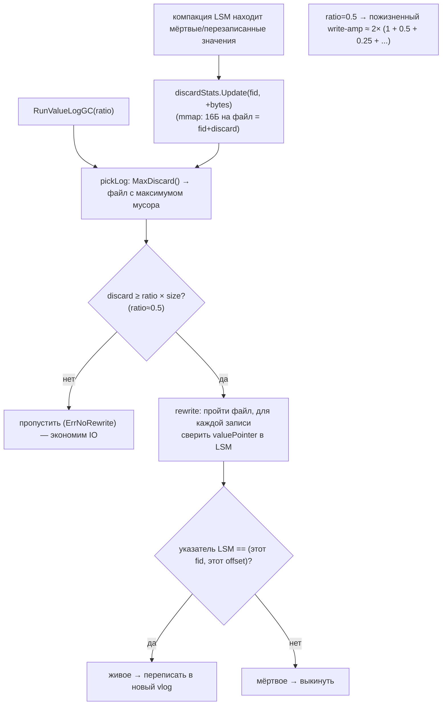

### Dg3. raftwal recovery-layout: pre-zeroed слоты + mmap (★)

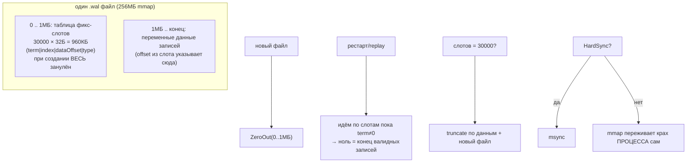

### Dg4. Bulk-loader: внешняя сортировка → StreamWriter → SSTable (★)

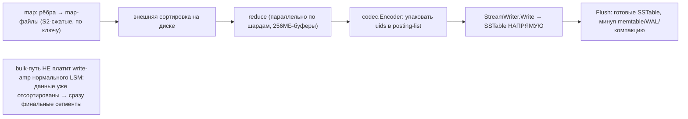

### Dg5. MoveTs read-fence при переезде шарда

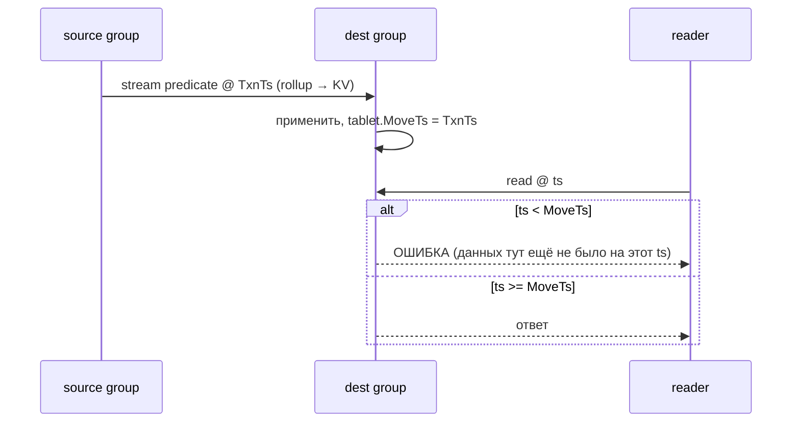

### Dg6. Posting-list rollup + split (компакция + дробление)

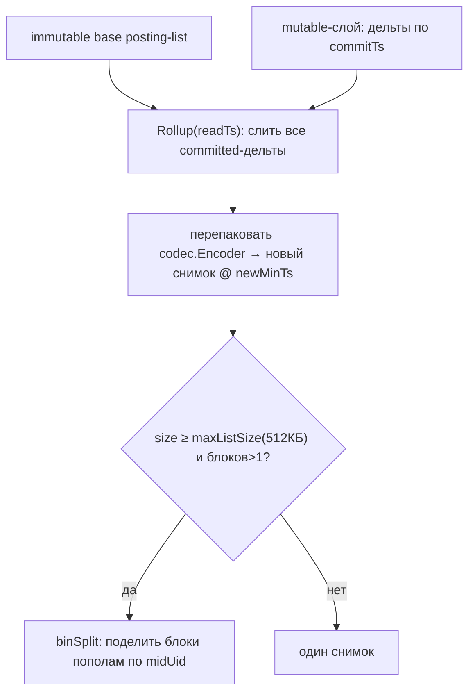

---

## 2-bis. Файловая система: раскладка и потоки (Mermaid)

### FS1. Раскладка на диске (Badger)

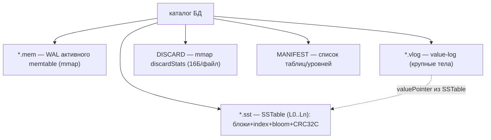

### FS2. Запись: WAL → memtable → flush L0 → vlog

```mermaid
sequenceDiagram
    participant W as write
    participant WAL as memtable WAL (.mem mmap)
    participant SL as skiplist
    participant VL as .vlog
    W->>VL: крупное значение → vlog, получить valuePointer
    W->>WAL: writeEntry (ключ + значение|указатель)
    W->>SL: skiplist.Put
    Note over WAL,SL: WAL и skiplist в lockstep; крах → replay WAL
    SL->>SL: memtable полон → flushChan
    SL->>SST: buildL0Table → CreateTable (mmap + msync)
```

### FS3. Value-log GC (реклейм места)

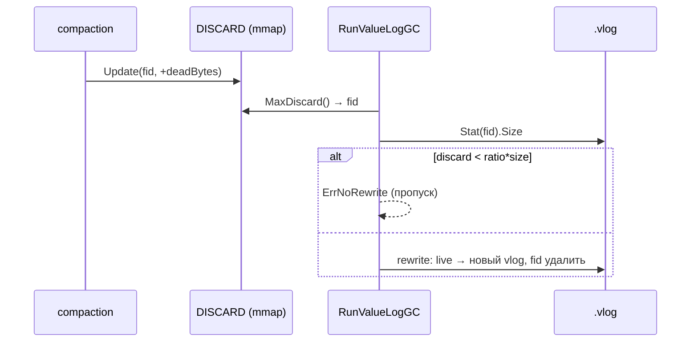

### FS4. raftwal: слоты + данные + ротация

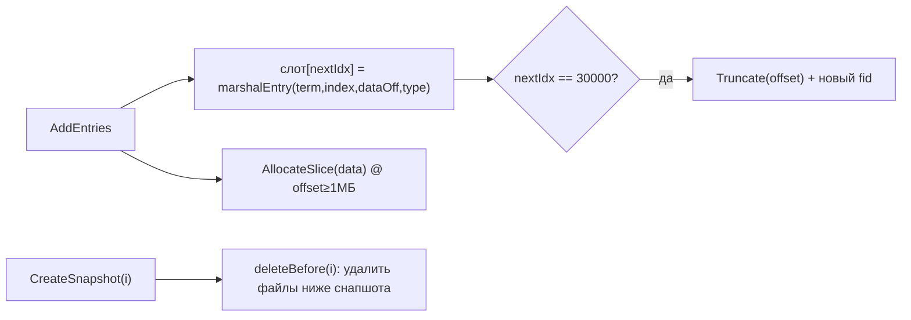

### FS5. Value-log separation: путь записи на ФС (мелкое vs крупное)

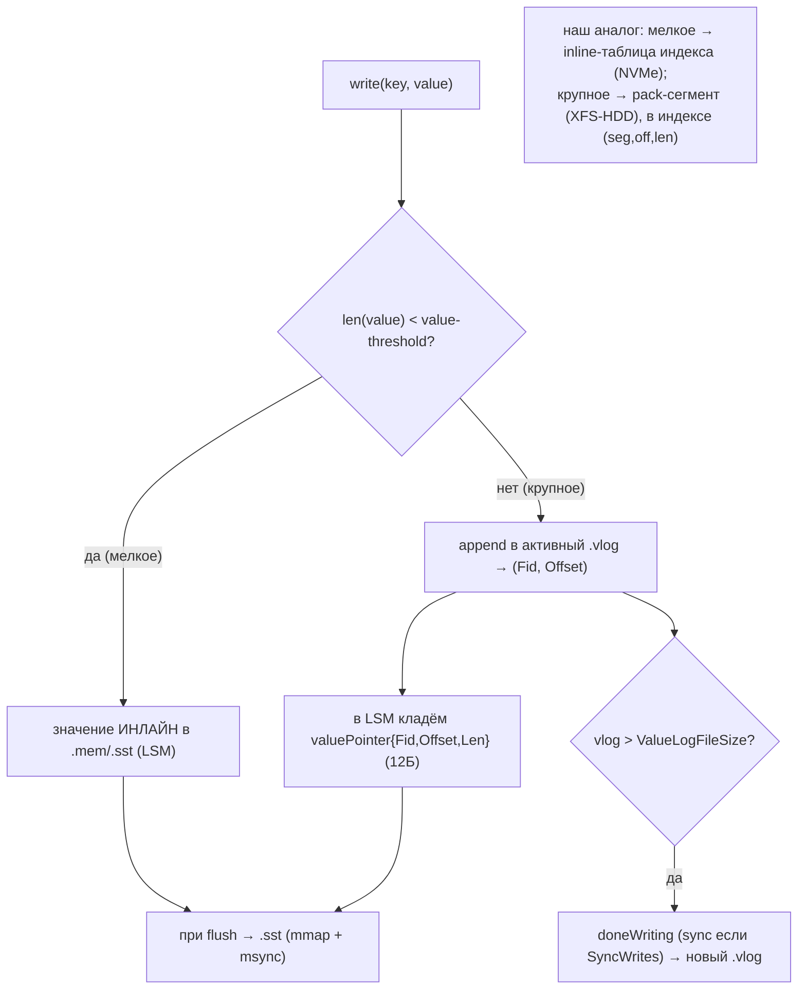

### FS6. Bulk-loader: файловые потоки (внешняя сортировка → SSTable)

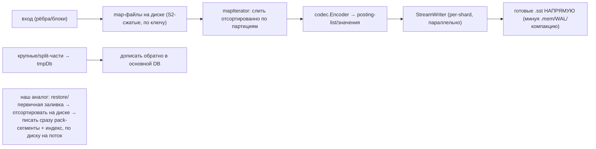

### FS7. raftwal: жизненный цикл файлов (создание → ротация → снапшот → чистка)

```mermaid
stateDiagram-v2
    [*] --> New: openLogFile (mmap 256МБ)
    New --> Zeroed: ZeroOut(0..1МБ) — таблица слотов
    Zeroed --> Active: AddEntries (слот + данные ≥1МБ)
    Active --> Active: nextIdx < 30000
    Active --> Rotated: nextIdx == 30000 → Truncate + новый fid
    Rotated --> Active
    Active --> Snapshotted: CreateSnapshot(i) → meta.StoreSnapshot
    Snapshotted --> Deleted: deleteBefore(i) — файлы ниже снапшота unlink
    Deleted --> [*]
    note right of Active: msync только при HardSync;\nиначе mmap переживает крах процесса
```

---

## 3. Ubiquitous Language (термины Dgraph/Badger → наши)

| Термин | Значение | Наш аналог |
|---|---|---|
| **value-log (.vlog)** | файл с крупными телами (WiscKey) | pack-сегмент на XFS-HDD |
| **valuePointer{Fid,Offset,Len}** | указатель из LSM на тело | индекс-запись `CID→(seg,off,len)` |
| **value-threshold** | граница инлайн/в-vlog | inline-порог (#80, #44) |
| **discardStats / discardRatio** | мёртвые байты на файл / порог GC | счётчик мусора сегмента + порог реклейма |
| **SSTable / block** | сортированная таблица + блоки | сегмент + блоки (CRC32C, bloom) |
| **memtable + WAL (.mem)** | буфер записи + журнал | write-буфер + WAL |
| **posting-list / rollup** | список uid + слияние дельт | (компакция) |
| **StreamWriter** | прямая запись SSTable минуя hot-path | bulk-build сегментов+индекса |
| **predicate / tablet / group** | единица шардинга | шард / placement-группа |
| **MoveTs** | момент переезда tablet | epoch-fence при ребалансе |
| **snapshot → deleteBefore** | усечение WAL по снапшоту | recovery-point + чистка WAL |

---

## 4. Что берём (★) и почему — кратко

| # | Идея | Откуда | Зачем нам |
|---|---|---|---|
| **122** | Value-log GC: persistent discard-счётчик (mmap) + `discardRatio` | Badger `value.go`/`discard.go` | дешёвый выбор «самого мусорного» сегмента + жёсткая граница write-amp (≈2×) |
| **123** | StreamWriter/bulk-loader: внешняя сортировка → сегменты+индекс напрямую | Dgraph `cmd/bulk` | массовый импорт/restore/offline-rebuild без write-amp нормального пути |
| **124** | raftwal recovery-layout: pre-zeroed фикс-слоты + mmap + zero=tail | Dgraph `raftwal` | O(1)-replay, детект хвоста занулением, mmap переживает крах процесса |
| **125** | MoveTs read-fence при миграции шарда | Dgraph `predicate_move` | корректность чтений во время ребаланса (epoch-fencing) |
| **126** ⚠️ | group-varint delta-pack отсортированных uint64 | Dgraph `codec` | **огранич.**: CID случайны → только offset-таблицы/манифесты |

---

## 5. Конвергенция (Badger ≈ наш дизайн — повторная валидация, НЕ новые строки)

- **WiscKey value-log separation** = наши **pack-сегменты + индекс**. `valuePointer{Fid,Offset,Len}` ≡
  наша запись `CID→(seg,off,len)`. Badger — самый прямой прототип ADR-0001.
- **value-threshold** (мелочь инлайн в LSM, крупное в vlog) = наш **inline-порог** (#80 iroh, #44 YDB).
- **SSTable**: блок = entries + offset-array + **CRC32C** + bloom + compression (snappy/zstd) — ровно
  наши сегментные блоки (#50 summary, bloom, per-block checksum).
- **mmap + msync-только-при-SyncWrites** = #57 (Redis DONTNEED-семейство) / #72 (Dragonfly O_DIRECT) —
  «mmap переживает крах процесса, fsync лишь для hard-reboot».
- **posting-rollup + split-list** = LSM-компакция + дробление крупного объекта; у нас блоки фикс-размера.
- **incremental backup chain** (manifest + since-ts + монотонный read-ts) = #107 (Flink) / #117 (ClickHouse).
- **predicate-sharding** = наш HRW (только мы без центрального Zero-каталога).
- **snapshot → deleteBefore** (усечение WAL) = recovery-point Kafka (#111) / NATS index.db.

---

## 9-bis. Снипеты кода (реальные выдержки + объяснение)

### DG1. Value-threshold: мелочь инлайн, крупное → vlog (#122 контекст)

`badger/value.go:864-883` — для каждой записи решаем, идёт ли тело в value-log:

```go
if e.skipVlogAndSetThreshold(vlog.db.valueThreshold()) {
    b.Ptrs = append(b.Ptrs, valuePointer{})   // мелочь: остаётся инлайн в LSM
    continue
}
var p valuePointer
p.Fid = curlf.fid
p.Offset = vlog.woffset()
plen, err := curlf.encodeEntry(buf, e, p.Offset) // header+key+value+CRC32 в .vlog
p.Len = uint32(plen)
b.Ptrs = append(b.Ptrs, p)                    // в LSM кладём лишь указатель (12Б)
```

**Наш аналог:** ровно `CID→(seg,off,len)`. `valuePointer` = `struct valuePointer { Fid uint32; Len
uint32; Offset uint32 }` (`structs.go:15`) — 12 байт, как наша индекс-запись.

### DG2. discardStats: persistent счётчик мусора на vlog-файл (#122)

`badger/discard.go` — mmap-файл, 16 байт на запись (`8Б fid + 8Б discard`), обновляется при компакции:

```go
// discardStats keeps track of the amount of data that could be discarded for a given logfile.
type discardStats struct {
    sync.Mutex
    *z.MmapFile
    opt           Options
    nextEmptySlot int
}
func (lf *discardStats) Update(fidu uint32, discard int64) int64 { /* set(off, cur+discard) */ }
func (lf *discardStats) MaxDiscard() (uint32, int64) { /* файл с макс. мусором */ }
```

**Зачем:** выбор жертвы GC — O(1) (просто max по mmap-таблице), не надо сканировать файлы. У нас —
тот же счётчик «мёртвых байт» на pack-сегмент, инкремент при удалении/перезаписи.

### DG3. pickLog + discardRatio: граница write-amplification (#122)

`badger/value.go:1027-1035` и `db.go:1219-1224`:

```go
if thr := discardRatio * float64(fi.Size()); float64(discard) < thr {
    vlog.opt.Debugf("Discard: %d less than threshold: %.0f for file: %s", discard, thr, fi.Name())
    return nil   // мусора мало → НЕ переписываем (экономим IO)
}
// We recommend setting discardRatio to 0.5 ... lifetime value log write
// amplification of 2 (1 from original write + 0.5 rewrite + 0.25 + 0.125 + ... = 2).
```

**Зачем нам:** не гонять GC по чуть-мусорным сегментам. Порог 0.5 даёт пожизненный write-amp ≈ 2× —
прямой параметр для нашего сегмент-GC (наряду с Pebble liveness-bitmap и Hive splice-merge).

### DG4. Rewrite: «живое» = указатель LSM совпал с (fid, offset) (#122)

`badger/value.go:205-216` — критерий, что значение в vlog ещё актуально:

```go
var vp valuePointer
vp.Decode(vs.Value)
if vp.Fid > f.fid { return nil }          // LSM указывает на более новый файл → мёртвое
if vp.Offset > e.offset { return nil }    // более новый offset → мёртвое
if vp.Fid == f.fid && vp.Offset == e.offset {
    moved++                                // совпало → ЖИВОЕ, переписать в новый vlog
    ...
}
```

**Наш аналог:** при компакции сегмента блок «живой» ⟺ индекс CID всё ещё указывает на этот
`(seg, off)`; иначе — мусор. Точное правило для two-phase delete / reader-watermark (#84, #106).

### DG5. raftwal: фикс-слот 32Б + зануление 1МБ-региона (#124)

`dgraph/raftwal/log.go:60-72` (слот) и `log.go:114-118` (создание+зануление):

```go
func marshalEntry(b []byte, term, index, do, typ uint64) {
    x.AssertTrue(len(b) == entrySize)               // entrySize = 32
    binary.BigEndian.PutUint64(b, term)
    binary.BigEndian.PutUint64(b[8:], index)
    binary.BigEndian.PutUint64(b[16:], do)          // dataOffset → данные в регионе ≥1МБ
    binary.BigEndian.PutUint64(b[24:], typ)
}
// при создании файла:
lf.MmapFile, err = z.OpenMmapFile(fpath, os.O_RDWR|os.O_CREATE, logFileSize) // 256МБ
if err == z.NewFile {
    z.ZeroOut(lf.Data, 0, logFileOffset)            // занулить первый 1МБ (таблица слотов)
}
```

`getEntry` — чистая арифметика (O(1)): `entry(lf.Data[idx*32 : idx*32+32])` (`log.go:146`).
**Зачем нам:** компактный recovery — фикс-слоты для быстрой адресации, **зануление = маркер конца**
(встречаем term==0 → дальше валидных записей нет). Усиливает recovery-point Kafka/NATS.

### DG6. raftwal: mmap переживает крах процесса; msync только для hard-reboot (#124)

`dgraph/raftwal/storage.go:56-59` (док-коммент) + `storage.go:366-376`:

```go
// mmap fares well with process crashes without doing anything. In case
// HardSync is set, msync is called after every write, which flushes those writes to disk.
func (w *DiskStorage) Sync() error {
    if err := w.meta.Sync(); err != nil { return ... }       // msync meta (1 страница)
    if err := w.wal.current.Sync(); err != nil { return ... } // msync текущего файла
    return nil
}
```

**Конвергенция:** ровно как Badger `SyncWrites=false` по умолчанию и наш выбор (#57/#72) — полагаться
на mmap+репликацию, fsync делать выборочно (дорого на HDD).

### DG7. StreamWriter: bulk-build SSTable напрямую (#123)

`dgraph/dgraph/cmd/bulk/reduce.go:105-146` — параллельно по шардам, минуя hot-path:

```go
writer := db.NewStreamWriter()
x.Check(writer.Prepare())
... // reduce: отсортированные рёбра → codec.Encoder → posting-list
r.reduce(partitionKeys, mapItrs, ci, vi)
... 
x.Check(writer.Flush())   // готовые SSTable сразу, без memtable/WAL/компакции
```

Перед этим — внешняя сортировка map-файлов (`mapIterator`, S2-сжатие, `reduce.go:218-293`).
**Зачем нам:** путь массового импорта/restore/offline-rebuild — отсортировать вход на диске и
**писать сразу финальные pack-сегменты + индекс**, не платя write-amplification обычного пути.

### DG8. MoveTs read-fence при переезде шарда (#125)

`dgraph/worker/groups.go:421-429` — чтение отклоняется, если ts раньше переезда:

```go
func (g *groupi) BelongsToReadOnly(key string, ts uint64) (uint32, error) {
    g.RLock(); tablet := g.tablets[key]; g.RUnlock()
    if tablet != nil {
        if ts > 0 && ts < tablet.MoveTs {
            return 0, errors.Errorf("StartTs: %d is from before MoveTs: %d for pred: %q",
                ts, tablet.MoveTs, key)
        }
        return tablet.GetGroupId(), nil
    }
    ...
}
```

При самом переезде данные стримятся с rollup и версионируются `TxnTs` (`predicate_move.go:300-312`).
**Зачем нам:** во время ребаланса/resilver чтение по устаревшему epoch отвергается → нет «дыр» и
рассинхронизации (epoch-fencing, родственно #94 InfluxDB).

### DG9. ⚠️ group-varint delta-pack отсортированных uid (#126, ограниченно)

`dgraph/codec/codec.go:80-90` — упаковка дельт по 4 за раз:

```go
for i := range 4 {
    tmpUids[i] = uint32(e.uids[i] - last)  // дельта между соседними uid
    last = e.uids[i]
}
data := groupvarint.Encode4(buf, tmpUids)   // 4 дельты → group-varint
```

**⚠️ Ограничение для нас:** CID — случайные хэши, дельты не сжимаются. Применимо **только** к
**отсортированным** uint64: offset-таблицы внутри сегмента, списки CID в манифесте. Как #98
(Tarantool slice) / #115 (NATS psim) — берём с оговоркой.

### DG10 (диаграмма). Где Badger валидирует наш дизайн

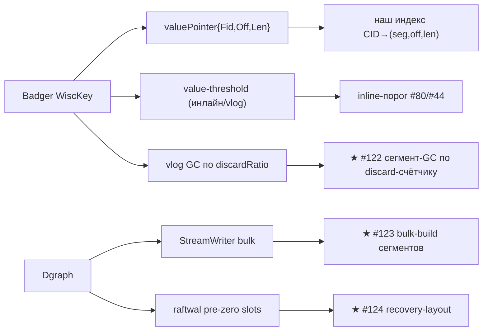

---

## 10. Извлечённые идеи для OpenZFS Daemon

### Конвергенция (Badger ≈ наш дизайн — самая прямая валидация ADR-0001)
- WiscKey value-log = pack-сегменты; `valuePointer` = индекс `(seg,off,len)`; value-threshold =
  inline-порог; SSTable-блок (CRC32C+bloom+compress) = наш блок; mmap+выборочный msync = #57/#72;
  rollup = компакция; incremental-backup-chain = #107/#117; predicate-sharding = HRW.

### Главные новые заимствования
- **#122 ★** value-log GC: persistent discard-счётчик (mmap, O(1)-выбор жертвы) + `discardRatio` как
  жёсткая граница write-amplification (≈2× при 0.5).
- **#123 ★** StreamWriter/bulk-loader: внешняя сортировка → запись СРАЗУ в финальные сегменты+индекс
  (массовый импорт / restore / offline-rebuild без write-amp нормального пути).
- **#124 ★** raftwal recovery-layout: фикс-размерные pre-zeroed слоты + переменные данные в одном
  файле; зануление = детектор хвоста; mmap переживает крах процесса.
- **#125** MoveTs read-fence: epoch-стамп на миграции шарда, отклонять чтения с `ts < MoveTs`.
- **#126 ⚠️** group-varint delta-pack — только для отсортированных uint64 (offset-таблицы/манифесты).

---

## 11. Источники в коде (для перепроверки)

**Badger (`Vendor/badger`):**
- `value.go:864-883` value-threshold/vlog-write; `structs.go:15-51` valuePointer
- `discard.go:19-157` discardStats; `value.go:1003-1044` pickLog; `value.go:162-230` rewrite
- `db.go:1207-1247` RunValueLogGC; `value.go:725-751` vlog.sync; `options.go:370-382` SyncWrites
- `table/builder.go:250-292,377-388` блок/таблица; `table/table.go:87-109` mmap-таблица
- `memtable.go:31-41,170-199` memtable+WAL; `db.go:1067-1133` flush в L0

**Dgraph (`Vendor/dgraph`):**
- `raftwal/log.go:60-72,114-153` слоты/mmap/зануление; `raftwal/wal.go:208-221,345-409` запись/ротация/deleteBefore; `raftwal/storage.go:21-60,273-303,366-376` layout/snapshot/sync
- `codec/codec.go:35-102,154-200` group-varint pack/unpack
- `posting/list.go:1416-1457,1655-1699,2291-2358` rollup/split; `posting/mvcc.go:92-134` rollUpKey
- `cmd/bulk/reduce.go:81-146,218-293,643-736` bulk/StreamWriter; `count_index.go:102-178` encode-pipeline
- `worker/groups.go:31-51,397-449` tablets/BelongsTo(MoveTs); `worker/predicate_move.go:120-365` move/stream
- `worker/backup.go:286-310,515-623`, `backup_manifest.go:44-111` incremental-backup-chain; `worker/draft.go:1728-1877` calculateSnapshot

---

*Связано: [pack-segments (Feynman)](../../Feynman/pack-segments.md), [STORAGE-IDEAS-SYNTHESIS.md](STORAGE-IDEAS-SYNTHESIS.md), [iroh-blobs](iroh-storage-hdd-ssd.md) (inline-split #80), [pebble](pebble-storage-hdd-ssd.md) (GC liveness-bitmap), [kafka](kafka-storage-hdd-ssd.md) (recovery-point).*
