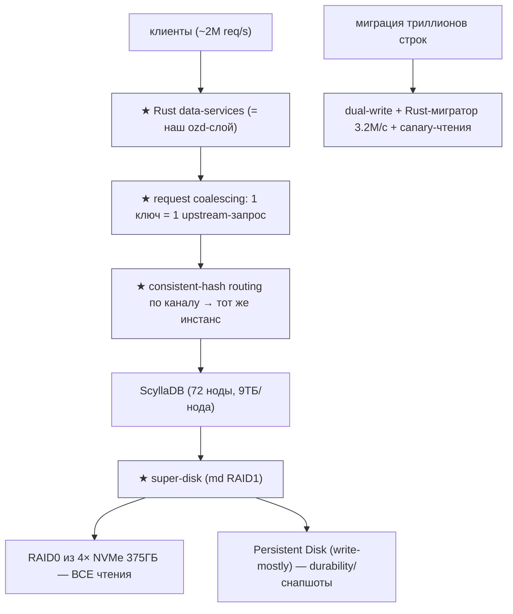
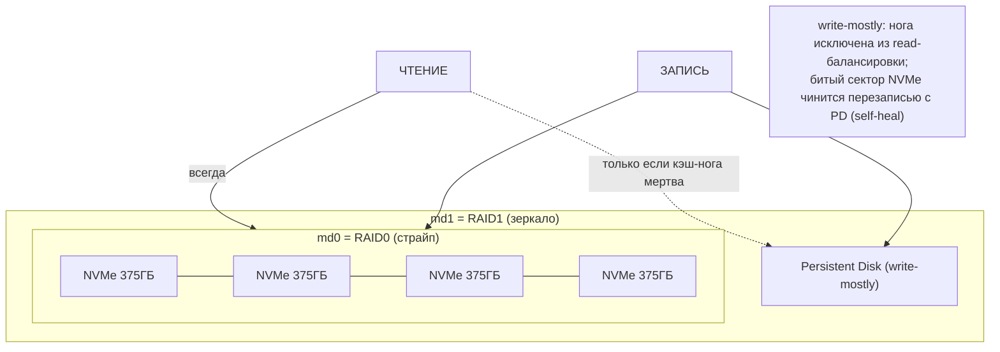
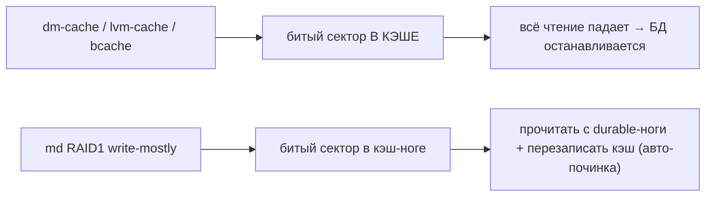
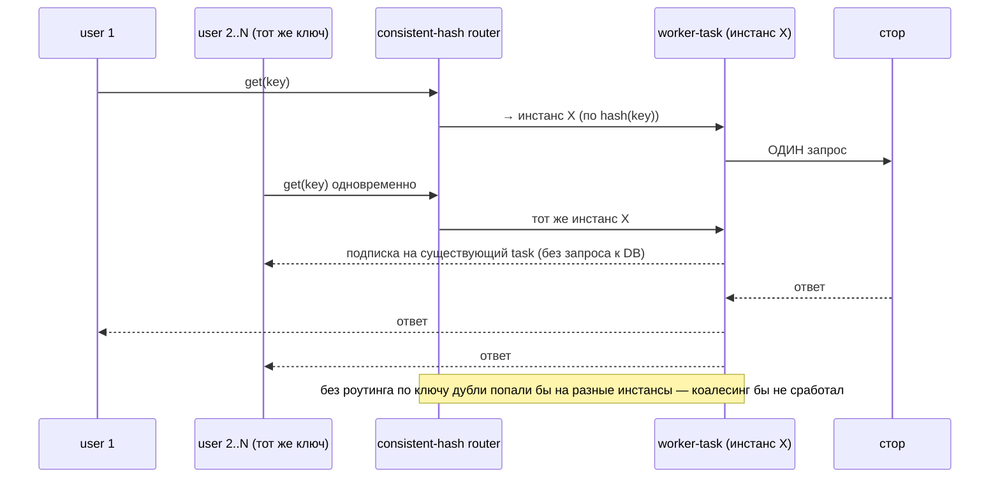
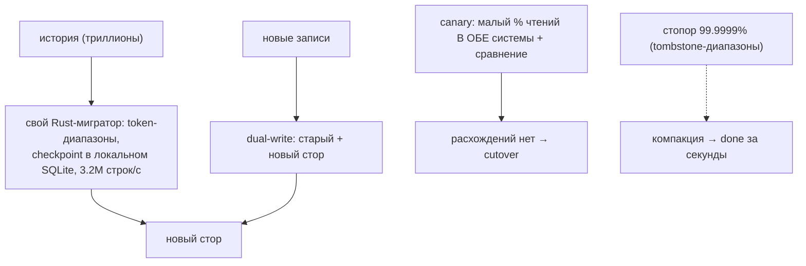
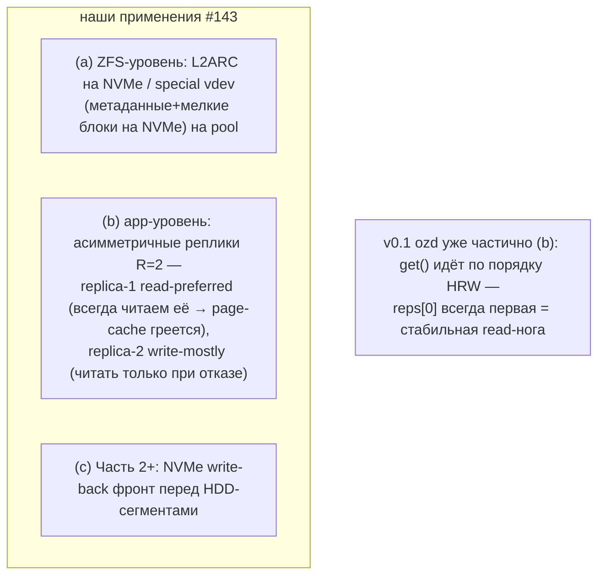
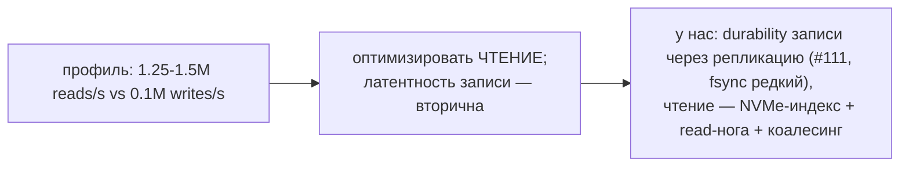

# Discord Storage — super-disks и trillions-of-messages (DDD-разбор инженерных статей)

> Источник — НЕ исходный код, а engineering-блог Discord (проверено по тексту статей 2026-06-10):
> 1. [How Discord Supercharges Network Disks for Extreme Low Latency](https://discord.com/blog/how-discord-supercharges-network-disks-for-extreme-low-latency) (+ video deep-dive)
> 2. [How Discord Stores Trillions of Messages](https://discord.com/blog/how-discord-stores-trillions-of-messages)
>
> Контекст Discord: ~2 млн DB-запросов/с, ScyllaDB на GCP; диски: **Persistent Disk** (сетевой,
> durable, снапшоты, ~1–2мс) vs **Local NVMe SSD** (~0.5мс, но данные теряются с хостом, фикс. 375ГБ).
> Это **ровно наша дихотомия**: медленный durable носитель (60 HDD) ↔ быстрый кэш-слой (NVMe).

Профиль нагрузки Discord: **1.25–1.5М чтений/с vs ~0.1М записей/с (12.5:1)** → оптимизировать чтение,
латентность записи вторична. У IPFS-blockstore профиль обычно тоже read-heavy. Берём:

1. **★ Super-disk: асимметричное зеркало `write-mostly`** — RAID1 из (быстрая нога = RAID0 по NVMe) +
   (durable нога = сетевой/медленный диск **с флагом write-mostly**): медленная нога **исключена из
   read-балансировки** — читается «только когда нет другого выбора»; запись — в обе. **Все чтения по
   цене NVMe, durability по цене PD.** Плюс урок отказа: dm-cache/lvm-cache/bcache **отвергнуты** —
   битый сектор кэша валил всё чтение; в md RAID1 битый сектор кэш-ноги **чинится перезаписью с
   durable-ноги** (self-heal зеркала).
2. **★ Request coalescing + consistent-hash routing** — Rust data-services слой: одновременные запросы
   одного ключа **сливаются в один** запрос к БД (первый спавнит worker-task, остальные подписываются);
   **ключевое дополнение** — запросы одного канала роутятся consistent-hash'ем **на один и тот же
   инстанс** — иначе дубли размазаны по инстансам и коалесинг не срабатывает.
3. **★ Миграция: dual-write + кастомный мигратор + canary-сравнение** — переезд триллионов сообщений
   Cassandra→ScyllaDB: dual-write нового, **свой Rust-мигратор** по token-диапазонам с **локальным
   checkpoint (SQLite)**, до **3.2М строк/с**, **9 дней вместо 3 месяцев** (Spark-оценка); валидация —
   **малый % чтений в обе системы со сравнением**; урок: стопор на 99.9999% из-за гигантских
   tombstone-диапазонов — вылечила компакция.

> Контекст-валидация (НЕ новые строки): сам **слой data-services на Rust между клиентом и стором —
> это архитектура нашего демона ozd** (Kubo → ozd → диски) — Discord подтверждает паттерн в проде;
> Cassandra→ScyllaDB (GC-паузы, hot-partitions, 177→72 нод, p99 40–125мс→15мс) = валидация нашего
> выбора разбирать Scylla/Cassandra; коалесинг = read-coalescing #73 + per-CID актор #83; «читать
> битую реплику → перечитать со здоровой + починить» = наш CRC+heal; iowait-метрика = disk-slow/#129.

---

## 1. Bounded Contexts

| Контекст | Ответственность | Наш аналог |
|---|---|---|
| **★ Super-disk** | асимметричное зеркало: чтения с NVMe, запись в обе | NVMe-кэш/тиринг + асимметричные реплики |
| **★ Coalescing+routing** | дубль-запросы → один; роутинг по ключу | #73 + #83 + роутинг (ново) |
| **★ Migration** | dual-write, мигратор, canary | переезд mirror→erasure (Часть 2) |
| Data-services (Rust) | слой между API и стором | **= ozd целиком** (валидация) |
| ScyllaDB | LSM-стор | разобрано (#49–54) |

---

## 2. Архитектурные диаграммы (Mermaid)

### Dc1. Super-disk: асимметричное зеркало write-mostly (★)

### Dc2. Почему НЕ dm-cache/bcache (урок отказа)

### Dc3. Request coalescing + routing (★)

### Dc4. Миграция: dual-write + мигратор + canary (★)

### FS1. Проекция super-disk на наш стек (60 HDD + NVMe, ZFS)

### FS2. Read:write 12.5:1 → приоритет дизайна

---

## 3. Ubiquitous Language (термины Discord → наши)

| Термин | Значение | Наш аналог |
|---|---|---|
| **super-disk** | md RAID1: NVMe-страйп + PD write-mostly | **★ #143** асимметричное зеркало/реплики |
| **write-mostly** | нога вне read-балансировки | write-mostly реплика №2 |
| **Local SSD vs PD** | быстрый эфемерный vs медленный durable | NVMe vs HDD (та же дихотомия) |
| **data services (Rust)** | слой между API и БД | **= ozd** (валидация архитектуры) |
| **request coalescing** | дубли ключа → один запрос | #73/#83 + **★ #144** routing |
| **consistent-hash routing** | ключ → тот же инстанс | HRW по CID (у нас уже есть основа) |
| **dual-write + migrator + canary** | переезд стора без даунтайма | **★ #145** (Часть 2 mirror→erasure) |
| **hot partition** | горячий ключ валит ноду | hot-CID → коалесинг+актор |
| **iowait** | метрика занятости IO | disk-slow/#129 телеметрия |

---

## 4. Что берём (★) и почему — кратко

| # | Идея | Откуда | Зачем нам |
|---|---|---|---|
| **143** | Асимметричное зеркало: read-нога (NVMe/быстрая) + **write-mostly** durable-нога; self-heal битого сектора кэша с durable-ноги | super-disks | (a) ZFS L2ARC/special-vdev на наших пулax; (b) **read-preferred реплика** в Pool (стабильная read-нога → греется её page-cache); (c) NVMe-фронт (Ч2+); отказ от dm-cache/bcache — урок |
| **144** | Request coalescing **+ consistent-hash routing по ключу** (без роутинга коалесинг не срабатывает) | trillions | дополняет #73/#83: дубли одного CID должны попадать в **один воркер/инстанс**; критично для Части 3 (несколько gateway) |
| **145** | Миграция стора: **dual-write + свой быстрый мигратор (checkpoint, диапазоны) + canary-сравнение чтений** | trillions | план переезда mirror→erasure (Часть 2) и любых смен формата: 3.2М строк/с, 9 дней вместо 3 месяцев — мигратор писать самим, не брать generic |

---

## 5. Конвергенция (Discord ≈ наш дизайн — валидация)

- **Слой data-services на Rust между клиентом и стором** = архитектура ozd (Kubo → ozd → диски).
  Discord гоняет этот паттерн на ~2М req/s в проде — сильная валидация самой идеи демона-прослойки.
- **Cassandra→ScyllaDB** (GC-паузы, hot-partitions, compaction-backlog; 177 нод 4ТБ → 72 ноды 9ТБ;
  p99 чтений 40–125мс → 15мс, вставки 5–70мс → 5мс) = валидация нашего разбора Scylla/Cassandra (#49–54, #119–121).
- **Коалесинг** = read-coalescing #73 + per-CID entity-актор #83 (v0.1: актор ещё не реализован).
- **Битая кэш-нога → чтение с durable + перезапись** = наш CRC verify-on-read → реплика + heal.
- **Read-heavy профиль → durability записи репликацией, fsync редкий** = #111 (Kafka), наш дефолт.
- **iowait как первичная метрика латентности дисков** = /proc/diskstats монитор #129.

---

## 6. Применимость к ozd прямо сейчас

1. **#143(b) read-preferred реплика** — в `Pool::get` v0.1 уже читаем `reps[0]` первой (порядок HRW
   детерминирован) → **стабильная read-нога есть**; усилить: учесть загрузку/тип носителя при выборе
   read-ноги, реплика №2 — write-mostly (читать только при ошибке/таймауте, добавить speculative #121).
2. **#143(a) на ZFS-деплое**: на 60 пулов — `zpool add diskNN cache nvmeX` (L2ARC-партиция на NVMe)
   и/или `special` vdev под метаданные ZFS; наш redb-индекс и так на NVMe — это второй этаж кэша тел.
   ⚠️ Урок Discord: НЕ выбирать bcache/dm-cache-подобные решения (битый сектор кэша = отказ чтения);
   ZFS L2ARC безопасен по той же причине, что md write-mostly: промах/ошибка кэша → чтение с пула.
3. **#144 в ozd**: на одном демоне коалесинг делается per-CID актором (#83, Фаза 1 PLAN); consistent-
   hash-роутинг станет критичен при нескольких gateway (Часть 3) — записать в раздел Части 3.
4. **#145**: оформить как процедуру миграции в Часть 2 (mirror→erasure): dual-write формат-v2 +
   мигратор по сегментам с checkpoint + canary-чтения в оба формата.

---

## 6-bis. Open-source реализации super-disk (исследовано 2026-06-10)

**Готового продукта-реализации НЕТ** — Discord свой код не публиковал (обещанный follow-up про
edge-cases кодом не вышел). Но паттерн = штатный mdadm, кирпичики доступны:

- **Команда — одна строка**: `mdadm --create /dev/md1 --level=1 --raid-devices=2 /dev/md0
  --write-mostly /dev/sdX` (+ опц. `--write-behind=N` с write-intent bitmap — медленной ноге
  позволяется отставать).
- **Gist JPvRiel «Linux MD software raid inspection»** — инспекция/настройка write-mostly
  SSD+HDD RAID1 (ближайший публичный артефакт).
- **Ansible-роли mdadm** (mrlesmithjr/ansible-mdadm и форки) — параметризуемое управление
  массивами; write-mostly добавляется флагом.
- **AWS-аналог задокументирован многократно** (LinkedIn R.Natarajan, N2WS): EBS(write-mostly) +
  instance-store как read-нога — та же команда.
- **HN-тред с jhgg (Discord)** — критичные детали: (1) **md ждёт ОБЕ ноги на синхронной записи**
  → латентность записи = латентность медленной ноги (без write-behind); Discord это ок при 12.5:1
  read-heavy; (2) причина отказа от dm-cache — bad-sector кэша пробрасывался как ошибка блочного
  устройства в БД; (3) saurik ~10 лет гонял **bcache поверх RAID EBS** (альтернатива);
  (4) критика saurik: RAID1 требует **полной копии на локальной ноге** (NVMe = размер всей БД);
  (5) ZFS отпал только из-за требования XFS у Scylla — **у нас этого ограничения нет** → L2ARC.
- ScyllaDB официально паттерн в machine-image **не** вшил (стандарт: RAID0 локальных SSD + RF=3).

**Вывод для ozd:** наш app-уровневый #143b (read-нога/write-mostly реплики + hedged) для нашего
кейса выгоднее блочного md-варианта: не нужен NVMe размером с датасет, durability — репликацией,
write-latency не привязана к медленной ноге (W-кворум наш). Если делать блочный NVMe-фронт (#143c,
Ч2+) — кирпичики выше + помнить: `--write-behind`+bitmap обязателен, иначе запись = скорость HDD.

## 7. Источники (для перепроверки)

- https://discord.com/blog/how-discord-supercharges-network-disks-for-extreme-low-latency — super-disk:
  md RAID1 (RAID0 4×375ГБ NVMe + PD write-mostly), отказ от dm-cache/lvm-cache/bcache (bad-sector),
  iowait ~8e-3 → 2–4e-3, reads 1.25–1.5М/с vs writes ~0.1М/с; видео: youtube AYEa3AYFBSk.
- https://discord.com/blog/how-discord-stores-trillions-of-messages — Rust data-services, коалесинг +
  consistent-hash routing, мигратор 3.2М строк/с / 9 дней / SQLite-checkpoint / tombstone-стопор,
  177→72 нод, p99 40–125мс→15мс; видео: youtube O3PwuzCvAjI.

---

*Связано: [STORAGE-IDEAS-SYNTHESIS.md](STORAGE-IDEAS-SYNTHESIS.md), [scylladb](scylladb-storage-hdd-ssd.md), [cassandra](cassandra-storage-hdd-ssd.md) (#119–121), [dragonfly](dragonfly-storage-hdd-ssd.md) (read-coalescing #73), [iroh-blobs](iroh-storage-hdd-ssd.md) (per-CID актор #83), [rocksdb](rocksdb-storage-hdd-ssd.md) (NVMe L2-кэш), docs/KUBO-INTEGRATION.md (ZFS-тюнинг).*
