# Dragonfly Storage — как Dragonfly работает с HDD/SSD (DDD-разбор исходников)

> Исследование исходников **dragonflydb/dragonfly** (`Vendor/dragonfly`, свежий слой, commit
> `bafc305` от 2026-06-08). Все факты — с ссылками `файл:строка`, проверены в коде.

Dragonfly — multi-threaded shared-nothing in-memory стор (C++/helio-fibers, io_uring). Его
**tiered storage** (`src/server/tiering/`) — это **наша задача в чистом виде**: тела значений
оффлоадятся на SSD/диск, а ключ + указатель остаются в RAM. Это самый близкий прототип «индекс в
памяти / тела на диске». Новое и ценное для нас:

1. **★ Свой аллокатор места на диске** (`external_alloc`, mimalloc-стиль: сегменты 256МБ → страницы
   по size-class → битмап блоков) — зрелая альтернатива append-only/fixed-block.
2. **★ Small-bins упаковка** — много суб-страничных значений (<2КБ) пакуются в одну 4КБ-страницу;
   страница освобождается, когда живых записей 0; дефраг при заполнении <50%.
3. **★ O_DIRECT + io_uring registered buffers**, строго 4КБ-выровненный I/O тел; **read-coalescing**
   (несколько читателей одной страницы делят один диск-I/O).
4. **★ Cooling-слой** (hot → cool в RAM (LRU) → cold на диске) + промоция при доступе; **fork-less
   snapshot** через версионирование бакетов; **DFS-бэкап** (по файлу на шард, параллельно).

> Контекст: Dragonfly **fork-less** (многопоточный, snapshot версионированием бакетов, а не CoW-fork
> как Redis). Тела у него **мутабельны** (promotion обратно в RAM); наши блоки **иммутабельны** →
> берём механику диска (аллокатор, packing, O_DIRECT+io_uring, read-coalescing, backpressure-по-байтам,
> параллельный per-shard бэкап), но cooling/promotion упрощаем (тела не возвращаются в RAM).

---

## 1. Bounded Contexts

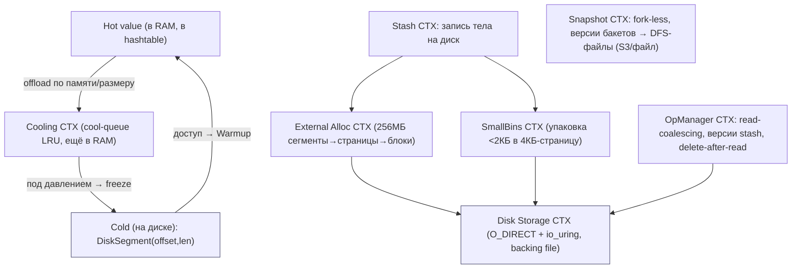

| Контекст | Ответственность | Файлы |
|---|---|---|
| **Tiered/Cooling** | hot↔cool↔cold, offload/warmup/reclaim | `tiered_storage.{cc,h}` |
| **Disk Storage** | backing file: O_DIRECT, io_uring, grow | `tiering/disk_storage.{cc,h}` |
| **External Alloc** | malloc-на-диске: сегменты/страницы/блоки | `tiering/external_alloc.{cc,h}` |
| **SmallBins** | упаковка суб-страничных значений в 4КБ | `tiering/small_bins.{cc,h}` |
| **OpManager** | read-coalescing, версии stash, delete | `tiering/op_manager.{cc,h}` |
| **Snapshot** | fork-less snapshot, версии бакетов, DFS | `snapshot.{cc,h}`, `detail/save_stages_controller.cc` |

---

## 2. Архитектурные диаграммы (Mermaid)

### D1. Три уровня значения: hot → cool → cold

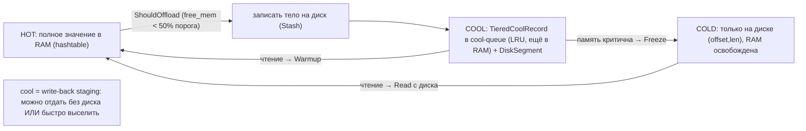

### D2. External Allocator: malloc для диска (mimalloc-стиль)

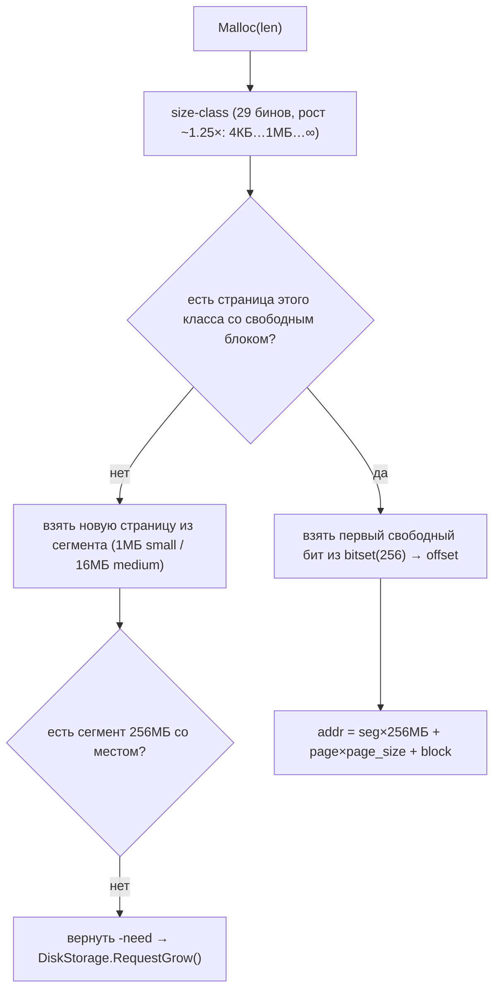

### D3. SmallBins: упаковка мелочи в 4КБ-страницу

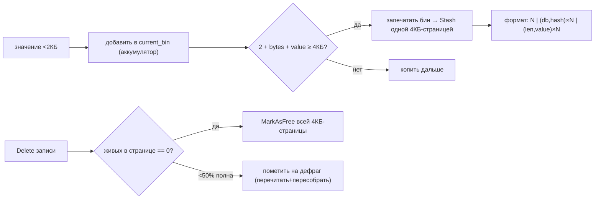

### D4. Disk I/O: O_DIRECT + io_uring + read-coalescing

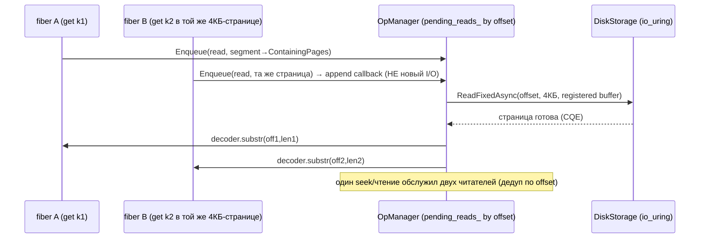

### D5. Fork-less snapshot: версионирование бакетов

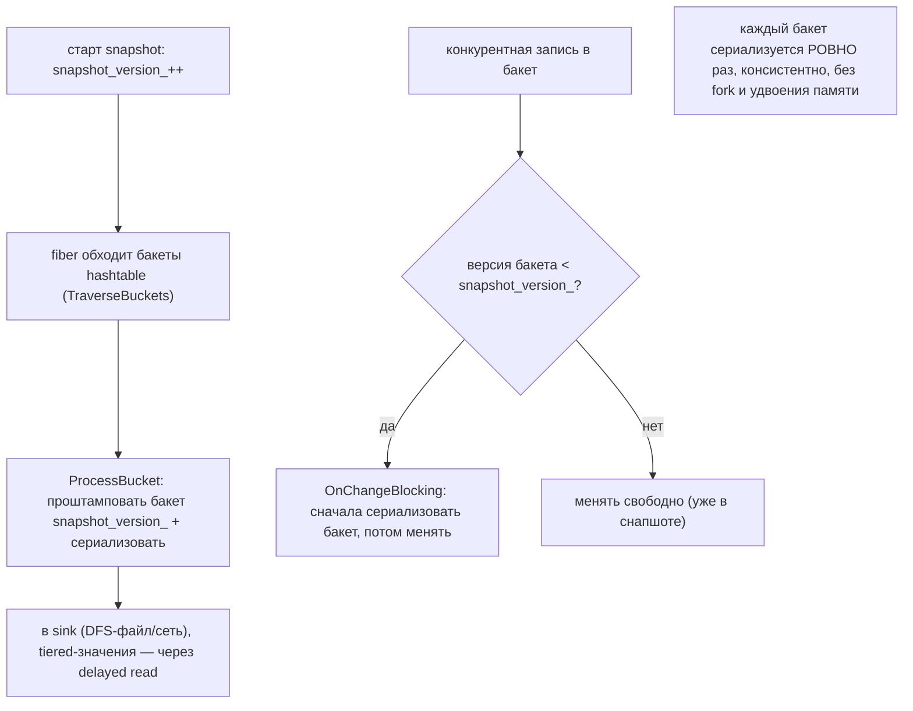

---

## 2-bis. Файловая система: раскладка и потоки (Mermaid)

> Особенность Dragonfly: **backing file** под tiered-тела (свой аллокатор + O_DIRECT) ОТДЕЛЬНО от
> **snapshot-файлов** (DFS: по файлу на шард + summary, локально или в облако).

### FS1. Реальная раскладка на диске

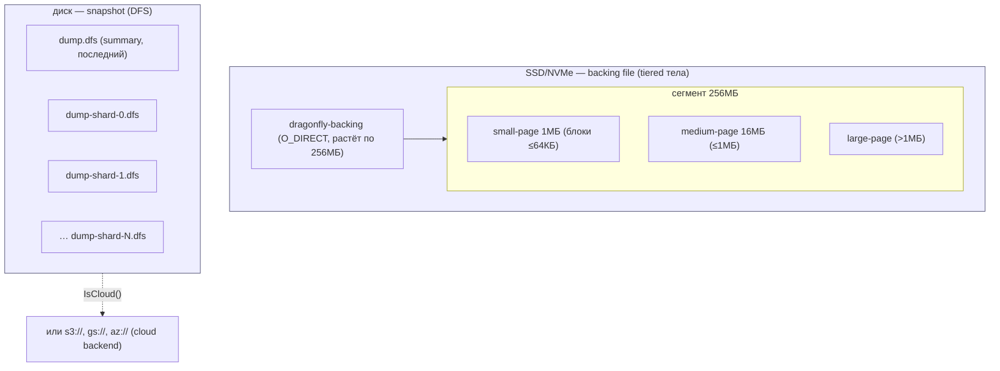

### FS2. Stash тела: аллокатор → буфер → io_uring write

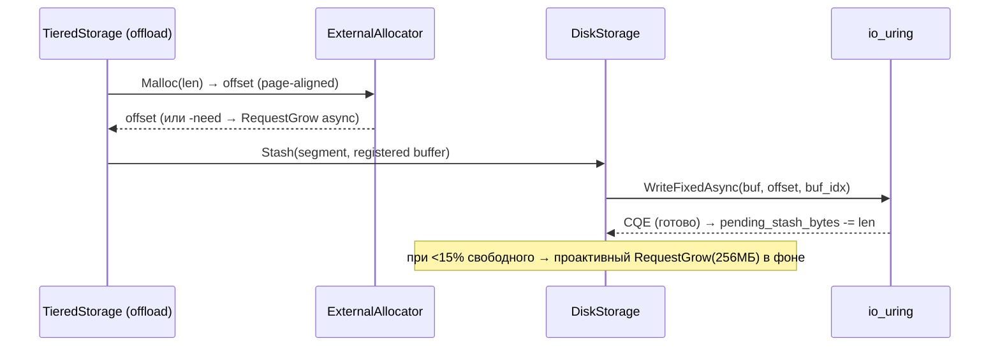

### FS3. Async-grow backing file + проактивное расширение

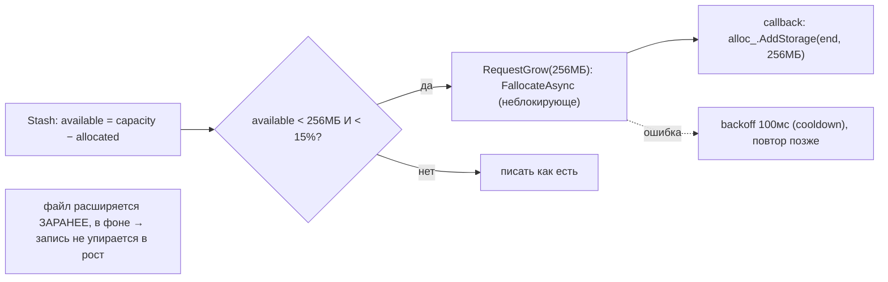

### FS4. DFS-снапшот: по файлу на шард, параллельно + summary

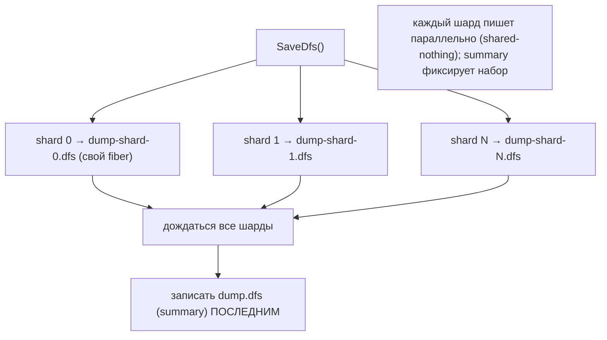

### FS5. Внутренняя раскладка backing-файла: segment → page → block

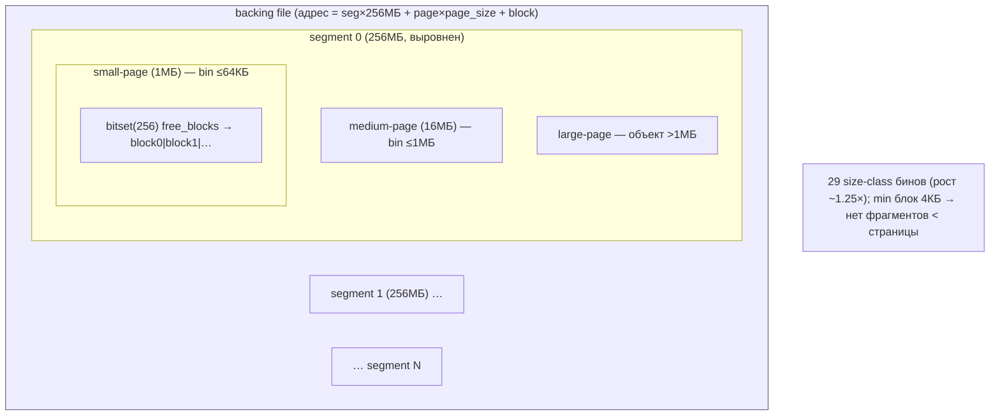

### FS6. Путь чтения тела: page-aligned read через io_uring (с coalescing)

```mermaid
sequenceDiagram
    participant G as get(k) → DiskSegment(offset,len)
    participant OM as OpManager
    participant DS as DiskStorage (O_DIRECT)
    participant U as io_uring (registered buf)
    G->>OM: Enqueue(read, segment.ContainingPages() → 4КБ-выровнено)
    OM->>OM: уже есть pending_read на этот offset? → подписать callback (без нового I/O)
    OM->>DS: ReadFixedAsync(offset, N×4КБ, buf_idx)
    DS->>U: SQE → fiber засыпает (не busy-wait)
    U-->>DS: CQE: страница(ы) в registered buffer
    DS-->>OM: decoder поверх буфера
    OM->>G: decoder.substr(offset−page_off, len) → тело
    note over OM,DS: читаем ВСЮ страницу (выравнивание O_DIRECT), отдаём под-срез; один I/O на N читателей
```

### FS7. Освобождение/дефраг 4КБ-страницы (SmallBins refcount)

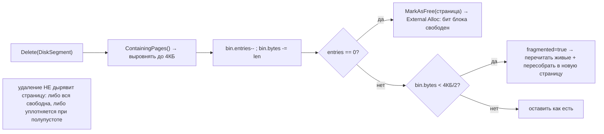

### FS8. Tiered-значения в снапшоте: delayed read с диска

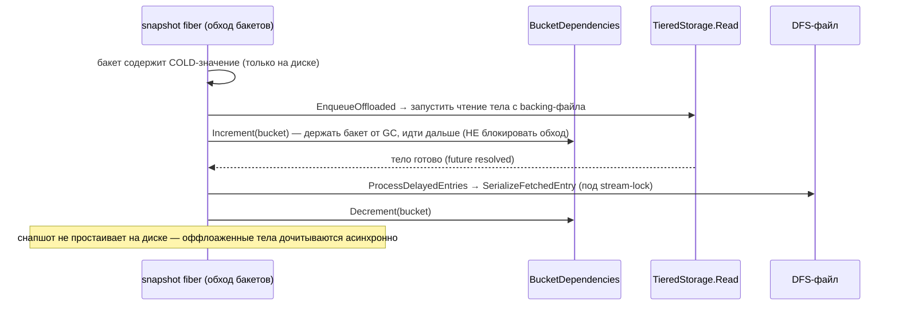

---

## 3. Ubiquitous Language (термины Dragonfly)

| Термин Dragonfly | Значение | Наш аналог |
|---|---|---|
| **tiered storage** | тела на диск, ключ+указатель в RAM | data-tier (HDD) + index-tier (NVMe) |
| **stash** | запись тела на диск | append тела в сегмент |
| **DiskSegment(offset,len)** | адрес тела на диске | `(segment_id, offset, len)` |
| **cool-queue** | RAM-LRU между hot и cold | write-back staging / NVMe L2 |
| **Warmup / Freeze** | вернуть в RAM / выселить на диск | promotion / sealing (у нас тел не возвращаем) |
| **external allocator** | malloc места на диске | альтернатива append-only/fixed-block |
| **small bins** | упаковка мелочи в 4КБ-страницу | micro-block packing / inline |
| **registered buffer** | pre-registered io_uring буфер | пул выровненных буферов под direct-I/O |
| **read coalescing** | дедуп чтений одной страницы | объединение seek'ов на HDD |
| **bucket version** | штамп версии для snapshot | MVCC-снапшот для scrub/backup |
| **DFS** | по файлу на шард + summary | по файлу на диск + манифест бэкапа |

---

## 4. Tiered storage: hot → cool → cold

Три уровня (`tiered_storage.cc`): **HOT** (полное значение в hashtable), **COOL**
(`TieredCoolRecord` в `cool_queue_`, LRU, ещё в RAM, + `DiskSegment`), **COLD** (только на диске).
`ShouldOffload()` (`tiered_storage.cc:619`): оффлоадить, когда `free_memory + cool < offload_threshold
× per_shard` (деф. 0.5). `ShouldStash()` (`:710`): значение ≥ `tiered_min_value_size` (64Б),
не оффлоажено, диск не полон. Offload-цикл `RunOffloading()` (`:632`): обход hashtable **в порядке
сегментов** (локальность), **бюджет 100µs** на вызов, пропуск недавно тронутых (`WasTouched`), стоп
по write-depth. `Warmup()` (`:760`) — вернуть cool в hot при доступе; `ReclaimMemory()` (`:678`) —
LIFO-выселение cool → `Freeze` (только на диске) под давлением памяти. **Во время snapshot offload
не работает** (не мешать).

> Для нас: hot→cool→cold — это write-back staging. У нас тела **иммутабельны и сразу на диске**
> (нет promotion в RAM), но **cool как буфер записи** и **NVMe L2 read-кэш** (#23) — наш аналог.

---

## 5. External allocator — malloc для диска

`external_alloc.{cc,h}` — собственный аллокатор места в backing-файле (mimalloc-вдохновлён):
- **Сегменты 256МБ** (`kSegmentSize`), выровнены; растят файл.
- **Страницы** внутри сегмента: small 1МБ (блоки ≤64КБ), medium 16МБ (≤1МБ), large (>1МБ).
- **29 size-class бинов** (`kBinWordLens`, рост ~1.25×: 4КБ→8КБ→…→1МБ→∞).
- **Страница** (`Page`): `bitset<256> free_blocks` + `available` + intrusive free-list по классу.
- Адрес: `offset = segment×256МБ + page×page_size + block`; обратно — `segment=offset/256МБ`.

`Malloc(sz)` (`external_alloc.h:62`): ≥0 — offset; <0 — `-need` байт backing-storage (→ grow).
Минимальный блок = 4КБ (`kPageSize`) → на диске нет фрагментов мельче страницы.

> Для нас: зрелая **альтернатива append-only**: size-class + per-page bitmap = меньше «дыр»,
> точечный re-use без полной компакции. Сравнить с fixed-block (OceanBase #36) в Фазе 5.

---

## 6. SmallBins — упаковка суб-страничных значений

`small_bins.{cc,h}`: значения <2КБ (`kMinOccupancySize = kPageSize/2`) пакуются в одну **4КБ-страницу**
(значения ≥2КБ берут свои страницы через external_alloc). Формат страницы (`SerializeBin`, `:47`):
`N(2Б) | (DbIndex 2Б + Hash 8Б)×N | (len 2Б + value)×N`. Аккумулятор `current_bin_`: при переполнении
4КБ — запечатать и stash'ить (`Stash`, `:29`). **Удаление** (`Delete(DiskSegment)`, `:138`): когда
живых записей в странице **0** → освободить всю 4КБ-страницу; когда **<50%** полна → пометить на
**дефраг** (перечитать живые + пересобрать). Все flush'и ровно 4КБ → page-aligned под O_DIRECT.

> Для нас: точный чертёж **packing мелких тел** (лучше нашего inline_min): пакуем много мелких
> блоков в одну выровненную страницу, освобождаем страницу по refcount→0, дефраг по полупустоте.

---

## 7. Disk I/O: O_DIRECT + io_uring + read-coalescing

`disk_storage.{cc,h}`: backing file открыт `O_CREAT|O_RDWR|O_DIRECT` (`:86`, флаг
`backing_file_direct`=true) — мимо page-cache. `fallocate` 256МБ старт, `POSIX_FADV_RANDOM`
(отключить readahead). **io_uring registered buffers** (пул 512КБ) — `ReadFixedAsync`/`WriteFixedAsync`
(`:149`,`:200`) без пере-pinning'а страниц на каждый I/O; fallback — выровненный heap-буфер. Весь I/O
**4КБ-выровнен** (`DCHECK offset % kPageSize == 0`). Async-grow `RequestGrow` (`:219`): `FallocateAsync`
256МБ-чанками, проактивно при <15%/<256МБ свободного (`:207`), backoff 100мс при ошибке.

**OpManager** (`op_manager.{cc,h}`): **read-coalescing** — `pending_reads_` по offset; несколько
читателей одной 4КБ-страницы делят **один** диск-I/O (`Enqueue`→`PrepareRead(ContainingPages)`,
все callbacks на одну страницу, `:59`). **Версии stash** (`pending_stash_ver_`, `:97`) против ABA при
отмене/переоформлении. **Delete-after-read**: страница освобождается после завершения чтений (`:152`).

---

## 8. Fork-less snapshot, backpressure, бэкап

**Fork-less snapshot** (`snapshot.cc`): без fork (многопоточно). Консистентность —
**версионирование бакетов**: `snapshot_version_++`, fiber обходит бакеты и штампует их версией
(`IterateBucketsFb`, `:162`; `SerializeBucketLocked`, `:225`). Конкурентная запись в ещё не
сериализованный бакет (`version < snapshot_version_`) → `OnChangeBlocking`: **сначала сериализовать
бакет, потом менять** → каждый бакет в снапшоте ровно раз, без удвоения памяти. Tiered-значения —
через **delayed read** (`ProcessDelayedEntries`): запустить чтение с диска, сериализовать по готовности.

**Backpressure по байтам в полёте**: `WriteDepthUsage = pending_stash_bytes / max_pending_stash_bytes`
(`:595`, деф. лимит 256КБ); при ≥1.0 — клиента троттлят (выдают Future до освобождения, `:519`).

**DFS-бэкап** (`save_stages_controller.cc`): **по файлу на шард** (параллельно, shared-nothing) +
**summary последним**. Backend pluggable: файл / S3 / GCS / Azure (`snapshot_storage.h`). Компрессия
zstd/lz4 (`detail/compressor.cc`), опц.

---

## 9. Философия и вывод XFS/ZFS

Dragonfly **не доверяет page-cache** для tiered-тел: O_DIRECT + свой аллокатор + io_uring — он сам
управляет блоками на «голом» файле. Это ровно философия XFS+JBOD (ADR 0001): минимум слоёв между
приложением и диском. На ZFS O_DIRECT+CoW+ARC были бы тройным буфером — контрпродуктивно. Для HDD
ключевое — **read-coalescing** (меньше seek'ов) и **packing мелочи** (меньше страниц/seek'ов), оба
прямо применимы. Снапшот без fork = нет RAM-удвоения (наш аналог — redb-MVCC, fork не нужен).

---

## 9-bis. Снипеты кода (реальные выдержки + объяснение)

### CS1. External-allocator: страница size-class + bitset блоков (#70)

```cpp
// src/server/tiering/external_alloc.cc:140 — struct Page
std::bitset<256> free_blocks;  // битмап свободных блоков
uint8_t id;                    // индекс в Segment.pages
BinIdx bin_idx;                // size-class
uint16_t available;            // свободных блоков
Page* next_free;               // free-list по классу
```

**Объяснение:** страница (внутри 256МБ-сегмента) хранит 256-битный bitmap свободных блоков своего
size-class. → наш **segmented disk-аллокатор (#70)**: сегменты → страницы по классу → битмап.

### CS2. SmallBins: упаковка мелочи в 4КБ (#71)

```cpp
// src/server/tiering/small_bins.cc:47 — SerializeBin()
absl::little_endian::Store16(data, bin->entries_.size()); data += 2;       // N
for (auto& [key, _] : bin->entries_) { Store16(key.first); Store64(hash(key.second)); data += 10; } // (db,hash)×N
for (auto& [key, value] : bin->entries_) { Store16(value.size()); memcpy(data, value.data(), value.size()); } // (len,val)×N
```

**Объяснение:** N мелких значений пакуются в одну 4КБ-страницу: `N | (db,hash)×N | (len,val)×N`. → наш
**SmallBins packing (#71)** (мелочь → одна выровненная страница).

### CS3. O_DIRECT + io_uring registered buffers (#72)

```cpp
// src/server/tiering/disk_storage.cc:81 — Open()
int kFlags = O_CREAT | O_RDWR | O_TRUNC | O_CLOEXEC;
if (absl::GetFlag(FLAGS_backing_file_direct)) kFlags |= O_DIRECT;          // мимо page-cache
backing_file_ = OpenLinux(path, kFlags, 0666).value();
if (registered_buffer_size > 0) up->RegisterBuffers(registered_buffer_size); // io_uring fixed-буферы
```

**Объяснение:** backing-файл открыт `O_DIRECT` + пул pre-registered io_uring буферов. → наш **O_DIRECT +
io_uring (#72)** для body-tier (+ read-coalescing #73 в `op_manager.cc:59`).

---

## 10. Извлечённые идеи для OpenZFS Daemon

| # | Идея | Где у Dragonfly | Берём? | Фаза | Влияние |
|---|---|---|---|---|---|
| 70 | **★ Свой аллокатор места на диске** (256МБ-сегменты → size-class страницы → битмап блоков) | `external_alloc.{cc,h}` | ✅ да | **5** | зрелая альт. append-only/fixed-block: точечный re-use без полной компакции |
| 71 | **★ SmallBins packing** (мелочь <½стр → одна 4КБ-страница; free при refcount=0; дефраг <50%) | `small_bins.{cc,h}` | ✅ да | **1** | минус seek/страниц на мелких телах; точнее нашего inline_min |
| 72 | **★ O_DIRECT + io_uring registered buffers**, 4КБ-выровненный I/O тел | `disk_storage.cc:86,149` | ✅ да | **1** | direct без page-cache + пул буферов без пере-pinning; основа raw-body-tier |
| 73 | **★ Read-coalescing / pending-read дедуп** (один диск-I/O на страницу для N читателей) | `op_manager.cc:59,152` | ✅ да | **1/4** | меньше HDD-seek при горячих страницах; дедуп параллельных get |
| 74 | **★ Cooling-слой** (hot→cool-в-RAM-LRU→cold) + promotion при доступе | `tiered_storage.cc:619-767` | ⚠️ частично | **1/4** | write-back staging + read-promotion; у нас тела иммутабельны (без RAM-promotion) |
| 75 | **★ Fork-less консистентный snapshot** через версии бакетов (serialize-before-modify) | `snapshot.cc:162-243` | ✅ да | **5** | scrub/backup идёт под конкурентной записью без fork/удвоения (≈ redb-MVCC) |
| 76 | **★ DFS-бэкап**: по файлу на диск/шард параллельно + summary | `save_stages_controller.cc` | ✅ да | **5** | бэкап в cold_path/S3 параллелит 60 дисков; summary = манифест набора |
| 77 | **Async pre-grow** backing-файла (<15%/<256МБ → fallocate в фоне) + backoff | `disk_storage.cc:207,219` | ✅ да | **1** | расширение сегментов заранее → запись не упирается в рост файла |
| 78 | **Backpressure по байтам в полёте** + offload-цикл (time-slice 100µs, segment-order, skip-touched) | `tiered_storage.cc:519,632` | ✅ да | **5** | троттлинг по in-flight bytes (точнее, чем по ops); честный фон-walk |

### Конвергенция (подтверждает уже принятое, не новые строки)
- **O_DIRECT для тел** ⟷ raw-block O_DIRECT бэкенд (YDB, Часть 2) + direct-I/O политика (RocksDB #21).
- **cloud backend (S3/GCS/Azure)** ⟷ `cold_path`/S3 бэкап (RocksDB/Druid).
- **zstd/lz4 компрессия снапшота** ⟷ опц. компрессия тел (#5) + dict-компрессия (#27).
- **backpressure** ⟷ backpressure по медленному потребителю (PolarDB #46) + write-throttling (Ignite #62)
  + delayed-fsync метрика (Redis #68); Dragonfly добавляет **метрику in-flight bytes**.
- **fork-less snapshot** ⟷ контр-урок: fork+CoW (Redis) нам не нужен (redb-MVCC + иммутабельность).

### Главные новые заимствования
**#71 SmallBins packing** и **#72 O_DIRECT+io_uring** — прямой чертёж эффективного body-tier на
«голом» файле. **#70 disk-allocator** и **#73 read-coalescing** — структурные (меньше фрагментации
и seek'ов). **#75 fork-less snapshot** и **#76 DFS-бэкап** — для консистентного scrub/backup на 60 дисках.

---

## 11. Источники в коде (для перепроверки)

| Область | Файл | Ключевые места |
|---|---|---|
| Tiered/cooling | `src/server/tiered_storage.cc` | 262-269 (CoolDown), 619-623 (ShouldOffload), 632-708 (offload/reclaim), 745-767 |
| Disk backend | `src/server/tiering/disk_storage.cc` | 81-112 (Open/O_DIRECT), 131-211 (Read/Stash), 219-247 (grow), 249-259 (buffers) |
| External alloc | `src/server/tiering/external_alloc.{cc,h}` | 46-80 (сегменты/бины), 140-184 (Page/bitset) |
| SmallBins | `src/server/tiering/small_bins.cc` | 29-44 (Stash), 47-85 (SerializeBin), 138-159 (Delete/дефраг) |
| OpManager | `src/server/tiering/op_manager.cc` | 59-64 (coalescing), 97-110 (версии), 152-199 (ProcessRead) |
| Snapshot | `src/server/snapshot.cc` | 162-186 (Iterate), 225-249 (Serialize+tiered) |
| Snapshot storage/DFS | `src/server/detail/save_stages_controller.{cc,h}` | 108-113 (SaveDfs) |
| Snapshot backends | `src/server/detail/snapshot_storage.h` | 51-256 (File/GCS/Azure/S3) |
| Компрессия | `src/server/detail/compressor.h`, `rdb_save.h` | CompressionMode (NONE/zstd/lz4) |

---

> **Резюме для проекта.** Dragonfly — 13-й storage-прототип и **самый близкий по задаче**: его
> tiered storage = «индекс в RAM / тела на диске» в продакшене. Берём его дисковую механику —
> свой аллокатор (#70), packing мелочи (#71), O_DIRECT+io_uring (#72), read-coalescing (#73),
> async pre-grow (#77), backpressure-по-байтам (#78), fork-less консистентный snapshot (#75) и
> параллельный DFS-бэкап (#76). Cooling/promotion (#74) упрощаем (тела иммутабельны). См.
> [STORAGE-IDEAS-SYNTHESIS.md](STORAGE-IDEAS-SYNTHESIS.md), [[redis-storage-hdd-ssd.md]] (RDB/AOF, fork),
> [[oceanbase-storage-hdd-ssd.md]] (fixed-block, macro/micro), [Feynman](../../Feynman/README.md).
