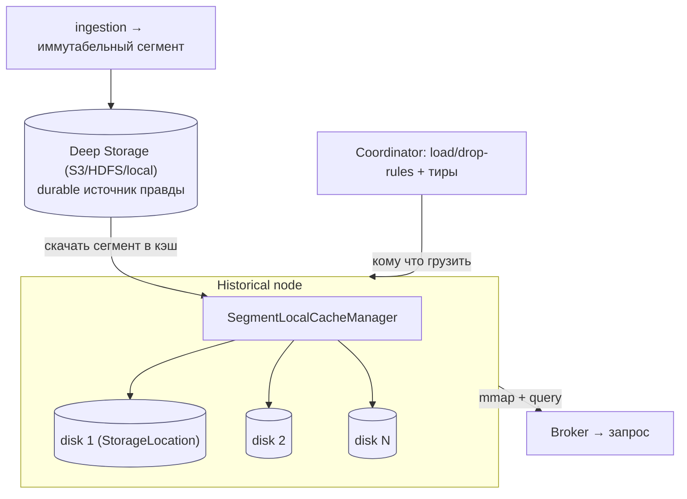
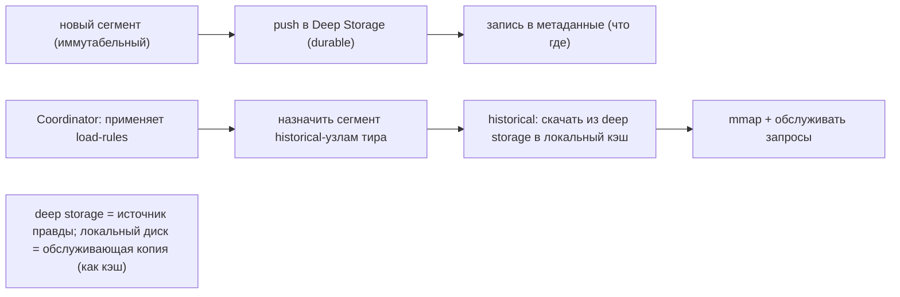
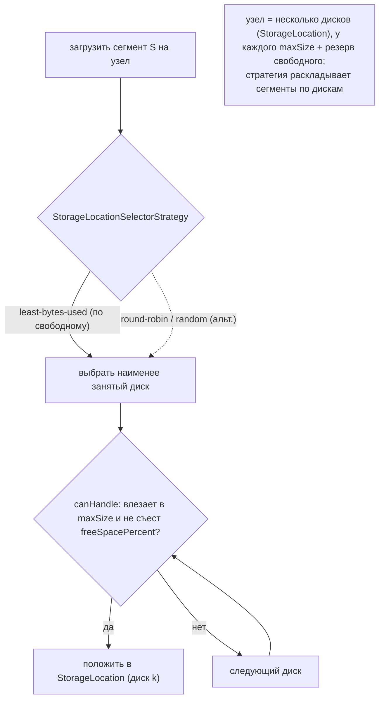
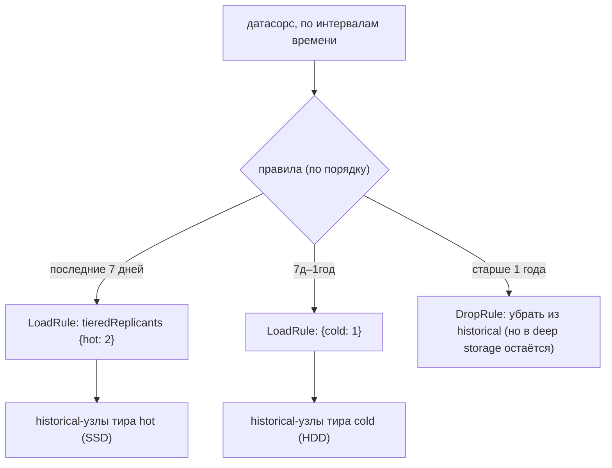
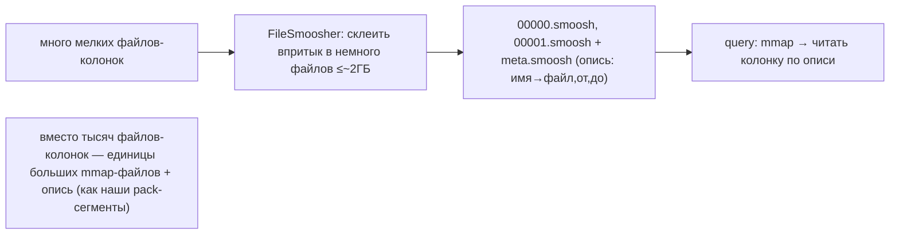
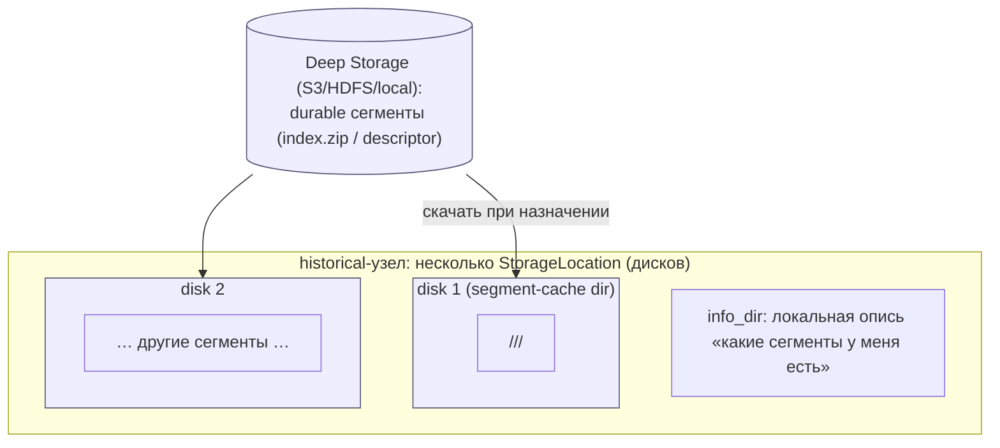
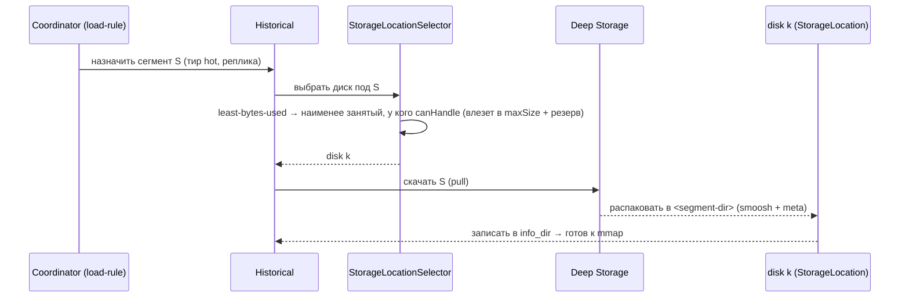
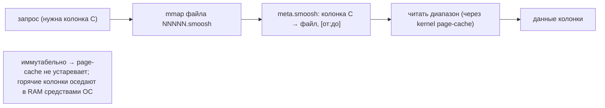
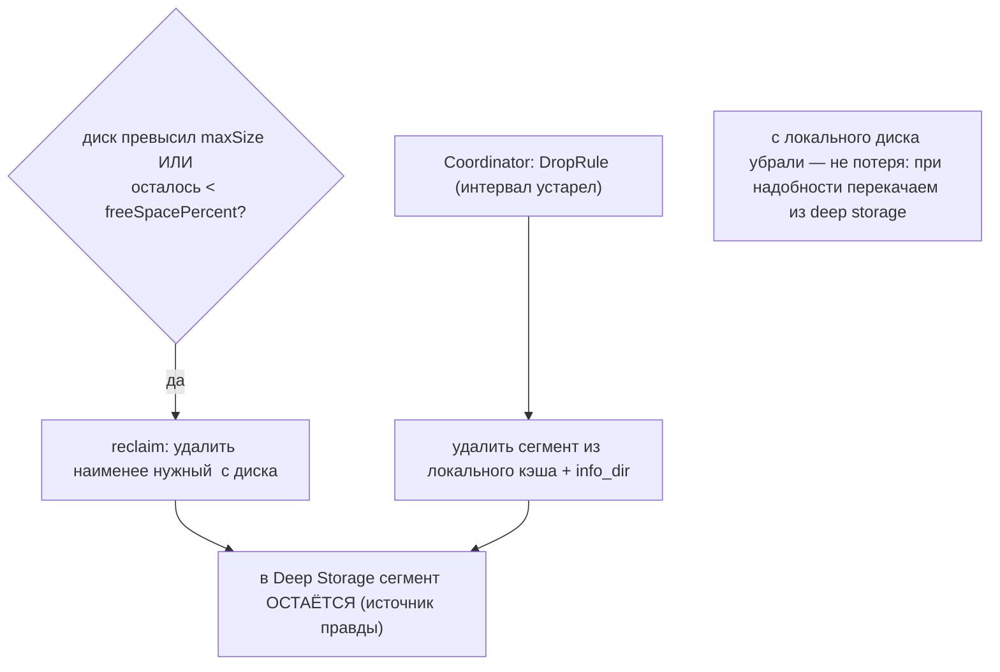

# Apache Druid Storage — как Druid работает с HDD/SSD (DDD-разбор исходников)

> Исследование исходников **apache/druid** (`Vendor/druid`, свежий слой, commit `d06aa83c` от
> 2026-06-05). Все факты — с ссылками `файл:строка`, проверены в коде.

Druid — real-time аналитическая БД (Java, колоночная). Её модель хранения **ближе всего к нашей по
философии**: данные — **иммутабельные сегменты** (write-once), лежат в дешёвом durable **deep
storage** (S3/HDFS), а узлы-historical **кэшируют сегменты локально** и **раскладывают по нескольким
дискам**. Новое и ценное для нас:

1. **★ Deep storage (источник правды) + локальный кэш сегментов на узлах** — compute/storage
   separation для **иммутабельных** данных (проще, чем у мутабельных СУБД — как и у нас).
2. **★ Тиры + декларативные load/drop-rules** — «последние 7 дней → 2 копии в hot-тире; старше →
   1 копия в cold; >1 года → drop». Управление жизненным циклом и репликацией **правилами**.
3. **★ Спред сегментов по нескольким дискам** через `StorageLocationSelectorStrategy`
   (least-bytes-used = по свободному месту) — наш 60-дисковый placement на уровне узла.
4. **Smoosh** — упаковка множества мелких колоночных файлов в немного больших mmap-файлов (≤~2ГБ) —
   ещё одно подтверждение pack-сегментов. **Иммутабельность** сегментов — как у нас.

---

## 1. Bounded Contexts



| Контекст | Ответственность | Файлы |
|---|---|---|
| **Segment / Smoosh** | иммутабельный колоночный сегмент, упаковка в mmap-файлы | `processing/.../segment/`, `.../io/smoosh/` |
| **Deep Storage** | durable источник правды (S3/HDFS/local) | extensions + `segment/loading/` |
| **Local segment cache** | кэш сегментов на узле, спред по дискам | `segment/loading/SegmentLocalCacheManager.java` |
| **Tiers + Rules** | тиры узлов + правила load/drop/replicas | `server/coordinator/rules/` |
| **Query / mmap** | чтение сегментов через memory-map | `segment/IndexIO.java`, `SmooshedFileMapper` |

---

## 2. Архитектурные диаграммы (Mermaid)

### D1. Жизненный цикл сегмента: deep storage → локальный кэш



### D2. Спред по нескольким дискам (StorageLocationSelectorStrategy)



### D3. Тиры + декларативные load/drop-rules



### D4. Smoosh — упаковка колонок в большие mmap-файлы



---

## 2-bis. Файловая система: раскладка и потоки (Mermaid)

> Особенность Druid: **источник правды — в deep storage** (S3/HDFS/local), а на узле — лишь
> **обслуживающие копии** в локальном кэше, разложенные по нескольким дискам и читаемые через **mmap**.

### FS1. Реальная раскладка на диске (historical-узел + deep storage)



### FS2. Загрузка сегмента в локальный кэш (выбор диска)



### FS3. Чтение: mmap smoosh + page-cache



### FS4. Вытеснение / удаление (reclaim + DropRule)



---

## 3. Ubiquitous Language (термины Druid)

| Термин | Значение | Где в коде |
|---|---|---|
| **Segment** | иммутабельная колоночная порция (интервал времени) | `processing/.../segment/` |
| **Deep storage** | durable источник правды (S3/HDFS/local) | `segment/loading/` |
| **Historical** | узел, кэширующий сегменты локально и отвечающий на запросы | `server/` |
| **StorageLocation** | один локальный диск-кэш (path + maxSize + резерв) | `segment/loading/StorageLocation.java:99,140` |
| **SelectorStrategy** | как выбрать диск под сегмент (least-used/RR/random) | `.../StorageLocationSelectorStrategy.java` |
| **Tier** | группа historical-узлов (hot/cold) | coordinator |
| **LoadRule / DropRule** | правила: сколько копий в каком тире / когда убрать | `coordinator/rules/LoadRule.java:38` |
| **tieredReplicants** | `Map<тир → число копий>` | `LoadRule.java:38` |
| **Smoosh** | упаковка мелких файлов в большие mmap-файлы | `io/smoosh/FileSmoosher.java` |

---

## 4. Иммутабельные сегменты + Smoosh

- **Сегмент иммутабелен**: создаётся при ingestion и **никогда не меняется** (новые данные →
  новый сегмент / новая версия). Точно как наши блоки.
- **Smoosh** (`io/smoosh/FileSmoosher.java:103`): колоночный сегмент состоит из множества мелких
  файлов (по колонке, по индексу). Чтобы не плодить тысячи файлов, Druid **склеивает их впритык**
  в немного больших файлов `NNNNN.smoosh` (каждый ≤ ~2ГБ, `Integer.MAX_VALUE`) + **`meta.smoosh`**
  (опись: «колонка → файл, от, до»). Чтение — **mmap** + переход по описи.

> Это **снова наши pack-сегменты**: много мелких → немного больших файлов + опись адресов.

## 5. Deep storage + локальный кэш (compute/storage separation)

- **Deep storage** — durable источник правды (S3/HDFS/local/GCS). Сегмент при создании
  **пушится** туда; метаданные (что где) — в БД метаданных.
- **Historical-узлы** не хранят «свою копию навсегда» — они **скачивают сегменты в локальный кэш**
  (`SegmentLocalCacheManager`) и обслуживают запросы. Локальный диск = **обслуживающая копия**,
  источник правды — deep storage. Потерял узел диск — просто **перекачает** недостающее.

> Это **compute/storage separation для иммутабельных данных**, и оно **проще**, чем у мутабельных
> СУБД (PolarDB): нет версий/согласованности — сегмент неизменен. Подтверждает наш урок immutability.

## 6. ★ Спред сегментов по нескольким дискам

- Узел имеет **несколько `StorageLocation`** (= несколько локальных дисков), у каждого `maxSizeBytes`
  + опц. `freeSpacePercent`-резерв (`StorageLocation.java:140`); `canHandle()` решает, влезет ли
  сегмент, и умеет **вытеснять** старое (reclaim).
- **`StorageLocationSelectorStrategy`** выбирает диск под новый сегмент. Реализации:
  - **`LeastBytesUsed`** (`.java:50`) — на **наименее занятый** диск (= по свободному месту);
  - `RoundRobin`, `Random` — альтернативы.

> Это **тот же вопрос, что у нас на 60 дисках** — куда положить, чтобы балансировать. Druid решает
> его на уровне узла **взвешенно по свободному месту** (как наш weighted-HRW) и делает стратегию
> **подключаемой**.

## 7. ★ Тиры + декларативные load/drop-rules

- **Тиры** — именованные группы historical-узлов (например, `hot` на SSD, `cold` на HDD).
- **Правила** (`coordinator/rules/`) применяются по интервалам времени, по порядку:
  - **LoadRule** с `tieredReplicants: Map<тир→копий>` (`LoadRule.java:38`) — «грузить N копий в
    такой-то тир»; варианты `Interval` / `Period` / `Forever`.
  - **DropRule** (`Interval`/`Period`/`Forever`) — «убрать из historical» (в deep storage остаётся).
  - **BroadcastRule** — раздать сегмент **на все** узлы (для справочников).
- Типичная политика: `Period 7d → {hot: 2}`, `Period 1y → {cold: 1}`, `ForeverDrop` (старше — только
  в deep storage).

> Это **декларативное** управление **и тирингом, и числом реплик, и сроком жизни** — богаче нашего
> «жёстко R=2». Прямой образец для нашей политики `cold_path` + переменной репликации по «классам».

## 8. mmap + page cache (точка дизайна)

Druid читает сегменты через **memory-map** и **полагается на kernel page-cache** (горячие колонки
оседают в RAM средствами ОС). Это **противоположный** YDB/Scylla выбор (там O_DIRECT + свой кэш).
Урок: для **иммутабельных, читаемых последовательно** сегментов mmap+page-cache — простой и
эффективный путь (нет проблемы устаревания кэша — сегмент неизменен).

## 9. Философия и вывод XFS/ZFS

Druid: durable **deep storage** + локальные **кэш-диски** на узлах, сегменты **иммутабельны**,
читаются через **mmap**. ФС под локальный кэш — простая быстрая (XFS); durable-слой — объектное
хранилище. ZFS не нужен (целостность — пере-скачать из deep storage; избыточность — реплики по
правилам). Ключевая мысль: **источник правды отдельно (дёшево/durable), обслуживающие копии — на
быстрых локальных дисках, разложены по носителям и тирам правилами.**

## 9-bis. Снипеты кода (реальные выдержки + объяснение)

### CS1. Декларативные load-rules: тир → число реплик (#55)

```java
// server/.../coordinator/rules/LoadRule.java:46
protected LoadRule(Map<String, Integer> tieredReplicants, Boolean useDefaultTierForNull) {
    this.tieredReplicants = handleNullTieredReplicants(tieredReplicants, ...);  // tier → replicants
    validateTieredReplicants(this.tieredReplicants);
    this.shouldSegmentBeLoaded = tieredReplicants.values().stream().reduce(0, Integer::sum) > 0;
}
```

**Объяснение:** правило задаёт `tier → число реплик` по интервалу (Load/Drop/Interval). → наш
**декларативный load/drop-rules (#55)** (тир+копий+срок вместо жёсткого R=2).

### CS2. Deep-storage + локальный кэш сегментов + лимиты (#57/#56)

```java
// server/.../segment/loading/StorageLocation.java:140
public StorageLocation(File path, long maxSizeBytes, @Nullable Double freeSpacePercent) {
    this.maxSizeBytes = maxSizeBytes;
    if (freeSpacePercent != null)
        this.freeSpaceToKeep = (long)((freeSpacePercent * path.getTotalSpace()) / 100);  // резерв
}
```

**Объяснение:** локальный кэш сегментов (`maxSize` + free-резерв), сегменты тянутся из deep-storage. →
наш **deep-storage + локальный кэш (#57)** + **лимиты диска (#56)**.

### CS3. Least-bytes-used выбор локации (#2)

```java
// server/.../loading/LeastBytesUsedStorageLocationSelectorStrategy.java:36
private static final Ordering<StorageLocation> ORDERING =
    Ordering.from(Comparator.comparingLong(StorageLocation::currentSizeBytes));
public Iterator<StorageLocation> getLocations() { return ORDERING.sortedCopy(storageLocations).iterator(); }
```

**Объяснение:** выбор наименее заполненного диска (сорт по `currentSizeBytes`). → наш **selector
least-bytes-used (#2)** (≈ HRW-by-free на 60 дисках).

---

## 10. Извлечённые идеи для OpenZFS Daemon

| Идея из Druid | Где применить | Эффект |
|---|---|---|
| **★ Декларативные load/drop-rules (реплики per-тир + срок)** | **Фаза 5** — политика тиринга/репликации правилами: «класс A → 2 копии hot; класс B → 1 cold; X → cold_path/drop» | гибкая политика вместо жёсткого R=2 |
| **★ StorageLocationSelectorStrategy (least-bytes-used, pluggable)** | **Фаза 2** — подключаемая стратегия выбора диска; подтверждает weighted-HRW по свободному месту | балансировка + сменная политика |
| **★ Deep storage + локальный кэш** (источник правды отдельно) | **Часть 3** — durable backing (S3/cold_path) + локальные обслуживающие копии; потеря диска → перекачать | дешёвая надёжность + масштаб чтения |
| **StorageLocation: maxSize + freeSpace-резерв + reclaim** | **Фаза 1/5** — лимиты и вытеснение per-диск | не переполнять диск, авто-эвикция |
| **Smoosh: упаковка мелких в большие mmap-файлы + опись** | подтверждает **pack-сегменты** | (уже взято) |
| **mmap + page-cache для иммутабельного** | альтернатива O_DIRECT на data-tier (HDD) | проще; кэш не устаревает (immutable) |
| **BroadcastRule (раздать на все узлы)** | (Часть 3) раздача «горячего справочного» контента всем gateway'ам | локальность чтения |

### Главное
**Декларативные правила тиринга/репликации** (реплики-на-тир + срок жизни + drop) — самый сильный
новый приём: вместо «жёстко R=2» описываем политику **классами/правилами**. Плюс **pluggable
selector по свободному месту** (подтверждает наш HRW-by-free-space) и **deep-storage + локальный
кэш** для иммутабельных данных (наш Часть-3 путь, упрощённый immutability).

---

## 11. Источники в коде (для перепроверки)

- Segment cache / диски: `server/.../segment/loading/SegmentLocalCacheManager.java`,
  `StorageLocation.java:99,140,274`, `StorageLocationSelectorStrategy.java`,
  `LeastBytesUsedStorageLocationSelectorStrategy.java:50`, `RoundRobin…`, `Random…`,
  `SegmentLoaderConfig.java`, `StorageLocationConfig.java`.
- Тиры/правила: `server/.../coordinator/rules/LoadRule.java:38,46`, `DropRule.java`,
  `Interval/Period/Forever{Load,Drop}Rule.java`, `BroadcastDistributionRule.java`.
- Сегмент/Smoosh/mmap: `processing/.../segment/IndexIO.java`,
  `processing/.../java/util/common/io/smoosh/FileSmoosher.java:103`, `SmooshedFileMapper.java`.
