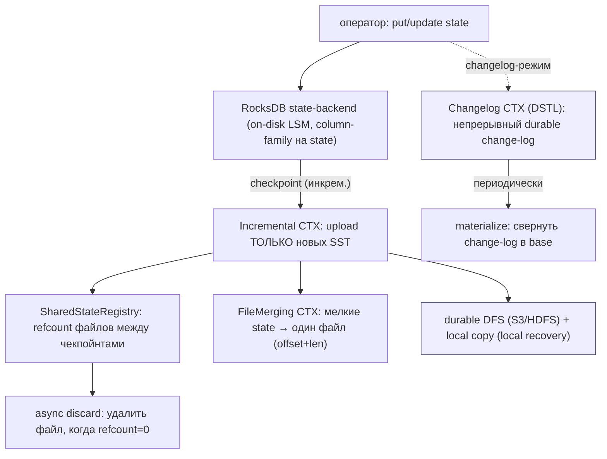
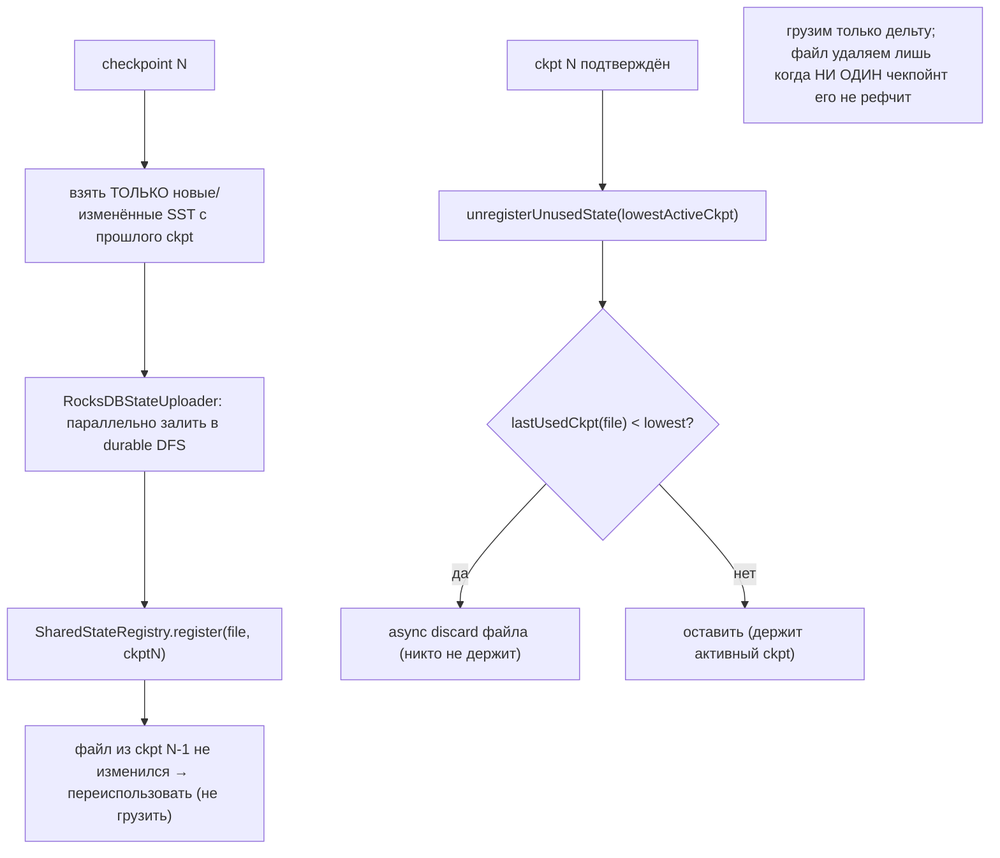
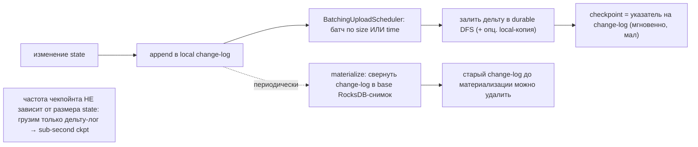
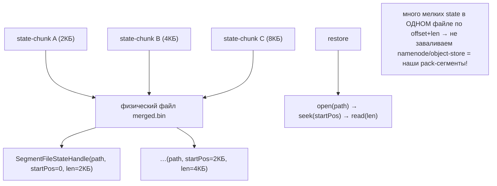
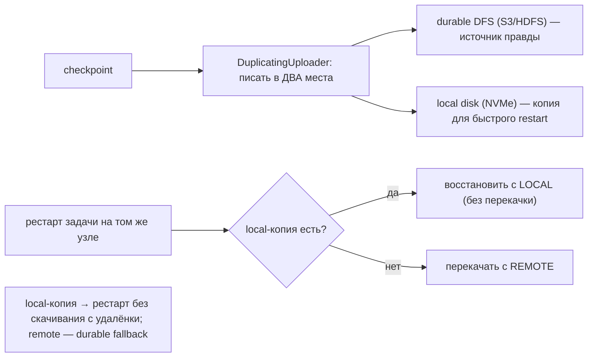
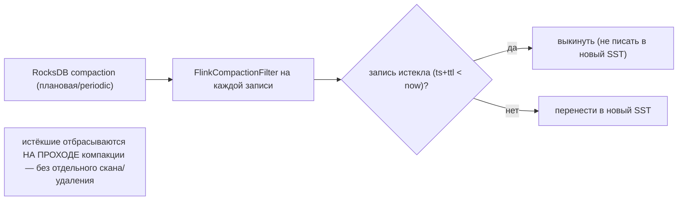
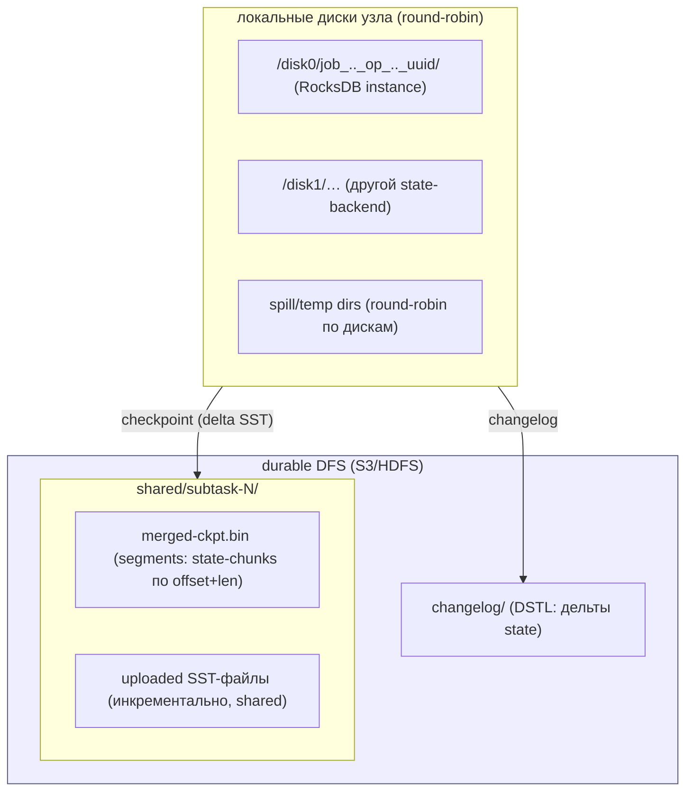
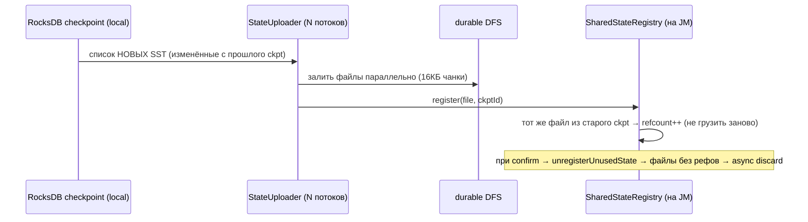
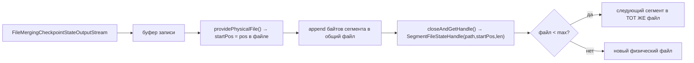
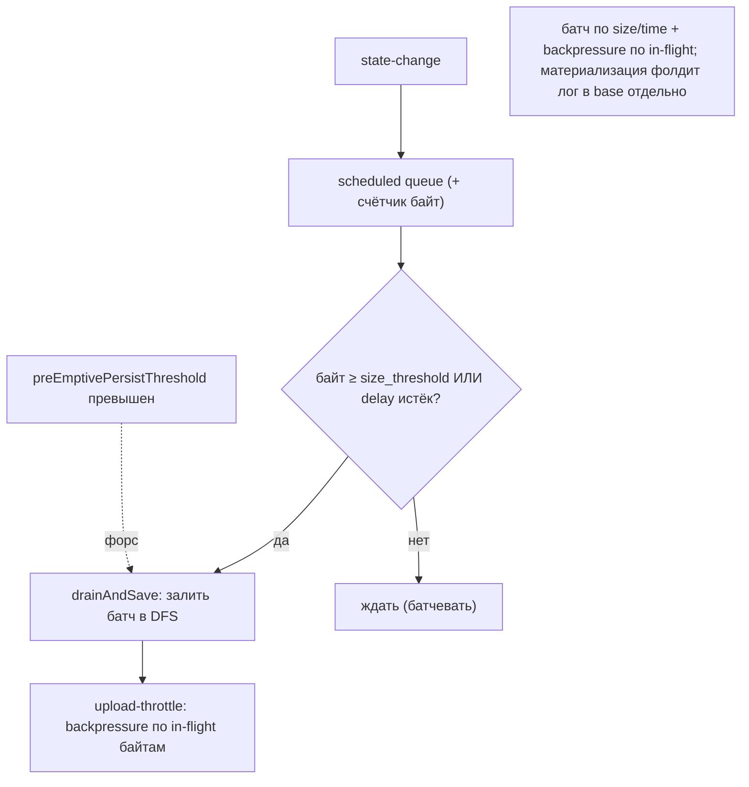

# Apache Flink Storage — как Flink работает с HDD/SSD (DDD-разбор исходников)

> Исследование исходников **apache/flink** (`Vendor/flink`, свежий слой, commit `afb5ef94` от
> 2026-06-09). Все факты — с ссылками `файл:строка`, проверены в коде.

Flink — stream-движок (Java). Storage-релевантна его **state-машина**: keyed-state в
**RocksDB-on-disk** (`EmbeddedRocksDBStateBackend`) + **checkpointing** в durable-DFS (S3/HDFS).
RocksDB мы уже разобрали глубоко → **много конвергенции** (LSM/SST/compaction/TTL — знакомо). Но Flink
добавляет ценную **оркестрацию персиста/бэкапа** поверх RocksDB:

1. **★ Инкрементальный checkpoint = delta-upload + shared-file refcount** — грузить в durable только
   **новые/изменённые SST**, а `SharedStateRegistry` рефкаунтит файлы между чекпойнтами → удалять файл,
   когда **ни один** чекпойнт его не держит.
2. **★ Changelog / DSTL** — durable short-term log: **непрерывно** дописывать изменения state в
   durable-хранилище (батч по size/time), периодически **материализовать** в base → **частота
   чекпойнта не зависит от размера state** (sub-second checkpoints на любом объёме).
3. **★ TTL через compaction-filter** — истёкшие записи отбрасываются **на проходе компакции** (без
   отдельного скана). + file-merging (мелочь→один файл по offset+len), local-recovery (local+remote
   dual-write), multi-temp-dir spill round-robin.

> Контекст: state-backend = RocksDB (наш data-tier-LSM уже им вдохновлён). Берём не RocksDB, а
> **чекпойнт-оркестрацию**: incremental-delta-backup + shared-refcount, changelog-DSTL, TTL-compaction-
> filter. file-merging/offset+len ⟷ наши pack-сегменты (уже есть); local+remote ⟷ deep-storage+кэш
> (Druid #57). Честно: остальное у Flink — «RocksDB + upload в DFS».

---

## 1. Bounded Contexts



| Контекст | Ответственность | Файлы |
|---|---|---|
| **RocksDB backend** | keyed-state on-disk (CF на state), multi-disk round-robin | `flink-statebackend-rocksdb/.../EmbeddedRocksDBStateBackend.java` |
| **Incremental ckpt** | upload новых SST, dedup по имени | `.../snapshot/RocksIncrementalSnapshotStrategy.java`, `RocksDBStateUploader.java` |
| **SharedStateRegistry** | refcount общих файлов, async discard | `flink-runtime/.../state/SharedStateRegistryImpl.java` |
| **Changelog (DSTL)** | непрерывный durable change-log + materialize | `flink-dstl/.../FsStateChangelogStorage.java`, `BatchingStateChangeUploadScheduler.java` |
| **FileMerging** | мелкие state → один файл (segment offset+len) | `flink-runtime/.../filemerging/SegmentFileStateHandle.java` |
| **Local recovery / spill** | local+remote dual-write; spill round-robin | `LocalRecoveryConfig.java`, `io/disk/FileChannelManagerImpl.java` |
| **TTL** | drop истёкших на компакции | `.../rocksdb/ttl/RocksDbTtlCompactFiltersManager.java` |

---

## 2. Архитектурные диаграммы (Mermaid)

### Fl1. Инкрементальный checkpoint: delta-upload + refcount



### Fl2. Changelog (DSTL): decouple cadence от размера



### Fl3. File-merging: мелкие state → один файл (offset+len)



### Fl4. Local recovery: local + remote dual-write



### Fl5. TTL через compaction-filter (drop на проходе)



---

## 2-bis. Файловая система: раскладка и потоки (Mermaid)

> Flink: state — локальный RocksDB на узле (несколько дисков round-robin); checkpoint — в durable-DFS
> (инкрементально, file-merged); changelog-DSTL — отдельный durable change-log.

### FS1. Раскладка: local RocksDB + durable checkpoint



### FS2. Инкрементальный upload SST + refcount



### FS3. File-merging: запись сегмента в общий файл



### FS4. Changelog-DSTL: непрерывный поток дельт



---

## 3. Ubiquitous Language (термины Flink)

| Термин Flink | Значение | Наш аналог |
|---|---|---|
| **state backend (RocksDB)** | keyed-state on-disk (LSM) | data-tier (наш LSM-вдохновлён) |
| **incremental checkpoint** | upload только новых SST | инкрементальный backup (дельта) |
| **SharedStateRegistry** | refcount файлов между ckpt | refcount сегментов + reader-watermark (#106) |
| **changelog / DSTL** | durable short-term log изменений | durable change-log (расширяет WAL #59) |
| **materialization** | свернуть change-log в base | checkpoint-rollup (#93) |
| **SegmentFileStateHandle** | (file, offset, len) | адрес блока (seg, off, len) — наш! |
| **file-merging** | мелкие state → один файл | pack-сегменты (#data-tier) |
| **local recovery** | local-копия + remote durable | deep-storage + локальный кэш (#57) |
| **compaction filter (TTL)** | drop истёкших на компакции | ephemeral-TTL drop при GC |
| **temp/spill dirs round-robin** | spill по нескольким дискам | spread temp по 60 HDD |

---

## 4. State-backend (RocksDB) — конвергенция

`EmbeddedRocksDBStateBackend` (`:434-470`): локальный RocksDB-инстанс на узле, **несколько дисков
round-robin** (`getNextStoragePath`, `nextDirectory % paths.length`), один инстанс на keyed-backend,
**column-family на каждый именованный state**. Это **знакомый on-disk LSM** (мы разобрали RocksDB/
Pebble/Tarantool). Multi-disk round-robin ⟷ наш HRW/round-robin по 60 дискам (есть). Берём не это, а
оркестрацию ниже.

---

## 5. Инкрементальный checkpoint + SharedStateRegistry (★)

`RocksIncrementalSnapshotStrategy` (`:80-289`): чекпойнт грузит в durable **только новые/изменённые
SST** (`uploadedSstFiles: ckptId → файлы`), параллельно (`RocksDBStateUploader`, `:71-106`, N потоков,
16КБ-чанки). **SharedStateRegistry** (`SharedStateRegistryImpl.java:81-195`): общий файл (SST) между
чекпойнтами **рефкаунтится** по `(key=имя файла, lastUsedCheckpointID)`; на `notifyCheckpointComplete`/
`unregisterUnusedState(lowest)` файл с `lastUsed < lowest` → **async discard** (фон-пул).

> Для нас: **инкрементальный backup** в `cold_path`/S3 — грузить **только новые/изменённые сегменты**
> с прошлого бэкапа (не весь датасет; усиливает DFS-backup #76, который был полным). **Shared-segment
> refcount**: сегмент, общий для нескольких бэкапов, удалять лишь когда **ни один бэкап его не держит**
> — это reader-watermark (#106) на уровне бэкапов. Контент-адресность даёт дедуп «по имени» бесплатно.

---

## 6. Changelog / DSTL — decouple cadence от размера (★)

`FsStateChangelogStorage` + `BatchingStateChangeUploadScheduler` (`:158-216`): **непрерывно**
дописывать изменения state в local change-log → **батч по size/time** (`PERSIST_SIZE_THRESHOLD`/
`PERSIST_DELAY`) → залить дельту в **durable DFS**; backpressure по **in-flight байтам**
(`IN_FLIGHT_DATA_LIMIT`); `preEmptivePersistThreshold` — форс-флаш. Checkpoint = просто указатель на
change-log (мгновенный, маленький) **независимо от размера state**. Периодически **materialization**
сворачивает change-log в base-снимок RocksDB (старый лог удаляется). `DuplicatingStateChangeFsUploader`
(`:91-107`) — **dual-write** в remote + local (для local-recovery).

> Для нас: **самый ценный** новый приём. Это расширение WAL+checkpoint (Ignite #59) до **durable-remote
> change-log**: наш **манифест/index-WAL непрерывно стримить в `cold_path`** (батч по size/time,
> backpressure по in-flight), периодически материализовать (checkpoint-rollup #93). → **частота
> бэкапа/точки восстановления не зависит от 480ТБ**: бэкапим дельту, а не весь стор. RPO падает до
> секунд. dual-write (local+remote) = наш deep-storage + локальный кэш (#57).

---

## 7. File-merging, local recovery, TTL-filter, spill

**File-merging** (`SegmentFileStateHandle.java:44-100`): много мелких state-chunks в **одном** файле,
адрес = `(file, startPos, len)`; restore = `open→seek(startPos)→read(len)`. Это **ровно наши
pack-сегменты** (мелочь → один файл по offset+len; не заваливаем namenode/object-store) — конвергенция,
подтверждает #data-tier. **Local recovery** (`LocalRecoveryConfig.java`): local-копия чекпойнта на
узле → рестарт без перекачки с remote ⟷ deep-storage+кэш (#57). **TTL compaction-filter**
(`RocksDbTtlCompactFiltersManager.java:89-254`): истёкшие записи **отбрасываются на проходе компакции**
(`FlinkCompactionFilter`), без отдельного скана/удаления; + `setPeriodicCompactionSeconds`.
**Spill/temp** (`FileChannelManagerImpl.java:106-111`): spill по нескольким temp-dir **round-robin**
(`nextPath % paths.length`) ⟷ spread по 60 HDD.

> Для нас новое — **TTL через compaction-filter (#109):** при компакции/splice-GC сегмента
> **выкидывать истёкшие ephemeral-блоки инлайн** (по embedded-ts), без отдельного прохода. Уточняет
> ephemeral-TTL (#... FIFO=TTL) и time-bucketed drop (#92) для блоков, что нельзя сгруппировать в
> отдельный сегмент-окно.

---

## 8. Философия и вывод XFS/ZFS

State Flink — локальный RocksDB на «голых» дисках (несколько round-robin) + durable DFS как источник
правды (compute/storage separation, как PolarDB/Druid). Это снова **JBOD + app-уровень избыточности**
(ADR 0001): диск отдельный, durable-слой — выше. ZFS под RocksDB дал бы двойной LSM/CoW — не нужно.
Ключевой урок Flink — не диск, а **оркестрация дельта-персиста** (incremental + changelog) поверх
иммутабельных файлов.

---

## 8-bis. Снипеты кода (реальные выдержки + объяснение)

### CS1. Incremental checkpoint: shared-state refcount (#107)

```java
// flink-runtime/.../state/SharedStateRegistryImpl.java:94 — registerReference (ref++)
entry = registeredStates.get(registrationKey);
if (entry == null) { entry = new SharedStateEntry(newHandle, checkpointID); ... }
else entry.advanceLastUsingCheckpointID(checkpointID);          // переиспользован новым чекпойнтом
// :173 — unregisterUnusedState (discard)
if (entry.lastUsedCheckpointID < lowestCheckpointID) { subsumed.add(entry.stateHandle); it.remove(); }
```

**Объяснение:** общий файл рефкаунтится по чекпойнтам; удаляется, когда не держит ни один активный. →
наш **инкрементальный backup + shared-segment refcount (#107)** (+ reader-watermark #106).

### CS2. Changelog/DSTL: батч по size/time (#108)

```java
// flink-dstl/.../BatchingStateChangeUploadScheduler.java:205 — scheduleUploadIfNeeded()
if (scheduleDelayMs == 0 || scheduledBytesCounter >= sizeThresholdBytes) {
    drainAndSave();                                              // порог по БАЙТАМ → залить сразу
} else if (scheduledFuture == null) {
    scheduledFuture = scheduler.schedule(this::drainAndSave, scheduleDelayMs, MILLISECONDS); // или по ВРЕМЕНИ
}
```

**Объяснение:** дельта-лог уходит в durable по порогу size ИЛИ time. → наш **changelog/DSTL: durable
дельта-лог (#108)** (RPO независим от объёма).

### CS3. File-merging: segment handle (offset+len) ≈ pack-сегмент

```java
// flink-runtime/.../state/filemerging/SegmentFileStateHandle.java:44
private final long startPos; private final long stateSize;       // позиция + размер в общем файле
public FSDataInputStream openInputStream() {
    return new FsSegmentDataInputStream(getFileSystem().open(filePath), startPos, stateSize); // seek+read len
}
```

**Объяснение:** много мелких state в одном файле, адрес `(file, startPos, stateSize)`. → **подтверждает
наши pack-сегменты** (адрес `(seg, off, len)`).

---

## 9. Извлечённые идеи для OpenZFS Daemon

| # | Идея | Где у Flink | Берём? | Фаза | Влияние |
|---|---|---|---|---|---|
| 107 | **★ Инкрементальный backup: delta-upload + shared-segment refcount** (удалять, когда ни один бэкап не держит) | `RocksIncrementalSnapshotStrategy`, `SharedStateRegistryImpl.java:81-195` | ✅ да | **5** | бэкап в cold_path/S3 грузит только новые сегменты; усиливает DFS-backup #76 + reader-watermark #106 |
| 108 | **★ Changelog/DSTL: durable change-log decouple cadence от размера** (непрерывный батч-upload дельты + периодическая материализация) | `FsStateChangelogStorage`, `BatchingStateChangeUploadScheduler.java:158-216` | ✅ да | **1/5** | RPO до секунд независимо от 480ТБ: бэкапим дельту манифеста/индекса, не весь стор; расширяет WAL #59 + rollup #93 |
| 109 | **TTL через compaction-filter** (drop истёкших инлайн на проходе компакции, без отдельного скана) | `RocksDbTtlCompactFiltersManager.java:89-254` | ✅ да | **5** | ephemeral-блоки с TTL выкидываются при splice-GC по embedded-ts; уточняет #92/FIFO=TTL |

### Конвергенция (подтверждает уже принятое, не новые строки)
- **RocksDB on-disk LSM, column-family, SST/compaction** ⟷ RocksDB/Pebble/Tarantool (разобрано).
- **file-merging (offset+len, мелочь→один файл)** ⟷ **наши pack-сегменты** (`(seg,off,len)`) — Flink подтверждает.
- **multi-disk round-robin (state/spill)** ⟷ HRW/round-robin по 60 HDD (#2/#селектор).
- **local recovery (local+remote dual-write)** ⟷ deep-storage + локальный кэш (Druid #57, PolarDB Ч3).
- **SharedStateRegistry refcount + async discard** ⟷ refcount сегментов + two-phase delete (#84) + reader-watermark (#106).
- **batching upload scheduler (size/time + backpressure по in-flight)** ⟷ write-буфер + backpressure-по-байтам (Dragonfly #78).
- **HashMap (heap) backend** ⟷ не наша модель (тела на диске).

### Главные новые заимствования
**#108 changelog/DSTL** — самый ценный: durable-remote дельта-лог делает RPO независимым от объёма
(бэкапим дельту манифеста/индекса, не 480ТБ). **#107 инкрементальный backup + shared-refcount** —
дельта-бэкап вместо полного. **#109 TTL-compaction-filter** — инлайн-drop истёкших. Остальное — RocksDB-
конвергенция; file-merging прямо подтверждает наши pack-сегменты.

---

## 10. Источники в коде (для перепроверки)

| Область | Файл | Ключевые места |
|---|---|---|
| RocksDB backend | `flink-statebackend-rocksdb/.../EmbeddedRocksDBStateBackend.java` | 126,162-163,434-470 |
| Инкрем. checkpoint | `…/rocksdb/snapshot/RocksIncrementalSnapshotStrategy.java` | 80-86,141-155,284-289 |
| Параллельный upload | `…/rocksdb/RocksDBStateUploader.java` | 54-106,130-181 |
| SharedStateRegistry | `flink-runtime/.../state/SharedStateRegistryImpl.java` | 81-195 |
| Changelog (DSTL) | `flink-dstl/.../FsStateChangelogStorage.java`, `BatchingStateChangeUploadScheduler.java` | sched 122-216; dup 91-107 |
| File-merging | `flink-runtime/.../filemerging/SegmentFileStateHandle.java`, `FileMergingCheckpointStateOutputStream.java` | seg 44-100; out 108-252 |
| Local recovery | `flink-runtime/.../state/LocalRecoveryConfig.java`, `TaskLocalStateStore.java` | cfg 40-88 |
| TTL compaction-filter | `…/rocksdb/ttl/RocksDbTtlCompactFiltersManager.java` | 89-254 |
| Spill round-robin | `flink-runtime/.../io/disk/FileChannelManagerImpl.java` | 68-111 |

---

> **Резюме для проекта.** Flink — 19-й прототип; state-backend = **RocksDB** (разобран) → **много
> конвергенции**. file-merging подтверждает наши pack-сегменты (offset+len), multi-disk/round-robin —
> HRW, local-recovery — deep-storage+кэш, refcount-discard — two-phase delete/reader-watermark. Новое:
> **#108 changelog/DSTL** (durable дельта-лог → RPO независим от объёма — главный приём), **#107
> инкрементальный backup + shared-refcount** (дельта-бэкап), **#109 TTL-compaction-filter** (инлайн-drop
> истёкших). См. [STORAGE-IDEAS-SYNTHESIS.md](STORAGE-IDEAS-SYNTHESIS.md), [[ignite-storage-hdd-ssd.md]]
> (WAL+checkpoint), [[druid-storage-hdd-ssd.md]] (deep-storage+кэш), [[hive-storage-hdd-ssd.md]] (компакция/Cleaner), [Feynman](../../Feynman/README.md).
