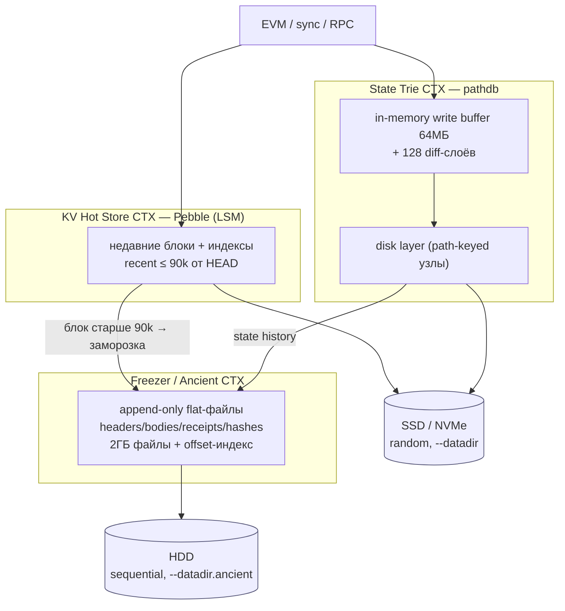
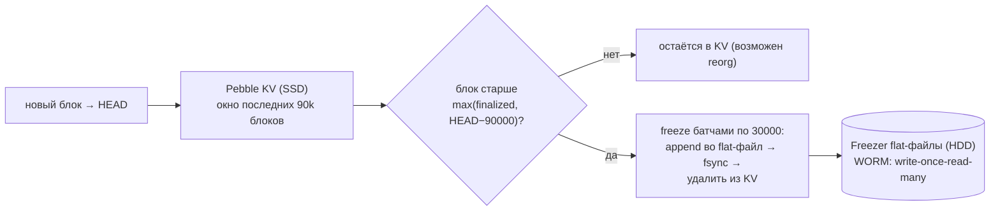
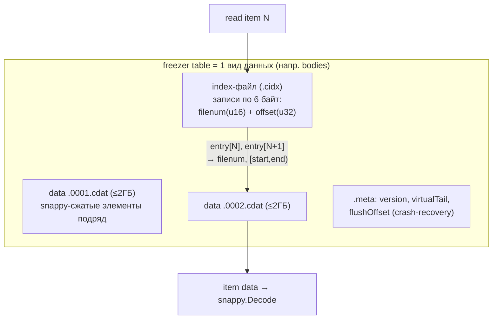
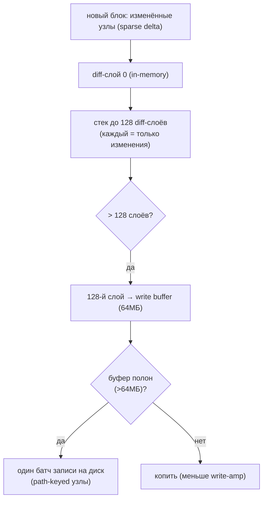
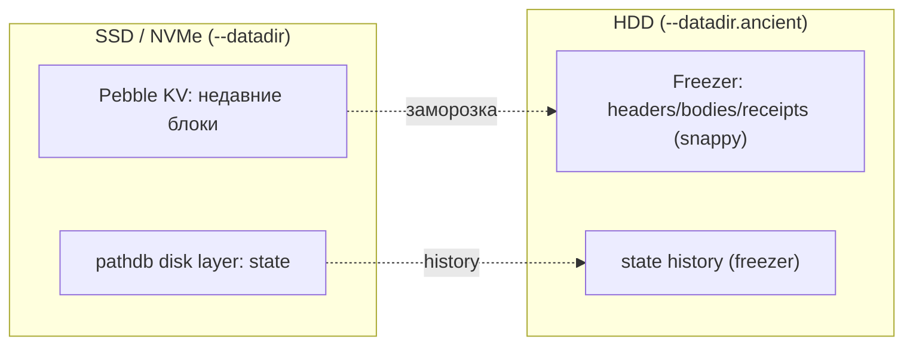
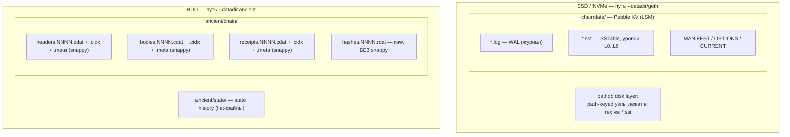
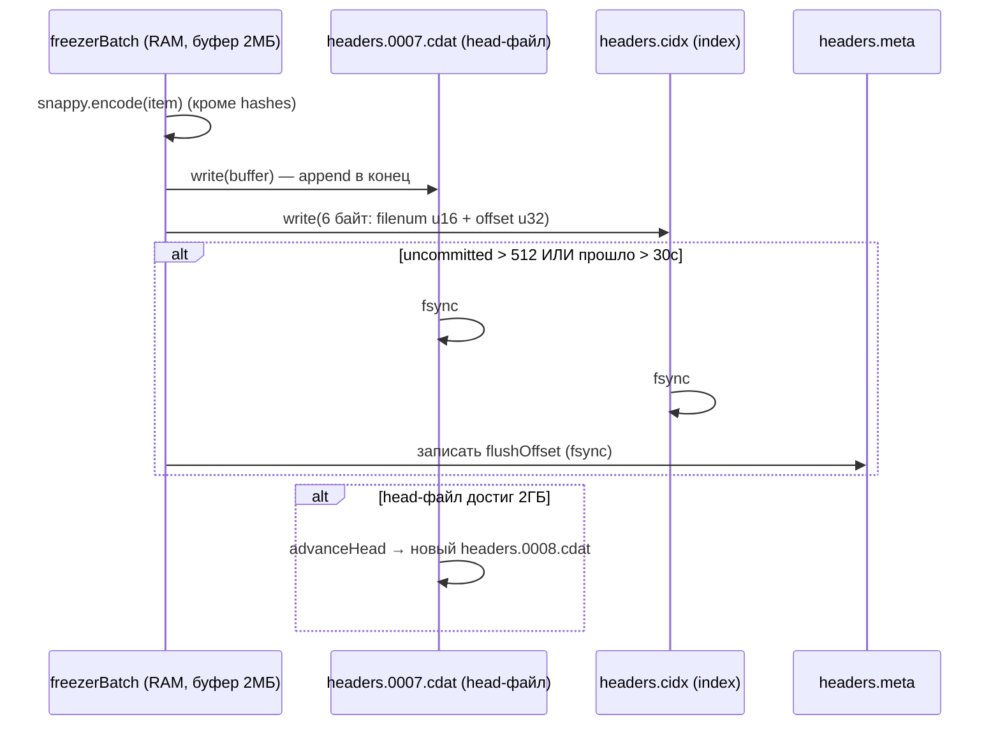
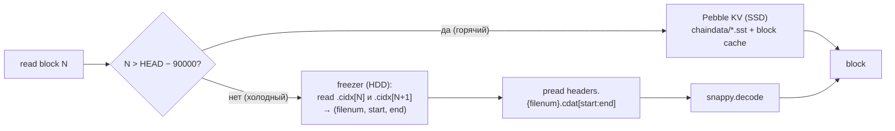
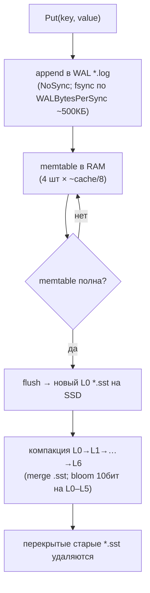

# go-ethereum Storage — как geth работает с HDD/SSD (DDD-разбор исходников)

> Исследование исходников **ethereum/go-ethereum** (`Vendor/go-ethereum`, свежий слой, commit
> `13d8df63…` от 2026-06-05). Цель — вытащить идеи для нашего content-addressed blockstore на
> 60 HDD. Все факты — с ссылками `файл:строка` и проверены в коде.

TL;DR философии geth: **горячее изменяемое состояние и недавние блоки — в LSM-БД (Pebble) на
SSD/NVMe; неизменяемую старую историю «замораживают» (freezer) в append-only flat-файлы,
которые можно вынести на отдельный HDD.** Плюс state-trie использует **in-memory write-буфер +
слои**, чтобы резать write-amplification. Это hot/cold-тиринг в чистом виде — и **прямой
чертёж** для нашего data-tier.

---

## 1. Bounded Contexts хранения geth



| Контекст | Роль | Носитель | Где в коде |
|---|---|---|---|
| **KV Hot Store** (Pebble) | недавние блоки + ключи, random | SSD/NVMe | `ethdb/pebble/pebble.go` |
| **State Trie** (pathdb) | состояние мира, буфер+слои | SSD | `triedb/pathdb/` |
| **Freezer / Ancient** | неизменяемая история, append-only | **HDD (отдельный путь)** | `core/rawdb/freezer*.go` |

> Ключ DDD-наблюдения: geth **физически разделяет хранилище по неизменяемости и типу доступа** —
> и даёт это операторам как **два разных пути** (`--datadir` vs `--datadir.ancient`).

---

## 2. Архитектурные диаграммы (Mermaid)

### G1. Hot/Cold граница: заморозка блоков (HEAD − 90000)



### G2. Формат freezer-таблицы (чертёж для pack-сегментов)



### G3. State-trie pathdb: write-буфер + слои → редкий flush на диск



### G4. Тиринг по носителям (что куда)



---

## 2-bis. Файловая система: раскладка и потоки (Mermaid)

### FS1. Реальная раскладка на диске (какие файлы, на каком носителе)



### FS2. Запись в freezer на уровне файлов (snappy → .cdat/.cidx/.meta)



### FS3. Чтение блока: маршрутизация KV ↔ freezer по файлам



### FS4. Pebble LSM ↔ файловая система (путь записи)



---

## 3. Ubiquitous Language (термины geth)

| Термин | Значение | Где в коде |
|---|---|---|
| **Freezer / Ancient store** | append-only flat-файлы для неизменяемых данных | `core/rawdb/freezer.go:55` |
| **FullImmutabilityThreshold** | 90000 — глубина «мягкой финальности», граница заморозки | `params/network_params.go:27` |
| **freezer table** | один вид данных = data-файлы + index-файл + meta | `core/rawdb/freezer_table.go` |
| **indexEntry** | 6 байт: `filenum(u16)+offset(u32)` — адрес элемента | `freezer_table.go:54` |
| **pathdb / hashdb** | state по пути в дереве vs по хэшу узла | `triedb/pathdb`, `triedb/hashdb` |
| **diff layer** | in-memory дельта изменений состояния (sparse) | `triedb/pathdb/difflayer.go:27` |
| **state history** | дельты состояния в freezer для reorg/rollback | `triedb/pathdb/database.go:133` |

---

## 4. KV Hot Store — Pebble (SSD, случайный доступ)

geth по умолчанию использует **Pebble** (LSM, как RocksDB). Настройки (`ethdb/pebble/pebble.go`)
явно заточены под SSD:

| Опция | Значение | Строка | Смысл для HDD/SSD |
|---|---|---|---|
| Block cache | `NewCache(cache МБ)` | 239 | random-read кэш; на SSD критичен |
| MemTable | `cache/8` × **4 штуки** | 208–209 | сглаживает flush, перекрытие компакций |
| Stop-writes порог | `4*2 = 8` memtable | 255 | поглощает всплески записи |
| `L0CompactionThreshold` | **2** | 301 | «compaction debt < 1ГБ», ниже tail-latency |
| `MaxConcurrentCompactions` | `NumCPU` | 259 | утилизация параллельного I/O SSD |
| `ReadSamplingMultiplier` | **−1 (seek-compaction ВЫКЛ)** | 305 | на SSD seek дёшев → не тратим компакцию |
| Bloom filter | **10 бит**, уровни L0–L5 (на L6 нет) | 264–273 | отсекает лишние чтения SST |
| `writeOptions` | **`pebble.NoSync`** (async WAL) | 233 | throughput > durability; fsync не на каждый put |
| `WALBytesPerSync` | `5 × IdealBatchSize` ≈ 500КБ | 290 | периодический flush WAL |

Бюджет `--cache` (деф. **4096 МБ**) делится: **50% database** (Pebble), 15% trie, 25% gc, 10%
snapshot (`cmd/utils/flags.go:495–524`). Ключевая схема (`schema.go:112`): префиксы `h/b/r`
(+ `blockNum BE + hash`) дают **локальность по номеру блока** в LSM → меньше random при компакции.

> Урок: горячий KV-индекс — это LSM на SSD с bloom + отключённой seek-компакцией + async-WAL.
> Для нашего index-tier на redb (B-tree) часть неприменима, но **bloom, async-fsync-политика и
> локальность ключей** — берём.

---

## 5. Freezer / Ancient — история (HDD, append-only) ← главный чертёж

### 5.1 Что и зачем
Freezer — «append-only database … into flat files: append-only minimizes writes; in-order data
optimizes reads» (`freezer.go:55`). Туда уходят **headers, hashes, bodies, receipts, BAL**
(`ancient_scheme.go:26`). Данные неизменяемы, потому что старше порога reorg невозможен.

### 5.2 Граница hot/cold = HEAD − 90000
`FullImmutabilityThreshold = 90000` (`params/network_params.go:27`). Порог заморозки —
`max(finalized, HEAD − 90000)` (`chain_freezer.go:131`). Замораживается **батчами по 30000**
блоков, затем fsync и удаление из KV (`chain_freezer.go:40`).

### 5.3 Формат таблицы (берём почти как есть)
Каждая таблица = **data-файлы ≤ 2ГБ** (`freezerTableSize = 2*1000*1000*1000`, `freezer.go:53`)
+ **index-файл** (записи по 6 байт: `filenum u16 + offset u32`, `freezer_table.go:54`) + **meta**
(`version, virtualTail, flushOffset`). Поиск элемента N: прочитать `index[N]` и `index[N+1]` →
`(filenum, [start,end))` → читать из `{table}.{filenum}.cdat`. Запись — буфер 2МБ
(`freezerBatchBufferLimit`), **fsync каждые 512 элементов или 30 сек** (`freezer_batch.go`).

### 5.4 Crash-recovery через `flushOffset`
В `.meta` хранится последний синхронизированный offset → на старте «хвост» недописанного
батча обрезается. **Это и есть durable append-only без потери целостности.**

### 5.5 Компрессия: snappy на сжимаемом, raw на хэшах
`ancient_scheme.go:57`: headers/bodies/receipts — `noSnappy:false` (сжимаем), **hashes —
`noSnappy:true`** (32-байтная энтропия не сжимается). Урок: **не тратить CPU на сжатие хэшей**.

### 5.6 Отдельный путь = явный HDD/SSD-сплит
`NewDatabaseWithFreezer(db, ancient, …)` (`database.go:207`): KV и freezer — **разные
директории**. Оператор: `--datadir /ssd` + `--datadir.ancient /hdd`. Под `{ancient}/` лежат
`chain/`, `state/`, `trienode/`.

### 5.7 Прунинг — только удалением целых файлов с хвоста
`TruncateTail` (`freezer.go:313`): элементы помечаются hidden, **физически удаляются только
целые data-файлы** с начала; index подрезается. Tail-группы (`bodies`+`receipts` вместе).

---

## 6. State Trie — pathdb vs hashdb (write-amplification)

| | **pathdb** (современный) | hashdb (legacy/archive) |
|---|---|---|
| Ключ узла | **по пути в дереве** (`nodeCacheKey(owner,path)`) | по хэшу узла |
| Модель | disk layer + до **128 diff-слоёв** + write-буфер | плоский кэш + refcount |
| Запись | копить в буфере 64МБ → **редкий батч-flush** | писать сразу, GC по refcount |
| Локальность | соседние узлы рядом → меньше seek | хэши случайны → random I/O |
| Write-amp | **низкая** (sparse delta + батч) | высокая (refcount на каждый переход) |

Константы (`triedb/pathdb/config.go`): `maxDiffLayers = 128` (70), `defaultBufferSize = 64МБ`
(45), `maxBufferSize = 256МБ` (38), `defaultTrieCleanSize = 16МБ` (29). Каждый diff-слой —
**только изменённые узлы** (`difflayer.go:27`). State history пишется в **freezer** для reorg
(`database.go:133`, `disklayer.go:333`), глубина = `StateHistory` (деф. 90000).

> Урок: **in-memory write-буфер + слои + редкий батч-flush** — главный приём против HDD
> write-amplification. Аналог TON-овских merge-дельт, только через слои.

---

## 7. Философия geth по носителям и вывод XFS/ZFS

1. **Разделяй по неизменяемости:** изменяемое/недавнее (random) → LSM на SSD; неизменяемая
   история (sequential) → append-only flat-файлы, можно на HDD.
2. **Дай оператору два пути** (`--datadir`, `--datadir.ancient`) — тиринг руками админа.
3. **Батчируй и откладывай fsync** (freezer: 30k блоков, fsync/30с; pathdb: буфер 64МБ).
4. **Append-only + (filenum,offset)-индекс + flushOffset** — формат, готовый к HDD.
5. **Сжимай сжимаемое, не трогай хэши.**

### XFS или ZFS для geth?
TON и geth дают **одинаковый ответ** (см. [TON §7-bis](TON-storage-hdd-ssd.md)):

| Тир | Носитель | ФС | Почему |
|---|---|---|---|
| **KV + state** (Pebble/pathdb) | SSD/NVMe, random, latency-critical | **XFS / ext4** | Pebble сам: bloom/компакция/async-WAL; ZFS «subpar write на NVMe» для blockchain |
| **Freezer / ancient** | HDD, append-only | **ZFS оправдан** или XFS | append-only дружит с CoW; ZFS checksum/snapshots на холодном; **но freezer уже snappy-сжат → ZFS `compression=off`** (не сжимать дважды) |

**Одна ФС на всю ноду → XFS** (горячая часть доминирует по SLA). **ZFS — для ancient-тира**
ради целостности/снапшотов, с `compression=off` (snappy уже сделал сжатие).

---

## 7-bis. Снипеты кода (реальные выдержки + объяснение)

### CS1. Freezer append: данные + index-entry offset (≈ pack-сегмент)

```go
// core/rawdb/freezer_batch.go:177
batch.dataBuffer = append(batch.dataBuffer, data...)              // в буфер данных
batch.totalBytes += itemSize
entry := indexEntry{filenum: batch.t.headId, offset: uint32(itemOffset + itemSize)}
batch.indexBuffer = entry.append(batch.indexBuffer)              // + запись offset в индекс
batch.curItem++
```

**Объяснение:** append данных в flat-файл + сразу запись `(filenum, offset)` в индекс. → наш
**pack-сегмент append** с обновлением offset-индекса.

### CS2. Index-entry: фикс. 6 байт (filenum + offset)

```go
// core/rawdb/freezer_table.go:54
type indexEntry struct { filenum uint32 /* 2B */; offset uint32 /* 4B */ }
func (i *indexEntry) append(b []byte) []byte {
    out := append(b, make([]byte, indexEntrySize)...)
    binary.BigEndian.PutUint16(out[len(b):], uint16(i.filenum))
    binary.BigEndian.PutUint32(out[len(b)+2:], i.offset); return out
}
```

**Объяснение:** запись индекса — **фикс. 6 байт** (2Б файл + 4Б offset), big-endian. → наш узкий
offset-индекс адреса элемента в сегменте.

### CS3. Write-буфер: батч-flush данных + индекса

```go
// core/rawdb/freezer_batch.go:200 — commit()
batch.t.head.Write(batch.dataBuffer);  batch.dataBuffer = batch.dataBuffer[:0]   // flush данных
batch.t.index.Write(batch.indexBuffer); batch.indexBuffer = batch.indexBuffer[:0] // flush индекса
```

**Объяснение:** отложенный батч-flush: накопить в буфере → записать данные, затем индекс. → наш
**write-буфер** (батч-flush сегмента + индекса).

---

## 8. Извлечённые идеи для OpenZFS Daemon

| Идея из geth | Где применить | Эффект |
|---|---|---|
| **Freezer-формат: data ≤2ГБ + index(filenum,offset) + meta(flushOffset)** | **готовый чертёж для pack-сегментов** нашего data-tier | проверенный append-only формат для миллиардов блоков |
| **flushOffset в meta → crash-recovery хвоста** | обязательный элемент наших pack-сегментов | durable append без частичных записей |
| **Два пути под носители** (`--datadir`/`--datadir.ancient`) | конфиг: `data_path`(HDD) / `index_path`(NVMe) / опц. `cold_path` | явный тиринг руками оператора |
| **In-memory write-буфер + редкий батч-flush** (pathdb 64МБ) | буферизировать запись в index-tier и pack-сегменты | срез write-amplification на HDD |
| **Snappy на сжимаемом, raw на хэшах** | не сжимать CID/ключи; опц. сжимать тела блоков | экономия CPU и места без вреда |
| **fsync по порогам (512 элем. / 30с)** | политика sync для pack-сегментов | throughput vs durability — настраиваемо |
| **Bloom + async-WAL + локальность ключей** (Pebble) | если index-tier когда-то на LSM; и так — group-by-prefix ключей | меньше random на горячем пути |
| **Tail-прунинг целыми файлами** (`TruncateTail`) | GC наших pack-сегментов: чистить целыми сегментами, не дырявить | дёшево, без фрагментации |
| **path-keying вместо hash-keying** (локальность) | при раскладке блоков на диске учитывать локальность (батчинг связанных) | меньше seek, перекликается с TON `compress-depth` |

### Три вывода, усиливающие план (вместе с [[ton-storage-ideas]])
1. **Pack-сегменты по образцу freezer-таблицы**: data-файлы ≤2ГБ + отдельный offset-индекс +
   `flushOffset` для recovery. TON и geth независимо пришли к этому — берём как основу data-tier.
2. **Write-буфер перед flush** (как pathdb 64МБ / TON merge-дельты): копить запись, резать
   write-amplification на HDD.
3. **Политика компрессии и fsync**: не сжимать хэши/CID; fsync по порогу элементов/времени;
   отдельный путь под холодный тир.

---

## 9. Источники в коде (для перепроверки)

- Freezer: `core/rawdb/freezer.go:52,55,313`, `core/rawdb/freezer_table.go:51,54`,
  `core/rawdb/freezer_batch.go:28,31,191`, `core/rawdb/chain_freezer.go:38,40,131`,
  `core/rawdb/ancient_scheme.go:26,44,57`, `core/rawdb/database.go:45,207`.
- Порог: `params/network_params.go:23,27`.
- KV/Pebble: `ethdb/pebble/pebble.go:208,233,239,255,259,264,290,301,305`,
  `core/rawdb/schema.go:112`, `cmd/utils/flags.go:495–524`.
- State trie: `triedb/pathdb/config.go:29,38,45,70`, `triedb/pathdb/database.go:108,133,295,318`,
  `triedb/pathdb/difflayer.go:27`, `triedb/pathdb/disklayer.go:151,333,459`,
  `triedb/pathdb/flush.go:29`, `triedb/hashdb/database.go:80,145,216`, `triedb/database.go:115`.
