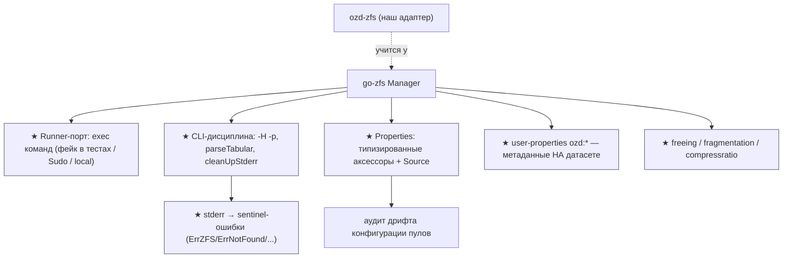
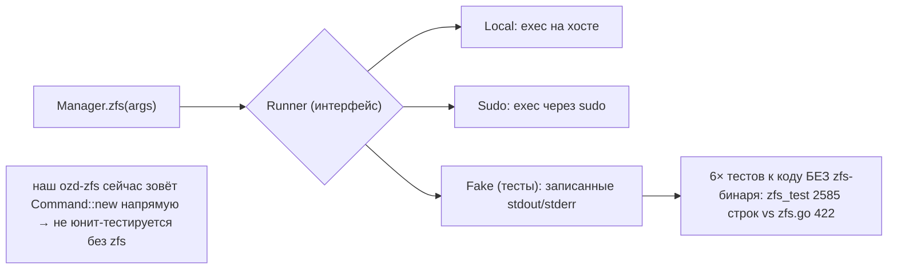
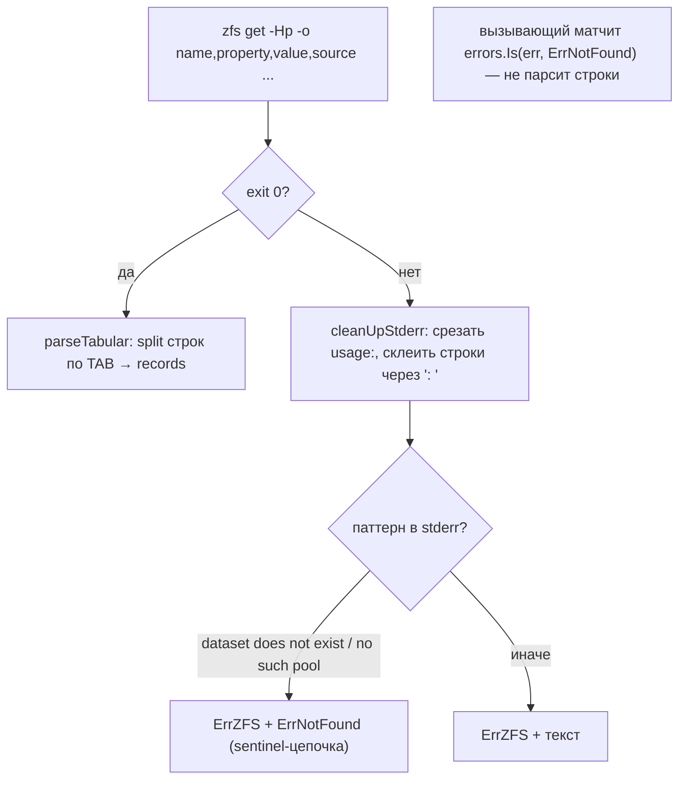
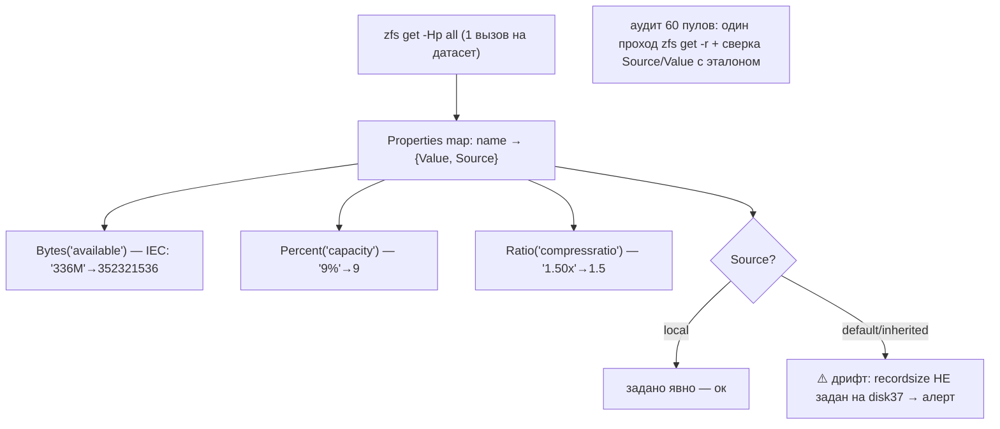
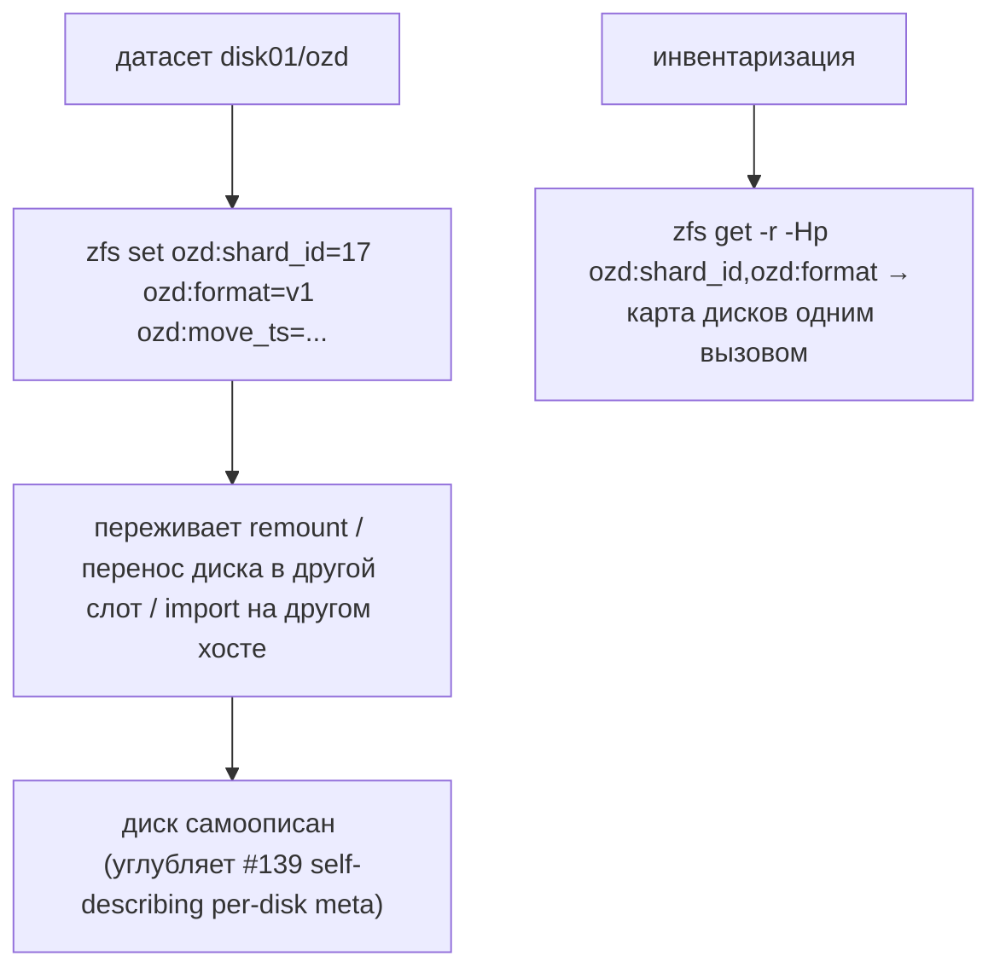
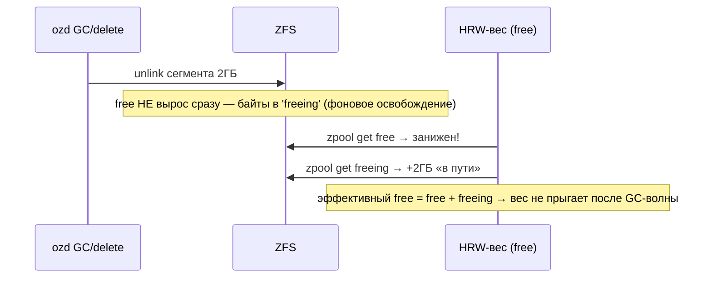
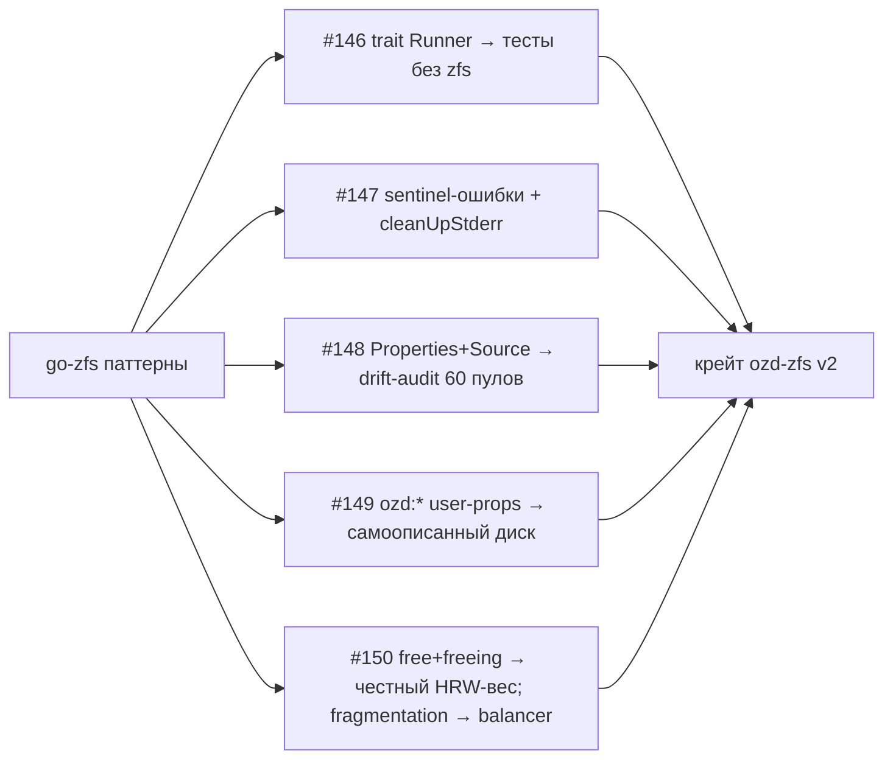

# go-zfs (krystal) — как обвязывать ZFS для HDD/SSD-операций (DDD-разбор исходников)

> Исследование исходников **krystal/go-zfs** (`Vendor/go-zfs`, свежий слой, commit `83341be` от
> 2022-05-31). Это **не storage-движок, а библиотека-обвязка** `zfs`/`zpool` CLI на Go (16 файлов,
> ~9.7K строк, из них **76% — тесты**). Ценность для нас прицельная: мы только что написали крейт
> **`ozd-zfs`** (GO-MIGRATION P1) — go-zfs показывает, как такой адаптер делать **правильно**.

Профиль библиотеки: `Manager` + подключаемый `Runner` (исполнение команд), машиночитаемая дисциплина
CLI (`-H -p`), типизированный слой `Properties` с **Source**-трекингом, таксономия ошибок через
sentinel-цепочки, каталоги констант свойств (`zfsprops`/`zpoolprops`). Берём:

1. **★ Подключаемый command-runner** — все `zfs`/`zpool` уходят через интерфейс `Runner` → юнит-тесты
   адаптера **без бинаря zfs** (фейк-раннер; тестов в 6× больше кода!) + вариант `Sudo`.
2. **★ Машиночитаемая дисциплина CLI + таксономия ошибок** — всегда `-H` (таб-разделение, без шапок)
   и `-p` (точные числа); `cleanUpStderr` (срезать `usage:`, склеить строки); **маппинг stderr →
   типизированные ошибки** (`dataset does not exist` → `ErrNotFound`) через sentinel-цепочку.
3. **★ Типизированный Property-слой с Source** — аксессоры `Bytes/Percent/Ratio/Bool/Time/Uint64`
   (+нормализация IEC-суффиксов ZFS) и **`Source`** (local/default/inherited) у каждого свойства →
   **аудит дрифта конфигурации 60 пулов** (recordsize сбит? compression унаследован, а не задан?).
4. **★ ZFS user-properties как метаданные диска** — `module:property` (до 8192 байт, наследуются,
   живут В САМОМ датасете): `ozd:shard_id`, `ozd:format_version`, `ozd:move_ts` → **диск самоописан
   на уровне ФС** (углубляет #139), переживает remount/перестановку; инвентаризация = `zfs get -r ozd:*`.
5. **★ Недоиспользованные zpool/zfs-метрики** — **`freeing`** (место после массового delete
   освобождается АСИНХРОННО → вес HRW должен видеть «будущий free»), **`fragmentation`** (вход
   disk-balancer/major-GC), `leaked`, `logicalused`/`compressratio` (реальная экономия lz4 на телах).

> Контекст: библиотека минимальная (нет snapshot/send/receive — для них см. ClickHouse hardlink-freeze
> #117 и наш DFS-бэкап); `CreatePoolOptions` поддерживает **`-O` filesystem-properties при создании
> пула** (атомарный провижининг свойств датасета — без двухшагового `zpool create` + `zfs set`) —
> мелочь в копилку деплоя (KUBO-INTEGRATION).

---

## 1. Bounded Contexts



| Контекст | Ответственность | Файлы |
|---|---|---|
| **Manager/Runner** | exec zfs/zpool через порт | `manager.go` (+krystal/go-runner) |
| **CLI-парсинг** | `-H -p`, parseTabular, stderr-гигиена | `manager.go`, `properties.go` |
| **Properties** | типизированные аксессоры + Source | `properties.go` |
| **Dataset/Pool** | геттеры на каждое свойство | `dataset.go`, `pool.go` |
| **Каталог свойств** | константы native+user props | `zfsprops/`, `zpoolprops/` |

---

## 2. Архитектурные диаграммы (Mermaid)

### Gz1. Runner-порт: тестируемость subprocess-адаптера (★)



### Gz2. Дисциплина вызова + таксономия ошибок (★)



### Gz3. Property-слой: типы + Source → дрифт-аудит (★)



### Gz4. User-properties: метаданные живут НА диске (★)



### Gz5. freeing: асинхронное освобождение места → честный HRW-вес (★)



---

## 3. Ubiquitous Language (термины go-zfs → наши)

| Термин | Значение | Наш аналог |
|---|---|---|
| **Manager + Runner** | exec-порт для CLI | **★ #146** trait Runner в ozd-zfs |
| **-H -p** | tab-delimited + точные числа | уже используем (валидация) |
| **cleanUpStderr + sentinels** | stderr → типизированные ошибки | **★ #147** (сейчас — строка) |
| **Properties + Source** | типизированный слой + источник значения | **★ #148** дрифт-аудит |
| **user properties `module:prop`** | произвольные метаданные на датасете | **★ #149** ozd:* на дисках |
| **freeing / fragmentation / leaked** | async-освобождение / фрагментация | **★ #150** в вес HRW / balancer |
| **compressratio / logicalused** | экономия сжатия | метрика эффективности lz4 |
| **`-O` при zpool create** | свойства ФС атомарно при создании | деплой-заметка |

---

## 4. Что берём (★) и почему — кратко

| # | Идея | Откуда | Зачем нам |
|---|---|---|---|
| **146** | Подключаемый command-runner (порт exec) + Sudo-вариант | `manager.go`+go-runner | юнит-тесты ozd-zfs без zfs-бинаря (фикстуры stdout/stderr); CI без ZFS |
| **147** | CLI-дисциплина: `-H -p` всюду + cleanUpStderr + **stderr→типизированные ошибки** | `manager.go`, `zfs.go:27-29` | `errors.Is(NotFound)` вместо парсинга строк вызывающим; чистые логи |
| **148** | Типизированный Property-слой + **Source-трекинг** → дрифт-аудит конфигурации | `properties.go` | one-shot аудит 60 пулов: recordsize/compression/atime заданы ли локально и правильно |
| **149** | **ZFS user-properties `ozd:*` как метаданные диска** (shard_id/format/move_ts на датасете) | `zfsprops` (user props) | диск самоописан на уровне ФС → углубляет #139; инвентаризация одним `zfs get -r` |
| **150** | Метрики `freeing`/`fragmentation`/`leaked` + `compressratio`/`logicalused` | `pool.go:59-108`, `dataset.go` | **freeing → эффективный free = free+freeing** (вес HRW не прыгает после GC-волны); fragmentation → balancer/major-GC; compressratio → выгода lz4 |

---

## 5. Конвергенция (go-zfs ≈ наш ozd-zfs — валидация выбора)

- **Обвязка CLI subprocess'ом** (не libzfs-биндинги!) — тот же выбор, что наш ozd-zfs и Go-слой
  OpenZFS-main: стабильный интерфейс, простой аудит. go-zfs это подтверждает третьим источником.
- **`-Hp` parseable-вывод** — уже в ozd-zfs (`zfs get -Hp used,available`).
- **Типизированные state-геттеры Pool** (Health/Free/Size) = наш `PoolHealth`/`Capacity`.
- Snapshot/send/receive в библиотеке НЕТ — наш бэкап-стек (hardlink-freeze #117 / DFS #76 /
  инкрементальный #107) этим не задевается.
- `-O` filesystem-props при `zpool create` → дополнение к KUBO-INTEGRATION (атомарный провижининг).

---

## 9-bis. Снипеты кода (реальные выдержки + объяснение)

### GZ1. Runner-порт: всё через интерфейс (#146)

`manager.go:24-44`:

```go
// A runner.Runner is used to execute all commands. You can use a custom runner
// to modify the behavior of the executed commands. The runner package for
// example provides a "Sudo" runner struct that executes all commands via sudo.
type Manager struct {
    Runner runner.Runner
}
func New() *Manager {
    return &Manager{ Runner: runner.New() }
}
```

**Зачем нам:** в `ozd-zfs` сейчас `Command::new("zpool")` напрямую → юнит-тесты требуют zfs-бинарь.
Trait `Runner { fn run(cmd, args) -> (stdout, stderr, status) }` + фейк на фикстурах → парсеры и
команды тестируются в CI без ZFS (у go-zfs тестов в 6× больше кода).

### GZ2. Вызов + маппинг stderr в типизированные ошибки (#147)

`zfs.go:38-56` + `zfs.go:27-29`:

```go
var (
    datasetDoesNotExistText = []byte("dataset does not exist")
    parentDoesNotExistText  = []byte("parent does not exist")
    noSuchPoolText          = []byte("no such pool")
)
func (m *Manager) zfs(ctx context.Context, args ...string) ([][]string, error) {
    err := m.Runner.RunContext(ctx, nil, &stdout, &stderr, "zfs", args...)
    if err != nil {
        cleanStderr := cleanUpStderr(stderr.Bytes())
        errs := ErrZFS
        if notFoundErr(cleanStderr) {
            errs = multierr.Append(errs, ErrNotFound)   // sentinel-цепочка
        }
        return nil, multierr.Append(errs, fmt.Errorf("%w: %s", err, cleanStderr))
    }
    return parseTabular(stdout.Bytes()), nil
}
```

И `cleanUpStderr` (`manager.go:53-76`): срезать всё после `\nusage:\n`, убрать пустые строки,
склеить через `": "`. **Зачем:** вызывающий делает `errors.Is(err, ErrNotFound)` — никто выше по
стеку не парсит тексты zfs; логи компактны.

### GZ3. Типизированные аксессоры + IEC-нормализация (#148)

`properties.go:167-180, 287-296`:

```go
func (p Properties) Bytes(property string) (uint64, bool) {
    if prop, ok := p[property]; ok && prop.Value != "-" {
        if r, err := p.parseSize(prop.Value); err == nil {
            return r, true
        }
    }
    return 0, false
}
var zfsIECSizeRegexp = regexp.MustCompile(`^([0-9]+)\s*([a-zA-Z])$`)
func (p Properties) parseSize(size string) (uint64, error) {
    s := strings.TrimSpace(size)
    if zfsIECSizeRegexp.MatchString(s) {
        s += "iB"          // ZFS "336M" = MiB → нормализуем для парсера
    }
    return humanize.ParseBytes(s)
}
```

Плюс `Percent` (срез `%`), `Ratio` (срез `x` у `compressratio`), `Bool` (`on/enabled`), `Time`
(unix ИЛИ `Mon Jan _2 15:04 2006`). Каждое `Property` несёт **`Source`** (`local`/`default`/
`inherited from ...`). **Зачем:** Source = бесплатный **дрифт-аудит**: `recordsize` с
`source=default` на боевом пуле — значит наш тюнинг не применён.

### GZ4. Pool-геттеры: freeing/fragmentation/leaked (#150)

`pool.go:63-105`:

```go
// Freeing returns the value of the "freeing" property as number of bytes.
func (p *Pool) Freeing() (uint64, bool) { return p.Bytes(zpoolprops.Freeing) }
// Leaked returns the value of the "leaked" property as number of bytes.
func (p *Pool) Leaked() (uint64, bool) { return p.Bytes(zpoolprops.Leaked) }
// Fragmentation returns the value of the "fragmentation" property ...
func (p *Pool) Fragmentation() (uint64, bool) { return p.Percent(zpoolprops.Fragmentation) }
```

**Зачем нам:** после GC-волны (unlink 2ГБ-сегментов) ZFS освобождает место **асинхронно** — байты
видны в `freeing`, а `free` временно занижен → **эффективный free для HRW = free + freeing**, иначе
веса прыгают и balancer гоняет блоки зря. `fragmentation` — вход для решения о major-GC/balancer.

### GZ5. User-properties: метаданные на датасете (#149)

`zfsprops/zfsprops.go` (док + helpers вида `UserQuota(user)`):

```go
// User property names must contain a colon (":") ... The expected convention
// is that the property name is divided into two portions such as
// module:property ... values are arbitrary strings, are always inherited ...
// Property values are limited to 8192 bytes.
```

**Зачем нам:** `zfs set ozd:shard_id=17 ozd:format=v1 ozd:move_ts=1765... disk01/ozd` — идентичность
шарда живёт **в самом датасете**: переживает remount, перенос диска в другой слот/хост, `zpool
import`. Инвентаризация 60 дисков = один `zfs get -r -Hp ozd:shard_id` — диск перепутать невозможно.
Прямое углубление #139 (self-describing) на ярус ФС.

### GZ6 (диаграмма). Применение к ozd-zfs



---

## 10. Извлечённые идеи для OpenZFS Daemon

### Конвергенция
- CLI-обвязка subprocess'ом (не libzfs) = наш выбор в ozd-zfs (3-й подтверждающий источник);
  `-Hp`-дисциплина уже у нас; типизированные Pool-геттеры = PoolHealth/Capacity;
  `-O` при `zpool create` → атомарный провижининг (деплой-заметка в KUBO-INTEGRATION).

### Главные новые заимствования
- **#146 ★** Подключаемый command-runner (порт exec, Sudo-вариант) → юнит-тесты ZFS-адаптера без
  бинаря (у go-zfs тестов 6× от кода).
- **#147 ★** CLI-дисциплина + таксономия: cleanUpStderr + маппинг stderr-паттернов в
  sentinel-ошибки (`ErrNotFound`) — `errors.Is` вместо парсинга строк.
- **#148 ★** Типизированный Property-слой (Bytes/Percent/Ratio/Bool/Time, IEC-нормализация) +
  **Source-трекинг** → дрифт-аудит конфигурации 60 пулов одним проходом.
- **#149 ★** ZFS user-properties `ozd:*` (shard_id/format/move_ts) — метаданные В датасете:
  самоописанный диск (углубление #139), инвентаризация одним `zfs get -r`.
- **#150 ★** Метрики `freeing` (**эффективный free = free + freeing** для HRW-весов после
  GC-волн), `fragmentation` (balancer/major-GC), `leaked`, `compressratio`/`logicalused`.

---

## 11. Источники в коде (для перепроверки)

- `manager.go:13-76` — sentinel-ошибки, Manager/Runner, cleanUpStderr
- `zfs.go:27-56` — stderr-паттерны not-found, exec-обёртка, parseTabular-выход
- `zpool.go:24-46,101-190` — zpool-обёртка, CreatePoolOptions (`-o`/`-O`/`-m`/`-R`/Force)
- `properties.go:43-318` — parseTabular, Property{Value,Source}, Bytes/Percent/Ratio/Bool/Time,
  zfsIECSizeRegexp + parseSize/parseBool/parseTime
- `dataset.go:31-230` — Dataset-геттеры (LogicalUsed, UsedBySnapshots, CompressRatio…)
- `pool.go:16-108` — Pool-геттеры (Allocated/Free/**Freeing**/**Leaked**/Size/Capacity/
  **Fragmentation**/Health)
- `zfsprops/zfsprops.go`, `zpoolprops/zpoolprops.go` — каталоги констант, user-properties
- Тесты: `zfs_test.go` (2585), `zpool_test.go` (2136) — фейк-Runner-паттерн

---

*Связано: [STORAGE-IDEAS-SYNTHESIS.md](STORAGE-IDEAS-SYNTHESIS.md), docs/GO-MIGRATION.md (P1 ozd-zfs),
docs/KUBO-INTEGRATION.md (ZFS-тюнинг), [rustfs (self-describing meta #139)](rustfs-storage-hdd-ssd.md),
[qdrant (TTL-кэш free #137)](qdrant-storage-hdd-ssd.md).*
