# Hadoop HDFS Storage — как HDFS работает с HDD/SSD (DDD-разбор исходников)

> Исследование исходников **apache/hadoop** (`Vendor/hadoop`, свежий слой, commit `ea0cb52c` от
> 2026-06-08). Все факты — с ссылками `файл:строка`, проверены в коде.

HDFS — распределённая ФС (Java): **NameNode** (метаданные/каталог) + **DataNode** (блоки на диске).
Для нас ценен **DataNode** — это **прямой аналог нашего сервера**: один узел с **многими дисками
(volumes)**, реплицированные блоки, выбор диска под запись, scrub, балансировка дисков, толерантность
к отказу диска. По сути «DataNode с 60 дисками» = наш деплой. Главное — **валидация** наших решений +
несколько операционных приёмов:

1. **★ Tolerated-failed-volumes + live hot-swap** — DataNode продолжает работать при N мёртвых дисках
   (`dfs.datanode.failed.volumes.tolerated`); диск можно **добавить/убрать вживую** без рестарта.
2. **★ Intra-node disk-balancer** — выровнять заполнение дисков **внутри узла**: offline-план +
   **hardlink zero-copy move** + лимит bandwidth.
3. **★ Block/Volume-scanner** (=наш scrub) — троттлинг байт/с на диск, период ~21 день,
   **приоритизация suspect-блоков**, cursor-checkpoint (возобновляемый), skip недавно прочитанных.
4. **Storage-types + lazy-persist** (RAM_DISK/SSD/DISK/ARCHIVE → тиринг; RAM→async-persist на диск).

> **Ключевой контраст:** HDFS централизует размещение/учёт в **NameNode** (rack-aware placement,
> block-reports, balancer-guidance). У нас **центрального каталога НЕТ** — детерминированный HRW +
> локальные индексы. HDFS подтверждает остальной дизайн (много дисков, scrub, degraded, тиринг), а
> NameNode — ровно то, чего мы избегаем. И его **directory-hashing** (файл-на-блок в дереве subdir)
> — проблема, которую наши **pack-сегменты** обходят целиком.

---

## 1. Bounded Contexts

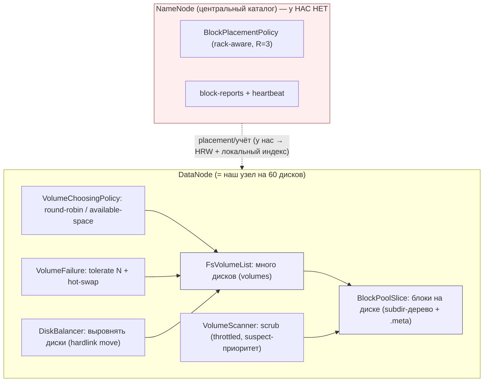

| Контекст | Ответственность | Файлы |
|---|---|---|
| **FsVolumeList / Impl** | набор дисков узла, usage, reserved | `datanode/fsdataset/impl/FsVolume{List,Impl}.java` |
| **VolumeChoosingPolicy** | выбор диска под новый блок | `fsdataset/{RoundRobin,AvailableSpace}VolumeChoosingPolicy.java` |
| **BlockPoolSlice** | раскладка блоков на диске (subdir + .meta) | `fsdataset/impl/BlockPoolSlice.java`, `datanode/DatanodeUtil.java` |
| **VolumeScanner** | scrub: re-read + проверка checksum | `datanode/{Block,Volume}Scanner.java` |
| **VolumeFailure / hot-swap** | tolerate N отказов, live add/remove | `fsdataset/impl/FsVolumeList.java`, `VolumeFailureInfo.java` |
| **DiskBalancer** | межд-дисковая балансировка узла | `datanode/DiskBalancer.java` |
| **BlockPlacementPolicy** | (NameNode) rack-aware размещение — **контраст** | `blockmanagement/BlockPlacementPolicy*.java` |

---

## 2. Архитектурные диаграммы (Mermaid)

### Hd1. Выбор диска под запись (volume-choosing) ≈ наш HRW

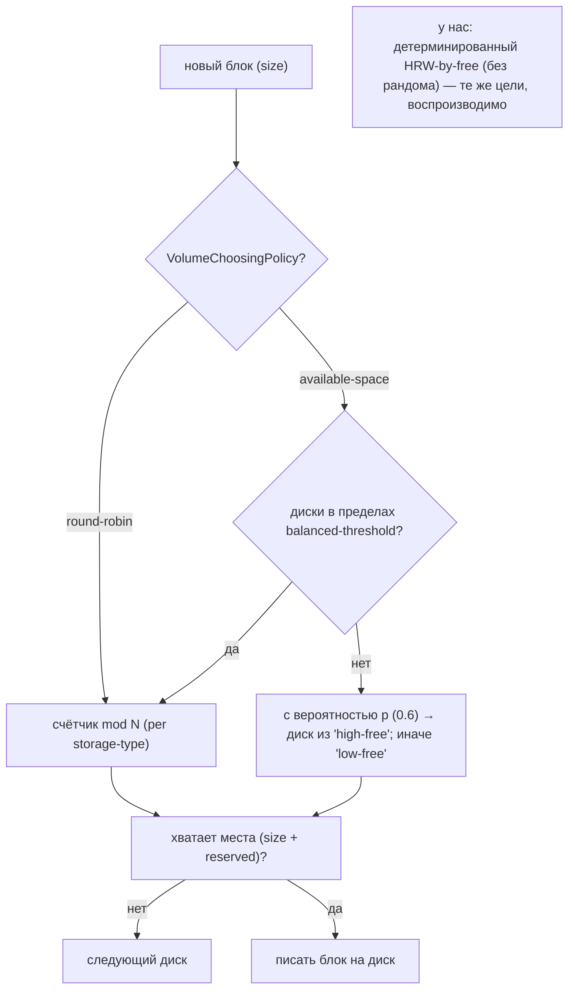

### Hd2. Tolerated-failed-volumes + live hot-swap

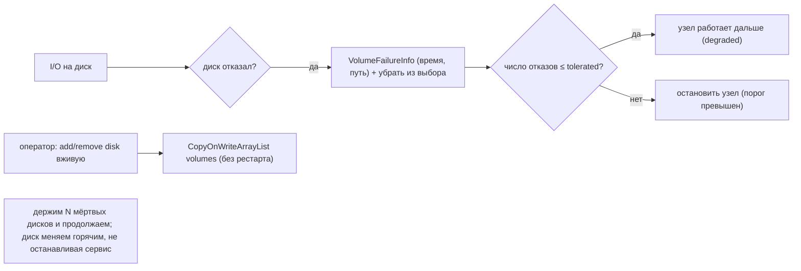

### Hd3. Block/Volume-scanner (= наш scrub) с троттлингом

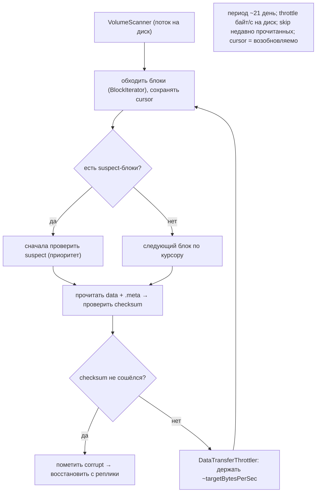

### Hd4. Intra-node disk-balancer (выровнять диски)

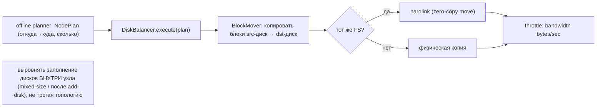

### Hd5. Storage-types + lazy-persist (тиринг)

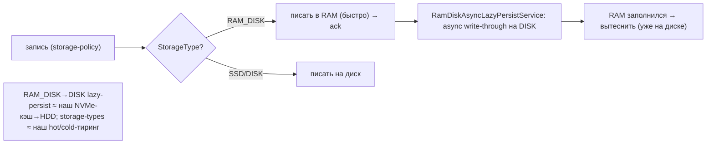

---

## 2-bis. Файловая система: раскладка и потоки (Mermaid)

> DataNode: каждый диск (volume) = каталог; блоки — **файл-на-блок** в дереве `subdir` + **.meta**
> (checksum-сайдкар). Это контраст нашим pack-сегментам (мы файл-на-блок НЕ делаем).

### FS1. Реальная раскладка на диске (DataNode volume)

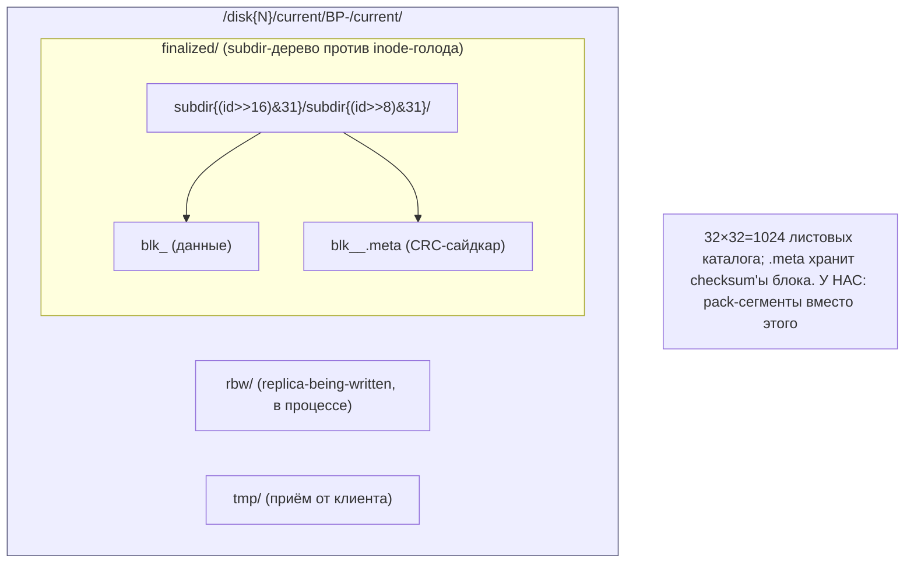

### FS2. Жизненный цикл реплики: tmp/rbw → finalized

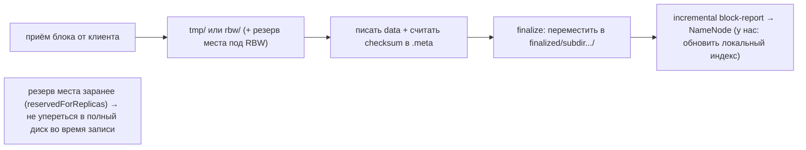

### FS3. Выбор диска + резерв места

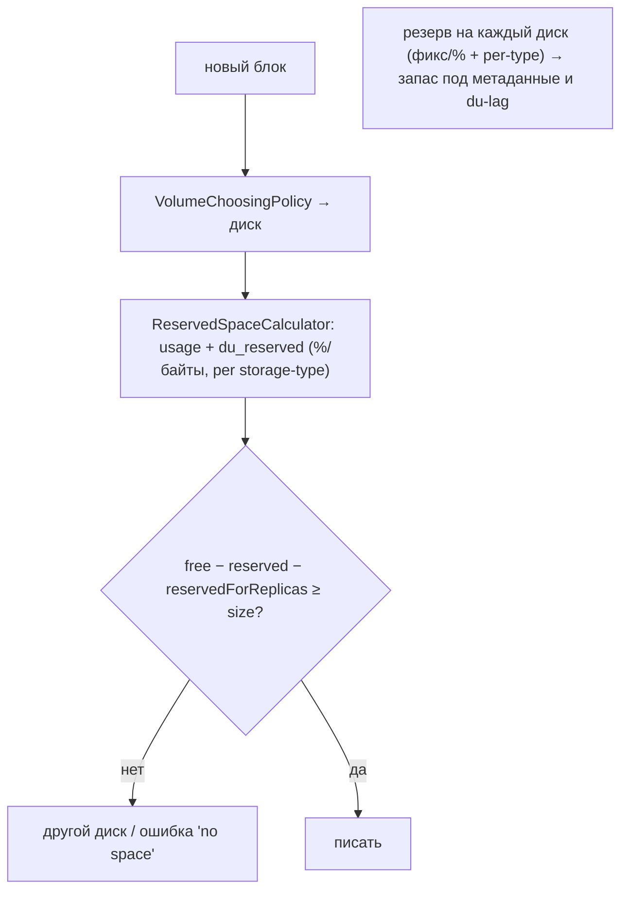

### FS4. Scrub-курсор и возобновление

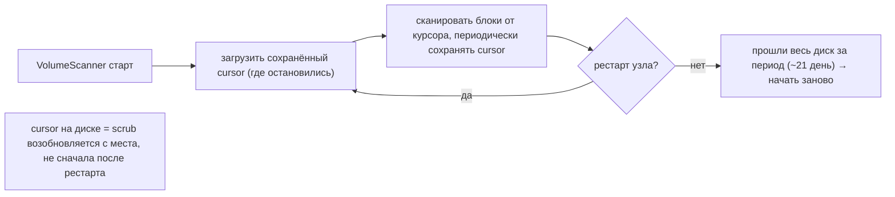

---

## 3. Ubiquitous Language (термины HDFS)

| Термин HDFS | Значение | Наш аналог |
|---|---|---|
| **DataNode** | узел с дисками, хранит блоки | наш сервер (60 HDD) |
| **volume** | один физический диск узла | shard / диск |
| **VolumeChoosingPolicy** | выбор диска под блок | HRW-by-free / selector |
| **BlockPoolSlice** | блоки block-pool на одном диске | per-disk набор сегментов |
| **.meta (checksum sidecar)** | CRC-файл рядом с блоком | per-micro checksum (#34) |
| **subdir-дерево** | хэш-каталоги (против inode-голода) | ⟵ pack-сегменты (мы избегаем) |
| **VolumeScanner** | scrub: re-read + verify | ScrubService |
| **failed.volumes.tolerated** | сколько мёртвых дисков терпим | degraded start + Faulted |
| **DiskBalancer** | балансировка дисков узла | rebalance-on-add-disk |
| **StorageType / lazy-persist** | RAM/SSD/DISK тиринг | NVMe-кэш / cold_path |
| **NameNode** | центральный каталог — **контраст** | (у нас нет — HRW) |
| **block-report** | инвентарь блоков → NameNode | walk локального индекса |

---

## 4. DataNode: много дисков, выбор и резерв

`FsVolumeList` — `CopyOnWriteArrayList<FsVolumeImpl>` (по диску, `FsVolumeList.java:55`). У `FsVolumeImpl`
(`:103-207`): `storageID`, `storageType`, `usage` (DF), `reservedForReplicas` (атомарный резерв под
RBW). **VolumeChoosingPolicy**: round-robin (счётчик mod N per-type, `RoundRobinVolumeChoosingPolicy.java:79`)
или **available-space** (`AvailableSpaceVolumeChoosingPolicy.java:115`): если все в пределах
`balancedSpaceThreshold` → round-robin, иначе с вероятностью `balancedPreferencePercent` (≈0.6) брать
из «high-free». **ReservedSpaceCalculator** (`:37`): резерв `du_reserved` (байты/% , per storage-type).

> Для нас: это **валидация** HRW-by-free (#2): HDFS делает то же вероятностно/round-robin'ом, мы —
> **детерминированно** (воспроизводимо, без рандома). Резерв места per-disk у нас уже есть
> (Druid `max_size` + free-резерв, #56). Subdir-дерево для файла-на-блок нам **не нужно** — pack-сегменты.

---

## 5. Tolerated-failed-volumes + live hot-swap

`dfs.datanode.failed.volumes.tolerated` — узел продолжает работать при ≤N мёртвых дисках; отказ диска
→ `VolumeFailureInfo` (время, путь, `FsVolumeList.java:59`) + диск убирается из выбора (`:106-129`).
Превышение порога → останов узла. **Hot-swap**: диск можно добавить/убрать **вживую** (CopyOnWriteArrayList
переживает изменение под чтениями) без рестарта.

> Для нас: уточняет наш degraded-start + `Faulted` (#26). Берём: **конфиг `failed_disks_tolerated`**
> (сколько одновременно мёртвых дисков терпим, прежде чем алертить/останавливать приём) и **live
> add/remove диска** без рестарта демона (горячая замена на 60-дисковом узле — частая операция).

---

## 6. Block/Volume-scanner = наш scrub (с приёмами)

`VolumeScanner` (поток на диск, `VolumeScanner.java:56`): обходит блоки (`BlockIterator`), читает
`data + .meta`, проверяет checksum, corrupt → репорт + восстановление с реплики. Приёмы:
- **Throttle** `targetBytesPerSec` (`DataTransferThrottler`) — ~1МБ/с на диск дефолт; скользящее окно
  «просканировано байт» (60-мин буфер).
- **Период** ~21 день (`DFS_DATANODE_SCAN_PERIOD_HOURS`, дефолт 504ч) — каждый блок проверяется ~раз/месяц.
- **Suspect-приоритизация**: блоки с подозрением (CRC-warn, latency) — в `suspectBlocks`, проверяются
  первыми; `recentSuspectBlocks` (TTL 10мин) — не пересканировать.
- **Cursor-checkpoint** (`cursorSaveMs`) — позиция сохраняется → scrub **возобновляется** после рестарта.
- **skip-recently-accessed** — недавно прочитанные не сканировать (уже «горячие»/проверенные).

> Для нас: у нас Scrub уже есть (#... ScrubService), HDFS **уточняет** его 4 приёмами: throttle
> байт/с на диск (под Forseti), приоритет suspect-блоков, **сохраняемый курсор** (возобновляемый scrub
> на 3,8 млрд), skip-recently-read.

## 7. DiskBalancer, storage-types, short-circuit read

**DiskBalancer** (`DiskBalancer.java:75`) — балансировка **между дисками одного узла**: offline-planner
строит `NodePlan` (src→dst, объём), `BlockMover` копирует блоки с лимитом `bandwidth`; в пределах одного
FS — **hardlink** (zero-copy move). **StorageType** (RAM_DISK/SSD/DISK/ARCHIVE/NVDIMM) + **lazy-persist**
(`RamDiskAsyncLazyPersistService.java:49`): писать в RAM_DISK → async write-through на DISK → вытеснять
при заполнении. **Short-circuit local read** (`ShortCircuitRegistry.java:83`): локальный клиент читает
блок **по fd / через shared-memory**, минуя TCP DataNode; mlocked-блоки «anchorable» → можно zero-copy
без перепроверки checksum.

> Для нас: **DiskBalancer** ⟷ наш rebalance при add-disk/mixed-size — берём **offline-план + bandwidth
> cap** (а hardlink-move у нас работает в пределах диска; между дисками — обычная копия + проверка).
> storage-types/lazy-persist ⟷ NVMe-кэш→HDD (#23/#74). Short-circuit ⟷ наш локальный read (mmap),
> «skip re-checksum для уже проверенного/mlocked» — точечная оптимизация.

---

## 8. Контраст: NameNode-каталог vs наш no-catalog

HDFS-NameNode централизует: **placement** (rack-aware, `BlockPlacementPolicyDefault.java:61`),
**block-reports** (DataNode шлёт инвентарь блоков, `IncrementalBlockReportManager.java:47`), guidance
балансировщику. Это узкое место и точка отказа на масштабе. У нас (см. ADR/ARCHITECTURE §2.3):
**центрального каталога НЕТ** — детерминированный HRW `placement(cid,R)` + локальные индексы дисков;
«где блок» = опрос R кандидатов; инвентарь = **walk локального индекса** (не block-reports на NameNode).
HDFS **подтверждает** остальное (много дисков, scrub, degraded, тиринг, балансировка), а его центральный
слой — ровно то, что мы заменяем детерминизмом.

> **Counter-lesson (directory-hashing):** HDFS вынужден раскидывать **файл-на-блок** по дереву
> `subdir` (32×32), чтобы не упереться в inode-голод. На 3,8 млрд блоков это была бы боль — наши
> **pack-сегменты** (TON/geth) убирают проблему в корне (нет файла-на-блок). HDFS валидирует выбор.

---

## 9. Философия и вывод XFS/ZFS

DataNode = «JBOD + app-репликация», что **ровно наш ADR 0001** (XFS на диск, app владеет
избыточностью). HDFS НЕ кладёт ZFS под DataNode — каждый диск отдельная ФС, отказ одного не рушит
остальные (tolerated-volumes). Это прямое подтверждение «XFS+JBOD, не ZFS-пул». Резерв места,
throttled scrub, per-disk usage — стандартная гигиена для много-дисковых узлов.

---

## 9-bis. Снипеты кода (реальные выдержки + объяснение)

### CS1. Tolerated-failed-volumes: убрать диск, работать дальше (#100)

```java
// …/datanode/fsdataset/impl/FsVolumeList.java:307 — handleVolumeFailures()
for (FsVolumeSpi vol : failedVolumes) {
    FsVolumeImpl fsv = (FsVolumeImpl) vol;
    try (FsVolumeReference ref = fsv.obtainReference()) {
        addVolumeFailureInfo(fsv);
        removeVolume(fsv);                 // убрать мёртвый диск из выбора, узел продолжает работать
    } catch (ClosedChannelException e) { ... }
}
```

**Объяснение:** мёртвые диски убираются из live-списка под локом; узел в degraded, не падает. → наш
**tolerated-failed-volumes + hot-swap (#100)**.

### CS2. Scrub: throttle + сохраняемый курсор (#102)

```java
// …/datanode/VolumeScanner.java:447
throttler.setBandwidth(bytesPerSec);                    // лимит байт/с на диск
long bytesRead = blockSender.sendBlock(nullStream, null, throttler);
// :583
if (saveDelta >= conf.cursorSaveMs) saveBlockIterator(curBlockIter);   // сохранить позицию обхода
```

**Объяснение:** scan под `DataTransferThrottler` + периодическое сохранение курсора. → наш **scrub:
throttle байт/с + cursor-checkpoint (возобновляемо) (#102)**.

### CS3. Disk-balancer: задержка под bandwidth-кап (#101)

```java
// …/datanode/DiskBalancer.java:914 — computeDelay()
long bytesInMB = bytesCopied / megaByte;
float bandwidth = getDiskBandwidth(item) / 1000f;
float delay = ((long)(bytesInMB / bandwidth) - timeUsed);   // token-bucket: спать, чтобы держать MB/s
return (delay <= 0) ? 0 : (long) delay;
```

**Объяснение:** перенос блоков между дисками с лимитом bandwidth (token-bucket задержка). → наш
**intra-node disk-balancer + bandwidth cap (#101)**.

---

## 10. Извлечённые идеи для OpenZFS Daemon

| # | Идея | Где у HDFS | Берём? | Фаза | Влияние |
|---|---|---|---|---|---|
| 100 | **★ Tolerated-failed-volumes + live hot-swap диска** | `FsVolumeList.java`, `VolumeFailureInfo.java` | ✅ да | **3/5** | держать N мёртвых дисков и работать; горячая add/remove без рестарта (частая опер. на 60 HDD) |
| 101 | **★ Intra-node disk-balancer** (offline-план + bandwidth cap; hardlink в пределах диска) | `datanode/DiskBalancer.java` | ✅ да | **5** | выровнять заполнение дисков (mixed-size / после add-disk), отдельно от topology-resilver |
| 102 | **★ Scrub-приёмы: throttle байт/с + suspect-приоритет + cursor-checkpoint + skip-recent** | `Volume/BlockScanner.java` | ✅ да | **5** | уточняет ScrubService: возобновляемый scrub на 3,8 млрд, приоритет подозрительных |
| 103 | **Short-circuit local read** (fd/mmap, skip re-checksum для mlocked-anchorable) | `ShortCircuitRegistry.java` | ⚠️ опц. | **4** | локальное zero-copy чтение без лишней перепроверки уже верифицированного |

### Конвергенция (подтверждает уже принятое, не новые строки)
- **VolumeChoosingPolicy (round-robin / available-space)** ⟷ HRW-by-free (#2) + selector (Druid) — HDFS делает то же вероятностно, мы детерминированно.
- **block-placement rack-aware** ⟷ failure domains realm/domain (#43); NameNode-central — **контраст** с нашим no-catalog.
- **VolumeScanner** ⟷ наш Scrub; **reserved space** ⟷ Druid max_size+free-резерв (#56).
- **storage-types + lazy-persist** ⟷ NVMe-кэш→HDD (#23) + cooling (#74) + температурный тиринг.
- **.meta checksum-сайдкар** ⟷ per-micro checksum (#34); verify-on-read.
- **JBOD + app-репликация, не ZFS** ⟷ **прямое подтверждение ADR 0001**.
- **directory-hashing (файл-на-блок в subdir-дереве)** ⟷ **counter-lesson**: наши pack-сегменты убирают проблему.
- **★ большие блоки 128/256 МБ + sequential append-в-конец (RBW→finalized, append() переоткрывает последний блок)** ⟷ **прямая валидация pack-сегментов** (≤2 ГБ, append в активный сегмент, `active→sealed`, переоткрытие по `flushOffset`). См. §10-bis.
- **NameNode block-reports** ⟷ контраст: у нас walk локального индекса, без центрального учёта.

### Главные новые заимствования
**#100 tolerated-volumes + hot-swap** и **#102 scrub-приёмы** (cursor/suspect/throttle) — операционно
важны на 60 HDD. **#101 disk-balancer** — выравнивание дисков отдельно от resilver. #103 short-circuit
— опц. HDFS в целом — лучшая **валидация** всего нашего дизайна (DataNode = наш узел).

---

## 10-bis. Большие блоки (128/256 МБ) + sequential append — валидация pack-сегментов

> Отдельно: HDFS пишет **большими блоками** и **дописывает в конец** — это прямая валидация нашей
> модели append-only pack-сегментов. (Я это упустил в первом проходе — добавляю.)

**Что делает HDFS.** Файл режется на **крупные блоки** `DFS_BLOCK_SIZE_DEFAULT = 128 МБ`
(`HdfsClientConfigKeys.java:32`; в проде часто **256 МБ**). Внутри блока данные пишутся **строго
последовательно** (chunk → packet → block-файл, `DFSOutputStream.writeChunk`/`enqueueCurrentPacket`).
Запись идёт **append-ом в конец**: на DataNode блок в стадии **RBW** (replica-being-written), стадии
pipeline `PIPELINE_SETUP_APPEND → DATA_STREAMING` (`DataStreamer.java:623,674`); `append()` **переоткрывает
последний (недозаполненный) блок** и продолжает дописывать (`BlockReceiver.java:235` → `datanode.data.append`,
`LocalReplicaInPipeline`). После заполнения/закрытия блок **finalize** (RBW → finalized), стартует
следующий блок.

**Зачем большие блоки (урок для HDD).** (1) Меньше метаданных на NameNode (1 запись на 128/256 МБ, а не
на килобайты); (2) **sequential throughput** на HDD — длинные непрерывные записи/чтения без seek;
(3) меньше файлов/inode. Платой идёт меньшая параллельность по одному файлу — поэтому размер блока
**тюнится** (`dfs.blocksize`).

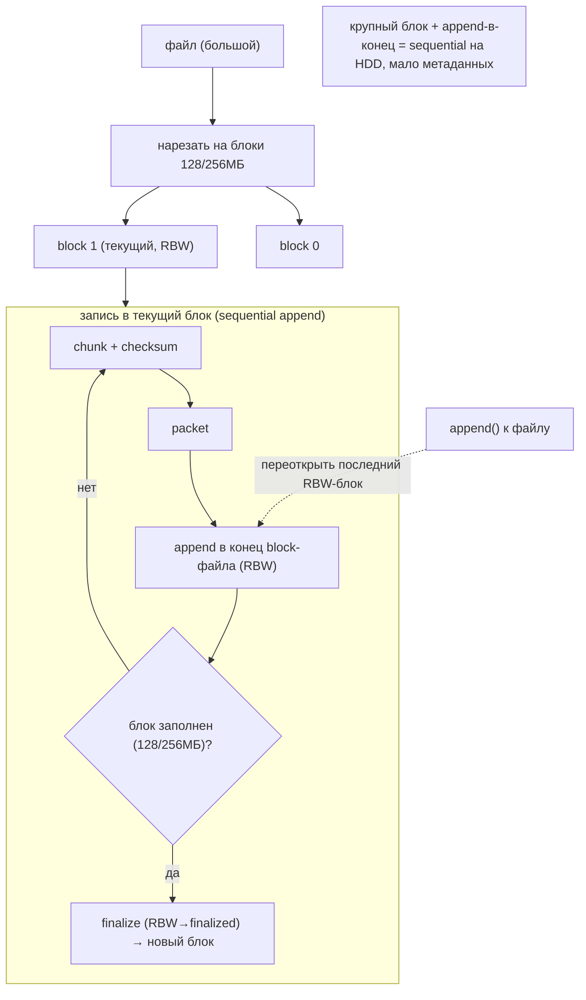

> **Наш аналог (валидация).** HDFS-«блок» (128/256 МБ как **единица sequential-append + размещения**)
> ≈ наш **pack-сегмент** (`segment_max_size ≤ 2 ГБ`); HDFS-«файл из блоков» ≈ наш крупный объект
> (UnixFS = много IPFS-блоков). Соответствия:
> - **append-в-конец активного блока** ⟷ наш **append тел в активный сегмент** (#data-tier).
> - **RBW → finalized** ⟷ наш **active → sealed** сегмент.
> - **append() переоткрывает последний RBW-блок** ⟷ на старте мы **переоткрываем активный сегмент по
>   `flushOffset`** и продолжаем дописывать (crash-recovery).
> - **большой блок ради sequential/мало-метаданных** ⟷ ровно мотивация наших ≤2 ГБ сегментов (вместо
>   файла-на-блок). На 3,8 млрд IPFS-блоков по ~256 КБ мы **пакуем** их в сегменты — то же «крупный
>   контейнер + sequential append», что у HDFS на уровне блока.
>
> Это **конвергенция/валидация**, не новая строка каталога: подтверждает `segment_max_size`,
> append-модель, `flushOffset` и RBW-подобный lifecycle `active|sealed` (манифест #66, vylog-2-фазы #96).

---

## 11. Источники в коде (для перепроверки)

| Область | Файл | Ключевые места |
|---|---|---|
| Раскладка блока / subdir | `…/datanode/DatanodeUtil.java`, `LocalReplica.java` | DatanodeUtil 126-131; LocalReplica 107-119 |
| Набор дисков / volume | `…/fsdataset/impl/FsVolume{List,Impl}.java` | List 54-129; Impl 103-207 |
| Volume-choosing | `…/fsdataset/{RoundRobin,AvailableSpace}VolumeChoosingPolicy.java` | RR 79-129; AS 115-186 |
| Резерв места | `…/fsdataset/impl/ReservedSpaceCalculator.java` | 37-100 |
| Scrub | `…/datanode/{Block,Volume}Scanner.java` | Block 53-150; Volume 56-150 |
| Отказ/hot-swap | `…/fsdataset/impl/FsVolumeList.java`, `VolumeFailureInfo.java` | List 54-129 |
| DiskBalancer | `…/datanode/DiskBalancer.java` | 75-100 |
| Storage-types/lazy | `…/fsdataset/impl/RamDiskAsyncLazyPersistService.java` | 49-100 |
| Placement (NameNode, контраст) | `…/blockmanagement/BlockPlacementPolicyDefault.java` | 61-299 |
| Block-reports (контраст) | `…/datanode/IncrementalBlockReportManager.java` | 47-100 |
| Short-circuit | `…/datanode/ShortCircuitRegistry.java` | 83-100 |
| Большой блок 128МБ | `hadoop-hdfs-client/.../HdfsClientConfigKeys.java` | 32 (`DFS_BLOCK_SIZE_DEFAULT=128*1024*1024`) |
| Append/RBW pipeline | `…-client/.../DataStreamer.java`; `…/datanode/BlockReceiver.java`, `LocalReplicaInPipeline.java` | DataStreamer 623,674; BlockReceiver 235 |
| Sequential write (chunk→packet) | `…-client/.../DFSOutputStream.java` | 442-454 (writeChunk/enqueue) |

---

> **Резюме для проекта.** HDFS — 17-й прототип и лучшая **валидация** дизайна: DataNode-с-многими-дисками
> = наш узел на 60 HDD. Volume-choosing ≈ HRW, scanner ≈ scrub, tolerated-volumes ≈ degraded,
> storage-types/lazy-persist ≈ тиринг, JBOD+app-репликация ≈ ADR 0001. Новое: tolerated-volumes +
> hot-swap (#100), disk-balancer (#101), scrub-приёмы cursor/suspect/throttle (#102), short-circuit
> read (#103). Главный контраст — **NameNode central catalog**, которого у нас осознанно нет (HRW +
> локальный индекс), и **directory-hashing**, которого мы избегаем pack-сегментами. См.
> [STORAGE-IDEAS-SYNTHESIS.md](STORAGE-IDEAS-SYNTHESIS.md), [[druid-storage-hdd-ssd.md]] (selector/лимиты),
> [[ydb-storage-hdd-ssd.md]] (fail-домены/handoff), [Feynman](../../Feynman/README.md).
