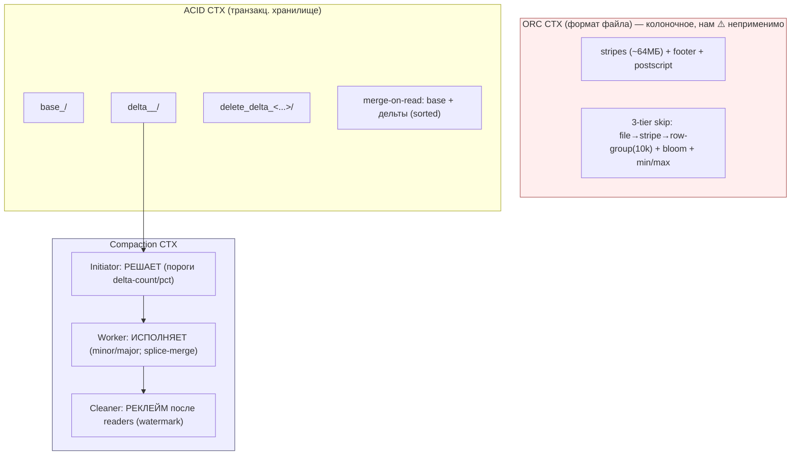
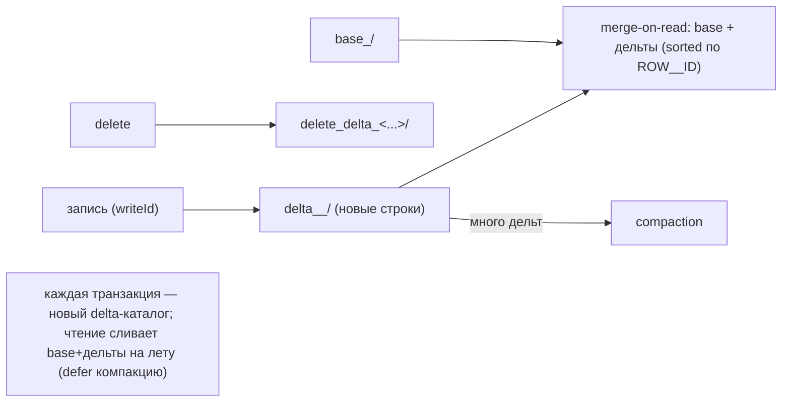
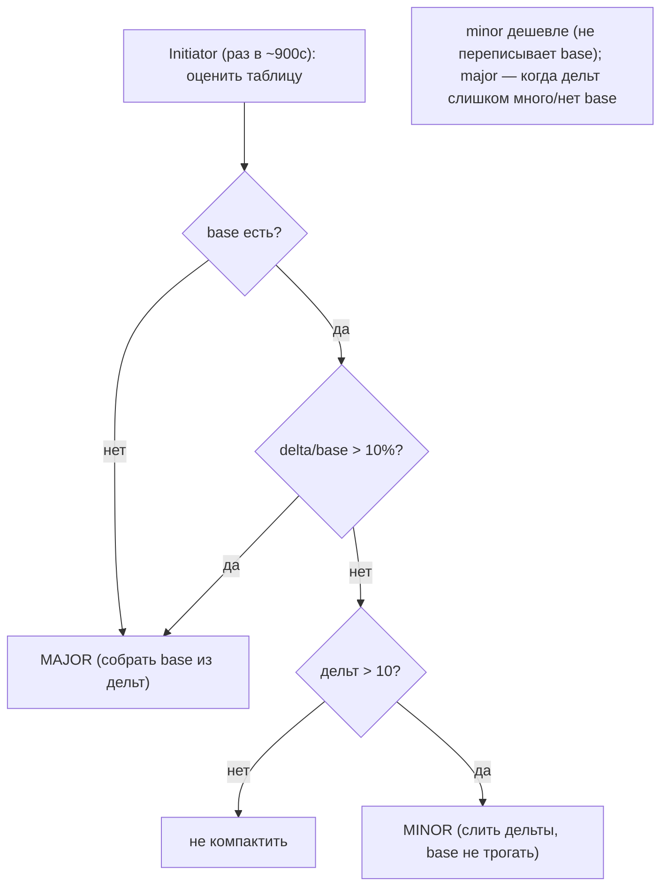
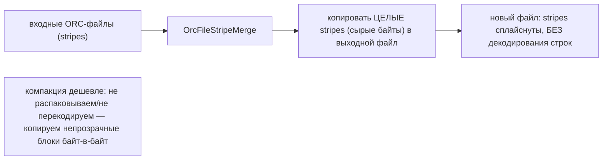
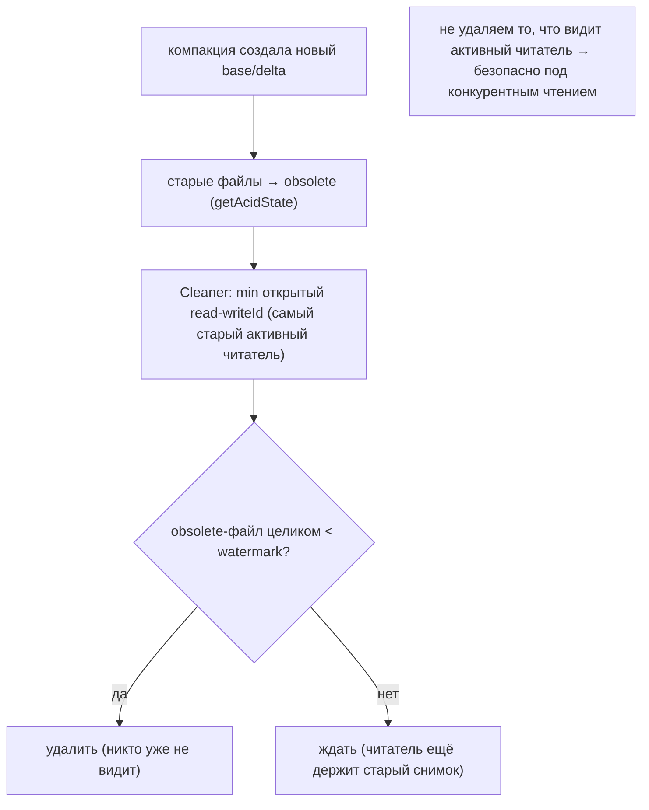
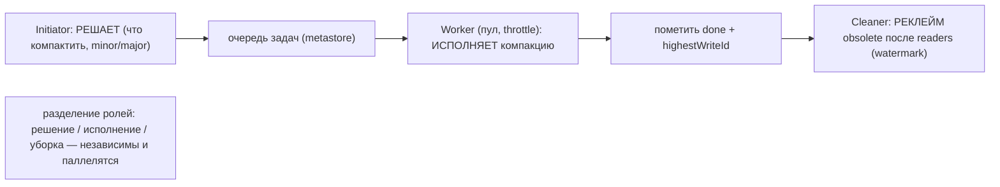
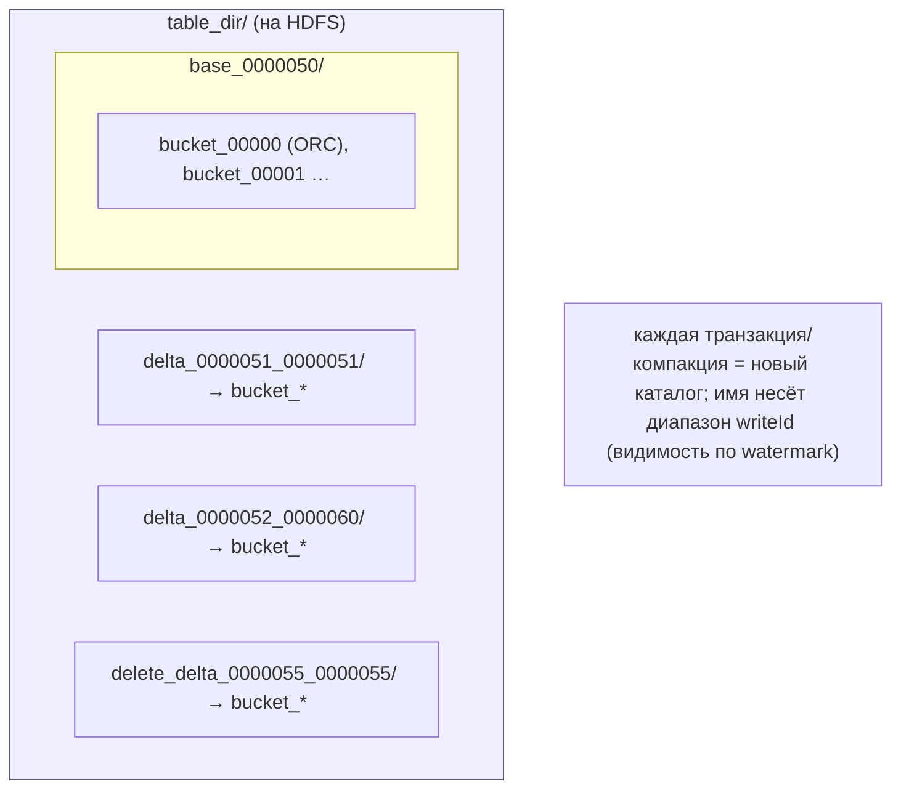
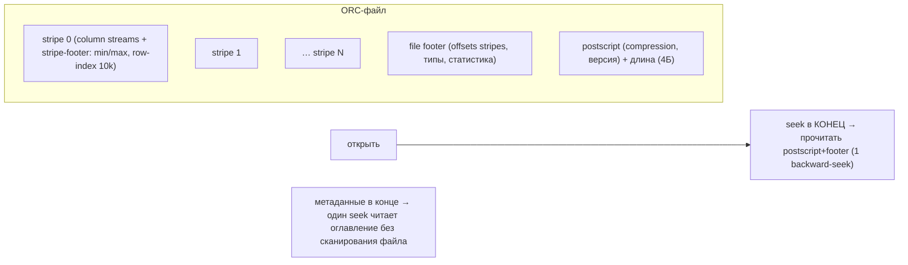
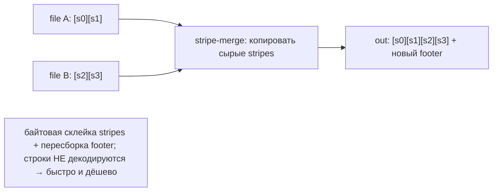
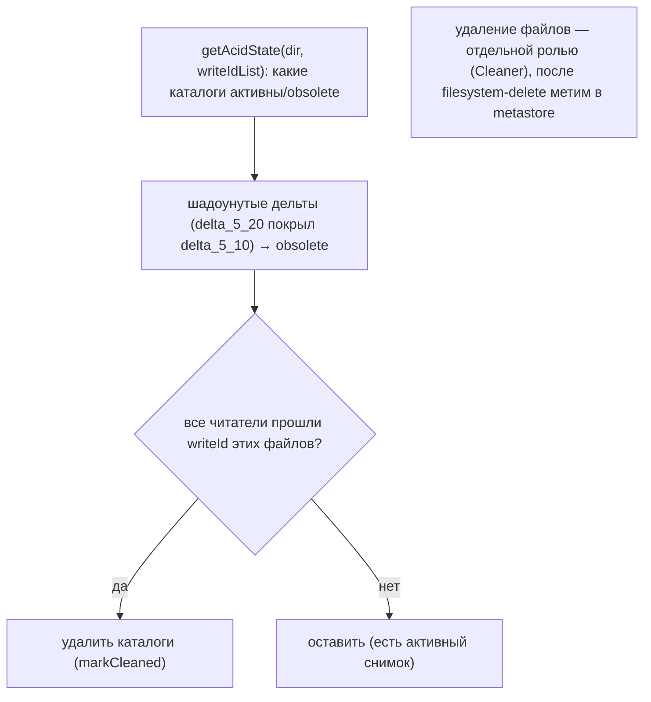

# Apache Hive Storage — как Hive работает с HDD/SSD (DDD-разбор исходников)

> Исследование исходников **apache/hive** (`Vendor/hive`, свежий слой, commit `9f387afc` от
> 2026-06-09). Все факты — с ссылками `файл:строка`, проверены в коде.

Hive — data warehouse поверх Hadoop/HDFS (Java). Storage-релевантны два слоя: **ORC** (колоночный
формат файла: stripes + индексы + bloom + min/max) и **ACID** (base + delta + delete-delta файлы +
**compaction**). Для нас это **тяжёлая конвергенция**: ORC-колоночность к **непрозрачным блокам по
CID** почти неприменима (как Parquet у InfluxDB — блоки непрозрачны, агрегаций нет), а base+delta+
compaction — это уже знакомый LSM-паттерн. Берём **3 более острых** приёма по компакции/GC:

1. **★ Splice-merge компакция** — сливать, **копируя целые stripes/регионы байт-в-байт БЕЗ
   де/ре-кодирования** (ORC `OrcFileStripeMerge`). Для нас: дешёвая компакция = **splice живых
   регионов сегмента без перечтения/перехэша** (блоки иммутабельны → уже валидны).
2. **★ Minor-vs-major компакция по порогам** — minor (слить дельты, base не трогать) vs major (base +
   все дельты → новый base); решение по `delta-count > 10` и `delta/base > 10%`.
3. **★ Reader-watermark Cleaner** — удалять отработавшие файлы **только после** того, как все читатели
   ниже «минимального открытого read-watermark» закончили (MVCC-safe реклейм под конкурентным чтением).

> Контекст: ORC-индексы/SARG/ROW__ID/merge-on-read — **колоночно-warehouse-специфика**, не наша
> (блоки непрозрачны, мы не сканируем по предикату и не делаем row-update). Берём только 3 идеи выше +
> отмечаем конвергенции. Hive поверх HDFS = тот же DataNode-диск (см. [[hadoop-storage-hdd-ssd.md]]).

---

## 1. Bounded Contexts



| Контекст | Ответственность | Файлы |
|---|---|---|
| **ORC формат** | stripes/footer/postscript, 3-tier индексы | `ql/io/orc/{WriterImpl,RecordReaderImpl}.java` |
| **ACID layout** | base/delta/delete-delta, ROW__ID | `ql/io/AcidUtils.java`, `AcidConstants.java` |
| **Merge-on-read** | слить base + дельты на чтении | `ql/io/orc/OrcRawRecordMerger.java` |
| **Initiator** | решить, что/как компактить (пороги) | `ql/txn/compactor/CompactorUtil.java` |
| **Worker** | исполнить компакцию (minor/major/splice) | `ql/txn/compactor/Worker.java`, `OrcFileStripeMergeRecordReader.java` |
| **Cleaner** | удалить obsolete после readers (watermark) | `ql/txn/compactor/Cleaner.java`, `AcidUtils.getAcidState` |

---

## 2. Архитектурные диаграммы (Mermaid)

### Hv1. ACID base + delta + compaction (LSM-подобно)



### Hv2. Minor vs Major: решение по порогам (Initiator)



### Hv3. Splice-merge: копировать stripes без ре-кодирования



### Hv4. Reader-watermark Cleaner (MVCC-safe реклейм)



### Hv5. Три роли компакции: Initiator → Worker → Cleaner



---

## 2-bis. Файловая система: раскладка и потоки (Mermaid)

> Hive ACID-таблица на HDFS: каталог = `base_<id>/` + `delta_<min>_<max>/` + `delete_delta_<...>/`,
> внутри — ORC-файлы по bucket'ам. Компакция переписывает/сливает каталоги.

### FS1. Раскладка ACID-таблицы (каталоги base/delta)



### FS2. ORC-файл: stripes + footer + postscript-в-конце



### FS3. Splice-merge на уровне ФС (копия stripes)



### FS4. Cleaner: obsolete → удаление после watermark



---

## 3. Ubiquitous Language (термины Hive)

| Термин Hive | Значение | Наш аналог |
|---|---|---|
| **ORC stripe** | блок данных файла (~64МБ) | ⚠️ нет (мы не колоночные); ближе к сегменту |
| **postscript/footer** | оглавление в конце файла | манифест/индекс сегмента |
| **row-group index (10k)** | мини-индекс min/max+bloom внутри stripe | ⚠️ min/max-skip (#91, огранич.) |
| **base / delta / delete-delta** | снимок + журналы изменений | base-сегменты + дельты GC |
| **ROW__ID** | (origTxn, bucket, rowId) | ⚠️ нет (нет row-update) |
| **merge-on-read** | слить base+дельты на чтении | LSM-чтение (есть) |
| **minor / major compaction** | слить дельты / собрать новый base | компакция сегментов (уточняем) |
| **splice/stripe-merge** | копировать stripes без ре-кодирования | **splice живых регионов без перехэша** |
| **Initiator/Worker/Cleaner** | решает/исполняет/убирает | ops-scheduler + GC + delete-set |
| **reader watermark** | min открытый read-writeId | MVCC-снимок (redb) для безопасного GC |

---

## 4. ORC-формат (кратко; для нас ⚠️ неприменимо)

ORC-файл (`WriterImpl.java`): последовательность **stripes** (~64МБ, `hive.exec.orc.stripe.size`),
буферизуются в RAM и сбрасываются по размеру; **file footer** (offsets/типы/статистика) +
**postscript** (compression/версия) **в конце** → открытие = один backward-seek читает оглавление.
**3-tier skip** (`RecordReaderImpl.java`): file-stats → stripe-stats → **row-group index** (каждые 10k
строк: min/max + опц. bloom) + **SARG** (predicate pushdown) пропускает stripes/row-groups **не читая
данные**.

> Для нас: блоки **непрозрачны** (нет колонок/предикатов) → колоночный skip неприменим. Это
> **конвергенция с InfluxDB #91** (min/max-skip ⚠️ ограничен): Hive лишь уточняет «иерархичность»
> (file→сегмент→микро), но суть та же — для CID-lookup бесполезно, для bloom — берём (#19/#37).

---

## 5. ACID: base + delta + compaction

ACID-таблица (`AcidUtils.java`, `AcidConstants.java:27`): `base_<writeId>/` + `delta_<min>_<max>/` +
`delete_delta_<...>/`, внутри ORC по bucket'ам. Каждая транзакция (writeId) пишет **новую дельту**;
чтение — **merge-on-read** (`OrcRawRecordMerger.java:82`): слить base + дельты, отсортированные по
ROW__ID `(origTxn, bucket, rowId)`, схлопнуть до последней версии. Это **знакомый LSM-паттерн**
(дельта-журналы + отложенная компакция), ROW__ID — ACID-специфика (нам не нужна, нет row-update).

> Для нас: defer-merge (читать base+дельты на лету) у нас и так есть в духе LSM/манифеста. Берём из
> компакции 3 более острых приёма ниже.

---

## 6. Компакция: minor/major, splice-merge, Cleaner-watermark (★ берём)

**Решение (Initiator, `CompactorUtil.java:360-417`):** `noBase → MAJOR`; `delta/base > 10%`
(`hive.compactor.delta.pct.threshold`) → MAJOR; `дельт ≤ 10` (`hive.compactor.delta.num.threshold`) →
не компактить; иначе → MINOR. **Minor** = слить дельты в одну (base не трогать, дёшево); **major** =
base + все дельты → новый base.

**Splice/stripe-merge (`OrcFileStripeMergeRecordReader.java:36`):** быстрый путь — копировать **целые
stripes сырыми байтами** в выходной файл **без** декодирования/перекодирования строк (пересобрать
только footer). Дешёвая компакция «склейкой».

**Три роли:** **Initiator** (решает) → **Worker** (`Worker.java:73`, пул, throttle — исполняет) →
**Cleaner** (`Cleaner.java:45`, удаляет obsolete). **Cleaner-watermark:** obsolete-файлы
(`AcidUtils.getAcidState`, шадоунутые дельты) удаляются **только когда все активные читатели прошли их
writeId** (min открытый read-writeId); после filesystem-delete — `markCleaned` в metastore.

> Для нас (★):
> - **Splice-merge (#104):** наш GC уже копирует живые блоки в новый сегмент — Hive добавляет урок
>   «копировать **байт-в-байт без перечтения/перехэша**» (блоки иммутабельны и content-addressed →
>   уже валидны) + это **дешёвый minor-режим** vs полный rewrite.
> - **Minor/major пороги (#105):** уточняют наш age-gated GC: minor (слить дельты-манифеста / мелкие
>   сегменты) vs major (полная перепаковка) по `delta-count` и `delta/base-ratio`.
> - **Reader-watermark Cleaner (#106):** усиливает наш [two-phase delete](#) (#84): удалять сегмент
>   только когда **все читатели ниже watermark** закончили (MVCC-снимок redb даёт watermark) → scrub/
>   backup/long-read не «выдернут» сегмент из-под себя.

---

## 7. Философия и вывод XFS/ZFS

Hive не управляет диском сам — он поверх HDFS-DataNode (см. [[hadoop-storage-hdd-ssd.md]]: JBOD+app-
репликация = ADR 0001). Его вклад для нас — **операционная модель компакции** (роли + пороги +
splice + watermark-cleaner) поверх иммутабельных файлов на «голом» FS. Колоночный ORC — мимо
(непрозрачные блоки). ZFS/диск-слой — на уровне HDFS, не Hive.

---

## 7-bis. Снипеты кода (реальные выдержки + объяснение)

### CS1. Splice/stripe-merge без ре-кодирования (#104)

```java
// ql/.../io/orc/OrcFileStripeMergeRecordReader.java:86 — nextStripe()
StripeInformation si = iter.next();
valueWrapper.setStripeStatistics(stripeStatistics.get(stripeIdx));
valueWrapper.setStripeInformation(si);                  // offsets/sizes/stats stripe'а
// дальше: копировать СЫРЫЕ байты stripe в выходной файл (строки НЕ декодируются)
```

**Объяснение:** stripes копируются байт-в-байт (по StripeInformation), без декодирования строк. → наш
**splice-merge компакция (#104)** — копировать живые регионы без перечтения/перехэша.

### CS2. Minor-vs-major по порогам (#105)

```java
// ql/.../txn/compactor/CompactorUtil.java:371 — determineCompactionType()
boolean bigEnough = (float) deltaSize / (float) baseSize > deltaPctThreshold;   // delta/base > порог
boolean enough = deltas.size() > deltaNumThreshold;                             // число дельт > порог
if (!enough) return null;                                                       // мало — не компактить
return noBase || !isMinorCompactionSupported(...) ? CompactionType.MAJOR : CompactionType.MINOR;
```

**Объяснение:** MAJOR при `delta/base > pct` / нет base; иначе MINOR; мало дельт → пропустить. → наш
**minor-vs-major по порогам (#105)** (garbage-ratio + число дельта-сегментов).

### CS3. Reader-watermark Cleaner: obsolete по writeId (#106)

```java
// ql/io/AcidUtils.java:1364 — getAcidState()
directory.getObsolete().addAll(directory.getOriginalDirectories());   // старые base/original → obsolete
findBestWorkingDeltas(writeIdList, directory);   // отфильтровать дельты, затенённые другими (по writeId)
```

**Объяснение:** `getAcidState` помечает obsolete по `ValidWriteIdList` (min открытый read-writeId);
Cleaner удаляет только после прохода читателей. → наш **reader-watermark Cleaner (#106)** (MVCC-safe).

---

## 8. Извлечённые идеи для OpenZFS Daemon

| # | Идея | Где у Hive | Берём? | Фаза | Влияние |
|---|---|---|---|---|---|
| 104 | **★ Splice-merge компакция** (копировать живые регионы/блоки байт-в-байт, БЕЗ ре-кодирования/перехэша) | `OrcFileStripeMergeRecordReader.java:36` | ✅ да | **5** | дешёвый minor-GC: splice живых регионов сегмента (иммутабельны → не перехэшировать) |
| 105 | **★ Minor-vs-major компакция по порогам** (delta-count + delta/base-ratio; minor=слить дельты, major=новый base) | `CompactorUtil.java:360-417` | ✅ да | **5** | уточняет age-gated GC: два режима + явные пороги запуска |
| 106 | **★ Reader-watermark Cleaner** (удалять obsolete только после читателей ниже min-open-read) | `Cleaner.java:45`, `AcidUtils.getAcidState` | ✅ да | **5** | MVCC-safe реклейм: scrub/long-read не выдернет сегмент; усиливает two-phase delete (#84) |

### Конвергенция (подтверждает уже принятое, не новые строки)
- **3-tier skip (file→stripe→row-group) + bloom + min/max** ⟷ min/max-skip InfluxDB #91 (⚠️ огранич.) + Bloom #19/#37: Hive «иерархичнее», но суть та же; для CID-lookup неприменимо.
- **base + delta + merge-on-read** ⟷ LSM-чтение + дельта-журналы (RocksDB/Pebble/Tarantool); ROW__ID — ACID-специфика, **не берём**.
- **postscript/footer-в-конце** ⟷ манифест/индекс сегмента (оглавление отдельно от данных).
- **Initiator/Worker/Cleaner роли** ⟷ ops-scheduler (#... scylla-manager) + GC + delete-set: Hive подтверждает разделение «решать/исполнять/убирать».
- **Hive поверх HDFS-DataNode** ⟷ ADR 0001 (JBOD+app-репликация), см. [[hadoop-storage-hdd-ssd.md]].
- **ORC stripe ~64МБ, append-buffer-flush** ⟷ pack-сегменты + write-буфер (HDFS-блок/сегмент уже валидировали).

### Главные новые заимствования
**#104 splice-merge** (компакция байт-в-байт без перехэша) и **#106 reader-watermark Cleaner**
(MVCC-safe удаление) — самые ценные, усиливают GC/two-phase-delete. **#105 minor/major пороги** —
уточняет, когда и как запускать компакцию. Остальное у Hive — конвергенция (колоночность нам мимо).

---

## 9. Источники в коде (для перепроверки)

| Область | Файл | Ключевые места |
|---|---|---|
| ORC writer/stripes | `ql/src/java/org/apache/hadoop/hive/ql/io/orc/WriterImpl.java` | 69-107 |
| ORC reader/SARG | `…/orc/RecordReaderImpl.java`; `ReaderImpl.java` | reader 101-104 |
| ACID layout | `ql/src/java/org/apache/hadoop/hive/ql/io/AcidUtils.java`, `AcidConstants.java` | Acid 290-351; Const 27-38 |
| merge-on-read | `…/orc/OrcRawRecordMerger.java` | 82-182 |
| Compaction решение | `ql/.../txn/compactor/CompactorUtil.java` | 306-417 |
| Worker/исполнение | `ql/.../txn/compactor/Worker.java` | 73-133 |
| Splice/stripe-merge | `…/orc/OrcFileStripeMergeRecordReader.java` | 36-122 |
| Cleaner/getAcidState | `ql/.../txn/compactor/Cleaner.java`, `AcidUtils.java` | Cleaner 45-176; Acid 1325-1487 |

---

> **Резюме для проекта.** Hive — 18-й прототип; **тяжёлая конвергенция** (колоночный DWH поверх HDFS).
> ORC-индексы/SARG/ROW__ID/merge-on-read — warehouse-специфика, нам **мимо** (блоки непрозрачны).
> Берём 3 более острых приёма по компакции/GC: **splice-merge** (#104, копировать живые регионы
> байт-в-байт без перехэша), **minor/major пороги** (#105), **reader-watermark Cleaner** (#106,
> MVCC-safe реклейм). Hive поверх HDFS-DataNode подтверждает ADR 0001. См.
> [STORAGE-IDEAS-SYNTHESIS.md](STORAGE-IDEAS-SYNTHESIS.md), [[hadoop-storage-hdd-ssd.md]] (DataNode-диск),
> [[influxdb-storage-hdd-ssd.md]] (min/max-skip), [[tarantool-storage-hdd-ssd.md]] (компакция), [Feynman](../../Feynman/README.md).
