# Apache Ignite Storage — как Ignite работает с HDD/SSD (DDD-разбор исходников)

> Исследование исходников **apache/ignite** (`Vendor/ignite`, свежий слой, commit `f6f439ec` от
> 2026-06-08). Все факты — с ссылками `файл:строка`, проверены в коде.

Ignite — распределённая in-memory + persistent БД (Java). Её **Native Persistence** — это
**page-memory (off-heap кэш страниц) + WAL + checkpoint**: изменения сначала в страницы памяти и в
журнал (WAL), а периодический **checkpoint** сбрасывает грязные страницы в файлы. Recovery =
**последний checkpoint + проигрывание WAL**. Новое и ценное для нас:

1. **★ WAL + checkpoint модель recovery** — журнал недавних изменений + checkpoint-маркеры →
   **быстрое восстановление** (проиграть WAL с последнего checkpoint, а не пересобирать всё).
2. **★ Historical (WAL-based) rebalance** — вернувшийся узел **докатывает только дельту** из WAL,
   а не копирует партицию целиком (≈ наш delta-resilver/fetch-catchup).
3. **Write-throttling по прогрессу checkpoint** — если пишут грязные страницы быстрее, чем
   checkpoint сбрасывает, **тормозим писателей** (backpressure, привязанный к flush).
4. **WAL-режимы** (FSYNC/LOG_ONLY/BACKGROUND/NONE) — именованные уровни durability↔throughput;
   **отдельный WAL-диск** + archive + compaction. Page-memory — свой off-heap кэш фикс. страниц.

> Контекст: Ignite — **page-based мутабельный** стор. Наши блоки **иммутабельны**, поэтому
> page-level WAL для данных нам не нужен — но **WAL+checkpoint для индекса**, write-throttling,
> WAL-режимы и **delta-rebalance** прямо применимы.

---

## 1. Bounded Contexts

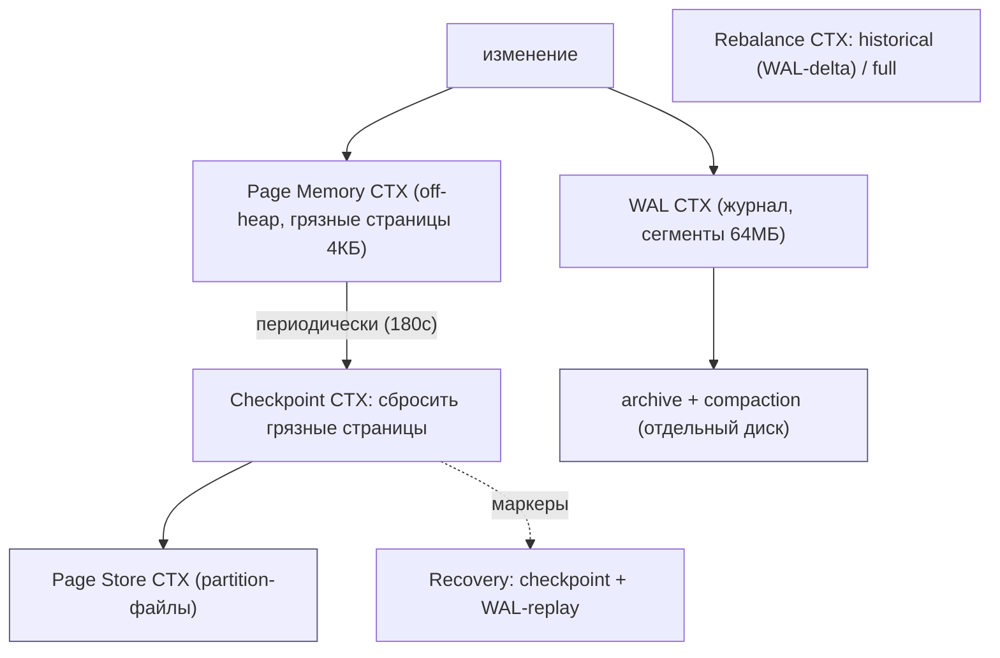

| Контекст | Ответственность | Файлы |
|---|---|---|
| **Page Memory** | off-heap кэш фикс. страниц (4КБ), грязные/чистые | `persistence/pagemem/` |
| **WAL** | журнал изменений: сегменты, режимы, archive | `persistence/wal/FileWriteAheadLogManager.java` |
| **Checkpoint** | сброс грязных страниц + маркеры | `persistence/checkpoint/Checkpointer.java` |
| **Page Store** | partition-файлы из страниц | `persistence/file/FilePageStore.java` |
| **Rebalance** | перенос партиций: historical (WAL) / full | `…/cache/distributed/dht/preloader/` |

---

## 2. Архитектурные диаграммы (Mermaid)

### I1. Путь записи: page-memory + WAL

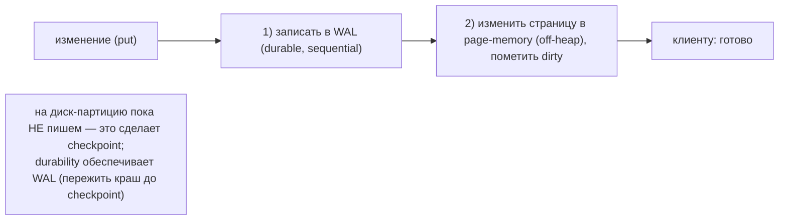

### I2. Checkpoint: периодический сброс грязных страниц

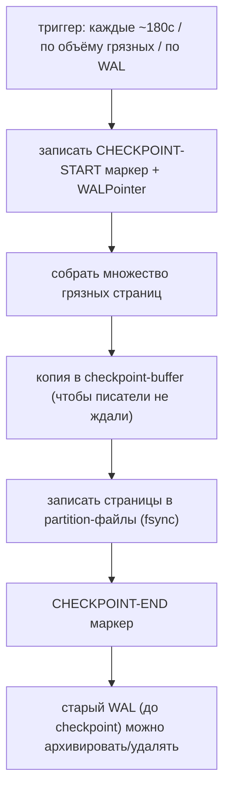

### I3. Recovery после краха = checkpoint + WAL-replay

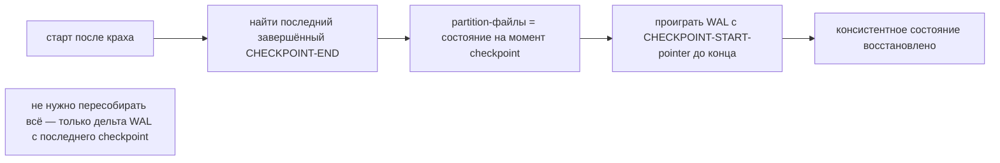

### I4. Write-throttling по прогрессу checkpoint

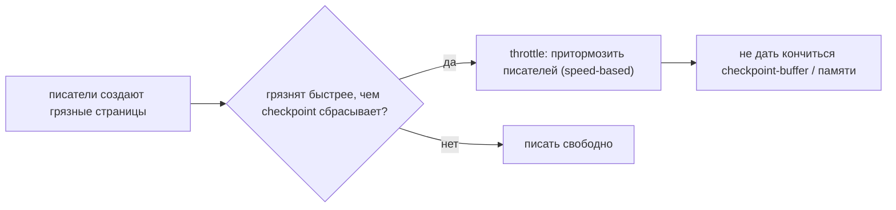

### I5. Historical (WAL-based) rebalance — докатка дельты

```mermaid
flowchart LR
    BACK["узел вернулся после короткого отсутствия"] --> CMP{"его counter отстал ненамного?"}
    CMP -->|да| HIST["historical: запросить из WAL живых ТОЛЬКО изменения с его точки"]
    CMP -->|нет (отстал сильно)| FULL["full: скопировать партицию целиком"]
    HIST --> APPLY["применить дельту → догнал"]
    note["вернулся на минуту → докатил минутную дельту, а не перелил всю партицию"]
```

---

## 2-bis. Файловая система: раскладка и потоки (Mermaid)

> Особенность Ignite: durability — в **WAL** (sequential, отдельный диск), а данные материализуются
> **checkpoint'ом** в partition-файлы. Восстановление — **checkpoint + проигрывание WAL**.

### FS1. Реальная раскладка на диске

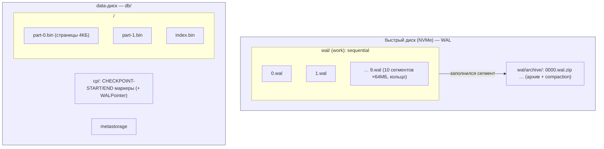

### FS2. Запись: append в WAL-сегмент + грязная страница

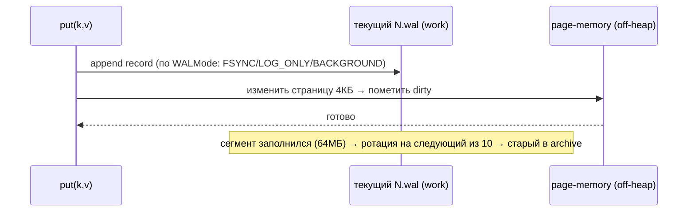

### FS3. Checkpoint: грязные страницы → partition-файлы

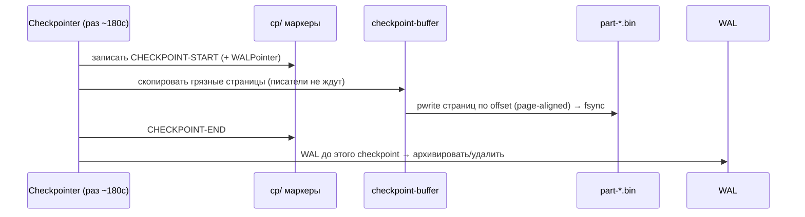

### FS4. Recovery: последний checkpoint + проигрывание WAL

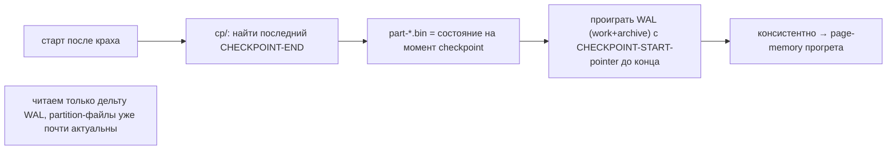

### FS5. WAL-режимы: что и когда реально попадает на диск

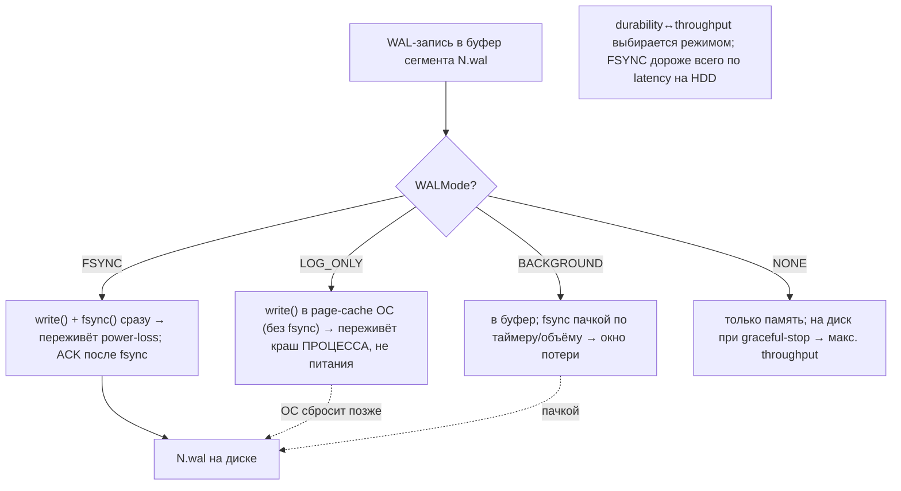

### FS6. WAL archive + compaction (освобождение work-диска)

```mermaid
sequenceDiagram
    participant WK as wal/ (work, 10×64МБ кольцо)
    participant AR as wal/archive/
    participant CMP as compaction
    participant CP as Checkpointer
    WK->>WK: сегмент заполнился (64МБ) → ротация на следующий из кольца
    WK->>AR: заполненный сегмент скопировать в archive (0000.wal …)
    CP-->>AR: WAL до завершённого checkpoint больше не нужен для recovery
    AR->>CMP: сжать старые сегменты (0000.wal.zip) — оставить только physical-records для rebalance
    CMP->>AR: удалить полностью устаревшие → освободить место
    note over WK,AR: work-кольцо НЕ растёт; archive можно вынести на отдельный/дешёвый диск
```

### FS7. Путь чтения: промах page-memory → страница из part-*.bin

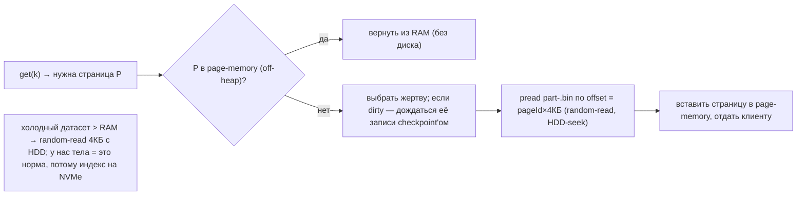

### FS8. Historical (WAL-delta) rebalance на уровне файлов

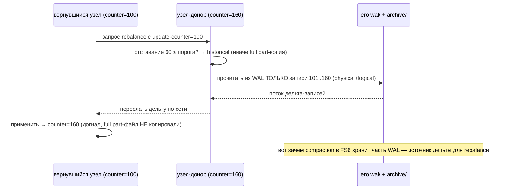

---

## 3. Ubiquitous Language (термины Ignite)

| Термин | Значение | Где в коде |
|---|---|---|
| **Page Memory** | off-heap кэш фикс. страниц (деф. 4КБ) | `DataStorageConfiguration.java:93` (`DFLT_PAGE_SIZE`) |
| **WAL** | write-ahead log изменений | `wal/FileWriteAheadLogManager.java` |
| **WAL mode** | FSYNC / LOG_ONLY / BACKGROUND / NONE | `configuration/WALMode.java:29` |
| **WAL segment** | файл журнала (деф. 64МБ × 10 в work + archive) | `DataStorageConfiguration.java:133,136` |
| **Checkpoint** | сброс грязных страниц + маркеры (деф. 180с) | `checkpoint/Checkpointer.java`, `:105` |
| **Checkpoint buffer** | буфер копий страниц на время checkpoint | `checkpoint/` |
| **Page Store** | partition-файл из страниц | `file/FilePageStore.java` |
| **Historical rebalance** | докатка дельты из WAL вместо full | `…/preloader/` |

---

## 4. Page Memory + Page Store

- **Page memory** (`pagemem/`): off-heap регион из **фиксированных страниц** (`DFLT_PAGE_SIZE=4КБ`,
  допустимо 2–16КБ; `DataStorageConfiguration.java:93,470`). Свой кэш страниц (не полагается на OS
  page-cache), с учётом dirty/clean и вытеснением.
- **Page Store** (`file/FilePageStore.java`, `V2`): данные кэша лежат в **partition-файлах**,
  организованных в страницы; страница адресуется `(cacheId, partId, pageIdx)`. Запись страницы на
  диск — выровненная по размеру страницы.

> Это **мутабельный** page-store (страницы переписываются по месту). У нас иммутабельные блоки →
> такой движок не наш; но **off-heap фикс. кэш** и **выровненная запись** — знакомые приёмы.

## 5. WAL — журнал изменений

- **Режимы** (`WALMode.java:29`): **FSYNC** (fsync на каждый коммит — переживает потерю питания),
  **LOG_ONLY** (полагается на запись ОС, переживает краш процесса), **BACKGROUND** (fsync пачками,
  быстрее, риск потери последних), **NONE** (без durability). Это **именованные уровни
  durability↔throughput**.
- **Сегменты** (`DataStorageConfiguration.java:133,136`): work-каталог из **10 сегментов по 64МБ**;
  при заполнении сегмент **архивируется** (`SegmentRouter` разводит work vs archive — можно на
  **отдельный диск**), затем опц. **компрессируется** (`Compressor`).
- WAL пишется **последовательно** (sequential) — идеально ложится на отдельный быстрый носитель.

## 6. Checkpoint + recovery

- **Checkpoint** (`checkpoint/Checkpointer.java`): по триггеру (деф. **180с**, `DFLT_CHECKPOINT_FREQ`,
  или по объёму грязных / по росту WAL) — пишет **CHECKPOINT-START маркер** (с `WALPointer`),
  собирает **грязные страницы**, копирует их в **checkpoint-buffer** (чтобы писатели не блокировались),
  сбрасывает в partition-файлы с fsync, пишет **CHECKPOINT-END**. После этого WAL **до checkpoint**
  больше не нужен для recovery → архивируется/удаляется.
- **Recovery** = найти последний завершённый checkpoint → partition-файлы дают состояние на тот
  момент → **проиграть WAL** от `CHECKPOINT-START-pointer` до конца. **Быстро**: только дельта WAL,
  а не пересборка всего.

> **Для нас (ключевое):** наш index-tier (redb) сейчас «производный» — при плохом крахе
> пересобирается **полным обходом сегментов** (медленно на 3,8 млрд). Модель **WAL индекс-операций +
> checkpoint** даёт **быстрый recovery**: проиграть WAL с последнего checkpoint вместо полного скана.

## 7. Write-throttling по прогрессу checkpoint

`DataStorageConfiguration.java:331`: «потоки, создающие грязные страницы **слишком быстро во время
идущего checkpoint, тормозятся». Это **backpressure, привязанный к прогрессу flush**: если writer'ы
обгоняют checkpoint — их **замедляют** (speed-based throttling), чтобы не исчерпать checkpoint-buffer
и память.

> Для нас: write-throttling нашего write-буфера **по прогрессу flush сегментов** — если клиент пишет
> быстрее, чем сбрасываем на HDD, притормаживаем (поверх Forseti).

## 8. ★ Historical (WAL-based) rebalance — докатка дельты

При возврате узла Ignite сравнивает его **update-counter** с актуальным. Если узел отстал
**ненамного** — **historical rebalance**: с живых реплик берётся **из WAL только дельта** (изменения
с точки отставания) и применяется. Если отстал сильно (или WAL уже не покрывает) — **full
rebalance** (копия партиции целиком).

> **Для нас (сильная идея):** диск/узел вернулся после **короткого** отсутствия → не делать полный
> [walk-resilver](../../Feynman/walk-resilver.md), а **докатить дельту** — список блоков,
> записанных в его «зону» (по HRW), пока он отсутствовал (вести краткий change-log/«WAL размещения»).
> Полный resilver — только при долгом отсутствии/замене диска. Резко сокращает трафик восстановления.

## 9. Философия и вывод XFS/ZFS

Ignite держит горячее состояние в **off-heap page-memory**, durability — через **WAL** (sequential,
можно на отдельный быстрый диск), а данные материализует **checkpoint'ом** в partition-файлы. ФС —
просто контейнер файлов (XFS). ZFS не нужен (целостность — WAL+checkpoint; избыточность — реплики
партиций). Урок: **разделять durability (WAL, sequential) и материализацию (checkpoint, по
расписанию)** и **восстанавливаться дельтой**, а не полной пересборкой.

## 9-bis. Снипеты кода (реальные выдержки + объяснение)

### CS1. WAL-режимы: durability↔throughput (#61)

```java
// modules/core/.../configuration/WALMode.java:27
public enum WALMode {
    FSYNC,        // power-loss safe (fsync каждой записи)
    LOG_ONLY,     // переживает краш процесса (буфер ОС)
    BACKGROUND,   // fsync пачками (окно потери)
    NONE;         // только память (макс. throughput)
}
```

**Объяснение:** именованные уровни durability↔throughput. → наш **`index_wal_mode: fsync|log_only|
background|none` (#61)**.

### CS2. Checkpoint-маркер (START/END + WALPointer) (#59)

```java
// .../checkpoint/CheckpointMarkersStorage.java:460 — writeCheckpointEntry()
try (FileIO io = ioFactory.create(Paths.get(..., tmpFileName).toFile(),
        StandardOpenOption.CREATE_NEW, StandardOpenOption.WRITE)) {
    io.writeFully(entryBuf);
    if (!skipSync) io.force(true);            // fsync → durable; затем tmp→rename
}
```

**Объяснение:** маркеры CHECKPOINT-START/END (с WALPointer), atomic tmp→rename + `force(true)`. → наш
**WAL + checkpoint recovery (#59)** (recovery = checkpoint + replay WAL).

### CS3. Write-throttling по прогрессу checkpoint (#62)

```java
// .../pagemem/PagesWriteThrottle.java:67 — onMarkDirty()
double dirtyRatioThreshold = ((double) cpWrittenPages) / cpTotalPages;     // прогресс checkpoint
shouldThrottle = pageMemory.shouldThrottle(dirtyRatioThreshold);
if (shouldThrottle) LockSupport.parkNanos(exponentialThrottle.protectionParkTime()); // притормозить писателя
```

**Объяснение:** грязные страницы обгоняют checkpoint → парковка писателя (экспон. backoff). → наш
**write-throttling по прогрессу flush (#62)** (поверх Forseti).

---

## 10. Извлечённые идеи для OpenZFS Daemon

| Идея из Ignite | Где применить | Эффект |
|---|---|---|
| **★ WAL индекс-операций + checkpoint → быстрый recovery** | **Фаза 1** — WAL для index-tier + checkpoint-маркер: recovery = replay WAL с checkpoint, а не полный обход 3,8 млрд сегментов | recovery за секунды, не часы |
| **★ Historical (WAL-delta) rebalance** | **Фаза 3** — диск вернулся ненадолго → докатить **дельту** (что записалось в его зону), а не полный walk-resilver | резкое сокращение трафика восстановления |
| **WAL-режимы (FSYNC/LOG_ONLY/BACKGROUND)** | **Фаза 1** — именованные уровни durability↔throughput для write-лога/индекса | настраиваемый компромисс |
| **Write-throttling по прогрессу flush** | **Фаза 5** — тормозить клиента, если он обгоняет сброс сегментов на HDD | не исчерпать буфер/память (поверх Forseti) |
| **Отдельный WAL-диск + archive + compaction** | **Фаза 1** — WAL на NVMe (sequential), архив сжимать | быстрый durable путь, экономия места |
| **checkpoint-buffer (copy-on-write страниц на время сброса)** | **Фаза 1/5** — писатели не блокируются во время flush сегмента | стабильная latency записи |
| **off-heap фикс. кэш (не OS page-cache)** | (контраст mmap Druid) — опция для NVMe-кэша индекса/тел | контроль кэша |

### Главные новые заимствования
1. **WAL + checkpoint для index-tier** — быстрый recovery дельтой вместо полного скана сегментов
   (наш index «производный», но пересборка дорога на 3,8 млрд — WAL это чинит).
2. **Historical (WAL-delta) rebalance** — докатка дельты для кратко-отсутствовавшего диска вместо
   полного walk-resilver.
3. **WAL-режимы** (именованные durability-уровни) + **write-throttling по прогрессу flush**.

---

## 11. Источники в коде (для перепроверки)

- Page memory / store: `…/persistence/pagemem/`, `…/persistence/file/FilePageStore.java`,
  `FilePageStoreV2.java`, `FilePageStoreManager.java`, `configuration/DataStorageConfiguration.java:93,470`.
- WAL: `…/persistence/wal/FileWriteAheadLogManager.java`, `SegmentRouter.java`, `…/wal/.../Compressor*`,
  `configuration/WALMode.java:29-59`, `DataStorageConfiguration.java:127,133,136,145`.
- Checkpoint: `…/persistence/checkpoint/Checkpointer.java`, `CheckpointManager.java`,
  `CheckpointMarkersStorage.java`, `DataStorageConfiguration.java:105,241,331` (throttling).
- Rebalance: `…/cache/distributed/dht/preloader/` (historical vs full).
