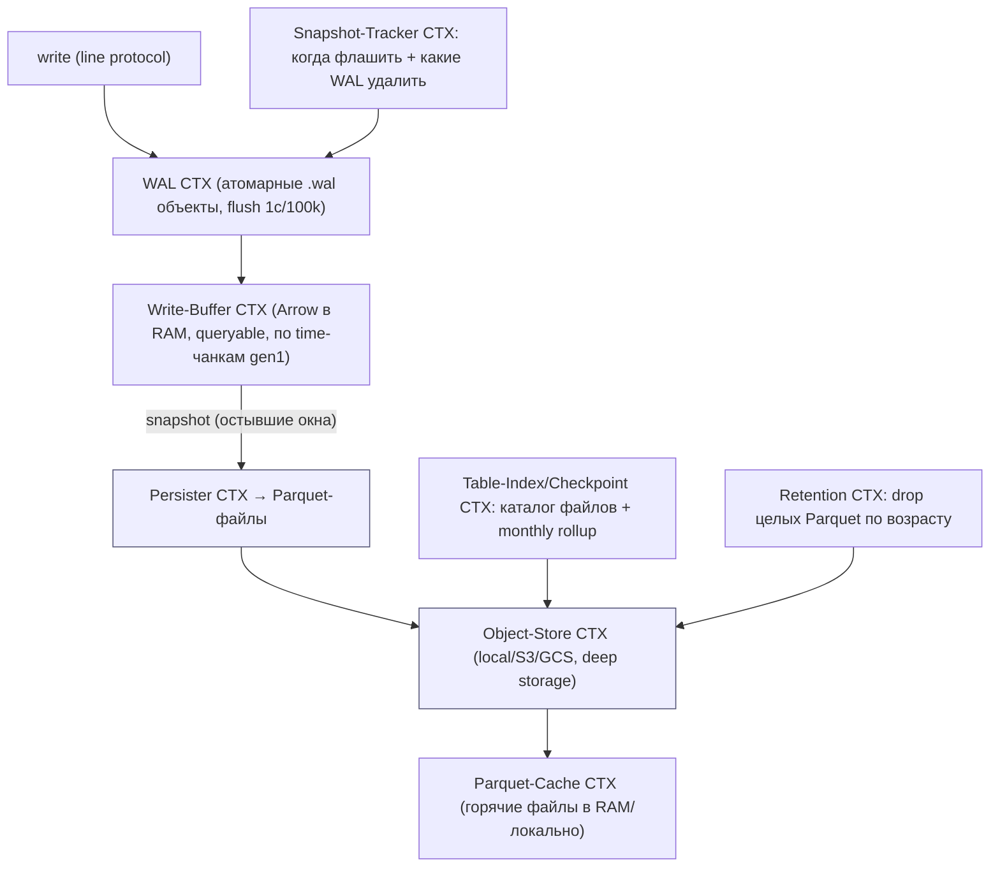
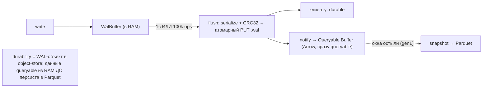
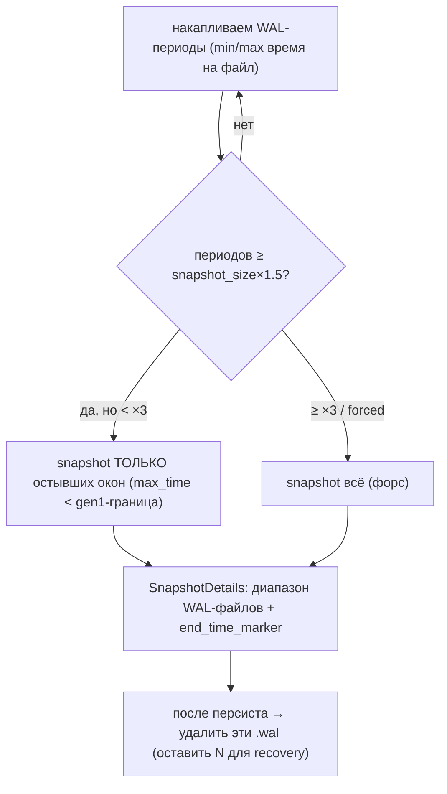
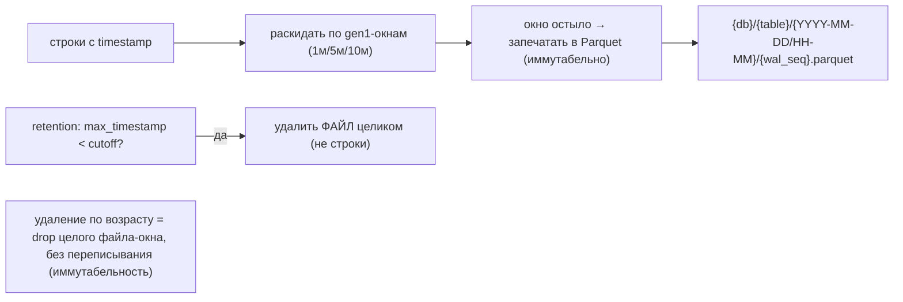
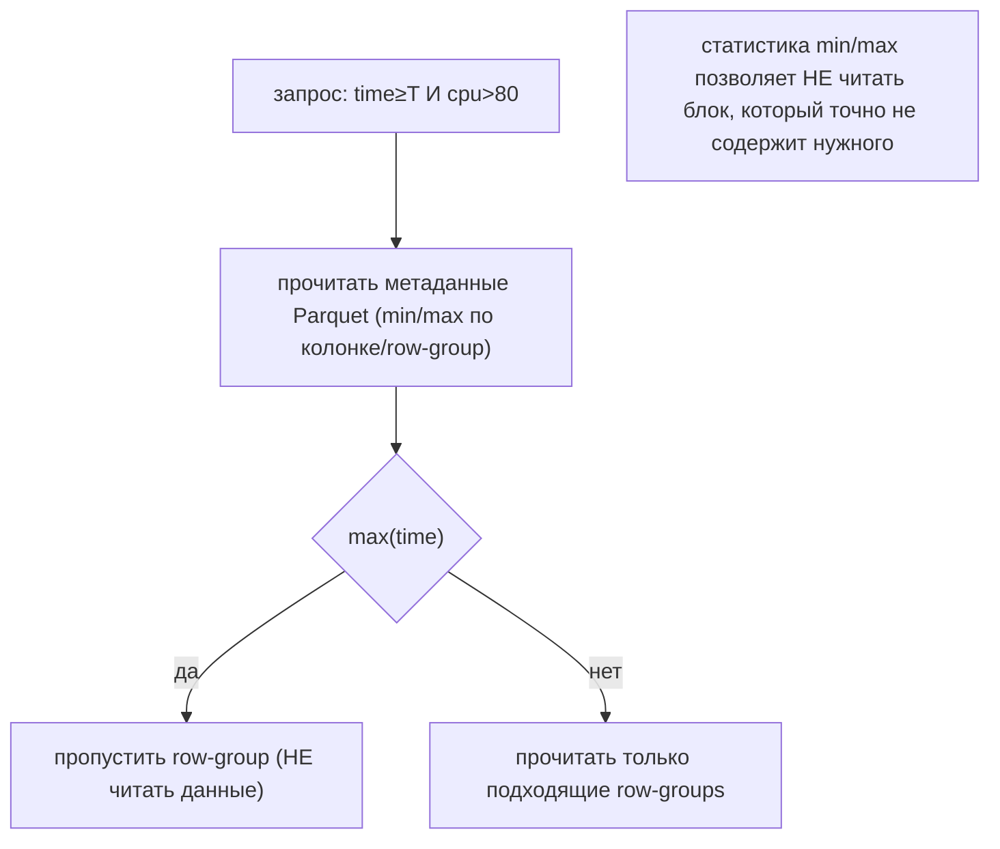
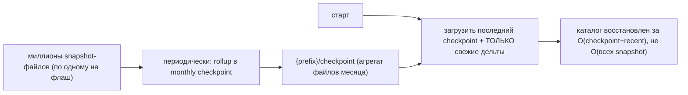
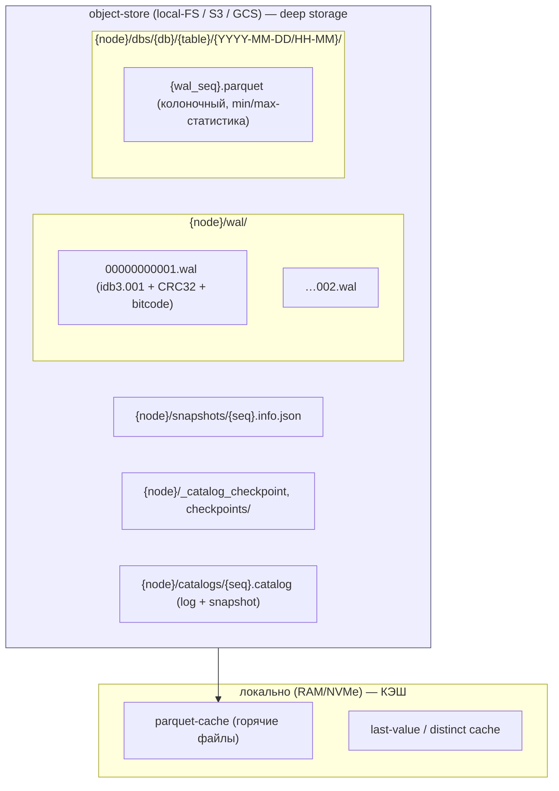
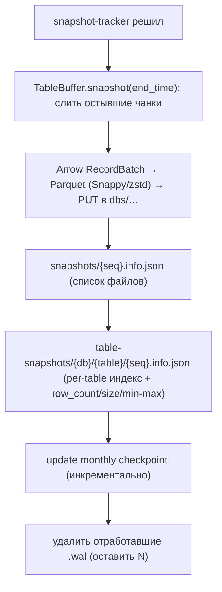
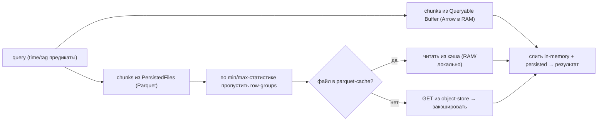

# InfluxDB 3 Storage — как InfluxDB работает с HDD/SSD (DDD-разбор исходников)

> Исследование исходников **influxdata/influxdb** (`Vendor/influxdb`, свежий слой, commit `70335b1`
> от 2026-05-29). Все факты — с ссылками `файл:строка`, проверены в коде.

InfluxDB 3 — time-series БД на **Rust** (Apache Arrow / DataFusion / **Parquet**), **object-store-centric**.
Модель принципиально иная, чем у блок-сторов: **WAL → in-memory buffer (Arrow) → иммутабельные
Parquet-файлы в object-store → локальный кэш**. Много пересечений с уже принятым (WAL+snapshot ≈
Ignite, deep-storage+кэш ≈ Druid), но есть и **новое**:

1. **★ Min/max-статистика по файлу/row-group → predicate pushdown** — пропускать чтение блока данных,
   если диапазон запроса не пересекается с его min/max (без чтения самих данных).
2. **★ Time-bucketed иммутабельные чанки (gen1)** — данные нарезаны по временным окнам, «остывают»
   перед персистом, retention **удаляет окна целиком**.
3. **★ Checkpoint-rollup метаданных** — на старте грузим **1 checkpoint + свежие дельты**, а не
   проигрываем миллионы snapshot-файлов.
4. **★ WAL как атомарные иммутабельные объекты** (`PUT`, не append) + `PutMode::Create` →
   детект split-brain; **object-store tier-гигиена** (лимит запросов, retry, multipart).

> Контекст: у InfluxDB тела — **колоночные таблицы** (Parquet), у нас — **непрозрачные блоки** по CID.
> Поэтому колоночность/last-value-кэши/DataFusion **не берём**; берём дисковую механику: time-bucketing
> + drop-whole-file retention, checkpoint-rollup каталога, min/max-skip (для вторичных/временных атрибутов),
> object-store-гигиену. WAL+snapshot и deep-storage+кэш у нас уже есть (Ignite/Druid) — здесь подтверждаются.

---

## 1. Bounded Contexts



| Контекст | Ответственность | Файлы |
|---|---|---|
| **WAL** | durable журнал, атомарные объекты, snapshot-trigger | `influxdb3_wal/src/{lib,object_store,snapshot_tracker,serialize}.rs` |
| **Write-Buffer** | Arrow в RAM, queryable, time-чанки | `influxdb3_write/src/write_buffer/{mod,queryable_buffer,table_buffer}.rs` |
| **Persister** | Arrow → Parquet, метаданные snapshot | `influxdb3_write/src/persister.rs`, `paths.rs` |
| **Object-Store** | local/S3/GCS за одним трейтом, лимиты/retry | `object_store_limit/`, `object_store_utils/` |
| **Parquet-Cache** | кэш горячих Parquet (deep-storage tier) | `influxdb3_cache/src/parquet_cache/` |
| **Table-Index/Checkpoint** | каталог файлов + monthly rollup | `influxdb3_write/src/{table_index,persister}.rs` |
| **Retention** | удаление целых Parquet по возрасту | `influxdb3_write/src/retention_period_handler.rs` |

---

## 2. Архитектурные диаграммы (Mermaid)

### If1. Путь записи: WAL → buffer → (later) Parquet



### If2. Snapshot-tracker: когда флашить и что удалять



### If3. Time-bucketing (gen1) + drop-whole-file retention



### If4. Min/max-статистика → predicate pushdown (skip)



### If5. Checkpoint-rollup метаданных (быстрый старт)



---

## 2-bis. Файловая система: раскладка и потоки (Mermaid)

> Особенность InfluxDB: **всё в object-store** (local-FS / S3) — WAL-объекты, Parquet-файлы,
> snapshot/checkpoint-метаданные, каталог. Локальный диск/RAM — лишь **кэш** поверх deep-storage.

### FS1. Реальная раскладка (object-store как ФС)



### FS2. WAL-объект: атомарный PUT + CRC + детект split-brain

```mermaid
sequenceDiagram
    participant B as WalBuffer
    participant S as serialize
    participant O as object-store
    B->>S: WalContents (ops + min/max время + seq)
    S->>S: [8B "idb3.001"] + [4B CRC32] + bitcode
    S->>O: put_opts(path, PutMode::Create)  (атомарно, идемпотентно)
    alt OK
        O-->>B: durable → ответить write'ам
    else AlreadyExists
        O-->>B: ДРУГОЙ узел с тем же ID! → shutdown (анти-split-brain)
    end
    note over O: WAL — иммутабельный объект (PUT), не append; CRC ловит порчу
```

### FS3. Snapshot: buffer → Parquet + метаданные + чистка WAL



### FS4. Чтение: buffer + Parquet (cache → object-store) с pruning



---

## 3. Ubiquitous Language (термины InfluxDB)

| Термин InfluxDB | Значение | Наш аналог |
|---|---|---|
| **WAL-объект** | иммутабельный .wal в object-store (PUT) | WAL индекса (но у нас локальный append) |
| **gen1 chunk** | time-окно данных (1м/5м/10м) | time-bucketed сегмент |
| **snapshot** | флаш buffer → Parquet + метаданные | seal/persist сегментов |
| **Parquet-файл** | иммутабельный колоночный блок данных | pack-сегмент (но непрозрачный) |
| **min/max statistics** | границы значений по колонке/row-group | per-сегмент диапазон (вторичный атрибут) |
| **checkpoint** | monthly rollup метаданных | rollup манифеста/каталога |
| **object-store** | deep storage (local/S3/GCS) | `cold_path`/S3 + XFS-HDD |
| **parquet-cache** | кэш горячих файлов | NVMe L2-кэш тел |
| **retention** | удаление целых Parquet по возрасту | TTL/drop-rules, age-gated GC |

---

## 4. WAL: атомарные иммутабельные объекты

WAL (`influxdb3_wal/`) — **не локальный append-лог**, а последовательность **иммутабельных объектов**
`{node}/wal/{seq:011}.wal` (`object_store.rs:943`). Формат (`serialize.rs:82`): `[8B "idb3.001"] +
[4B CRC32 BE] + bitcode(WalContents)`. Запись (`flush_buffer`, `object_store.rs:308`): буфер в RAM →
по **1с** (`flush_interval`) или **100k ops** (`max_write_buffer_size`) → один **атомарный
`put_opts(PutMode::Create)`**. `AlreadyExists` → **детект split-brain** (другой узел с тем же ID) →
shutdown (`object_store.rs:363`). Replay (`object_store.rs:148`) идемпотентен (по seq).

> Для нас: у нас WAL индекса — **локальный** (XFS+NVMe), не object-store. Но берём урок **CRC+версия
> в заголовке файла** (уже есть) и **fencing через atomic-create** (`AlreadyExists` = чужой владелец)
> — для Части 3 (несколько gateway над общим стором). Сам WAL+checkpoint у нас уже из Ignite (#59).

---

## 5. Time-bucketing (gen1) + snapshot-tracker

Данные в buffer'е нарезаны по **gen1-окнам** (`gen1_duration` 1м/5м/10м, `table_buffer.rs`:
`chunk_time_to_chunks: BTreeMap<i64, …>`). Snapshot-tracker (`snapshot_tracker.rs:60`) флашит **только
остывшие окна** (`max_time < округлённая gen1-граница`, `:112`) — горячее текущее окно не трогает.
При перегрузке (≥3× `snapshot_size`) — форс-флаш всего. Retention (`retention_period_handler.rs:87`)
удаляет **целые Parquet-файлы**, чей `max_timestamp < cutoff` — без переписывания строк.

> Для нас: сегмент можно делать **time-bucketed** (по окну ingest-времени) → TTL/retention
> эфемерных блоков = **drop целого сегмента по возрасту** (дёшево, без компакции). «Остывание перед
> персистом» = не запечатывать активное окно. Уточняет наши age-gated GC и ephemeral-TTL.

---

## 6. Persister, Parquet и min/max-статистика

Persister (`persister.rs`) сериализует Arrow `RecordBatch` → **Parquet** (Snappy/zstd) и PUT'ит в
`{node}/dbs/{db}/{table}/{YYYY-MM-DD/HH-MM}/{wal_seq}.parquet` (`paths.rs:42`). Parquet хранит
**min/max по колонке и row-group** → запрос с предикатом **пропускает row-groups** (skip без чтения
данных) + column pruning. Метаданные snapshot — JSON (`persister.rs:309`), per-table индекс с
`row_count/parquet_size/min-max` (`table_index.rs:91`).

> Для нас: блоки **непрозрачны** (колоночность не применима). Но **min/max диапазон по сегменту для
> ВТОРИЧНОГО/временного атрибута** (напр. ingest-время) в индексе → **skip сегментов** при
> scrub/GC/листинге по времени. Для основного lookup по CID (случайный хэш) — бесполезно (берём
> [Bloom/Ribbon](#)). Поэтому идея ⚠️ ограниченной применимости.

---

## 7. Object-store-гигиена и кэш

Один трейт `object_store` за local-FS/S3/GCS (`object_store_utils/`): обёртки **Retryable**
(retry), **Observed** (метрики), **AdaptivePut** (multipart для крупных PUT), `object_store_limit`
(**лимит одновременных запросов** к стору). **Parquet-cache** (`parquet_cache/mod.rs`):
`MemCachedObjectStore` кэширует байты Parquet (`Immediate` из write-пути / `Eventual` фоном / `Evict`),
фоновая обрезка по размеру. Плюс **last-value/distinct-кэши** (`last_cache/`, `distinct_cache/`) —
горячие запросы без обращения к Parquet.

> Для нас: deep-storage+кэш у нас уже есть (Druid #55, NVMe L2 #23). Новое — **гигиена слоя
> object-store для `cold_path`/S3**: лимит конкурентных запросов + retry + adaptive-multipart для
> крупных сегментов. last-value/distinct — нерелевантны (мы не агрегируем).

---

## 8. Checkpoint-rollup каталога (старт за O(checkpoint+recent))

Snapshot'ов — по одному на флаш (миллионы). Чтобы старт не проигрывал все, Persister ведёт **monthly
checkpoint** (`persister.rs:432-507`): `update_cached_checkpoint()` инкрементально мёржит snapshot в
текущий месяц; `warm_checkpoint_cache()` на старте грузит **последний checkpoint + свежие дельты**
(`list_latest_checkpoints_per_month`, `:518`). Аналогично каталог (`influxdb3_catalog`) = log-файлы +
периодический snapshot. Table-index тоже **мёржит** мелкие snapshot-индексы в `CoreTableIndex`.

> Для нас: прямой чертёж **rollup манифеста/каталога сегментов на масштабе**: периодически
> сворачивать дельты манифеста в **checkpoint**, чтобы recovery/старт был O(checkpoint + свежее), а не
> обход всех 3,8 млрд. Уточняет [манифест сегментов](#) (#66) и WAL+checkpoint индекса (#59).

---

## 9. Философия и вывод XFS/ZFS

InfluxDB **полностью доверяет object-store** (durability = атомарный PUT), а локальный диск — лишь
кэш. Для одного сервера на 60 HDD это «перевёрнуто»: у нас **локальные диски — источник правды**, а
object-store (`cold_path`/S3) — холодный тир/бэкап. Но иммутабельность + time-bucketing + drop-whole-file
retention идеально ложатся на XFS+JBOD (ADR 0001): сегмент-окно пишем раз, удаляем целиком по
возрасту. Parquet/колоночность — мимо нас (блоки непрозрачны).

---

## 9-bis. Снипеты кода (реальные выдержки + объяснение)

### CS1. Checkpoint-rollup каталога (быстрый старт) (#93)

```rust
// influxdb3_write/src/persister.rs:432 — warm_checkpoint_cache()
pub fn warm_checkpoint_cache(&self, checkpoint: PersistedSnapshotCheckpoint) {
    let mut cache = self.cached_checkpoint.write();
    let file_index = build_file_index(&checkpoint.databases);  // 1 checkpoint + свежие дельты
    ...
}
```

**Объяснение:** на старте грузится последний monthly checkpoint + свежие дельты (не миллионы
snapshot'ов). → наш **checkpoint-rollup манифеста (#93)** — recovery O(checkpoint+recent) на 3,8 млрд.

### CS2. Time-bucketed чанки (gen1) + drop-whole-file (#92)

```rust
// influxdb3_write/src/write_buffer/table_buffer.rs:45 — buffer_chunk()
pub(crate) fn buffer_chunk(&mut self, chunk_time: i64, rows: &[Row]) {
    let chunks = self.chunk_time_to_chunks.entry(chunk_time).or_default();  // окно по времени
    let needs_new_chunk = chunks.is_empty()
        || chunks.last().is_some_and(|c| c.would_exceed_limit_with(&incoming_per_column));
}
```

**Объяснение:** данные нарезаны по time-окнам (`chunk_time`); retention удаляет **целые** Parquet по
возрасту. → наш **time-bucketed сегменты + drop-whole-file retention (#92)**.

### CS3. Object-store гигиена: лимит конкуренции (#95)

```rust
// object_store_limit/src/lib.rs:47
pub fn new(inner: Arc<dyn ObjectStore>, max_permits: usize, metrics: &Arc<AsyncSemaphoreMetrics>) -> Self {
    Self { inner, semaphore: Arc::new(metrics.new_semaphore(max_permits)) }   // лимит конкурентных запросов
}
async fn acquire(&self) -> ... { self.semaphore.acquire_owned(None).await.unwrap() }
```

**Объяснение:** все ops к object-store под семафором (max_permits) + RetryableObjectStore (retry+backoff).
→ наша **object-store-гигиена (#95)** для `cold_path`/S3 (не залить бэкенд).

---

## 10. Извлечённые идеи для OpenZFS Daemon

| # | Идея | Где у InfluxDB | Берём? | Фаза | Влияние |
|---|---|---|---|---|---|
| 91 | **min/max-статистика по сегменту → skip по предикату** (вторичный/временной атрибут) | Parquet stats, `table_index.rs:91` | ⚠️ огранич. | **5** | scrub/GC/листинг по времени пропускают неподходящие сегменты; для CID-lookup бесполезно |
| 92 | **★ Time-bucketed сегменты + cool-off + drop-whole-file retention** (gen1) | `snapshot_tracker.rs`, `retention_period_handler.rs` | ✅ да | **5** | TTL/retention эфемерных = удалить сегмент-окно целиком, без компакции |
| 93 | **★ Checkpoint-rollup манифеста/каталога** (старт = checkpoint + свежее, не обход всего) | `persister.rs:432-597` | ✅ да | **1** | recovery/старт O(checkpoint+recent) на 3,8 млрд; уточняет #59/#66 |
| 94 | **Fencing через atomic-create** (`PutMode::Create`→AlreadyExists = чужой владелец) | `object_store.rs:363` | ⚠️ Ч3 | **—** | анти-split-brain при нескольких gateway над общим стором |
| 95 | **Object-store tier-гигиена** (лимит конкурентных запросов + retry + adaptive-multipart) | `object_store_limit/`, `object_store_utils/` | ✅ да | **5** | аккуратная работа с `cold_path`/S3: не залить бэкенд, дослать крупное |

### Конвергенция (подтверждает уже принятое, не новые строки)
- **WAL → snapshot recovery** ⟷ WAL+checkpoint индекса (Ignite #59).
- **object-store deep storage + локальный кэш** ⟷ deep-storage (Druid #57) + NVMe L2-кэш (#23).
- **иммутабельные файлы + drop по возрасту** ⟷ age-gated GC / ephemeral-TTL / Druid drop-rules.
- **CRC + версия в заголовке файла** ⟷ наш формат сегмента/манифеста (Redis #67, micro-checksum #34).
- **table-index merge (борьба с many-small-files на уровне метаданных)** ⟷ компакция + #93 rollup.
- **колоночный Parquet / last-value / DataFusion** ⟷ **НЕ берём** (блоки непрозрачны, мы не агрегируем).

### Главные новые заимствования
**#93 checkpoint-rollup каталога** — прямо полезно на масштабе 3,8 млрд (быстрый старт). **#92
time-bucketed сегменты + drop-whole-file** — дешёвый retention эфемерных. **#95 object-store-гигиена**
— аккуратный `cold_path`/S3. **#91/#94** — ограниченной/Ч3-применимости (честно помечены).

---

## 11. Источники в коде (для перепроверки)

| Область | Файл | Ключевые места |
|---|---|---|
| WAL формат/flush | `influxdb3_wal/src/object_store.rs` | 148-278 (replay), 308-451 (flush), 943 (path) |
| WAL serialize | `influxdb3_wal/src/serialize.rs` | 39-99 (CRC32 + bitcode) |
| Snapshot-tracker | `influxdb3_wal/src/snapshot_tracker.rs` | 60-91, 112-148 |
| Write-buffer | `influxdb3_write/src/write_buffer/{mod,queryable_buffer,table_buffer}.rs` | mod 157; qb 99-230; tb 34-198 |
| Persister/checkpoint | `influxdb3_write/src/persister.rs` | 309-355 (snapshot), 432-597 (checkpoint) |
| Paths | `influxdb3_write/src/paths.rs` | 42-62 (parquet), 102-231 (table-index) |
| Table-index | `influxdb3_write/src/table_index.rs` | 91-215 (snapshot), 245+ (CoreTableIndex) |
| Retention | `influxdb3_write/src/retention_period_handler.rs` | 14-123 |
| Object-store | `object_store_limit/`, `object_store_utils/src/lib.rs` | лимиты/retry/multipart |
| Parquet-cache | `influxdb3_cache/src/parquet_cache/mod.rs` | 97-208 |
| Каталог | `influxdb3_catalog/src/lib.rs` | 1-151 (log+snapshot, версии) |

---

> **Резюме для проекта.** InfluxDB 3 — 15-й прототип, **другая модель** (time-series/columnar,
> object-store-centric). Много пересечений (WAL+snapshot ≈ Ignite, deep-storage+кэш ≈ Druid), берём
> 5 новых: time-bucketed сегменты + drop-whole-file retention (#92), checkpoint-rollup каталога (#93),
> object-store-гигиена (#95), и ⚠️-ограниченные min/max-skip (#91) и fencing (#94, Ч3). Колоночность/
> Parquet/last-value — мимо (блоки непрозрачны). См. [STORAGE-IDEAS-SYNTHESIS.md](STORAGE-IDEAS-SYNTHESIS.md),
> [[ignite-storage-hdd-ssd.md]] (WAL+checkpoint), [[druid-storage-hdd-ssd.md]] (deep-storage+rules),
> [Feynman](../../Feynman/README.md).
