# iroh-blobs Storage — как iroh работает с HDD/SSD (DDD-разбор исходников)

> Исследование исходников **n0-computer/iroh** (`Vendor/iroh`, commit `9a79782`, 2026-06-08) +
> **n0-computer/iroh-blobs** (`Vendor/iroh-blobs`, commit `789f904`, 2026-06-02). Все факты — с
> ссылками `файл:строка`, проверены в коде.

Сам `iroh` (этот репозиторий) — теперь **P2P/QUIC-транспорт** (endpoint, relay, DNS-discovery), без
дискового хранилища. Хранилище блобов вынесено в крейт **`iroh-blobs`** — и это **архитектурный
близнец нашего проекта**: content-addressed blockstore на **redb-индекс + файлы на диске**, на Rust.
По сути наш стек один-в-один. Главные отличия и идеи:

1. **★ BLAKE3 verified streaming / outboard** — merkle-дерево хэшей рядом с данными → **проверяемый
   random-access и докачка** любого диапазона без перехэширования всего блоба.
2. **★ Inline-payload в отдельных redb-таблицах** (data/outboard отдельно от строки entry) → строка
   индекса остаётся **крошечной** (быстрый скан blobs-таблицы).
3. **★ Sparse bitfield + sizes-сайдкар** для частичных блобов (докачка; bitfield восстанавливается из
   outboard при старте); **memory→disk spillover** частичных загрузок по порогу.
4. **★ Entity-manager** (один логический актор на хэш, idle-recycle пул) + **двухфазный delete-set +
   protect-handle** (удаление только после commit метаданных; защита файлов во время записи).

> Контекст: iroh-blobs — **single-store** (один диск/каталог, нет шардинга, HRW, R=2). Это
> подтверждает наш выбор (redb-индекс + файлы), а наш **Pool-слой** (60 дисков, placement, репликация,
> resilver) — это ровно то, чего у iroh-blobs нет. Берём его дисковую механику и lifecycle-абстракции.

---

## 1. Bounded Contexts

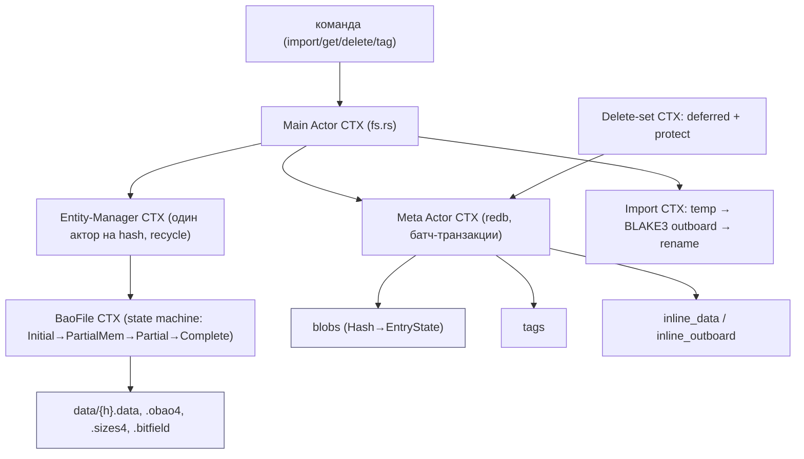

| Контекст | Ответственность | Файлы |
|---|---|---|
| **Main Actor** | команды, координация задач/БД | `store/fs.rs` |
| **Meta Actor** | redb-метаданные, батч-транзакции | `store/fs/meta.rs`, `meta/tables.rs` |
| **BaoFile** | state-machine данных+outboard блоба | `store/fs/bao_file.rs` |
| **Entity-Manager** | актор-на-hash, конкуренция, recycle | `store/fs/util/entity_manager.rs` |
| **Import** | staging temp → outboard → finalize | `store/fs/import.rs` |
| **Delete-set / GC** | отложенные удаления, mark-sweep | `store/fs/delete_set.rs`, `store/gc.rs` |

---

## 2. Архитектурные диаграммы (Mermaid)

### Ir1. Lifecycle блоба: inline → on-disk (порог 16КБ)

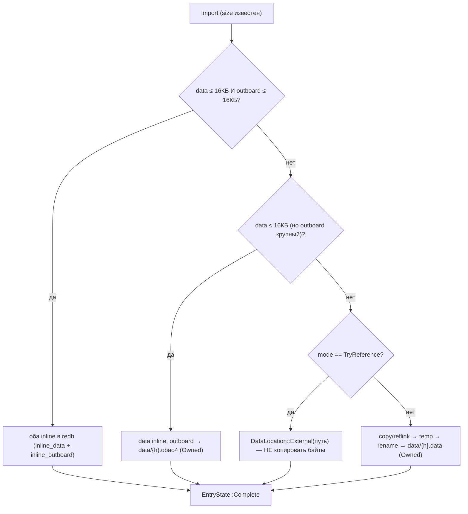

### Ir2. BLAKE3 outboard: проверяемый random-access

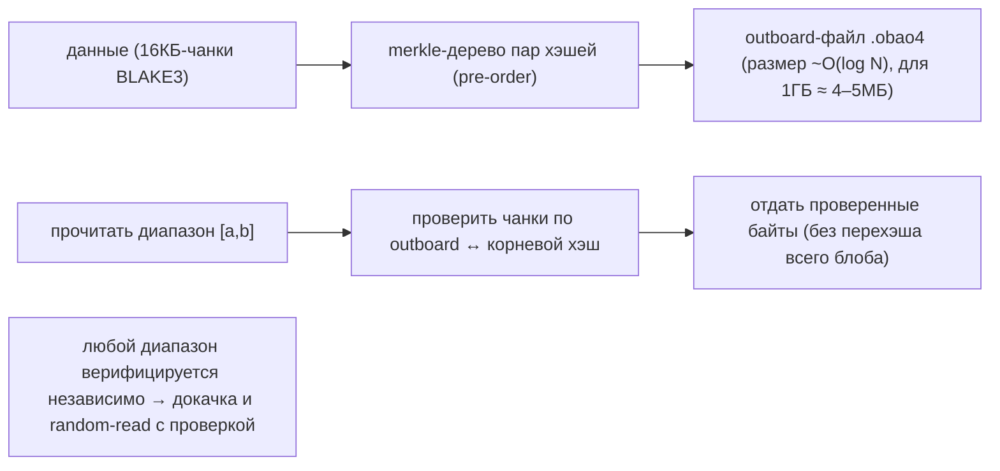

### Ir3. Частичный блоб: bitfield + sizes + memory→disk

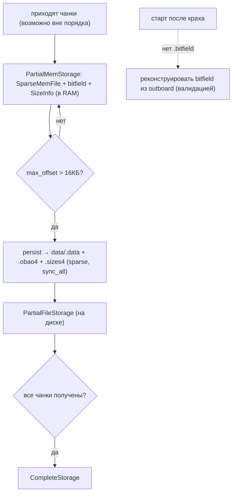

### Ir4. Entity-manager: актор на хэш + recycle

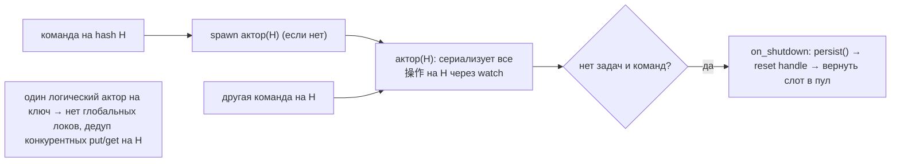

### Ir5. Двухфазное удаление: delete-set + protect

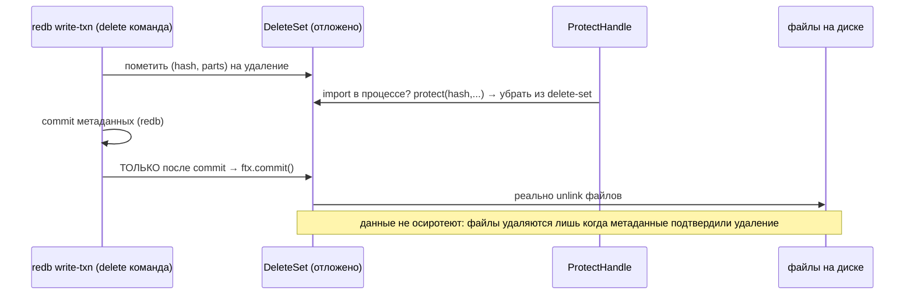

---

## 2-bis. Файловая система: раскладка и потоки (Mermaid)

> iroh-blobs: метаданные + мелочь в **redb** (`blobs.redb`), крупные тела и outboard — **файлы по
> хэшу** в `data/`, импорт идёт через `temp/` с атомарным `rename`.

### FS1. Реальная раскладка на диске

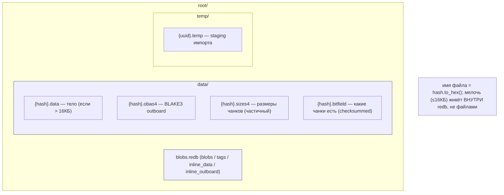

### FS2. Import: temp → BLAKE3 outboard → атомарный rename

```mermaid
sequenceDiagram
    participant U as import_bytes/file
    participant T as temp/{uuid}.temp
    participant H as BLAKE3 (outboard)
    participant F as data/{hash}.*
    participant DB as redb
    U->>T: записать данные в temp (если > порога inline)
    U->>H: вычислить hash + outboard (в RAM или temp-файл)
    U->>F: protect(hash) → fs::rename(temp → data/{hash}.data) (атомарно)
    U->>F: fs::rename(outboard.temp → data/{hash}.obao4)
    U->>DB: update EntryState::Complete{ Owned, Owned } (батч-txn)
    note over U,F: rename — атомарный commit тела; до него видимого состояния нет
```

### FS3. Inline-split: маленькая строка индекса + отдельные таблицы

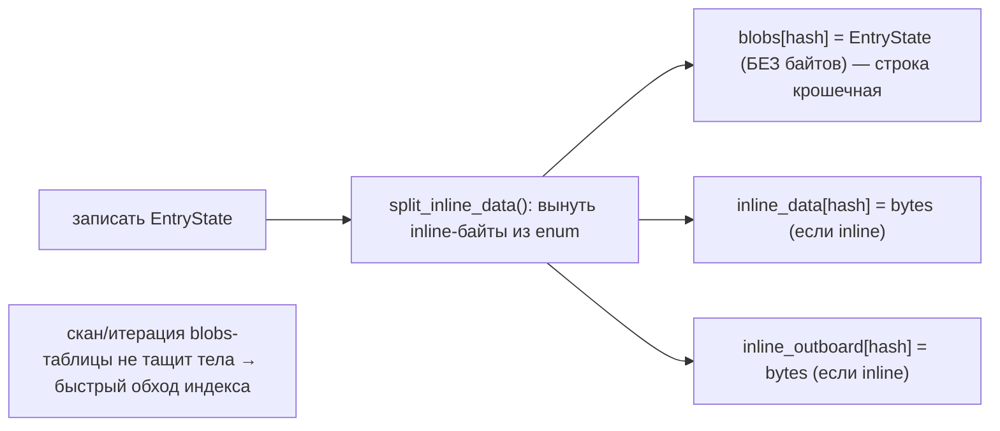

### FS4. Batched-транзакции: амортизация overhead redb

```mermaid
flowchart TB
    PEEK["peek команды из очереди"] --> TYPE{"тип?"}
    TYPE -->|TopLevel (Sync/Shutdown)| NOW["исполнить сразу"]
    TYPE -->|ReadOnly| RB["батч до 10000 / 1с → один read-txn"]
    TYPE -->|ReadWrite| WB["батч до 1000 / 500мс → один write-txn"]
    WB --> COMMIT["commit redb → ПОТОМ ftx.commit() (отложенные удаления)"]
    note["сотни команд в одной транзакции → меньше fsync/overhead на запись"]
```

### FS5. Путь чтения: redb-lookup → inline или файл (+ проверка outboard)

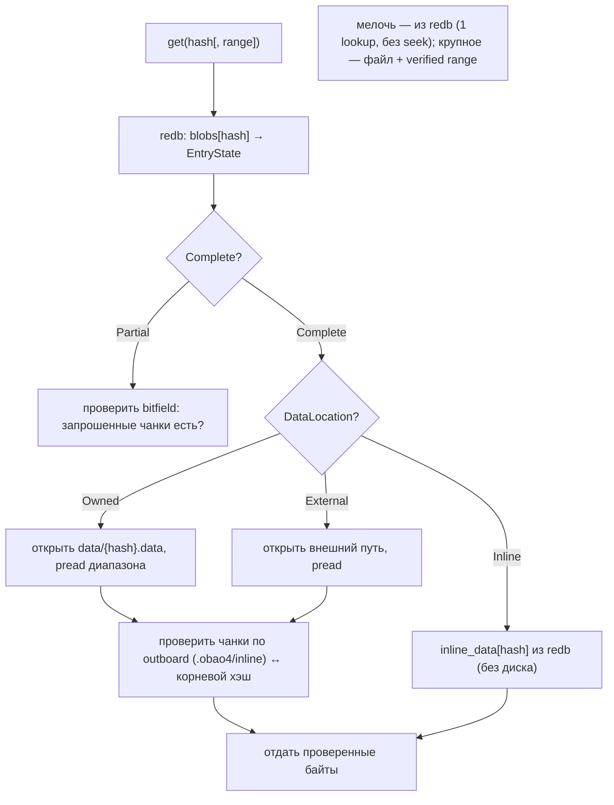

### FS6. Частичная загрузка на диске: 4 файла одного блоба

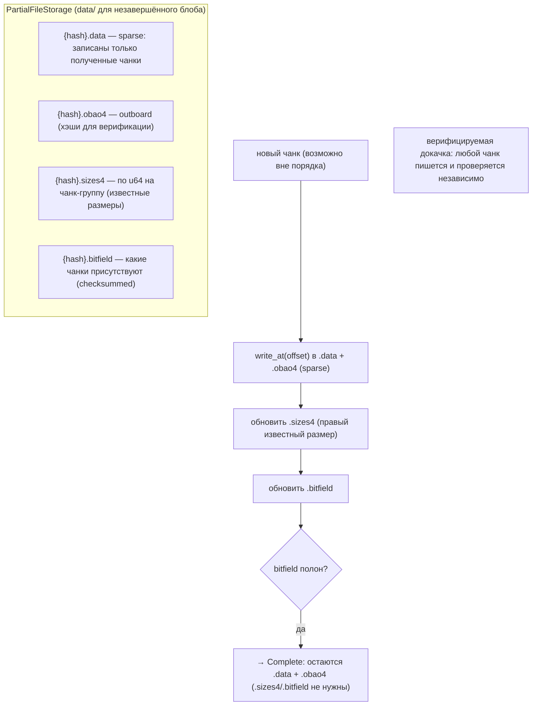

### FS7. Восстановление при старте: реконструкция bitfield из outboard

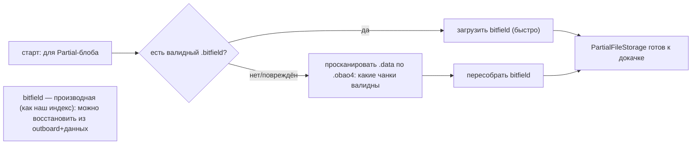

### FS8. Mark-sweep GC файлов + двухфазное удаление

```mermaid
sequenceDiagram
    participant MARK as gc-mark
    participant TAGS as tags/roots (redb)
    participant SWEEP as gc-sweep
    participant DS as DeleteSet (+ protect)
    participant FS as data/*.{data,obao4,...}
    MARK->>TAGS: обойти теги/корни → собрать live-множество хэшей (+ ссылки)
    SWEEP->>SWEEP: всё, чего нет в live → кандидаты на удаление (батчами по 100)
    SWEEP->>DS: пометить (hash, parts); НО import активен? protect → пропустить
    DS->>DS: дождаться commit redb-txn
    DS->>FS: только теперь unlink файлов
    note over DS,FS: файл удаляется лишь после того, как метаданные подтвердили смерть блоба
```

### FS9. redb-файл на диске: единый индекс + inline-таблицы

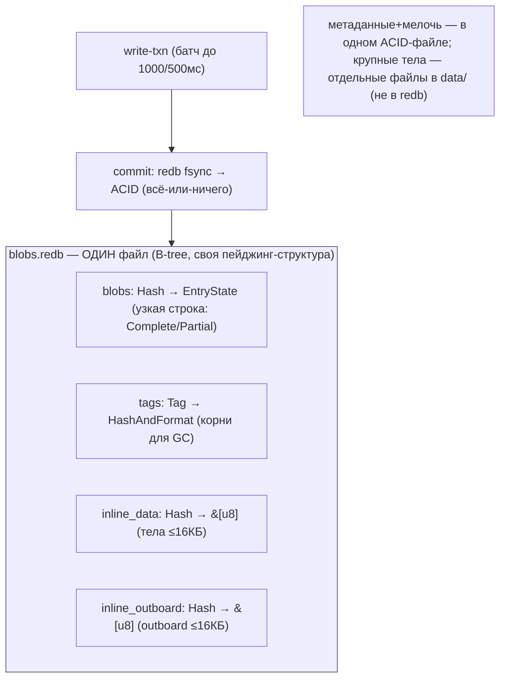

### FS10. Переход partial → complete: чистка сайдкаров

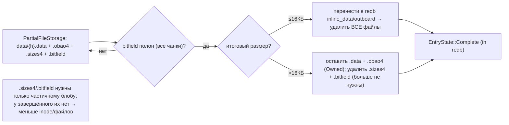

### FS11. Export наружу: copy / reflink(CoW) / reference / truncate

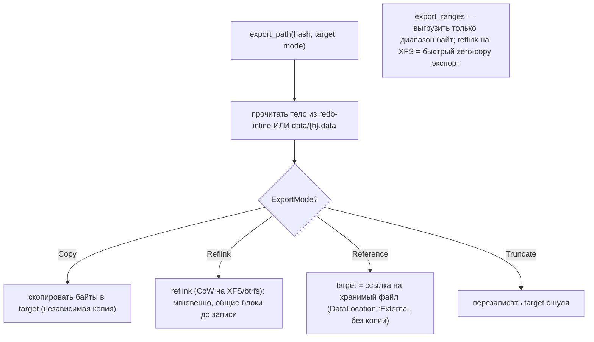

### FS12. Durability и shutdown: что и когда попадает на диск

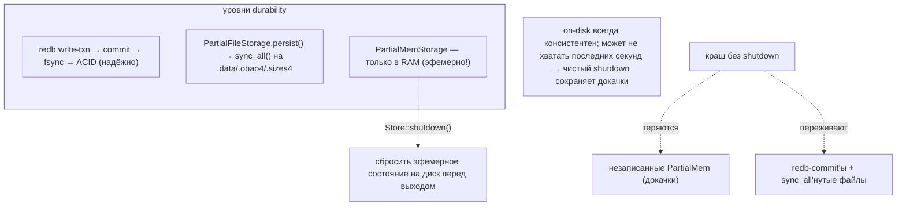

---

## 3. Ubiquitous Language (термины iroh-blobs)

| Термин iroh-blobs | Значение | Наш аналог |
|---|---|---|
| **blob** | content-addressed объект (BLAKE3-hash) | блок (CID) |
| **outboard (.obao4)** | BLAKE3 merkle-дерево рядом с данными | (нет — наши блоки мелкие; для крупных = verified-stream) |
| **EntryState** | Complete / Partial — lifecycle блоба | состояние записи блока |
| **DataLocation** | Inline / Owned / External | inline-в-redb / в-сегменте / внешняя ссылка |
| **inline_data/outboard table** | мелочь отдельно от строки entry | namespacing + узкая строка индекса |
| **bitfield (.bitfield)** | какие чанки присутствуют | карта частичной реплики |
| **sizes (.sizes4)** | размеры чанков частичного блоба | метаданные докачки |
| **entity manager** | актор на hash | per-key сериализация операций |
| **delete-set / protect** | отложенное удаление + защита | двухфазный GC файлов |
| **MemOrFile** | данные в RAM или в файле | inline-vs-сегмент единым кодом |

---

## 4. redb-схема и inline-split

Таблицы (`meta/tables.rs:7-15`): `blobs (Hash→EntryState)`, `tags`, `inline_data (Hash→&[u8])`,
`inline_outboard (Hash→&[u8])`. `EntryState` (`entry_state.rs:161`): `Complete{ data_location,
outboard_location }` или `Partial{ size }`. `DataLocation` = `Inline | Owned(size) | External(paths,
size)`; `OutboardLocation` = `Inline | Owned | NotNeeded`. Сериализация — `postcard`.

**Inline-split** (`meta.rs:373-436`): при записи `split_inline_data()` **вынимает inline-байты** из
enum → в `blobs` кладётся `EntryState` **без тел**, а сами байты — в отдельные `inline_data`/
`inline_outboard`. Строка индекса крошечная → быстрый скан/итерация blobs-таблицы.

> Для нас: подтверждает redb-индекс + inline-мелочь, но добавляет урок — **держать inline-payload в
> отдельной таблице**, чтобы строка адреса оставалась узкой (наш `b|cid` → `(seg,off,len)` уже узкий;
> inline-тела — в отдельный неймспейс, не в основную таблицу адресов).

---

## 5. BLAKE3 verified streaming (outboard)

`outboard` (`bao_file.rs`, крейт `bao_tree`) — merkle-дерево пар хэшей BLAKE3 по 16КБ-чанкам, в
pre-order. Размер `BaoTree::new(size, IROH_BLOCK_SIZE).outboard_size()` ≈ O(log N) (1ГБ → ~4–5МБ).
Даёт: (1) **докачку** с любой позиции, (2) **проверяемый random-access** любого диапазона против
корневого хэша **без перехэширования** всего блоба. Если `size ≤ IROH_BLOCK_SIZE` — outboard
`NotNeeded`.

> Для нас: блоки IPFS ~256КБ (1–2 чанка) — outboard почти не нужен. Но для **крупных** UnixFS-блоков
> и **resumable/verified Bitswap-fetch** концепция outboard ценна: тянуть и проверять диапазон, не
> качая блок целиком. Кандидат для Части 2/3 (verified partial transfer).

---

## 6. Частичные блобы: bitfield, sizes, memory→disk

`PartialMemStorage` (`util/partial_mem_storage.rs`): `SparseMemFile` (данные/outboard с трекингом
записанных диапазонов) + `SizeInfo` (самый правый известный размер) + `Bitfield` (какие чанки есть) —
**в RAM**. При `max_offset > max_data_inlined` → `persist()` (`bao_file.rs:668`): записать sparse в
`data/.data`/`.obao4`/`.sizes4`, `sync_all()` → `PartialFileStorage`. При старте, если нет `.bitfield`,
**реконструировать его из outboard** валидацией присутствующих чанков (`bao_file.rs:161-192`).

> Для нас: частичная реплика / resumable resilver. **bitfield/sizes-сайдкар** = карта «что уже
> докачано», memory→disk spillover = не держать незавершённые передачи в RAM сверх порога.

---

## 7. Entity-manager и конкуренция

`entity_manager.rs` — **один логический актор на hash** (`EntityId=Hash`, `EntityState=
BaoFileHandle`). Все операции на одном блобе сериализуются через `watch::Sender<BaoFileStorage>`
(`bao_file.rs:529`). Idle-актор шлёт `Shutdown` → `on_shutdown` делает `persist()` → `reset()` →
слот пула переиспользуется. Нет глобальных локов; конкурентные put/get одного hash дедуплицируются.

> Для нас: per-CID сериализация (дедуп одновременных `put` одного CID, согласование с read-coalescing
> Dragonfly #73) поверх per-disk worker-пулов; recycle — не плодить акторы на 3,8 млрд ключей.

---

## 8. Удаление, GC, durability

**Двухфазный delete-set** (`delete_set.rs`): удаления копятся в `DeleteSet`, файлы реально удаляются
**только после** commit'а redb-транзакции (`meta.rs:846` → `ftx.commit()`). **ProtectHandle** убирает
из delete-set файлы, которые сейчас пишет import (`fs.rs:1041`) — нет гонки «удалили во время записи».
**GC** (`gc.rs`): mark (обход tags/roots + ссылок) → sweep (удалить всё вне live-множества, батчами).

**Durability** (`fs.rs:52-60`): redb — ACID; `PartialFileStorage` — `sync_all`; но `PartialMemStorage`
теряется при краше → чистый `Store::shutdown` сбрасывает эфемерное на диск. Batched-txn
(`options.rs`: write ≤1000/500мс, read ≤10000/1с) амортизируют overhead.

> Для нас: **delete-set + protect** — это надёжный протокол GC файлов сегментов (удалять сегмент лишь
> после того, как индекс подтвердил отсутствие живых блоков; защищать активные). Чище нашего текущего.

---

## 9. Философия и вывод XFS/ZFS

iroh-blobs = **наша архитектура в миниатюре** на одном диске: redb (метаданные/мелочь) + файлы по
хэшу (крупное) + temp→rename. Подтверждает: redb-индекс + файлы — правильный выбор для
content-addressed на «голом» FS (XFS+JBOD, ADR 0001). Чего у него нет и что добавляет наш проект:
**шардинг по 60 дискам, HRW-placement, R=2, walk-resilver** (single-store → у нас Pool). Файл-на-блоб
у iroh не масштабируется на 3,8 млрд (inode-голод) → мы кладём тела в **pack-сегменты** (TON/geth), а
inline-split, outboard, bitfield и delete-set берём как механику.

---

## 10. Извлечённые идеи для OpenZFS Daemon

| # | Идея | Где у iroh-blobs | Берём? | Фаза | Влияние |
|---|---|---|---|---|---|
| 79 | **★ BLAKE3-style verified streaming (outboard)** — merkle-сайдкар → проверяемый range + докачка | `bao_file.rs`, `bao_tree` | ⚠️ Ч2/3 | **—** | verified/resumable Bitswap-fetch крупных блоков без полного перехэша |
| 80 | **★ Inline-payload в отдельной redb-таблице** (строка индекса остаётся узкой) | `meta.rs:373-436` | ✅ да | **1** | скан/итерация index-tier не тащит тела → быстрый обход 3,8 млрд |
| 81 | **★ Sparse bitfield + sizes-сайдкар** для частичных блобов (реконструкция из outboard) | `partial_mem_storage.rs`, `bao_file.rs:161` | ✅ да | **3** | карта докачки реплики; resumable resilver/Bitswap |
| 82 | **★ Memory→disk spillover частичных передач** (в RAM до порога → persist sparse) | `bao_file.rs:668` | ✅ да | **3/4** | незавершённые fetch не держим в RAM сверх порога |
| 83 | **★ Per-key (per-hash) entity-актор + idle-recycle пул** | `util/entity_manager.rs` | ✅ да | **1** | сериализация/дедуп операций на одном CID без глобальных локов |
| 84 | **★ Двухфазный delete-set + protect-handle** (удаление только после commit метаданных) | `delete_set.rs`, `meta.rs:846` | ✅ да | **5** | надёжный GC сегментов: не осиротить/не удалить во время записи |
| 85 | **External-reference mode** (индекс ссылается на файл без копирования байтов) | `entry_state.rs:16` (`External`) | ⚠️ опц. | **1** | zero-copy импорт/дедуп уже лежащих на диске данных |

### Конвергенция (подтверждает уже принятое, не новые строки)
- **redb-индекс + файлы, content-addressed, на Rust** ⟷ **наш базовый стек** (iroh-blobs = валидация выбора).
- **inline мелочи в redb** ⟷ inline_min (Pebble) — #80 уточняет (отдельная таблица).
- **temp → rename (атомарно)** ⟷ durable swap (Redis #67).
- **tags/roots + mark-sweep GC** ⟷ наш GC + pin/refcount.
- **batched redb-транзакции** ⟷ write-буфер/коалесинг (geth/YDB).
- **MemOrFile (RAM-или-файл единым кодом)** ⟷ inline-vs-сегмент / SmallBins (Dragonfly).
- **single-store, файл-на-блоб** ⟷ контр-урок: не масштабируется → наш Pool + pack-сегменты.

### Главные новые заимствования
**#80 inline-split** и **#83 per-key актор** — прямо в Фазу 1 (узкий индекс, дедуп операций на CID).
**#84 двухфазный delete-set** — надёжный GC сегментов (Фаза 5). **#81/#82 bitfield+spillover** —
для resumable resilver/fetch (Фаза 3). **#79 verified streaming** — стратегический задел Части 2/3.

---

## 10-bis. Снипеты кода (реальные выдержки + объяснение)

> Короткие выдержки из исходников iroh-blobs (Rust, проверены `файл:строка`) — это **наш стек**
> (redb + файлы), поэтому код особенно близок. Слева — механизм, справа — наш аналог.

### CS1. redb-схема: inline-split в отдельные таблицы (#80)

```rust
// src/store/fs/meta/tables.rs:7 — таблицы
pub(super) const BLOBS_TABLE:           TableDefinition<Hash, EntryState>  = …("blobs-0");
pub(super) const TAGS_TABLE:            TableDefinition<Tag, HashAndFormat> = …("tags-0");
pub(super) const INLINE_DATA_TABLE:     TableDefinition<Hash, &[u8]>       = …("inline-data-0");
pub(super) const INLINE_OUTBOARD_TABLE: TableDefinition<Hash, &[u8]>       = …("inline-outboard-0");
```

**Объяснение:** основная таблица `blobs` хранит **только узкий `EntryState`** (адрес/состояние), а
inline-тела — в **отдельных** `inline-data`/`inline-outboard`. Скан `blobs` не тащит тела.
→ **Нам:** `b|cid → (seg,off,len)` отдельно от `i|cid → bytes` (#80) — узкий индекс, быстрый `iter` на 3,8 млрд.

### CS2. EntryState / DataLocation: типизированный lifecycle (#80/#85)

```rust
// src/store/fs/entry_state.rs:16 — где лежит тело
pub enum DataLocation<I=(), E=()> {
    Inline(I),              // в redb (мелочь)
    Owned(E),              // в нашем файле/сегменте (E = размер)
    External(Vec<PathBuf>, E),  // ссылка на ЧУЖОЙ файл — zero-copy импорт (#85)
}
// entry_state.rs:161 — состояние записи
pub enum EntryState<I=()> { Complete { data_location, outboard_location }, Partial { size: Option<u64> } }
```

**Объяснение:** адрес блока — **типизированный enum**: inline / в своём сегменте / внешняя ссылка;
состояние — Complete/Partial (для докачки). → **Нам:** адрес-вариант `Inline | Segment(seg,off,len) |
External(path)` + состояние Complete/Partial (bitfield докачки #81).

### CS3. Двухфазный delete-set + protect (#84)

```rust
// src/store/fs/delete_set.rs:30
struct DeleteSet(BTreeSet<(Hash, BaoFilePart)>);
fn delete(&mut self, hash, parts)  { for p in parts { self.0.insert((hash, p)); } }   // пометить
fn protect(&mut self, hash, parts) { for p in parts { self.0.remove(&(hash, p)); } }  // отменить удаление
fn commit(&mut self, options) {       // вызывается ТОЛЬКО после commit'а redb-txn
    for (hash, to_delete) in &self.0 { /* unlink файла */ }
    self.0.clear();
}
```

**Объяснение:** удаления **копятся** в множестве; `protect` убирает из него файл, что сейчас пишут;
реальный `unlink` — **в `commit()`, только после фиксации индекса** → нет осиротевших/битых ссылок.
→ **Нам:** двухфазный delete-set сегментов (#84) + reader-watermark (#106) — удалять после commit и после читателей.

### CS4 (диаграмма). put → запись тела → inline-split → (позже) двухфазный delete

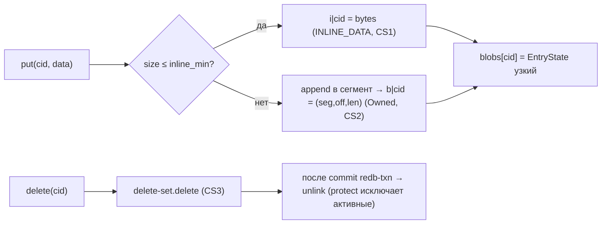

---

## 11. Источники в коде (для перепроверки)

| Область | Файл | Ключевые места |
|---|---|---|
| Main actor / finalize | `iroh-blobs/src/store/fs.rs` | 200-257, 1012-1116 (finish_import) |
| redb-схема / inline-split | `iroh-blobs/src/store/fs/meta.rs`, `meta/tables.rs` | tables 7-15; meta 373-436, 785-856 |
| EntryState / locations | `iroh-blobs/src/store/fs/entry_state.rs` | 16-23, 108-115, 161-183 |
| BaoFile state-machine | `iroh-blobs/src/store/fs/bao_file.rs` | 54-82, 161-192, 299-523, 668-695 |
| Inline-пороги / batch | `iroh-blobs/src/store/fs/options.rs` | 51-78 (InlineOptions), 81-102 (BatchOptions) |
| Частичные / sparse | `iroh-blobs/src/store/util/{partial_mem_storage,sparse_mem_file,size_info}.rs` | — |
| Import | `iroh-blobs/src/store/fs/import.rs` | 60-110, 192-352, 372-491 |
| Entity-manager | `iroh-blobs/src/store/fs/util/entity_manager.rs` | 28-250 |
| Delete-set / GC | `iroh-blobs/src/store/fs/delete_set.rs`, `store/gc.rs` | ds 19-149; gc 34-131 |
| Транспорт (сам iroh) | `iroh/src/{endpoint,relay,net_report}.rs` | — (P2P/QUIC, не storage) |

---

## 12. Transfer/API-слой — глубокий разбор #2 (как данные движутся к/от диска)

> 2-й проход (слой `789f904`): прошлый разбор покрыл `store/fs` (диск). Здесь — **transfer/API**:
> как блоб запрашивается диапазонами, проверяется на лету, стримится с диска и тянется из нескольких
> источников. Это прямой чертёж нашего **resumable resilver / verified Bitswap-fetch / read-off-disk**.

### Tr1. Chunk-range запрос: тянуть только нужные диапазоны

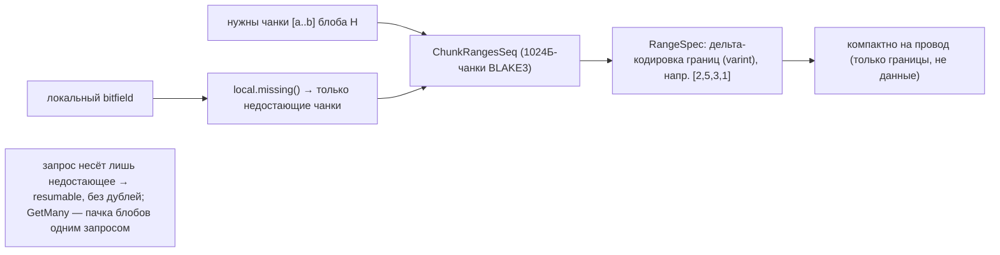

### Tr2. Incremental verified-streaming decode (проверка на лету)

```mermaid
sequenceDiagram
    participant P as provider
    participant D as ResponseDecoder (получатель)
    participant ST as локальный store
    P->>D: поток BAO: [size 8Б | parent-хэши 64Б | leaf-чанки]
    loop по мере прихода
        D->>D: проверить чанк по BLAKE3-дереву ↔ корневой хэш
        alt чанк валиден
            D->>ST: записать (verified) + обновить bitfield
        else несовпадение
            D->>P: оборвать поток (провайдер прислал мусор)
        end
    end
    note over D: верификация ПО ХОДУ → нет «скачали 1ГБ, потом не сошёлся хэш»
```

### Tr3. Observer: реактивная доступность (diff-only)

```mermaid
flowchart LR
    SUB["ObserveRequest(H, ranges)"] --> PROV["provider: store.observe(H).stream()"]
    PROV --> INIT["отдать начальный bitfield"]
    INIT --> LOOP{"появились новые чанки?"}
    LOOP -->|да| DIFF["послать ТОЛЬКО diff (bitfield.diff: новые диапазоны)"]
    DIFF --> LOOP
    LOOP -->|"подписчик ушёл"| END["закрыть"]
    note["подписка на доступность блоба; шлём только дельту → дёшево (progress, координация GC)"]
```

### Tr4. Multi-source download: missing-only + параллель + fallback

```mermaid
flowchart TB
    DL["DownloadRequest(H)"] --> DISC["ContentDiscovery: поток провайдеров"]
    DISC --> POOL["ConnectionPool.get_or_connect (переиспользовать QUIC)"]
    POOL --> LM["local_for_request → local.missing()"]
    LM --> EXE["execute_get: запросить ТОЛЬКО missing у провайдера"]
    EXE --> OK{"успех?"}
    OK -->|да| ACC["progress += local_bytes; PartComplete"]
    OK -->|нет| NEXT["следующий провайдер (fallback)"]
    NEXT --> POOL
    SPLIT["SplitStrategy::Split → per-child/per-hash задачи (до 32 параллельно)"] -.-> EXE
    note["тянуть недостающее из НЕСКОЛЬКИХ источников, дедуп по bitfield, fallback при отказе"]
```

### Tr5. Serve off-disk: export_bao стримит verified-диапазон

```mermaid
flowchart LR
    GET["handle_get(H, ranges)"] --> EXP["store.export_bao(H, ranges)"]
    EXP --> READ["читать data + outboard со store (redb/файлы)"]
    READ --> ITEMS["поток EncodedItem: Size → Parent → Leaf → Done"]
    ITEMS --> QUIC["write в QUIC-стрим; flow-control = естественный backpressure"]
    note["сервер читает только запрошенные диапазоны + хэши дерева; offset>0 → обход hashseq"]
```

### Новые идеи (2-й проход)

| # | Идея | Где у iroh-blobs | Берём? | Фаза | Влияние |
|---|---|---|---|---|---|
| 86 | **★ Chunk-range request-протокол** (тянуть только `[a..b]`; compact delta-encoded RangeSpec; `missing()`) | `protocol/range_spec.rs:23-452` | ✅ да | **3/4** | partial-fetch для resilver/Bitswap: «дай чанки X», не весь блок; resumable |
| 87 | **★ Incremental verified-streaming decode** (проверять каждый чанк на приёме, fail-fast на мусоре) | `get.rs:533`, `bao_tree` | ✅ да | **3/4** | верификация по ходу; corrupt-источник обрывается сразу (≈ Ч2/3 с outboard) |
| 88 | **★ Observer: diff-only обновления доступности** (подписка, шлём только новые диапазоны) | `provider.rs:627`, `api/proto/bitfield.rs:188` | ✅ да | **4/5** | реактивный progress + координация GC/resilver; дёшево (только дельта) |
| 89 | **★ Multi-source download: missing-only + split + pool + fallback** | `api/downloader.rs:440-549` | ✅ да | **3/4** | тянуть недостающее из НЕСКОЛЬКИХ дисков/пиров параллельно, дедуп по bitfield |
| 90 | **★ Serve verified-range off-disk** (export_bao: Size\|Parent\|Leaf поток + QUIC flow-control backpressure) | `provider.rs:596`, `api/blobs.rs:1129` | ✅ да | **4** | стрим запрошенного диапазона с диска + естественный backpressure |

### Конвергенция 2-го прохода (не новые строки)
- **hashseq / collection** (крупный объект = последовательность хэшей блоков + meta-блоб) ⟷ IPFS UnixFS DAG (у нас нативно).
- **batch / temp-tag scope** (защита от GC во время длинной операции) ⟷ protect-handle (#84) / pin.
- **mem store** (тот же `export_bao` API) ⟷ backend-абстракция (#45) + hot-tier.
- **export streaming** ⟷ diskless-stream resilver (Redis #69); #90 добавляет verified-range + flow-control.

> Замечание: #86–90 — на стыке **storage и networking**. Они про то, как тела движутся к/от диска
> (resumable resilver, verified read-off-disk), поэтому в этом каталоге; сетевые аспекты — также в
> [NETWORKING-SYNTHESIS](../Network/NETWORKING-SYNTHESIS.md).

---

> **Резюме для проекта.** iroh-blobs — 14-й прототип и **самый близкий архитектурно**: redb-индекс +
> файлы, content-addressed, Rust — наш стек. Он подтверждает базовый выбор и даёт зрелые
> lifecycle-абстракции: inline-split (#80), per-key актор (#83), двухфазный delete-set (#84),
> bitfield+spillover для докачки (#81/#82), verified streaming (#79, задел Ч2/3). Чего у него нет —
> **шардинг/HRW/R=2/resilver** — это наш Pool, а **pack-сегменты** заменяют его файл-на-блоб (масштаб
> 3,8 млрд). См. [STORAGE-IDEAS-SYNTHESIS.md](STORAGE-IDEAS-SYNTHESIS.md),
> [[dragonfly-storage-hdd-ssd.md]] (tiered, packing), [[pebble-storage-hdd-ssd.md]] (inline, GC),
> [Feynman](../../Feynman/README.md).
