# Apache Kafka Storage — как Kafka работает с HDD/SSD (DDD-разбор исходников)

> Исследование исходников **apache/kafka** (`Vendor/kafka`, свежий слой, commit `6944bce` от
> 2026-06-09). Все факты — с ссылками `файл:строка`, проверены в коде.

Kafka — распределённый **сегментированный append-only лог** (Java). Это **каноничная версия наших
pack-сегментов** → **очень сильная валидация дизайна**: партиция = последовательность сегментов
(`baseOffset.log` + `.index` + `.timeindex`), активный сегмент **дописывается** и **роллится** по
size/time/index-full; sparse mmap-индекс; опора на **page-cache** (без app-кэша); retention =
**удаление целых сегментов**; per-batch **CRC** + torn-tail recovery; **recovery-point** для быстрого
рестарта; preallocation. Всё это мы уже приняли независимо — Kafka подтверждает.

Genuinely **новое/острее** (берём):

1. **★ Zero-copy sendfile** (`FileChannel.transferTo`) — отдавать байт-диапазон сегмента
   **page-cache → сокет** без копии в user-space.
2. **★ Durability через репликацию + recovery-point, НЕ fsync-на-запись** — не fsync'ить каждый блок;
   durability = R реплик + page-cache writeback + flush на seal/периодически + recovery-point checkpoint
   + per-batch CRC.
3. **★ LazyIndex (отложенный mmap) + warm-tail binary search** — индекс неактивного сегмента грузить
   **лениво** (быстрый старт при тысячах сегментов); бинарный поиск приоритезирует «горячий хвост».

> Контекст: Kafka — лучшая в индустрии валидация нашего data-tier (append-only сегменты + sparse
> индекс + page-cache + whole-segment retention + per-batch CRC). Берём 3 приёма выше; остальное —
> подтверждение уже принятого. Log-compaction (key-based) **не берём** (content-addressed, нет
> key-update).

---

## 1. Bounded Contexts

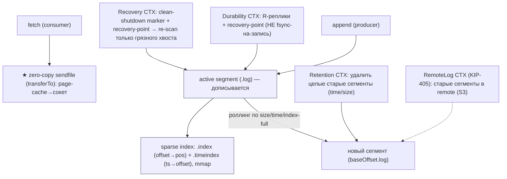

| Контекст | Ответственность | Файлы |
|---|---|---|
| **LogSegment / LocalLog** | сегмент (.log+.index+.timeindex), append, роллинг | `storage/internals/log/{LogSegment,LocalLog,UnifiedLog}.java` |
| **Sparse index** | offset/time индексы, mmap, binary search, lazy | `storage/internals/log/{OffsetIndex,TimeIndex,AbstractIndex,LazyIndex}.java` |
| **Zero-copy serve** | transferTo (sendfile) сегмента в сокет | `clients/.../record/internal/{FileRecords,TransferableRecords}.java` |
| **Durability/Recovery** | recovery-point, flush, clean-shutdown, CRC | `LocalLog.java`, `LogManager.java`, `CleanShutdownFileHandler.java` |
| **Retention** | удаление целых сегментов по time/size | `UnifiedLog.java` (deleteOldSegments) |
| **RemoteLog (tiered)** | offload старых сегментов в remote | `server/log/remote/storage/RemoteLogManager.java` |

---

## 2. Архитектурные диаграммы (Mermaid)

### K1. Сегментный append-only лог (= наши pack-сегменты)

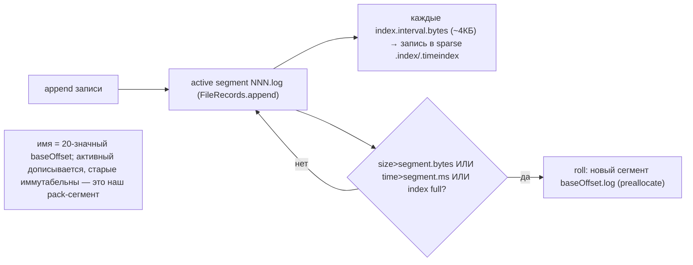

### K2. Zero-copy sendfile: отдать диапазон без копий

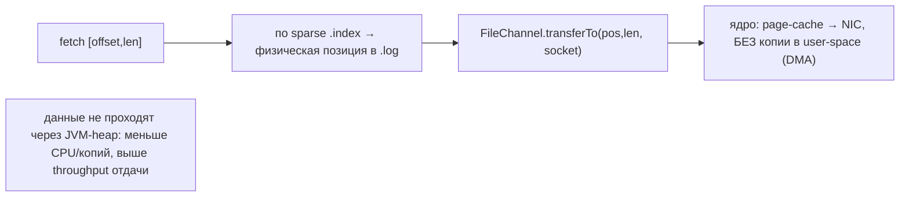

### K3. Durability через репликацию, не fsync-на-запись

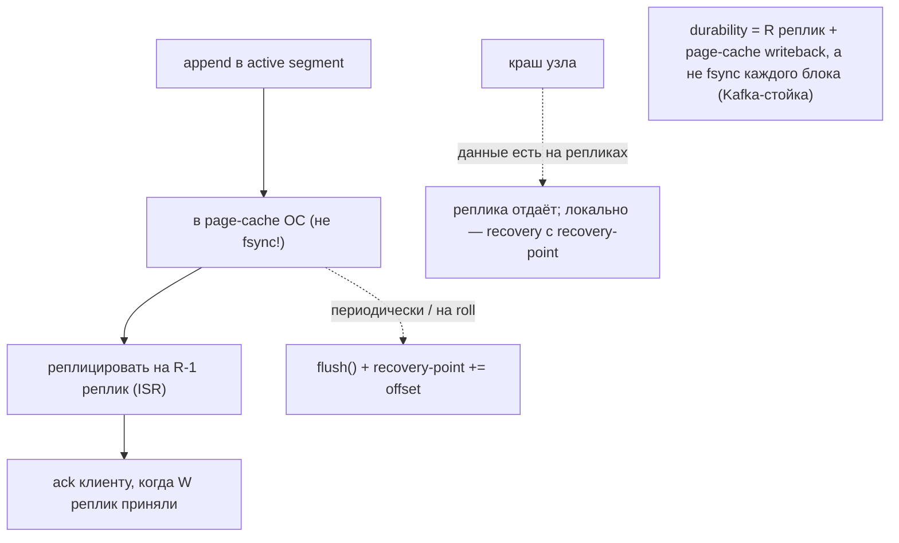

### K4. Recovery: clean-shutdown + recovery-point → грязный хвост

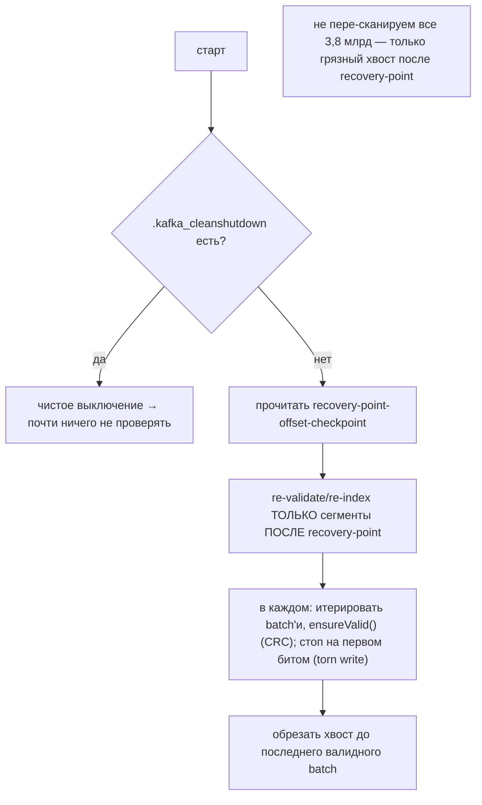

### K5. LazyIndex + warm-tail (быстрый старт, cache-friendly)

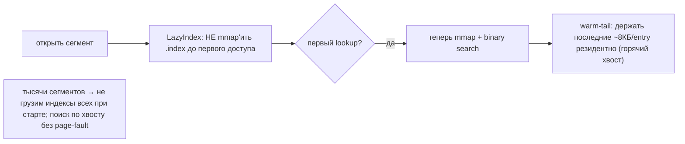

---

## 2-bis. Файловая система: раскладка и потоки (Mermaid)

> Kafka на диске: партиция = каталог; в нём сегменты по `baseOffset` (`.log`+`.index`+`.timeindex`)
> + checkpoint-файлы (`recovery-point-offset-checkpoint`, `replication-offset-checkpoint`).

### FS1. Раскладка партиции на диске

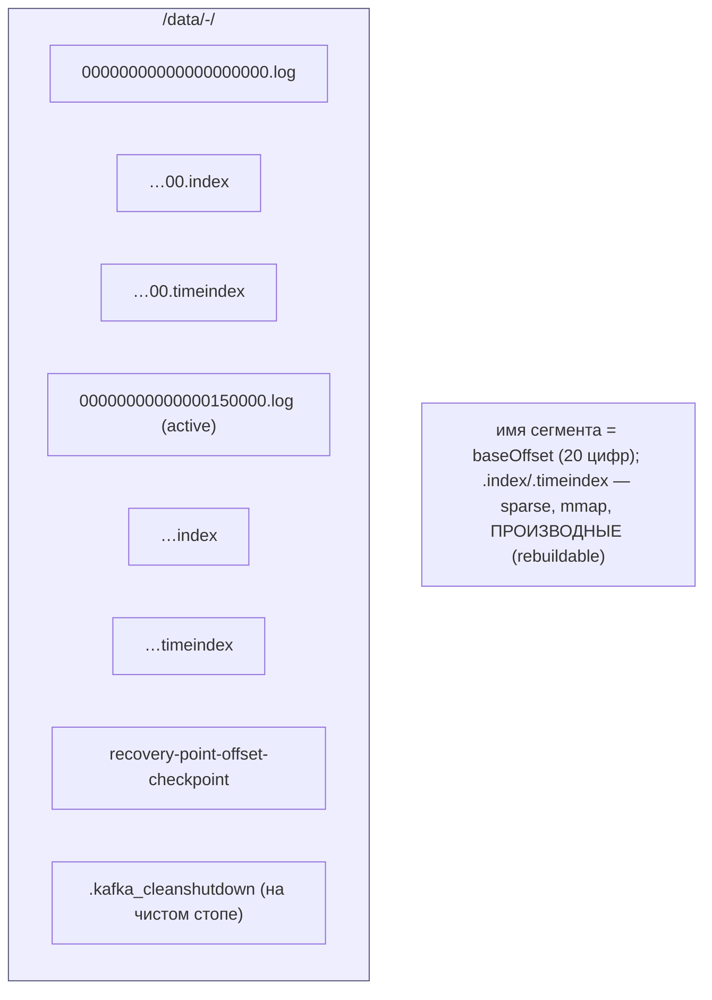

### FS2. Append + sparse index + роллинг

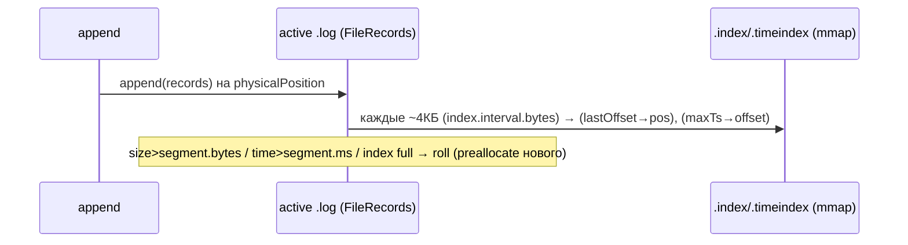

### FS3. Fetch: index lookup → zero-copy transferTo

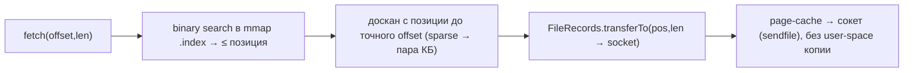

### FS4. Retention: удалить целые сегменты (rename→delete)

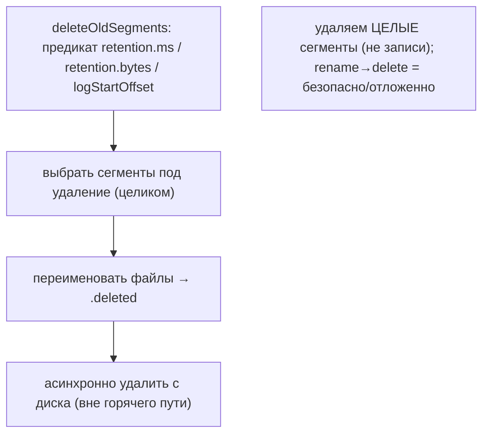

---

## 3. Ubiquitous Language (термины Kafka)

| Термин Kafka | Значение | Наш аналог |
|---|---|---|
| **segment** (.log) | иммутабельный append-only файл данных | **pack-сегмент** (наш!) |
| **baseOffset naming** | имя = первый offset (20 цифр) | seg.NNNN |
| **.index / .timeindex** | sparse mmap offset→pos / ts→offset | sparse Summary (#50) + индекс |
| **active segment** | текущий, дописывается | active сегмент (active→sealed) |
| **roll** | создать новый сегмент по size/time | роллинг по segment_max_size |
| **recovery-point** | offset, до которого flush'нуто | flushOffset / checkpoint |
| **clean-shutdown marker** | флаг чистого стопа | (новое — берём) |
| **transferTo (sendfile)** | zero-copy файл→сокет | serve off-disk без копий |
| **per-batch CRC32C** | контроль целостности batch'а | per-micro checksum (#34) |
| **page-cache reliance** | без app-кэша, опора на ОС | наша гигиена page-cache (#63) |
| **log compaction** | latest-per-key | ⚠️ не наше (нет key-update) |

---

## 4. Сегментный лог + sparse-индекс (валидация)

`LogSegment` (`:57-66,251-281`): сегмент = `.log` (`FileRecords`) + `.index` + `.timeindex`; имя =
20-значный `baseOffset` (`LogFileUtils`). `append(records)` пишет в FileChannel, **каждые
`index.interval.bytes` (~4КБ)** добавляет sparse-запись в индексы (`:261,272-273`). Роллинг
(`shouldRoll`, `:168-174`): `size>segment.bytes` ИЛИ `time>segment.ms` ИЛИ индекс полон ИЛИ
offset-overflow. **OffsetIndex** (`:33-159`): 8Б-запись (rel-offset+pos), **mmap**, binary search;
**TimeIndex** (12Б: ts+offset). Индексы **производные** (rebuild при recovery, `LogSegment.recover`
`:483-499`). Preallocation сегмента и индекса (`FileRecords:444-495`, `AbstractIndex:110-114`).

> Для нас: **прямая валидация** pack-сегментов (#data-tier) + sparse-Summary (#50) + preallocation
> (#77) + производный/rebuildable индекс. Всё уже принято — Kafka подтверждает каноном.

---

## 5. Zero-copy sendfile (★ берём)

`FileRecords.writeTo` (`:291-302`): `destChannel.transferFrom(channel, position, count)` —
**`sendfile`-syscall**: байт-диапазон `.log` идёт **из page-cache прямо в сокет**, минуя JVM-heap.
`TransferableRecords`/`UnalignedFileRecords` (`:28-49`) — абстракция «набор, который можно перекинуть
в канал».

> Для нас: при отдаче блока/диапазона по сети (Bitswap/gateway) — **`sendfile`/`splice` региона
> сегмента в сокет без копии в user-space**. Острее нашего serve-off-disk (iroh #90, там был
> verified-decode-поток): для **непрозрачного** уже-проверенного диапазона — чистый zero-copy. Меньше
> CPU/копий → выше throughput отдачи на 60 HDD.

## 6. Durability через репликацию + recovery-point (★ берём)

Kafka **не fsync'ит каждую запись**: append идёт в **page-cache**, durability обеспечивается
**репликацией на ISR** (ack по W репликам) + периодическим flush/на roll. `LocalLog` (`:78-79,241-276`):
`recoveryPoint` (offset первой несброшенной записи), `markFlushed(offset)`, `flush(offset)` +
`flushDirIfExists`. `recovery-point-offset-checkpoint` (`LogManager:85,234-239`) переживает рестарт.
**Clean-shutdown marker** `.kafka_cleanshutdown` (`CleanShutdownFileHandler:36-89`) → при чистом стопе
recovery почти не нужен.

> Для нас: **стойка по durability**. У нас R=2/W=2 + recovery-point checkpoint + per-batch/micro CRC +
> torn-tail (flushOffset/eof #99) → можно **ослабить per-write fsync** (дорогой на HDD), flush'ить
> **на seal сегмента / периодически**, durability держать репликацией. Конфиг `fsync_policy:
> per-write | on-seal | periodic`. Главный выигрыш — throughput записи на 60 HDD.

## 7. Recovery (быстрый старт) + retention + tiered + LazyIndex

**Recovery** (`LogSegment.recover` `:483-499`): итерировать batch'и, `ensureValid()` (CRC), стоп на
первом битом → обрезать хвост; на старте **только сегменты после recovery-point** re-validate
(не все). **Retention** (`UnifiedLog.deleteOldSegments` `:1839-1988`): удалять **целые** сегменты по
`retention.ms`/`retention.bytes`/logStartOffset; rename→`.deleted`→async-delete. **Tiered** (KIP-405,
`RemoteLogManager`): старые сегменты в remote (S3), активный всегда локально. **LazyIndex**
(`LazyIndex:30-188`): индекс неактивного сегмента **не mmap'ить до первого доступа** (быстрый старт при
тысячах сегментов); **warm-tail** (`AbstractIndex:331-389`): держать ~8КБ хвоста индекса резидентно
(cache-friendly поиск без page-fault).

> Для нас: recovery-point/clean-shutdown ⟷ наш flushOffset+checkpoint (валидация). Whole-segment
> retention ⟷ time-bucketed drop (#92). Tiered ⟷ cold_path/deep-storage. **★ Новое: LazyIndex +
> warm-tail (#112)** — на 3,8 млрд блоков / тысячах сегментов: per-segment индекс **грузить лениво** +
> бинарный поиск по горячему хвосту → быстрый старт и меньше page-fault'ов.

---

## 8. Философия и вывод XFS/ZFS

Kafka — образец «**sequential append + page-cache + sendfile**» на голом FS (XFS), durability
репликацией, а не CoW/checksum ФС. Это **ровно наш ADR 0001** (XFS+JBOD, app-репликация). ZFS под
Kafka дал бы лишний слой (CoW поверх append-лога) — анти-паттерн. Kafka подтверждает: для append-only
сегментов нужен тонкий FS + грамотная работа с page-cache, а не «умная» ФС.

---

## 9-bis. Снипеты кода (реальные выдержки + объяснение)

> Короткие выдержки из исходников Kafka (проверены, `файл:строка`). Слева — механизм, справа — как
> ложится на наш дизайн.

### CS1. Zero-copy sendfile: отдать диапазон без копий (#110)

```java
// clients/.../common/record/internal/FileRecords.java:291 — writeTo()
public int writeTo(TransferableChannel destChannel, int offset, int length) {
    long position = start + offset;
    int count = Math.min(length, oldSize - offset);
    return (int) destChannel.transferFrom(channel, position, count);  // = sendfile syscall
}
```

**Объяснение:** отдача диапазона `.log` в сетевой канал — **`transferFrom` → `sendfile`**: байты идут
из page-cache в сокет **внутри ядра** (DMA), минуя JVM-heap. Ноль user-space копий.
→ **Нам:** отдавать проверенный непрозрачный диапазон сегмента по сети `sendfile`/`splice` (#110).

### CS2. Sparse index: запись «каждые N байт» (#112 / Summary)

```java
// storage/.../log/OffsetIndex.java:143 — append()
if (entries() == 0 || offset > lastOffset) {
    mmap().putInt(relativeOffset(offset));   // 4Б: относительный offset (экономия места)
    mmap().putInt(position);                  // 4Б: физическая позиция в .log
    incrementEntries(); lastOffset = offset;  // только МОНОТОННО растущие — append-only
}
```

**Объяснение:** индекс **разрежённый** (запись не на каждое сообщение, а раз в `index.interval.bytes`),
**mmap**, по 8Б на запись (relative-offset + позиция), строго монотонный append. Бинарный поиск по mmap.
→ **Нам:** ровно наша sparse-Summary (#50) поверх redb — храним «в какую область сегмента», 8-байтовые
записи, mmap, lazy-load (#112).

### CS3. Recovery-point: помним «докуда сброшено» (#111)

```java
// storage/.../log/LocalLog.java:241 — markFlushed()
public void markFlushed(long offset) {
    if (offset > recoveryPoint) {           // recoveryPoint = первый НЕсброшенный offset
        updateRecoveryPoint(offset);
        lastFlushedTime.set(time.milliseconds());
    }
}
```

**Объяснение:** `recoveryPoint` двигается только вперёд при flush; durability — на репликах, fsync —
периодически. После краха re-validate **только сегменты после recoveryPoint** (а не весь лог).
→ **Нам:** recovery-point checkpoint → не fsync каждый блок (durability репликацией R=2), при старте
проверять лишь грязный хвост (#111).

### CS4 (диаграмма). Fetch: index lookup → zero-copy transferTo

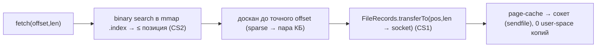

---

## 9. Извлечённые идеи для OpenZFS Daemon

| # | Идея | Где у Kafka | Берём? | Фаза | Влияние |
|---|---|---|---|---|---|
| 110 | **★ Zero-copy sendfile/transferTo** (отдать диапазон сегмента page-cache→сокет без user-space копии) | `FileRecords.java:291-302` | ✅ да | **4** | меньше CPU/копий при отдаче блоков по сети; острее serve-off-disk #90 для непрозрачного диапазона |
| 111 | **★ Durability через репликацию + recovery-point, НЕ fsync-на-запись** (flush на seal/периодически) | `LocalLog.java:78-276`, `LogManager.java:85`, `CleanShutdownFileHandler.java` | ✅ да | **1/5** | ослабить дорогой per-write fsync на HDD: durability = R=2 + recovery-point + CRC; рост throughput записи |
| 112 | **★ LazyIndex (отложенный mmap) + warm-tail binary search** | `LazyIndex.java:30-188`, `AbstractIndex.java:331-389` | ✅ да | **1** | быстрый старт при тысячах сегментов; cache-friendly поиск по горячему хвосту индекса |

### Конвергенция (подтверждает уже принятое — Kafka = каноничная валидация)
- **Сегментный append-only лог (baseOffset naming, roll по size/time/index-full)** ⟷ **наши pack-сегменты** (#data-tier).
- **Sparse offset+time index, mmap, binary search, производный/rebuildable** ⟷ sparse Summary (#50) + наш индекс.
- **Page-cache reliance (без app-кэша)** ⟷ гигиена page-cache (#63) + наш подход.
- **Whole-segment retention (time/size), rename→async-delete** ⟷ time-bucketed drop (#92) + two-phase delete (#84).
- **Per-batch CRC32C + torn-tail recovery (стоп на первом битом, обрезать хвост)** ⟷ per-micro checksum (#34) + flushOffset/eof (#99).
- **Recovery-point / clean-shutdown fast restart** ⟷ flushOffset + checkpoint-rollup (#93).
- **Preallocation сегмента/индекса** ⟷ async pre-grow (#77).
- **Tiered (KIP-405 remote log)** ⟷ cold_path/deep-storage (Druid #57).
- **Log compaction (key-based)** ⟷ **НЕ берём** (content-addressed, нет key-update).

### Главные новые заимствования
**#110 sendfile** (zero-copy отдача) и **#111 durability-via-replication** (ослабить per-write fsync —
важно для throughput на HDD) — самые ценные. **#112 LazyIndex + warm-tail** — быстрый старт на масштабе.
В остальном Kafka — **лучшая валидация** всего data-tier (append-only сегменты + sparse-индекс +
page-cache + whole-segment retention + per-batch CRC).

---

## 10. Источники в коде (для перепроверки)

| Область | Файл | Ключевые места |
|---|---|---|
| Сегмент/append/roll | `storage/internals/log/{LogSegment,LocalLog,UnifiedLog}.java` | Seg 57-66,168-174,251-281,483-499; Local 584-649; Unified 2135-2177 |
| Sparse index | `storage/internals/log/{OffsetIndex,TimeIndex,AbstractIndex,LazyIndex}.java` | OI 33-159; TI 56-214; AI 110-114,331-389; Lazy 30-188 |
| Zero-copy sendfile | `clients/.../record/internal/{FileRecords,TransferableRecords,UnalignedFileRecords}.java` | FR 291-302; UFR 45-49 |
| Durability/recovery | `LocalLog.java`, `LogManager.java`, `CleanShutdownFileHandler.java` | Local 78-79,241-276; Mgr 85,234-239; CS 36-89 |
| Retention | `UnifiedLog.java` | 1839-1988, 2083 |
| Record batch CRC | `clients/.../record/{RecordBatch,DefaultRecord,FileLogInputStream}.java` | RB 71-84; FLIS 64-94,163-170 |
| Tiered (remote) | `server/log/remote/storage/RemoteLogManager.java` | — (KIP-405) |
| Preallocation | `clients/.../record/FileRecords.java` | 444-495 |

---

> **Резюме для проекта.** Kafka — 20-й прототип и **каноничная валидация** нашего data-tier:
> сегментный append-only лог (= pack-сегменты), sparse mmap-индекс (= Summary), page-cache, whole-segment
> retention, per-batch CRC + torn-tail, recovery-point, preallocation — всё совпадает. Новое берём:
> **#110 zero-copy sendfile** (отдача без копий), **#111 durability-via-replication** (ослабить
> per-write fsync на HDD — durability репликацией + recovery-point + CRC), **#112 LazyIndex + warm-tail**
> (быстрый старт на масштабе). Log-compaction key-based — не наше. См.
> [STORAGE-IDEAS-SYNTHESIS.md](STORAGE-IDEAS-SYNTHESIS.md), [[hadoop-storage-hdd-ssd.md]] (JBOD/DataNode),
> [[scylladb-storage-hdd-ssd.md]] (sparse-Summary), [pack-segments (Feynman)](../../Feynman/pack-segments.md), [Feynman](../../Feynman/README.md).
