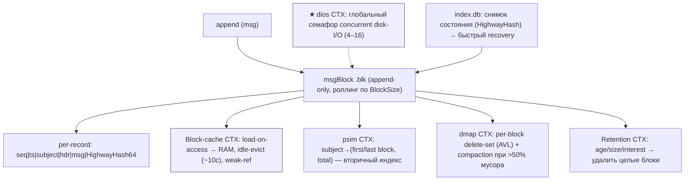
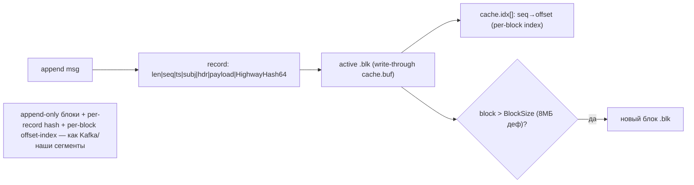
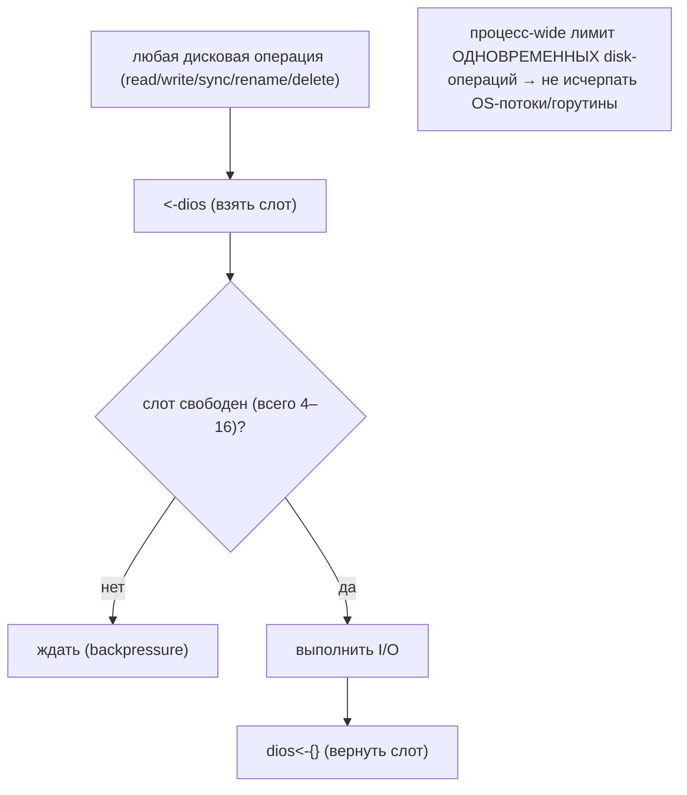
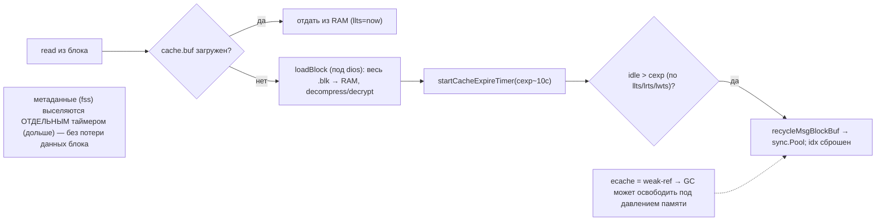
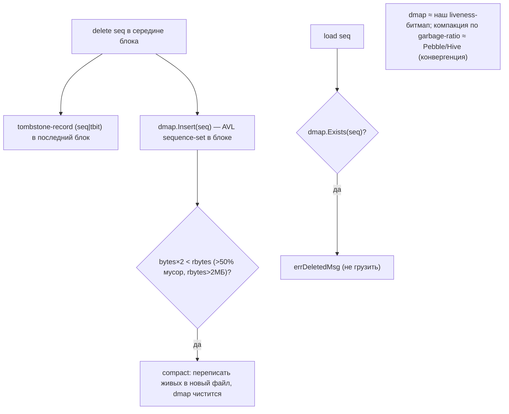
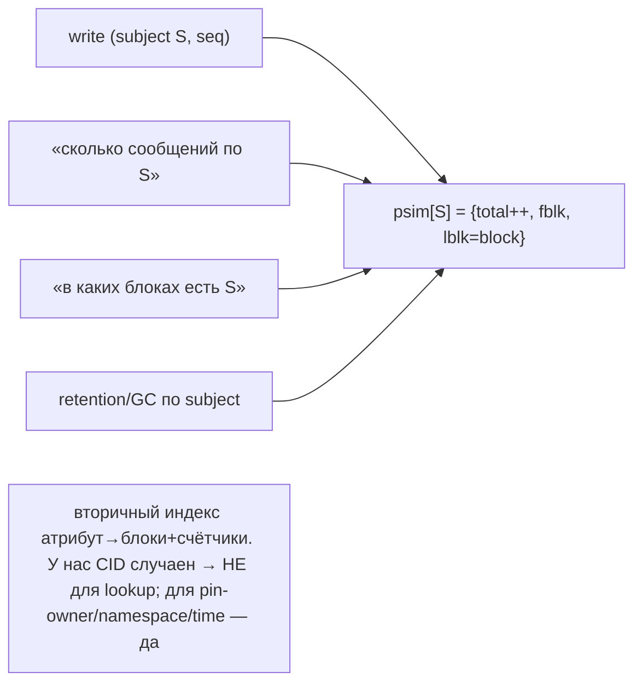
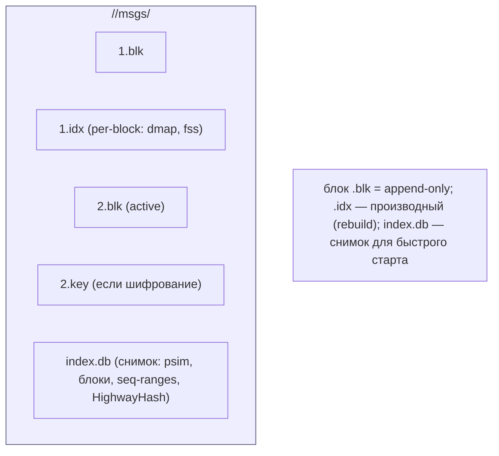
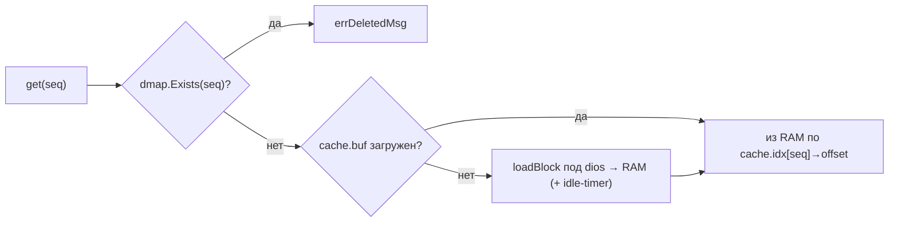
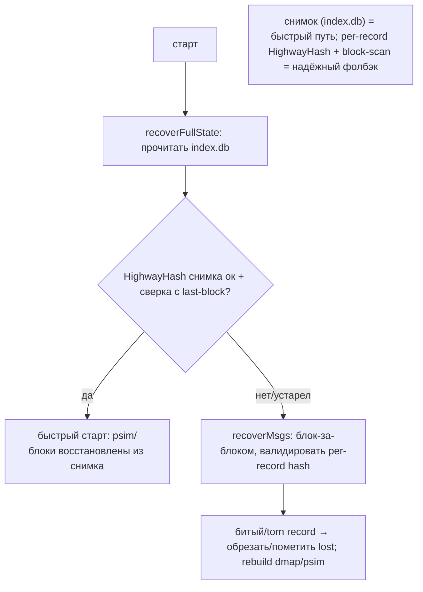

# NATS JetStream Storage — как nats-server работает с HDD/SSD (DDD-разбор исходников)

> Исследование исходников **nats-io/nats-server** (`Vendor/nats-server`, свежий слой, commit
> `c98d978` от 2026-06-09). Все факты — с ссылками `файл:строка`, проверены в коде.

NATS JetStream — persistent-слой брокера сообщений (Go). Его **filestore** (`server/filestore.go`,
~13.8к строк) — это **сегментный append-only msg-store**: поток = последовательность блоков
`<idx>.blk`, активный дописывается и роллится по размеру; per-block индекс; per-record checksum
(HighwayHash64); retention по age/size; периодический fsync; index.db = снимок состояния для быстрого
recovery. Это **очередной сегментный лог** → **тяжёлая конвергенция с Kafka** (уже разобран). Будем
честны: 80% совпадает. Genuinely **новое/острее** (берём):

1. **★ `dios` — глобальный семафор disk-I/O** — процесс-wide лимит **числа одновременных дисковых
   операций** (4–16 по ядрам) поверх любых per-disk пулов; защита от исчерпания OS-потоков/горутин.
2. **★ Block-cache с idle-eviction + weak-ref** — блок грузится в RAM **по доступу**, выселяется по
   **таймеру простоя** (~10с); метаданные (subject-state) кэшируются **отдельным** таймером; кэш —
   **слабая ссылка** (GC может освободить под давлением памяти).
3. **★ Per-attribute secondary index (psim)** — `subject → (first/last block, total)`: вторичный
   индекс «по атрибуту» → быстрый scan/GC/листинг по вторичному ключу (⚠️ не по CID).

> Контекст: NATS = сегментный лог как Kafka (валидация наших pack-сегментов). Берём 3 приёма выше;
> per-block delete-map (dmap), index.db-снимок, HighwayHash, fip/async-flush — **конвергенция** с
> liveness-bitmap / checkpoint-rollup / fsync_policy. subject-индекс по CID неприменим (CID случаен),
> но для **вторичных атрибутов** (pin-owner / namespace / время) — да.

---

## 1. Bounded Contexts



| Контекст | Ответственность | Файлы |
|---|---|---|
| **msgBlock** | блок `<idx>.blk`, append, роллинг, per-record hash | `server/filestore.go:220-270,7255-7301` |
| **Block-cache** | load-on-access, idle-evict, weak-ref | `filestore.go:273-279,6602-6748,8367-8508` |
| **psim / fss** | вторичный индекс по subject (global + per-block) | `filestore.go:168-172,195,239` |
| **dmap / compaction** | per-block delete-set + перепаковка | `filestore.go:254,6008-6186` |
| **Retention** | age/size/interest + per-subject limits | `filestore.go:5438-5500,6837-6953` |
| **index.db / recovery** | снимок состояния + block-by-block recovery | `filestore.go:1871-2159,11673-11916` |
| **dios** | глобальный disk-I/O семафор | `filestore.go:13151-13170` |

---

## 2. Архитектурные диаграммы (Mermaid)

### N1. Сегментный блок (= наши pack-сегменты / Kafka)



### N2. ★ dios: глобальный семафор disk-I/O



### N3. ★ Block-cache: load-on-access + idle-evict + weak-ref



### N4. dmap + компакция (per-block delete-set)



### N5. ★ psim: вторичный индекс по атрибуту



---

## 2-bis. Файловая система: раскладка и потоки (Mermaid)

> JetStream-поток на диске: каталог потока, в нём блоки `<idx>.blk` (+ `.idx` per-block, опц. `.key`
> для шифрования) + `index.db` (снимок состояния) + msgs/обновления.

### FS1. Раскладка потока на диске



### FS2. Запись record + flush (fip vs async)

```mermaid
sequenceDiagram
    participant P as append
    participant C as cache.buf (write-through)
    participant D as <idx>.blk
    P->>C: record (HighwayHash на seq|ts|subj|hdr|msg)
    alt fip (SyncAlways)
        C->>D: flushPendingMsgsLocked (под dios) сразу
    else async (деф)
        Note over C: батч; фон-flusher сбрасывает; fsync по SyncInterval (~2мин)
    end
    Note over D: needSync=true → syncBlocks() позже fd.Sync() только изменённых блоков
```

### FS3. Чтение: dmap-check → cache → loadBlock (dios)



### FS4. Recovery: index.db → fallback block-by-block



---

## 3. Ubiquitous Language (термины NATS JetStream)

| Термин NATS | Значение | Наш аналог |
|---|---|---|
| **msgBlock / .blk** | append-only блок сообщений | pack-сегмент |
| **cache.idx[]** | per-block seq→offset | offset-индекс сегмента |
| **psim (per-subject info)** | вторичный индекс subject→блоки | secondary attr-индекс (⚠️ не CID) |
| **fss / SimpleState** | per-block subject-state | per-segment метаданные |
| **dmap** | per-block delete-set (AVL) | liveness-битмап |
| **tombstone (tbit)** | запись-надгробие удаления | tombstone GC |
| **cache idle-evict** | выселение блока из RAM по простою | NVMe/RAM body-cache + cooling |
| **ecache (weak-ref)** | слабая ссылка на кэш | GC-friendly кэш |
| **dios** | глоб. семафор disk-I/O | per-disk пул + глоб. лимит |
| **index.db** | снимок состояния (HighwayHash) | checkpoint-rollup манифеста |
| **HighwayHash64** | быстрый хэш целостности | per-micro checksum (быстрее CRC) |
| **fip / async-flush** | flush-in-place vs батч | fsync_policy (Kafka #111) |

---

## 4. Сегментный блок + индекс + checksum (конвергенция с Kafka)

`msgBlock` (`:220-270`): файл `<idx>.blk`, append-only; запись (`:7255-7301`) = `len|seq|ts|subj_len|
subject|[hdr]|payload|HighwayHash64(8Б)`; per-block `cache.idx[]` (seq→offset); роллинг при
`> BlockSize` (деф 8МБ; 4МБ для workqueue; 2МБ cap для шифрованных). flush: `fip` (сразу) или async
(батч, fsync по `SyncInterval` ~2мин). **Это сегментный лог как Kafka** — валидация pack-сегментов.

> Для нас: подтверждает append-only сегменты + per-record checksum + per-block offset-индекс. Новое
> по мелочи — **HighwayHash64** вместо CRC32 (быстрее ~10×, криптостойче) — кандидат для нашего
> checksum тел/micro (берём как тюнинг, не отдельная строка).

## 5. ★ dios — глобальный семафор disk-I/O

`dios` (`:13151-13170`) — буферизованный канал-семафор: при старте `nIO = min(16, max(4, GOMAXPROCS))`
(если ядер >32 → ~половина). **Каждая** дисковая операция (read/write/sync/rename/delete) берёт слот
`<-dios` и возвращает `dios<-{}`; нет слота → ждёт (backpressure). Это **процесс-wide лимит числа
одновременных blocking-I/O** — против исчерпания OS-потоков/горутин.

> Для нас: у нас per-disk worker-пулы (inflight 1–4) + Forseti. **dios добавляет глобальный backstop**:
> суммарное число одновременных disk-операций по всем 60 дискам ограничить (не дать фону открыть тысячи
> параллельных I/O при шторме). Простой, дешёвый предохранитель **поверх** per-disk пулов и Forseti.

## 6. ★ Block-cache: load-on-access + idle-evict + weak-ref

`cache` (`:273-279`): при чтении блок целиком грузится в RAM (`loadBlock` под dios, `:8367-8414`),
decompress/decrypt; ставится `startCacheExpireTimer(cexp~10с, :8501)`. Выселение (`:6602-6748`): если
`idle > cexp` (по `llts`/`lrts`/`lwts`) → `recycleMsgBlockBuf` (в `sync.Pool`), `idx` сброшен.
**Метаданные (fss)** выселяются **отдельным** таймером (`fexp`, дольше) — данные блока ушли, subject-
state ещё жив. `ecache` (`elastic.Pointer`, `:247`) — **слабая ссылка**: GC может освободить кэш под
давлением памяти, таймеры доберут.

> Для нас: усиливает NVMe/RAM body-cache (#23) + cooling (#74): **per-block idle-timer eviction**
> (загрузил по доступу, выкинул после простоя) + **weak-ref** (GC-friendly, не пиннить буферы) +
> **раздельные таймеры для данных и метаданных** (метаданные блока/сегмента держим дольше тел). Тонко
> управляет RAM на 60 дисках без явного LRU-учёта.

## 7. dmap, retention, recovery, шифрование (конвергенция)

**dmap** (`:254`, AVL sequence-set): per-block множество удалённых seq; проверка `dmap.Exists` перед
load (`:8539`); компакция (`:6008-6186`) при `bytes×2 < rbytes` (>50% мусор, `rbytes>2МБ`) — переписать
живых, dmap чистится. ≈ наш **liveness-битмап + garbage-ratio GC** (Pebble/Hive). **Retention**
(`:5438-6953`): age/size/per-subject + interest-based (удалить, когда все consumer'ы ack) → удаление
**целых блоков**. **Recovery** (`:1871-2159`): `index.db` (снимок + HighwayHash) → быстрый старт,
фолбэк block-by-block с валидацией per-record hash, torn-record → обрезать/lost. **Compress** (S2) +
**encrypt** (ChaCha/AES, per-block key, 2МБ cap).

> Для нас: всё **конвергенция** — dmap ⟷ liveness-битмап; компакция-по-garbage-ratio ⟷ Pebble #...;
> whole-block retention ⟷ time-bucketed drop (#92); interest-based ⟷ декларативные drop-rules (Druid #55);
> index.db ⟷ checkpoint-rollup (#93) + recovery-point (Kafka); per-record hash + torn ⟷ #34/#99;
> compress/encrypt per-block ⟷ опц. zstd (#5) + Часть «шифрование at-rest» (не Ч1).

## 8. ★ psim — вторичный индекс по атрибуту

`psi` (`:168-172`): `{total, fblk (first block), lblk (last block)}`; `psim` (`:195`) =
`SubjectTree[psi]` — глобальный индекс **subject → в каких блоках есть + счётчик**; per-block `fss`
(`:239`) — subject-state в блоке. Даёт быстрый «сколько по subject», «в каких блоках», retention/GC
по subject — **без полного скана**.

> Для нас: lookup по CID — это primary (redb), subject-style индекс по CID **неприменим** (CID
> случаен). НО **вторичный индекс по атрибуту** (`pin-owner → сегменты`, `namespace → сегменты`,
> `ingest-окно → сегменты`) даёт **таргетный GC/scrub/листинг** без обхода 3,8 млрд. ⚠️ Опционально,
> только для вторичных атрибутов; уточняет min/max-skip (#91) точным match-индексом и namespacing (#16).

---

## 9. Философия и вывод XFS/ZFS

NATS filestore — снова «**append-only блоки + page-cache + периодический fsync + app-кэш с
выселением**» на голом FS. Durability в кластере — Raft-репликацией (как Kafka durability репликацией,
#111), а не CoW-ФС. Это **ADR 0001** (XFS+JBOD). Уникальное — `dios` (глоб. лимит I/O) и idle-evict
block-cache: тонкая работа с RAM/I/O на одном узле без «умной» ФС. ZFS под этим — лишний слой.

## 9-bis. Снипеты кода (реальные выдержки + объяснение)

### CS1. dios: глобальный disk-I/O семафор (#113)

```go
// server/filestore.go:13151
var dios chan struct{}
func init() {
    mp := runtime.GOMAXPROCS(-1)
    nIO := min(16, max(4, mp)); if mp > 32 { nIO = max(16, min(mp, mp/2)) }
    dios = make(chan struct{}, nIO)
    for i := 0; i < nIO; i++ { dios <- struct{}{} }   // перед disk-op: <-dios; после: dios<-{}
}
```

**Объяснение:** процесс-wide семафор (4–16 слотов) на одновременные disk-операции. → наш **глобальный
`dios`-семафор (#113)** поверх per-disk пулов — backstop против исчерпания OS-потоков при I/O-шторме.

### CS2. Block-cache: idle-таймер выселения (#114)

```go
// server/filestore.go:6590
func (mb *msgBlock) resetCacheExpireTimer(td time.Duration) {
    if td == 0 { td = mb.cexp + 100*time.Millisecond }      // дефолт ~10с простоя
    if mb.ctmr == nil { mb.ctmr = time.AfterFunc(td, mb.tryExpireCache) } else { mb.ctmr.Reset(td) }
}
```

**Объяснение:** после загрузки блока ставится таймер; простой → буфер в `sync.Pool` (+ weak-ref для GC).
→ наш **idle-evict block-cache + weak-ref (#114)** — RAM-управление без явного LRU.

### CS3. psim: вторичный индекс по атрибуту (#115)

```go
// server/filestore.go:168
type psi struct { total uint64; fblk uint32; lblk uint32 }   // subject → (счётчик, first/last block)
// :4947
info, _ = fs.psim.Insert(stringToBytes(subj), psi{total: 1, fblk: index, lblk: index})
```

**Объяснение:** `subject → (total, first-block, last-block)` — быстрый scan/GC по subject без обхода всех
блоков. → наш **вторичный индекс по атрибуту (#115)** (pin-owner/namespace/время; ⚠️ не для CID).

---

## 10. Извлечённые идеи для OpenZFS Daemon

| # | Идея | Где у NATS | Берём? | Фаза | Влияние |
|---|---|---|---|---|---|
| 113 | **★ Глобальный disk-I/O семафор (`dios`)** — процесс-wide лимит одновременных disk-операций (поверх per-disk пулов) | `filestore.go:13151-13170` | ✅ да | **5** | дешёвый backstop против исчерпания OS-потоков/горутин при I/O-шторме на 60 дисках |
| 114 | **★ Block-cache: load-on-access + idle-timer eviction + weak-ref; метаданные отдельным таймером** | `filestore.go:6602-6748,8367-8508` | ✅ да | **1/4** | управлять RAM на 60 дисках без явного LRU; GC-friendly; метаданные держим дольше тел |
| 115 | **★ Вторичный индекс по атрибуту (psim)** — `attr→(блоки, счётчик)` для таргетного GC/scrub/листинга | `filestore.go:168-172,195` | ⚠️ опц. | **5** | по pin-owner/namespace/времени — без обхода 3,8 млрд; ⚠️ не для CID-lookup |

### Конвергенция (NATS = ещё одна валидация сегментного лога, не новые строки)
- **Сегментный append-only блок + per-block offset-индекс + роллинг** ⟷ pack-сегменты + Kafka (#110-112).
- **dmap (delete-set) + компакция по garbage-ratio** ⟷ liveness-битмап + Pebble-GC + minor/major (Hive #105).
- **whole-block retention (age/size) + interest-based** ⟷ time-bucketed drop (#92) + Druid drop-rules (#55).
- **index.db (снимок + checksum) → быстрый recovery, фолбэк block-scan** ⟷ checkpoint-rollup (#93) + recovery-point (Kafka).
- **per-record HighwayHash + torn-record recovery** ⟷ per-micro checksum (#34) + flushOffset/eof (#99); HighwayHash — тюнинг (быстрее CRC).
- **fip vs async-flush (SyncInterval ~2мин)** ⟷ fsync_policy (Kafka #111).
- **per-block compress (S2) + encrypt (2МБ cap)** ⟷ опц. zstd (#5); encryption at-rest — не Ч1.
- **durability Raft-репликацией** ⟷ durability-via-replication (#111).

### Главные новые заимствования
**#113 dios** (глобальный I/O-семафор) и **#114 idle-evict block-cache + weak-ref** — самые ценные,
тонко рулят I/O/RAM на 60 дисках. **#115 psim** — опц. вторичный индекс для таргетного GC. В остальном
NATS = **повторная валидация** сегментного лога (как Kafka), новых структурных идей мало.

---

## 11. Источники в коде (для перепроверки)

| Область | Файл | Ключевые места |
|---|---|---|
| msgBlock / record | `server/filestore.go` | 220-270, 7255-7301 (record+HighwayHash) |
| Block size / роллинг | `server/filestore.go` | 355-368, 1437-1495 |
| psim / fss | `server/filestore.go` | 168-172, 195, 239, 11420+ |
| Block-cache / idle-evict | `server/filestore.go` | 273-279, 6602-6748, 8367-8508 |
| weak-ref (ecache) | `server/filestore.go` | 247, 8505 |
| dmap / tombstone | `server/filestore.go` | 254, 7152-7162, 5900 |
| Компакция | `server/filestore.go` | 6008-6186 |
| Retention | `server/filestore.go` | 5438-5500, 6837-6953 |
| Sync / fip | `server/filestore.go` | 64-69, 7709-7904 |
| dios | `server/filestore.go` | 13151-13170 |
| index.db / recovery | `server/filestore.go` | 1871-2159, 11673-11916 |
| compress/encrypt | `server/filestore.go` | 6110-6131, 834-905 |

---

> **Резюме для проекта.** NATS JetStream — 21-й прототип; сегментный append-only msg-store →
> **тяжёлая конвергенция с Kafka** (повторная валидация pack-сегментов: блоки + offset-индекс +
> per-record checksum + whole-block retention + index.db-recovery + Raft-durability). Новое берём:
> **#113 dios** (глобальный disk-I/O семафор поверх per-disk пулов), **#114 idle-evict block-cache +
> weak-ref** (RAM-управление без явного LRU, метаданные отдельным таймером), **#115 psim** (вторичный
> индекс по атрибуту, ⚠️ не для CID). См. [STORAGE-IDEAS-SYNTHESIS.md](STORAGE-IDEAS-SYNTHESIS.md),
> [[kafka-storage-hdd-ssd.md]] (сегментный лог), [[scylladb-storage-hdd-ssd.md]] (Forseti/scheduling),
> [[dragonfly-storage-hdd-ssd.md]] (cooling-cache), [Feynman](../../Feynman/README.md).
