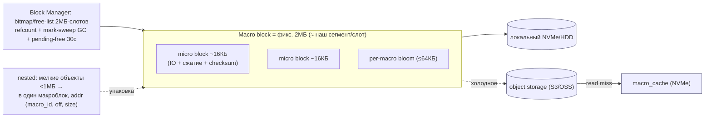
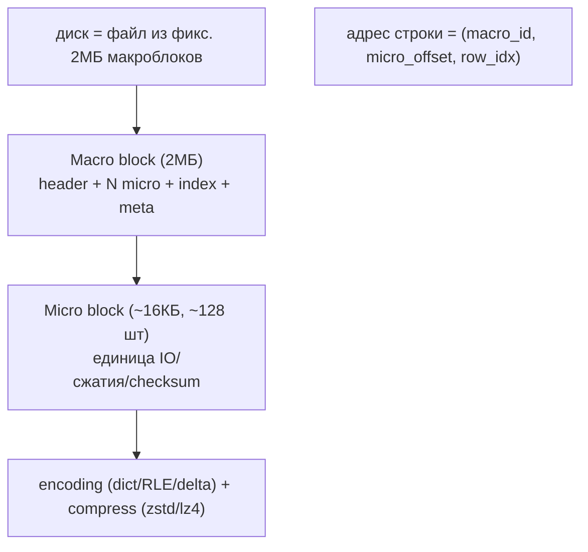
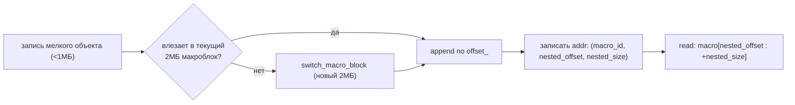
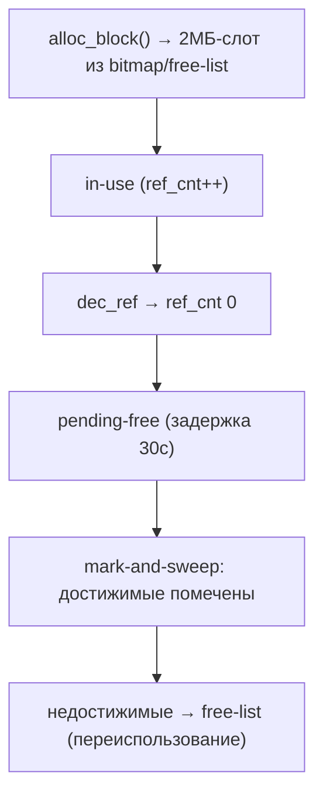
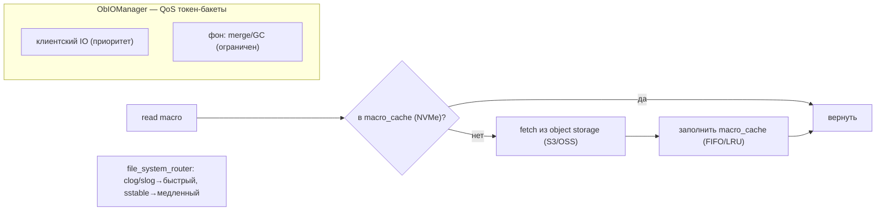
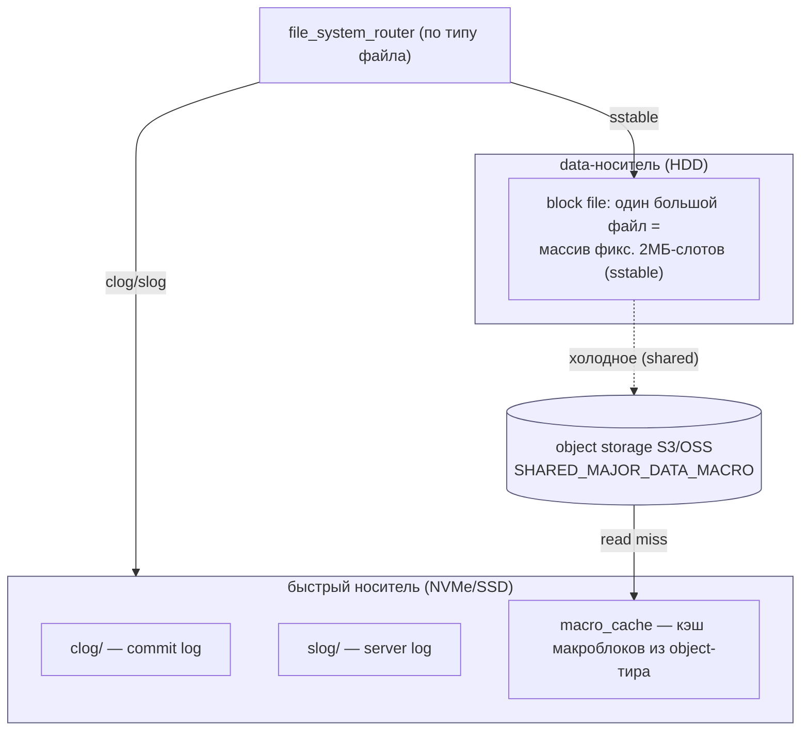
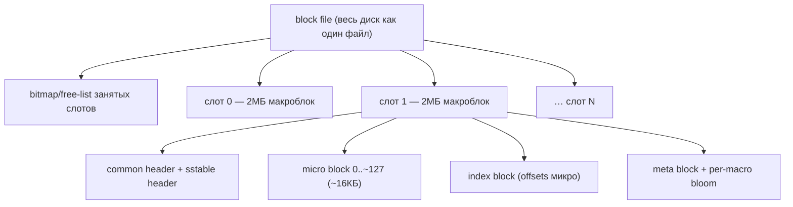
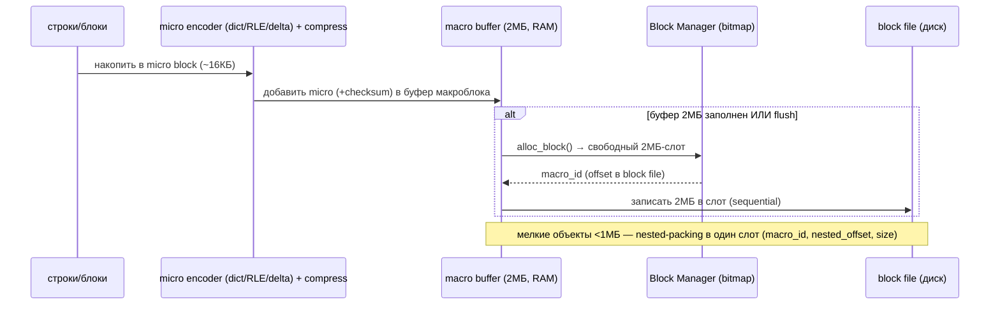
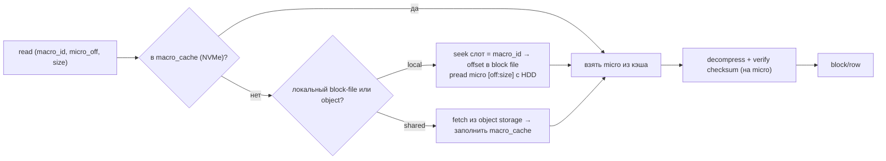

# OceanBase Storage — как OceanBase работает с HDD/SSD (DDD-разбор исходников)

> Исследование исходников **oceanbase/oceanbase** (`Vendor/oceanbase`, свежий слой, commit
> `10912161…` от 2026-03-16). Все факты — с ссылками `файл:строка`, проверены в коде.

OceanBase — распределённая SQL-БД с LSM-движком (C++). Подтверждает многое (LSM, value/blob-
паттерны, тиринг), но даёт **новое и ценное для нас**:

1. **★ Двухуровневые блоки: Macro (фикс. 2МБ — единица аллокации) + Micro (~16КБ — единица IO,
   сжатия, checksum).** Уточняет наш сегмент: фикс. макро + микро-подблоки.
2. **Fixed-block аллокатор**: весь диск = файл из 2МБ-слотов + bitmap/free-list + **refcount +
   mark-and-sweep GC + pending-free (30с)** — альтернатива нашей append-only компакции.
3. **Nested-packing с адресацией**: мелкие sstable (<1МБ) пакуются в один макроблок, адрес =
   `(macro_id, nested_offset, nested_size)` — **точное подтверждение** нашей упаковки мелочи.
4. **Per-macro bloom** (≤64КБ) — фильтр на сегмент. **IO-изоляция (QoS, token-buckets)** —
   честное разделение клиентского и фонового IO. **macro_cache** — NVMe-кэш холодных макроблоков
   из object/shared-тира. **Multi-cache** (block/index/row/bloom отдельно).

---

## 1. Где OceanBase в нашей картине



---

## 2. Архитектурные диаграммы (Mermaid)

### O1. Двухуровневая структура: Macro (аллокация) + Micro (IO/сжатие)



### O2. Nested-packing мелких объектов (= наша упаковка мелочи)



### O3. Block Manager: аллокатор фикс. слотов + GC



### O4. Baseline + incremental (major/minor merge)

```mermaid
flowchart TB
    W["write"] --> MEM["MemTable (RAM, incremental)"]
    MEM -->|freeze| MINI["mini sstable (L0)"]
    MINI -->|minor merge (tiered)| MINOR["minor sstable"]
    MINOR -->|"major merge (периодически, ~раз/сутки)"| MAJOR["major/baseline sstable<br/>read-optimized, заново encoded"]
    READ["read"] --> FUSE["fuse: MemTable + minor + major (MVCC)"]
    note["major merge: read-once+write-once новый baseline →<br/>амортизирует write-amp за сутки"]
```

### O5. Тиринг: object storage + macro_cache + IO-изоляция



---

## 2-bis. Файловая система: раскладка и потоки (Mermaid)

### FS1. Реальная раскладка на диске (block-file + директории + тиры)



### FS2. Структура block-file: массив 2МБ-слотов + bitmap



### FS3. Запись на уровне файлов (encode → pack 2МБ → bitmap alloc → write)



### FS4. Чтение на уровне файлов (macro_id → слот → micro → decompress)



---

## 3. Ubiquitous Language (термины OceanBase)

| Термин | Значение | Где в коде |
|---|---|---|
| **Macro block** | фикс. 2МБ — единица аллокации диска | `deps/oblib/.../ob_define.h:1991` |
| **Micro block** | ~16КБ (мин 4КБ) — единица IO/сжатия/checksum | `ob_data_store_desc.h`, `ob_micro_block_header.h` |
| **nested sstable** | мелкая sstable, упакованная в макроблок `(macro_id, nested_offset, nested_size)` | `ob_shared_macro_block_manager.h:61` |
| **baseline / major** | статичные данные после периодического merge | `compaction/ob_compaction_util.h` |
| **incremental / minor** | MemTable + frozen minor sstable | `memtable/`, `compaction/` |
| **macro_cache** | локальный NVMe-кэш макроблоков из object-тира | `ob_all_virtual_ss_macro_cache_info.cpp` |
| **ObKVCache** | фреймворк кэшей (block/index/row/bloom/fuse) | `ob_storage_cache_suite.h` |
| **ObIOManager** | QoS/изоляция IO (token-bucket per resource) | `share/io/ob_io_manager.h` |

---

## 4. ★ Двухуровневые блоки: Macro + Micro

- **Macro block = `OB_DEFAULT_MACRO_BLOCK_SIZE = 2МБ`** (`ob_define.h:1991`) — **фикс. единица
  аллокации** диска. Весь диск трактуется как файл из 2МБ-слотов. Фикс. размер → простой
  bitmap-аллокатор, предсказуемый IO, отсутствие фрагментации «дырами».
- **Micro block ≈ 16КБ** (мин `MIN_MICRO_BLOCK_SIZE=4КБ`, ~128 микро на макро) — **единица IO,
  сжатия и checksum** (`ob_micro_block_header.h`: `data_length_/data_zlength_/data_checksum_`).
- **Адрес строки** = `(macro_id, micro_offset, row_index)` (`ob_imicro_block_writer.h`,
  `ob_block_sstable_struct.h:156` `ObMicroBlockId{macro_id, offset, size}`).

> **Для нас:** уточняет сегмент: **сегмент = набор микроблоков**; checksum и сжатие — на микро
> (не на весь сегмент и не на каждый блок). Это даёт частичное чтение (один микро) без
> расжатия всего сегмента и точечную проверку целостности.

## 5. Block Manager: аллокатор фикс. слотов + GC + nested-packing

- **Аллокатор** (`ob_block_manager.h:178`): `alloc_block`/`free`, `BlockMap = LinearHashMap<
  MacroBlockId, BlockInfo>`; `BlockInfo{ ref_cnt_, is_free_, access_time_ }`.
- **GC**: `inc_ref/dec_ref` + **`mark_and_sweep()`** (достижимые от tablet'ов помечаются,
  недостижимые освобождаются) + **pending-free задержка `RECYCLE_DELAY_US=30с`** перед реальным
  освобождением (защита от гонок). `DEFAULT_PENDING_FREE_COUNT=1024`.
- **Nested-packing** (`ob_shared_macro_block_manager.cpp`): объекты `< SMALL_SSTABLE_STHRESHOLD_SIZE
  =1МБ` пакуются в текущий 2МБ-макроблок; при переполнении — `try_switch_macro_block()`; адрес =
  `(macro_id, nested_offset, nested_size)`.

> **Для нас — два варианта дизайна сегмента:**
> (A) **append-only переменные сегменты + компакция** (наш текущий, из geth/pebble), или
> (B) **фикс. 2МБ-слоты + bitmap-аллокатор + mark-sweep GC** (OceanBase) — нет фрагментации, но
> мелочь требует nested-packing. **Refcount + mark-sweep + pending-free** полезны в любом варианте.

## 6. Baseline + incremental + merge + encoding

- **Трёхуровневый LSM**: MemTable (RAM) → mini/minor sstable (L0, **tiered**, не leveled) →
  **major/baseline** (`compaction/ob_compaction_util.h`). Чтение **фьюзит** все три (MVCC,
  `ob_partition_merge_fuser.h`).
- **Major merge** (~раз/сутки): read-once+write-once новый baseline → **амортизирует write-amp**
  за сутки; baseline переэнкодится оптимально, bloom пересчитывается. Append-only (старый major
  иммутабелен для snapshot-чтений, метаданные атомарно переключают указатель).
- **Micro-block encoding** (`blocksstable/encoding/`): адаптивный выбор dict/RLE/const/delta +
  general compress (zstd/lz4) поверх — **двухуровневое сжатие**.

> **Для нас:** columnar-encoding (dict/RLE/delta) — для **структурированных** данных; наши блоки
> опаковые (CAS-байты) → берём только **двухуровневую идею** (per-micro general-compress) и
> **periodic major-merge ≈ наша периодическая компакция сегментов**. Tiered-minor ≈ наши
> mini-сегменты, major ≈ консолидация.

## 7. Тиринг, кэши, IO-изоляция

- **macro_cache** (`ob_all_virtual_ss_macro_cache_info.cpp`): локальный (NVMe) кэш макроблоков,
  подтянутых из **shared/object storage**; запись хранит `size, last_access_time, cache_type
  (read/write), ref_cnt, access_cnt`; вытеснение FIFO/LRU. **Read fallthrough: macro_cache → object.**
- **Object/shared storage** (`ob_object_manager.h`: `ObStorageObjectType` —
  `PRIVATE_DATA_MACRO`/`SHARED_MAJOR_DATA_MACRO`/`TMP_FILE`): данные могут жить на S3/OSS.
- **file_system_router** (`ob_file_system_router.cpp:121`): `clog/slog → быстрый носитель`,
  `sstable → медленный` (раздельные директории/устройства по типу файла).
- **Multi-cache** (`ob_storage_cache_suite.h`): отдельные `block_cache` (data micro),
  `index_block_cache`, `row_cache`, `bf_cache` (bloom), `fuse_row_cache` — каждый под свой паттерн.
- **IO-изоляция** (`share/io/ob_io_manager.h`): token-bucket'и per-resource (`iops/ibw/obw`),
  per-tenant квоты, разделение foreground/background; **slow-IO детекция** по `avg_device_delay_us`.

> **Для нас:** macro_cache = **NVMe-кэш холодных сегментов** из cold/remote-тира (уточняет
> RocksDB SecondaryCache на уровне сегмента); object device = `cold_path` на S3; router = наш
> выбор носителя по типу (index→NVMe, data→HDD, cold→remote); **IO-QoS** = честное разделение
> клиентского IO и фона (resilver/GC/scrub) — строже простого rate-limiter.

---

## 8. Философия и вывод XFS/ZFS

OceanBase часто **сам управляет диском как сырым файлом 2МБ-слотов** (минуя сложную ФС) — урок:
на фикс-блочном аллокаторе роль ФС минимальна (нужна быстрая, простая → **XFS**). Для object-тира
ФС не при чём (S3/OSS). Вывод тот же: горячее → NVMe/XFS; холодное → HDD или object storage;
ZFS — если нужны checksum/сжатие на холодном (но micro-checksum OceanBase делает сам — дублировать
не обязательно).

---

## 8-bis. Снипеты кода (реальные выдержки + объяснение)

### CS1. Macro/micro адресация: (macro_id, nested_offset, nested_size)

```cpp
// src/storage/blocksstable/ob_shared_macro_block_manager.h:61
int64_t nested_size_;       // размер микроблока (~16КБ)
int64_t nested_offset_;     // смещение внутри macro-блока (~2МБ)
MacroBlockId macro_id_;     // какой macro содержит этот micro
```

**Объяснение:** мелкий объект адресуется `(macro_id, nested_offset, nested_size)` — macro 2МБ из
микроблоков. → наш **сегмент → микроблоки ~16КБ**, адрес `(seg, micro_off, len)`.

### CS2. Fixed-block аллокатор: mark-and-sweep + pending-free

```cpp
// src/storage/blocksstable/ob_block_manager.cpp:1016 — mark_and_sweep()
GetPendingFreeBlockFunctor pending_free_functor(
    MAX_FREE_BLOCK_COUNT_PER_ROUND, mark_info, tmp_status.hold_count_);
block_map_.for_each(pending_free_functor);   // mark достижимых; недостижимые → pending-free (~30с)
```

**Объяснение:** GC фикс-блоков: обойти карту, пометить живые 2МБ-слоты, недостижимые освободить через
**pending-free** (задержка ~30с). → наш альт. **fixed-block аллокатор + bitmap + mark-sweep**.

### CS3. Per-micro checksum (гранулярная целостность)

```cpp
// src/storage/blocksstable/ob_micro_block_header.cpp:261 — check_payload_checksum()
const int64_t data_checksum = ob_crc64_sse42(buf, len);
if (data_checksum != data_checksum_) ret = OB_PHYSIC_CHECKSUM_ERROR;
```

**Объяснение:** у каждого микроблока свой CRC-64; на чтении проверяется **независимо** (частичное
чтение без расжатия всего macro). → наш **per-micro checksum** (#34) — точечная целостность.

---

## 9. Извлечённые идеи для OpenZFS Daemon (новое сверх прежних разборов)

| Идея из OceanBase | Где применить | Эффект |
|---|---|---|
| **★ Macro/Micro split** (сегмент = микроблоки ~16КБ; checksum+compress на микро) | **Фаза 1** — read одного микро без расжатия всего сегмента; точечная целостность | частичное чтение + гранулярная целостность |
| **Fixed-block аллокатор + bitmap + mark-sweep GC + pending-free(30с)** | **Фаза 5** — альтернатива/дополнение к компакции сегментов; refcount-GC | нет фрагментации «дырами»; безопасное освобождение |
| **Nested-packing адрес `(macro_id, off, size)`** | **Фаза 1** — подтверждение упаковки мелочи + точная адресация | меньше слотов на мелочь |
| **Per-segment bloom** (≤64КБ на макро) | **Фаза 2** — фильтр «есть ли CID в сегменте» (гранулярнее per-disk #30) | меньше лишних чтений сегментов |
| **IO-QoS: token-bucket foreground vs background** | **Фаза 5** — строже rate-limiter: класс «клиент» приоритетнее «resilver/GC/scrub» | предсказуемая latency клиента под фоном |
| **Multi-cache раздельно** (index/block/bloom) | **Фаза 4/5** — отдельные пулы кэша под индекс/тела/bloom | без вытеснения горячего индекса телами |
| **macro_cache холодного из object-тира на NVMe** | **Фаза 5** — NVMe-кэш сегментов из `cold_path`/remote | дешёвый cold-тир + быстрый горячий доступ |
| **Periodic major-merge** | **Фаза 5** — периодическая полная компакция сегментов (≈ baseline) | амортизация write-amp, чистый read-набор |
| **file_system_router по типу файла** | **Фаза 0/1** — маршрут index→NVMe, data→HDD, cold→remote (уже в конфиге) | подтверждение раздельных путей |

### Главные новые заимствования
1. **Macro/Micro split**: сегмент = последовательность микроблоков (~16КБ) — единиц IO, сжатия и
   **checksum**; это даёт частичное чтение и точечную проверку целостности, чего нет при
   «сжатие/checksum на весь блок».
2. **Fixed-block аллокатор + mark-sweep GC + pending-free** — зрелая альтернатива компакции
   (рассмотреть для управления сегментами; refcount+mark-sweep полезны в любом варианте).
3. **IO-QoS классы** (foreground/background token-buckets) — строже rate-limiter из RocksDB.

---

## 10. Источники в коде (для перепроверки)

- Macro/micro: `deps/oblib/src/lib/ob_define.h:1991` (2МБ), `src/storage/blocksstable/
  ob_data_store_desc.h` (4КБ micro), `ob_micro_block_header.h`, `ob_block_sstable_struct.h:156`,
  `ob_macro_block.h:129` (128 micro), `ob_macro_block_id.h`.
- Block manager / GC / nested: `ob_block_manager.h:178–241`, `ob_shared_macro_block_manager.h:61,
  199`, `ob_shared_macro_block_manager.cpp`, `ob_macro_block_bloom_filter.h:82` (64КБ).
- LSM/merge/encoding: `storage/compaction/ob_compaction_util.h`, `ob_partition_merge_fuser.h`,
  `ob_partition_merger.cpp`, `storage/memtable/ob_memtable.h`,
  `storage/blocksstable/encoding/ob_dict_encoder.h` (+ rle/const/integer_base_diff).
- Тиринг/кэш/IO: `observer/virtual_table/ob_all_virtual_ss_macro_cache_info.cpp`,
  `blocksstable/ob_object_manager.h`, `storage/ob_file_system_router.cpp:121`,
  `blocksstable/ob_storage_cache_suite.h:52–58`, `blocksstable/ob_micro_block_cache.h`,
  `share/io/ob_io_manager.h`, `share/io/ob_io_struct.h`.
