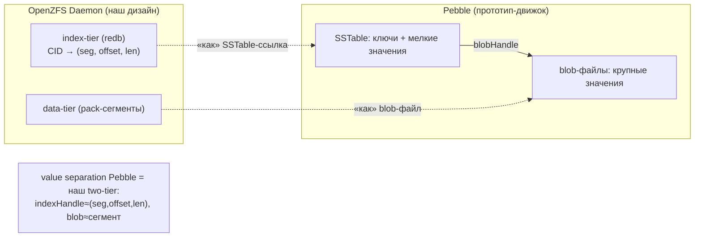
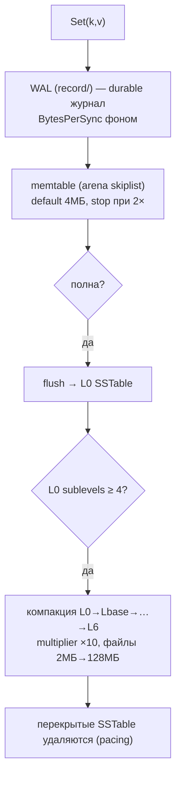
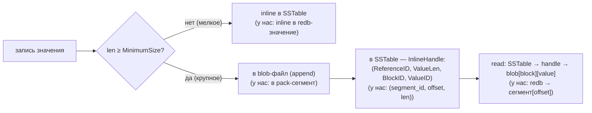
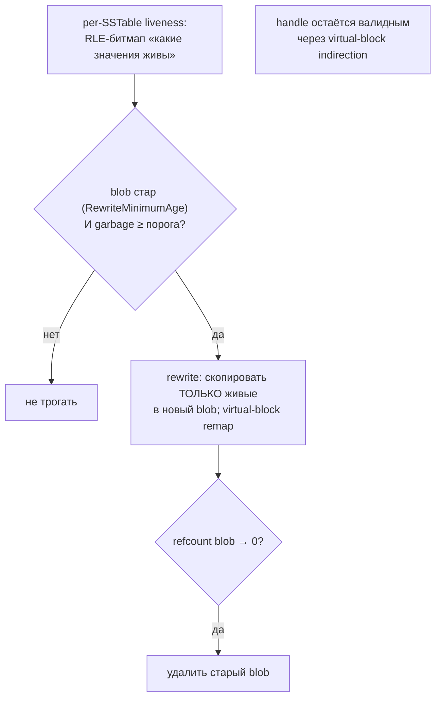
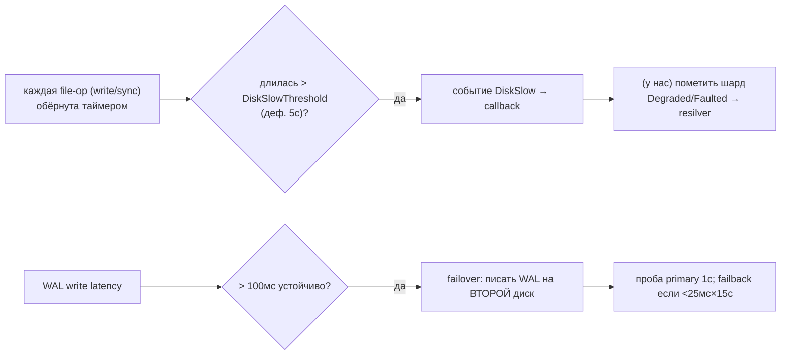
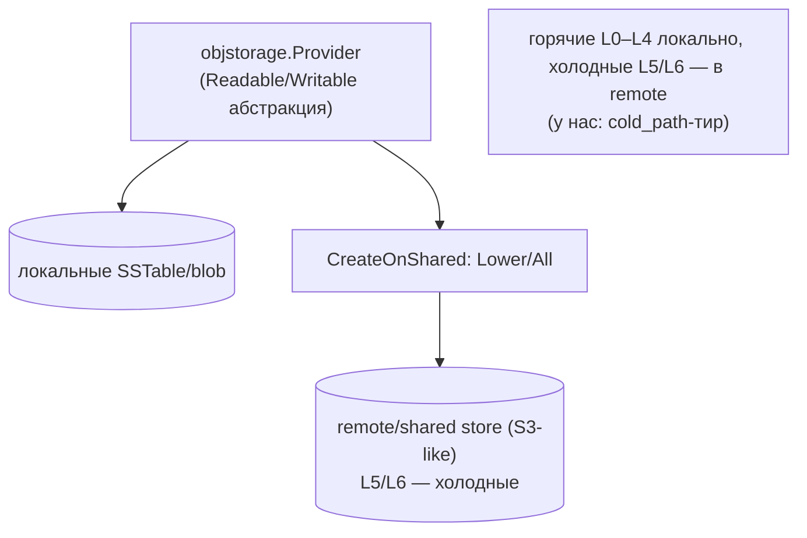
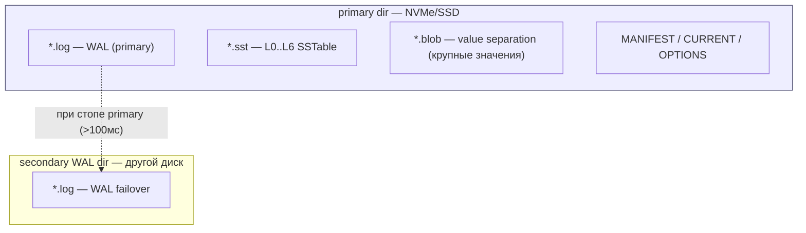
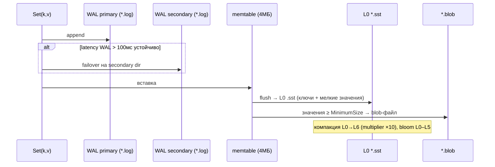
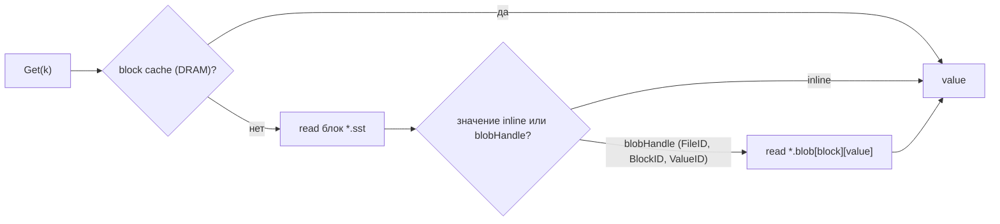
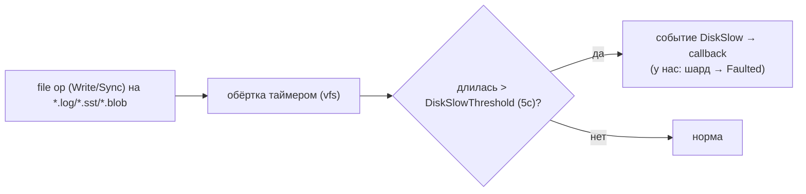

# Pebble Storage — как Pebble работает с HDD/SSD (DDD-разбор исходников)

> Исследование исходников **cockroachdb/pebble** (`Vendor/pebble`, свежий слой, commit
> `b6588354…` от 2026-06-02). Все факты — с ссылками `файл:строка`, проверены в коде.

Pebble — это **сам LSM-движок** (на нём работает geth). Поэтому здесь — самые применимые к нам
механизмы. **Главное:** Pebble реализует **value separation (WiscKey)** — крупные значения в
отдельных **blob-файлах**, ключи + мелочь в SSTable. Это **буквально наши pack-сегменты +
index-tier**, причём с готовым решением самого сложного — **GC сегментов через liveness-битмапы и
rewrite без переписывания индекса**. Плюс: **disk-slow детекция**, **WAL failover на запасной
диск**, **readahead**, **deletion pacing**, **тиринг в remote storage**.

---

## 1. Где Pebble в нашей картине



Pebble мы можем и **прямо использовать** как index-tier (вместо redb) — но даже если оставим
redb, его механизмы value-separation/GC/disk-health **переносим как паттерны**.

---

## 2. Архитектурные диаграммы (Mermaid)

### P1. LSM путь записи (WAL → memtable → L0 → компакция)



### P2. Value separation = наши pack-сегменты (★)



### P3. GC blob-файла: liveness-битмап + rewrite (чертёж нашей компакции сегментов)



### P4. Resilience: disk-slow детекция + WAL failover



### P5. Тиринг: objstorage + remote (disaggregated)



---

## 2-bis. Файловая система: раскладка и потоки (Mermaid)

### FS1. Реальная раскладка на диске (+ WAL failover на второй диск)



### FS2. Запись на уровне файлов (WAL failover + value separation)



### FS3. Чтение: SSTable → blobHandle → blob-файл



### FS4. Disk-health: обёртка файловых операций таймером



---

## 3. Ubiquitous Language (термины Pebble)

| Термин | Значение | Где в коде |
|---|---|---|
| **memtable** | in-memory skiplist-буфер записи | `mem_table.go` |
| **SSTable** | отсортированный иммутабельный файл уровня | `sstable/` |
| **blob file** | отдельный файл крупных значений (value separation) | `sstable/blob/` |
| **blobHandle** | адрес значения: `(BlobFileID, BlockID, ValueID, ValueLen)` | `sstable/blob/handle.go:34` |
| **liveness bitmap** | RLE-битмап живых значений в блоке (для GC) | `sstable/blob_reference_index.go` |
| **DiskSlowThreshold** | порог «медленной» дисковой операции (5с) | `options.go:1867` |
| **WAL failover** | переключение WAL на запасной диск при стопе | `wal/failover_manager.go` |

---

## 4. LSM-ядро и тюнинг (проверенные дефолты)

| Опция | Дефолт | Строка | Урок HDD vs SSD |
|---|---|---|---|
| `MemTableSize` | **4 МБ** (старт 256КБ, ×2) | `options.go:1768` | HDD: меньше → ниже пики латентности при flush |
| `MemTableStopWritesThreshold` | **2** | options | write-stall при 2× — поднять на HDD |
| `LevelMultiplier` | **10** | `options.go:49` | ниже → меньше write-amp, больше места |
| L0CompactionThreshold | **4** sublevels | options | HDD: 2–3 (агрессивнее, ниже read-amp) |
| L0StopWritesThreshold | **12** | options | HDD: 8–10 (ловить backlog раньше) |
| Block cache | **8 МБ** (деф.) | `options.go:48` | HDD: 256МБ–1ГБ критично (избегать seek) |
| Bloom (per-level) | L0 нет; L1–L3 16 бит; L6 8 бит | options | прогрессивно: крупные уровни — меньше бит |
| Компрессия | Snappy; профили до Zstd на L6 | options | HDD: Zstd на L1+ (меньше байт = меньше seek) |
| `BytesPerSync` | **512 КБ** | `options.go:1656` | сглаживает I/O, без storm dirty-страниц |
| `CompactionConcurrencyRange` | **[1,1]** | options | HDD: держать 1 (seek-контеншн); SSD: 2–4 |
| Deletion pacing `BaselineRate` | **0 (выкл)** | deletepacer | HDD: 1–10 МБ/с — сгладить удаление |

> Замечание: дефолты Pebble нейтральны; geth поверх них ставит свои (NoSync WAL, L0=2,
> seek-compaction off) — см. [go-ethereum doc](go-ethereum-storage-hdd-ssd.md).

---

## 5. Value separation — это наши pack-сегменты (★ детально)

`ValueSeparationPolicy` (`options.go:1299`): `MinimumSize` — **значения меньше порога пишутся
inline в SSTable, крупнее — выносятся в blob-файл** (в тестах дефолт ~512 байт).

- **blobHandle** (`sstable/blob/handle.go:34`): `{ BlobFileID, ValueLen, BlockID, ValueID }`. В
  SSTable хранится **InlineHandle** = `(ReferenceID, ValueLen, BlockID, ValueID)`, где
  `ReferenceID` — индекс в массиве `BlobReferences` таблицы (а не прямой FileID — это развязывает
  идентичность ссылки от файла, позволяя ремапить).
- **blob-файл append-only**: значения пишутся в блоки последовательно, индекс — в конце
  (`sstable/blob/blob.go`).
- **GC через rewrite** (`blob_rewrite.go`): blob переписывается **без переписывания SSTable** —
  копируются только живые значения, старые handle остаются валидны через **virtual-block remap**.
  Живость — **RLE-битмап per-block** (`sstable/blob_reference_index.go`), решение о rewrite — по
  `RewriteMinimumAge` + garbage-ratio порогам; `refcount` blob → 0 ⇒ удаление.

**Маппинг на наш дизайн (1:1):**

| Pebble | OpenZFS Daemon |
|---|---|
| blob-файл | **pack-сегмент** `seg.NNNN.dat` |
| blobHandle `(FileID, BlockID, ValueID, len)` | **`(segment_id, offset, len)`** в redb |
| InlineHandle/ReferenceID | ссылка в index-tier |
| MinimumSize (inline vs separate) | **порог inline-в-redb для крошечных блоков** |
| liveness bitmap + refcount | **liveness наших сегментов для GC** |
| blob rewrite (только живые) | **компакция сегмента** (перепаковка живых) |
| RewriteMinimumAge + garbage-ratio | **триггеры нашей компакции** |
| virtual-block remap | handle стабилен при перепаковке |

> Pebble закрывает самый сложный кусок нашей Фазы 5 (GC сегментами): **готовая схема liveness +
> age-gated rewrite + refcount**, причём перепаковка не требует трогать индекс на каждый блок.

---

## 6. Resilience: disk-slow, WAL failover, readahead, pacing

- **Disk-slow детекция** (`vfs/disk_health.go`, порог `5с` — `options.go:1867`): каждая
  write/sync обёрнута таймером; при превышении — callback `DiskSlow`. **Для нас:** вешаем на
  per-disk ops → при устойчивых стопах помечаем шард `Degraded/Faulted` → `ResilverService`.
- **WAL failover** (`wal/failover_manager.go`): при латентности WAL-записи **>100мс** устойчиво —
  переключение записи журнала на **второй диск**; проба primary каждую 1с, failback при <25мс×15с.
  **Для нас:** durability index-tier — при стопе NVMe писать на запасной NVMe.
- **Readahead** (`objstorage/.../readahead.go`): старт **64КБ**, экспоненциальный рост до max
  после ≥2 последовательных чтений; отдельный `ReadHandle` на контекст. **Для нас:** включать на
  последовательных проходах сегментов (resilver/scrub).
- **Deletion pacing** (`internal/deletepacer`): сглаживание удалений (`BaselineRate`, при
  нехватке места — ускорение). **Для нас:** пейсить удаление сегментов при GC, не устраивать
  I/O-storm на HDD.

---

## 7. Тиринг: objstorage + remote (disaggregated)

`objstorage.Provider` абстрагирует локальный файл vs remote (`objstorage/objstorage.go`).
`CreateOnShared` (`provider.go`): `Lower` → L5+ на remote, L0–L4 локально; `All` → всё на remote
(S3-like, `objstorage/remote/`). **Для нас:** `cold_path`-тир — редкие/не-pinned сегменты можно
выносить в shared/remote store, как Pebble выносит холодные уровни.

---

## 8. Философия и вывод XFS/ZFS

Pebble — движок, а не нода, поэтому медиа-совет тот же, что у geth (Pebble там и используется):
горячий LSM-индекс → **SSD/NVMe (XFS/ext4)**; холодные данные → дешевле/медленнее.
Ключевая идея Pebble для нас не «какая ФС», а **как движок сам адаптируется к носителю**:
disk-slow детекция, WAL failover, pacing, readahead, value separation — всё это мы переносим в
наш `ShardEngine`/`ResilverService` поверх XFS.

---

## 8-bis. Снипеты кода (реальные выдержки + объяснение)

### CS1. Value separation: handle (blob,block,value) ≈ наш (seg,off,len)

```go
// sstable/blob/handle.go:34
type Handle struct {
    BlobFileID base.BlobFileID
    ValueLen   uint32
    BlockID    BlockID        // блок внутри blob-файла
    ValueID    BlockValueID   // значение внутри блока
}
```

**Объяснение:** значение вынесено в blob-файл, адресуется `(файл, блок, value)`. → 1:1 наш адрес
`(segment_id, offset, len)` тела в pack-сегменте (value separation = inline/сегмент).

### CS2. Disk-slow детекция: порог по времени операции

```go
// vfs/disk_health.go:274
lastWriteDuration := now.Sub(d.createTime) - delta
if lastWriteDuration > d.diskSlowThreshold {       // дефолт ~5с
    d.onSlowDisk(op, writeSize, lastWriteDuration) // callback → деградация
}
```

**Объяснение:** таймер на write/sync; превышение порога (~5с) → callback. → наш **disk-slow → `Faulted`**
(callback помечает шард деградированным).

### CS3. GC по garbage-ratio (liveness blob-файла)

```go
// compaction_picker.go:1774
garbagePct := float64(aggregateStats.ValueSize-aggregateStats.ReferencedValueSize) /
              float64(aggregateStats.ValueSize)
if garbagePct <= policy.GarbageRatioHighPriority { return nil }   // мало мусора → не переписывать
```

**Объяснение:** доля неживых значений в blob-файле; ниже порога — rewrite не запускать (+ age-gate).
→ наш **liveness-битмап + garbage-ratio + age-gated rewrite** GC сегментов.

---

## 9. Извлечённые идеи для OpenZFS Daemon

| Идея из Pebble | Где применить | Эффект |
|---|---|---|
| **Value separation** (blob ≈ сегмент, handle ≈ `(seg,offset,len)`) | подтверждает наш data-tier+index-tier 1:1 | сильнейшая валидация формата |
| **★ GC сегментов: liveness-битмап + age-gated rewrite + refcount + virtual-remap** | **Фаза 5** — наш `GarbageCollector`/компакция | готовый чертёж самого сложного куска |
| **MinimumSize: inline мелочь / separate крупное** | **Фаза 1** — крошечные блоки inline в redb-значение, крупные — в сегмент | минус один seek на мелких блоках |
| **Disk-slow детекция (5с) → событие** | **Фаза 5/6** — per-disk латентный монитор → `ShardFaulted` | авто-деградация диска без ручного вмешательства |
| **WAL failover на запасной диск (100мс)** | **Фаза 1/5** — durability index-tier на запасной NVMe | переживание стопа NVMe |
| **Readahead 64КБ→max на последовательном** | **Фаза 3/5** — resilver/scrub проходы сегментов | быстрее обход на HDD |
| **Deletion pacing** | **Фаза 5** — пейсинг удаления сегментов при GC | без I/O-storm на HDD |
| **objstorage/remote тиринг (CreateOnShared)** | **Фаза 5 (опц.)** — `cold_path` в shared/remote | дешёвый холодный тир |
| **LSM-тюнинг (block cache, bloom, compaction)** | если index-tier на Pebble вместо redb | проверенные дефолты «из боя» |

### Главные заимствования (новое сверх TON/geth/quorum)
1. **GC сегментов по образцу blob-rewrite**: per-block **liveness-битмап** + **refcount** +
   **age-gated rewrite** + **virtual-block remap** (handle стабилен) — закрывает нашу Фазу 5.
2. **Inline мелких значений** (порог `MinimumSize`): крошечные блоки держать прямо в redb, не
   гоняя за ними на HDD — экономит seek.
3. **Самоадаптация к носителю**: disk-slow→`ShardFaulted`, WAL failover, readahead, pacing —
   перенести в `ShardEngine`/`ResilverService`.

---

## 10. Источники в коде (для перепроверки)

- LSM/опции: `options.go:48,49,1656,1768,1867`, `mem_table.go`, `compaction_picker.go`,
  `compaction.go`, `compaction_scheduler.go`.
- Value separation: `options.go:1297–1369`, `sstable/blob/handle.go:34`,
  `sstable/blob/blob.go`, `sstable/blob/doc.go`, `compaction_value_separation.go`,
  `blob_rewrite.go`, `sstable/blob_reference_index.go`,
  `internal/manifest/blob_metadata.go`.
- Resilience/тиринг: `vfs/disk_health.go`, `wal/failover_manager.go`, `wal/wal.go`,
  `objstorage/objstorage.go`, `objstorage/remote/storage.go`,
  `objstorage/objstorageprovider/readahead.go`, `internal/deletepacer/options.go`.
