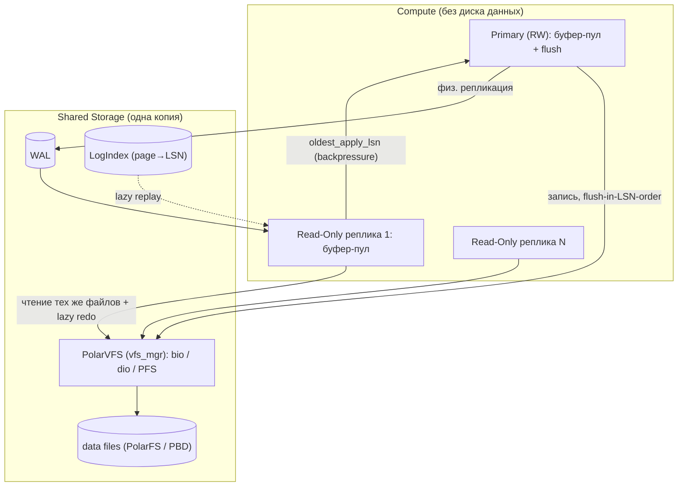
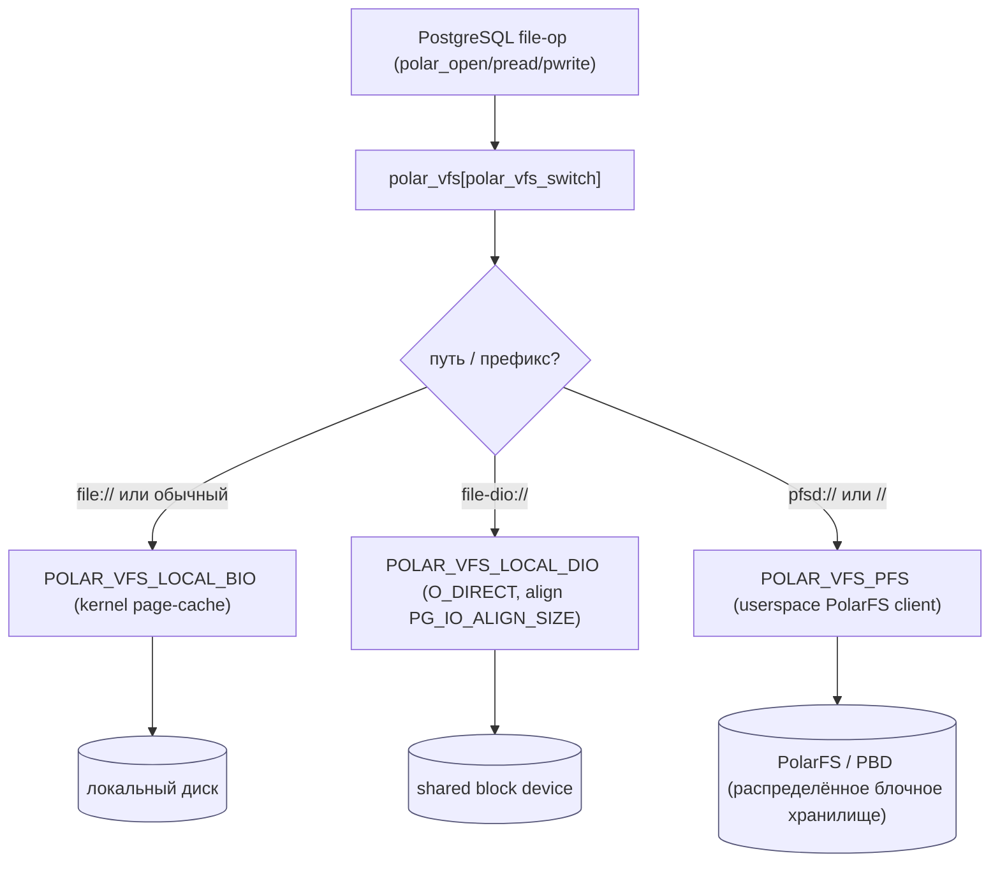
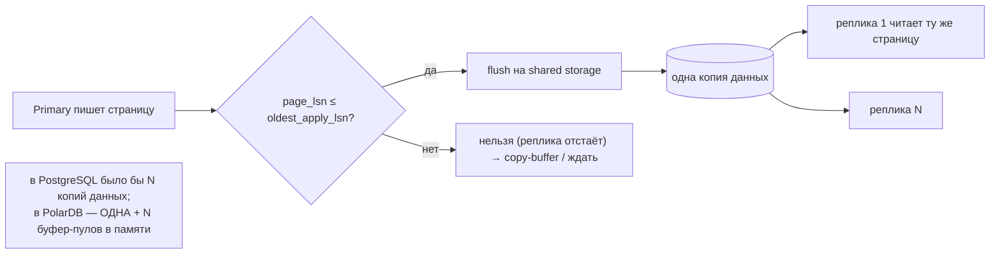
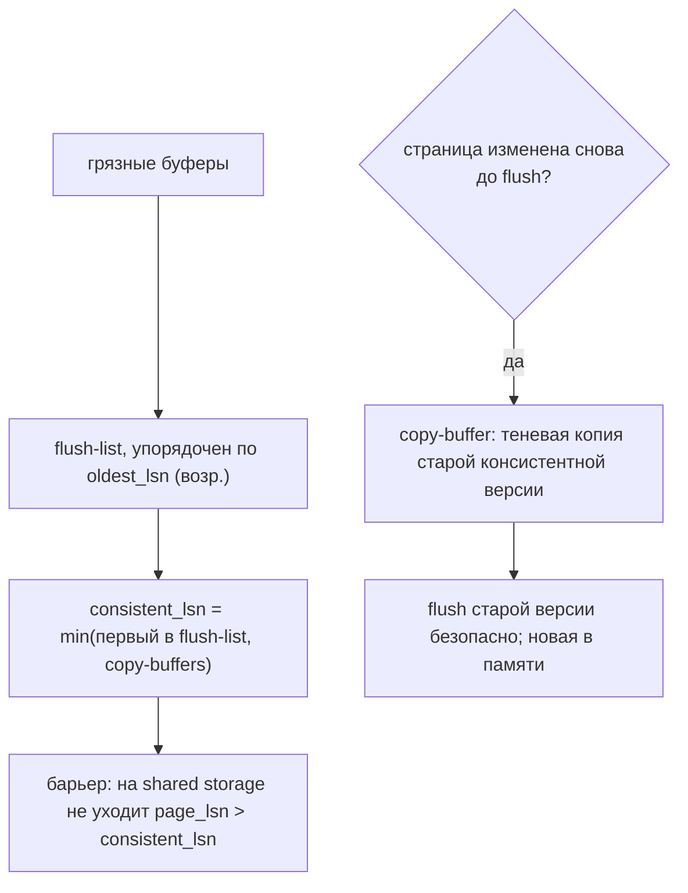
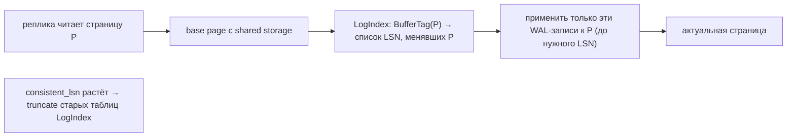
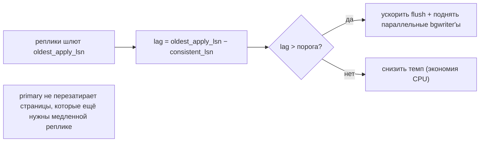

# PolarDB-for-PostgreSQL Storage — как работает с HDD/SSD (DDD-разбор исходников)

> Исследование исходников **polardb/PolarDB-for-PostgreSQL** (`Vendor/PolarDB-for-PostgreSQL`,
> свежий слой, commit `accf02e2` от 2026-05-29, на базе PostgreSQL 17). Все факты — с ссылками
> `файл:строка`, проверены в коде.

PolarDB-PG — это **cloud-native PostgreSQL с разделением compute/storage**: **одна копия данных**
на shared-хранилище, **один primary (RW) + много read-only реплик**, физическая репликация через
WAL+LogIndex. Это **иная парадигма**, чем у 7 прошлых storage-прототипов (там — локальный диск).
Два самых ценных для нас вывода:

1. **★ PolarVFS** — подключаемая абстракция ФС (`vfs_mgr`) с **тремя бэкендами**
   (buffered-IO / direct-IO / **PolarFS** shared) и **маршрутизацией по пути** — это прямой
   чертёж нашего pluggable `ShardEngine` (+ raw/O_DIRECT-бэкенд, + remote/cold-бэкенд).
2. **★ Compute/storage separation** — одно хранилище, много читателей. Для нас (multi-host
   gateway над общим blockstore) это **направление масштабирования**, причём **наша
   неизменяемость блоков делает его радикально проще** (см. §8): не нужны copy-buffer / logindex /
   consistent-LSN, которые PolarDB строит ради изменяемых страниц.

---

## 1. Bounded Contexts



| Контекст | Ответственность | Файлы |
|---|---|---|
| **PolarVFS** | подключаемая ФС: bio/dio/PFS, маршрут по пути | `src/polar_vfs/*`, `src/include/storage/polar_fd.h` |
| **Shared Storage** | одна копия данных на PolarFS/PBD | `polar_pfsd.c` |
| **Buffer/Consistency** | consistent-LSN, flush-list, copy-buffer | `polar_bufmgr.c`, `polar_flush.c`, `polar_copybuf.c` |
| **LogIndex** | page→WAL-LSN индекс, lazy redo | `access/polar_logindex*` |
| **Replication/Backpressure** | физ. репликация, throttle по `oldest_apply_lsn` | `polar_bufmgr.c` |

---

## 2. Архитектурные диаграммы (Mermaid)

### PD1. PolarVFS — подключаемые бэкенды + маршрут по пути (★ прямой чертёж)



### PD2. Compute/storage separation: одна копия, много читателей



### PD3. Consistency: consistent-LSN + flush-in-order + copy-buffer



### PD4. LogIndex — ленивый on-demand redo



### PD5. Backpressure по самому медленному читателю



---

## 3. Ubiquitous Language (термины PolarDB)

| Термин | Значение | Где в коде |
|---|---|---|
| **PolarVFS / vfs_mgr** | подключаемая абстракция ФС (function-pointers) | `polar_fd.h:126` |
| **PolarVFSKind** | бэкенд: `LOCAL_BIO=0 / PFS / LOCAL_DIO` | `polar_fd.h:66` |
| **PolarFS (PFS/PBD)** | userspace-клиент распределённого блочного хранилища | `polar_pfsd.c` |
| **consistent LSN** | барьер: ниже него страницы безопасно flush'ить | `polar_bufmgr.c:131` |
| **flush list** | список грязных буферов по oldest_lsn | `polar_flush.c` |
| **copy buffer** | теневая копия старой консистентной версии страницы | `polar_copybuf.c` |
| **LogIndex** | индекс `page(BufferTag) → список LSN` для lazy redo | `polar_logindex_internal.h:322` |
| **oldest_apply_lsn** | LSN самой медленной реплики (для backpressure) | `polar_bufmgr.c:432` |

---

## 4. ★ PolarVFS — подключаемая ФС (прямо применимо)

- **`vfs_mgr`** (`polar_fd.h:126`) — структура из ~30 указателей: `vfs_mount/open/close/read/write/
  pread/pwrite/preadv/pwritev/fsync/fdatasync/opendir/.../vfs_type`. Все файловые операции PG идут
  через `polar_vfs[polar_vfs_switch].vfs_*` (`polar_fd.h:225`).
- **Три бэкенда** (`PolarVFSKind`, `polar_fd.h:66`): `LOCAL_BIO` (обычный buffered IO, kernel cache),
  `LOCAL_DIO` (**O_DIRECT** + выравнивание `PG_IO_ALIGN_SIZE`, `polar_directio.c`), `PFS`
  (userspace-клиент PolarFS, `polar_pfsd.c` → `pfsd_open/pread/pwrite`).
- **Маршрут по пути/префиксу** (`polar_vfs_interface.c`): `file://` → BIO, `file-dio://` → DIO,
  `pfsd://` или путь под `/<polar_disk_name>/` → PFS; иначе локально. Данные → shared, temp/log → local.
- **Direct-IO**: дефолтный io-size 1МБ, выравнивание буфера/смещения/длины по сектору
  (`polar_directio.h:41,49`) — нужен для shared storage (мимо kernel-cache, иначе stale у многих читателей).

> **Для нас:** `vfs_mgr` = точный образец нашего **подключаемого `ShardEngine`-порта**:
> `directio`-бэкенд ≈ наш raw/O_DIRECT-сегментный движок; `PFS`-бэкенд ≈ remote/`cold_path`;
> **маршрут по пути** ≈ наш выбор `data_path`(HDD)/`index_path`(NVMe)/`cold_path`(remote).

## 5. Compute/storage separation + согласованность буферов

- **Одна копия данных, много буфер-пулов** (README): вместо «N копий данных» PostgreSQL —
  «1 копия на shared storage + N независимых буфер-пулов в памяти».
- **Consistent LSN** (`polar_bufmgr.c:131`): `min(oldest_lsn первого в flush-list,
  oldest_lsn copy-buffers)`; primary атомарно публикует его (`polar_set_consistent_lsn`),
  и **не flush'ит** страницу с `page_lsn > consistent_lsn` (реплика бы увидела «будущую» страницу).
- **Flush list по LSN** (`polar_flush.c`): грязные буферы в двусвязном списке по возрастанию
  `oldest_lsn`; flush строго **от старых LSN** → корректный consistent-LSN и порядок для реплик.
- **Copy buffer** (`polar_copybuf.c`): если страницу изменили повторно до flush — делается
  **теневая копия** старой консистентной версии; её можно безопасно flush'ить, а новую держать в
  памяти. Решает «нельзя flush'ить новую версию, реплика ещё на старой».

## 6. LogIndex — ленивый redo (page→LSN)

- **LogIndex** (`polar_logindex_internal.h:322`): персистентный индекс `BufferTag(page) → список
  LSN`, менявших страницу (hash-таблица в mem-table + `.tbl` на shared storage + bloom).
- **On-demand replay** (`polar_logindex_redo.c:696`): реплика читает base-page с shared storage →
  через LogIndex-итератор берёт **только LSN для этой страницы** в нужном диапазоне → применяет их.
  Не последовательный redo всего WAL, а **ленивая материализация по странице**.
- **Mini-transaction** (`polar_mini_transaction.h`): атомарность многостраничных WAL-записей.
- **Truncate по consistent-LSN** (`polar_logindex.c:1829`): старые таблицы индекса удаляются, когда
  все реплики прошли их `max_lsn` → размер индекса ≈ рабочий набор недавних изменений.

## 7. Backpressure по медленному читателю

`oldest_apply_lsn` = LSN самой медленной реплики (`polar_bufmgr.c:432`). `lag = oldest_apply_lsn −
consistent_lsn`. При большом lag — **ускорить flush и поднять параллельные bgwriter'ы**
(`polar_adjust_parallel_bgwriters`); при малом — снизить. Primary не перезатирает страницы,
которые ещё нужны отстающей реплике.

---

## 8. Философия, XFS/ZFS и что применимо к нам

PolarDB работает поверх **PolarFS** (своё распределённое блочное хранилище в userspace, O_DIRECT —
мимо локальной ФС) ровно ради разделения compute/storage. Локальная ФС роли почти не играет;
на shared-тире — PolarFS. Для нас вывод о ФС прежний (горячее → NVMe/XFS), а главное — **сама идея
disaggregation**.

**Что применимо:**
- **PolarVFS pluggable backend + path routing + O_DIRECT/remote бэкенды** — прямо в наш `ShardEngine`.
- **Compute/storage separation** — направление **Части 3** (multi-host: stateless IPFS/S3-gateway'и
  над одним общим content-addressed blockstore).
- **Backpressure по самому медленному потребителю** — паттерн flow-control.

**Что НЕ нужно (из-за неизменяемости наших блоков):** consistent-LSN, flush-in-LSN-order,
**copy-buffer**, **LogIndex/lazy-redo**, mini-transaction — всё это PolarDB строит, потому что
страницы **изменяемые** (in-place update + MVCC + много читателей одной мутабельной страницы). У
нас блоки **immutable, content-addressed**: «новой версии страницы» не существует, реплике/gateway
не нужна материализация — достаточно прочитать неизменный блок по CID. **Это делает наш
shared-storage путь радикально проще, чем у PolarDB** — ключевой инсайт.

---

## 8-bis. Снипеты кода (реальные выдержки + объяснение)

### CS1. PolarVFS: таблица функций бэкенда (#45)

```c
// src/include/storage/polar_fd.h:126 — struct vfs_mgr
typedef struct vfs_mgr {
    int     (*vfs_open) (const char *path, int flags, mode_t mode);
    ssize_t (*vfs_pread) (int fd, void *buf, size_t len, off_t offset);
    ssize_t (*vfs_pwrite)(int fd, const void *buf, size_t len, off_t offset);
    int     (*vfs_fsync) (int fd);  /* … ~30 указателей … */
    const struct vfs_mgr *(*vfs_mgr_func)(const char *path);  // выбор бэкенда по пути
} vfs_mgr;
```

**Объяснение:** все файловые операции — через таблицу указателей; бэкенд (bio/dio/PFS) подставляется.
→ наш **PolarVFS-style pluggable ShardEngine-бэкенд (#45)**: xfs / raw-O_DIRECT / remote.

### CS2. Выбор бэкенда по префиксу пути

```c
// src/polar_vfs/polar_vfs_interface.c:1131 — polar_vfs_file_type_and_path()
for (i = 0; i < POLAR_VFS_KIND_SIZE; i++) {
    if (strncmp(polar_vfs_kind[i], path, strlen(polar_vfs_kind[i])) == 0) {  // file:// file-dio:// pfsd://
        *kind = i; vfs_path = path + strlen(polar_vfs_kind[i]); break;
    }
}
if (*kind == POLAR_VFS_UNKNOWN_FILE) *kind = vfs_file_type(path);   // фолбэк по пути
```

**Объяснение:** префикс пути (`file://`/`file-dio://`/`pfsd://`) выбирает бэкенд. → наш диспатч по пути:
`data_path` (HDD→bio), `index_path` (NVMe→O_DIRECT), `cold_path` (remote→S3).

### CS3. Конкретный бэкенд = заполнение vtable

```c
// src/polar_vfs/polar_bufferio.c:32 — const vfs_mgr polar_vfs_bio
const vfs_mgr polar_vfs_bio = {
    .vfs_open = (vfs_open_type) open, .vfs_read = read, .vfs_write = write,
    .vfs_pread = pread, .vfs_pwrite = pwrite, .vfs_fsync = pg_fsync, .vfs_rename = rename, ...
};
```

**Объяснение:** BIO-бэкенд просто заполняет vtable системными вызовами. → паттерн наших бэкендов
ShardEngine (каждый даёт свои open/read/write/fsync).

---

## 9. Извлечённые идеи для OpenZFS Daemon

| Идея из PolarDB | Где применить | Эффект |
|---|---|---|
| **★ PolarVFS: pluggable `vfs_mgr` + path-routing + bio/dio/PFS бэкенды** | подтверждает/чертёж нашего `ShardEngine`-порта: backends `xfs-file` / `raw-O_DIRECT` / `remote`, выбор по пути | чистая абстракция носителя; raw и remote бэкенды |
| **O_DIRECT-бэкенд с выравниванием по сектору** | raw-сегментный движок (Часть 2) | мимо page-cache, предсказуемость на shared |
| **Compute/storage separation** | **Часть 3**: stateless gateway'и над общим blockstore | горизонтальное масштабирование чтения |
| **Backpressure по oldest-consumer** | flow-control отдачи/фоновых задач | не перегружать медленных потребителей |
| **Truncate индекса по durability-барьеру** | GC производных индексов по «всё подтверждено» | ограничение размера служебных структур |
| **(контр-урок) Immutability убирает copy-buffer/LogIndex/consistent-LSN** | зафиксировать в дизайне: наш shared-storage проще | меньше кода и рисков, чем у мутабельной СУБД |

### Главное
**Pluggable VFS (path-routed bio/dio/remote) — прямой чертёж нашего ShardEngine-порта; а
compute/storage separation — направление Части 3, причём наша неизменяемость блоков делает его
кардинально проще: без consistent-LSN / copy-buffer / LogIndex (они нужны лишь для изменяемых
страниц СУБД).**

---

## 10. Источники в коде (для перепроверки)

- PolarVFS: `src/include/storage/polar_fd.h:66,126,225`, `src/polar_vfs/polar_vfs_interface.c`,
  `src/polar_vfs/polar_bufferio.c`, `src/polar_vfs/polar_directio.c` (+ `polar_directio.h:41,49`),
  `src/polar_vfs/polar_pfsd.c` (+ `src/include/polar_vfs/polar_pfsd.h`).
- Buffer/consistency: `src/backend/storage/buffer/polar_bufmgr.c:131,170,432`,
  `polar_flush.c`, `polar_copybuf.c`; `src/include/storage/{polar_bufmgr.h,polar_flush.h,polar_copybuf.h}`.
- LogIndex: `src/include/access/polar_logindex_internal.h:322`,
  `src/backend/access/logindex/polar_logindex_redo.c:696`, `polar_logindex.c:1829`,
  `src/include/access/polar_mini_transaction.h`.
