# Qdrant Storage — как Qdrant работает с HDD/SSD (DDD-разбор исходников)

> Исследование исходников **qdrant/qdrant** (`Vendor/qdrant`, свежий слой, commit `44ad62f` от
> 2026-06-03). **Rust** (как наш демон!). Все факты — с ссылками `файл:строка`, проверены в коде;
> ключевые места — **с реальными снипетами** (см. §9-bis).

Qdrant — векторная БД на Rust. ⚠️ **Бóльшая часть — вектор-специфика и для нас НЕприменима**
(quantization f32→u8/bits, HNSW-граф, rescore) — мы храним **непрозрачные content-addressed блоки**, не
векторы. Но у Qdrant есть **`gridstore`** — собственный on-disk **blob-store** (pages + bitmask + tracker),
почти буквально наш слой, **на нашем же языке**. Копаем там, где по-настоящему полезно:

1. **★ `gridstore`: bitmask-аллокатор + per-region gap-summary** — свободное место как **битмаска**
   (1 бит/блок 128Б) + сводка на регион (`max/leading/trailing` свободный прогон) → быстрый best-fit
   без скана. Альтернатива append-only + GC (точечный re-use без полной компакции).
2. **★ Crash-safety без recovery-лога: «течь, но не портить»** — порядок flush (bitmask→pages→
   tracker→free) такой, что крах **переразмечает занятое** (утечка места, чинится позже), но **никогда
   не теряет/портит данные**.
3. **★ Дисциплина mmap/madvise** — `MADV_POPULATE_READ` (prefault горячего индекса на старте) +
   `MADV_WILLNEED` (префетч значения, лежащего через несколько страниц, одним syscall) + **low-memory
   режимы** (`NoResident` → mmap-варианты, `NoPopulate` → без prefault).
4. **★ SeqLock: lock-free чтение горячего состояния** — читатели **не блокируются** (ретрай при
   конкурентной записи) → дёшево читать free-space/ёмкость/статы-кэша под нагрузкой.
5. **★ Кэш ёмкости/free-space с TTL** — `statvfs` дорог; кэшировать на ~5с → нет «шторма» сисколлов
   при постоянном опросе free-space (HRW-by-free на 60 дисках).

> Контекст-конвергенция (НЕ новые строки): pages+block-pointer `(page,block_off,len)` = наш сегмент +
> индекс `(seg,off,len)`; WAL (CRC32C-цепочка per-entry + recovery до первого несовпадения + 8-байт
> паддинг) = Kafka recovery-point (#111) + eof-маркер (#99); atomic-save (temp→fsync→rename) = durable
> swap (#67); segment-build в TempDir→rename = наш манифест; vacuum/merge-optimizer (deleted_ratio +
> greedy-batch) = наша компакция/GC; LZ4-сжатие значений = опц. zstd; O_DIRECT+io_uring disk-cache =
> #72 (Dragonfly) + NVMe L2 (#...).
>
> ⚠️ **НЕ берём** (вектор-специфика): quantization (#... — блоки непрозрачны, нечего квантовать),
> HNSW-граф, rescore/oversampling, posting-list bitpacking (как #126 — только сортированные id).

---

## 1. Bounded Contexts

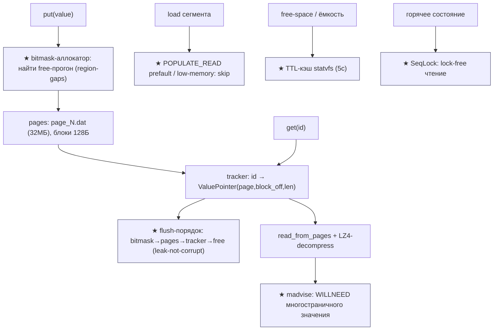

| Контекст | Ответственность | Файлы |
|---|---|---|
| **★ Bitmask-аллокатор** | free-space битмаска + region-gaps best-fit | `gridstore/src/bitmask/mod.rs`, `bitmask/gaps.rs` |
| **Pages** | фикс-страницы 32МБ, блоки 128Б, value через страницы | `gridstore/src/pages.rs`, `config.rs` |
| **Tracker** | id → `ValuePointer(page,block_off,len)` (mmap) | `gridstore/src/tracker.rs` |
| **★ Flush/crash-safety** | порядок flush, leak-not-corrupt | `gridstore/src/gridstore/mod.rs` |
| **★ mmap/madvise** | POPULATE_READ / WILLNEED / low-memory | `common/src/mmap/advice.rs`, `low_memory.rs` |
| **WAL** | CRC32C-цепочка, recovery до mismatch | `lib/wal/src/segment.rs` |
| **★ SeqLock** | lock-free чтение горячего состояния | `lib/trififo/src/seqlock.rs` |
| **★ Capacity** | free-space с TTL-кэшем | `common/src/disk_usage.rs` |
| **Optimizers** | vacuum (deleted_ratio) + merge (greedy) | `collection_manager/optimizers/*` |
| ⚠️ Quantization/HNSW | вектор-специфика — **не для нас** | `lib/quantization/`, `index/hnsw_index/` |

---

## 2. Архитектурные диаграммы (Mermaid)

### Qd1. gridstore: bitmask-аллокатор + region-gaps (★)

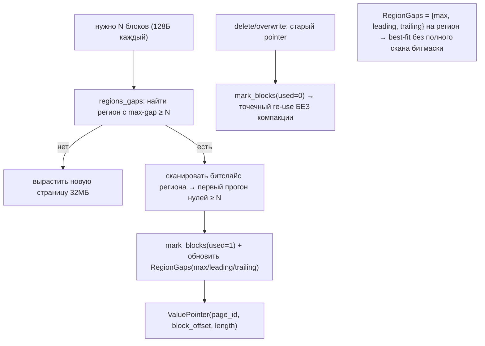

### Qd2. Crash-safety: «течь, но не портить» (★)

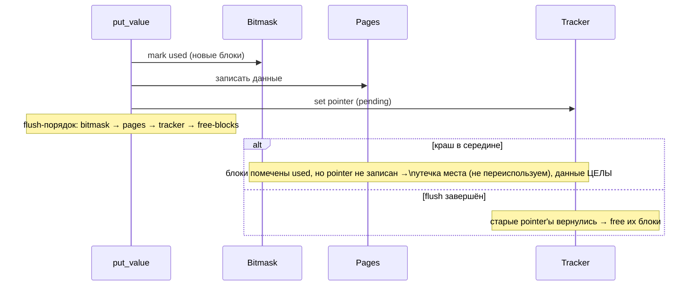

### Qd3. mmap/madvise дисциплина (★)

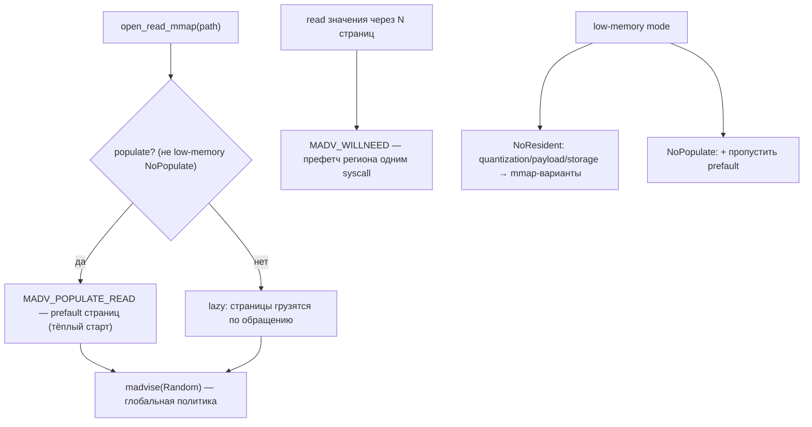

### Qd4. SeqLock: lock-free чтение (★)

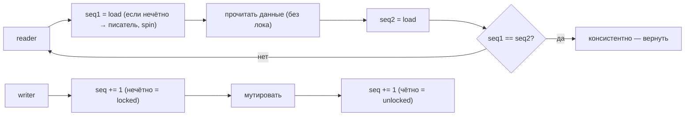

### Qd5. Capacity TTL-кэш (★)

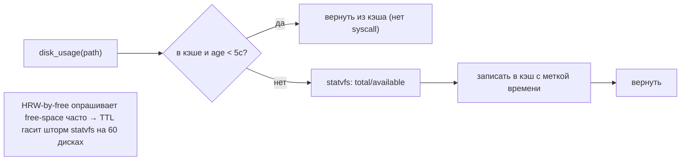

### Qd6. ⚠️ Что НЕ берём (вектор-специфика)

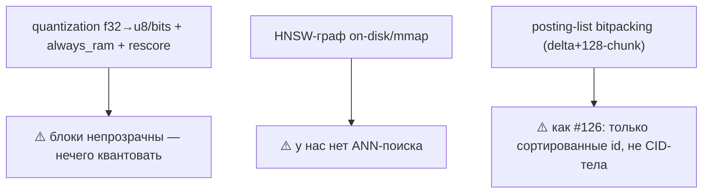

---

## 2-bis. Файловая система: раскладка и потоки (Mermaid)

### FS1. Раскладка gridstore на диске

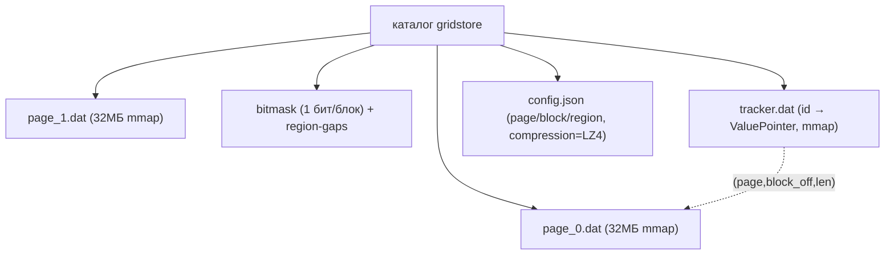

### FS2. Запись значения (put)

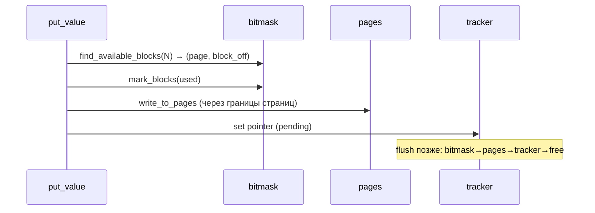

### FS3. WAL: append + recovery по CRC

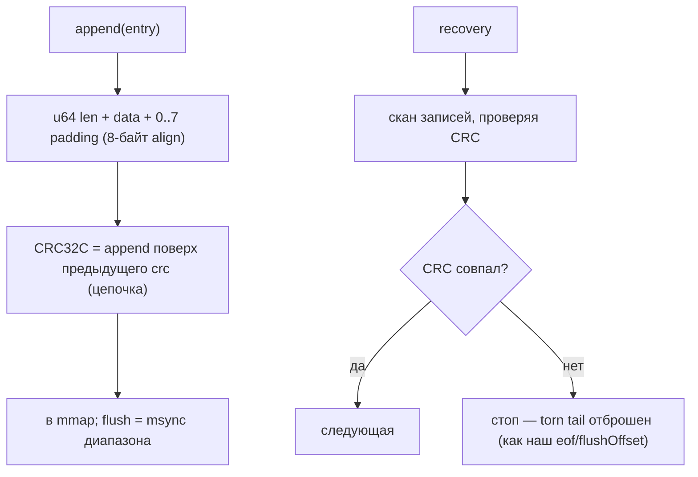

### FS4. mmap madvise по носителю/режиму

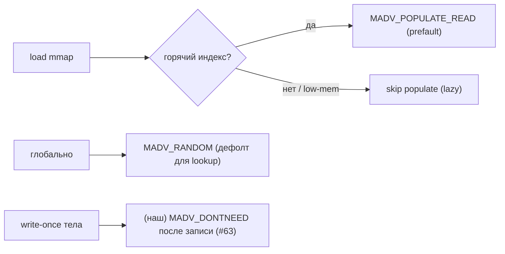

### FS5. Atomic save состояния

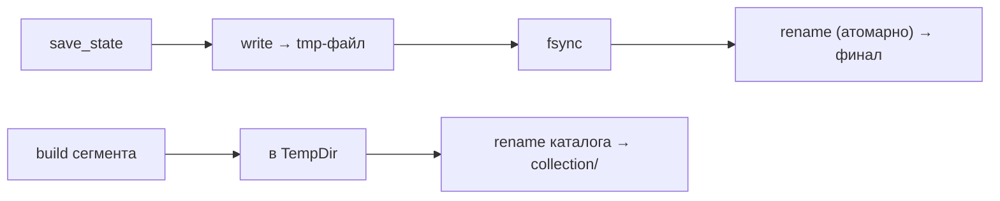

### FS6. Bitmask-аллокатор: точечный re-use дырок (#133)

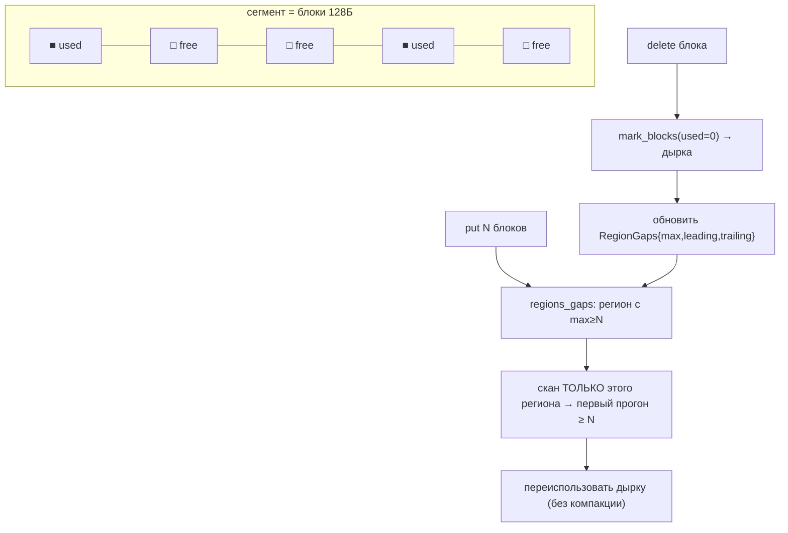

### FS7. Crash-safety «течь, но не портить»: порядок фаз (#134)

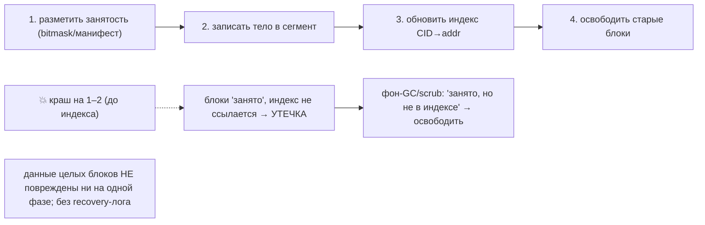

---

## 3. Ubiquitous Language (термины Qdrant → наши)

| Термин | Значение | Наш аналог |
|---|---|---|
| **gridstore** | кастомный on-disk blob-store (Rust) | наш data-tier (pack-сегменты) |
| **page (page_N.dat)** | фикс-файл 32МБ | сегмент |
| **block (128Б)** | мин. единица аллокации | (нет — у нас append; bitmask = альтернатива) |
| **region (8192 блока)** | группа блоков с gap-сводкой | (нет — новое, #133) |
| **bitmask + RegionGaps** | free-space индекс (max/leading/trailing) | **★ новое** (#133) |
| **tracker / ValuePointer** | id → (page, block_off, len) | индекс `CID→(seg,off,len)` |
| **flusher** | порядок flush компонентов | recovery-point + манифест |
| **MADV_POPULATE_READ / WILLNEED** | prefault / префетч | **★ новое** (#135); DONTNEED = #63 |
| **low_memory_mode** | NoResident / NoPopulate | тиринг RAM↔mmap |
| **SeqLock** | lock-free чтение состояния | **★ новое** (#136) |
| **vacuum / merge optimizer** | rebuild по deleted_ratio / greedy-merge | наша компакция/GC |
| ⚠️ quantization / HNSW | сжатие векторов / ANN-граф | **не для нас** (непрозрачные блоки) |

---

## 4. Что берём (★) и почему — кратко

| # | Идея | Откуда | Зачем нам |
|---|---|---|---|
| **133** | Bitmask-аллокатор + per-region gap-summary (max/leading/trailing) | `gridstore/bitmask` | точечный re-use освободившихся блоков **без полной компакции**; best-fit без скана |
| **134** | Crash-safety «течь, но не портить»: порядок flush, leak-not-corrupt | `gridstore/mod.rs` | крах переразмечает занятое (утечка, чинится позже), данные никогда не портятся; без recovery-лога |
| **135** | madvise-дисциплина: POPULATE_READ + WILLNEED + low-memory тиры | `mmap/advice.rs`, `low_memory.rs` | тёплый старт горячего индекса, префетч многостраничного значения, деградация под нехватку RAM |
| **136** | SeqLock: lock-free чтение горячего состояния | `trififo/seqlock.rs` | дёшево читать free-space/ёмкость/статы под нагрузкой (читатели не блокируются) |
| **137** | TTL-кэш ёмкости/free-space (~5с) | `disk_usage.rs` | HRW-by-free часто опрашивает free → гасим шторм `statvfs` на 60 дисках |

---

## 5. Конвергенция (Qdrant ≈ наш дизайн — повторная валидация)

- **gridstore pages + ValuePointer** = наш сегмент + индекс `(seg,off,len)` — **Rust-референс нашего слоя**.
- **WAL**: CRC32C-цепочка per-entry + recovery **до первого несовпадения** + 8-байт паддинг + random-seed
  на сегмент + mmap+msync — = Kafka recovery-point (#111), eof-маркер (#99), torn-tail по CRC.
- **atomic-save** (temp→fsync→rename), **segment-build в TempDir→rename** = durable swap (#67) + манифест.
- **vacuum-optimizer** (rebuild при `deleted_ratio` > порога И ≥ min-points) = наш age/garbage-gated GC;
  **merge-optimizer** (greedy-batch, гарантия снижения числа сегментов: batch ≥3 или ≥2 batches) =
  minor/major компакция (Hive #104/#105).
- **O_DIRECT + io_uring + user-space 16КБ block-cache** = #72 (Dragonfly) + NVMe L2-кэш.
- **LZ4-сжатие значений** = наша опц. zstd тел.
- ⚠️ **quantization / HNSW / rescore / posting-bitpacking** — вектор-специфика, **не берём** (блоки
  непрозрачны; posting-bitpacking = как #126, только сортированные id).

---

## 9-bis. Снипеты кода (реальные выдержки + объяснение)

### QD1. Конфиг gridstore: страницы/блоки/регионы (#133 контекст)

`gridstore/src/config.rs:1-10`:

```rust
pub const DEFAULT_BLOCK_SIZE_BYTES: usize = 128;
pub const DEFAULT_PAGE_SIZE_BYTES: usize = 32 * 1024 * 1024; // 32MB
pub const DEFAULT_REGION_SIZE_BLOCKS: usize = 8_192;
```

**Зачем нам:** иерархия page(32МБ)→region(8192 блока)→block(128Б). Блок = единица аллокации; регион =
единица сводки свободного места. У нас сегмент(2ГБ) мог бы получить такой же sub-блочный аллокатор.

### QD2. RegionGaps: сводка свободного места на регион (#133)

`gridstore/src/bitmask/gaps.rs:13-19`:

```rust
#[repr(C)]
pub struct RegionGaps {
    pub max: u16,       // самый длинный свободный прогон в регионе
    pub leading: u16,   // свободных блоков с начала
    pub trailing: u16,  // свободных блоков с конца
}
```

**Зачем:** чтобы найти место под N блоков, не сканируем всю битмаску — берём регион, где `max ≥ N`
(`leading/trailing` помогают сшивать прогоны на границах регионов). O(числа регионов), не O(блоков).

### QD3. find_available_blocks: best-fit через gap-сводку (#133)

`gridstore/src/bitmask/mod.rs:252-282`:

```rust
pub(crate) fn find_available_blocks(&self, num_blocks: u32)
    -> Result<Option<(PageId, BlockOffset)>> {
    let Some(region_id_range) = self.regions_gaps.find_fitting_gap(num_blocks)? else {
        return Ok(None);                 // нет подходящего региона → вырастить страницу
    };
    let all_bits = self.bitslice.read_all()?;
    let regions_bitslice = &all_bits[regions_start_offset..regions_end_offset];
    Ok(Self::find_available_blocks_in_slice(...))   // скан ТОЛЬКО внутри найденного региона
}
```

**Зачем нам:** альтернатива append-only + компакция — **точечно переиспользовать дырки** от удалённых
блоков (как Dragonfly segmented-alloc #..., но с быстрым free-space-индексом).

### QD4. ValuePointer: id → (page, block_off, len) (#133 контекст)

`gridstore/src/tracker.rs:82-103`:

```rust
#[repr(C)]
pub struct ValuePointer {
    pub page_id: PageId,            // u32: какая страница
    pub block_offset: BlockOffset, // u32: смещение в БЛОКАХ
    pub length: u32,               // длина значения в байтах
}
```

**Наш аналог:** ровно `CID→(seg, off, len)`. Tracker = sparse-массив в mmap `tracker.dat`. Прямая
Rust-валидация нашей адресной модели.

### QD5. Crash-safety: «течь, но не портить» (#134)

`gridstore/src/gridstore/mod.rs:232-278` (док-коммент к `put_value`):

```rust
// This function needs to NOT corrupt data in case of a crash.
// ... we don't want to flush on every write ...
// In case of crashing somewhere in the middle of this operation, the worst
// that should happen is that we mark more cells as used than they actually are,
// so will never reuse such space, but data will not be corrupted.
```

И порядок flush (`mod.rs:443-483`): **bitmask → pages → tracker → free-blocks**.
**Зачем нам:** дизайн-принцип — упорядочить запись так, чтобы крах давал **утечку места** (безопасно,
чинится фоном), а не порчу/потерю. Усиливает two-phase-delete (#84) и манифест.

### QD6. madvise: POPULATE_READ (prefault) + low-memory (#135)

`common/src/mmap/advice.rs:114-141`:

```rust
fn populate(&self) {
    if crate::low_memory::low_memory_mode().skip_populate() {
        return;                                  // low-memory: НЕ prefault
    }
    if *POPULATE_READ_IS_SUPPORTED {
        match self.advise_impl(memmap2::Advice::PopulateRead) {  // MADV_POPULATE_READ (5.14+)
            Ok(()) => return,
            Err(_) => { /* fallback: читать каждый 512-й байт */ }
        }
    }
    self.populate_simple_impl();
}
```

**Зачем нам:** на старте **прогреть горячий индекс/Summary** (prefault), а под нехватку RAM —
`NoPopulate` пропускает прогрев (lazy). Парный к нашему `DONTNEED` (#63) для write-once тел.

### QD7. madvise: WILLNEED для многостраничного значения (#135)

`common/src/mmap/advice.rs:276-302`:

```rust
pub fn will_need_multiple_pages(region: &[u8]) {
    // ... page-align addr ...
    let res = unsafe { nix::libc::madvise(addr as *mut _, length, nix::libc::MADV_WILLNEED) };
    // префетч всего региона одним syscall, когда значение пересекает границы страниц
}
```

**Зачем:** блок/значение, лежащее через несколько страниц mmap — **префетчить целиком одним
madvise**, а не ловить page-fault на каждой странице (на HDD это серия seek'ов).

### QD8. low-memory режимы: тиринг RAM↔mmap (#135)

`common/src/low_memory.rs:19-34`:

```rust
pub enum LowMemoryMode {
    Disabled,
    NoResident,   // quantization always_ram=false; payload index on_disk=true; storage = mmap
    NoPopulate,   // то же + пропустить prefault на load
}
```

**Зачем нам:** один тумблер «мало RAM» переводит компоненты с RAM-варианта на mmap-вариант (тот же
байтовый формат → можно вернуть назад без rebuild). Перекликается с нашим тирингом и LazyIndex (#112).

### QD9. SeqLock: lock-free чтение (#136)

`trififo/src/seqlock.rs` (read):

```rust
fn read<U, F: Fn(&T) -> U>(&self, callback: F) -> U {
    loop {
        let seq1 = self.seq.load(Ordering::Acquire);
        if seq1 & 1 == 1 { std::hint::spin_loop(); continue; } // нечётно → писатель
        let result = callback(unsafe { &*self.inner.get() });
        fence(Ordering::Acquire);
        if seq1 == self.seq.load(Ordering::Relaxed) { return result; } // seq не изменился → ок
    }
}
```

**Зачем нам:** читать **горячее разделяемое состояние** (free-space, ёмкость диска, статистику кэша,
горячий хвост индекса) **без блокировки читателей** — важно при широком параллелизме на 60 дисках.

### QD10. WAL recovery: скан до первого несовпадения CRC (конвергенция)

`lib/wal/src/segment.rs:242-306` (сокр.):

```rust
while offset + HEADER_LEN + CRC_LEN < capacity {
    let len = LittleEndian::read_u64(&segment[offset..]) as usize;
    let entry_crc = crc32c::crc32c_append(!crc.reverse_bits(), &segment[offset..offset+HEADER_LEN+padded_len]);
    let stored_crc = LittleEndian::read_u32(&segment[offset+HEADER_LEN+padded_len..]);
    if entry_crc != stored_crc { break; }   // несовпадение → torn tail, стоп
    crc = entry_crc;                         // CRC-ЦЕПОЧКА (seed + поверх предыдущего)
    index.push((offset + HEADER_LEN, len));
    offset += HEADER_LEN + padded_len + CRC_LEN;
}
```

**Конвергенция:** ровно наш torn-tail по CRC (Kafka recovery-point #111, eof-маркер #99). CRC-цепочка +
random-seed на сегмент — аккуратная деталь.

### QD11 (диаграмма). Где Qdrant полезен vs неприменим

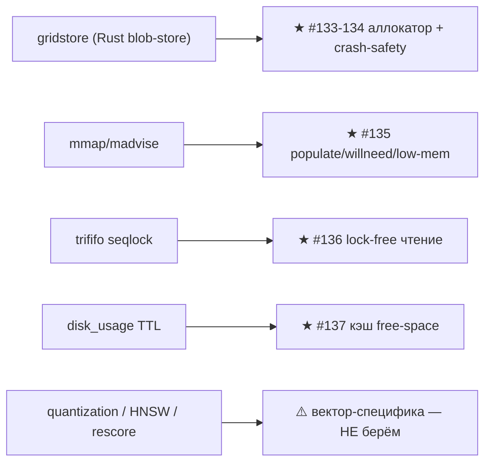

---

## 10. Извлечённые идеи для OpenZFS Daemon

### Конвергенция (Qdrant на Rust — валидация нашей модели)
- gridstore pages+ValuePointer = сегмент+индекс; WAL CRC-цепочка+recovery = recovery-point/eof;
  atomic-save = durable swap; vacuum/merge = компакция/GC; O_DIRECT+io_uring = #72; LZ4 = опц. zstd.
- ⚠️ Не берём: quantization, HNSW, rescore, posting-bitpacking (вектор-специфика / только сортированные id).

### Главные новые заимствования
- **#133 ★** Bitmask-аллокатор + per-region gap-summary (max/leading/trailing) — точечный re-use
  дырок без полной компакции; best-fit без скана.
- **#134 ★** Crash-safety «течь, но не портить»: порядок flush bitmask→pages→tracker→free; крах =
  утечка места (чинится фоном), не порча данных; без recovery-лога.
- **#135 ★** madvise-дисциплина: POPULATE_READ (prefault горячего индекса) + WILLNEED (префетч
  многостраничного значения) + low-memory тиры (NoResident/NoPopulate).
- **#136 ★** SeqLock: lock-free чтение горячего состояния (free-space/ёмкость/статы/хвост индекса).
- **#137** TTL-кэш ёмкости/free-space (~5с) — гасит шторм `statvfs` при HRW-by-free на 60 дисках.

---

## 11. Источники в коде (для перепроверки)

- `gridstore/src/config.rs:1-67` page/block/region + LZ4; `pages.rs:20-428` раскладка/запись страниц
- `gridstore/src/bitmask/mod.rs:36-47,252-282,383-427`, `bitmask/gaps.rs:13-19` битмаска + region-gaps
- `gridstore/src/tracker.rs:35-103,355-367,506-625` tracker/ValuePointer/pending; `gridstore/mod.rs:232-483` crash-safety/flush; `gridstore/view.rs:93-110` get_value
- `common/src/mmap/advice.rs:10-141,276-302`, `mmap/ops.rs:86-100`, `low_memory.rs:6-48` madvise/low-mem
- `lib/wal/src/segment.rs:152-447` WAL append/flush/truncate/recovery
- `lib/trififo/src/seqlock.rs` SeqLock lock-free
- `common/src/disk_usage.rs:44-72` TTL-кэш free-space
- `common/src/save_on_disk.rs:151-159`, `segment_constructor/segment_builder.rs:759-762` atomic-save
- `collection_manager/optimizers/{vacuum,merge}_optimizer.rs` оптимайзеры
- `common/src/universal_io/{disk_cache/mod.rs,io_uring/mod.rs}` 16КБ block-cache + O_DIRECT/io_uring
- ⚠️ (не берём) `lib/quantization/src/encoded_vectors_{u8,pq,binary}.rs`, `index/hnsw_index/*`

---

*Связано: [pack-segments (Feynman)](../../Feynman/pack-segments.md), [STORAGE-IDEAS-SYNTHESIS.md](STORAGE-IDEAS-SYNTHESIS.md), [dragonfly (segmented-alloc, O_DIRECT)](dragonfly-storage-hdd-ssd.md), [kafka (recovery-point)](kafka-storage-hdd-ssd.md), [redis (DONTNEED, durable-swap)](redis-storage-hdd-ssd.md).*
