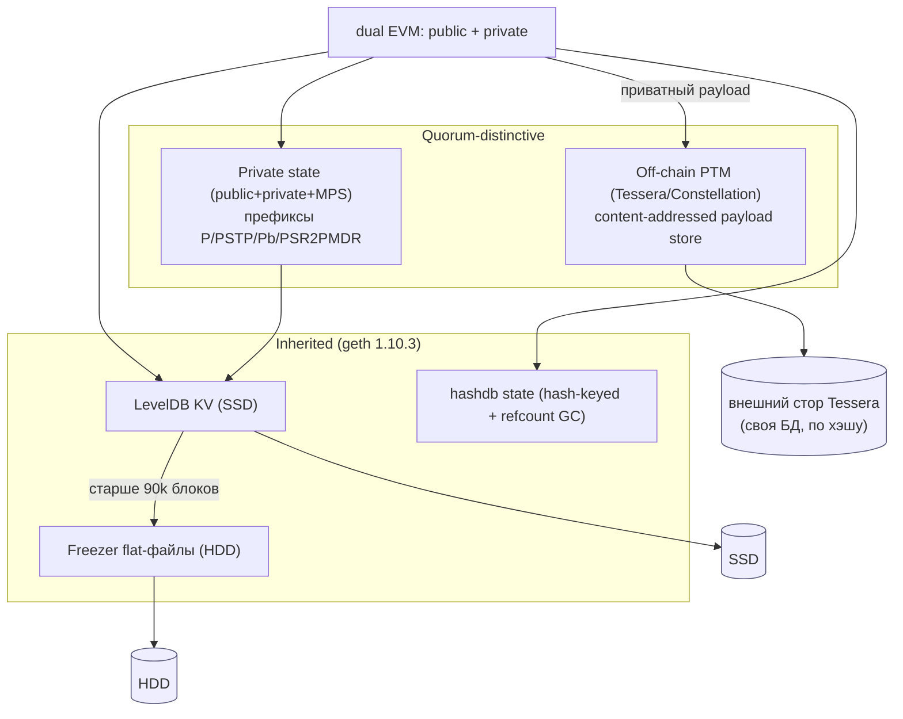
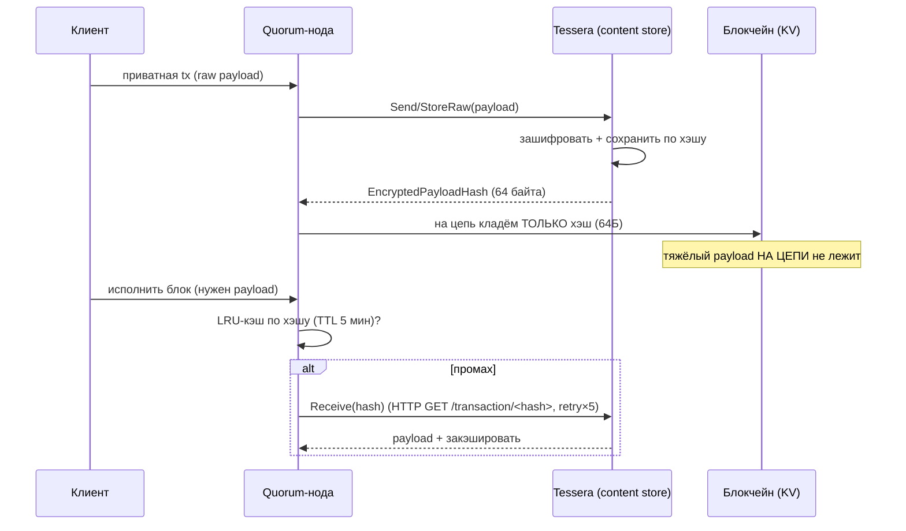
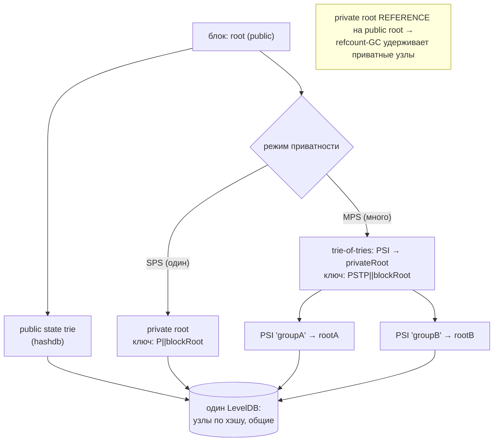
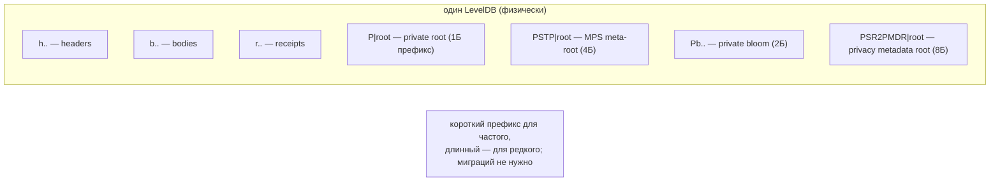
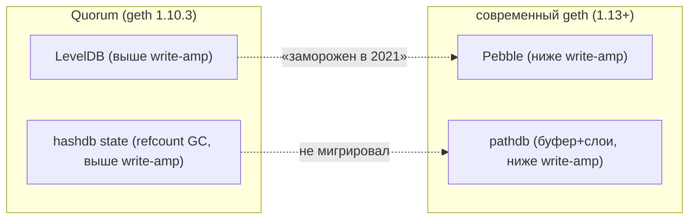

# GoQuorum Storage — как Quorum работает с HDD/SSD (DDD-разбор исходников)

> Исследование исходников **Consensys/quorum** (`Vendor/quorum`, свежий слой, commit
> `5ffacc48…` от 2026-06-05). Все факты — с ссылками `файл:строка`, проверены в коде.

TL;DR: Quorum — форк **go-ethereum 1.10.3** (старый базис: **LevelDB**, без Pebble; **hashdb**,
без pathdb; freezer того же формата). Storage-механика «как с HDD/SSD» в основном = geth
(см. [go-ethereum doc](go-ethereum-storage-hdd-ssd.md)). **Новые** же идеи у Quorum — две, и обе
прямо релевантны нашему content-addressed blockstore:

1. **Off-chain content-addressed хранилище приватных payload'ов** (Tessera): на цепи лежит лишь
   **64-байтный хэш-указатель**, тяжёлый зашифрованный payload — во внешнем сторе, адресуемом по
   хэшу, с **LRU fetch-кэшем** и **pluggable-бэкендом**. Это буквально наша модель «CID-указатель
   + IPFS как backing store».
2. **Логическое неймспейсинг-разделение на одном физическом KV** через префиксы ключей
   (`P`, `PSTP`, `Pb`, `PSR2PMDR`) — несколько логических сторов на одном физическом.

> ⚠️ Контекст: merge-коммит свежего слоя — «end-support». GoQuorum сворачивается Consensys; берём
> **идеи** (они вне времени), а не как образец актуального стека (его база — geth 2021 года).

---

## 1. Bounded Contexts хранения Quorum



| Контекст | Роль | Где в коде |
|---|---|---|
| **Inherited geth** | LevelDB + freezer + hashdb (как geth 1.10.3) | `ethdb/leveldb`, `core/rawdb/freezer*`, `trie/database.go` |
| **Private state** | public+private+MPS на одном KV, неймспейсинг префиксами | `core/rawdb/database_quorum.go`, `core/mps/` |
| **Off-chain PTM** | content-addressed payload вне цепи, hash-указатель на цепи | `private/`, `private/engine/tessera/` |

---

## 2. Архитектурные диаграммы (Mermaid)

### Q1. Off-chain content-addressed payload (★ ключевая идея — это наша модель)



### Q2. Dual / Multiple Private States (логические сторы на одном KV)



### Q3. Неймспейсинг логических данных префиксами ключей (один физический KV)



### Q4. Унаследованный стек vs современный geth (что Quorum НЕ взял)



---

## 3. Ubiquitous Language (термины Quorum)

| Термин | Значение | Где в коде |
|---|---|---|
| **PTM** (Private Tx Manager) | внешний content-addressed стор payload'ов (Tessera/Constellation) | `private/private.go:39` |
| **EncryptedPayloadHash** | **64-байтный** хэш-указатель на off-chain payload | `common/types.go:45,57` |
| **PSI** | Private State Identifier — id приватной группы | `core/mps/`, `types/mps.go` |
| **SPS / MPS** | Single / Multiple Private States | `core/mps/multiple_psr.go` |
| **PrivacyMetadata** | per-contract метаданные приватности | `core/state/account_extra_data.go:121` |

---

## 4. Унаследованный базис (кратко — детали в geth-документе)

Quorum = **geth 1.10.3** (`params/version.go:24` → Major=1, Minor=10, Patch=3; QuorumVersion 24.x).
- **KV: только LevelDB** (`ethdb/` содержит `leveldb`+`memorydb`, **нет `pebble`**). Опции:
  block cache `cache/2`, write buffer `cache/4`, bloom **10 бит**, handles (`ethdb/leveldb/leveldb.go`).
- **Freezer**: тот же формат — data-файлы **2 ГБ**, index-запись **6 байт** (`filenum u16+offset u32`),
  **snappy**, порог `FullImmutabilityThreshold = 90000` (`core/rawdb/freezer_table.go`, `params/network_params.go`).
- **State: только hashdb** (узлы по хэшу, refcount-GC; `pathdb` отсутствует — `grep pathdb` = 0).

> Вывод: по HDD/SSD-механике Quorum = «geth образца 2021». **Не взяв Pebble и pathdb, он несёт
> более высокий write-amplification** на горячем пути. Урок для нас — **держать движок
> подключаемым**, чтобы менять субстрат со временем (мы это и заложили: `ShardEngine`-порт).

---

## 5. Отличие №1 — off-chain content-addressed payload store (★)

`PrivateTransactionManager` (`private/private.go:42–46`):
`Send/StoreRaw(payload) → EncryptedPayloadHash` (на цепь идёт только хэш),
`Receive(hash) → payload` (достать по хэшу). Хэш — **64 байта** (`common/types.go:45`).

- **На цепи — только указатель.** В приватной tx data заменяется на хэш
  (`internal/ethapi/api.go:458`); создаётся Privacy Marker Tx с `ptmHash.Bytes()`.
- **Payload — во внешнем content-addressed сторе** (Tessera БД), достаётся по хэшу через HTTP
  `GET /transaction/<hash>` с **retry×5** (`private/engine/tessera/tessera.go`).
- **LRU fetch-кэш** декодированных payload'ов: TTL **5 минут** (`private/cache/cache.go:11`) —
  чтобы не дёргать внешний стор повторно.
- **Pluggable бэкенды**: Tessera / Constellation / qlight, выбор по `/version`
  (`private/private.go:92`).

> Это **в точности наша модель**: контент-адресуемый стор (наш OpenZFS Daemon ≈ Tessera) +
> хэш-указатель у потребителя (CID в DAG/у клиента) + LRU-кэш горячего + ретраи при fetch.
> Quorum подтверждает паттерн «hash-pointer на быстром сторе + тяжёлый блок в CAS + fetch-кэш».

---

## 6. Отличие №2 — неймспейсинг и dual/MPS состояние

- **Несколько логических сторов на одном физическом KV** через префиксы ключей
  (`core/rawdb/database_quorum.go:28–35`): `P` (private root), `PSTP` (MPS meta-root),
  `Pb` (private bloom), `PSR2PMDR` (privacy-metadata root). Длина префикса ~ частоте обращения.
- **MPS = trie-of-tries**: `PSI → privateRoot` в отдельном trie, его корень индексируется по
  блоку (`core/mps/multiple_psr.go:101,186,201`).
- **Координация GC**: приватный root делает `Reference` на public root → refcount-GC держит
  приватные узлы, пока публичный блок каноничен (`core/privatecache/`, `blockchain.go`).

> Идея: на нашем **index-tier (redb)** можно так же неймспейсить логические области ключами
> (напр. `b|cid` — блоки, `p|cid` — pin-метаданные, `s|seg` — мета сегментов) на одном физическом
> сторе, без отдельных БД.

---

## 7. Философия и вывод XFS/ZFS

По носителям Quorum = geth (см. [go-ethereum §7](go-ethereum-storage-hdd-ssd.md)): горячий
LevelDB+state → **SSD/XFS**; freezer (append-only) → **HDD** (ZFS оправдан, но `compression=off` —
freezer уже snappy). **Плюс** новый слой: **off-chain payload store** — это отдельная БД
(Tessera), которую можно размещать/масштабировать независимо (хоть на нашем blockstore!).

**Вывод:** одна ФС на ноду → **XFS**; off-chain CAS (payload-стор) — отдельный сервис со своим
носителем (идеальный кандидат — content-addressed система вроде нашей).

---

## 7-bis. Снипеты кода (реальные выдержки + объяснение)

### CS1. Off-chain content-addressed payload (≈ наша модель)

```go
// private/engine/tessera/tessera.go:78 — Send()
t.submitJSON("POST", "/send", &sendRequest{Payload: data, From: from, To: to}, response)
eph, _ := common.Base64ToEncryptedPayloadHash(response.Key)   // на цепь — только 64-байтный hash
return response.SenderKey, response.ManagedParties, eph, nil   // тяжёлый payload остаётся off-chain
// common/types.go:45 — const EncryptedPayloadHashLength = 64
```

**Объяснение:** контент шифруется и кладётся во внешний CAS (Tessera) по хэшу; на цепи — только
hash-указатель. → **это наша модель**: лёгкий CID-указатель + тяжёлый блок в content-addressed сторе.

### CS2. Неймспейсинг ключей префиксами в одном KV

```go
// core/rawdb/database_quorum.go:27
var ( privateRootPrefix = []byte("P"); privateBloomPrefix = []byte("Pb"); ... )
func GetPrivateStateRoot(db ethdb.Database, blockRoot common.Hash) common.Hash {
    root, _ := db.Get(append(privateRootPrefix, blockRoot[:]...)); return common.BytesToHash(root)
}
```

**Объяснение:** несколько логических сторов в одном LevelDB через байт-префиксы. → наш **неймспейсинг
index-tier** (`b|cid`, `p|cid`, `s|seg`).

### CS3. LRU fetch-кэш + retry для удалённого payload

```go
// private/engine/tessera/tessera.go:264 — receive()
if item, found := t.cache.Get(cacheKey); found { return ...cached... }   // LRU-хит
for i := 0; i < 5; i++ {                                                  // retry×5, backoff 1с
    statusCode, err = t.submitJSON("GET", uri, nil, response)
    if err != nil && statusCode != http.StatusNotFound { time.Sleep(1*time.Second); continue }
    break
}
t.cache.Set(cacheKey, ...payload..., DefaultExpiration /* 5мин TTL */)
```

**Объяснение:** декодированный payload кэшируется (TTL 5мин), при промахе — GET с retry×5. → наш
**LRU fetch-кэш горячих блоков + retry** при удалённом fetch (Bitswap).

---

## 8. Извлечённые идеи для OpenZFS Daemon

| Идея из Quorum | Где применить | Эффект |
|---|---|---|
| **Hash-pointer + off-chain CAS + LRU fetch-кэш + retry** (PTM) | это наша модель: подтверждает CID-указатель + наш стор как backing; добавить **LRU fetch-кэш** горячих блоков и **retry** при сетевом fetch (Bitswap) | валидация архитектуры + конкретные приёмы кэша/ретраев |
| **Pluggable backend по «/version»-детекту** | наш `ShardEngine`/remote-fetch — интерфейс с несколькими реализациями | гибкость, безопасная эволюция |
| **Неймспейсинг префиксами ключей на одном KV** | index-tier redb: `b\|cid` блоки, `p\|cid` пины, `s\|seg` мета сегментов | один стор, без отдельных БД и миграций |
| **Несколько логических сторов с координацией GC через reference** | если введём «namespaces»/«buckets» блоков — общий физический стор, ссылочный GC | дешёвая мультиарендность |
| **Урок «замороженного субстрата»** (нет Pebble/pathdb → выше write-amp) | держать `ShardEngine` подключаемым; не вшивать формат намертво | возможность апгрейда движка без переписывания |

### Главное заимствование
**Off-chain content-addressed store + hash-pointer + LRU fetch-кэш + retry** — Quorum (через
Tessera) реализует ровно тот паттерн, ради которого существует наш проект. Конкретика для нас:
добавить в read-path **LRU-кэш горячих блоков** и **ретраи** при удалённом fetch (см.
[[ton-storage-ideas]] про index-in-RAM и [[geth-storage-ideas]] про write-буфер).

---

## 9. Источники в коде (для перепроверки)

- Off-chain PTM: `private/private.go:39–56,92`, `common/types.go:45,57`,
  `private/cache/cache.go:11`, `private/engine/tessera/tessera.go` (Send/StoreRaw/receive),
  `internal/ethapi/api.go:458`, `core/state_transition.go:281`.
- Private state/неймспейсинг: `core/rawdb/database_quorum.go:28–78`,
  `core/mps/multiple_psr.go:101,186,201`, `core/state/account_extra_data.go:34,121`,
  `core/privatecache/`, `core/blockchain.go` (commit order public→private).
- Унаследованный базис: `params/version.go:24–31`, `ethdb/` (leveldb-only),
  `ethdb/leveldb/leveldb.go`, `core/rawdb/freezer_table.go`, `params/network_params.go`,
  `trie/database.go` (hashdb).
