# Redis Storage — как Redis работает с HDD/SSD (DDD-разбор исходников)

> Исследование исходников **redis/redis** (`Vendor/redis`, свежий слой, commit `23b90e9` от
> 2026-06-08). Все факты — с ссылками `файл:строка`, проверены в коде.

Redis — in-memory хранилище (C), но его **durability-машина** работает с диском двумя путями:
**RDB** (бинарный snapshot всего датасета, пишется форком + CoW) и **AOF** (append-only журнал
команд с режимами fsync). Современный Redis объединяет оба: AOF-rewrite пишет **RDB-base + AOF-tail**
(`aof-use-rdb-preamble`), а множество AOF-файлов отслеживается **манифестом**. Блокирующий I/O
(`fsync`, `close`, lazy-free) вынесен в **фоновые bio-потоки**. Новое и ценное для нас:

1. **★ Сброс page-cache для write-once данных** (`reclaimFilePageCache`/`POSIX_FADV_DONTNEED`) —
   после записи и fsync сегмент **выкидывается из page-cache**, чтобы холодные тела не вытесняли
   горячий индекс/данные.
2. **★ Неблокирующий инкрементальный writeback** (`sync_file_range(SYNC_FILE_RANGE_WRITE)` каждые
   4МБ + `WAIT_BEFORE` на 2× окне) — ограничить грязные страницы **без** полного `fsync`-столла.
3. **★ Фоновые bio-потоки** — `fsync`, `close`, lazy-free уносятся с горячего пути в выделенные
   потоки (FIFO, чтобы сохранить порядок), главный event-loop не блокируется на медленном диске.
4. **★ Манифест мультифайла** (base / incr / history) — атомарное обновление манифеста вместо
   rename-на-файл; старые файлы (history) удаляются фоном. Прямой чертёж для набора pack-сегментов.

> Контекст: Redis — **in-memory**, диск у него только для durability/restart, не для random-read
> тел (всё в RAM). Наши тела на HDD читаются random'ом, поэтому из Redis берём **механику I/O**
> (page-cache hygiene, неблокирующий writeback, offload fsync, манифест, durable rename), а не
> модель «всё в памяти». RDB-base + AOF-tail подтверждает наш checkpoint+WAL для индекса (Ignite #59).

---

## 1. Bounded Contexts

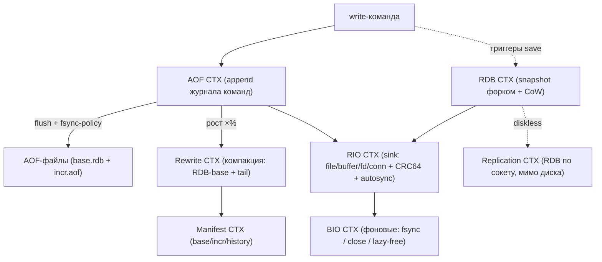

| Контекст | Ответственность | Файлы |
|---|---|---|
| **RDB** | snapshot датасета форком+CoW, инкрементальный fsync | `src/rdb.c`, `src/rdb.h` |
| **AOF** | append команд, fsync-политики, rewrite | `src/aof.c` |
| **Manifest** | мультифайл AOF: base/incr/history, seq/type | `src/aof.c:42-200` |
| **RIO** | абстракция sink (file/buffer/fd/conn) + CRC64 + autosync | `src/rio.c`, `src/rio.h` |
| **BIO** | фоновые потоки: fsync / close / lazy-free | `src/bio.c`, `src/bio.h` |
| **Replication** | diskless sync/load (RDB по сокету) | `src/replication.c`, `redis.conf` |

---

## 2. Архитектурные диаграммы (Mermaid)

### R1. Два пути durability: RDB snapshot vs AOF журнал

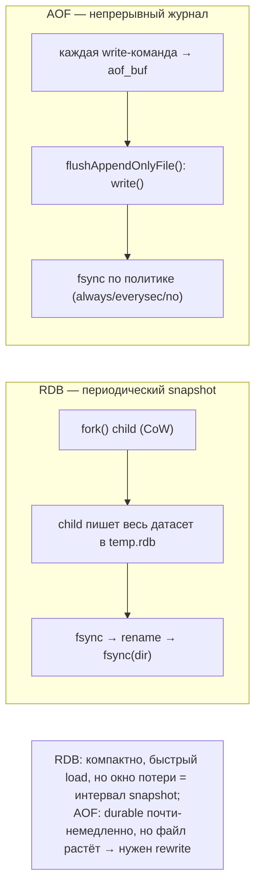

### R2. AOF fsync-политики (durability ↔ throughput)

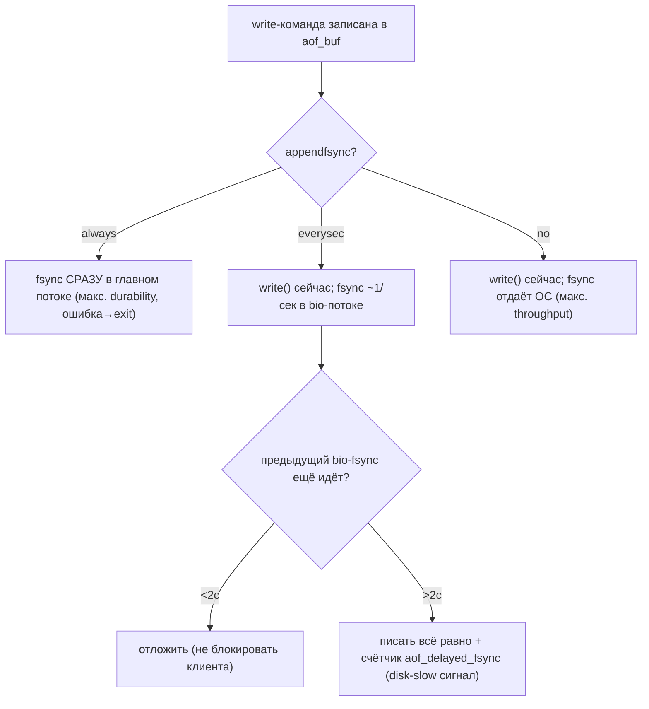

### R3. Инкрементальный fsync + сброс page-cache (rio autosync)

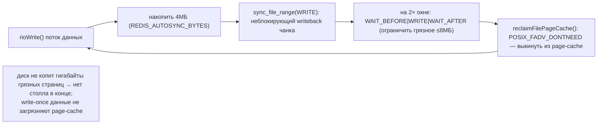

### R4. Фоновые bio-потоки: offload блокирующего I/O

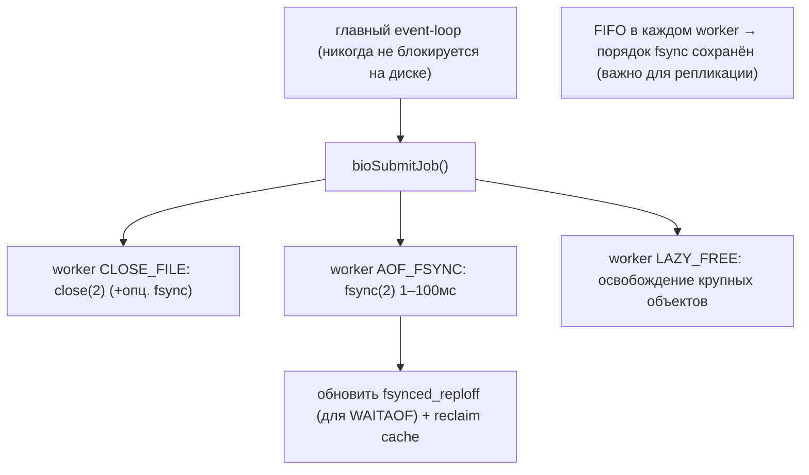

### R5. AOF-rewrite = RDB-base + AOF-tail + манифест

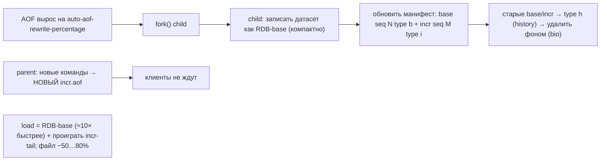

---

## 2-bis. Файловая система: раскладка и потоки (Mermaid)

> Особенность Redis: на диске — **snapshot целиком** (RDB) и/или **журнал команд** (AOF, мультифайл
> в `appendonlydir/` с манифестом). Атомарность — через **temp → fsync → rename → fsync(dir)**.

### FS1. Реальная раскладка на диске

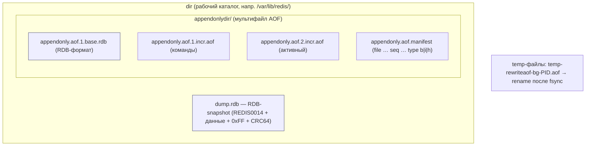

### FS2. Запись AOF: буфер → write() → fsync по политике

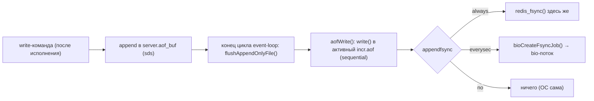

### FS3. RDB-save: fork + CoW + инкрементальный fsync + durable rename

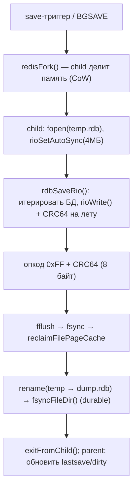

### FS4. Recovery при старте: AOF-манифест (base + incr) или RDB

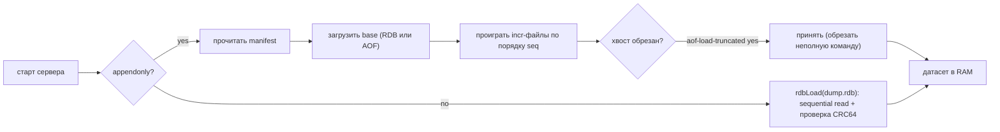

### FS5. Инкрементальный writeback на диске: 4МБ-чанки + сброс page-cache

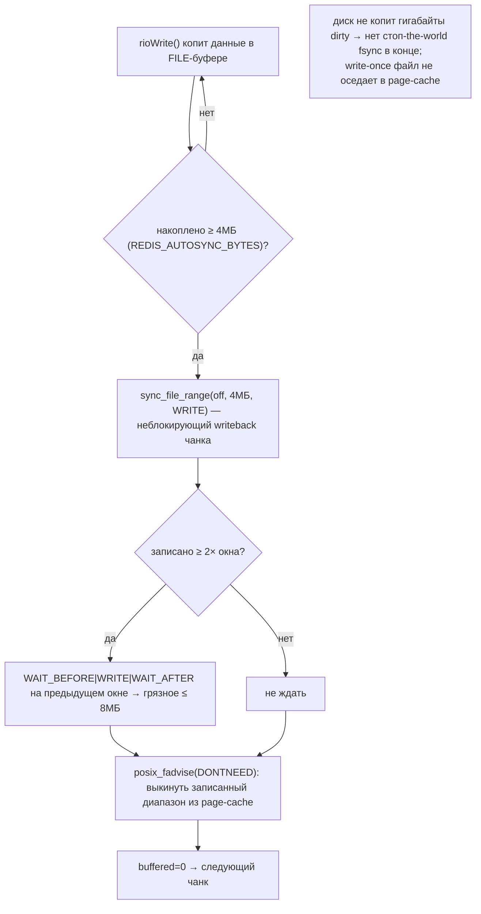

### FS6. AOF-rewrite на уровне файлов: свап через манифест, history → фон-GC

```mermaid
sequenceDiagram
    participant P as parent
    participant C as fork child
    participant FS as appendonlydir/
    participant MF as manifest
    participant BIO as bio (close/unlink)
    P->>C: BGREWRITEAOF → fork()
    C->>FS: писать temp-rewriteaof-bg-PID.aof (RDB-base, autosync 4МБ)
    P->>FS: новые команды → НОВЫЙ appendonly.aof.K.incr.aof
    C->>FS: fflush → fsync → rename(temp → appendonly.aof.N.base.rdb)
    C-->>P: child OK
    P->>MF: атомарно переписать manifest (base seq N type b; incr seq K type i)
    P->>MF: старые base/incr → type h (history)
    MF->>BIO: history-файлы → фоновое удаление (не блокировать event-loop)
    note over FS,MF: набор файлов меняется атомарным свапом ОПИСИ, а не серией rename
```

### FS7. Короткая запись / disk-full: усечение до целой команды

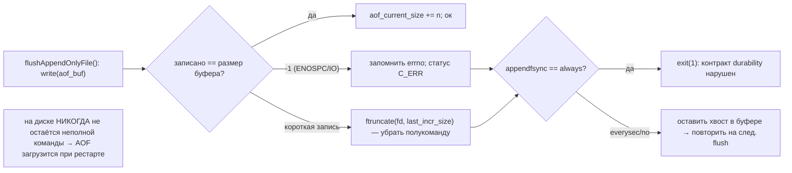

### FS8. Diskless vs disk-backed replication: касаемся ли диска

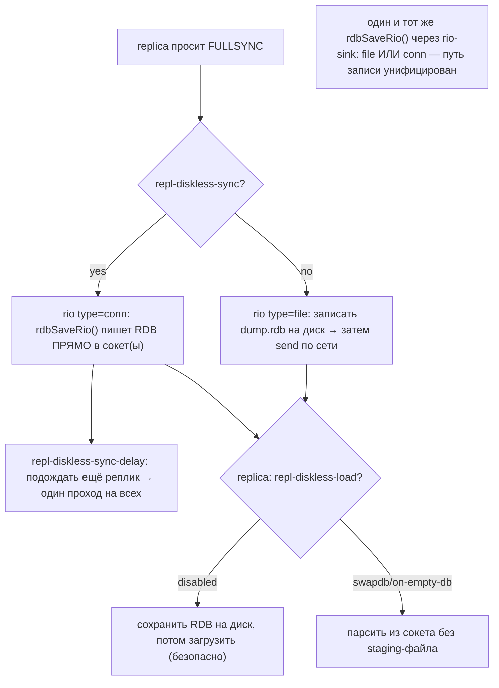

---

## 3. Ubiquitous Language (термины Redis)

| Термин Redis | Значение | Наш аналог |
|---|---|---|
| **RDB** | бинарный snapshot всего датасета | (нет — у нас данные уже на диске; ближе к scrub-dump) |
| **AOF** | append-only журнал команд | WAL индекс-операций (#59) |
| **rewrite** | компакция AOF (base + tail) | checkpoint + GC-компакция сегментов |
| **base / incr / history** | типы файлов в манифесте | active / sealed / pending-delete сегменты |
| **manifest** | список файлов AOF (seq, type) | **per-disk манифест pack-сегментов** |
| **bio** | фоновые I/O-потоки (fsync/close/lazyfree) | per-disk фоновый пул (offload fsync/close) |
| **autosync** | fsync каждые N байт | инкрементальный fsync write-буфера |
| **rio** | абстракция sink (file/buffer/fd/conn) | backend-абстракция ShardEngine (PolarVFS-style) |
| **diskless sync** | RDB по сокету мимо диска | resilver/handoff: поток реплики мимо temp-файла |
| **CoW fork child** | snapshot форком | (не нужен — иммутабельность + redb-MVCC) |

---

## 4. RDB — snapshot форком + Copy-on-Write

Формат: магия `REDIS%04d` (версия 14, `rdb.h:19-21`) + AUX-поля + данные БД (опкоды
`SELECTDB`/`EXPIRETIME`/`RESIZEDB`, `rdb.h:96-109`) + опкод `EOF`(0xFF) + **CRC64** (8 байт,
`rdb.c:1913-1917`). Строки — variable-length кодирование + опц. **LZF**-сжатие (`rdbcompression`).

Сохранение (`rdbSaveBackground`, `rdb.c:2070-2104`): `redisFork()` → child пишет snapshot, делящий
память с parent через **CoW**; parent продолжает обслуживать клиентов. Запись: `fopen("w")` +
`rioSetAutoSync(4МБ)` + `rdbSaveRio()` → `fflush` → `fsync` → `reclaimFilePageCache` (`rdb.c:1956-1999`),
затем `rename(temp→dump.rdb)` + **`fsyncFileDir()`** (`rdb.c:2055-2060`) — чтобы rename пережил краш.
CoW-оптимизация: `dismissKvstoreBucketsMemory` освобождает хэш-таблицу сразу после обхода (`rdb.c:1901`).
Load — **sequential** `fread` (не mmap, чтобы тот же путь работал по сокету), проверка CRC64.

> Для нас: fork+CoW snapshot **не нужен** (тела уже иммутабельны на диске; индекс — redb с MVCC).
> Берём не модель, а **приёмы записи**: autosync, reclaim-cache, durable rename, streaming-CRC.

---

## 5. AOF — append-only журнал + fsync-политики

Каждая write-команда буферизуется в `server.aof_buf` и сбрасывается `flushAppendOnlyFile()`
(`aof.c:1147-1346`) в конце цикла. **Политики fsync** (`appendfsync`):
- **always** — `redis_fsync()` в главном потоке после каждого write; ошибка fsync → `exit(1)`
  (контракт нарушен, `aof.c`). Макс. durability, мин. throughput.
- **everysec** (деф.) — `write()` сейчас, `fsync` ~1/сек в **bio-потоке** (`aof_background_fsync`,
  `aof.c:983`). Если предыдущий bio-fsync ещё идёт — **отложить write до 2с** (`aof.c:1186-1206`),
  после — писать всё равно и инкрементировать `aof_delayed_fsync` (сигнал «диск медленный»).
- **no** — `write()` сейчас, `fsync` отдан ОС. Макс. throughput, окно потери до ~30с.

Короткая запись (диск полон): `ftruncate` до последней целой команды, чтобы не оставить «полукоманду»
(`aof.c:1237-1275`). `no-appendfsync-on-rewrite` — не fsync'ить во время дочернего rewrite (меньше
latency-спайков). `aof-load-truncated yes` — принять обрезанный хвост при загрузке.

**Rewrite** (`rewriteAppendOnlyFileBackground`, `aof.c:2860-2928`): fork child пишет компактный
**RDB-base** (`aof-use-rdb-preamble`), parent параллельно пишет новые команды в **новый incr.aof**.
`aof-rewrite-incremental-fsync` — те же 4МБ-чанки. Триггер — `auto-aof-rewrite-percentage` (рост ×%)
+ `auto-aof-rewrite-min-size`.

---

## 6. Manifest — мультифайл AOF (Redis 7+)

Набор файлов в `appendonlydir/` описывается **манифестом** (`aof.c:42-200`):
строки `file <имя> seq <N> type <b|i|h>`:
- **b** (base) — snapshot, ≤1 шт (RDB- или AOF-формата);
- **i** (incr) — команды с последнего rewrite, несколько по порядку seq;
- **h** (history) — старые base/incr, ждут удаления → **чистятся фоновым bio-потоком**.

Обновление набора = **атомарная перезапись манифеста** (а не rename каждого файла). Это прямой
чертёж для нашего **per-disk манифеста pack-сегментов**: active/sealed/pending-delete + атомарный
свап описи вместо переименований; удаление отработавших сегментов — в фон.

---

## 7. BIO — фоновые потоки I/O + RIO-абстракция

**BIO** (`bio.c`): 3 worker'а (`bio.h:16-21`) — `CLOSE_FILE`, `AOF_FSYNC`, `LAZY_FREE`. Зачем:
`fsync` блокирует 1–100мс, `close` может ждать writeback — нельзя в главном event-loop. Джобы
**FIFO** в каждом worker'е → порядок fsync сохранён (важно для replication-offset, `bio.c:312-330`).
После fsync — обновить `fsynced_reploff_pending` (для `WAITAOF`) и опц. `reclaimFilePageCache`.

**RIO** (`rio.c`, `rio.h:32-96`): единый sink над `file`/`buffer`/`fd`/`conn`. Один и тот же
`rioWrite()` считает **CRC64 на лету** (`rioGenericUpdateChecksum`, `rio.c:556`) и делает **autosync**
(`rioSetAutoSync`, `rio.c:560`): каждые 4МБ — `sync_file_range(SYNC_FILE_RANGE_WRITE)` (неблокирующий
writeback), на 2× окне — `WAIT_BEFORE|WRITE|WAIT_AFTER`, затем `POSIX_FADV_DONTNEED` (`rio.c:97-154`).
Так путь «писать в файл» и «стримить по сокету реплике» — один код.

---

## 8. Disk-full / write-error и diskless replication

**Disk-full / ошибки записи**: `stop-writes-on-bgsave-error yes` (`redis.conf`) — если фоновый
snapshot упал, **отклонять write'ы** (не подтверждать недурабельные данные, `rdb.c:4527-4557`).
AOF в режиме `always` при ошибке fsync — `exit(1)`; в `everysec/no` — пометить статус, обрезать,
повторить на следующем flush. ENOSPC → write'ы отклоняются до освобождения места.

**Diskless replication** (`repl-diskless-sync yes`): master шлёт RDB **по сокету, минуя диск**
(`repl-diskless-sync-delay` батчит реплик). Replica: `repl-diskless-load` (disabled/swapdb/flushdb/
on-empty-db) — грузить из сокета без staging-файла. Для нас — чертёж resilver/handoff: **стримить
копии блоков реплика→реплика без temp-файла на диске** (через тот же rio-sink type=conn).

---

## 9. Философия и вывод XFS/ZFS

Redis пишет **большими последовательными** потоками (snapshot/rewrite) и **мелким append'ом** (AOF) —
оба паттерна XFS-дружественны. Ключевая гигиена — **не копить грязные страницы** (sync_file_range
по 4МБ) и **не загрязнять page-cache** write-once данными (POSIX_FADV_DONTNEED). На ZFS свой ARC +
CoW поверх этих приёмов был бы двойным буфером; Redis-приёмы рассчитаны на «голый» FS — что точно
наш случай (XFS+JBOD, ADR 0001). Durability rename'а через `fsync(dir)` — обязателен на любом FS.

---

## 9-bis. Снипеты кода (реальные выдержки + объяснение)

### CS1. Неблокирующий writeback (4МБ) + сброс page-cache (#64/#63)

```c
// src/rio.c:113 — rioFileWrite (autosync)
if (r->io.file.buffered >= r->io.file.autosync) {
    fflush(r->io.file.fp);
    sync_file_range(fileno(r->io.file.fp), processed - r->io.file.autosync,
                    r->io.file.autosync, SYNC_FILE_RANGE_WRITE);          // неблокирующий writeback
    if (processed >= (size_t)r->io.file.autosync * 2)
        sync_file_range(..., SYNC_FILE_RANGE_WAIT_BEFORE|SYNC_FILE_RANGE_WRITE|SYNC_FILE_RANGE_WAIT_AFTER);
    if (r->io.file.reclaim_cache) reclaimFilePageCache(fileno(r->io.file.fp), 0, 0);  // POSIX_FADV_DONTNEED
}
```

**Объяснение:** каждые 4МБ — неблокирующий `sync_file_range`, на 2× окне WAIT, затем DONTNEED. → наш
**неблокирующий writeback (#64) + сброс page-cache write-once тел (#63)**.

### CS2. Durable swap: rename → fsync(dir) (#67)

```c
// src/rdb.c:2041 — rdbSave
if (rename(tmpfile, filename) == -1) { unlink(tmpfile); return C_ERR; }
if (fsyncFileDir(filename) != 0) {                       // fsync КАТАЛОГА → rename переживёт краш
    serverLog(LL_WARNING, "Failed to fsync directory while saving DB: %s", strerror(errno));
    return C_ERR;
}
```

**Объяснение:** `rename` + **fsync каталога** → переименование durable. → наш **durable swap
`temp→fsync→rename→fsync(dir)` (#67)** для финализации сегмента/манифеста.

### CS3. delayed-fsync метрика + write-deferral (#68/#111)

```c
// src/aof.c:1186 — flushAppendOnlyFile (everysec)
if (server.aof_fsync == AOF_FSYNC_EVERYSEC && !force && sync_in_progress) {
    if (server.mstime - server.aof_flush_postponed_start < 2000) return;   // отложить write до 2с
    server.aof_delayed_fsync++;                                            // счётчик «диск не успевает»
    serverLog(LL_NOTICE, "Asynchronous AOF fsync is taking too long (disk is busy?)...");
}
```

**Объяснение:** фон-fsync ещё идёт → отложить write до 2с; превышение → `aof_delayed_fsync++` (disk-slow
сигнал). → наш **fsync_policy (#111) + delayed-fsync метрика (#68)**.

---

## 10. Извлечённые идеи для OpenZFS Daemon

| # | Идея | Где у Redis | Берём? | Фаза | Влияние |
|---|---|---|---|---|---|
| 63 | **★ Сброс page-cache write-once данных** (`POSIX_FADV_DONTNEED` после fsync сегмента) | `rio.c:97-154`, `reclaimFilePageCache` | ✅ да | **1** | холодные тела не вытесняют горячий индекс/Summary из RAM |
| 64 | **★ Неблокирующий инкрементальный writeback** (`sync_file_range` 4МБ + WAIT на 2×) | `rio.c:97-154` | ✅ да | **1** | ограничить грязные ≤8МБ → нет fsync-столла в конце записи сегмента |
| 65 | **★ Offload fsync/close (+lazy-free) в фоновые потоки**, FIFO-порядок | `bio.c` | ✅ да | **1/5** | главный путь не блокируется на медленном диске; порядок fsync сохранён |
| 66 | **★ Per-disk манифест сегментов** (base/active/history) + атом. свап + history→фон-удаление | `aof.c:42-200` | ✅ да | **1/5** | атомарная опись набора сегментов вместо rename-на-файл; GC старых — фоном |
| 67 | **Durable atomic swap**: temp → fsync → rename → **fsync(dir)** | `rdb.c:2055-2060` | ✅ да | **1** | финализация сегмента/манифеста переживает краш (rename durable) |
| 68 | **Счётчик delayed-fsync + write-deferral** как сигнал disk-slow | `aof.c:1186-1206` | ✅ да | **5** | дешёвая метрика «диск не успевает» → backpressure/`Degraded` (уточняет #25/#49) |
| 69 | **Diskless stream-репликация** (поток по сокету мимо temp-файла) | `replication.c`, `repl-diskless-*` | ✅ да | **3** | resilver/handoff стримит копии реплика→реплика без staging на диск |

### Конвергенция (подтверждает уже принятое, не новые строки)
- **fsync-политики always/everysec/no** ⟷ наши WAL-режимы (Ignite #61) — Redis подтверждает
  именованные уровни durability↔throughput.
- **RDB-base + AOF-tail** (`aof-use-rdb-preamble`) ⟷ checkpoint + WAL для индекса (Ignite #59):
  компактный base + инкрементальный хвост, load = base + проиграть tail.
- **streaming CRC64 + magic/version header** ⟷ per-micro checksum (OceanBase #34) + формат с версией;
  Redis добавляет урок «версионируй формат заголовком».
- **rio sink-абстракция (file/buffer/fd/conn)** ⟷ backend-абстракция ShardEngine (PolarDB #45).
- **stop-writes-on-bgsave-error** ⟷ Faulted/backpressure при отказе durability (#25).

### Главные новые заимствования
**#63 page-cache hygiene** (DONTNEED) и **#64 неблокирующий writeback** (sync_file_range) — самые
ценные: прямо снижают RAM-давление и latency-спайки на 60 HDD. **#65 offload fsync/close** и
**#66 манифест сегментов** — структурные. **#67 durable rename**, **#68 delayed-fsync метрика**,
**#69 diskless stream** — точечные усиления.

---

## 11. Источники в коде (для перепроверки)

| Область | Файл | Ключевые места |
|---|---|---|
| RDB формат | `src/rdb.h` | 19-21 (magic/версия), 96-109 (опкоды) |
| RDB save | `src/rdb.c` | 1956-1999 (rdbSave), 2070-2104 (Background), 2055-2060 (fsyncFileDir) |
| RDB load | `src/rdb.c` | 4071-4093, 4485-4525 |
| Инкр. fsync + reclaim | `src/rio.c` | 97-154 (rioFileWrite), 556-571 (autosync/cksum) |
| AOF flush/политики | `src/aof.c` | 1147-1346 (flushAppendOnlyFile), 1186-1206 (deferral) |
| AOF rewrite | `src/aof.c` | 2780-2841, 2860-2928 |
| AOF манифест | `src/aof.c` | 42-200 |
| BIO | `src/bio.c` | 181-189 (submit), 248-254 (fsync-job), 257-339 (worker) |
| Конфиг | `redis.conf` | RDB 430-534, AOF 1434-1588, repl 630-688 |

---

> **Резюме для проекта.** Redis — 12-й storage-прототип. Его модель «всё в RAM» нам не подходит,
> но его **дисковая I/O-механика** — концентрат лучших практик для XFS: выкидывать write-once из
> page-cache, ограничивать грязные страницы неблокирующим writeback'ом, уносить fsync/close в фон,
> вести атомарный манифест набора файлов и делать rename durable через fsync каталога. См.
> [STORAGE-IDEAS-SYNTHESIS.md](STORAGE-IDEAS-SYNTHESIS.md), [[ignite-storage-hdd-ssd.md]] (checkpoint+WAL),
> [[pebble-storage-hdd-ssd.md]] (disk-slow), [Feynman](../../Feynman/README.md).
