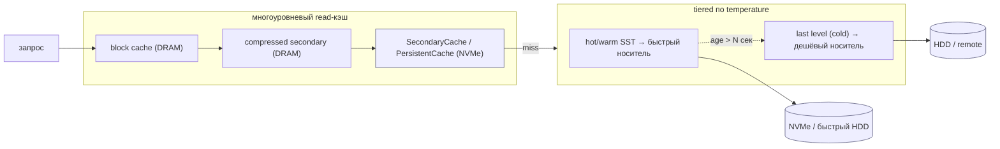
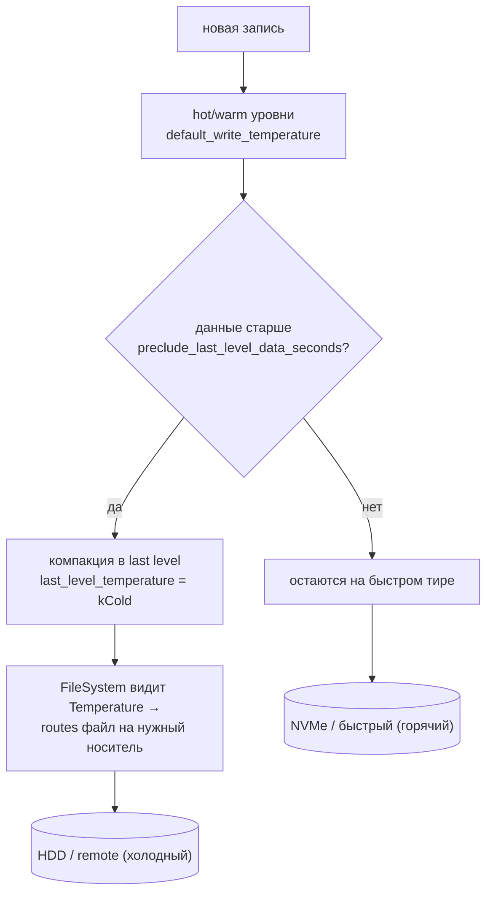
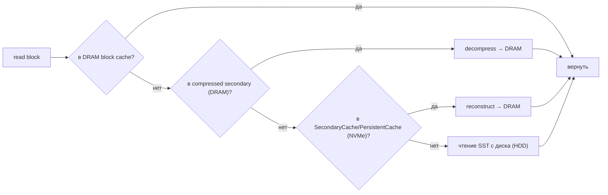
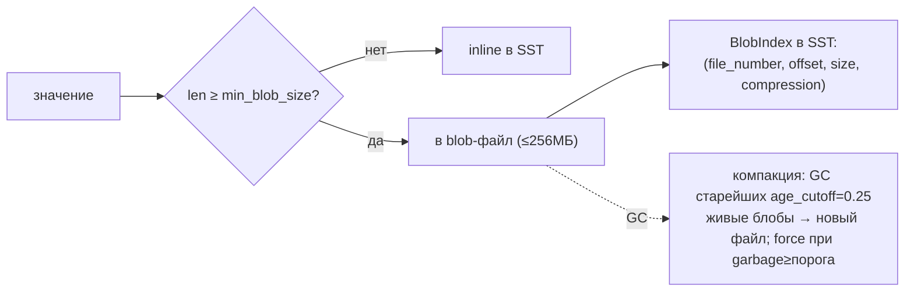
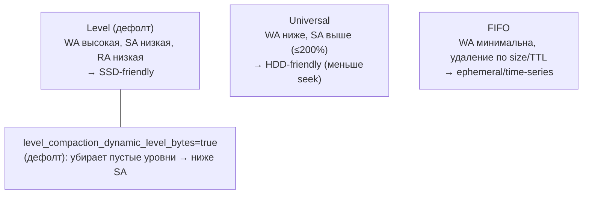
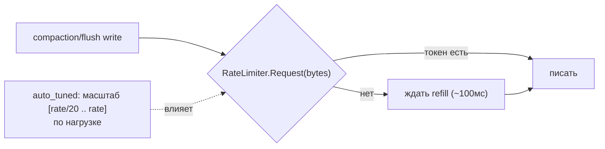
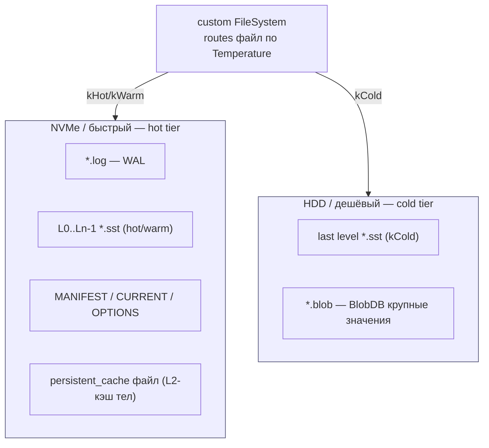
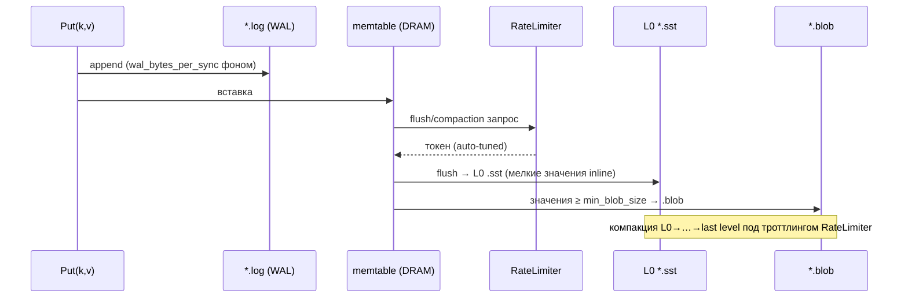
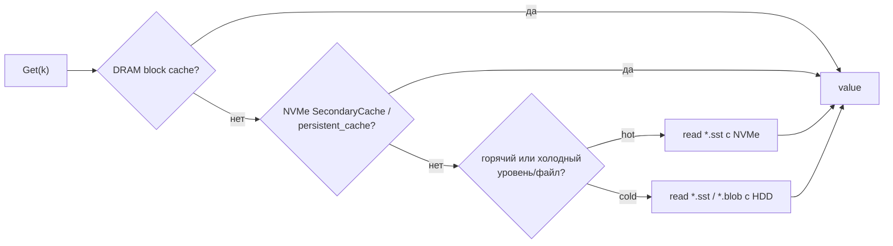
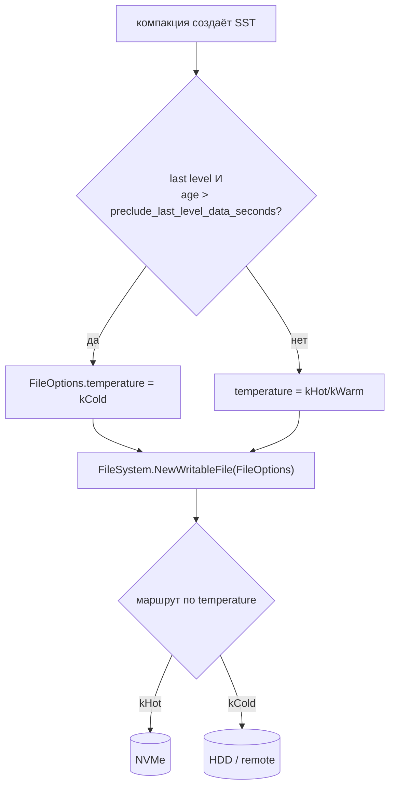

# RocksDB Storage — как RocksDB работает с HDD/SSD (DDD-разбор исходников)

> Исследование исходников **facebook/rocksdb** (`Vendor/rocksdb`, свежий слой, commit
> `a214d3f1…`, версия 11.5.0, от 2026-06-05). Все факты — с ссылками `файл:строка`, проверены.

RocksDB — **каноничный C++ LSM** (на нём работает TON; Pebble — его Go-порт). Это надмножество
Pebble по фичам. **Новое и ценное для нас (чего не было у TON/geth/quorum/pebble):**

1. **★ Tiered storage по «температуре» + time-based миграция** (`Temperature` hot/warm/cold,
   `last_level_temperature`, `preclude_last_level_data_seconds`) с **маршрутизацией файлов по
   носителям через FileSystem** — формализует наш `cold_path`-тир.
2. **Многоуровневый read-кэш**: DRAM → compressed-DRAM → **NVMe (SecondaryCache/PersistentCache)**
   → диск — NVMe как L2-кэш **тел блоков** перед HDD.
3. **Rate limiter (auto-tuned)** — троттлинг I/O компакции/flush (критично на HDD).
4. **Ribbon-фильтр** (компактнее Bloom), **dictionary-компрессия**, **FIFO-компакция = TTL**.
5. **BlobDB** — третье независимое подтверждение value separation (≈ наши pack-сегменты).

---

## 1. Где RocksDB в нашей картине



RocksDB можно и прямо взять как index-tier, но главное — **переносим паттерны** (температурный
тиринг, NVMe-кэш тел, rate limiter) в наш `ShardEngine`/`ResilverService` поверх XFS.

---

## 2. Архитектурные диаграммы (Mermaid)

### R1. Temperature + time-based tiering (★ формализует наш cold_path)



### R2. Многоуровневый read-кэш (DRAM → NVMe → диск)



### R3. BlobDB value separation (3-е подтверждение pack-сегментов)



### R4. Стили компакции: write/space/read amplification



### R5. Rate limiter (троттлинг I/O компакции на HDD)



---

## 2-bis. Файловая система: раскладка и потоки (Mermaid)

### FS1. Реальная раскладка на диске (tiered по temperature)



### FS2. Запись на уровне файлов (WAL → memtable → .sst/.blob, троттлинг)



### FS3. Чтение: каскад кэшей и носителей



### FS4. Маршрутизация файла по температуре (FileSystem)



---

## 3. Ubiquitous Language (термины RocksDB)

| Термин | Значение | Где в коде |
|---|---|---|
| **Temperature** | тег носителя файла: kHot/kWarm/kCold | `types.h:120` |
| **last_level_temperature** | температура самого холодного уровня | `advanced_options.h:1012` |
| **preclude_last_level_data_seconds** | окно «горячести»: моложе N сек не уходит в cold | `advanced_options.h:1045` |
| **SecondaryCache** | L2 read-кэш (NVMe/flash) под DRAM | `secondary_cache.h` |
| **PersistentCache** | постоянный SSD-кэш блоков для HDD-БД | `persistent_cache.h` |
| **BlobDB / BlobIndex** | value separation: `(file, offset, size, compr)` | `db/blob/blob_index.h` |
| **RateLimiter** | троттлинг bytes/sec для компакции/flush | `rate_limiter.h` |
| **Ribbon filter** | компактнее Bloom (~−40% места, +CPU) | `filter_policy.h` |

---

## 4. ★ Temperature & time-based tiering (новое, формализует cold_path)

- **`Temperature` enum** (`types.h:120`): `kHot=0x04, kWarm=0x08, kCold=0x0C` — тег файла.
- **`last_level_temperature`** (`advanced_options.h:1012`, деф. `kUnknown`): самый холодный
  (нижний, крупнейший) уровень помечается отдельной температурой → кладётся на другой носитель.
- **`preclude_last_level_data_seconds`** (`advanced_options.h:1045`, деф. 0): **time-based
  тиринг** — данные **моложе N секунд не пускаются в last level** (остаются на горячем тире);
  старше — мигрируют в cold. Возраст определяется по seqno→time карте
  (`preserve_internal_time_seconds`).
- **Маршрутизация по носителям**: при создании SST в `FileOptions.temperature`
  (`file_system.h`) передаётся температура; **кастомный FileSystem кладёт kHot→NVMe, kCold→HDD**.

> **Для нас:** это точная модель `cold_path`-тира. Помечаем **сегменты** температурой (по
> pin-статусу/частоте/возрасту), горячие — на быстрый носитель, холодные — на дешёвый/remote;
> миграция по age. FileSystem-абстракция = наш выбор `data_path` vs `cold_path` per-сегмент.

## 5. Многоуровневый read-кэш (NVMe как L2 перед HDD)

- **SecondaryCache** (`secondary_cache.h`): при промахе DRAM block cache — асинхронный `Lookup`
  во вторичном кэше (NVMe/flash); хит → reconstruct в DRAM; промах → диск.
- **CompressedSecondaryCache / TieredCache** (`cache.h`): DRAM-uncompressed → compressed-DRAM →
  опц. NVM; политики допуска (`kAdmPolicy…`).
- **PersistentCache** (`persistent_cache.h`): постоянный SSD-кэш блоков — **ускоритель чтения для
  HDD-БД** (тёплый набор на SSD).

> **Для нас:** у нас индекс уже на NVMe. Новое — **кэш ТЕЛ горячих блоков на NVMe** (L2 перед
> HDD): промах LRU тел в RAM → NVMe-кэш → HDD-сегмент. Прямой выигрыш для горячего read-набора.

## 6. BlobDB (подтверждение pack-сегментов) + стили компакции

**BlobDB** (`advanced_options.h`): `min_blob_size=0` (1094), `blob_file_size=256МБ` (`1<<28`, 1103),
GC: `blob_garbage_collection_age_cutoff=0.25` (1145, чистить 25% старейших), `force_threshold=1.0`
(1157). `BlobIndex = (file_number, offset, size, compression)` (`db/blob/blob_index.h`) — это наш
`(segment_id, offset, len)`. Третье независимое подтверждение формата.

**Стили компакции:**
- **Level** (дефолт, `kCompactionStyleLevel`): WA высокая, SA низкая — SSD-friendly.
- **Universal**: меньше write-amp, выше space-amp (`max_size_amplification_percent=200`) —
  **HDD-friendly** (меньше seek). 
- **FIFO**: удаление старейших по `max_table_files_size`/TTL — **ephemeral/time-series**.
- **`level_compaction_dynamic_level_bytes=true`** (деф.): убирает пустые уровни → ниже space-amp.

> **Для нас:** FIFO ≈ модель **ephemeral (не-pinned) блоков с TTL**; Universal-логика (реже, но
> крупнее) перекликается с нашей компакцией сегментами.

## 7. I/O-контроль и фильтры (HDD vs SSD)

| Knob | Дефолт | Строка | HDD vs SSD |
|---|---|---|---|
| `rate_limiter` (+auto_tuned) | nullptr | `options.h:741` | **HDD: включить** (50–100МБ/с, auto) — без троттлинга write-stall |
| `use_direct_reads` | false | `options.h:1155` | SSD: on (мимо page-cache); **HDD: off** (нужен page-cache) |
| `use_direct_io_for_flush_and_compaction` | false | `options.h:1159` | SSD: on; HDD: off |
| `compaction_readahead_size` | **2МБ** | `options.h:1244` | HDD: 4–8МБ (seek↓ на последовательном) |
| `bytes_per_sync` / `wal_bytes_per_sync` | 0 | `options.h:1287` | HDD: 1–4МБ / 256КБ–1МБ — сглаживание |
| `filter_policy` Bloom/Ribbon | — | `table.h:528` | **Ribbon −40% места** ценой CPU; Bloom 8–10 бит |
| `optimize_filters_for_hits` | false | `advanced_options.h:816` | write-heavy: on (без фильтра на дне) |
| `compression_opts.max_dict_bytes` | 0 | — | HDD: 4–16КБ (zstd-dict +ратио на похожих значениях) |
| `ttl` / `periodic_compaction_seconds` | 30 дней | `advanced_options.h:894` | авто-рекомпакция старого |
| `partition_filters` + `kTwoLevelIndexSearch` | false | `table.h:457` | огромные БД: индекс/фильтр не держать в RAM целиком |

---

## 8. Философия и вывод XFS/ZFS

RocksDB — движок (на нём TON), поэтому медиа-совет тот же: горячий LSM → **SSD/NVMe (XFS)**;
холодное → дешевле. Но RocksDB добавляет **самое явное**: тиринг по температуре с маршрутизацией
файлов через FileSystem-абстракцию — это аргумент **держать `cold_path` и температуру сегментов
в нашем дизайне**, а не только index/data сплит. ZFS на холодном тире уместен (сжатие/checksum),
direct-I/O на горячем NVMe — да, на HDD — нет (нужен page-cache).

---

## 8-bis. Снипеты кода (реальные выдержки + объяснение)

### CS1. Temperature-тиринг файла (≈ hot/cold → cold_path)

```cpp
// include/rocksdb/types.h:118
enum class Temperature : uint8_t {
  kUnknown = 0, kHot = 0x04, kWarm = 0x08, kCool = 0x0A, kCold = 0x0C, kIce = 0x10,
};
```

**Объяснение:** файл тегируется температурой; `last_level_temperature` роутит холодное на дешёвый
носитель. → наш **температурный тиринг сегментов → `cold_path`** (тег hot/cold).

### CS2. Rate-limiter: запрос токенов байт (≈ Forseti-throttle)

```cpp
// include/rocksdb/rate_limiter.h:82
virtual void Request(const int64_t bytes, const Env::IOPriority pri,
                     Statistics* stats, OpType op_type) {
  if (IsRateLimited(op_type)) Request(bytes, pri, stats);   // нет токенов → блок до refill
}
```

**Объяснение:** фон-операция «просит» байты у лимитера; нет токенов → ждёт (auto-tuned). → наш
**rate-limiter фона**, частный случай **Forseti** (компакция/resilver/GC < клиента).

### CS3. SecondaryCache: NVMe L2-кэш блоков (Insert/Lookup)

```cpp
// include/rocksdb/secondary_cache.h:82
virtual Status Insert(const Slice& key, Cache::ObjectPtr obj,
                      const Cache::CacheItemHelper* helper, bool force_insert) = 0;
virtual std::unique_ptr<SecondaryCacheResultHandle> Lookup(const Slice& key, ...) = 0;
```

**Объяснение:** L2-кэш: Insert кладёт блок на NVMe, Lookup достаёт; промах → HDD. → наш **NVMe L2
read-кэш ТЕЛ блоков** перед HDD-сегментом.

---

## 9. Извлечённые идеи для OpenZFS Daemon (новое сверх прежних разборов)

| Идея из RocksDB | Где применить | Эффект |
|---|---|---|
| **★ Температура сегментов + time/access-based миграция в cold_path** | **Фаза 5** — тег сегмента (hot/cold по pin/частоте/возрасту), миграция на дешёвый/remote носитель | формализует тиринг; экономия на холодном |
| **NVMe как L2 read-кэш ТЕЛ блоков** (SecondaryCache/PersistentCache) | **Фаза 4/5** — кэш горячих тел на NVMe перед HDD | меньше HDD-seek на горячем наборе |
| **Rate limiter (auto-tuned) на компакцию/resilver/GC** | **Фаза 5** — троттлинг фонового I/O (лучше простого pacing) | без write-stall на HDD под фоном |
| **FIFO=TTL для ephemeral блоков** | **Фаза 5** — не-pinned блоки с TTL удалять как FIFO | дешёвая модель временных данных |
| **Ribbon/Bloom фильтр CID per-disk** | **Фаза 2** (опц.) — компактный фильтр «есть ли CID на диске» перед redb-lookup | меньше лишних обращений к R дискам |
| **Dictionary-компрессия тел** (zstd dict) | **Фаза 1** — для похожих мелких тел | +ратио без потери скорости |
| **Direct-I/O политика по носителю** | **Фаза 1** — NVMe-индекс: direct; HDD-сегменты: через page-cache | оптимально под каждый тир |
| **TTL/periodic recompaction** | **Фаза 5** — периодический проход сегментов (совместить со scrub) | свежая компрессия/целостность |

### Главное новое заимствование
**Tiered storage по температуре + миграция в cold_path + NVMe-кэш тел** — RocksDB даёт самую
полную модель многоносительного хранения. Для нас: **сегменты получают температуру** (hot/cold по
pin/частоте/возрасту), горячие тела кэшируются на NVMe, холодные сегменты мигрируют на
дешёвый/remote носитель; фон троттлится rate-limiter'ом. См. [[ton-storage-ideas]] (TON на
RocksDB), [[pebble-storage-ideas]] (Pebble — порт RocksDB).

---

## 10. Источники в коде (для перепроверки)

- Tiering/temperature: `include/rocksdb/types.h:120`, `include/rocksdb/advanced_options.h:1012,
  1020,1045,1068`, `include/rocksdb/file_system.h`, `db/flush_job.cc`
  (`GetPrecludeLastLevelMinSeqno`).
- Кэш: `include/rocksdb/secondary_cache.h`, `include/rocksdb/cache.h` (Compressed/TieredCache),
  `include/rocksdb/persistent_cache.h`.
- BlobDB/компакция: `include/rocksdb/advanced_options.h:1082–1179` (blob),
  `include/rocksdb/options.h` (compaction_style), `include/rocksdb/universal_compaction.h`,
  `db/blob/blob_index.h`.
- I/O/фильтры: `include/rocksdb/rate_limiter.h`, `include/rocksdb/options.h:741,1155,1159,1244,
  1287,1297`, `include/rocksdb/table.h:457,528`, `include/rocksdb/filter_policy.h`,
  `include/rocksdb/advanced_options.h:816,894,942`.
