# RustFS Storage — как RustFS работает с HDD/SSD (DDD-разбор исходников)

> Исследование исходников **rustfs/rustfs** (`Vendor/rustfs`, свежий слой, commit `bc95b9f` от
> 2026-06-09). **Rust** (как наш демон!). Все факты — с ссылками `файл:строка`, проверены в коде;
> ключевые места — **с реальными снипетами** (см. §9-bis).

RustFS — **S3-совместимое объектное хранилище на Rust** (по сути MinIO-rewrite): erasure-coding поверх
**JBOD-дисков**, heal, фоновый scanner, bitrot, **без центрального каталога** (метаданные `xl.meta`
лежат рядом с шардами на каждом диске). Это **самый близкий аналог нашего домена** — и мощная валидация
наших решений. Берём то, что у нас ещё не проработано (особенно для **Части 2 — erasure**):

1. **★ Erasure-set + per-object distribution-array** — диски в **наборы** (16/set); объект→набор по
   `sipHash`; шарды раскладываются по дискам набора через **перестановку-распределение** (в `xl.meta`)
   → нет «горячего» диска. Чертёж нашей Части-2 erasure (расширяет YDB block-4-2).
2. **★ Self-describing `xl.meta` на каждом диске + quorum-pick-latest** — каждый диск держит **полные
   метаданные объекта** (erasure-конфиг, parts, checksums, inline-data); версия выбирается **кворумом**
   (mod_time/etag) → **центральный каталог не нужен** (наша философия, конкретно).
3. **★ Heal-очередь: dedup + приоритеты + per-set bulkhead + MRF** — приоритетная очередь heal с
   слиянием дублей, лимитом параллельных heal на набор и **MRF** (быстрый heal недавно-сбойных записей).
4. **★ Scanner cycle-budget + jitter + normal/deep-каденс** — у фонового скана **бюджет** (макс.
   время/объекты/каталоги — обрыв цикла), джиттер межцикловой паузы (±10%) и **deep-bitrot раз в N
   циклов/T** (дёшево нормально, периодически глубоко).
5. **★ Disk-health 4-state FSM** — `Online→Suspect→Offline→Returning` с гистерезисом (N сбоев / N
   успехов) + класс восстановления по длительности offline (короткий = ждать, долгий = rebuild).

> Контекст-конвергенция (НЕ новые строки): JBOD + app-erasure = ADR-0001; bitrot (HighwayHash/BLAKE3
> per-shard + verify-on-read → reconstruct) = наш per-micro CRC + scrub; durable temp→rename +
> **ignored-fsync, durability через EC+rename** = #111 (Kafka durability-via-replication) + #67;
> fadvise DONTNEED / macOS F_NOCACHE = #63; tiering (S3/Azure/GCS/...) = #116/cold_path; rio layered
> readers (Etag/HardLimit/compress) = наш pipeline; rebalance percent-free-goal = disk-balancer (#101) +
> гистерезис (#130); inline ≤16КБ/128КБ = inline-порог (#80/#44); distributed-lock ⚠️ Часть 3.

---

## 1. Bounded Contexts

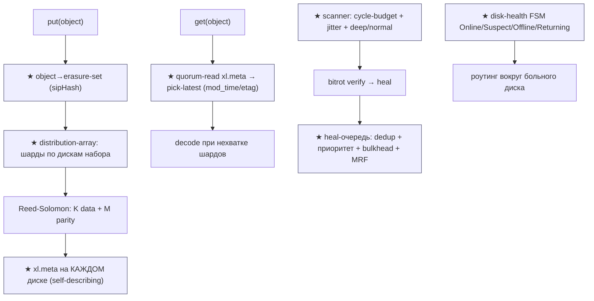

| Контекст | Ответственность | Файлы |
|---|---|---|
| **★ Erasure-set / distribution** | наборы дисков, object→set, перестановка шардов | `ecstore/src/sets.rs`, `set_disk/metadata.rs`, `disks_layout.rs` |
| **Erasure-coding** | Reed-Solomon encode/reconstruct, quorum | `ecstore/src/erasure_coding/{erasure,decode}.rs` |
| **★ xl.meta (self-describing)** | per-disk метаданные + inline + checksums | `crates/filemeta/src/{filemeta,fileinfo}.rs` |
| **★ Heal** | reconstruct + priority-queue + MRF | `ecstore/src/set_disk/heal.rs`, `crates/heal/src/heal/{manager,task}.rs` |
| **★ Scanner** | cycle-budget, jitter, deep/normal, data-usage | `crates/scanner/src/{scanner,scanner_budget}.rs` |
| **★ Disk-health** | 4-state FSM, timeouts, recovery-class | `ecstore/src/disk/{health_state,disk_store}.rs` |
| **Bitrot** | per-shard streaming hash + verify | `ecstore/src/bitrot.rs` |
| **Disk IO** | temp→rename, fadvise/F_NOCACHE, buffered | `ecstore/src/disk/local.rs` |
| **Rebalance / tier** | percent-free-goal; transition в cold | `ecstore/src/rebalance.rs`, `tier/` |
| ⚠️ Distributed-lock | кворум-лок (multi-node) | `crates/lock/` (Часть 3) |

---

## 2. Архитектурные диаграммы (Mermaid)

### Rf1. Erasure-set + distribution-array (★)

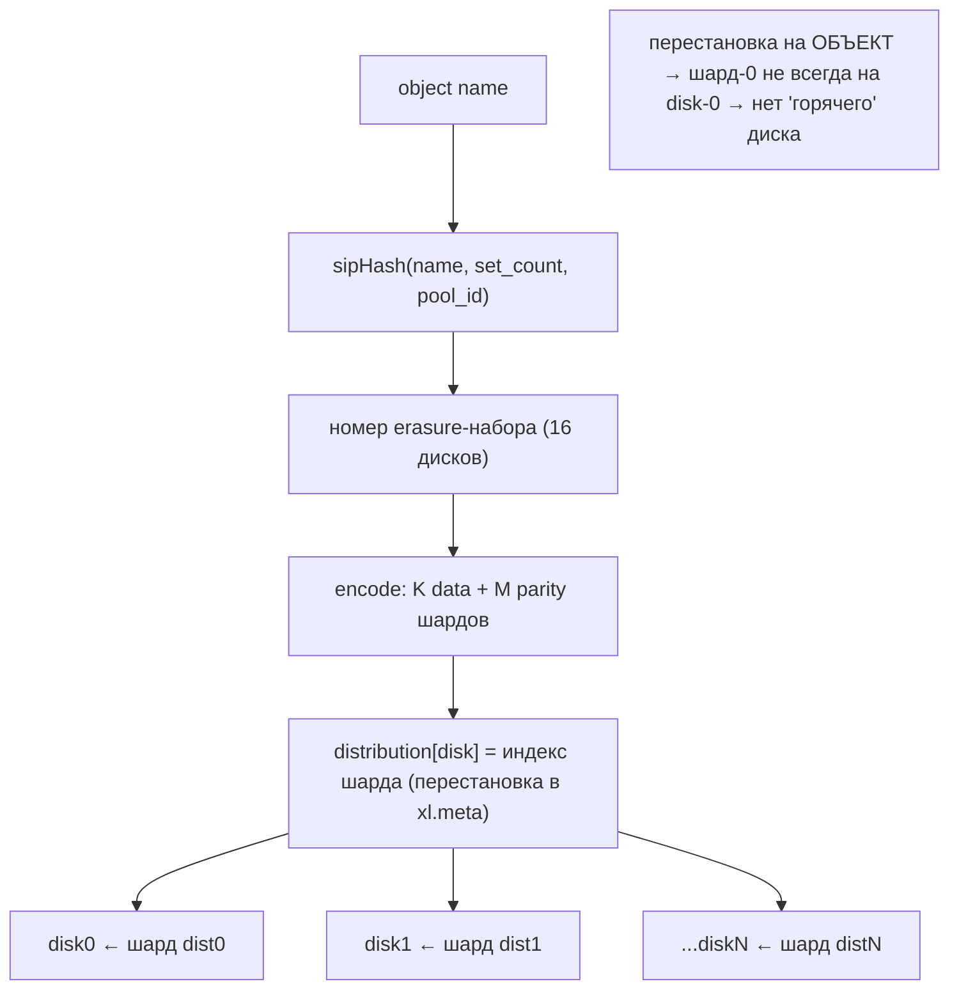

### Rf2. Self-describing xl.meta + quorum-pick-latest (★ = наш no-central-catalog)

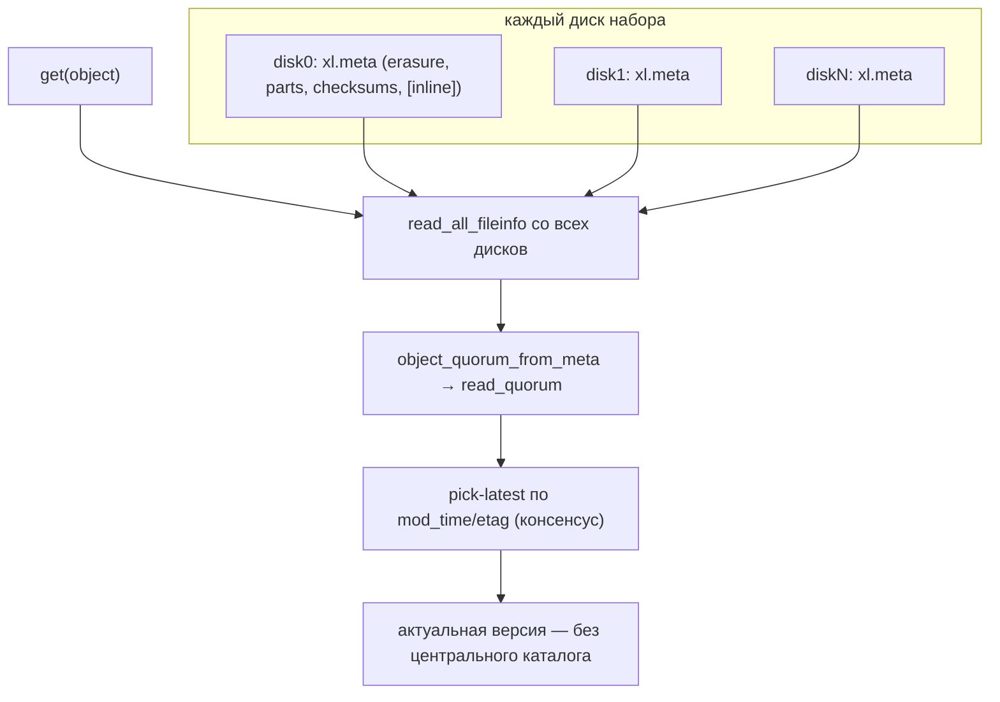

### Rf3. Heal-очередь: dedup + приоритет + bulkhead + MRF (★)

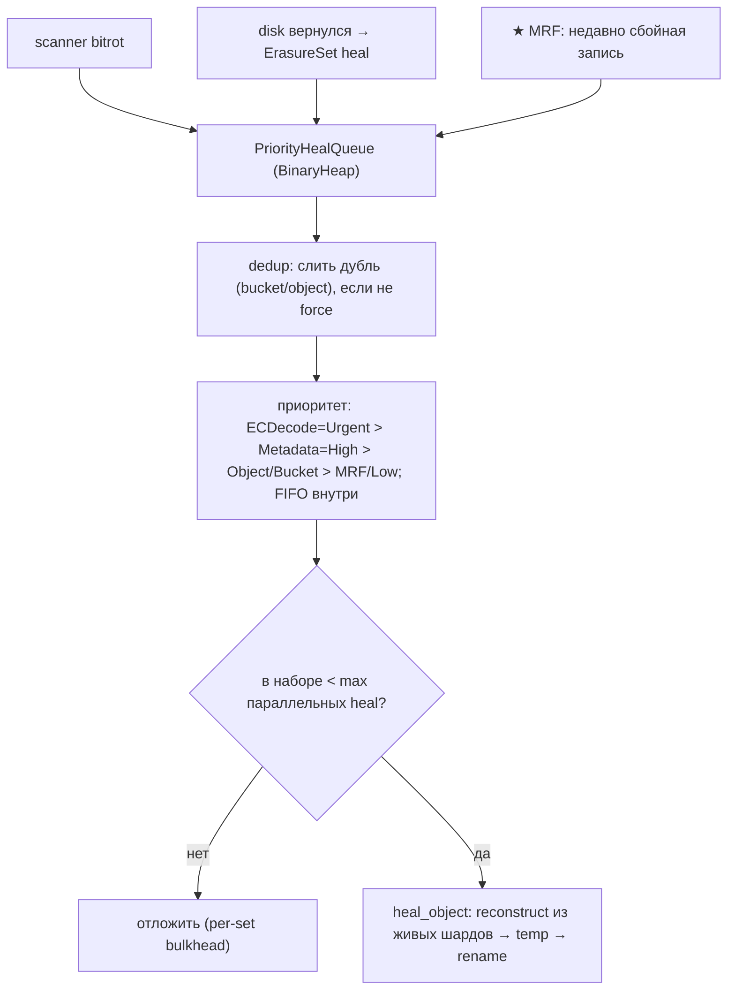

### Rf4. Scanner: cycle-budget + jitter + deep/normal (★)

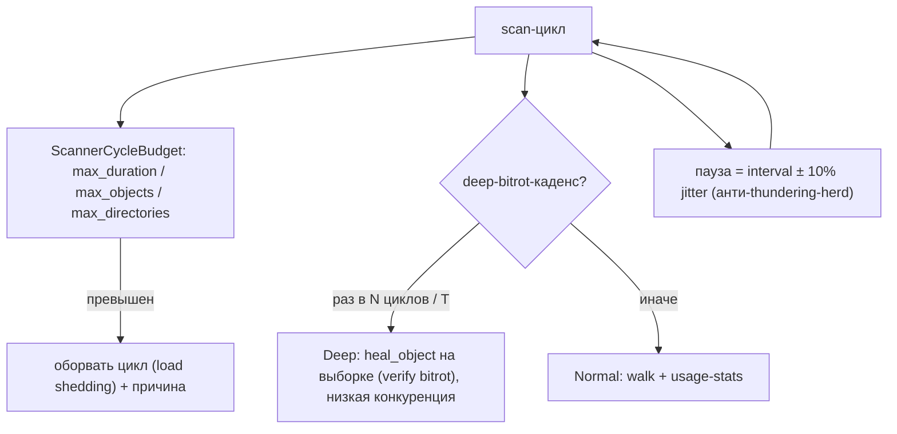

### Rf5. Disk-health 4-state FSM (★)

```mermaid
stateDiagram-v2
    [*] --> Online
    Online --> Suspect: N сбоев подряд (порог)
    Suspect --> Online: N успехов подряд
    Suspect --> Offline: I/O timeout / недоступен
    Offline --> Returning: probe-проверка
    Returning --> Online: N успехов
    Returning --> Offline: снова сбой
    note right of Offline: класс восстановления:\nShort (<grace) = ждать\nLong (>порог) = full rebuild
```

### Rf6. Erasure vs наш R=2 mirror (контекст Части 1↔2)

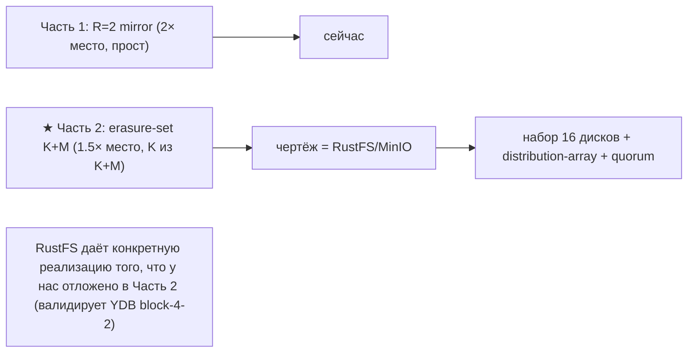

---

## 2-bis. Файловая система: раскладка и потоки (Mermaid)

### FS1. Раскладка объекта на дисках набора

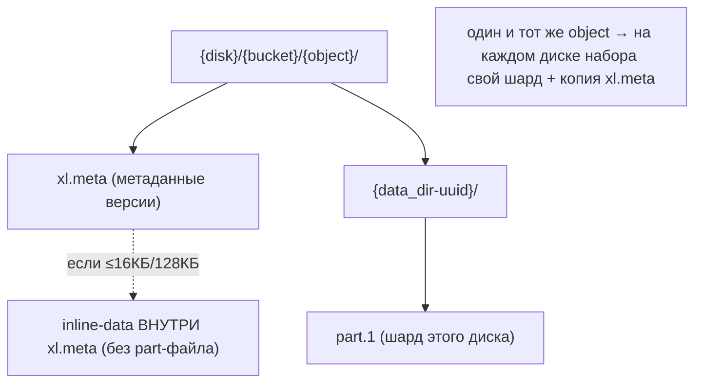

### FS2. Запись объекта (encode → шарды → xl.meta)

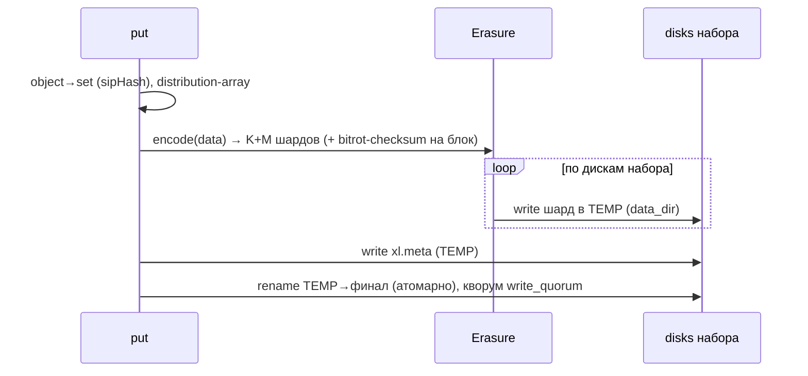

### FS3. Чтение с reconstruct при нехватке шардов

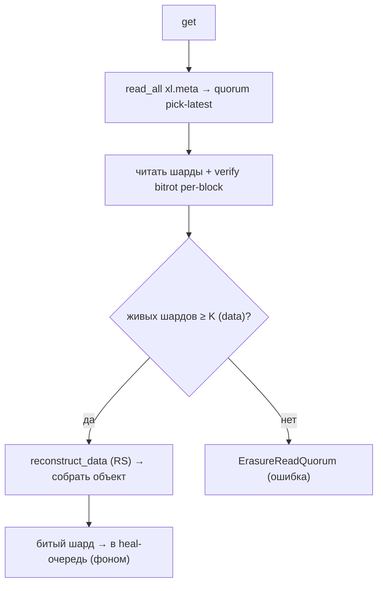

### FS4. Disk IO: temp→rename, без O_DIRECT, fadvise

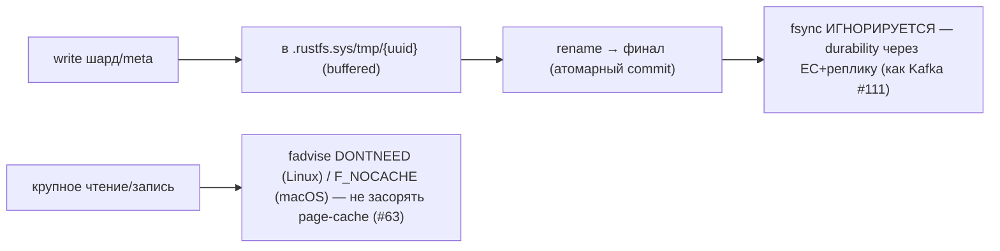

### FS5. Scanner data-usage кэш


### FS6. Heal priority-queue: триаж и bulkhead (#140)

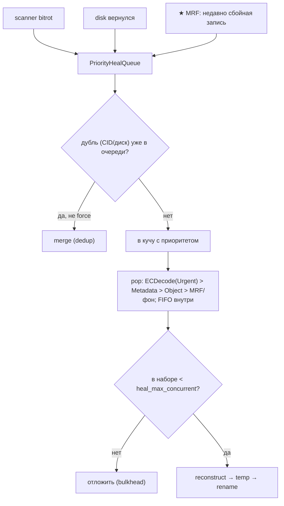

### FS7. Disk-health 4-state FSM + recovery-class (#142)

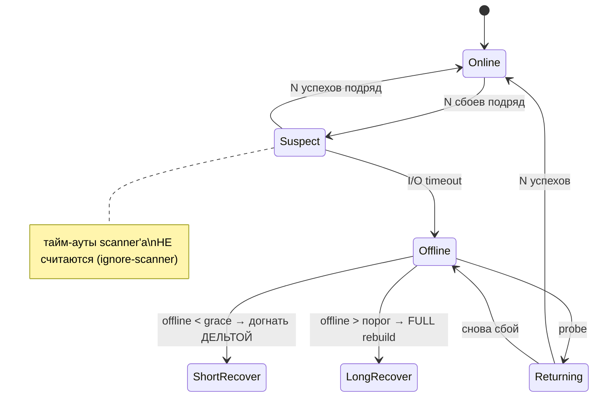

---

## 3. Ubiquitous Language (термины RustFS → наши)

| Термин | Значение | Наш аналог |
|---|---|---|
| **erasure set** | группа дисков (16) под erasure | placement-набор (Часть 2) |
| **distribution array** | перестановка шард↔диск на объект | **★ новое** (#138); ≈ HRW-порядок |
| **xl.meta** | per-disk self-describing метаданные | per-disk индекс + манифест |
| **FileInfo / quorum-from-meta** | версия объекта + выбор кворумом | **★ no-central-catalog** (#139) |
| **EC:M / data+parity** | M parity, K data шардов | R=2 mirror (Ч1) → erasure (Ч2) |
| **write/read quorum** | сколько шардов нужно | W=2 / R=2 |
| **bitrot (HighwayHash/BLAKE3)** | per-shard checksum + verify | per-micro CRC + scrub |
| **heal / heal_object** | reconstruct из живых шардов | resilver/heal |
| **MRF** | most-recent-failures для heal | **★ новое** (#140) |
| **scanner cycle-budget** | бюджет цикла скана | **★ новое** (#141); + scrub (#102) |
| **drive health FSM** | Online/Suspect/Offline/Returning | **★ новое** (#142); + disk-slow |
| **transition / tier** | в cold (S3/Azure/GCS) | cold_path / storage-policies (#116) |

---

## 4. Что берём (★) и почему — кратко

| # | Идея | Откуда | Зачем нам |
|---|---|---|---|
| **138** | Erasure-set + per-object distribution-array (object→set sipHash; шарды-перестановка) | `sets.rs`, `set_disk/metadata.rs` | конкретный чертёж **Части-2 erasure**: нет горячего диска, детерминированная раскладка (расширяет YDB block-4-2) |
| **139** | Self-describing `xl.meta` на каждом диске + quorum-pick-latest | `filemeta/`, `set_disk/heal.rs` | **валидация no-central-catalog**: версия объекта восстанавливается кворумом метаданных с дисков |
| **140** | Heal priority-queue: dedup + per-set bulkhead + MRF + типы-приоритеты | `heal/{manager,task}.rs` | управляемый heal: не дублировать, не перегружать набор, быстро чинить недавно-сбойное (MRF) |
| **141** | Scanner cycle-budget (duration/objects/dirs) + jitter + deep/normal-каденс | `scanner/{scanner,scanner_budget}.rs` | ограниченная стоимость scrub-цикла, анти-thundering-herd, дёшево-нормально + периодически-глубоко |
| **142** | Disk-health 4-state FSM (Online/Suspect/Offline/Returning) + recovery-class | `disk/health_state.rs` | гистерезис здоровья диска (не дёргаться на transient), короткий-offline=ждать / долгий=rebuild |

---

## 5. Конвергенция (RustFS ≈ MinIO ≈ наш дизайн — мощная валидация)

- **JBOD + application-level erasure/replication** (не RAID/ZFS) = **ADR-0001** дословно.
- **Bitrot**: per-shard streaming checksum (HighwayHash256/BLAKE3, интерливинг `[csum][block]…`) +
  **verify-on-read → reconstruct** = наш per-micro CRC + verify-on-read + scrub.
- **Durability через EC+rename, fsync ИГНОРИРУЕТСЯ** (buffered write + temp→rename) = #111 (Kafka:
  durability-via-replication, не fsync-на-запись) + durable-swap (#67). Сильное подтверждение нашего курса.
- **fadvise DONTNEED (Linux) / F_NOCACHE (macOS)** после крупных IO = #63 (page-cache hygiene).
- **Rebalance percent-free-goal** (пул участвует, если free% < цели; on-disk size = logical×(K+M)/K) =
  disk-balancer (#101) + гистерезис заполнения (#130) + HRW-by-free.
- **Tiering** (S3/MinIO/Azure/GCS/Aliyun/Tencent/R2 + lifecycle transition) = cold_path / storage-policies (#116).
- **rio layered readers** (HardLimit/Etag-MD5/compress) = наш pipeline чтения/записи.
- **inline ≤16КБ(non-versioned)/128КБ(versioned)** = inline-порог (#80/#44) с нюансом по versioning.
- **DiskInfo (total/free/used/inodes) + data-usage кэш (TTL 30с)** = ёмкость + TTL-кэш (#137).
- ⚠️ **distributed-lock** (кворум-лок, failure-classification, RAII-unlock-retry) — **Часть 3** (multi-gateway).

---

## 9-bis. Снипеты кода (реальные выдержки + объяснение)

### RF1. Default-parity по числу дисков (#138 контекст)

`ecstore/src/config/storageclass.rs:23-32`:

```rust
pub fn default_parity_count(drive: usize) -> usize {
    match drive {
        1 => 0, 2 | 3 => 1, 4 | 5 => 2, 6 | 7 => 3,
        _ => 4,   // 8+ дисков → 4 parity
    }
}
```

**Зачем нам:** для Части-2 — таблица «сколько parity по размеру набора». 16 дисков → EC:4 = 12 data + 4
parity (теряем до 4). У нас сейчас R=2 (Часть 1); это чертёж эволюции.

### RF2. Distribution-array: перестановка шард↔диск (#138)

`ecstore/src/set_disk/metadata.rs:526-556` (сокр.):

```rust
let distribution = &fi.erasure.distribution;   // перестановка, хранится в xl.meta
for (k, v) in disks.iter().enumerate() {
    if v.is_none() { continue; }
    let block_idx = distribution[k];           // индекс шарда для диска k (1-based)
    shuffled_parts_metadata[block_idx - 1] = parts_metadata[k].clone();
    shuffled_disks[block_idx - 1].clone_from(&disks[k]);
}
```

**Зачем нам:** каждый объект получает **свою перестановку** шардов по дискам → шард-0 не всегда на
disk-0 → **нет горячего диска**. Родственно нашему HRW-порядку, но для шардов внутри набора.

### RF3. object→set по sipHash (#138)

`ecstore/src/sets.rs:286-296`:

```rust
fn get_hashed_set_index(&self, input: &str) -> usize {
    match self.distribution_algo {
        DistributionAlgoVersion::V1 => crc_hash(input, self.disk_set.len()),
        _ => sip_hash(input, self.disk_set.len(), self.id.as_bytes()),
    }
}
```

**Зачем:** детерминированный выбор набора по имени (как наш HRW по CID), с pool-id в хэше (стабильность
при добавлении пулов).

### RF4. Reconstruct: достаточно K шардов (#139 контекст)

`ecstore/src/erasure_coding/decode.rs` (can_decode + reconstruct):

```rust
pub fn can_decode(&self, shards: &[Option<Vec<u8>>]) -> bool {
    shards.iter().filter(|s| s.is_some()).count() >= self.data_shards   // ≥ K
}
// ...
encoder.reconstruct_data(shards)?;   // восстановить недостающие data-шарды из parity
```

**Зачем:** read-кворум = K (data). Любые K из K+M шардов восстанавливают объект — основа heal/чтения.

### RF5. xl.meta: self-describing метаданные (#139)

`crates/filemeta/src/fileinfo.rs:208-244` (сокр.):

```rust
pub struct FileInfo {
    pub data_dir: Option<Uuid>,
    pub size: i64,
    pub parts: Vec<ObjectPartInfo>,
    pub erasure: ErasureInfo,         // data/parity/distribution/block_size
    pub data: Option<Bytes>,          // INLINE data (мелкие объекты)
    pub checksums: Vec<ChecksumInfo>, // bitrot per-part
    ...
}
```

**Зачем нам:** на каждом диске лежит **полное описание объекта** → центральный каталог не нужен; при
чтении собираем версию из метаданных дисков (наша философия, конкретная реализация).

### RF6. write-quorum с odd-split (#139 контекст)

`ecstore/src/set_disk.rs:376-389` (сокр.):

```rust
let data_drives = disk_count - parity_drives;
let mut write_quorum = data_drives;
if data_drives == parity_drives {
    write_quorum += 1;     // при равном делении — предпочесть нечётный кворум
}
```

**Зачем:** правило кворума записи для erasure (Часть 2). 16 дисков EC:4 → write_quorum=12; EC:8 → 9.

### RF7. heal_object: reconstruct → temp → rename (#140)

`ecstore/src/set_disk/heal.rs:20-461` (ключевые шаги):

```rust
// 1) read_all_fileinfo со всех дисков → quorum
// 2) list_online_disks + disks_with_all_parts → какие чинить
let erasure = erasure_coding::Erasure::new_with_options(data_blocks, parity_blocks, block_size, ...);
// 3) readers с живых дисков (bitrot-verified), writers на TEMP для битых
erasure.heal(&mut writers, readers, part.size, &prefer).await?;   // RS-reconstruct
// 4) rename_data(TEMP → bucket/object) на вылеченных дисках
```

**Зачем нам:** канонический resilver одного объекта: восстановить из живых шардов, записать в TEMP,
атомарно переименовать. Совпадает с нашим heal/walk-resilver, но через erasure-decode.

### RF8. Heal priority-queue + dedup (#140)

`crates/heal/src/heal/manager.rs:40-150` (сокр.):

```rust
fn push(&mut self, request: HealRequest) -> QueuePushOutcome {
    let key = Self::make_dedup_key(&request);
    if self.dedup_keys.contains_key(&key) && !request.force_start {
        return QueuePushOutcome::Merged;          // слить дубль
    }
    self.heap.push(PriorityQueueItem { priority: request.priority, sequence: self.sequence, request });
    ...
}
// pop_runnable_with_skips: пропустить запрос, если в наборе уже max параллельных heal (bulkhead)
```

Типы/приоритеты (`task.rs`): `ECDecode=Urgent > Metadata=High > Object/Bucket/ErasureSet=Normal >
MRF/Low`. **Зачем:** не дублировать heal, чинить срочное первым, **не перегружать набор** (bulkhead).
**MRF** (most-recent-failures) — отдельный тип: быстро чинить недавно-сбойные записи.

### RF9. Scanner cycle-budget (обрыв цикла) (#141)

`crates/scanner/src/scanner_budget.rs:60-150` (сокр.):

```rust
pub(crate) fn record_object_scanned(&self) {
    if let Some(max) = self.max_objects {
        if self.objects_scanned.fetch_add(1, Relaxed) + 1 >= max {
            self.cancel_for(ScannerCycleBudgetReason::Objects);   // оборвать цикл
        }
    }
}
// + max_duration (async timeout) + max_directories — 3 независимых лимита
```

И джиттер паузы (`scanner.rs`): `interval ± 10%` (анти-thundering-herd). **Зачем нам:** scrub-цикл
**ограничен по стоимости** (время/объекты/каталоги), причина обрыва логируется; равномерная нагрузка.

### RF10. Scanner: deep-bitrot каденс (#141)

`crates/scanner/src/scanner.rs:357-388` (сокр.):

```rust
fn get_cycle_scan_mode(current_cycle, bitrot_start_cycle, ...) -> HealScanMode {
    if bitrot_cycle.is_zero() { return HealScanMode::Deep; }
    if current_cycle - bitrot_start_cycle < heal_object_select_prob() { return HealScanMode::Deep; }
    if elapsed >= bitrot_cycle { HealScanMode::Deep } else { HealScanMode::Normal }
}
```

**Зачем:** **Normal** скан дёшев (walk + usage), **Deep** (полная bitrot-проверка через `heal_object` на
выборке) — лишь **раз в N циклов / T времени**. У нас = scrub-период (#102) + выборочный deep-verify.

### RF11. Disk-health 4-state FSM (#142)

`ecstore/src/disk/health_state.rs:20-76` (сокр.):

```rust
pub enum RuntimeDriveHealthState { Online, Suspect, Offline, Returning }
pub enum DriveRecoveryClass { ShortOffline, MediumOffline, LongOffline }
pub fn classify_drive_recovery(duration: Duration) -> DriveRecoveryClass {
    if duration <= grace_period { ShortOffline }
    else if duration >= long_threshold { LongOffline }
    else { MediumOffline }
}
// Suspect после N сбоев подряд; Returning → Online после N успехов (probe)
```

**Зачем нам:** **гистерезис** здоровья диска (не Faulted на единичном тайм-ауте → сначала `Suspect`);
по возврату — `Returning` с probe; **короткий offline = ждать дельту, долгий = full rebuild** (= наш
historical-WAL-delta vs full-walk). Плюс политика «игнорировать тайм-ауты scanner'а» (фон не latency-critical).

### RF12. Durable write: temp→rename, fsync игнорируется (конвергенция #111)

`ecstore/src/disk/local.rs:1207-1290` (сокр.):

```rust
self.write_all_internal(&tmp_file_path, buf, sync, &tmp_volume_dir).await?;
rename_all(tmp_file_path, &file_path, volume_dir).await?;   // атомарный commit
// ...
let _ = sync;   // "intentionally ignores `sync`" — durability через EC + rename
```

**Конвергенция:** ровно наш курс — **не fsync на запись** (дорого на HDD), durability обеспечивают
**erasure/реплика + атомарный rename** (Kafka #111, durable-swap #67). RustFS подтверждает выбор.

### RF13 (диаграмма). Что берём vs валидация

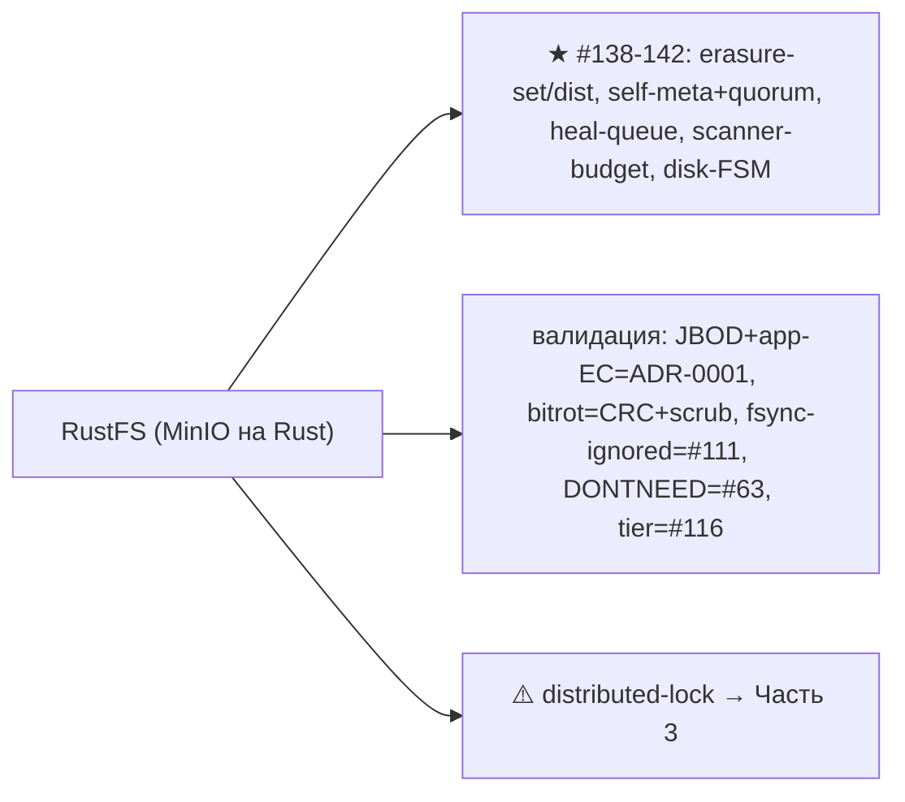

---

## 10. Извлечённые идеи для OpenZFS Daemon

### Конвергенция (RustFS = MinIO-in-Rust, самый близкий аналог → сильная валидация)
- JBOD+app-erasure=ADR-0001; bitrot=per-micro CRC+scrub; fsync-ignored+temp→rename=#111+#67;
  DONTNEED/F_NOCACHE=#63; rebalance percent-free-goal=#101+#130; tiering=#116; inline=#80/#44;
  data-usage TTL-кэш=#137; rio layered readers=наш pipeline. distributed-lock ⚠️ Часть 3.

### Главные новые заимствования
- **#138 ★** Erasure-set + per-object distribution-array (object→set sipHash; перестановка шардов) —
  чертёж Части-2 erasure без горячего диска (расширяет YDB block-4-2).
- **#139 ★** Self-describing `xl.meta` на каждом диске + quorum-pick-latest → **no-central-catalog**
  реализован конкретно (версия восстанавливается кворумом метаданных).
- **#140 ★** Heal priority-queue: dedup + per-set bulkhead + MRF (recent-failures) + типы-приоритеты.
- **#141 ★** Scanner cycle-budget (duration/objects/dirs обрыв) + jitter + normal/deep-bitrot каденс.
- **#142 ★** Disk-health 4-state FSM (Online/Suspect/Offline/Returning) + recovery-class по offline-длительности.

---

## 11. Источники в коде (для перепроверки)

- `ecstore/src/erasure_coding/erasure.rs:299-451` Erasure encode/shard-size; `decode.rs:143-534` decode/reconstruct/quorum
- `ecstore/src/sets.rs:62-296` Sets/set-index sipHash; `set_disk/metadata.rs:526-556` distribution-array; `config/storageclass.rs:23-163` parity/inline
- `ecstore/src/set_disk.rs:376-389,990-1125` write-quorum/encode-write
- `crates/filemeta/src/{filemeta.rs:45-125,fileinfo.rs:208-244}` xl.meta/FileInfo
- `ecstore/src/set_disk/heal.rs:20-461` heal_object; `crates/heal/src/heal/{manager.rs:40-150,task.rs:30-189}` queue/types
- `crates/scanner/src/{scanner.rs:205-388,scanner_budget.rs:60-150}` scan-loop/budget/deep-mode
- `ecstore/src/disk/{health_state.rs:20-76,disk_store.rs:1-150}` health-FSM/timeouts
- `ecstore/src/bitrot.rs:38-133` bitrot reader/verify
- `ecstore/src/disk/local.rs:151-234,1207-1290` fadvise/F_NOCACHE/temp-rename/ignored-fsync
- `ecstore/src/rebalance.rs:53-1343` rebalance percent-free-goal; `tier/tier_config.rs:18-45` tier-types
- `crates/rio/src/{lib.rs:115-126,etag_reader.rs,hardlimit_reader.rs}` layered readers
- `ecstore/src/data_usage.rs:44-90`, `crates/object-capacity/src/types.rs:17-38` usage/capacity
- ⚠️ `crates/lock/src/distributed_lock.rs:30-96` (Часть 3)

---

*Связано: [pack-segments (Feynman)](../../Feynman/pack-segments.md), [STORAGE-IDEAS-SYNTHESIS.md](STORAGE-IDEAS-SYNTHESIS.md), [ydb (erasure block-4-2)](ydb-storage-hdd-ssd.md), [hadoop (JBOD+app-репликация)](hadoop-storage-hdd-ssd.md), [qdrant (gridstore, Rust)](qdrant-storage-hdd-ssd.md), [kafka (durability-via-replication)](kafka-storage-hdd-ssd.md).*
