# ScyllaDB Storage — как ScyllaDB работает с HDD/SSD (DDD-разбор исходников)

> Исследование исходников **scylladb/scylladb** (`Vendor/ScyllaDB`, свежий слой, commit `d974bf0d`
> от 2026-06-08) и **scylladb/scylla-manager** (`Vendor/scylla-manager`, `73790ee5`, 2026-06-03).
> Все факты — с ссылками `файл:строка`, проверены в коде.

ScyllaDB — высокопроизводительная Cassandra-совместимая БД на **Seastar** (shared-nothing
per-core, async **O_DIRECT**+AIO, мимо kernel page-cache). Новое и ценное для нас (сверх 8 прошлых
прототипов):

1. **★ iotune — измерять диск, а не угадывать**: при установке Scylla бенчмаркит реальные
   IOPS/bandwidth диска и кормит ими IO-планировщик (уточняет hardcoded device-type профили YDB).
2. **★ ICS (Incremental Compaction)** — sstable-раны режутся на **фрагменты ~1000МБ**, чтобы
   компакция большого тира не требовала 2× временного места (точная доработка нашей сегментной GC).
3. **★ Scheduling groups + backlog-controller**: именованные классы приоритета (commitlog/flush/
   compaction/query) + пропорциональная отдача CPU/IO компакции по «backlog» (адаптивный темп GC).
4. **Per-shard shared-nothing + свой IO-queue** (≈ наш per-disk worker), **O_DSYNC** WAL,
   **sparse in-RAM Summary** с downsampling под нехватку памяти, **own-cache мимо page-cache**.

---

## 1. Bounded Contexts

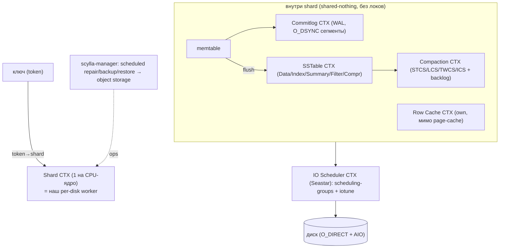

| Контекст | Ответственность | Файлы |
|---|---|---|
| **Shard/Seastar** | per-core shared-nothing; token→shard; свой IO-queue | `dht/token.cc`, `replica/` |
| **SSTable** | Data/Index/Summary/Filter/Compression/Stats/TOC | `sstables/` |
| **Compaction** | STCS/LCS/TWCS/**ICS** + backlog-controller | `compaction/` |
| **IO Scheduler** | scheduling-groups приоритета + **iotune** | Seastar (submodule), `db/config.cc` |
| **Commitlog** | per-shard WAL, O_DSYNC, recycle | `db/commitlog/` |
| **Row Cache** | own-кэш мимо page-cache, LRU | `db/row_cache.*` |
| **Manager (ops)** | scheduled repair/backup/restore | `scylla-manager/pkg/service/*` |

---

## 2. Архитектурные диаграммы (Mermaid)

### S1. Shared-nothing shard (≈ наш per-disk worker)

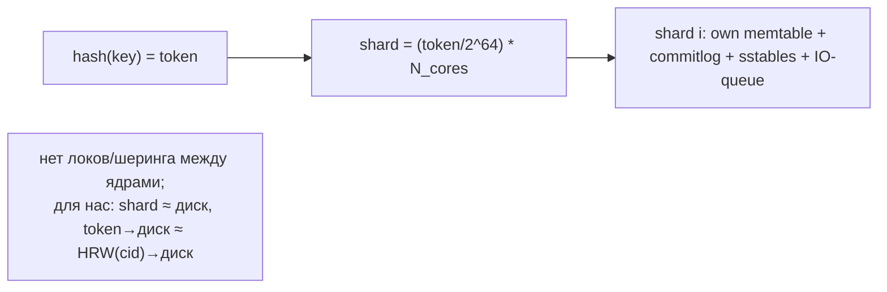

### S2. SSTable read path: bloom → summary → index → data

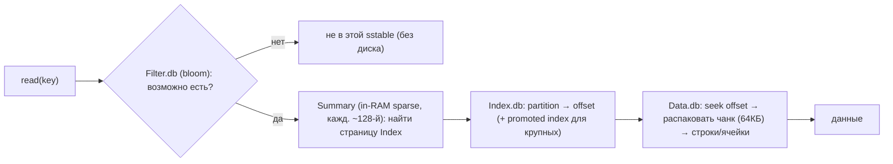

### S3. Стратегии компакции + ICS-фрагменты

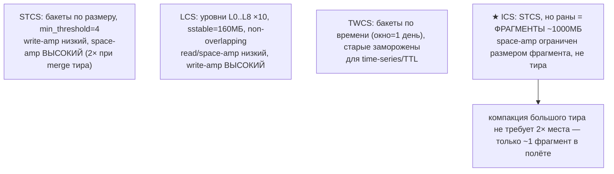

### S4. IO Scheduler: scheduling-groups + iotune + backlog-controller

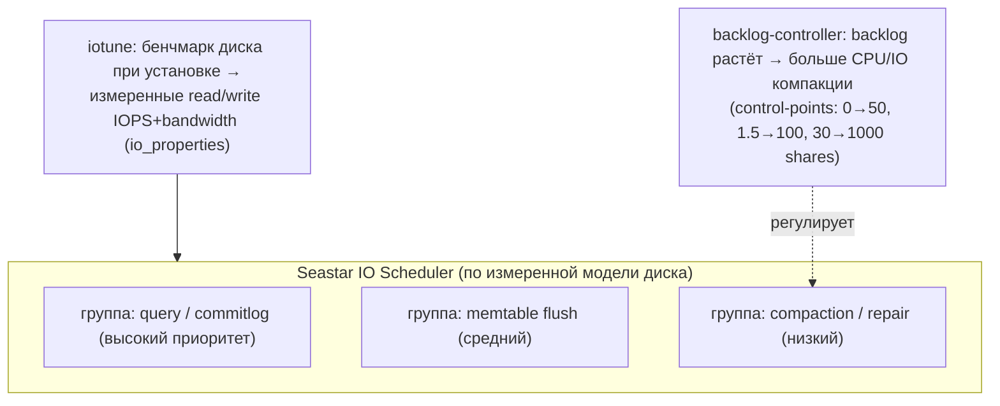

### S5. Commitlog: per-shard сегменты, O_DSYNC, recycle

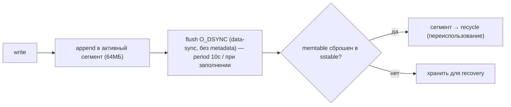

### S6. scylla-manager: запланированные ops

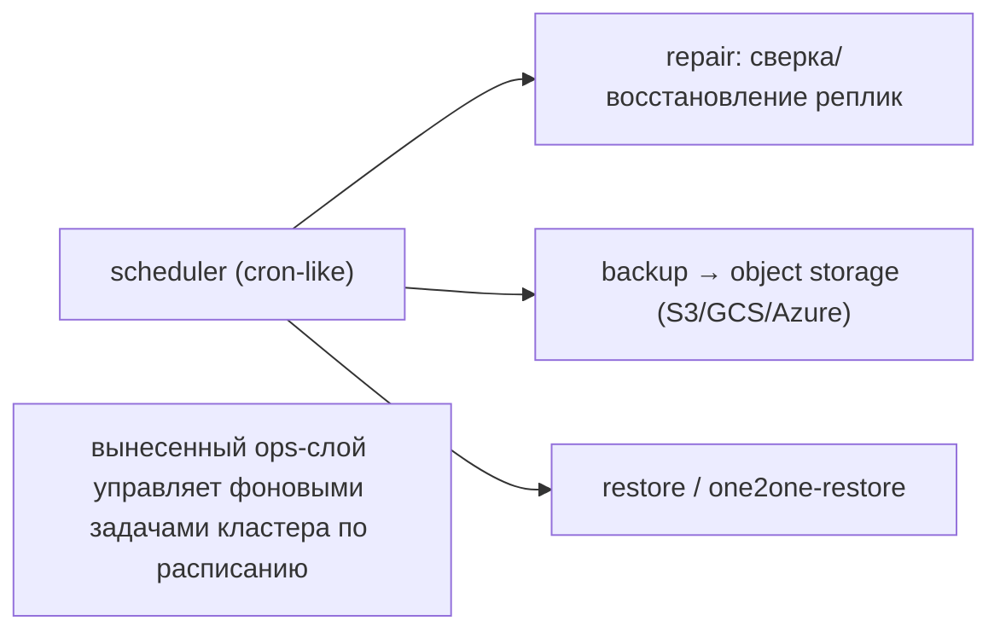

---

## 2-bis. Файловая система: раскладка и потоки (Mermaid)

> Особенность Scylla: **всё IO через `open_file_dma` (O_DIRECT) + AIO, мимо kernel page-cache**;
> память (row cache) Scylla держит сама, а IO планирует Seastar по **измеренной iotune** модели диска.

### FS1. Реальная раскладка на диске

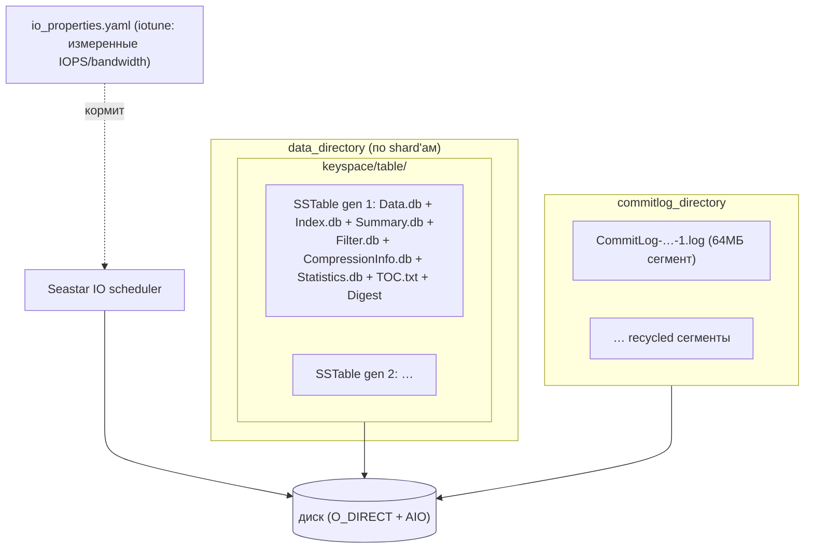

### FS2. Запись на уровне файлов (commitlog O_DSYNC + flush в SSTable)

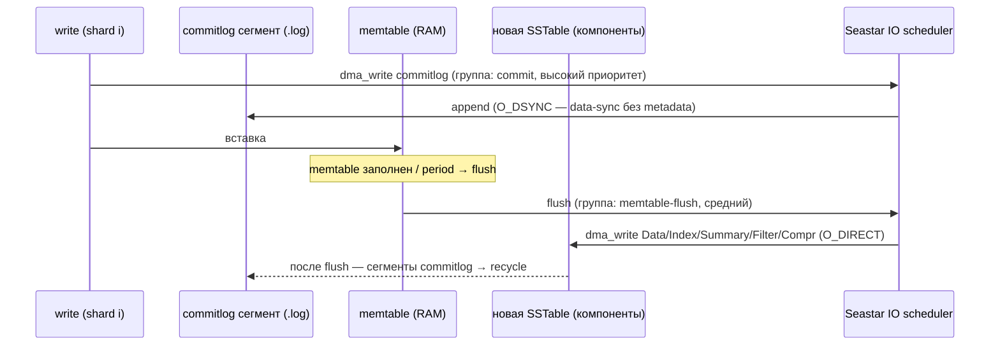

### FS3. Чтение на уровне файлов (bloom → summary → index → data)

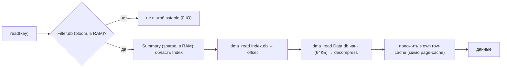

### FS4. Компакция на уровне файлов (ICS-фрагменты + backlog-controller)

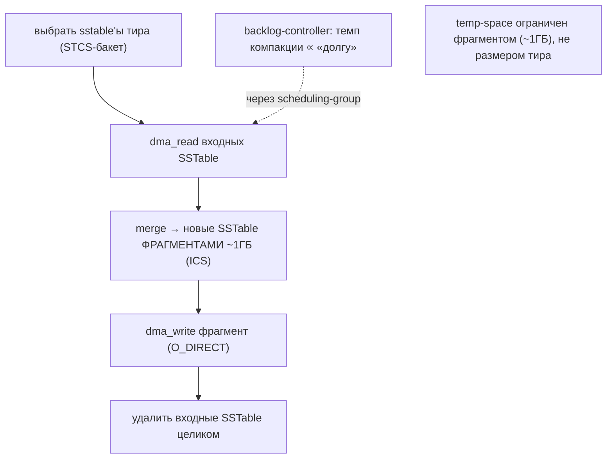

---

## 3. Ubiquitous Language (термины Scylla)

| Термин | Значение | Где в коде |
|---|---|---|
| **Shard** | per-core владелец данных+памяти+IO (shared-nothing) | `dht/token.cc:119` |
| **SSTable** | иммутабельный набор: Data/Index/Summary/Filter/… | `sstables/component_type.hh` |
| **Summary** | sparse in-RAM индекс (кажд. ~128-й), downsampling | `sstables/types.hh`, `downsampling.hh:32` |
| **STCS/LCS/TWCS/ICS** | стратегии компакции | `compaction/*` |
| **ICS fragment** | кусок sstable-рана ~1000МБ (огранич. temp-space) | `incremental_compaction_strategy.hh:50` |
| **scheduling_group** | класс приоритета задач/IO | `compaction_manager.hh:78`, `commitlog.hh:89` |
| **backlog controller** | пропорц. регулятор темпа компакции | `backlog_controller.hh` |
| **iotune** | калибровка диска (IOPS/bandwidth) | (tool + io_properties) |

---

## 4. ★ Sharding + Seastar IO + iotune + scheduling-groups

- **Shared-nothing per-core** (`dht/token.cc:119`): `shard = (token/2^64) * N_cores`; каждый shard
  владеет своими данными/памятью/IO-queue, **без локов** (`replica/global_table_ptr.hh`). Кросс-shard
  — через `foreign_ptr` (message passing).
- **IO Scheduler со scheduling-groups**: задачи помечаются группой приоритета — commitlog/query
  (высокий), memtable flush (средний), compaction/repair (низкий) (`commitlog.hh:89`,
  `compaction_manager.hh:78`, `row_cache.cc:136`). Fair-queue Seastar даёт каждой группе долю.
- **★ iotune**: при установке бенчмаркит **реальные** read/write IOPS+bandwidth диска и пишет
  `io_properties`; планировщик использует **измеренную** модель диска (а не догадки). → в отличие от
  hardcoded device-type профилей YDB, Scylla **меряет**.
- **O_DIRECT + AIO везде** (`open_file_dma`, `db/commitlog/commitlog.cc:537`): мимо kernel page-cache;
  Scylla управляет памятью сама (row cache + LSA).

> **Для нас:** shard ≈ **наш per-disk worker** (token→shard ≈ HRW(cid)→диск, у нас уже есть).
> Берём: **scheduling-groups** как таксономию гейтов нашего Forseti (client/commit > flush >
> compaction/resilver); **iotune** — мерить каждый из 60 HDD при старте и кормить cost-моделью
> Forseti (точнее, чем профиль по типу).

## 5. SSTable: формат и read-path

- **Компоненты** (`sstables/component_type.hh:17`): `Data.db` (партиции→строки→ячейки),
  `Index.db` (partition→offset, + promoted index для крупных), `Summary.db` (sparse in-RAM),
  `Filter.db` (bloom), `CompressionInfo.db` (оффсеты чанков), `Statistics.db`, `TOC.txt`, `Digest`.
- **Read-path**: bloom (`Filter.db`) → **Summary** (in-RAM, кажд. ~128-й, `downsampling.hh:32`) →
  `Index.db` (offset) → `Data.db` (seek + распаковка **чанка 64КБ**, `types.hh` DEFAULT_CHUNK_SIZE).
- **Downsampling**: при нехватке памяти Summary прореживается (удаляются записи через одну) —
  sparse-индекс адаптируется к доступной RAM.

> **Для нас:** confirms наш index-tier + bloom + micro-block compression. **Новое:** двухуровневый
> индекс — **sparse Summary в RAM поверх redb на NVMe** (быстрый «в какую область сегмента») +
> **downsampling** Summary под давление памяти.

## 6. ★ Компакция: стратегии + ICS-фрагменты + backlog-controller

| Стратегия | write-amp | space-amp | read-amp | дефолты |
|---|---|---|---|---|
| **STCS** (size-tiered) | низкий | **высокий (2× при merge)** | средний | min_thr=4, max=32, bucket 0.5–1.5 |
| **LCS** (leveled) | **высокий (×10/уровень)** | низкий (~1.1×) | низкий | sstable=160МБ, fan-out 10, L0..L8 |
| **TWCS** (time-window) | низкий | низкий | средний | окно=1 день |
| **★ ICS** (incremental) | низкий (как STCS) | **ограничен фрагментом** | средний | **fragment=1000МБ** |

- **★ ICS** (`incremental_compaction_strategy.hh:50`): STCS, но раны режутся на **фрагменты
  ~1000МБ** → компакция большого тира не требует 2× места (в полёте ~1 фрагмент). `space_amplification_goal`
  (1.0–2.0] авто-тюнит. Backlog считается по фрагментам (`incremental_backlog_tracker`).
- **Backlog-controller** (`backlog_controller.hh`): пропорциональный регулятор — backlog
  (≈ `bytes_uncompacted × log4(total)`) растёт → больше CPU/IO компакции (control-points
  `0→50, 1.5→100, 30→1000` shares); падает → меньше (не душить запросы).

> **Для нас:** **ICS-фрагменты** — прямой рецепт ограничить temp-space нашей сегментной GC
> (компактить фрагментами ~ фикс. размера, не весь тир). **Backlog-controller** — адаптивный темп
> GC по измеренному «долгу» (поверх Forseti).

## 7. Commitlog, cache, O_DIRECT

- **Commitlog** (`db/config.cc:911`, `commitlog.cc`): per-shard WAL, **сегменты 64МБ**, **O_DSYNC**
  (`commitlog_use_o_dsync=true` — data-sync без metadata-sync, ниже латентность), flush period 10с
  или при заполнении, **recycle** сегмента после сброса memtable.
- **Row cache** (`db/row_cache.*`): собственный in-RAM кэш строк (не page-cache), LRU с долей под
  индекс; eviction в фоновой scheduling-group.
- **O_DIRECT + own cache**: Scylla **полностью обходит kernel page-cache** и управляет памятью сама.

> **Для нас:** **O_DSYNC** для нашего write-лога (durability без metadata-sync); **recycle сегментов**;
> вопрос дизайна — own-cache мимо page-cache (как Scylla/YDB) vs опора на page-cache на HDD (наш
> текущий выбор для HDD-сегментов). Для NVMe-индекса/кэша тел — own-cache + O_DIRECT уместен.

## 8. scylla-manager — вынесенный ops-слой (Go)

`scylla-manager/pkg/service/{repair,backup,restore,one2onerestore}`: **по расписанию** (cron-like
scheduler) запускает **repair** (сверка/восстановление реплик), **backup** в object storage
(S3/GCS/Azure), **restore**. Это отдельный сервис над кластером.

> **Для нас:** прообраз нашего **admin/ops-слоя**: запланированные `scrub`/`resilver`/бэкап в
> remote (`cold_path`/S3), вынесенные из горячего пути в отдельный планировщик.

---

## 9. Философия и вывод XFS/ZFS

Scylla, как YDB, **обходит файловую систему-как-кэш**: O_DIRECT + AIO + собственный IO-scheduler,
калиброванный **iotune** под реальный диск. ФС нужна лишь как контейнер файлов sstable/commitlog →
быстрая простая (**XFS** — рекомендация Scylla). ZFS не нужен (целостность — Digest/checksum,
избыточность — репликация Cassandra-стиля). Ключевой вывод: **не угадывать характеристики диска, а
измерять (iotune)** и планировать IO по измеренной модели.

---

## 9-bis. Снипеты кода (реальные выдержки + объяснение)

### CS1. Backlog-controller: control-points backlog→shares (#52)

```cpp
// backlog_controller.hh:132
static inline const std::vector<backlog_controller::control_point> default_control_points = {
    {0.0, 50}, {1.5, 100}, {normalization_factor, default_compaction_maximum_shares}};  // 0→50, 1.5→100, 30→1000
```

**Объяснение:** пропорциональный контроллер: величина «долга» → доля CPU/IO под компакцию. → наш
**backlog-controller (#52)** (адаптивный темп GC по долгу).

### CS2. Формула долга: bytes × log4(total) (#52)

```cpp
// compaction/incremental_backlog_tracker.cc:71
auto effective_backlog_bytes = _total_backlog_bytes - compacted.total_bytes;
auto b = (effective_backlog_bytes * log4(_total_bytes)) - sstables_contribution;
return b > 0 ? b : 0;
```

**Объяснение:** «долг компакции» = `(Si−Ci)·log₄(T) − Σ(...)` — нелинейно от несжатых байт. → вход
нашего **backlog-controller (#52)**: количественная мера остатка работы GC.

### CS3. Scheduling-groups: IO-приоритет фоновых задач (#51)

```cpp
// db/commitlog/commitlog.cc:2106
_reserve_replenisher = with_scheduling_group(cfg.sched_group, [this] { return replenish_reserve(); });
```

**Объяснение:** фон-задача обёрнута в именованную `scheduling_group` (commitlog/flush/compaction) →
fair-queue делит CPU/IO по группам. → наш **scheduling-groups (#51)** (классы: client/commit > flush > GC/resilver) для Forseti.

> ⚠️ iotune (#49): в этом слое генератор `io_properties.yaml` не найден (потребляется готовый профиль);
> ближайшее — IOPS/bandwidth-параметры в `db/config.cc`.

---

## 10. Извлечённые идеи для OpenZFS Daemon (новое сверх 8 прошлых)

| Идея из Scylla | Где применить | Эффект |
|---|---|---|
| **★ iotune: мерить диск, не угадывать** | **Фаза 0/5** — бенчмарк каждого из 60 HDD при старте → кормить cost-модель Forseti измеренными IOPS/bandwidth | точное IO-планирование (точнее device-type профилей) |
| **★ ICS-фрагменты (~1000МБ)** | **Фаза 5** — компакция сегментов фрагментами фикс. размера | temp-space ограничен фрагментом, не тиром |
| **★ Backlog-controller (пропорц.)** | **Фаза 5** — адаптивный темп GC по «долгу» компакции | не отстать от записи и не задушить чтение |
| **Scheduling-groups (таксономия классов)** | **Фаза 5** — гейты Forseti: query/commit > flush > compaction/resilver | чёткие классы приоритета |
| **Sparse in-RAM Summary + downsampling** | **Фаза 1/4** — sparse-индекс в RAM поверх redb; прореживать под давление памяти | быстрый lookup + адаптация к RAM |
| **O_DSYNC + recycle сегментов** (WAL) | **Фаза 1** — write-лог: data-sync без metadata; переиспользовать сегменты | ниже латентность fsync |
| **Стратегии компакции как выбор** | **Фаза 5** — STCS-подобная по умолчанию, LCS/TWCS как опции под профиль | управляемый trade-off amplification |
| **scylla-manager: scheduled repair/backup** | **Фаза 5** — вынесенный планировщик scrub/resilver/бэкап в S3 | ops вне горячего пути |

### Главные новые заимствования
1. **iotune** — измерять каждый диск и планировать IO по реальной модели (а не по типу).
2. **ICS-фрагменты** — ограничить temp-space сегментной компакции размером фрагмента.
3. **Backlog-controller** — пропорциональный адаптивный темп GC/компакции по измеренному долгу.

---

## 11. Источники в коде (для перепроверки)

- Sharding/IO: `dht/token.cc:119`, `replica/global_table_ptr.hh:20`, `db/commitlog/commitlog.cc:537`
  (open_file_dma), `db/config.cc:936` (o_dsync), `db/config.cc:911` (segment 64МБ).
- SSTable: `sstables/component_type.hh:17`, `sstables/types.hh` (chunk 64КБ, summary),
  `sstables/index_reader.hh`, `sstables/downsampling.hh:32`, `utils/bloom_filter.hh`.
- Compaction: `compaction/size_tiered_compaction_strategy.*`, `leveled_compaction_strategy.hh:42`
  (160МБ), `time_window_compaction_strategy.hh`, `incremental_compaction_strategy.hh:50` (1000МБ),
  `incremental_backlog_tracker.*`, `backlog_controller.hh`, `compaction/compaction_backlog_manager.hh`.
- Cache: `db/row_cache.{hh,cc}`. Manager: `scylla-manager/pkg/service/{repair,backup,restore}`.
