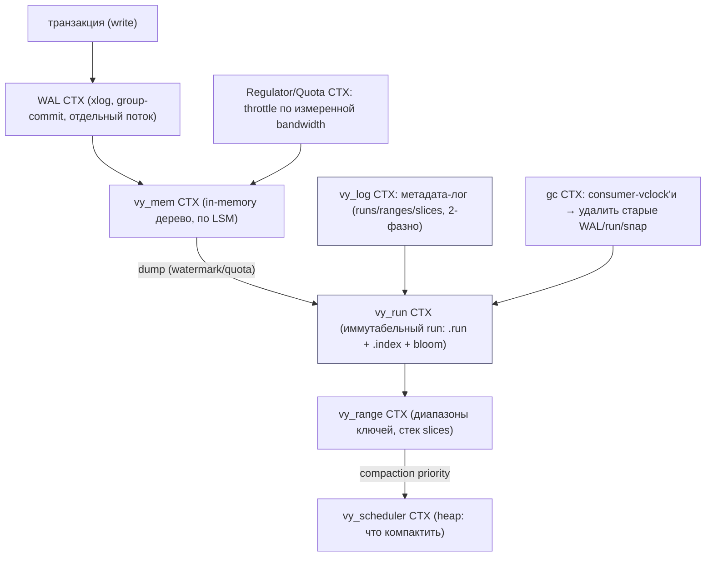
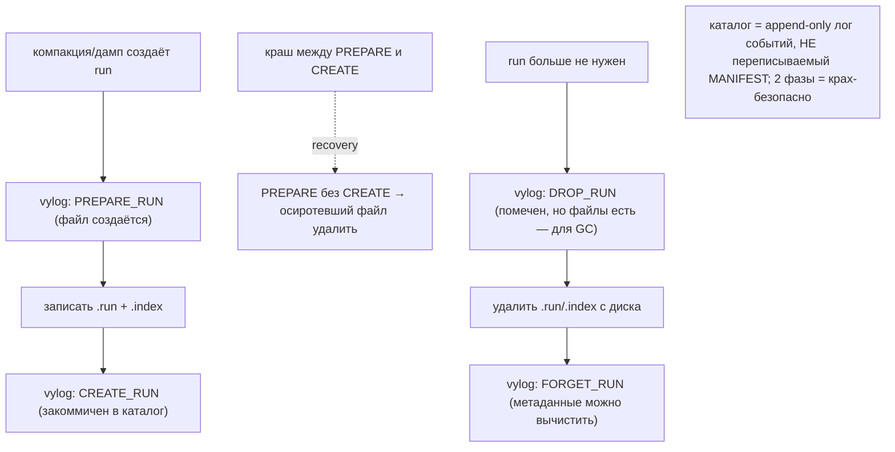
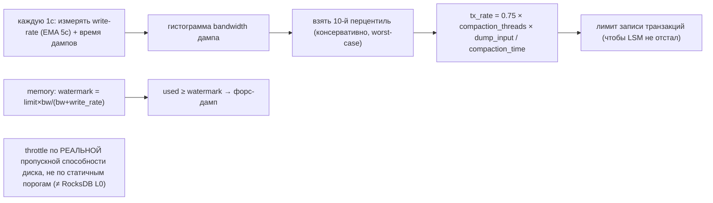
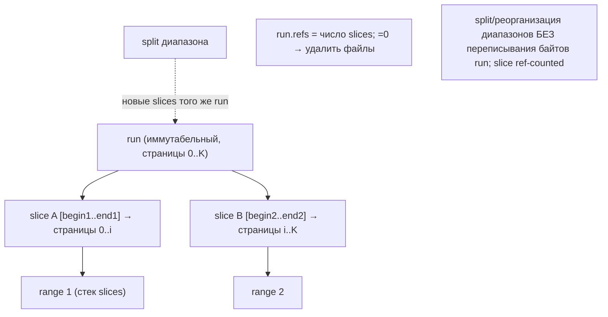
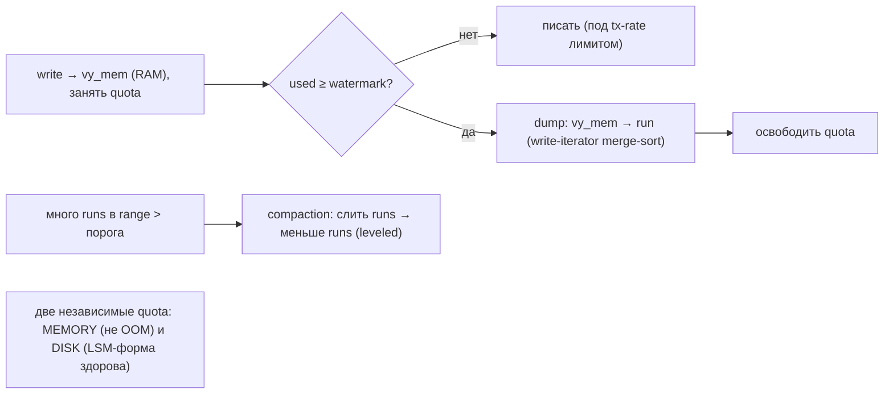
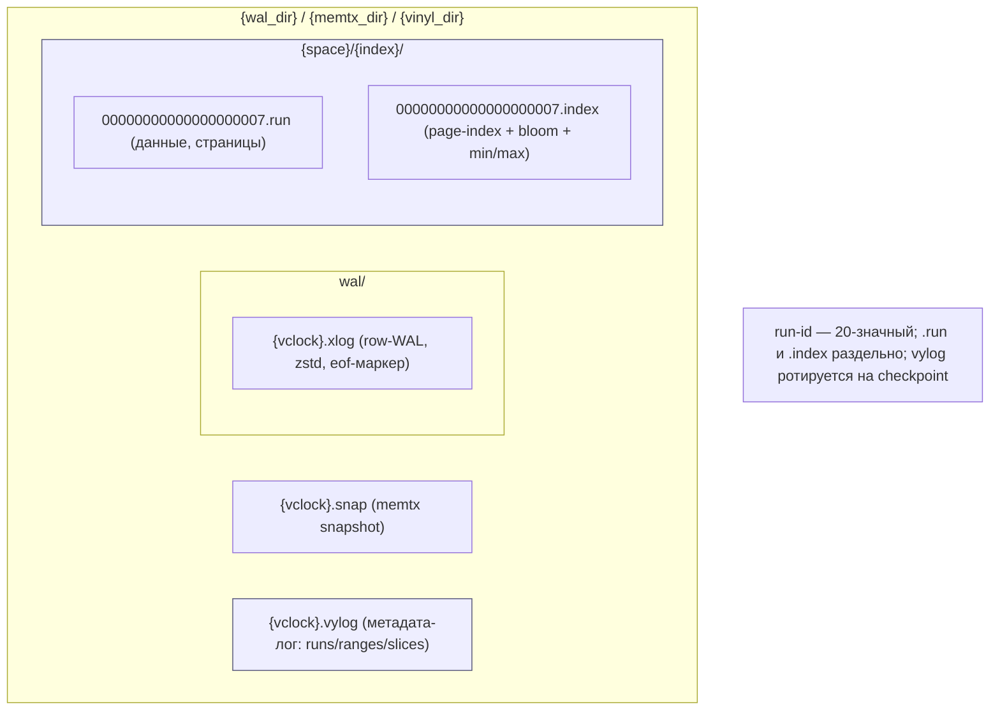
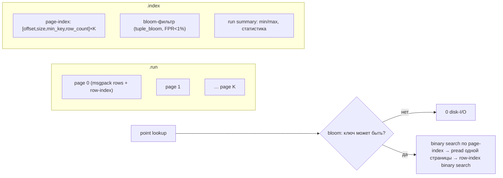
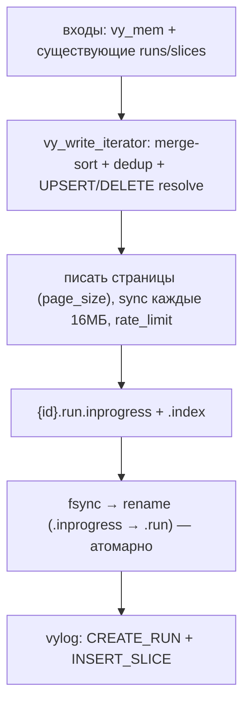
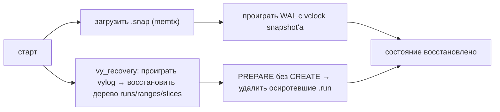

# Tarantool Storage — как Tarantool работает с HDD/SSD (DDD-разбор исходников)

> Исследование исходников **tarantool/tarantool** (`Vendor/tarantool`, свежий слой, commit `4cbad5e`
> от 2026-06-09). Все факты — с ссылками `файл:строка`, проверены в коде.

Tarantool — in-memory БД (C) с двумя движками: **memtx** (в RAM + WAL/snapshot) и **vinyl**
(on-disk **LSM**). Дисковый интерес — vinyl + общий WAL. Vinyl местами совпадает с уже разобранными
LSM (RocksDB/Pebble/Scylla/Ignite: runs≈SSTable, bloom, компакция, ZSTD, WAL+checkpoint, GC), но
есть **по-настоящему отличительное**:

1. **★ vylog — «метадата-лог как каталог»** (отдельный append-only лог структурных событий вместо
   переписываемого MANIFEST) + **2-фазные жизненные циклы**: `PREPARE_RUN→CREATE_RUN` (детект
   осиротевших) и `DROP_RUN→…→FORGET_RUN` (крах-безопасное удаление).
2. **★ Regulator** — write-throttle по **измеренной** bandwidth дампа/компакции (гистограмма,
   10-й перцентиль = консервативно) + headroom-фактор 0.75 + раздельные disk/memory лимиты + формула
   memory-watermark.
3. **★ Slices** — логические окна в run (begin/end + first/last page, ref-counted): один run делят
   несколько диапазонов → split/реорганизация **без переписывания данных**.
4. **★ Group-commit WAL** — WAL в отдельном потоке (cbus-очередь), много транзакций в **один fsync**;
   torn-tail recovery по **eof-маркеру**.

> Контекст: vinyl — **key-range LSM** (упорядоченные ключи, ranges). У нас ключи — **случайные CID**
> (HRW-placement, не диапазоны), сегменты **append-only**. Поэтому range/slice-механика ⚠️ ограниченно
> применима; берём **vylog-модель каталога** (валидирует наш манифест+two-phase-delete) и **regulator**
> (измеряемый throttle — усиливает Forseti/backlog/backpressure). WAL+checkpoint/bloom у нас уже есть.

---

## 1. Bounded Contexts



| Контекст | Ответственность | Файлы |
|---|---|---|
| **WAL** | row-WAL, group-commit, режимы, ротация | `box/wal.c`, `box/xlog.c`, `box/xrow.c` |
| **vy_mem / dump** | in-memory дерево → run при watermark | `box/vy_mem.{c,h}`, `box/vy_scheduler.c` |
| **vy_run** | формат run (.run/.index/bloom/page-index) | `box/vy_run.{c,h}` |
| **vy_range / slice** | диапазоны ключей, окна в run | `box/vy_range.{c,h}`, `vy_run.h` (slice) |
| **vy_log (vylog)** | метадата-лог: каталог runs/ranges, 2-фазно | `box/vy_log.{c,h}` |
| **Regulator/Quota** | измеряемый write-throttle, memory-watermark | `box/vy_regulator.{c,h}`, `box/vy_quota.{c,h}` |
| **GC** | reference-tracking, удаление старых файлов | `box/gc.{c,h}`, `box/checkpoint.c` |

---

## 2. Архитектурные диаграммы (Mermaid)

### Tt1. vylog: метадата-лог как каталог (2-фазные циклы)



### Tt2. Regulator: throttle по ИЗМЕРЕННОЙ bandwidth



### Tt3. Slices: один run делят диапазоны (split без переписи)



### Tt4. Group-commit WAL + torn-tail recovery

```mermaid
sequenceDiagram
    participant T1 as txn1
    participant T2 as txn2
    participant Q as cbus-очередь
    participant W as WAL-поток
    participant D as xlog на диске
    T1->>Q: rows
    T2->>Q: rows
    W->>D: write(батч row'ов T1+T2) → ОДИН fsync (wal_mode=fsync)
    D-->>W: durable
    W-->>T1: ok; W-->>T2: ok
    note over D: в конце файла eof-маркер (0xd510aded); нет маркера → torn tail → отбросить хвост
```

### Tt5. Dump/compaction под quota (memory ↔ disk)



---

## 2-bis. Файловая система: раскладка и потоки (Mermaid)

> Vinyl: данные — иммутабельные **run-файлы** (`.run`+`.index`), каталог — **vylog**, durability —
> общий **WAL**, консистентность — **checkpoint** (.snap memtx + dump vinyl + ротация vylog).

### FS1. Реальная раскладка на диске



### FS2. Формат run: страницы + page-index + bloom



### FS3. Dump/compaction: write-iterator → новый run (atomic)



### FS4. Recovery: snap + WAL + vylog (+ чистка осиротевших)



---

## 3. Ubiquitous Language (термины Tarantool)

| Термин Tarantool | Значение | Наш аналог |
|---|---|---|
| **run** (.run/.index) | иммутабельный сортированный файл (SSTable) | pack-сегмент (но сортированный) |
| **slice** | окно в run (begin/end + page-диапазон) | ⚠️ нет (мы append-only, ключи случайны) |
| **range** | диапазон ключей со стеком slices | ⚠️ нет (HRW, не диапазоны) |
| **vylog** | метадата-лог: каталог runs/ranges | манифест сегментов (#66) |
| **PREPARE/CREATE, DROP/FORGET** | 2-фазные жизненные циклы run | two-phase delete (#84) |
| **regulator** | измеряемый write-throttle | Forseti/backlog/backpressure |
| **quota** | лимиты memory/disk | memory-budget + IO-лимит |
| **dump** | vy_mem (RAM) → run | seal/flush буфера |
| **checkpoint** (.snap) | консистентный снимок | scrub-dump / backup |
| **group commit** | батч txn в один fsync | коалесинг write-буфера |
| **eof-маркер** | конец xlog (torn-tail детект) | flushOffset |

---

## 4. vylog — метадата-лог как каталог

`vy_log.{c,h}` — **отдельный** append-only лог **структурных** событий (не row-WAL, не central
MANIFEST). 17 типов записей (`vy_log.h:65-222`): `CREATE_LSM`, `PREPARE_RUN`(4), `CREATE_RUN`(5),
`INSERT_SLICE`(8)/`DELETE_SLICE`(9), `DROP_RUN`(6)/`FORGET_RUN`(7), `INSERT_RANGE`/`DELETE_RANGE`,
`SNAPSHOT`(11, checkpoint-маркер). Запись батчами (`vy_log_tx`, `:134`), флашится отдельным фибером.
Recovery (`vy_recovery_new`) проигрывает лог → восстанавливает дерево runs/ranges/slices.

**2-фазные жизненные циклы** (отличительное):
- **Создание:** `PREPARE_RUN` (файл начат) → запись .run/.index → `CREATE_RUN` (закоммичен). Краш
  между ними → `PREPARE` без `CREATE` → **осиротевший файл удаляется** при recovery.
- **Удаление:** `DROP_RUN` (помечен, файлы ещё есть — для GC-tracking) → `vy_run_remove_files`
  (`:2680`) → `FORGET_RUN` (метаданные вычистить). Крах-безопасно: нет «удалили файл, но числится».

> Для нас: **прямая валидация** нашего `манифеста сегментов` (#66) + `two-phase delete` (#84).
> Уточнение: **PREPARE/CREATE** для детекта осиротевших сегментов (краш во время записи/компакции) и
> **DROP→delete→FORGET** как канонический 3-шаг. Append-only лог каталога ⟷ наш «нет central catalog».

---

## 5. Regulator + Quota — write-throttle по измеренной bandwidth

`vy_regulator.{c,h}` — **обратная связь по реальному I/O** (раз в 1с, `VY_REGULATOR_TIMER_PERIOD`):
- **Измеряет** write-rate (EMA 5с) и время дампов → **гистограмма bandwidth дампа**; берёт **10-й
  перцентиль** (`VY_DUMP_BANDWIDTH_PCT=10`, консервативно — worst-case, `:265`).
- **tx-rate лимит** (`:412`): `0.75 × compaction_threads × dump_input / compaction_time` — разрешить
  запись до **75%** того, что успевает компакция (25% headroom, чтобы LSM не «утонул»).
- **memory-watermark** (`:157`): `watermark = limit × bw / (bw + write_rate + 1)` (≥50% limit) — когда
  память дойдёт до лимита, дамп уже завершится.
- **Две независимые quota** (`vy_quota.h:123`): `RESOURCE_DISK` (форма LSM) и `RESOURCE_MEMORY` (не OOM).

> Для нас: усиливает [Forseti](#) (#41) / backlog-controller (#52) / write-throttling (#62) /
> backpressure-по-байтам (#78): **мерить реальную bandwidth фона (компакция/resilver) гистограммой и
> ограничивать писателя как долю (≈0.75) от неё** — точнее статичных порогов. iotune (#49) даёт
> стартовую модель, regulator — рантайм-обратную связь.

---

## 6. run-формат, slices, компакция

**run** = `.run` (страницы msgpack-строк + per-page row-index для binary-search внутри страницы,
`:2363`) + `.index` (page-index `[offset,size,min_key]×K` + **bloom** `tuple_bloom` FPR<1% + summary).
Запись (`vy_run_writer`, `:2215`): страница флашится при `obuf ≥ page_size`; sync каждые **16МБ**
(`VY_RUN_SYNC_INTERVAL`); ZSTD на уровне xlog (порог 2КБ); atomic `rename(.inprogress→.run)`.
Чтение: bloom → page-index binary-search → `fio_pread` одной страницы → row-index binary-search.

**slice** (`vy_run.h:181`) — логическое окно в run (`begin/end` + `first/last page_no`), **ref-counted**:
один run делят несколько ranges; **range split → новые slices того же run без переписывания байтов**;
run удаляется, когда все slices unref'd. Компакция — **leveled** (`run_count_per_level`,
`run_size_ratio`), приоритет диапазона (`compaction_priority`) в heap планировщика (`vy_scheduler`).

> Для нас: bloom-per-run у нас уже есть (#19/#37). **slice/range — ⚠️ ограниченно**: наши ключи —
> случайные CID (HRW, не диапазоны), сегменты append-only. Но идея «**ref-counted окно в иммутабельном
> файле → реорганизация без переписи байтов**» — кандидат для GC (ссылаться на живые регионы сегмента
> вместо rewrite). Помечаем как опциональную.

---

## 7. WAL, checkpoint, GC

**WAL** (`wal.c`, `xlog.c`): row-WAL в **отдельном потоке** (cbus-очередь) с **group-commit** — много
транзакций батчатся в **один** `write`+`fsync` → амортизация durability. Режимы `wal_mode`:
`none`/`write`/`fsync` (`wal.h:50`). ZSTD-строки (`zrow_marker`), **eof-маркер** `0xd510aded` →
torn-tail recovery (нет маркера → отбросить неполный хвост). **Checkpoint** (`checkpoint.c`): .snap
memtx + dump всех vy_mem на тот же LSN + ротация WAL/vylog. **GC** (`gc.c`): reference-tracking по
**consumer-vclock'ам** (реплики/бэкапы/checkpoint'ы) — старый WAL/run/snap удаляется, когда не нужен
ни одному consumer'у.

> Для нас: **group-commit** — батчить fsync многих put'ов в один (поверх write-буфера + offload-fsync
> Redis #65). **eof-маркер** ⟷ наш flushOffset (оба ловят torn tail). wal_mode ⟷ Ignite #61. GC по
> consumer-ref ⟷ наш pin/refcount + (Часть 2) защита от удаления нужного реплике.

---

## 8. Философия и вывод XFS/ZFS

Tarantool не использует O_DIRECT по умолчанию (полагается на page-cache ОС), но добавляет
**snap_io_rate_limit** + sync-интервал (16МБ) — управляемая запись на «голый» FS. Иммутабельные runs +
atomic-rename + ZSTD ложатся на XFS+JBOD (ADR 0001). Ключевой урок — **regulator**: на 60 HDD
агрегатная bandwidth фона переменна, и статичные пороги (как L0-count в RocksDB) хуже измеряемой
обратной связи. ZFS поверх дал бы двойной CoW — не нужен.

---

## 8-bis. Снипеты кода (реальные выдержки + объяснение)

### CS1. vylog: 2-фазные жизненные циклы run (#96)

```c
// src/box/vy_log.h:96 — типы записей
VY_LOG_PREPARE_RUN  = 4,   // файл run создаётся (если краш до CREATE → осиротевший → удалить)
VY_LOG_CREATE_RUN   = 5,   // run закоммичен (файл успешно записан)
VY_LOG_DROP_RUN     = 6,   // run больше не нужен (файлы можно удалять)
VY_LOG_FORGET_RUN   = 7,   // файлы удалены → метаданные вычистить
```

**Объяснение:** рождение `PREPARE→CREATE` (orphan-detect), смерть `DROP→удалить→FORGET` (крах-безопасно).
→ наш **манифест-как-лог + 2-фазные циклы (#96)**.

### CS2. Regulator: write-rate по измеренной bandwidth (#97)

```c
// src/box/vy_regulator.c:279
regulator->dump_bandwidth = histogram_percentile_lower(
    regulator->dump_bandwidth_hist, VY_DUMP_BANDWIDTH_PCT);   // 10-й перцентиль (worst-case)
// :432
double rate = 0.75 * compaction_threads * recent->dump_input / recent->compaction_time;  // 25% headroom
```

**Объяснение:** мерить реальную bandwidth (гистограмма, p10), лимит писателя = 0.75× compaction. → наш
**regulator: рантайм-throttle по измеренной bandwidth (#97)**.

### CS3. Group-commit WAL + eof-маркер (#99)

```c
// src/box/wal.c:1353 — батч транзакций
stailq_foreach_entry(entry, &wal_msg->commit, fifo) { xlog_write_entry(l, entry); }  // много txn в буфер
rc = xlog_flush(l);   // ОДИН fsync на всех
// src/box/xlog.c:75
static const log_magic_t eof_marker = mp_bswap_u32(0xd510aded);   // нет маркера → torn tail
```

**Объяснение:** много транзакций → один `fsync`; eof-маркер ловит оборванный хвост. → наш
**group-commit + eof-маркер (#99)** (рядом с flushOffset).

---

## 9. Извлечённые идеи для OpenZFS Daemon

| # | Идея | Где у Tarantool | Берём? | Фаза | Влияние |
|---|---|---|---|---|---|
| 96 | **★ Метадата-лог-как-каталог + 2-фазные циклы** (`PREPARE/CREATE` детект осиротевших; `DROP/FORGET`) | `vy_log.{c,h}` | ✅ да | **1/5** | валидирует/уточняет манифест (#66) + two-phase delete (#84): orphan-detect + 3-шаг удаления |
| 97 | **★ Regulator: write-throttle по ИЗМЕРЕННОЙ bandwidth** (гистограмма p10 + 0.75 headroom + memory-watermark) | `vy_regulator.{c,h}`, `vy_quota.{c,h}` | ✅ да | **5** | точнее статичных порогов; писатель ≤ 0.75× реальной bandwidth фона; усиливает Forseti/backlog/#78 |
| 98 | **Slices: ref-counted окно в иммутабельном файле** (реорганизация без переписи байтов) | `vy_run.h:181`, `vy_range.c` | ⚠️ опц. | **5** | range/slice не наши (CID случайны); но «ссылка на живой регион вместо rewrite» — кандидат для GC |
| 99 | **Group-commit WAL** (отдельный поток + батч txn в один fsync) + eof-маркер torn-tail | `wal.c`, `xlog.c` | ✅ да | **1** | амортизация fsync на множестве put'ов; eof-маркер = ещё один torn-tail детект (рядом с flushOffset) |

### Конвергенция (подтверждает уже принятое, не новые строки)
- **runs (SSTable) + leveled compaction + bloom-per-run** ⟷ pack-сегменты + GC + Bloom/Ribbon (#19/#37), RocksDB/Pebble/Scylla.
- **WAL + checkpoint recovery** ⟷ Ignite #59; **wal_mode none/write/fsync** ⟷ WAL-режимы #61.
- **компакция-приоритет в heap + leveled** ⟷ Pebble blob-rewrite + backlog-controller (#52).
- **ZSTD на уровне xlog** ⟷ опц. zstd тел (#5); **snap_io_rate_limit + sync 16МБ** ⟷ writeback (#64).
- **GC по consumer-vclock** ⟷ pin/refcount + защита нужного реплике (Ч2).
- **vy_cache (tuple cache) + read-views MVCC** ⟷ кэши тел + redb-MVCC.
- **memtx in-RAM** ⟷ не наша модель (тела на диске).

### Главные новые заимствования
**#96 vylog-каталог + 2-фазные циклы** — лучшая в индустрии валидация нашего «манифест + two-phase
delete» с конкретикой orphan-detect. **#97 regulator** — измеряемый write-throttle (главный новый
приём, усиливает весь наш IO-контроль). #98/#99 — точечные (slice ⚠️ ограниченно, group-commit — да).

---

## 10. Источники в коде (для перепроверки)

| Область | Файл | Ключевые места |
|---|---|---|
| run-формат/writer | `src/box/vy_run.c` | 2215-2474 (writer), 2363 (row-index), 951 (page read), 2680 (remove) |
| run/slice структуры | `src/box/vy_run.h` | 94 (bloom), 102-117 (page_info), 181-227 (slice) |
| vylog | `src/box/vy_log.{c,h}` | h:65-222 (типы), c:134 (tx), c:328 (encode) |
| ranges/compaction | `src/box/vy_range.{c,h}`, `vy_scheduler.{c,h}` | priority, heap |
| regulator/quota | `src/box/vy_regulator.c` / `vy_quota.h` | reg 157,265,412; quota.h 50,123 |
| WAL/xlog | `src/box/wal.c`, `xlog.c` | wal.h 50-69 (режимы); xlog маркеры/zstd |
| checkpoint/gc | `src/box/checkpoint.c`, `gc.c` | checkpoint stages; gc consumer-vclock |
| read-кэш/MVCC | `src/box/vy_cache.c`, `vy_read_view.h` | tuple cache; read views |

---

> **Резюме для проекта.** Tarantool — 16-й прототип. Vinyl — зрелый LSM (много конвергенции с
> RocksDB/Pebble/Scylla/Ignite), но даёт 2 ценных новых: **#96 vylog-каталог с 2-фазными циклами**
> (валидирует и уточняет наш манифест+two-phase-delete: orphan-detect + DROP/FORGET) и **#97 regulator**
> (write-throttle по *измеренной* bandwidth — точнее статичных порогов). #98 slice ⚠️ ограниченно
> (наши ключи — случайные CID, не диапазоны), #99 group-commit WAL — берём. См.
> [STORAGE-IDEAS-SYNTHESIS.md](STORAGE-IDEAS-SYNTHESIS.md), [[ignite-storage-hdd-ssd.md]] (WAL+checkpoint),
> [[scylladb-storage-hdd-ssd.md]] (backlog-controller), [Feynman](../../Feynman/README.md).
