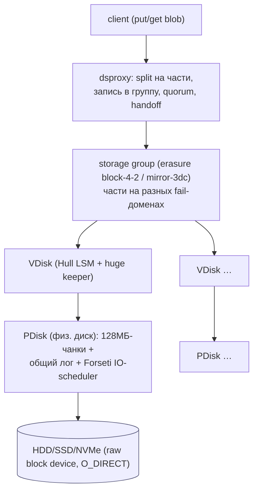
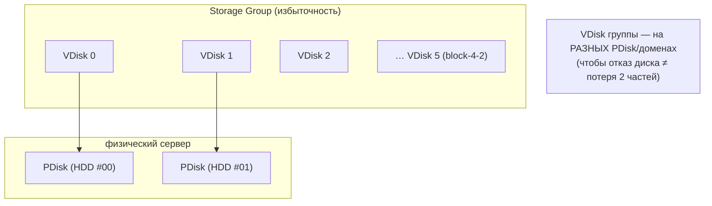
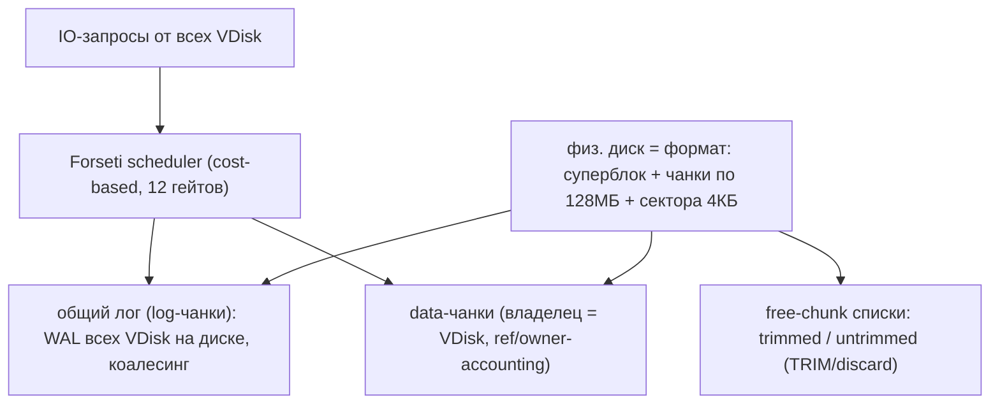
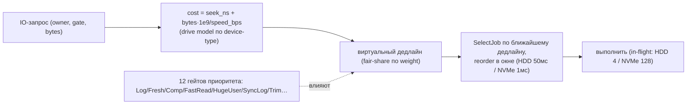
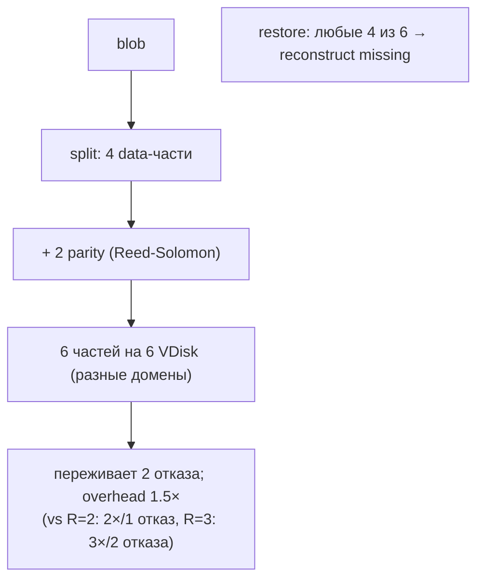
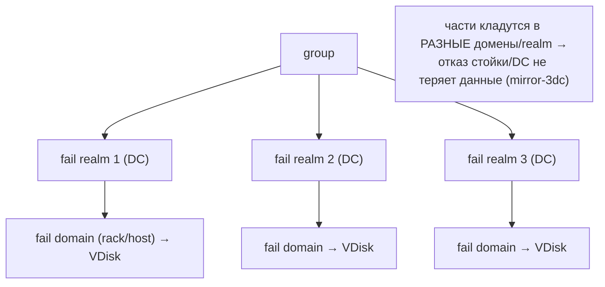
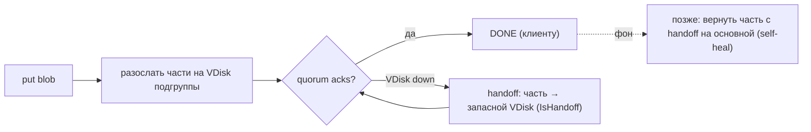
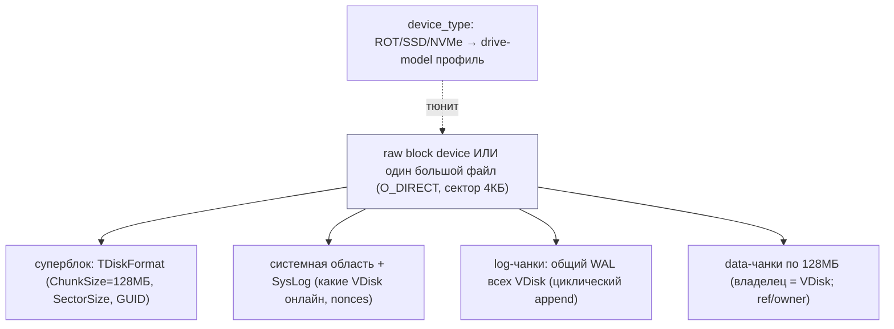
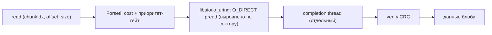
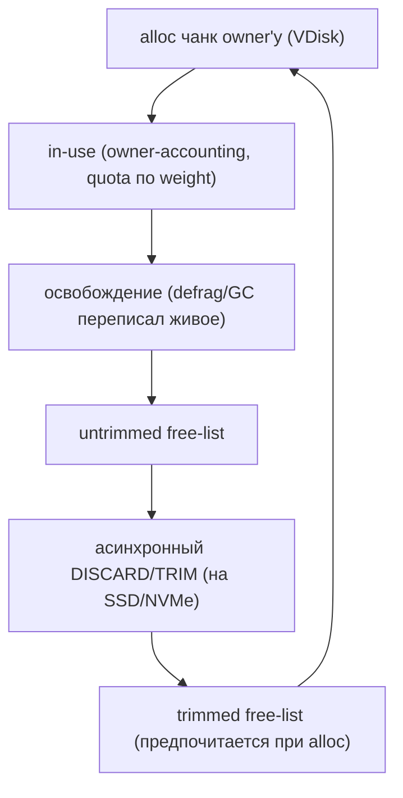

# YDB Storage — как YDB работает с HDD/SSD (DDD-разбор исходников)

> Исследование исходников **ydb-platform/ydb** (`Vendor/YDB`, свежий слой, commit `5f917224…`
> от 2026-06-08). Все факты — с ссылками `файл:строка`, проверены в коде.

YDB (Яндекс) — распределённая SQL-БД, чей слой **BlobStorage** — это **распределённый,
erasure-coded, sharded-по-дискам blob-store**. Это **ближайший к нашему проекту прототип**:
по сути YDB уже решает Часть 1 (шардинг по дискам) **и** Часть 2 (избыточность). Самое ценное
новое:

1. **★ PDisk / VDisk разделение**: **PDisk** = менеджер одного физического диска (128МБ-чанки,
   общий лог, **cost-based IO-scheduler «Forseti»**, device-type-aware); **VDisk** = логический
   диск = член группы. Несколько VDisk делят один PDisk.
2. **★ Forseti — cost-based IO-планировщик** с моделью диска (cost = seek + bytes/speed),
   per-device настройками (HDD: in-flight 4, reorder 50мс; NVMe: 128, 1мс) и 12 приоритет-гейтами.
3. **★ Erasure coding** (block-4-2 = 4+2, tolerates 2 отказа, **1.5× overhead** vs 2–3× у mirror)
   + **2-уровневые fail-домены** (realm/domain) + **dsproxy quorum + handoff**.
4. **Huge/small split** с порогом, **зависящим от типа носителя** (64КБ SSD / 512КБ HDD).

---

## 1. Где YDB в нашей картине



> Маппинг на нас: **PDisk ≈ наш per-disk ShardEngine** (чанки=сегменты, лог=write-буфер,
> Forseti=IO-QoS); **VDisk ≈ логический шард**; **группа+erasure ≈ наша репликация (Часть 2)**;
> **dsproxy ≈ Pool/StoreBlock с quorum**; **fail-домены ≈ наш `shard.domain`**.

---

## 2. Архитектурные диаграммы (Mermaid)

### Y1. PDisk / VDisk / Group — три уровня



### Y2. PDisk: чанки + общий лог + scheduler



### Y3. Forseti — cost-based IO-scheduler (★ для 60 HDD)



### Y4. Erasure block-4-2 vs mirror (Часть 2: избыточность)



### Y5. Fail realms / domains — размещение частей



### Y6. dsproxy: quorum-запись + handoff



---

## 2-bis. Файловая система: раскладка и потоки (Mermaid)

> Особенность YDB: **PDisk обходит файловую систему** — работает с **сырым блочным устройством
> или одним большим файлом** через `O_DIRECT` + libaio, со своим форматом (суперблок + 128МБ-чанки).

### FS1. Формат устройства PDisk (raw device / один большой файл)



### FS2. Запись на уровне устройства (scheduler → лог → чанк)

```mermaid
sequenceDiagram
    participant V as VDisk
    participant S as Forseti scheduler
    participant LOG as общий лог (log-чанки)
    participant CH as data-чанк (128МБ)
    V->>S: запрос записи (owner, gate, bytes)
    S->>S: cost = seek + bytes/speed; виртуальный дедлайн
    alt мелкий блоб / индекс
        S->>LOG: коалесить записи разных VDisk → один батч (O_DIRECT pwrite)
    else huge blob
        S->>CH: alloc чанк → O_DIRECT pwrite по (chunkIdx, offset)
    end
    Note over LOG,CH: in-flight: HDD 4 / NVMe 128; reorder-окно HDD 50мс / NVMe 1мс
```

### FS3. Чтение на уровне устройства (scheduler → pread → completion)



### FS4. Жизненный цикл чанка на устройстве (alloc / free / TRIM)



---

## 3. Ubiquitous Language (термины YDB)

| Термин | Значение | Где в коде |
|---|---|---|
| **PDisk** | менеджер физ. диска (чанки + лог + scheduler) | `blobstorage/pdisk/` |
| **VDisk** | логический диск = член группы | `blobstorage/vdisk/` |
| **Chunk** | фикс. 128МБ — единица аллокации PDisk | `pdisk/..._config.h:115` |
| **Storage Group** | erasure-набор VDisk | `blobstorage/groupinfo/` |
| **TLogoBlobID** | адрес блоба (tablet, gen, step, channel, cookie, size, part) | `core/base/logoblob.h` |
| **Hull** | LSM VDisk для индекса + мелких блобов | `vdisk/hulldb/` |
| **Huge blob** | крупный блоб в чанках (`TDiskPart{chunk, off, size}`) | `vdisk/huge/`, `vdisk/common/disk_part.h` |
| **Forseti** | cost-based IO-scheduler PDisk | `pdisk/..._impl.h:77` |
| **EErasureSpecies** | виды избыточности (4+2, mirror-3dc, …) | `core/erasure/erasure.h:251` |
| **Fail realm/domain** | DC / стойка-хост — границы корреляции отказов | `groupinfo/blobstorage_groupinfo.h` |

---

## 4. ★ PDisk: чанки, общий лог, device-type, Forseti

- **Чанк = 128МБ** (`blobstorage_pdisk_config.h:115`; для дисков <800ГБ — 32МБ), сектор 4КБ. Весь
  диск форматируется в чанки (суперблок + чанки), **владелец чанка = VDisk** (owner-accounting,
  до 256 owners/PDisk). Free-чанки: **trimmed/untrimmed** списки (асинхронный TRIM/discard).
- **Общий лог PDisk** (`blobstorage_pdisk_impl.h`): один WAL на физический диск, разделяемый
  всеми VDisk; писатель **коалесит** записи разных VDisk → один seek на батч (критично на HDD).
- **Device-type-aware** (`device_type.h:8`: `ROT=0/SSD=1/NVME=2`): drive-model с параметрами per-type
  (`blobstorage_pdisk_config.h`): seek (ROT 8мс / NVMe 40мкс), speed (ROT ~127 / NVMe ~900 МБ/с),
  **in-flight depth (ROT 4 / NVMe 128)**, reorder-окно (ROT 50мс / NVMe 1мс), bulk block (ROT 2МБ).
- **★ Forseti scheduler** (`blobstorage_pdisk_impl.h:77`, NSchLab): **cost-based** —
  `cost = seek_ns + bytes·1e9/speed_bps`; виртуальное время + fair-share по weight; **12 гейтов
  приоритета** (Log/Fresh/Comp/FastRead/HugeUser/SyncLog/Trim/…); reorder в окне device-type.
- **Block device**: async **libaio/io_uring**, **O_DIRECT**, выравнивание по сектору — YDB
  работает с **сырым устройством/одним большим файлом мимо ФС**.

> **Для нас:** PDisk ≈ наш per-disk движок. Берём: **общий per-disk write-лог с коалесингом**,
> **device-type-профили** (глубина/readahead/reorder по HDD vs NVMe), и главное —
> **cost-based IO-scheduler** (cost=seek+bytes/speed, гейты приоритета) вместо простого
> rate-limiter: точное честное разделение клиентского и фонового IO на 60 HDD.

## 5. VDisk: Hull LSM + huge blobs + scrub + repl + defrag

- **TLogoBlobID** (`core/base/logoblob.h`) — логический адрес (tablet/gen/step/channel/cookie/
  size/part), **не контент-адрес** (у нас будет CID).
- **Small/Huge split** (`vdisk_config.cpp:147,150`): порог **зависит от носителя** —
  `MinHugeBlobInBytes = 64КБ (SSD/NVMe) / 512КБ (HDD)`. Мелкие → в **Hull LSM** (sstables),
  крупные → в **чанки** (`TDiskPart{ChunkIdx, Offset, Size}`, `vdisk/common/disk_part.h`).
- **Hull LSM**: Fresh (RAM) → L0 → сорт. уровни; индекс хранится отдельно (split High/Low для
  сжатия). Компакция: `ActDeleteSsts/ActMoveSsts/ActCompactSsts`.
- **Huge keeper / incrhuge** (`vdisk/huge/`, `incrhuge/`): слотовый аллокатор в чанках +
  **defrag** (lock chunks → переписать живые → освободить чанк целиком).
- **Scrub** (`vdisk/scrub/`): фоновое чтение+CRC, при повреждении → запрос восстановления из группы.
- **Repl** (`vdisk/repl/`): пустой/потерянный VDisk **тянет блобы у доноров** группы (self-heal).

> **Для нас:** Hull ≈ index-tier; huge-в-чанках ≈ наши pack-сегменты; **порог inline зависит от
> носителя** (новое: на HDD выше — 512КБ, чтобы не плодить мелочь); scrub ≈ ScrubService;
> repl ≈ ResilverService; defrag ≈ компакция сегментов.

## 6. ★ Erasure coding + fail-домены + quorum (Часть 2)

**Виды избыточности** (`erasure.h:251`, `erasure.cpp:72`):

| Вид | DataParts | ParityParts | Всего | Переживает | Overhead |
|---|---|---|---|---|---|
| **block-4-2** | 4 | 2 | 6 | **2 отказа** | **1.5×** |
| block-4-3 | 4 | 3 | 7 | 3 отказа | 1.75× |
| block-3-3 | 3 | 3 | 6 | 3 отказа | 2× |
| mirror-3dc | 1 | +2 копии | 3 | 1 DC | 3× |
| mirror-3of4 | 1 | +2 of 4 | — | 1–2 | — |

- **block-4-2**: blob → 4 data + 2 parity (Reed-Solomon), на 6 VDisk; **любые 4 из 6 → restore**.
  **1.5× места** против 2× (R=2) и 3× (R=3) — заметно эффективнее по ёмкости при той же стойкости.
- **Fail realms/domains** (`groupinfo/`): 2-уровневая иерархия (realm=DC → domain=стойка/хост);
  части кладутся в **разные домены** → отказ стойки/DC не теряет данные.
- **dsproxy** (`dsproxy/`): **put** — разослать части подгруппе, ждать **quorum acks**;
  **handoff** — при недоступном VDisk часть пишется на **запасной**, позже возвращается (self-heal);
  **get** — собрать ≥DataParts частей, при нехватке **reconstruct из parity**.

> **Для нас (Часть 2):** **erasure block-4-2** — главная альтернатива нашему mirror R=2/R=3:
> та же стойкость к 2 отказам при **1.5×** вместо 3×. **2-уровневые fail-домены** уточняют наш
> одноуровневый `shard.domain`. **Handoff** = транзиентная реплика (писать на запасной диск, пока
> целевой недоступен) — дополняет наш resilver. **Quorum** = наш write-quorum W.

---

## 7. Философия и вывод XFS/ZFS

YDB **обходит файловую систему**: PDisk работает с **сырым блочным устройством или одним большим
файлом** через O_DIRECT + libaio, со своим форматом (суперблок + 128МБ-чанки + лог). Урок: на
предельном масштабе ФС становится лишним слоем — диск управляется приложением напрямую. Для нас
это **аргумент Части 2** (raw-block-device бэкенд `ShardEngine` как опция); в Части 1 остаёмся на
**XFS file-per-segment** (проще). ZFS тут не нужен — избыточность/целостность даёт сам слой
(erasure + scrub), как и у нас.

---

## 7-bis. Снипеты кода (реальные выдержки + объяснение)

### CS1. Forseti cost-model: cost = seek + bytes/speed

```cpp
// ydb/core/blobstorage/vdisk/common/vdisk_costmodel.h:106 — SmallWriteCost()
ui64 SmallWriteCost(ui64 size) const {
    const ui64 seekCost  = SeekTimeUs * 1000ull / 100u;
    const ui64 writeCost = size * ui64(1000000000) / WriteSpeedBps;   // байты / скорость диска
    return (seekCost + writeCost) ?: 1;
}
```

**Объяснение:** стоимость операции = seek + bytes/speed (по drive-model). → наш **cost-based Forseti**
(`cost = seek_ns + bytes·1e9/speed_bps`), честное IO на 60 HDD.

### CS2. Erasure block-4-2 (Ч2): 4 данных + 2 паритета

```cpp
// ydb/core/erasure/erasure.cpp:82
{TErasureType::EErasureSpecies::Erasure4Plus2Block,
 {TErasureType::ErasureParityBlock,  4, 2, 5}}    // 4 data + 2 parity, переживает 2 отказа
```

**Объяснение:** Reed-Solomon 4+2: переживает 2 отказа при **1.5×** overhead (vs 3× у R=3). → наш
кандидат **erasure block-4-2** для Части 2 (вместо mirror R=2).

### CS3. Device-type профиль (in-flight по носителю)

```cpp
// ydb/core/blobstorage/pdisk/blobstorage_pdisk_config.h:221
auto choose = [&](ui64 nvme, ui64 ssd, ui64 hdd) {
    if (deviceType == DEVICE_TYPE_ROT)  return hdd;
    if (deviceType == DEVICE_TYPE_SSD)  return ssd;
    if (deviceType == DEVICE_TYPE_NVME) return nvme;
};
DeviceInFlight = choose(128, 4, hddInFlight);     // NVMe 128 / SSD 4 / HDD …
```

**Объяснение:** глубина in-flight и профиль по типу носителя (HDD 4 / NVMe 128). → наш **device-type
авто-профиль** (`device_type: auto|rot|ssd|nvme`, малый inflight на HDD).

---

## 8. Извлечённые идеи для OpenZFS Daemon (новое сверх 6 прежних разборов)

| Идея из YDB | Где применить | Эффект |
|---|---|---|
| **★ Cost-based IO-scheduler (Forseti)**: cost=seek+bytes/speed, гейты, fair-share | **Фаза 5** — заменить простой rate-limiter точной cost-моделью + приоритет-гейтами | честное IO между клиентом и фоном на 60 HDD |
| **★ Device-type профили** (HDD/SSD/NVMe: in-flight, reorder, bulk, seek/speed) | **Фаза 0/2** — авто-профиль per-disk (HDD: depth 4, NVMe: 128) | оптимально под каждый носитель |
| **★ Erasure block-4-2** (4+2, 2 отказа, 1.5×) | **Часть 2** — альтернатива mirror R=2/R=3 | −50% места при той же стойкости |
| **2-уровневые fail-домены** (realm/domain) | **Фаза 5** — расширить `shard.domain` до realm+domain | устойчивость к корреляц. отказам (стойка/DC) |
| **Handoff (транзиентная реплика)** | **Фаза 3** — при недоступном целевом диске писать на запасной, позже вернуть | запись не блокируется отказом; дополняет resilver |
| **Общий per-disk write-лог с коалесингом** | **Фаза 1** — один WAL на диск, коалесить записи → один seek/батч | меньше seek на HDD |
| **inline-порог зависит от носителя** (HDD 512КБ / SSD 64КБ) | **Фаза 1** — `inline_min` по device-type | меньше мелочи на HDD |
| **PDisk/VDisk разделение** (физ. диск ↔ неск. логич. шардов) | **Фаза 2** (опц.) — несколько логич. шардов на физ. диск | гибкость размещения/изоляции |
| **TRIM trimmed/untrimmed free-списки** | **Фаза 5** — асинхронный discard освобождённых сегментов на SSD | wear/перф на SSD-тире |

### Главные новые заимствования
1. **Cost-based IO-scheduler** (Forseti): `cost = seek + bytes/speed` + приоритет-гейты —
   точнее, чем rate-limiter (#28) и QoS-классы (#36); основа честного IO на 60 HDD.
2. **Device-type профили**: конкретные параметры (in-flight 4 vs 128, reorder 50мс vs 1мс,
   inline-порог 512КБ vs 64КБ) — авто-тюнинг per-disk.
3. **Erasure block-4-2** для Части 2: 1.5× overhead при стойкости к 2 отказам (vs 3× у R=3) +
   **2-уровневые fail-домены** + **handoff**.

---

## 9. Источники в коде (для перепроверки)

- PDisk: `ydb/core/blobstorage/pdisk/blobstorage_pdisk_config.h:115` (128МБ),
  `blobstorage_pdisk_data.h:48,938`, `blobstorage_pdisk_impl.h:77` (Forseti),
  `blobstorage_pdisk_gate.h` (гейты), `ydb/library/pdisk_io/device_type.h:8`,
  `ydb/library/pdisk_io/aio_linux.cpp` (libaio/O_DIRECT), `blobstorage_pdisk_keeper.h` (free-chunks).
- VDisk: `ydb/core/base/logoblob.h`, `vdisk/common/vdisk_config.cpp:147,150` (huge-порог),
  `vdisk/common/disk_part.h` (TDiskPart), `vdisk/hulldb/hull_ds_all.h`,
  `vdisk/huge/blobstorage_hullhugeheap.h`, `incrhuge/incrhuge_keeper.h`,
  `vdisk/scrub/scrub_actor_impl.h`, `vdisk/repl/blobstorage_replproxy.h`, `vdisk/defrag/defrag_actor.h`.
- Erasure/группы: `ydb/core/erasure/erasure.h:251`, `erasure.cpp:72-89,2984`,
  `blobstorage/groupinfo/blobstorage_groupinfo.h:223`,
  `blobstorage/dsproxy/dsproxy_strategy_put_m3dc.h`, `dsproxy/dsproxy_put_impl.h`.
