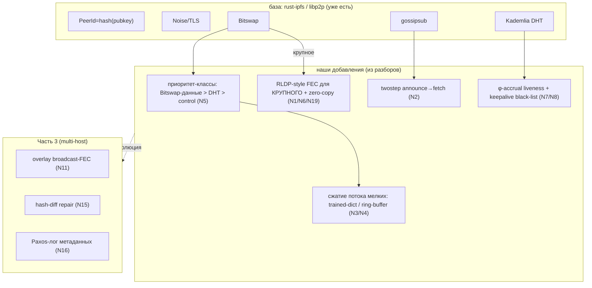

# Networking Ideas — синтез 4 сетевых разборов → наш libp2p/Bitswap-слой и фазы

> Сводит выводы из [YDB-Interconnect.md](YDB-Interconnect.md) (YDB),
> [scylladb-networking.md](scylladb-networking.md), [oceanbase-networking.md](oceanbase-networking.md)
> и [ton-networking.md](ton-networking.md) в одно: **что берём в сетевой слой демона, в какую фазу
> [PLAN.md](../../PLAN.md), и как это меняет дизайн**.

**База у нас — `rust-ipfs`/libp2p** (Bitswap для блоков, Kademlia DHT, gossipsub, secure transport,
multiaddr/PeerId). Поэтому многое из разборов мы **уже имеем по умолчанию**; ценность — в идеях
**сверх дефолта libp2p**. Самый релевантный источник — **TON** (это P2P, а не БД-RPC).

TL;DR: главное заимствование — **FEC (fountain codes) для надёжной отдачи КРУПНОГО контента**
(TON RLDP) + **сжатие потока мелких сообщений** (Scylla trained-dict / OceanBase ring-buffer) +
**twostep announce→fetch** (дедуп полосы) + **приоритет-классы трафика** (Bitswap vs DHT vs control).
Сетевые улучшения ложатся в основном на **Фазу 4** (интеграция IPFS) и **Часть 3** (multi-host).

---

## 1. Конвергенция: где 4 системы согласны

| Приём | YDB | ScyllaDB | OceanBase | TON | У нас (libp2p) |
|---|---|---|---|---|---|
| **Identity = hash(pubkey)** | — | — | — | ADNL id | **есть** (PeerId) |
| **Шифрованный транспорт** | TLS | TLS | (опц.) | ADNL channels | **есть** (Noise/TLS) |
| **Discovery (DHT/gossip)** | nameserver | gossip | RootService | DHT+Overlay | **есть** (Kademlia/gossipsub) |
| **Приоритет-классы трафика** | channel-гейты WDRR | scheduling-groups | pnio-группы+tenant | overlay-типы | ✖ **взять** |
| **Liveness-детект** | dead-peer 10с | **φ-accrual** | keepalive black-list | — | базовый → улучшить |
| **Сжатие трафика** | per-packet | **trained dict** | **ring-buffer stream** | (FEC ≠ сжатие) | ✖ **взять** |
| **Надёжный bulk-трансфер** | XDC+zero-copy | streaming | PALF fetch | **★ RLDP+FEC** | Bitswap → дополнить FEC |

> Вывод: identity/transport/discovery у нас уже есть (libp2p). **Берём сверх дефолта:**
> приоритет-классы, продвинутое сжатие, FEC-bulk, φ-liveness.

---

## 2. Каталог идей: берём / фаза / влияние

Источник: **IC**=YDB Interconnect, **SC**=ScyllaDB, **OB**=OceanBase, **TN**=TON, **⚪**=уже есть в libp2p.

| # | Идея | Ист. | Берём? | Фаза | Влияние |
|---|---|---|---|---|---|
| N1 | **★★ RLDP+FEC (fountain codes/RaptorQ) для крупного** поверх UDP | TN | ✅ да | **4 / Часть 2** | надёжная отдача крупных блоков/файлов без retransmit-чата |
| N2 | **★ twostep announce→fetch** (анонс CID → тело тянут желающие) | TN | ✅ да | **4** | дедуп полосы при дублирующихся want |
| N3 | **★ Сжатие мелких сообщений: trained zstd-dict** (Scylla) | SC | ✅ да | **4** | кратно лучший ратио на потоке однотипных (CID/want/have) |
| N4 | **★ ...либо ring-buffer stream-сжатие** (OceanBase) — дешевле dict | OB | ◑ альт | **4** | та же выгода без раздачи словаря |
| N5 | **★ Приоритет-классы трафика** (Bitswap-данные > DHT > control) | IC/SC/OB | ✅ да | **4** | крупная отдача не душит метаданные/DHT |
| N6 | **zero-copy отдача крупного** (MSG_ZEROCOPY / отдельный канал) | IC | ✅ да | **4** | меньше CPU/копий при отдаче с 60 HDD |
| N7 | **φ-accrual детектор отказов** (адаптивный порог «мёртв») | SC | ✅ да | **4/5** | меньше ложных отключений при джиттере |
| N8 | **keepalive black-list** (не слать на недоступный пир) | OB | ✅ да | **4** | меньше зависших запросов блоков |
| N9 | **handshake broker** (лимит одновременных рукопожатий) | IC | ◑ опц | **4** | защита от шторма реконнектов |
| N10 | **in-flight + backpressure + редоставка** | IC | ⚪/◑ | **4** | частично даёт QUIC; добить per-peer лимиты |
| N11 | **★ Overlay broadcast-FEC** (one-to-many раздача популярного) | TN | ◑ да | **Часть 3** | раздача без N× полной передачи |
| N12 | **DHT signed provider-records** | TN | ⚪ | **4** | защита от подмены поставщика (есть в libp2p) |
| N13 | **address-list / multiaddr** | TN | ⚪ | — | уже есть в libp2p |
| N14 | **gossip-членство пула/доменов** | SC | ◑ | **Часть 3** | обмен составом кластера |
| N15 | **row-level hash-diff repair** (передать только дельту) | SC | ◑ | **Часть 3** | межузловой scrub/resilver минимальным трафиком |
| N16 | **Paxos-лог (PALF) только для метаданных кластера** | OB | ◑ | **Часть 3** | консенсус для состава/конфига, не для блоков |
| N17 | **fetch-catchup отставшего** (докачка дырок) | OB | ◑ | **Часть 3** | sync без полного перелива |
| N18 | **overlay member-certificate** (приватные топики) | TN | ◑ | **Часть 3** | контроль доступа к группам контента |
| N19 | **FEC congestion-control** (rldp2) | TN | ◑ | **4** | стабильный темп FEC-отдачи под потери |

---

## 3. Целевой сетевой дизайн (синтез)

---

## 4. Дельта по фазам

### Фаза 4 — Интеграция с IPFS-демоном (основной фокус сетевых идей)
- **Приоритет-классы трафика** (N5): отдача блоков Bitswap > DHT-запросы > служебное (libp2p
  connection/stream priorities + наш scheduler).
- **Сжатие потока мелких сообщений** (N3/N4): trained zstd-dict (Scylla) **или** ring-buffer
  stream-сжатие (OceanBase) для want/have/CID-листов; per-block zstd — отдельно (storage).
- **twostep announce→fetch** (N2): анонс CID в gossipsub → тело тянут только желающие.
- **φ-accrual liveness + keepalive black-list** (N7/N8): адаптивный детект мёртвых пиров.
- **zero-copy отдача крупного** (N6) с 60 HDD; (опц.) **handshake broker** (N9), **per-peer
  in-flight лимиты** (N10).

### Фаза 4 / Часть 2 — FEC bulk-трансфер
- **★ RLDP-style FEC** (N1/N19): надёжная отдача **крупных** блоков/файлов поверх UDP/QUIC через
  fountain codes (RaptorQ) — дополнение к Bitswap; congestion-control. (Прототип в Фазе 4,
  продакшен-оптимизация — Часть 2.)

### Часть 3 — Multi-host (кластер gateway'ев)
- **overlay broadcast-FEC** (N11) для one-to-many раздачи; **hash-diff repair** (N15) для межузловой
  синхронизации; **Paxos-лог метаданных** (N16) — только для состава/конфига кластера (блоки
  immutable → консенсус не нужен); **gossip-членство** (N14), **fetch-catchup** (N17),
  **member-certificate** (N18).

---

## 5. Что НЕ берём (и почему)

- **Actor-транспорт YDB** (доставка по TActorId) — у нас не actor-модель; libp2p достаточно.
- **Paxos/консенсус для самих блоков** — блоки **immutable content-addressed**, консенсус не нужен
  (Paxos — только для метаданных кластера, N16, Часть 3).
- **Своя замена libp2p** (как ADNL/pnio/Seastar-RPC) — переиспользуем libp2p; берём только идеи
  поверх (FEC, сжатие, приоритеты, liveness).
- **gossip вместо Kademlia** — у нас уже Kademlia DHT + gossipsub; отдельный gossip-протокол не нужен.

---

## 6. Итог: главные сетевые заимствования

1. **★★ FEC (fountain codes) для крупного контента** (TON RLDP) — надёжная отдача поверх ненадёжного
   транспорта **без по-пакетных ретрансмитов**; one-to-many через overlay-FEC — Фаза 4 / Часть 2/3.
2. **★ Сжатие потока мелких сообщений** — trained zstd-dict (Scylla) или ring-buffer stream
   (OceanBase) для Bitswap want/have/CID — Фаза 4.
3. **★ twostep announce→fetch** (TON) — дедуп полосы на дублирующихся запросах — Фаза 4.
4. **★ Приоритет-классы трафика** (YDB/Scylla/OceanBase) — крупная отдача не душит DHT/control — Фаза 4.
5. **φ-accrual liveness + keepalive black-list** — адаптивный детект мёртвых пиров — Фаза 4/5.

> **Архитектурный вывод:** наш сетевой слой = **libp2p (identity/DHT/pubsub/Bitswap) + надстройки**:
> FEC-bulk, продвинутое сжатие, приоритеты, φ-liveness. **TON — главный референс** (P2P, FEC);
> YDB/Scylla/OceanBase дали приоритеты, сжатие и liveness. Эти идеи меняют [PLAN.md](../../PLAN.md)
> Фазу 4 и Часть 3 — применить отдельным шагом по запросу.
