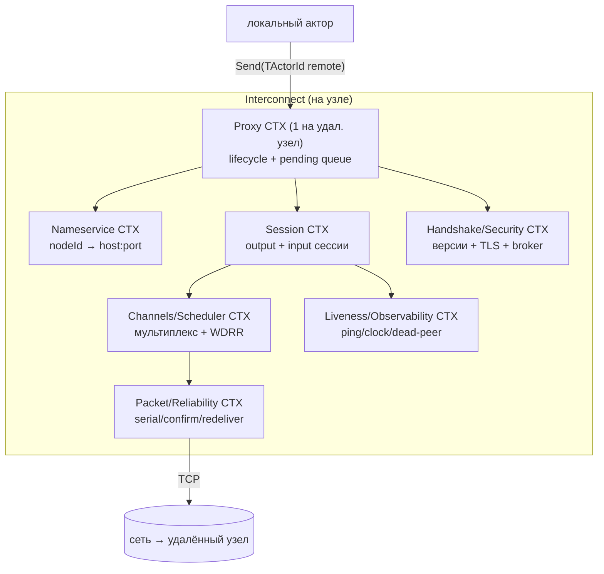
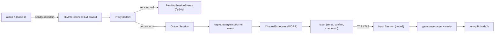
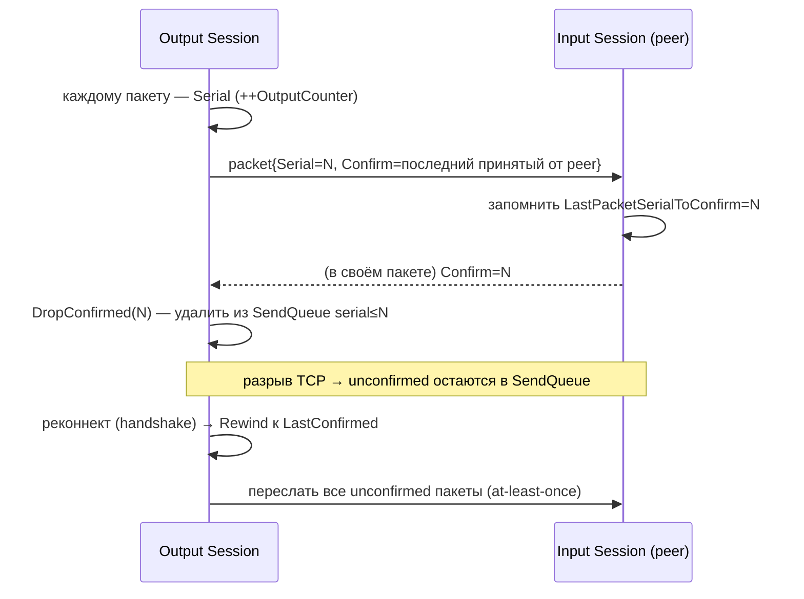
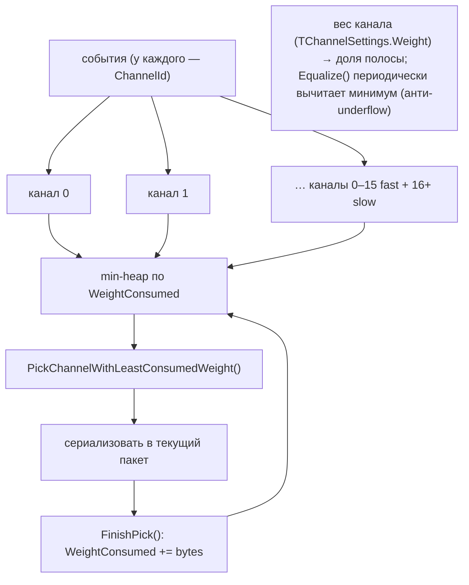
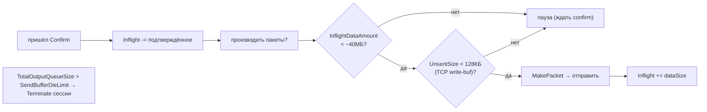
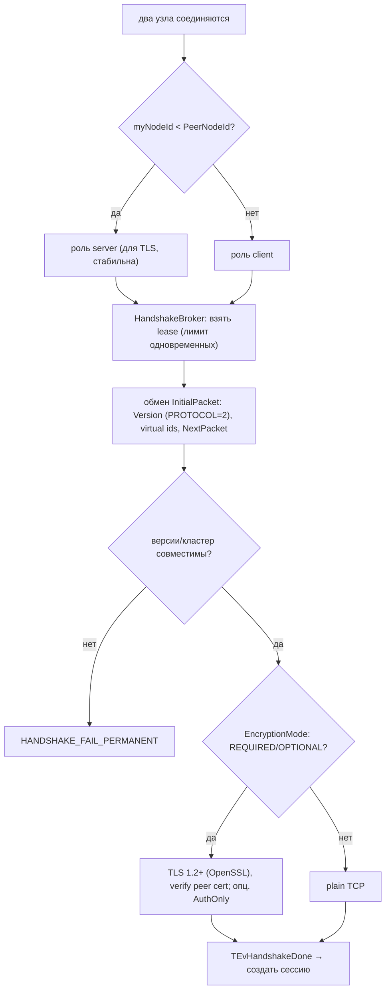
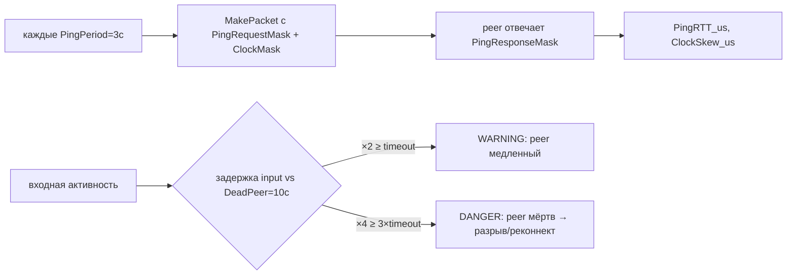

# YDB Interconnect — как устроен сетевой транспорт actor-системы YDB (DDD-разбор)

> Исследование исходников **ydb-platform/ydb** (`Vendor/YDB/ydb/library/actors/interconnect`,
> свежий слой, commit `0a1eedb67` от 2026-06-08). Все факты — с ссылками `файл:строка`,
> проверены в коде.

**Interconnect (IC)** — это слой, который доставляет сообщения между акторами **на разных узлах**
кластера поверх TCP, делая распределённую actor-систему прозрачной: актор шлёт сообщение по
`TActorId`, а если получатель на другом узле — IC сериализует, мультиплексирует, гарантирует
доставку и восстанавливает соединение. Для нашего демона это **референс сетевого слоя** (аналог
libp2p/Bitswap-транспорта): per-peer соединения, мультиплекс-каналы с приоритетами, flow-control,
zero-copy для крупных блоков, liveness, защищённый транспорт.

TL;DR: **один `TInterconnectProxy` на удалённый узел** → пара сессий (вход/выход) поверх TCP →
события пакуются в **пакеты с serial/confirm** (надёжность, редоставка при реконнекте) →
мультиплекс по **каналам с weighted-fair-scheduler** → крупные данные идут по **XDC + zero-copy**
→ соединение поднимается **handshake'ом** (версии, TLS, роли) → живость через **ping/clock-skew/
dead-peer**.

---

## 1. Bounded Contexts

| Контекст | Ответственность | Файлы |
|---|---|---|
| **Nameservice** | `nodeId → {host, addr, port, location}` (static/dynamic) | `interconnect_nameserver_*` |
| **Proxy** | один на пир-узел; lifecycle, pending-очередь, реконнект | `interconnect_tcp_proxy.*` |
| **Session** | output/input сессии над TCP; сериализация/отправка | `interconnect_tcp_session.*`, `..._input_session.cpp` |
| **Packet/Reliability** | пакеты, serial/confirm, редоставка | `packet.*` |
| **Channels/Scheduler** | каналы + weighted-fair мультиплекс | `interconnect_channel.*`, `channel_scheduler.h` |
| **Handshake/Security** | версии, TLS, broker одновременных handshake | `interconnect_handshake.*`, `handshake_broker.h`, `interconnect_stream.*` |
| **Liveness/Obs** | ping, clock-skew, dead-peer, watchdog, counters | `..._session.cpp`, `watchdog_timer.h`, `interconnect_counters.*` |

---

## 2. Архитектурные диаграммы (Mermaid)

### IC1. Путь сообщения: локальный актор → удалённый актор

### IC2. Надёжность: serial / confirm / редоставка при реконнекте

### IC3. Каналы + Channel Scheduler (weighted deficit round-robin)

### IC4. Flow-control / backpressure (два предела + редоставка)

### IC5. Handshake + TLS + broker

### IC6. Liveness: ping / clock-skew / dead-peer (эскалация)

---

## 3. Ubiquitous Language (термины IC)

| Термин | Значение | Где в коде |
|---|---|---|
| **Proxy** | актор-представитель одного удалённого узла | `interconnect_tcp_proxy.h:20` |
| **Session** | output/input актор над TCP-соединением | `interconnect_tcp_session.*` |
| **Channel** | очередь событий для мультиплекса (0–15 fast, 16+ slow) | `interconnect_channel.h:71`, `channel_scheduler.h:12` |
| **Packet** | кадр: `Confirm, Serial, Checksum, PayloadLen` + события | `packet.h:45` |
| **Serial / Confirm** | seq пакета / последний принятый от peer (ACK) | `packet.h:46`, `..._session.h:722` |
| **XDC** | external data channel (отд. сокет для крупных payload) | `..._session.h:652`, `interconnect_channel.h:35` |
| **Handshake / Broker** | установка соединения / лимит одновременных | `interconnect_handshake.*`, `handshake_broker.h` |
| **Dead peer** | таймаут объявления узла мёртвым (деф. 10с) | `..._session.h:99` |

---

## 4. Proxy / Session / Nameservice

- **Proxy — один на пир-узел** (`interconnect_tcp_proxy.h:20`): владеет lifecycle и **pending-
  очередью** событий до установления сессии. Локальная отправка `B@node2` → `TEvInterconnect::
  EvForward` → Proxy(node2) → (если нет сессии — в `PendingSessionEvents`; иначе — в Output Session).
- **Nameservice** (`interconnect_nameserver_table.cpp`): `nodeId → {Host, Address, Port, Location}`
  (статическая таблица или динамика); Proxy при старте шлёт `TEvGetNode(PeerNodeId)`.
- **Session lifecycle** (`interconnect_tcp_proxy.cpp:340–508`): `PendingActivation → PendingNodeInfo
  → PendingConnection → StateWork ↔ HoldByError`. Сбои: `TRANSIENT` (реконнект),
  `SESSION_MISMATCH` (рестарт), `PERMANENT` (стоп + экспоненциальный backoff `HoldByError`).
- **Subscriptions** (`subscription_manager.h`, `..._session.cpp:282`): акторы подписываются на
  `TEvNodeConnected/TEvNodeDisconnected`; при `Terminate()` сессия рассылает Disconnected всем.

## 5. Packet / надёжность доставки

- **Заголовок** `TTcpPacketHeader_v2` (`packet.h:45`): `Confirm(8) + Serial(8) + Checksum(4) +
  PayloadLength(2)`. Чексумма — CRC32c, либо **XXHash3** (при шифровании/договорённости).
- **Батчинг**: `FillSendingBuffer()` пакует несколько событий в один пакет (внутр. payload ~7.8КБ;
  XDC — до 16КБ). Крупное событие **режется на части** (`TCoroutineChunkSerializer`, state-machine
  INITIAL→BODY→DESCRIPTOR→SECTIONS), `LastPartFlag` помечает конец.
- **Надёжность**: каждый пакет — `Serial`; peer подтверждает `Confirm`. `DropConfirmed(confirm)`
  чистит `SendQueue` до подтверждённого; неподтверждённые при реконнекте **пересылаются**
  (`Rewind` к `LastConfirmed`) → **at-least-once** доставка, переживающая разрыв TCP.

## 6. Каналы, scheduler, flow-control, XDC/zero-copy

- **Каналы** (`channel_scheduler.h:12`): 16 fast (`std::array`) + slow (`THashMap`), событие
  попадает в канал по `IEventHandle::ChannelBits`. **Weight** на канал (`TChannelSettings.Weight`).
- **Scheduler — WDRR** (`channel_scheduler.h:45`): min-heap по `WeightConsumed`,
  `PickChannelWithLeastConsumedWeight()` → `FinishPick(bytes)` → `Equalize()`. Честная доля полосы
  по весам; ни один канал не голодает.
- **Flow-control** (`..._session.cpp:554`): два предела — **InflightDataAmount < ~40МБ**
  (`DEFAULT_TOTAL_INFLIGHT_DATA`) и **UnsentSize < 128КБ** (TCP write-buf); при превышении
  `SendBufferDieLimit` сессия **терминируется**. Confirm уменьшает inflight.
- **XDC + zero-copy** (`interconnect_zc_processor.*`, `outgoing_stream.h`): крупные payload идут по
  **отдельному сокету** (XDC); **MSG_ZEROCOPY** (Linux, `SO_ZEROCOPY`) шлёт через `sendmsg`+iovec
  без копий; `TRope`/span-буферы рефкаунтятся, completion из error-queue. Порог ZC — **16КБ**.

## 7. Handshake + security

- **Версии** (`interconnect_handshake.h:14`): `INTERCONNECT_PROTOCOL_VERSION=2`, XDC continuation 3,
  XDC stream 4; ранняя проверка совместимости кластера.
- **Роли**: `server = myNodeId < PeerNodeId` (`handshake.cpp:562`) — стабильны → TLS session resume,
  разрешение «одновременного connect».
- **Broker** (`handshake_broker.h`): лимит одновременных handshake (capacity + очередь FIFO→LIFO→
  random), RAII-lease — защита от resource-exhaustion при штормах реконнектов.
- **TLS** (`interconnect_stream.cpp:326`): OpenSSL, **TLS 1.2–1.3**, `SSL_VERIFY_PEER`, cipher-list;
  режимы `EEncryptionMode {DISABLED, OPTIONAL, REQUIRED}` + `AuthOnly` (TLS-аутентификация без
  шифрования payload).

## 8. Liveness и наблюдаемость

- **Ping/clock** (`..._session.cpp:1314`): каждые `PingPeriod=3с` — пакет с `PingRequestMask` +
  `ClockMask`; ответ `PingResponseMask`; меряются `PingRTT_us` и `ClockSkew_us`.
- **Dead-peer** (`..._session.h:99`, `.cpp:1214`): `DEFAULT_DEADPEER_TIMEOUT=10с`, **3-уровневая
  эскалация** (OK → WARNING ×2 → DANGER ×4/3 → разрыв).
- **Watchdog** (`watchdog_timer.h`): срабатывает только после **2 итераций** без перевзвода (даёт
  актору шанс) — защита от ложных срабатываний под нагрузкой. **Slowpoke/profiler** — детект
  застрявших операций; логирование стека при > 16мс.
- **Counters** (`interconnect_counters.h`): clock skew, session deaths, handshake fails, ping-
  histogram, disconnections, per-channel traffic, spurious/useful write-wakeups.

---

## 9. Извлечённые идеи для OpenZFS Daemon (сетевой слой)

Наш демон сетево опирается на `rust-ipfs`/libp2p (Bitswap/DHT). Часть IC-механизмов libp2p даёт
из коробки; **ценны идеи сверх дефолта**:

| Идея из IC | Где применить | Эффект |
|---|---|---|
| **Channel scheduler (WDRR по весам)** | приоритезация Bitswap-трафика: блоки vs DHT vs служебное — отдельные «каналы» с весами | без голодания; крупные передачи не душат метаданные |
| **In-flight + UnsentSize пределы + редоставка по serial/confirm** | per-peer backpressure при отдаче блоков; повтор недоставленного при реконнекте | не залить медленного пира; устойчивость к разрывам |
| **XDC + zero-copy (MSG_ZEROCOPY, порог 16КБ)** | крупные блоки/сегменты слать zero-copy отдельным каналом | меньше CPU/копий на отдаче 256КБ-блоков с 60 HDD |
| **Handshake broker (лимит одновременных)** | ограничить число одновременных установлений соединений | защита от шторма реконнектов |
| **Ping/clock-skew/dead-peer (3-уровневая эскалация)** | per-peer liveness поверх Bitswap; быстрый отказ от мёртвых пиров | меньше зависших запросов блоков |
| **Per-peer proxy + pending-очередь** | буферизовать запросы к пиру до установления соединения | не терять запросы на старте сессии |
| **TLS modes (disabled/optional/required) + AuthOnly** | конфиг защищённости транспорта | гибкая безопасность кластера |
| **Богатые counters** (RTT-гистограмма, clock skew, disconnections) | метрики сетевого слоя демона | наблюдаемость |

### Главное
**Cost-/weight-aware мультиплексирование + явный backpressure (in-flight) + zero-copy для крупного
+ надёжная редоставка по serial/confirm** — это шаблон сетевого слоя, который стоит применить к
отдаче блоков (Bitswap-аналог), особенно при раздаче 256КБ-блоков с 60 HDD многим пирам.

---

## 10. Источники в коде (для перепроверки)

- Proxy/session/nameservice: `interconnect_tcp_proxy.{h,cpp}` (proxy lifecycle, EvForward, реконнект),
  `interconnect_tcp_session.{h,cpp}`, `interconnect_tcp_input_session.cpp`,
  `interconnect_nameserver_{base.h,table.cpp}`, `subscription_manager.h`.
- Packet/reliability: `packet.{h,cpp}` (`TTcpPacketHeader_v2:45`, serial/confirm, checksum),
  `..._session.cpp` (`DropConfirmed`, `FillSendingBuffer`, `MakePacket`).
- Channels/flow/zc: `interconnect_channel.{h,cpp}`, `channel_scheduler.h`, `outgoing_stream.h`,
  `interconnect_zc_processor.{h,cpp}` (`ZcThreshold=16384`), `event_filter.h`.
- Handshake/security: `interconnect_handshake.{h,cpp}` (`PROTOCOL_VERSION=2:14`, `server role:562`),
  `handshake_broker.h`, `interconnect_stream.cpp` (TLS), `interconnect_common.h` (`EEncryptionMode`,
  `PingPeriod=3с`), `types.h` (`TSessionParams`).
- Liveness/obs: `..._session.{h,cpp}` (`DEFAULT_DEADPEER_TIMEOUT=10с:99`, ping/clock),
  `watchdog_timer.h`, `slowpoke_actor.h`, `profiler.h`, `interconnect_counters.{h,cpp}`.
