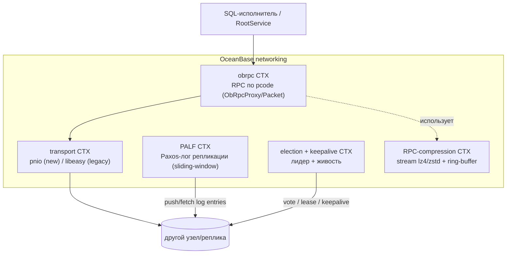
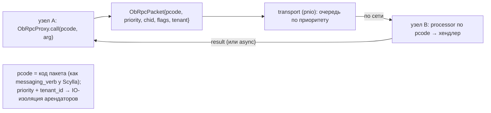
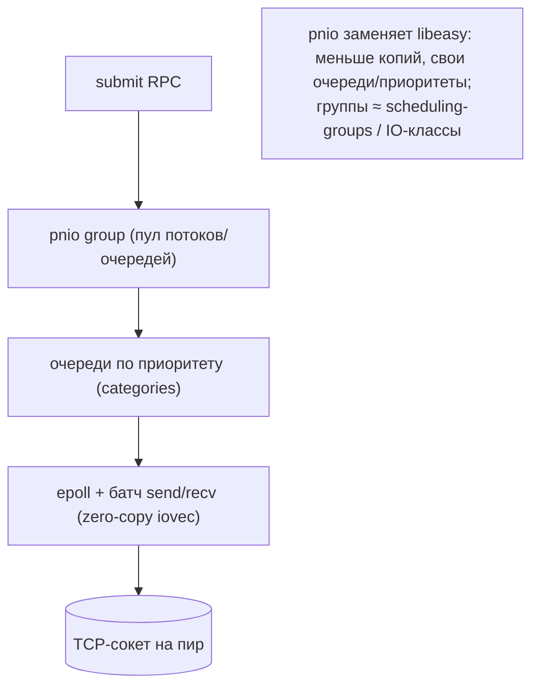
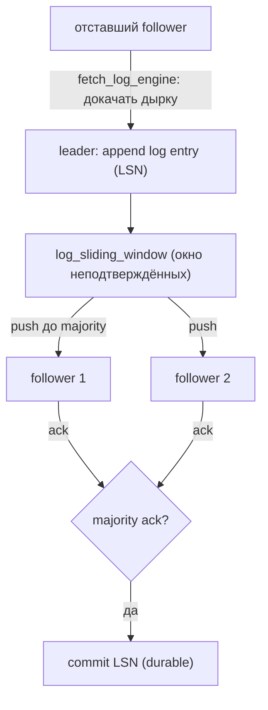
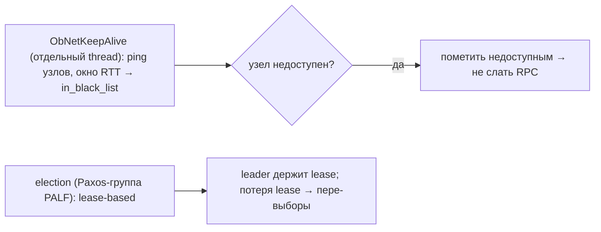
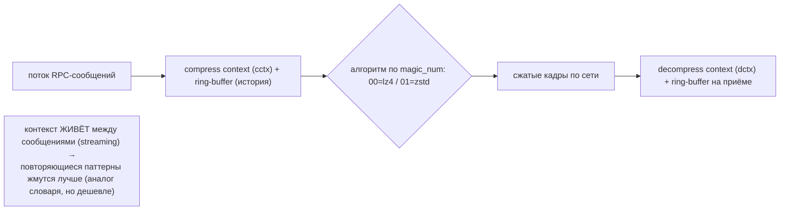

# OceanBase Networking — межузловой слой (DDD-разбор исходников)

> Исследование исходников **oceanbase/oceanbase** (`Vendor/oceanbase`, свежий слой, commit
> `10912161` от 2026-03-16). Все факты — с ссылками `файл:строка`, проверены в коде. Документ — по
> образцу [YDB Interconnect](YDB-Interconnect.md) и [ScyllaDB networking](scylladb-networking.md).

В OceanBase **нет «Interconnect» и нет gossip** — это распределённая **SQL-БД с Paxos**. Межузловой
слой: **obrpc** (RPC по `pcode`) поверх транспорта **pnio** (новый) / **libeasy** (legacy);
репликация — **PALF** (Paxos-лог, sliding-window + fetch-catchup); живость/лидерство — **keepalive +
election**; трафик жмётся **stream-компрессором (lz4/zstd) с переиспользуемым ring-buffer контекстом**.

TL;DR: вызов удалённого хендлера по **`pcode`** (как verb) через **obrpc** → транспорт **pnio**
(высокопроизв. private net IO, очереди/приоритеты) → данные между репликами реплицируются
**Paxos-логом PALF** (скользящее окно + докачка отстающих) → лидер выбирается **election**, живость —
**keepalive** → RPC-поток сжимается **stream-компрессором с ring-buffer** (контекст живёт между
сообщениями — выгодно для потока однотипных мелких RPC).

---

## 1. Bounded Contexts

| Контекст | Ответственность | Файлы |
|---|---|---|
| **obrpc** | RPC-фреймворк по `pcode` (proxy/packet/processor) | `deps/oblib/src/rpc/obrpc/` |
| **transport (pnio/easy)** | сетевой IO: очереди, приоритеты, соединения | `deps/oblib/src/rpc/pnio/`, `…/easy/` |
| **PALF** | Paxos-лог репликации (sliding-window + fetch) | `src/logservice/palf/` |
| **election + keepalive** | выбор лидера + детект живости | `palf/election/`, `obrpc/ob_net_keepalive.*` |
| **RPC-compression** | stream-компрессор lz4/zstd + ring-buffer | `obrpc/ob_rpc_compress_*` |

---

## 2. Архитектурные диаграммы (Mermaid)

### N1. obrpc: вызов по pcode (verb-подобно)

### N2. pnio — private net IO (транспорт)

### N3. PALF — Paxos-лог репликации (sliding window + fetch)

### N4. election + keepalive (лидер и живость)

### N5. RPC-компрессия: stream-компрессор + ring-buffer контекст

---

## 3. Ubiquitous Language (термины OceanBase networking)

| Термин | Значение | Где в коде |
|---|---|---|
| **obrpc** | RPC-фреймворк по `pcode` | `obrpc/ob_rpc_proxy.*` |
| **pcode** (ObRpcPacketCode) | код пакета/«глагол» RPC | `obrpc/ob_rpc_packet.h:60` |
| **ObRpcPacket** | кадр RPC (pcode, priority, chid, flags, tenant) | `obrpc/ob_rpc_packet.h` |
| **pnio** | private net IO — новый транспорт | `deps/oblib/src/rpc/pnio/pkt-nio.h` |
| **libeasy** | легаси async-транспорт | `deps/oblib/src/rpc/easy/` |
| **PALF** | Paxos Append-only Log Filesystem (репликация) | `src/logservice/palf/log_engine.*` |
| **log_sliding_window** | окно неподтверждённых лог-записей | `palf/log_sliding_window.*` |
| **fetch_log_engine** | докачка лога отставшим follower'ом | `palf/fetch_log_engine.*` |
| **ObNetKeepAlive** | детект живости узлов | `obrpc/ob_net_keepalive.h:36` |
| **stream compressor** | lz4/zstd с ring-buffer контекстом | `obrpc/ob_rpc_compress_struct.h:93,175` |

---

## 4. obrpc — RPC по pcode

- **pcode** (`ob_rpc_packet.h:60`): `ObRpcPacketCode` — код «глагола» RPC; `ObRpcPacketSet` мапит
  `pcode ↔ idx ↔ name`. Каждый pcode → зарегистрированный processor/хендлер; узел **вызывает
  удалённую функцию** (`ObRpcProxy`), как verb-RPC у Scylla.
- **ObRpcPacket**: заголовок с `pcode`, `priority`, `chid` (channel id), `flags`, `tenant_id` →
  **изоляция арендаторов** (мульти-тенантность) и приоритеты на уровне RPC.
- **Proxy** (`ob_rpc_proxy.*` + `.ipp` + макросы): типобезопасные обёртки вызовов; sync/async.
- **poc_rpc_proxy** (`ob_poc_rpc_proxy.*`): прямой путь поверх pnio (минуя часть слоёв) для горячих RPC.

## 5. pnio / libeasy — транспорт

- **pnio** (`deps/oblib/src/rpc/pnio/pkt-nio.{c,h}`): «private net IO» — современный транспорт,
  заменяющий libeasy: собственные **группы/очереди по приоритету**, epoll, батч send/recv, меньше
  копирований. Структура: `nio` (event loop), `io`, `ds` (data structures), `alloc`.
- **libeasy** (`deps/oblib/src/rpc/easy/`): легаси async-фреймворк (исторический транспорт).
- Выбор транспорта конфигурируется; pnio — для высоконагруженных путей.

> Аналог: pnio-группы ≈ **scheduling-groups Scylla / channel-гейты YDB** — приоритезация сетевого IO.

## 6. PALF — Paxos-лог репликации + election

- **PALF** (`src/logservice/palf/log_engine.*`) — Paxos Append-only Log: единица репликации между
  репликами (clog). **leader** аппендит записи (LSN), **`log_sliding_window`** держит окно
  неподтверждённых, рассылает follower'ам; **commit при majority-ack**.
- **fetch_log_engine** (`palf/fetch_log_engine.*`): отставший follower **докачивает дырку** в логе
  (catch-up) — аналог streaming/anti-entropy, но на уровне Paxos-лога.
- **election** (`palf/election/`): lease-based выбор лидера группы; потеря lease → пере-выборы.

> Аналог: PALF ≈ **репликация по консенсусу** (у Scylla — streaming + repair без Paxos; у YDB —
> erasure-группы). Для нас Paxos-лог релевантен лишь для **метаданных кластера** (Часть 3), не для
> самих блоков (они immutable, консенсус не нужен).

## 7. keepalive — живость узлов

`ObNetKeepAlive` (`ob_net_keepalive.h:36`, отдельный `ThreadPool`): периодический ping узлов, окно
RTT/таймаутов → перевод узла в `in_black_list` (недоступен) → RPC на него не отправляются. Восстановление
при возобновлении ответов.

> Аналог: keepalive ≈ **dead-peer YDB / φ-детектор Scylla** (здесь — окно-таймаут, не φ-accrual).

## 8. RPC-компрессия — stream-компрессор + ring-buffer

- `ob_rpc_compress_struct.h`: **ObStreamCompressor** (`:93`) с **ring-buffer** (`ring_buffer_`,
  `ring_buffer_size_`) и отдельными **cctx/dctx** (контексты сжатия/расжатия). Алгоритм кодируется в
  `magic_num` (`:175`): **00 = lz4, 01 = zstd**.
- **★ Потоковое сжатие с переиспользуемым контекстом**: ring-buffer хранит «историю» предыдущих
  сообщений, поэтому повторяющиеся паттерны в потоке RPC жмутся лучше — **эффект, близкий к
  словарю Scylla, но дешевле** (контекст копится на лету, без отдельного обучения/раздачи).

> ★ Для нас: **streaming-сжатие RPC/Bitswap с переиспользуемым контекстом** — простая альтернатива
> обучаемому словарю Scylla: тоже улучшает ратио на потоке однотипных мелких сообщений, без
> инфраструктуры раздачи словаря.

---

## 9. Сравнение трёх подходов

| Аспект | YDB Interconnect | ScyllaDB networking | OceanBase networking |
|---|---|---|---|
| Парадигма | actor-транспорт (`TActorId`) | verb-RPC (Seastar) | **pcode-RPC (obrpc)** |
| Транспорт | свой TCP (proxy/session) | Seastar RPC | **pnio** (new) / libeasy |
| Членство/живость | ping/dead-peer 10с | gossip + **φ-детектор** | **keepalive + Paxos election** |
| Bulk/репликация | каналы + XDC | streaming мутаций + repair | **PALF (Paxos-лог) + fetch** |
| Приоритеты | channel-гейты (WDRR) | scheduling-groups | **pnio-группы + tenant priority** |
| Сжатие | per-packet | **обучаемый словарь** (zstd) | **stream + ring-buffer** (lz4/zstd) |

**Вывод:** три разные философии — **YDB** (actor), **ScyllaDB** (verb-RPC + gossip), **OceanBase**
(pcode-RPC + Paxos). Оригинальное у OceanBase: **мульти-тенантные приоритеты в RPC-пакете** и
**stream-сжатие с ring-buffer контекстом**.

---

## 10. Извлечённые идеи для OpenZFS Daemon (сетевой слой)

| Идея из OceanBase | Где применить | Эффект |
|---|---|---|
| **★ Stream-сжатие RPC с ring-buffer контекстом** (lz4/zstd) | Bitswap-поток / отдача мелких блоков | лучший ратио на потоке однотипных, **без раздачи словаря** (проще, чем Scylla) |
| **pnio-группы приоритета + tenant_id в пакете** | классы сетевого IO (клиент vs фон) + изоляция «арендаторов» (разные потребители) | предсказуемая сетевая latency |
| **poc-RPC fast-path** (минуя слои для горячих RPC) | быстрый путь для частых Bitswap-want/have | меньше overhead на горячем |
| **keepalive black-list** (не слать RPC на мёртвый узел) | per-peer быстрый отказ | меньше зависших запросов |
| **PALF sliding-window + fetch-catchup** | (Часть 3) реплицируемый **лог метаданных кластера** (состав пула/домены), не блоки | консенсус только для метаданных |
| **fetch-catchup отставшего** | докачка «дырок» при resilver/sync вместо полного перелива | минимум трафика |

### Главное
**Stream-сжатие RPC с переиспользуемым ring-buffer контекстом** — практичная альтернатива
обучаемому словарю ScyllaDB: тот же выигрыш на потоке мелких однотипных сообщений (Bitswap, CID),
но без инфраструктуры обучения/раздачи словаря. Для Части 3 — **Paxos-лог (PALF) только для
метаданных кластера** (блоки immutable → консенсус для них не нужен).

---

## 11. Источники в коде (для перепроверки)

- obrpc: `deps/oblib/src/rpc/obrpc/ob_rpc_packet.h:60` (pcode), `ob_rpc_proxy.{h,cpp,ipp}`,
  `ob_poc_rpc_proxy.*`, `ob_rpc_net_handler.*`.
- transport: `deps/oblib/src/rpc/pnio/pkt-nio.{c,h}`, `…/pnio/{nio,io,ds,alloc}`,
  `deps/oblib/src/rpc/easy/` (legacy).
- PALF: `src/logservice/palf/log_engine.*`, `log_sliding_window.*`, `fetch_log_engine.*`,
  `fixed_sliding_window.h`, `palf/election/`.
- keepalive: `deps/oblib/src/rpc/obrpc/ob_net_keepalive.h:36`.
- compression: `deps/oblib/src/rpc/obrpc/ob_rpc_compress_struct.h:93,175`,
  `ob_rpc_compress_protocol_processor.*`, `lib/compress/ob_compressor_pool.h`.
