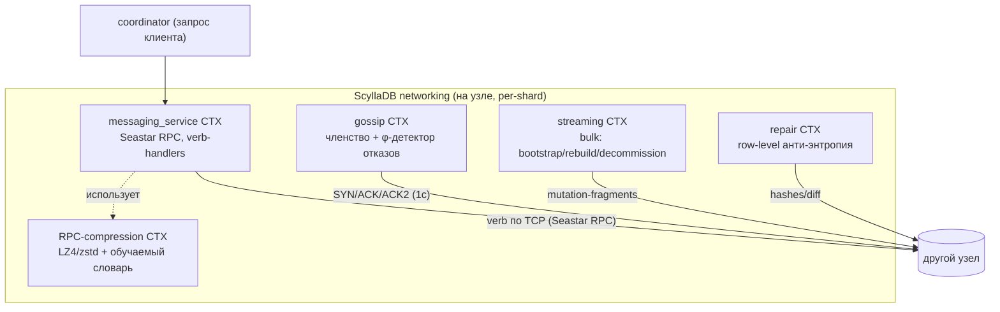
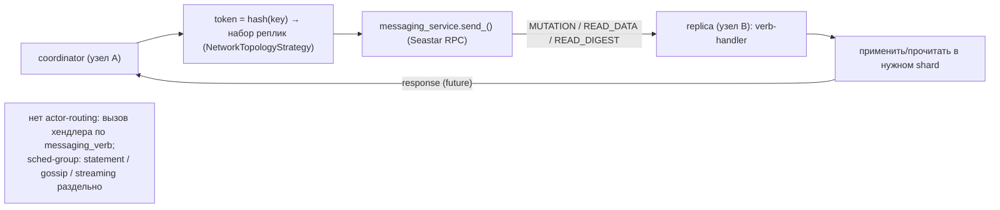
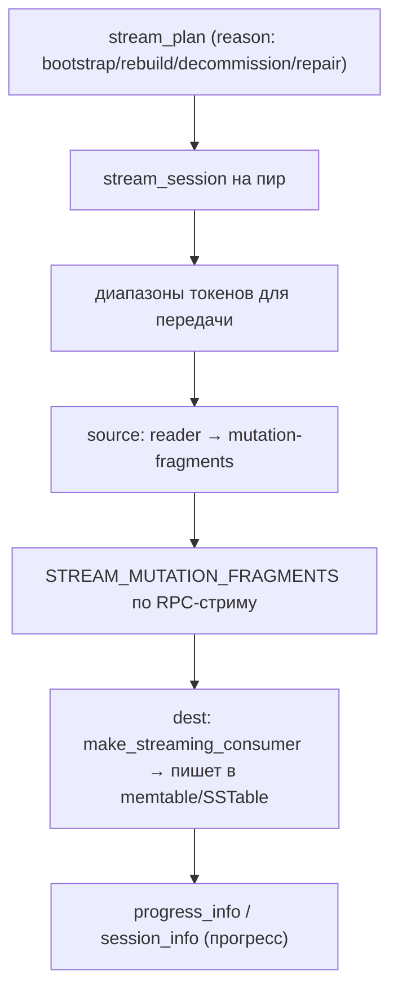
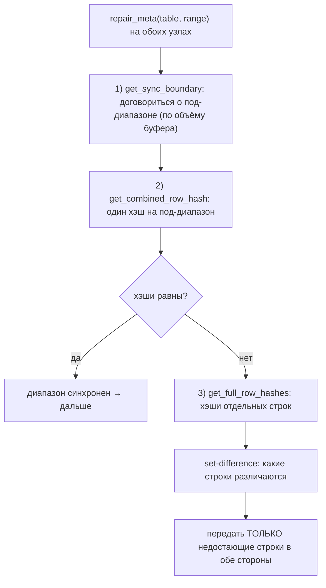
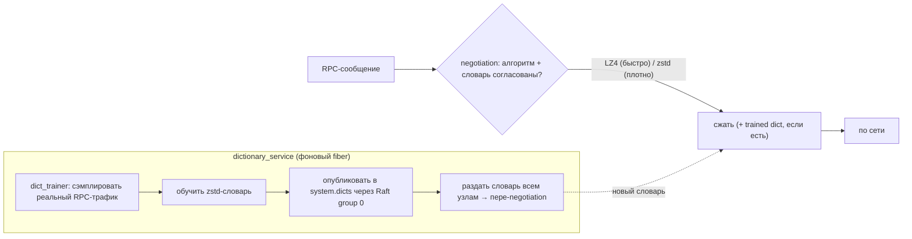

# ScyllaDB Networking — межузловой слой (DDD-разбор исходников)

> Исследование исходников **scylladb/scylladb** (`Vendor/ScyllaDB`, свежий слой, commit `d974bf0d`
> от 2026-06-08). Все факты — с ссылками `файл:строка`, проверены в коде. Документ — по образцу
> [YDB Interconnect](YDB-Interconnect.md), для сравнения двух подходов к межузловой связи.

В ScyllaDB **нет компонента «Interconnect»** (это терминология YDB). Межузловой слой устроен иначе:
**verb-based RPC поверх Seastar RPC** (`netw::messaging_service`) + **gossip** (членство/детектор
отказов) + **streaming** (массовая передача) + **row-level repair** (анти-энтропия) + **adaptive
RPC-компрессия с обучаемым словарём**. Это «Cassandra-модель» (request/response по «глаголам»), а
не actor-транспорт.

TL;DR философии: **узел вызывает удалённый хендлер по `messaging_verb`** (MUTATION/READ_*/GOSSIP_*/
STREAM_*) через Seastar RPC; членство и живость — **gossip (1с) + φ-accrual детектор**; bulk —
**streaming мутаций-фрагментов**; согласование реплик — **row-level repair** (сверка хэшей диапазона
и передача только различий); трафик жмётся **LZ4/zstd с натренированным на трафике словарём**,
раздаваемым по кластеру через Raft.

---

## 1. Bounded Contexts



| Контекст | Ответственность | Файлы |
|---|---|---|
| **messaging_service** | verb-RPC транспорт поверх Seastar RPC | `message/messaging_service.{hh,cc}` |
| **gossip (gms)** | членство, генерации, φ-детектор отказов | `gms/gossiper.*`, `gms/endpoint_state.*` |
| **streaming** | массовая передача данных (мутации-фрагменты) | `streaming/stream_{plan,session,manager}.*` |
| **repair** | row-level сверка и синхронизация реплик | `repair/row_level.*`, `repair/repair.*` |
| **RPC-compression** | LZ4/zstd + обучаемый словарь | `message/advanced_rpc_compressor.*`, `dict_trainer.*`, `dictionary_service.*` |

---

## 2. Архитектурные диаграммы (Mermaid)

### N1. Verb-RPC: путь запроса coordinator → replica



### N2. Gossip: SYN / ACK / ACK2 + φ-детектор отказов

```mermaid
sequenceDiagram
    participant A as узел A (gossiper)
    participant B as узел B
    loop каждые INTERVAL=1с
        A->>A: heart_beat++ (своя generation)
        A->>B: GOSSIP_DIGEST_SYN (дайджесты: endpoint, generation, version)
        B-->>A: GOSSIP_DIGEST_ACK (что устарело у A + свои свежие)
        A->>B: GOSSIP_DIGEST_ACK2 (досылка запрошенного)
    end
    A->>A: φ-accrual detector: межприходные интервалы heartbeat →<br/>φ растёт при тишине; φ > порога → узел DOWN
    A->>B: GOSSIP_ECHO (подтверждение живости при UP)
```

### N3. Streaming: bootstrap/rebuild (мутации-фрагменты)



### N4. Row-level repair: сверка диапазона и синхронизация различий



### N5. Adaptive RPC-компрессия + обучение словаря



---

## 3. Ubiquitous Language (термины ScyllaDB networking)

| Термин | Значение | Где в коде |
|---|---|---|
| **messaging_service** | verb-RPC транспорт поверх Seastar RPC | `messaging_service.hh:251` |
| **messaging_verb** | тип сообщения (MUTATION/READ_DATA/GOSSIP_*/STREAM_*) | `messaging_service.hh:124` |
| **gossiper** | протокол членства (SYN/ACK/ACK2, 1с) | `gms/gossiper.hh`, `INTERVAL=1000мс:200` |
| **endpoint_state / generation / heart_beat** | состояние узла, поколение, счётчик живости | `gms/endpoint_state.*` |
| **φ-accrual detector** | вероятностный детектор отказов | `gms/` (failure detector) |
| **stream_plan / stream_session** | план/сессия массовой передачи | `streaming/stream_plan.*` |
| **repair_meta** | контекст row-level repair на (таблица, диапазон) | `repair/row_level.hh:56` |
| **advanced_rpc_compressor** | LZ4/zstd + обучаемый словарь | `message/advanced_rpc_compressor.hh:173` |
| **dictionary_service** | обучение и раздача словаря по кластеру | `message/dictionary_service.hh` |

---

## 4. messaging_service — verb-RPC поверх Seastar RPC

- **Verb-based RPC** (`messaging_service.hh:124`): enum `messaging_verb` — `MUTATION`, `MUTATION_DONE`,
  `READ_DATA`, `READ_MUTATION_DATA`, `READ_DIGEST`, `GOSSIP_DIGEST_SYN/ACK/ACK2/ECHO/SHUTDOWN`,
  `STREAM_MUTATION_DONE`, `COUNTER_MUTATION`, `MIGRATION_REQUEST`, … Каждый verb → зарегистрированный
  хендлер; узел **вызывает удалённую функцию**, не маршрутизирует акторов.
- **Per-shard** (`async_sharded_service` + `peering_sharded_service`, `messaging_service.hh:251`):
  свой messaging_service на ядро; соединения per-(peer,shard).
- **Опции** (`messaging_service.hh:282–337`): `encrypt_what {none/transitional/dc/rack/all}`,
  `compress_what`, `enable_advanced_rpc_compression`, `tcp_nodelay_what`, и **раздельные
  scheduling-groups** для `statement` / `streaming` / `gossip` — фон не душит клиентский RPC.
- **Транспорт** — **Seastar RPC** (мультиплекс, connection-management, бэкпрешер — на стороне Seastar);
  ScyllaDB добавляет verbs, неймспейсинг, компрессию.

> Аналог YDB: messaging_verb ≈ типы событий; но YDB — actor-транспорт (доставка по `TActorId`),
> Scylla — **RPC-вызов хендлера по verb**.

## 5. gossip — членство и детектор отказов

- **SYN/ACK/ACK2** каждые **`INTERVAL=1000мс`** (`gms/gossiper.hh:200`, `.cc:1154`): узел увеличивает
  `heart_beat` своей `generation`, шлёт дайджесты случайному пиру; пир отвечает, чего ему не хватает
  и что свежее у него; третий шаг — досылка.
- **endpoint_state**: на каждый узел — `generation` (растёт при рестарте) + `heart_beat_version` +
  `application_state` (статус, токены, host_id, …) (`gms/endpoint_state.*`).
- **φ-accrual failure detector**: межприходные интервалы heartbeat → значение φ; при тишине φ растёт,
  превышение порога → узел `DOWN` (вероятностно, адаптивно к джиттеру сети).
- **GOSSIP_ECHO** — подтверждение живости при переходе в UP (`gms/gossiper.hh:105`).

> Для нас: **gossip ≈ обнаружение пиров и их живость** (в libp2p частично есть; идея φ-детектора —
> адаптивный порог «мёртв», лучше фиксированного таймаута).

## 6. streaming — массовая передача (мутации-фрагменты)

- **Reason-driven** (`streaming/stream_reason.hh`): `bootstrap` (новый узел), `rebuild`,
  `decommission`, `removenode`, `repair`. `stream_plan` → набор `stream_session` на пиров.
- **Mutation-fragment based** (не пофайловый SSTable-трансфер): источник читает `reader` →
  **mutation-fragments** → `STREAM_MUTATION_FRAGMENTS` по RPC-стриму; приёмник
  `make_streaming_consumer` (`stream_manager.cc:89`) пишет в memtable/SSTable (с view-обновлением).
- **Прогресс**: `progress_info` / `session_info` (байты/диапазоны).

> Для нас: streaming ≈ **bulk-передача блоков** при resilver/перебалансе (наш resilver уже это
> делает по дискам; межузловой вариант — Часть 3).

## 7. row-level repair — анти-энтропия

`repair_meta` на (таблица, диапазон) с обеих сторон (`repair/row_level.hh:56`). Протокол
(`repair/row_level.cc`, стадии `get_sync_boundary` → `get_combined_row_hash` → `get_full_row_hashes`):
1. **`get_sync_boundary`** — согласовать под-диапазон по объёму (ограничение буфера).
2. **`get_combined_row_hash`** — один комбинированный хэш под-диапазона; равны → синхронно, пропуск.
3. **`get_full_row_hashes`** — при расхождении: хэши отдельных строк → **set-difference** → передать
   **только недостающие** строки в обе стороны.

> Для нас: row-level repair ≈ **межузловой scrub/resilver** (передаём только дельту по хэшам). Наш
> внутриузловой scrub/resilver уже близок; межузловой — Часть 3.

## 8. adaptive RPC-компрессия + обучаемый словарь

- **advanced_rpc_compressor** (`advanced_rpc_compressor.hh:173`): **LZ4** (быстро) / **zstd** (плотно),
  per-message; **negotiation-протокол** согласует алгоритм и словарь между пирами (`:159–188`).
- **★ Обучаемый словарь**: `dict_trainer` **сэмплирует реальный RPC-трафик** и обучает **zstd-словарь**;
  `dictionary_service` (`dictionary_service.hh:35`) запускает обучение (когда включена cluster-feature),
  **публикует словарь в `system.dicts` через Raft group 0** и раздаёт по кластеру → пере-negotiation.
  Идея: **много мелких однотипных сообщений сжимаются словарём кратно лучше**, чем поодиночке.

> ★ Для нас: **обучаемый словарь сжатия для МНОГИХ МЕЛКИХ БЛОКОВ/сообщений** — прямой выигрыш:
> CID/заголовки/мелкие блоки однотипны → zstd-dict даёт лучший ратио, чем per-block zstd. Можно
> применить и к телам мелких блоков (data-tier), и к Bitswap-сообщениям.

---

## 9. Сравнение с YDB Interconnect

| Аспект | YDB Interconnect | ScyllaDB networking |
|---|---|---|
| Парадигма | **actor-транспорт** (доставка по `TActorId`) | **verb-RPC** (вызов хендлера по `messaging_verb`) |
| Основа | свой TCP (proxy/session/channels) | **Seastar RPC** (фреймворк) |
| Надёжность | serial/confirm + редоставка | RPC request/response (семантика вызова) |
| Членство/живость | ping/clock-skew/dead-peer (10с) | **gossip (1с) + φ-accrual детектор** |
| Bulk-передача | каналы + XDC/zero-copy | **streaming мутаций-фрагментов** |
| Анти-энтропия | (storage-уровень: scrub/repl) | **row-level repair** (hash-diff) |
| Сжатие | per-packet (negotiated) | **LZ4/zstd + обучаемый словарь** (раздача через Raft) |
| Приоритеты | 12 channel-гейтов (WDRR) | **scheduling-groups** (statement/streaming/gossip) |

**Вывод:** обе системы решают одну задачу (надёжная межузловая связь + членство + bulk + анти-энтропия),
но **YDB строит низкоуровневый actor-транспорт**, а **ScyllaDB опирается на Seastar RPC + Cassandra-
модель (verb-RPC, gossip, streaming, repair)**. Самая оригинальная идея Scylla — **обучаемый словарь
сжатия RPC**, раздаваемый по кластеру.

---

## 10. Извлечённые идеи для OpenZFS Daemon (сетевой слой)

Наш демон сетево — на `rust-ipfs`/libp2p (Bitswap/DHT). Полезное из Scylla:

| Идея из Scylla | Где применить | Эффект |
|---|---|---|
| **★ Обучаемый словарь сжатия (zstd-dict) для мелких однотипных данных** | сжатие Bitswap-сообщений **и** мелких тел блоков в data-tier | кратно лучший ратио на мелочи, чем per-item zstd |
| **φ-accrual детектор отказов** (адаптивный порог) | liveness пиров вместо фикс. таймаута | меньше ложных «мёртв» при джиттере сети |
| **gossip для членства/метаданных** | при multi-host (Часть 3) — обмен составом пула/доменов | децентрализованное обнаружение |
| **row-level repair (hash-diff, передать только дельту)** | межузловой scrub/resilver (Часть 3): сверка по хэшам диапазона CID | минимум трафика при синхронизации реплик |
| **streaming мутаций-фрагментов с reason** | bulk-передача блоков при rebalance/rebuild по типу операции | управляемый bulk-трансфер |
| **scheduling-groups (statement/streaming/gossip)** | раздельные классы для Bitswap-отдачи vs фоновой sync | фон не душит клиентскую отдачу |
| **negotiation алгоритма/словаря на хендшейке** | согласование сжатия с пиром | гибкость без жёсткой привязки |

### Главное
**Обучаемый словарь сжатия (zstd-dict) для множества мелких однотипных блоков/сообщений** —
сильнейшее заимствование: на content-addressed мелочи (CID, заголовки, мелкие тела) словарь даёт
заметно лучший ратио, чем независимое сжатие. Плюс **φ-accrual liveness** и **hash-diff repair**
(передавать только дельту) для будущего multi-host (Часть 3).

---

## 11. Источники в коде (для перепроверки)

- messaging: `message/messaging_service.hh:124` (verbs), `:251` (класс), `:282–337` (encrypt/compress/
  tcp_nodelay/scheduling-groups).
- gossip: `gms/gossiper.hh:200` (`INTERVAL=1000мс`), `.cc:1154`, `gms/endpoint_state.*`,
  `gms/gossiper.hh:105` (echo), `gms/generation-number.*`.
- streaming: `streaming/stream_{plan,session,manager}.*`, `stream_manager.cc:89`
  (`make_streaming_consumer`), `streaming/stream_reason.hh`, `progress_info.*`.
- repair: `repair/row_level.hh:56` (`repair_meta`), `repair/row_level.cc` (`get_sync_boundary`,
  `get_combined_row_hash`, `get_full_row_hashes`).
- compression: `message/advanced_rpc_compressor.hh:38,58,159,173`, `message/dict_trainer.*`,
  `message/dictionary_service.hh:35`, `message/shared_dict.hh`.
