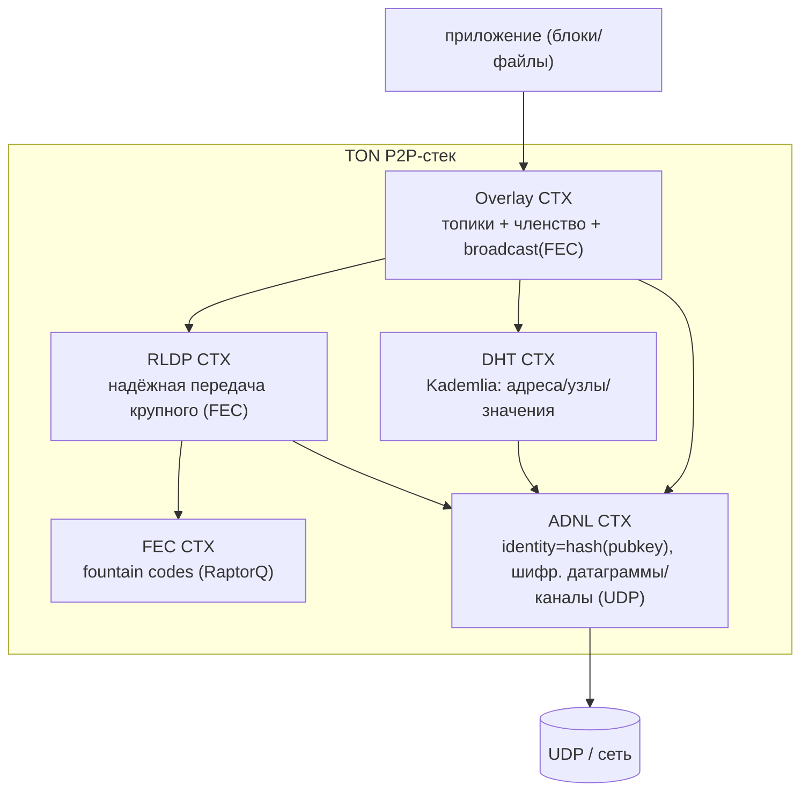
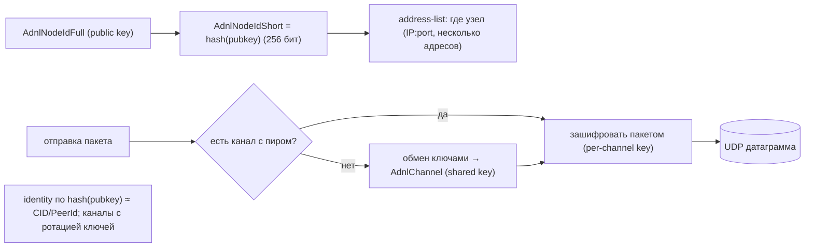
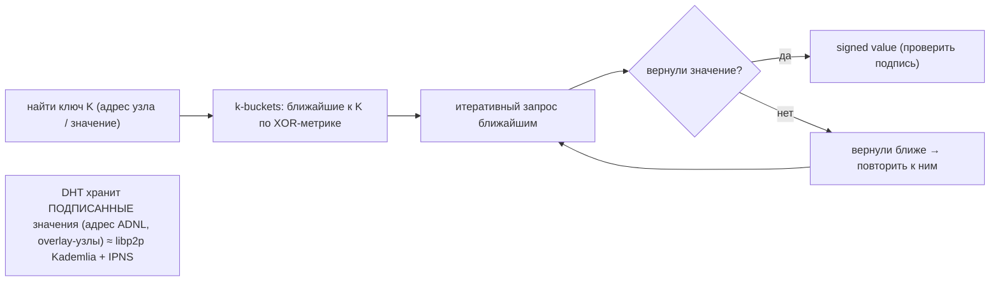
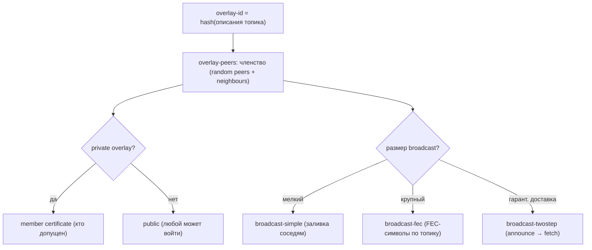
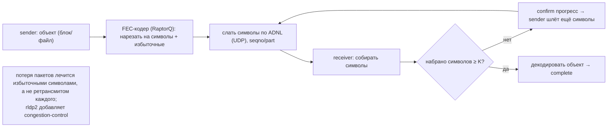
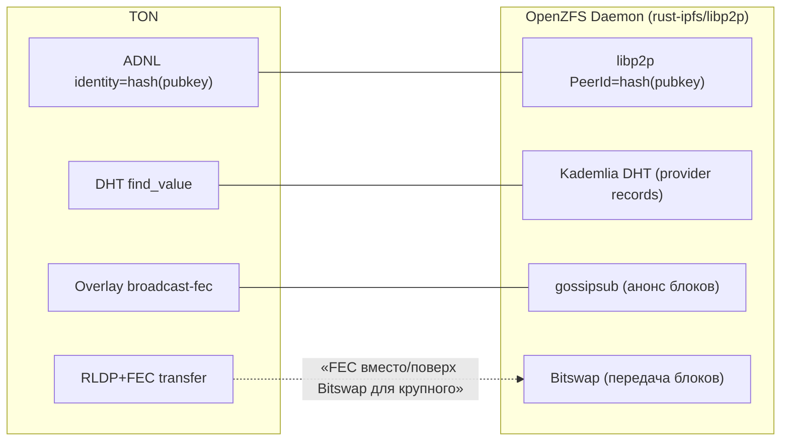

# TON Networking — P2P-стек ADNL / DHT / Overlay / RLDP (DDD-разбор исходников)

> Исследование исходников **ton-blockchain/ton** (`Vendor/TON`, свежий слой, commit `8e6f0917`).
> Все факты — с ссылками `файл:строка`, проверены в коде. Документ — по образцу
> [YDB Interconnect](YDB-Interconnect.md) / [ScyllaDB](scylladb-networking.md) /
> [OceanBase](oceanbase-networking.md) networking.

**Это самый релевантный для нас сетевой разбор:** TON — настоящий P2P-стек (а не actor/RPC-БД),
архитектурно близкий к **libp2p/IPFS**. Слои:

- **ADNL** (Abstract Datagram Network Layer) — базовый P2P: узел = `hash(pubkey)`, шифрованные
  датаграммы/каналы поверх UDP (≈ libp2p identity+transport+secure-channel).
- **DHT** — Kademlia поверх ADNL: разрешение адресов и поиск узлов/значений (≈ libp2p Kademlia DHT).
- **Overlay** — подсети-«оверлеи» (топики) с членством и **broadcast** (simple/FEC/twostep)
  (≈ libp2p gossipsub/pubsub + распространение контента).
- **RLDP** (Reliable Large Datagram Protocol) — надёжная передача **крупных** данных поверх ADNL
  через **FEC (fountain codes / RaptorQ)** (≈ надёжный bulk-трансфер; альтернатива/дополнение Bitswap).

TL;DR: **identity = hash(pubkey)** (как CID для пира) → шифрованные ADNL-датаграммы/каналы по UDP →
**DHT** находит адрес/узлы/значения → **Overlay** объединяет узлы в топики и **рассылает broadcast
с FEC** → крупные объекты тянутся **RLDP с FEC** (слать символы, пока приёмник не декодирует — без
по-пакетных ACK).

---

## 1. Bounded Contexts

| Контекст | Ответственность | Файлы |
|---|---|---|
| **ADNL** | identity, шифр. датаграммы, каналы, peer-table, адреса | `adnl/adnl-*` |
| **DHT** | Kademlia: k-buckets, find_node/find_value, signed values | `dht/dht-*` |
| **Overlay** | топики, членство, broadcast (simple/fec/twostep), сертификаты | `overlay/overlay-*`, `broadcast-*` |
| **RLDP** | надёжная передача крупного через FEC | `rldp/`, `rldp2/` |
| **FEC** | fountain codes (RaptorQ) | `fec/` |

---

## 2. Архитектурные диаграммы (Mermaid)

### T1. ADNL: identity + шифрованный канал + датаграмма

### T2. DHT: find_node / find_value (Kademlia)

### T3. Overlay: членство + типы broadcast

### T4. RLDP + FEC: надёжная передача крупного без по-пакетных ACK

### T5. Маппинг на наш IPFS/libp2p-демон

---

## 3. Ubiquitous Language (термины TON networking)

| Термин | Значение | Где в коде |
|---|---|---|
| **ADNL** | базовый P2P-слой (датаграммы/каналы) | `adnl/adnl-peer-table.*` |
| **AdnlNodeIdShort** | 256-бит id узла = hash(pubkey) | `adnl/adnl-node-id.hpp:28` |
| **AdnlNodeIdFull** | полный id (сам публичный ключ) | `adnl/adnl-node-id.hpp:88` |
| **AdnlChannel** | шифрованный канал с пиром (shared key) | `adnl/adnl-channel.h:32` |
| **address-list** | где узел (набор адресов) | `adnl/adnl-address-list.*` |
| **DhtMember** | узел Kademlia-DHT | `dht/dht.hpp:69` |
| **Overlay / overlay-id** | топик-подсеть = hash(описания) | `overlay/overlay-id.hpp` |
| **broadcast-fec / -simple / -twostep** | типы рассылки в оверлее | `overlay/broadcast-*.hpp` |
| **RLDP / TransferId** | надёжная передача крупного (256-бит id) | `rldp/rldp-peer.h:30` |
| **FecType** | тип fountain-кода (RaptorQ) | `fec/fec.h` |

---

## 4. ADNL — базовый P2P-слой

- **Identity = hash(pubkey)**: `AdnlNodeIdShort` (256 бит) — короткий id узла, вычисляется из
  `AdnlNodeIdFull` (публичный ключ) (`adnl/adnl-node-id.hpp:28,88`). Прямой аналог libp2p `PeerId`
  и нашей контент-адресности (id = хэш).
- **Шифрованные каналы**: `AdnlChannel` (`adnl/adnl-channel.h:32`) — после обмена ключами пара
  пиров общается по каналу с **общим ключом** (ротация ключей), датаграммы шифруются per-channel.
- **address-list** (`adnl/adnl-address-list.*`): у узла **несколько адресов** (как multiaddr libp2p);
  резолвятся через DHT.
- **peer-table** (`adnl/adnl-peer-table.*`): реестр известных пиров и их каналов; поверх **UDP**.

## 5. DHT — Kademlia поверх ADNL

- **DhtMember** (`dht/dht.hpp:69`) + **k-buckets** (`dht/dht-bucket.*`): классический Kademlia,
  XOR-метрика близости.
- **Запросы** (`dht/dht-query.*`): итеративные `find_node` / `find_value` к ближайшим узлам.
- **Подписанные значения**: DHT хранит **signed values** — разрешение `ADNL id → address-list`,
  поиск узлов оверлея, ключ-значение. Подпись защищает от подмены (≈ libp2p Kademlia + IPNS-записи).

## 6. Overlay — топики и broadcast

- **overlay-id = hash(описания)** (`overlay/overlay-id.hpp`): подсеть-«топик» (напр., шард/сервис).
- **Членство** (`overlay/overlay-peers.*`): узел держит набор соседей + случайных пиров топика;
  обмен списками. **Private overlay** требует **member certificate** (`OverlayMemberCertificate`,
  `overlay.hpp:90`) — кто допущен; **public** — открытый вход.
- **Broadcast** (`overlay/broadcast-*.hpp`):
  - **simple** — мелкие сообщения, заливка соседям;
  - **FEC** (`broadcast-fec`) — **крупные данные**: рассылка FEC-символов по топику (устойчиво к
    потерям, не нужен retransmit каждому);
  - **twostep** — announce(хэш) → получатели сами **fetch** тело (экономия полосы при дублях).

> ≈ libp2p **gossipsub** (топики + распространение), но с **FEC-broadcast** для крупного контента и
> **twostep** (announce-then-fetch) для дедупликации.

## 7. RLDP + FEC — надёжная передача крупного

- **RLDP** (`rldp/rldp-peer.h:30`): `TransferId=Bits256`; `RldpTransferSender` / `RldpTransferReceiver`
  передают **крупный объект** поверх ADNL-датаграмм.
- **FEC** (fountain codes, RaptorQ; `fec/fec.h`, `FecType`): объект режется на **символы** + избыточные;
  sender **шлёт символы потоком** (`receive_part(fec_type, part, total_size, seqno, …)`), receiver
  собирает, и как только набрал **достаточно символов (≥ K)** — **декодирует весь объект**.
  **Потери лечатся избыточными символами, а не ретрансмитом каждого пакета** → меньше round-trip'ов,
  устойчивость к loss на UDP. `confirm`-сообщения дают обратную связь о прогрессе.
- **rldp2** (`rldp2/`): улучшенная версия с **congestion-control** (FecHelper, оценка потерь/темпа).

> ★ Это **главная идея для нас**: надёжная отдача **крупных блоков/файлов** через FEC поверх UDP —
> альтернатива/дополнение Bitswap (TCP/QUIC + по-блочные запросы). Особенно выгодно при отдаче
> большого контента многим пирам с 60 HDD.

---

## 8. Сравнение с libp2p / IPFS (наш стек)

| Слой | TON | libp2p/IPFS (наш `rust-ipfs`) |
|---|---|---|
| Identity | ADNL `hash(pubkey)` | `PeerId = hash(pubkey)` — **то же** |
| Transport/secure | ADNL шифр. датаграммы (UDP) | libp2p (TCP/QUIC + Noise/TLS) |
| Адреса | address-list (резолв через DHT) | multiaddr (+ Kademlia) |
| Discovery | DHT (Kademlia, signed values) | Kademlia DHT (provider records) — **близко** |
| Pub/Sub | Overlay (simple/FEC/twostep broadcast) | gossipsub |
| Bulk-передача | **RLDP + FEC (fountain codes)** | **Bitswap** (запрос блоков) |

**Вывод:** TON и наш libp2p-стек концептуально совпадают по identity/DHT/pubsub. Уникальное у TON —
**FEC везде, где крупное**: RLDP-передача и overlay-broadcast на fountain codes, плюс **twostep
announce-then-fetch**.

---

## 9. Извлечённые идеи для OpenZFS Daemon (сетевой слой)

| Идея из TON | Где применить | Эффект |
|---|---|---|
| **★ RLDP+FEC для крупных блоков/файлов** (fountain codes поверх UDP) | отдача крупного контента многим пирам (дополнение Bitswap) | устойчивость к потерям без retransmit-чата; меньше RTT |
| **★ Overlay broadcast-FEC** (рассылка крупного по топику) | анонс/раздача популярного контента подписчикам | one-to-many без N×полной передачи |
| **twostep announce→fetch** | анонсировать CID, тело тянут только желающие | экономия полосы при дублирующихся запросах |
| **DHT signed values** | provider-записи/адреса с подписью | защита от подмены поставщика |
| **address-list (несколько адресов)** | пир доступен по нескольким путям | устойчивость подключения |
| **FEC congestion-control (rldp2)** | адаптивный темп отдачи под потери сети | стабильная пропускная без коллапса |
| **overlay member certificate** | приватные топики (доступ по сертификату) | контроль доступа к группам контента |

### Главное
**FEC (fountain codes) для крупного контента** — ключевое заимствование: RLDP-передача и
overlay-broadcast на RaptorQ дают надёжную доставку поверх ненадёжного UDP **без по-пакетных
ретрансмитов** и эффективную one-to-many раздачу. Для нашего демона (отдача 256КБ-блоков и крупных
файлов многим пирам с 60 HDD) это сильное дополнение к Bitswap; **twostep announce-then-fetch**
экономит полосу на дублях.

---

## 10. Источники в коде (для перепроверки)

- ADNL: `adnl/adnl-node-id.hpp:28,88` (Short/Full id = hash(pubkey)), `adnl/adnl-channel.h:32`,
  `adnl/adnl-address-list.*`, `adnl/adnl-peer-table.*`, `adnl/adnl-packet.*`.
- DHT: `dht/dht.hpp:69` (DhtMember), `dht/dht-bucket.*` (k-buckets), `dht/dht-query.*`,
  `dht/dht-remote-node.*`.
- Overlay: `overlay/overlay-id.hpp`, `overlay/overlay-peers.*`, `overlay/overlay.hpp:90` (cert),
  `overlay/broadcast-{simple,fec,twostep}.hpp`.
- RLDP/FEC: `rldp/rldp-peer.h:30,49` (TransferId, receive_part), `rldp/rldp.*`, `rldp2/FecHelper.cpp`,
  `fec/fec.h` (FecType, RaptorQ).
